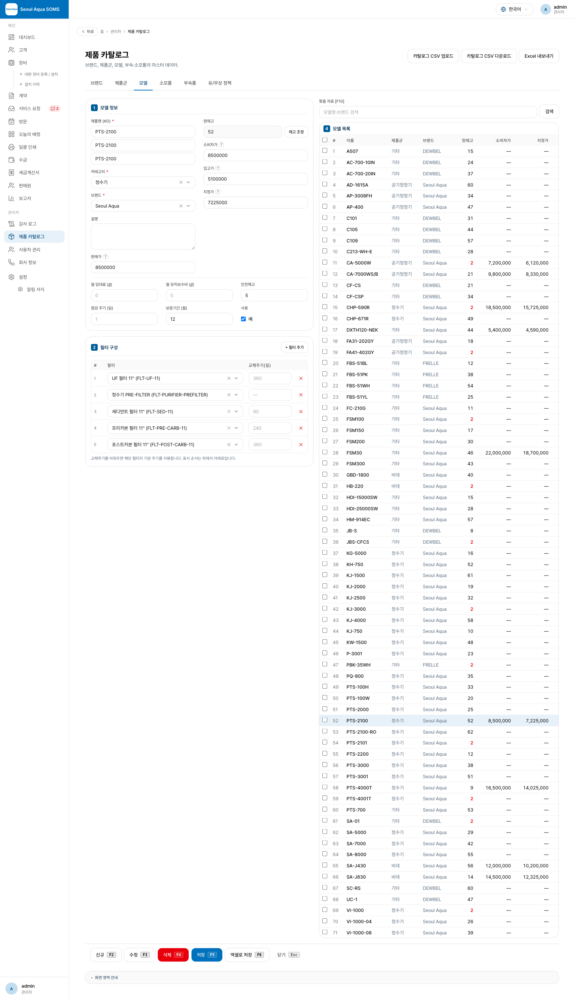
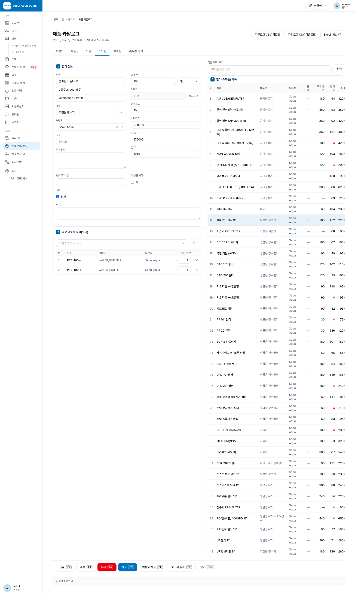
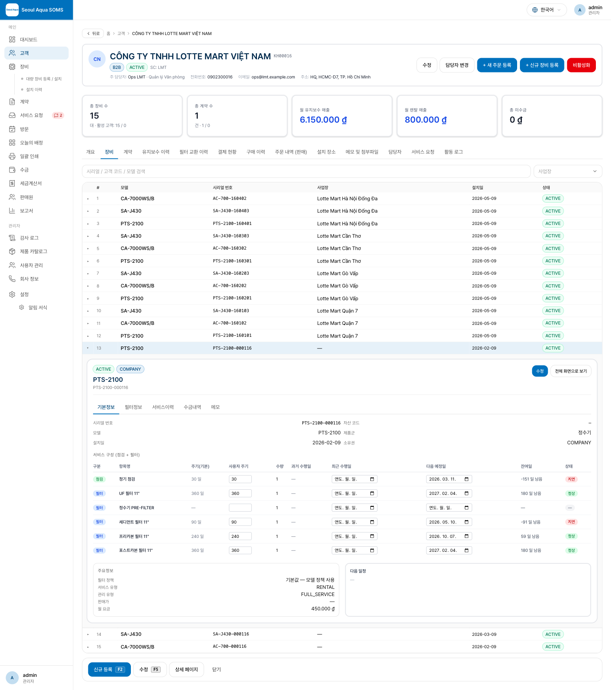

# 변경 사항 안내 (지난 배포 이후)

이번 배포는 클라이언트 목업 요청을 반영한 **① 재고 관리 신설 ② 제품·소모품 등록 화면 전면 재구성 ③ 고객별 장비 화면 재구성** 세 가지가 핵심입니다. 데스크톱 ERP 스타일 화면(좌 편집·우 목록 마스터-디테일, 하단 기능버튼, 단축키)으로 정돈했고, 제품·소모품에 재고와 가격 정보를 더했습니다. 개발자가 아닌 분도 이해할 수 있도록 "무엇이 어떻게 달라졌는지" 중심으로 정리했습니다.

---

## 1. 재고 관리가 새로 생겼습니다

제품(모델)과 소모품(필터)에 **현재고·안전재고**와 **입고가·지정가**가 추가되어, 물건이 얼마나 남았고 얼마에 사고파는지를 한 화면에서 관리합니다.

- **입고 / 출고 / 조정**: 각 항목의 **재고 조정** 버튼으로 창고 입고, 출고, 실사 조정을 기록합니다. 모든 변동은 이력(원장)으로 남아 언제·누가·왜 바뀌었는지 추적됩니다.
- **자동 차감**: 장비를 설치하면 해당 모델 재고가, 방문에서 필터를 교체하면 그 소모품 재고가, 주문을 납품(배송완료)하면 판매 소모품 재고가 **자동으로 줄어듭니다**. 손으로 맞출 필요가 없습니다.
- **저재고 경보**: 현재고가 안전재고 아래로 내려가면 목록·폼에서 **빨간색**으로 표시됩니다.
- **마이너스 재고 허용**: 현장 작업(설치·교체)을 막지 않기 위해 재고가 음수가 되는 것도 허용하며, 대신 경보로 알려줍니다. 실제 수량과 어긋나면 **조정**으로 바로잡습니다.
- **Excel**: 카탈로그 Excel 내보내기에 현재고·안전재고·입고가·지정가 컬럼이 추가되었습니다.

## 2. 제품·소모품 등록 화면이 목업과 동일하게 재구성됐습니다

제품 카탈로그의 **모델·소모품 탭**을 보내주신 데스크톱 ERP 목업 화면과 최대한 동일하게 재구성했습니다. 각 영역에는 목업처럼 **번호 배지(①②③④⑤)**를 붙였습니다.

**모델 탭**

- **① 모델 정보 — 2단 배치**: 좌측에 모델명·제품군·브랜드·모델설명·판매가, 우측에 현재고·소비자가·입고가·지정가를 나란히 두었습니다. 월임대료·월관리비·안전재고·점검주기·보증기간·활성 여부는 아래 보조 영역에 유지됩니다.
- **② 필터 구성**: 순번·필터명·교체주기(일)를 표로 관리하고, 필터를 고르면 교체주기가 자동으로 채워집니다.
- **③ 검색 / ④ 모델 목록(우측)**: 목록에 **체크박스 + 전체선택**이 생겨 여러 모델을 한 번에 골라 **일괄 비활성화**할 수 있습니다. 컬럼은 순번·모델명·제품군·브랜드·현재고·소비자가·지정가·입고가입니다.

**소모품(필터) 탭**

- **① 필터 정보 — 2단 배치**: 좌측에 필터명·제품군·브랜드·규격·주요용도, 우측에 교체주기·현재고·안전재고·소비자가·지정가·입고가. 맨 아래 **비고**는 전체 폭으로 넓게 입력합니다.
- **② 적용 가능한 장비(모델)**: 모델을 골라 **추가**하면 아래 표(모델명·제품군·브랜드·수량)에 쌓입니다. 모델 화면(모델→필터)과 소모품 화면(필터→모델) 양쪽에서 연결을 관리합니다.
- **③ 검색(우측 상단) / ④ 필터 목록**: 순번·필터명·**제품군**·브랜드·규격·교체주기·현재고·소비자가.

- **공통 — 하단 기능버튼 + 단축키**: 신규(F2)·수정(F3)·삭제(F4)·저장(F5)·엑셀로 저장(F6)·(소모품은 보고서 출력 F7)·닫기(Esc). 화면 하단에 각 영역 설명(①~⑤)도 함께 표시됩니다.

> 참고: 소모품 42종에 **제품군**이 채워지도록 기초 데이터를 보완했습니다(각 필터가 사용되는 기기의 제품군을 따라갑니다). 모델 폼 하단 "필터 구성" 표와 교체주기 단위(일/개월)는 이전 배포대로 유지됩니다.

## 3. 고객별 장비 화면이 "한 화면 · 그 자리에서 펼침"으로 정리됐습니다

이전에는 고객의 **장비 탭에서 목록**을 보고, 장비를 누르면 **별도 페이지로 이동**해야 했습니다. 이제 목록에서 장비를 누르면 **바로 그 행 아래에서 상세가 전체 폭으로 펼쳐집니다**(페이지 이동 없음).

- **인라인 펼침**: 선택한 행 바로 아래에 상세가 열리고, 다른 장비를 누르면 이전 것은 접히고 새 장비가 펼쳐집니다. 펼쳐질 때 **부드러운 애니메이션(0.4초)**으로 자연스럽게 열립니다.
- **탭 5개**: 선택한 장비의 상세를 기본정보 · 필터정보 · 서비스이력 · 수금내역 · 메모로 정리했습니다. 기본정보 탭에는 서비스 구성 표(점검·필터 예정, 날짜 인라인 수정)와 주요정보·다음 일정이 모두 모여 있습니다. 상세가 **표 전체 너비**를 쓰므로 이전의 좁은 우측 패널보다 한눈에 보기 편합니다.
- **스크롤 위치 유지**: 장비를 눌러도 화면이 위로 튀지 않고 **보던 위치에 그대로** 머뭅니다.
- **하단 기능버튼**: 신규 등록·수정·상세(전체 화면)·닫기.
- **전체 화면 보기 유지**: 기존 전용 장비 페이지(`/장비/상세`)는 그대로 남아 있어, 펼친 상세의 **"전체 화면"** 링크나 기존 링크로 접근할 수 있습니다. 뒤로 가기도 장비 탭에 그대로 머뭅니다.

---

## 참고

- 위 화면들의 재고 조정·가격 편집은 **매니저 이상** 권한에서 가능합니다(감사 기록 남음).
- 자세한 사용법은 사무실 사용자 매뉴얼(제품 카탈로그 · 고객/장비 장)을 참고하세요.
