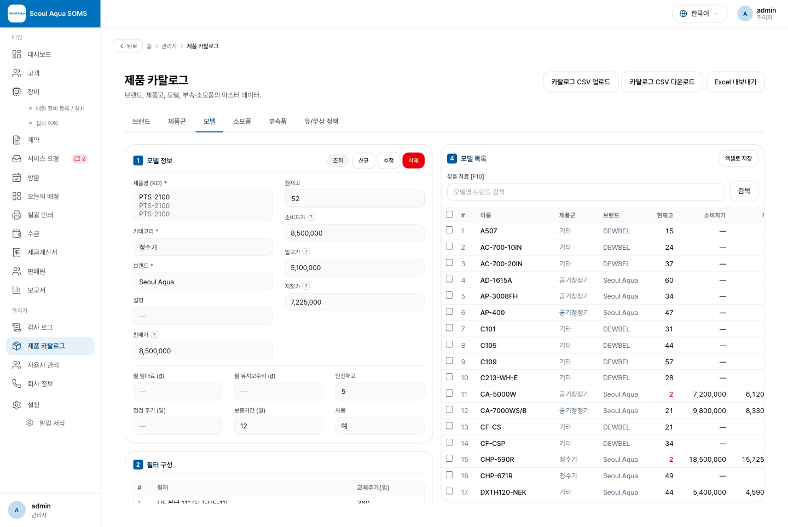
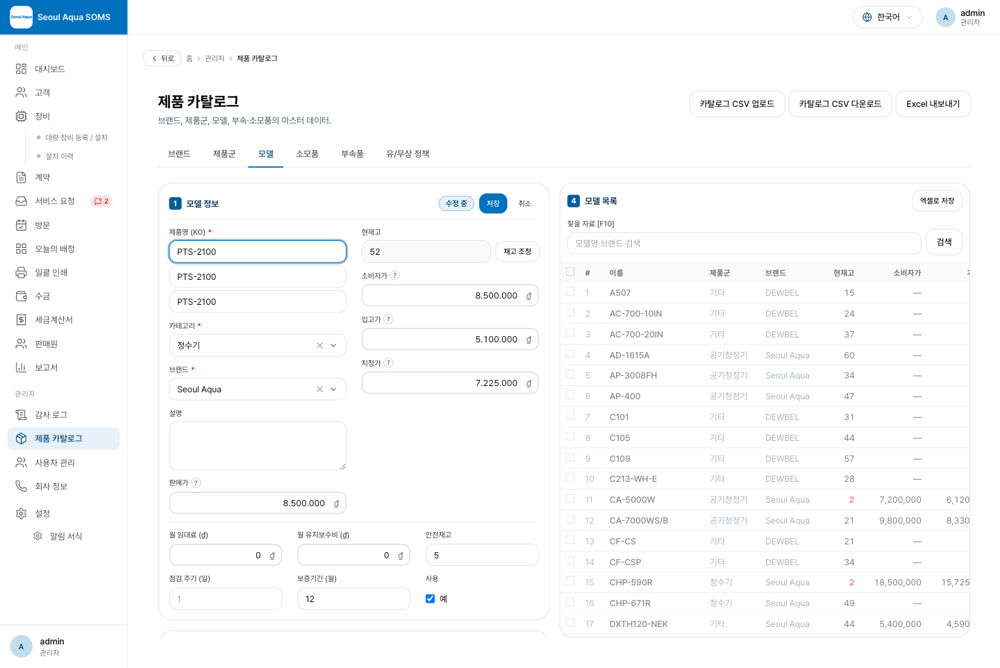
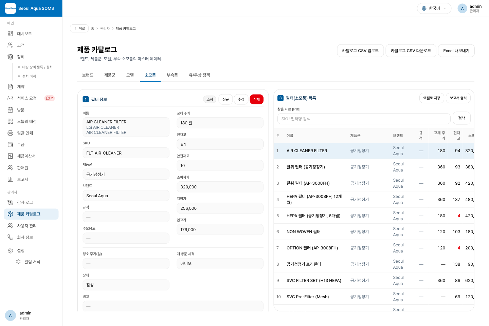
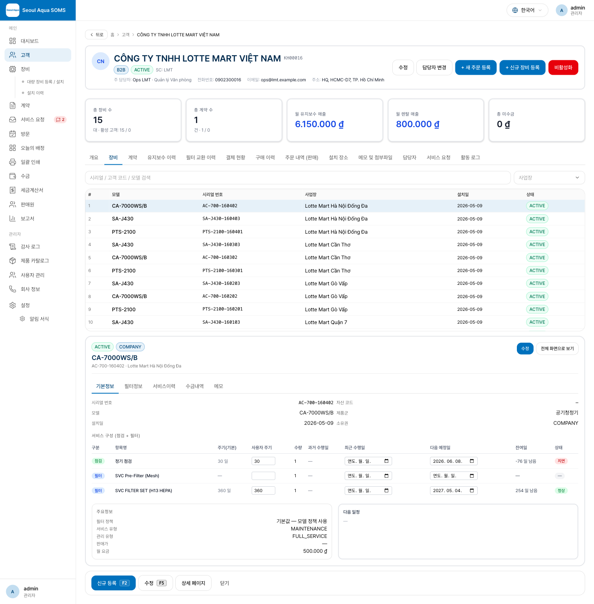
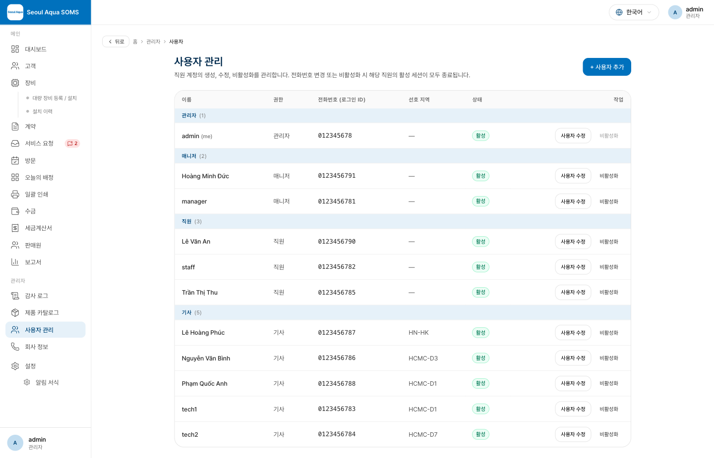

# 변경 사항 안내 (지난 배포 이후)

이번 배포의 핵심은 **화면 사용 방식(UX)의 정리**입니다. 제품·소모품 등록 화면을 **"조회 → 수정 → 신규" 상태가 명확히 구분되는 방식**으로 바꾸고, 고객 장비 화면과 사용자 관리 화면도 더 보기 쉽게 정돈했습니다. 개발자가 아닌 분도 이해할 수 있도록 "무엇이 어떻게 달라졌는지" 중심으로 정리했습니다.

---

## 1. 제품·소모품 등록 화면 — "조회 / 수정 / 신규"가 분명해졌습니다

이전에는 화면에 들어가면 **항상 입력이 가능한 상태**여서, 그냥 살펴보려던 값을 실수로 바꿀 수 있었습니다. 이제는 **먼저 읽기 전용(조회)으로 보여주고**, 고칠 때만 **[수정]**, 새로 만들 때만 **[신규]**를 눌러 편집합니다.

**① 조회 상태 (목록에서 항목을 고르면 기본으로 이 상태)**

- 항목을 고르면 값이 **읽기 전용**으로 표시되고, 상세 영역 우측 상단에 지금 상태를 알려주는 **배지(조회)** 와 **[신규] [수정] [삭제]** 버튼이 있습니다.
- **좌측 상세는 화면에 고정**되고, **우측 목록만 세로로 스크롤**됩니다. 페이지 전체가 길게 밀리지 않아, 목록을 넘겨보면서 왼쪽 상세를 계속 볼 수 있습니다.

**② 수정 / 신규 상태**

- **[수정]** 을 누르면 배지가 **"수정 중"** 으로 바뀌고 값이 입력 가능해지며, 버튼은 **[저장] [취소]** 만 남습니다. **[신규]** 를 누르면 빈 양식과 **"신규 등록"** 배지가 나타납니다.
- **저장하거나 취소하면 다시 조회 상태**로 돌아갑니다. 편집 중에는 **목록 선택이 잠겨**, 저장·취소 전에 다른 항목으로 새어 나가지 않습니다.
- **기능 버튼이 화면 맨 아래 바가 아니라 상세 영역 바로 위**에 있어, 보고 있는 항목 옆에서 바로 조작합니다. 목록 관련 기능(엑셀 내보내기·소모품 보고서)은 **목록 상단**으로 옮겼습니다.
- 단축키: **F2 신규 · F3 수정 · F5 저장 · Esc 취소**.

**소모품(필터) 탭도 동일한 방식입니다.**

## 2. 금액이 읽기 쉽게 — 천 단위로 끊어서 표시됩니다

편집할 때 큰 금액이 `8500000`처럼 붙어 나와 읽기 어려웠는데, 이제 **`8.500.000`처럼 천 단위로 끊어서** 표시됩니다(소비자가·판매가·입고가·지정가·월 임대료·월 관리비). 위 "수정 화면" 그림에서 확인할 수 있습니다. 빈칸은 여전히 "값 없음"으로 저장되어, 판매가를 비워두면 소비자가를 대신 쓰는 기존 동작이 그대로 유지됩니다.

## 3. 고객별 장비 화면 — "위 목록 / 아래 상세"로 정리됐습니다

장비를 누르면 그 행이 펼쳐지던 방식(아코디언)을 없애고, **위에는 장비 목록, 아래에는 선택한 장비의 상세**를 따로 보여줍니다.

- **위 목록**: 약 10줄 높이로 고정되고 **목록 안에서만 세로 스크롤**됩니다(제목 줄 고정). 장비를 누르면 **선택 표시만** 되고, 아래 상세가 그 장비로 바뀝니다.
- **아래 상세**: 선택한 장비를 **탭 5개**(기본정보 · 필터정보 · 서비스이력 · 수금내역 · 메모)로 보여줍니다. 아무것도 고르지 않으면 "위 목록에서 장비를 선택하세요" 안내가 표시됩니다.
- **전체 화면 보기 · 딥링크 · 뒤로 가기**는 이전과 동일하게 동작합니다.

## 4. 사용자 관리 — 역할별로 묶어서 보여줍니다

사용자 표를 **역할별 섹션**으로 나눴습니다. **관리자 → 매니저 → 직원 → 기사** 순서로 각 구역에 **역할 이름과 인원수**가 표시되고 그 아래 해당 사용자가 나열됩니다.

---

## 참고

- 위 화면들의 수정·가격 편집은 **매니저 이상** 권한에서 가능합니다(감사 기록 남음).
- 재고 관리(현재고·안전재고·입고/출고/조정·자동 차감)와 제품군·가격 필드는 이전 배포대로 그대로 유지됩니다.
- 자세한 사용법은 사무실 사용자 매뉴얼(제품 카탈로그 · 고객/장비 · 사용자 관리 장)을 참고하세요.
