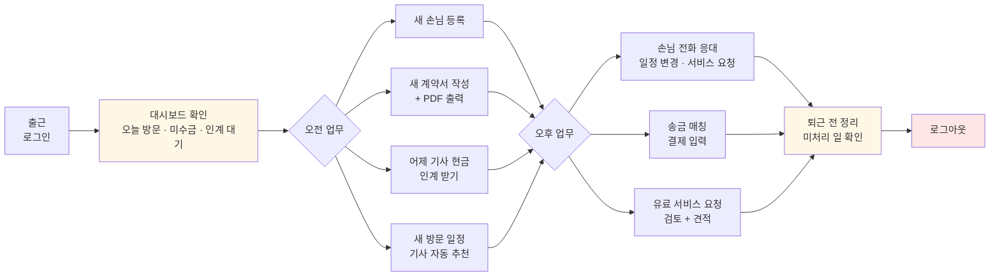
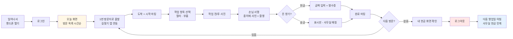
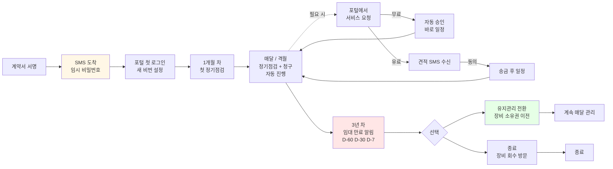
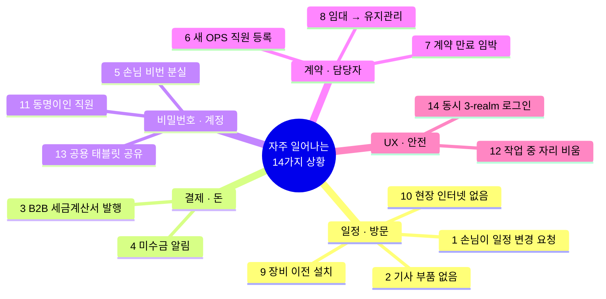
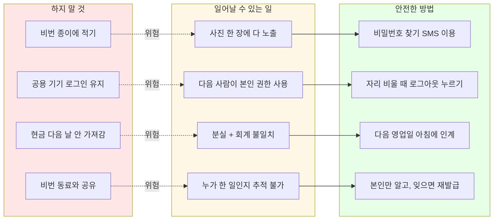
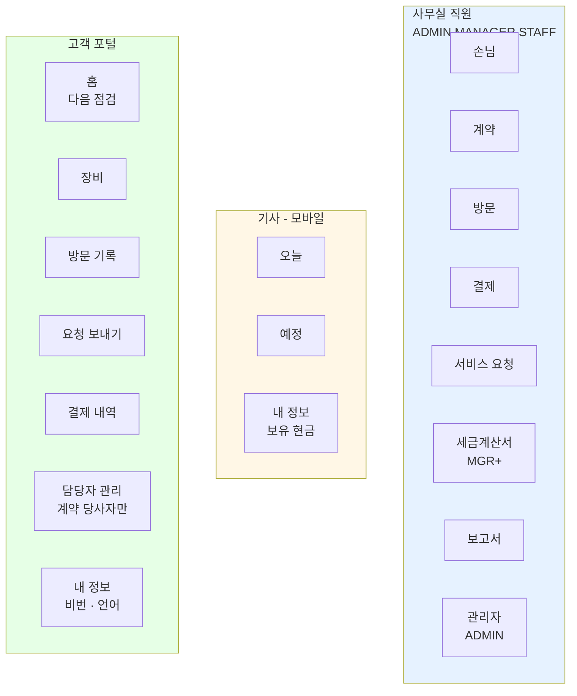

# SOMS 쉽게 쓰는 법

**누가 읽어야 하나요?** Jake's Home Appliances에서 일하시는 분, 또는 Jake's Home Appliances의 고객 — 모두입니다.
**얼마나 자세한가요?** 어려운 말은 쏙 뺐어요. 화면 보면서 따라하기만 하면 돼요.

이 안내서는 [USER_WORKFLOWS.md](./USER_WORKFLOWS.md)의 "사람용" 버전입니다. 그 문서는 개발자가 보는 거고, 이건 실제 시스템을 쓰는 분들이 보는 거예요.

---

## 목차

- [SOMS가 뭐예요?](#soms가-뭐예요)
- [누가 SOMS를 쓰나요?](#누가-soms를-쓰나요)
- [Part 1 — 사무실 직원의 하루](#part-1--사무실-직원의-하루)
- [Part 2 — 기사님의 하루](#part-2--기사님의-하루)
- [Part 3 — 고객의 한 해](#part-3--고객의-한-해)
- [Part 4 — 이럴 땐 어떻게 해요? (시나리오 모음)](#part-4--이럴-땐-어떻게-해요-시나리오-모음)
- [Part 5 — 절대 하지 마세요](#part-5--절대-하지-마세요)
- [Part 6 — 어디서 뭘 찾나요?](#part-6--어디서-뭘-찾나요)
- [도움이 필요할 때](#도움이-필요할-때)

---

## SOMS가 뭐예요?

Jake's Home Appliances는 정수기, 공기청정기, 비데를 **팔고, 빌려주고, 정기적으로 관리해 드리는** 회사예요. 손님이 한두 분이면 종이 장부로 충분하지만, 손님이 수백 명이고 기사님이 수십 분이 되면 종이로는 안 됩니다.

**SOMS = Service Operation Management System** = "서비스 운영 관리 시스템"

쉽게 말해 **"우리 회사의 모든 일을 한곳에서 보고 처리하는 컴퓨터·핸드폰 프로그램"**입니다.

이걸 쓰면 이런 일들이 가능해요:

- 손님 한 분을 검색하면 **그분의 모든 장비, 계약, 결제, 다음 점검일**을 한 화면에서 다 볼 수 있어요
- 기사님이 **핸드폰 하나로** 오늘 어디를 가야 하는지, 무엇을 해야 하는지, 돈을 얼마 받아야 하는지 다 알 수 있어요
- 손님이 **앱(고객 포털)**에서 "필터 좀 갈아주세요" 신청하면 사무실에 자동으로 알림이 와요
- 매달 청구할 돈이 자동으로 계산돼요
- 한국어, 베트남어, 영어 어느 거로도 화면을 볼 수 있어요

---

## 누가 SOMS를 쓰나요?

5가지 종류의 사용자가 있어요. 사용자마다 보이는 메뉴와 할 수 있는 일이 달라요.

### 회사 직원 (사무실)

| 누구 | 한 줄 설명 | 할 수 있는 일 |
|---|---|---|
| **사장님 (ADMIN)** | 회사 대표 | 전부 다. 직원 추가도 사장님만. |
| **부장님/팀장님 (MANAGER)** | 책임자 | 거의 다. 가격 변경, 세금계산서, 손님 비밀번호 재설정. |
| **사무실 직원 (STAFF)** | 일상 업무 | 손님 등록, 계약서 작성, 방문 일정 잡기, 결제 입력. |

> **메모**: 회사가 작아서 영업/회계 부서가 따로 없어요. 모든 사무실 직원은 영업, 회계, 자재 메뉴를 다 봅니다. 다만 **돈 액수 바꾸기**나 **세금계산서 발행** 같은 중요 작업은 부장님(MANAGER) 이상만 할 수 있어요.

### 기사님 (현장 직원)

| 누구 | 한 줄 설명 | 할 수 있는 일 |
|---|---|---|
| **기사 (TECHNICIAN)** | 손님 댁/공장에 방문하는 분 | **본인에게 배정된 방문만** 처리. 핸드폰으로만 씀. |

기사님은 사무실 화면에 못 들어가요. 핸드폰 전용 화면만 보입니다. 그게 더 빠르고 편해요.

### 고객 (외부)

| 누구 | 한 줄 설명 | 할 수 있는 일 |
|---|---|---|
| **계약 당사자 (CONTRACT_PARTY)** | 계약서에 서명하신 분 | 본인 회사/집의 **모든 것** 보기, 일상 담당자 추가/삭제, 서비스 요청. |
| **일상 담당자 (OPS_CONTACT)** | 회사에서 일상 업무를 맡으신 분 | 방문 일정, 영수증 보기, 서비스 요청. 다른 담당자 관리는 안 됨. |

> **예시**: B2B 손님인 ㈜한국기업의 사장님이 계약서에 서명하면 **계약 당사자**예요. 정수기 관리는 시설팀 김 과장님이 하면 **일상 담당자**예요. 한 회사에 일상 담당자는 여러 명이 있을 수 있어요 (공장 A 김 과장, 공장 B 이 과장 등).

> **B2C(가정집)도 동일**: 보통은 가장이 두 역할을 다 하고, 가족 중 한 명을 일상 담당자로 추가할 수도 있어요.

---

## Part 1 — 사무실 직원의 하루

### 한눈에 보기

### 아침에 출근하면

1. **컴퓨터를 켜고** SOMS 사이트(예: `soms.jakeshomeappliances.com.vn/o/login`)로 들어가요
2. **로그인 화면**에서 본인 휴대폰 번호와 비밀번호를 입력해요
3. **대시보드(첫 화면)**가 뜹니다. 여기서 한눈에 볼 수 있는 것:
   - 오늘 예정된 방문 개수
   - 검토 대기 중인 서비스 요청 (손님이 보낸 요청)
   - 미수금이 있는 손님 명단
   - 어제 기사님들이 받아온 현금 (인계 대기)

### 자주 하는 일들

#### 새 손님 등록하기
1. 왼쪽 메뉴에서 **"손님"** → **"새 손님"** 클릭
2. B2C(가정집)인지 B2B(회사)인지 선택
3. 이름, 전화번호, 주소를 입력
4. **저장** 누르면 **자동으로 손님 코드(KH00001)가 발급**돼요
5. 손님 전화로 **포털 비밀번호 SMS**가 자동으로 발송됩니다 — 손님이 직접 첫 로그인할 수 있어요

#### 새 계약서 만들기
1. 손님 페이지에서 **"새 계약"** 버튼
2. 계약 종류 선택:
   - **판매** — 한 번에 다 내고 손님 소유
   - **임대** — 36개월 빌려주기, 매달 돈 받기, 마지막엔 손님 소유
   - **유지관리** — 그냥 관리만 (장비는 이미 손님 거)
3. 어떤 장비를 몇 개, 한 달 얼마인지 입력
4. **계약서 PDF**가 자동으로 만들어져요 (한국어/베트남어 양쪽)
5. 인쇄해서 손님께 드리거나, 핸드폰으로 보내드리세요
6. 손님 서명을 받으면 → 사진을 시스템에 업로드 → **자동으로 "활성" 상태**가 되고 → 자동으로 **설치 방문**이 생성됩니다

#### 방문 일정 잡기
1. **"방문"** 메뉴 → **"새 방문"**
2. 손님과 날짜 선택
3. 시스템이 **기사님을 추천**해 줘요. 추천 기준은:
   - 손님이 선호하는 기사 (있다면)
   - 지역이 맞는 기사
   - 그날 일이 적은 기사
4. **추천 받아들이기** 한 번 클릭으로 끝. 다른 기사를 직접 고를 수도 있어요
5. 손님과 기사 모두에게 **자동으로 알림(SMS)**이 가요

#### 미배정 방문 한꺼번에 처리하기 (오늘의 배정 보드)
1. 왼쪽 메뉴 **"오늘의 배정"** (네모 그리드 아이콘) 클릭
2. 위쪽 **날짜**를 골라요 (기본 오늘)
3. 왼쪽 **"미배정"** 카드에 기사가 안 잡힌 방문이 모두 보여요
4. 카드 안에 **추천 기사**가 미리 표시 — **확정 ▸** 한 번 클릭이면 끝
5. 오른쪽엔 기사별 그날 일정이 펼쳐져 있어요. 누가 너무 많이 잡혔는지 한눈에 보여요
6. 기사 칸 머리의 **🖨 인쇄** 버튼을 누르면 그 기사가 그날 가져갈 모든 지참 서류를 **한꺼번에 출력 미리보기**가 떠요

> 💡 **팁**: 매일 아침 가장 먼저 들어가서 미배정 큐를 다 비우면 그날 일과가 단순해져요. 한 시간이면 충분합니다.

#### 방문 지참 서류 발급하기
1. **"방문"** 메뉴 → 발급할 방문 클릭 → 상세 페이지 진입
2. 상단의 **"지참 서류"** 카드를 보세요. 시스템이 방문 종류 + 손님 + 계약을 보고 **하나를 추천**해줘요. 예:
   - B2C 임대 설치 → **장비 인수증** (DELIVERY_RECEIPT)
   - B2C 판매 설치 → **판매 영수증** (SALE_RECEIPT_B2C)
   - B2B 설치 → **출고서 Mẫu 02-VT** (DELIVERY_SLIP_B2B)
   - B2C 정기 점검 → **정기 점검표 (가정집)** (PERIODIC_CHECK_B2C)
   - B2B 정기 점검 → **정기 점검 확인서 (B2B)** (PERIODIC_CHECK_B2B)
   - 그 외 (수리·필터·이전·수금·기타) → **작업확인서** (WORK_CONFIRMATION)
3. **발급** 버튼을 누르면 PDF가 즉시 만들어지고 디스크에 저장돼요
4. 이미 발급한 서류는 같은 카드 아래에 **파일명 + 발급일 + 발급자 + 다운로드 + 재발급** 행으로 나와요
5. 다른 종류를 추가로 발급하고 싶으면 **"추가 발급 ▸"** 드롭다운에서 골라요
6. **재발급** 누르면 기존 PDF는 자동으로 archive 되고 새 버전으로 교체. 감사로그에 모두 남아요

> ⚠️ **기사 배정 전엔 발급 못 해요.** 발급 버튼이 비활성 상태로 "기사 배정 후 발급 가능" 안내가 보이면, 먼저 방문 일정을 잡고 기사를 확정해 주세요. 기사가 종이를 직접 들고 가야 하니까요.

#### 기사 하루치 지참 서류 일괄 인쇄하기
1. 왼쪽 메뉴 **"일괄 인쇄"** (프린터 아이콘) 또는 오늘의 배정 보드의 기사 칸 🖨 버튼 클릭
2. **날짜**와 **기사**를 선택
3. 그 기사가 그날 가지고 갈 모든 방문 서류가 **한 PDF로 묶여서** iframe 미리보기에 떠요
4. **설치 방문(INSTALLATION)** 이면 해당 손님의 **실제 계약서 PDF가 자동으로 2부씩** 같이 묶여요 (고객용 + 회사용) — 기사가 첫 설치 방문에 인수증만 들고 가면 안 되니까요
5. **"PDF 새 탭에서 인쇄"** 버튼을 누르면 새 탭의 PDF 뷰어가 열려요. 거기서 인쇄 (Cmd+P) 하면 A4 그대로 출력됩니다
6. 미발급 방문은 인쇄 직전에 **자동 발급** 됩니다. 손으로 하나씩 안 찍어도 돼요

#### 손님이 전화로 방문 요청한 경우
1. 손님 페이지 → **"서비스 요청"** → **"새 요청"**
2. 종류 선택 (점검, 수리, 필터교체, 이전설치 등)
3. **무료** 종류면(점검·상담) — 바로 방문 잡힘
4. **유료** 종류면(이전 설치·부품 교체) — 견적을 입력하면 손님에게 SMS로 통보됨

#### 결제 입력하기 (송금)
1. **"결제"** 메뉴
2. 손님 통장으로 송금이 들어오면 — **"미입력 송금"** 목록에서 매칭
3. 어떤 계약의 몇 월분인지 선택 → **저장**
4. 손님께 영수증 이메일이 자동으로 가요

#### 기사 현금 인계받기 (다음 날 아침)
1. **"결제"** 메뉴 → **"인계 대기"** 탭
2. 기사님이 가져온 현금 봉투를 받아서 — 그 기사의 어제 수금 목록과 대조
3. 한 건씩 **"받음"** 체크 → 모두 일치하면 완료
4. 안 맞으면 사장님(ADMIN)에게 알림이 자동으로 가요

### 퇴근 전에

- **오늘의 미처리 일들** 확인 (서비스 요청 검토 대기, 미수금 알림)
- 내일 방문 일정 마지막 점검
- **로그아웃** 누르고 컴퓨터 끄기 (보안상 중요 — Part 5 참고)

---

## Part 2 — 기사님의 하루

> **기사님은 컴퓨터를 안 쓰셔도 돼요. 핸드폰만으로 충분합니다.**

### 한눈에 보기

### 아침 — 일어나서 핸드폰 열면

1. **SOMS 모바일** 사이트(예: `soms.jakeshomeappliances.com.vn/f/login`)로 들어가요
2. 본인 휴대폰 번호 + 비밀번호로 로그인
3. **"오늘"** 화면 — 오늘 방문해야 할 곳들이 시간 순으로 보여요:
   - 손님 이름
   - 주소 (지도 앱으로 바로 길찾기 가능)
   - 시간대 (예: "9~11시")
   - 해야 할 일 (정수기 필터 교체, 수리 등)
   - 받아야 할 금액 (있다면)
   - **🟡 서명 받을 서류 뱃지** — 그 방문에서 손님 서명 필요한 서류 종류가 나와요 (예: "장비 인수증 · 계약서"). 출발 전에 한눈에 보여서 빠뜨리지 않게 도와줘요

### 한 군데 방문할 때

1. **방문 카드**를 클릭 → 방문 상세 화면 진입
2. 화면 위쪽 **"서명 받을 서류"** 섹션을 먼저 봅시다 — 각 서류의 **PDF 미리보기(iframe)** 가 바로 보여요. 손님에게 "여기 사인해 주세요" 라고 가리킬 수 있도록 미리 어떤 모양인지 확인하세요. INSTALLATION 방문이면 **계약서 PDF 링크**도 함께 보여요
3. **"시작"** 버튼 누르면 단계가 시작돼요:
   - **1단계**: 도착 마킹
   - **2단계**: 무엇을 작업할지 선택 (필터 교체, 부품 교체 등)
   - **3단계**: 작업 전/후 사진 찍기
   - **4단계**: 손님 서명 받기 (사무실에서 인쇄해서 가져온 종이에 사인 받고 사진 촬영)
   - **5단계**: 돈 받기 (있는 경우)
     - 현금이면 → 금액 입력 → 영수증 출력 또는 화면에 표시
     - 송금이면 → 그냥 표시만 (사무실에서 매칭함)
   - **6단계**: **"완료"** 버튼

4. 완료하면 **작업확인서 PDF**가 자동으로 만들어지고 손님 이메일로 발송돼요

> **중요**: 5단계까지 가다가 잠시 다른 앱을 보고 돌아와도 **입력한 숫자나 선택은 그대로 남아 있어요**. 안심하고 작업하세요.

> 📄 **종이는 누가 챙기나요?** 사무실에서 출근 전에 **"일괄 인쇄"** 로 그날 분의 모든 서류를 묶어서 한 번에 인쇄해 둡니다. 기사님은 그 종이 묶음만 들고 나가면 돼요. 빠진 게 있을 땐 모바일 방문 상세의 미리보기로 확인할 수 있습니다.

### 협업 기사로 배정된 방문

큰 현장은 기사가 여러 명 가요. 한 사람이 **"주관 기사"**, 나머지가 **"협업 기사"**입니다.

- **주관 기사**: 평소처럼 다 해요 (서명, 수금, 완료 마킹)
- **협업 기사**: 사진과 메모를 추가할 수 있지만 **완료 마킹/수금은 못 해요**. 화면에 "공유됨" 표시가 떠요

### 부득이하게 다시 가야 할 때

부품이 없거나 손님이 부재이면:
- **"재방문 필요"** 버튼을 누르면 **새 방문이 자동으로 잡혀요**
- 사유를 적어두세요 (예: "X형 필터 재고 부족")

### 손님과 통화해야 할 때

- 방문 카드에 **"손님께 전화"** 버튼이 있어요
- 누르면 **자동으로 일상 담당자 번호**로 연결돼요
- 일상 담당자 번호가 없으면 계약 당사자 번호로

> **개인정보 보호**: 손님 전화번호는 화면에 직접 보이지 않아요. **"전화" 버튼**만 보입니다. 손님 번호가 외부로 새지 않도록 보호하는 거예요.

### 하루가 끝나면

1. **"내 현금"** 화면 — 오늘 받은 현금 합계를 봅니다
2. 봉투에 현금을 담아 다음 영업일 아침에 사무실에 인계
3. **로그아웃** (특히 공용 태블릿이면 꼭!)

> **공용 태블릿 사용 시**: 로그아웃하면 **이전 기사님이 본 손님 정보, 작업 내용, 받은 돈 사진 등 모든 흔적이 자동으로 지워져요**. 다음 기사님이 이전 기사 정보를 볼 일이 없습니다.

---

## Part 3 — 고객의 한 해

손님 입장에서 SOMS와 만나는 흐름이에요.

### 한눈에 보기

### 첫 만남 — 계약하실 때

1. Jake's Home Appliances 영업 직원과 상담
2. 계약서에 서명
3. **휴대폰으로 SMS 한 통**이 와요:
   > 안녕하세요. Jake's Home Appliances 고객 포털 가입이 완료되었습니다.
   > 임시 비밀번호: ********
   > 로그인: `jakeshomeappliances.com.vn/login`
4. 그 주소를 누르면 **고객 포털**로 들어가요
5. **첫 로그인 시 새 비밀번호**를 만드세요 (보안)

### 한 달 차 — 첫 점검

- 설치한 지 약 한 달 뒤, 첫 **정기점검** 일정이 자동으로 잡혀요
- **하루 전(D-1)**에 SMS 알림이 와요:
  > 내일 09~11시 정수기 정기점검 예정입니다. (Jake's Home Appliances)
- 기사님이 오시면 필터 교체하고, 작업 내역을 사진으로 받아요
- 이메일로 **점검 확인서 PDF**가 자동으로 와요

### 매달 또는 격월 — 정기 점검 + 청구

**임대(렌탈)** 또는 **유지관리** 계약이라면:
- 매달 청구가 자동으로 생성됨
- 송금 또는 기사 방문 시 현금 결제
- 영수증은 이메일로 자동 발송

### 필요할 때 — 서비스 요청

손님 포털에서 직접 요청할 수 있어요. 종류:

| 종류 | 비용 | 처리 시간 |
|---|---|---|
| 점검 | 무료 | 자동 승인, 바로 일정 잡힘 |
| 상담 | 무료 | 사무실 회신 |
| 고장 신고 | 보증/임대는 무료, 그 외 유료 | 사무실 검토 후 일정 |
| 필터 임시 교체 | 임대 무료, 판매 유료 | 사무실 검토 후 |
| 부품 교체 | 유료 | 사무실 검토 + 견적 |
| 이전 설치 | 유료 | 사무실 검토 + 견적 |

**무료 종류**는 바로 처리, **유료 종류**는 견적이 SMS로 와요. 견적에 동의하시면 송금 후 일정이 잡혀요.

### 1년 차, 2년 차 — 평소

- 매달 점검 + 청구가 자동으로 돌아감
- 손님 포털에서 언제든:
  - 다음 점검일 확인
  - 결제 내역 확인
  - 새 일상 담당자 추가 (계약 당사자만 가능)
  - 비밀번호 변경

### 임대 계약이 끝날 무렵 (3년 차)

- 만료 **60일 전**에 이메일 알림
- 만료 **30일 전**에 이메일 알림
- 만료 **7일 전**에 SMS 알림
- 옵션 두 가지:
  - **유지관리 계약으로 전환** — 장비는 손님 소유가 되고 점검만 계속 받음
  - **그냥 종료** — 임대 장비 회수 방문 일정 잡힘

### 비밀번호를 잊으셨나요?

1. 로그인 화면 → **"비밀번호 찾기"**
2. 휴대폰 번호 입력
3. SMS로 **새 임시 비밀번호**가 와요
4. 로그인 후 새 비밀번호로 변경

또는 Jake's Home Appliances 사무실에 전화 — 사무실이 재발급해 줘요. 둘 다 가능합니다.

---

## Part 4 — 이럴 땐 어떻게 해요? (시나리오 모음)

실제 회사에서 자주 일어나는 상황들이에요. 각 상황에 누가 무엇을 하는지 안내합니다.

### 한눈에 보기 — 시나리오 카테고리 맵

각 시나리오의 자세한 처리 방법은 아래 1~14번에서 확인하세요.

### 시나리오 1: 손님이 "내일 방문 못 받아요" 전화하셨어요

**사무실 직원이 할 일**:
1. 방문 메뉴 → 해당 방문 검색
2. **"일정 변경"** 버튼
3. 새 날짜 선택 → 사유 선택 (고객 요청)
4. **저장** — 이전 방문은 "재일정" 상태가 되고, 새 방문 카드가 자동으로 생성됨
5. 손님과 기사에게 자동으로 알림 SMS

기사님은 **새 방문이 본인 일정에 자동으로 들어가는 걸** 핸드폰에서 보게 돼요.

### 시나리오 2: 기사가 현장에서 "부품이 없어요"

**기사가 할 일**:
1. 진행 중인 방문에서 **"재방문 필요"** 버튼
2. 사유 입력 (예: "X형 필터 재고 없음")
3. 손님에게 양해 구함
4. 다음 방문 일정은 사무실 직원이 잡아줘요 (또는 기사가 그 자리에서 직접 잡을 수도)

### 시나리오 3: B2B 손님이 "세금계산서 주세요" 하셨어요

이건 v1에서 **외부 정부 시스템(Viettel/MISA/VNPT)**으로 발행한 PDF를 SOMS에 업로드하는 방식이에요.

**MANAGER가 할 일**:
1. 외부 e-Invoice 시스템에 로그인 → 세금계산서 발행 → PDF 다운로드
2. SOMS에 들어가서 → **"세금계산서"** 메뉴 → **"새 세금계산서"**
3. 손님, 계약, 금액 선택 → **PDF 업로드**
4. **저장** — 손님 이메일로 자동 발송됨
5. 손님이 송금하면 결제 매칭 (시나리오 4 참고)

### 시나리오 4: "송금이 안 들어왔어요" 알림이 떴어요

이건 자동 알림 시스템이에요. 결제 마감일이 지나면:

- **D+7 (7일 늦음)**: 손님께 이메일 — "결제 늦으셨어요, 확인 부탁드려요"
- **D+14**: 이메일 한 번 더
- **D+30**: SMS로 강한 알림 + 계약 상태가 "연체"로 변경

**사무실 직원이 할 일**:
- 손님께 전화/메시지로 상황 확인
- 송금 완료되면 → **"결제"** 메뉴 → 송금 매칭 → 자동으로 연체 해제

### 시나리오 5: 손님이 "비밀번호 잊었어요"

**MANAGER가 할 일**:
1. 손님 페이지 → **"비밀번호 재설정"** 버튼
2. 확인 → **새 임시 비밀번호가 SMS로 자동 발송**
3. 손님은 새 비밀번호로 로그인 → 첫 로그인 시 다시 새 비밀번호 설정

또는 손님이 직접 **"비밀번호 찾기"** 버튼을 눌러도 됩니다.

> **중요한 보안 동작**: 비밀번호가 바뀌면 **그 손님의 모든 다른 기기에서 자동 로그아웃** 돼요. 만약 누가 손님 휴대폰을 잠깐 훔쳐봤더라도, 손님이 비밀번호 바꾸자마자 그 사람은 쫓겨납니다.

### 시나리오 6: 회사에 새 직원이 들어왔는데 정수기 관리 담당이래요

**B2B 손님이라면** — 계약 당사자(사장님 등)가 **포털**에서 직접 추가할 수 있어요:
1. 계약 당사자가 손님 포털 → **"담당자 관리"**
2. **"새 담당자 추가"** → 이름, 전화, 언어, (해당하면) 어느 공장 담당인지 선택
3. **저장** — 새 담당자에게 자동으로 포털 비밀번호 SMS

**또는 Jake's Home Appliances 사무실 MANAGER에게 전화**로 부탁해도 돼요.

### 시나리오 7: 계약이 끝나가요. 그 다음엔?

만료 60일 전부터 자동 알림이 시작돼요. 손님이 선택해야 할 것:

| 선택 | 어떻게 되나요 |
|---|---|
| **유지관리로 전환** | 장비는 손님 소유가 되고, 매달 관리비만 받음 |
| **종료 + 장비 가져가기** | 임대 장비를 회수해야 하면 회수 방문 일정 잡힘 |

**STAFF가 할 일**:
1. 계약 페이지 → **"갱신"** 또는 **"종료"** 버튼
2. 손님 의사 확인하여 처리
3. 유지관리 전환이면 새 계약서 자동 생성

### 시나리오 8: 임대 → 유지관리 한 번에 전환

"1-Click 갱신"이라고 부릅니다.

**STAFF가 할 일**:
1. 임대 계약 페이지 → **"갱신: 유지관리"** 버튼
2. 새 월 관리비 입력 (보통 임대비보다 저렴)
3. **확인** — 자동으로:
   - 기존 임대 계약 → "완료" 상태로
   - 장비 소유권 → 손님 명의로 변경
   - 새 유지관리 계약서가 만들어짐
   - 다음 정기점검은 새 계약 기준으로 자동 예약

### 시나리오 9: 손님이 정수기를 다른 사무실로 옮겨야 해요

**손님이 할 일**:
1. 손님 포털 → **"서비스 요청"** → **"이전 설치"**
2. 새 주소 + 이전 희망일 입력
3. 사진을 첨부할 수 있음

**STAFF가 할 일**:
1. 요청 검토 → 견적 계산
2. 견적 입력 → **"승인"** — 손님께 SMS로 견적 통보
3. 손님이 송금하면 → **"결제 확인"** — 자동으로 이전 방문 잡힘

### 시나리오 10: 기사가 현장에서 인터넷이 안 돼요

v1은 **온라인 우선**이에요. 인터넷이 완전히 안 되면 다음과 같이 합니다:
- **사진 촬영** — 핸드폰 갤러리에 저장됨, 신호 잡히면 업로드
- **결제 영수증** — 종이 영수증 한 장 받아두기
- **신호 회복 후** — SOMS 다시 열고 작업 마무리

> 본격적인 오프라인 모드는 향후(Phase 7) 추가 예정입니다.

### 시나리오 11: 같은 이름인 직원이 두 명이에요

**상황**: "관리자"라는 사용자명을 가진 직원이 두 명 — 한 명은 사장님, 한 명은 새 부장님.

**시스템 동작**: SOMS는 **로그인을 거부합니다** ("자격 증명이 잘못되었습니다" 메시지). 이유는 시스템이 임의로 한 명을 골라서 로그인시키면 큰 사고가 나니까요 — 권한이 다른 사람으로 들어갈 수 있어요.

**해결**:
- 사용자명 대신 **본인 휴대폰 번호로 로그인**하세요 (휴대폰은 무조건 본인 한 명 거니까요)
- 또는 ADMIN이 사용자명 하나를 바꿔주세요

### 시나리오 12: 작업 중에 자리를 비웠다가 돌아왔는데, 화면 숫자가 바뀌었으면 어떡해요?

**기사님이 방문 완료 마법사를 쓰는 중일 때**: 다른 앱을 잠깐 보거나 화장실 다녀와도 **입력 중인 금액, 선택한 부품, 사진은 그대로 남아 있어요**.

이건 의도된 거예요. 작업 중인 정보가 시스템 사정으로 갑자기 바뀌면 큰일나니까요.

**다른 화면(예: 사무실 손님 목록)**에선 — 자동 새로고침이 됩니다. 의도된 차이입니다.

### 시나리오 13: 공용 태블릿을 다른 기사와 공유해야 해요

**문제**: 한 태블릿을 여러 기사가 번갈아 쓰면, A 기사가 본 손님 정보를 B 기사가 그대로 볼 수 있을까 걱정.

**해결**: 걱정 안 하셔도 돼요. 누가 **"로그아웃" 버튼**을 누르는 순간:
- 그 기사가 본 모든 손님 정보, 방문 내용, 저장된 사진이 자동으로 지워져요
- 받은 돈 기록도 지워져요 (서버엔 남지만, 그 기기엔 안 남아요)
- 다음 기사가 로그인하면 **본인 일정만** 보입니다

**무조건 로그아웃 누르고 다음 사람에게 넘기세요.**

### 시나리오 14: 같은 브라우저에서 사무실 + 현장 + 고객을 동시에 보고 싶어요

가능해요. SOMS는 3개의 분리된 영역을 가지고 있어서:
- 새 창 1: 사무실 (예: 사장님이 회사에서 보기)
- 새 창 2: 현장 (예: 본인이 기사이기도 함)
- 새 창 3: 고객 (예: 본인 가족이 손님)

세 창에서 **동시에 로그인 가능**하고 서로 간섭하지 않아요. 한 창에서 로그아웃해도 다른 두 창은 그대로 유지됩니다.

---

## Part 5 — 절대 하지 마세요

### 한눈에 보기 — 위험 → 결과 → 안전한 방법

### 비밀번호 종이에 적어두지 마세요

특히 모니터 옆 포스트잇. 누가 사진 한 장 찍으면 끝이에요.

> 비밀번호 잊으면 그냥 **"비밀번호 찾기"** 누르세요. SMS로 새 비밀번호 받으세요.

### 다른 사람 휴대폰에서 본인 계정 그대로 두지 마세요

기사 친구한테 잠깐 핸드폰 빌려줄 때, 또는 사무실 공용 컴퓨터를 쓸 때:
- **반드시 "로그아웃"** 누르고 자리 비우기
- 자기 핸드폰이 아닌 곳에서 "로그인 정보 기억" 같은 옵션 끄기

### 받은 현금 다음 날 안 가져가지 마세요

기사님이 손님에게 받은 현금은 **다음 영업일 아침**에 사무실에 인계해야 합니다. 인계 안 하고 하루 더 가지고 있으면 사장님에게 자동 알림이 가요 (분실 위험 + 회계 문제).

### 같은 휴대폰 번호로 여러 사람이 로그인 못 하게 하기

비밀번호는 본인만 알고 있어야 해요. 회사 내에서 "비밀번호 좀 알려줘"는 위험합니다.

---

## Part 6 — 어디서 뭘 찾나요?

### 한눈에 보기 — 사용자별 메뉴 맵

### 자주 찾는 기능 위치

| 하고 싶은 일 | 어디로 가나요? |
|---|---|
| 손님 정보 보기 | 사무실 → **손님** 메뉴 → 검색 |
| 새 손님 등록 | **손님** → **새 손님** |
| 새 계약서 만들기 | 손님 페이지 → **새 계약** 또는 **계약** 메뉴 |
| 오늘의 방문 (기사) | 현장 핸드폰 → **오늘** |
| 다음 방문 예약 (사무실) | **방문** → **새 방문** |
| 손님이 보낸 요청 검토 | **서비스 요청** → 대기 중 탭 |
| 결제 입력 / 매칭 | **결제** |
| 세금계산서 (B2B) | **세금계산서** |
| 미수금 알림 보기 | 대시보드 또는 **결제** → 연체 탭 |
| 손님 비밀번호 재설정 | 손님 페이지 → **비밀번호 재설정** |
| 새 직원 등록 (ADMIN만) | **관리자** → **사용자** → **새 사용자** |
| 제품 카탈로그 (ADMIN/MGR) | **관리자** → **제품** |
| 감사 기록 (MGR+) | **보고서** → **감사 로그** |

### 고객 포털 메뉴

| 하고 싶은 일 | 어디로? |
|---|---|
| 다음 점검일 보기 | **홈** |
| 내 장비 보기 | **장비** |
| 방문 기록 / 예정 | **방문** |
| 새 요청 보내기 | **요청 보내기** |
| 결제 내역 | **결제** |
| 일상 담당자 관리 (계약 당사자만) | **담당자** |
| 비밀번호 변경 | **내 정보** |
| 언어 변경 (KO/VI/EN) | **내 정보** → **언어** |

---

## 도움이 필요할 때

**시스템이 이상해요** → MANAGER 또는 ADMIN에게 문의
**비밀번호 잊었어요** → 로그인 화면의 **"비밀번호 찾기"**
**손님 정보가 안 보여요** → 본인 권한 확인 (STAFF는 모든 손님 보기 가능, TECH는 본인 방문 손님만)
**기능 추가 요청** → 사장님(ADMIN)에게 전달, 추후 업데이트에 반영
**버그 발견** → 화면 캡쳐 + 어떻게 했는지 적어서 사장님 또는 개발팀에 전달

---

## 마지막으로

이 시스템은 여러분의 일을 **빠르고 정확하게** 도와주려고 만들어졌어요. 종이 장부로 하시던 일이 핸드폰 몇 번 터치로 끝나는 게 목표예요.

**처음엔 낯설 수 있지만** 일주일만 써보시면 종이로 돌아가기 싫어지실 거예요. 막히는 게 있으면 사장님이나 같이 일하시는 분께 물어보세요. 같이 일하면 빨리 익혀집니다.

좋은 하루 보내세요 — Jake's Home Appliances 팀 드림.
