# Product Requirements Document — Seoul Aqua SOMS

> **Status:** Draft v1.0 — 2026-05-27
> **Owner:** Product (Seoul Aqua) · Engineering (this repo)
> **Audience:** product, engineering, design, ops, client stakeholders
> **Source documents:** [`SPEC.md`](./SPEC.md) (canonical), [`PROCESS_NOTES.md`](./PROCESS_NOTES.md), [`DATA_MODEL_NOTES.md`](./DATA_MODEL_NOTES.md), [`DOCUMENT_TEMPLATES.md`](./DOCUMENT_TEMPLATES.md), [`PROJECT_PLAN.md`](./PROJECT_PLAN.md)

This PRD enumerates **every expected use case** of the Seoul Aqua Service Operation Management System (SOMS) along with the actors, preconditions, main + alternate flows, postconditions, and acceptance criteria for each. It uses tables and Mermaid diagrams throughout for visual reference.

---

## Table of Contents

1. [Executive Summary](#1-executive-summary)
2. [Personas & Stakeholders](#2-personas--stakeholders)
3. [Goals & Non-Goals](#3-goals--non-goals)
4. [System Context & Architecture](#4-system-context--architecture)
5. [Domain Model (ERD)](#5-domain-model-erd)
6. [Permissions Matrix](#6-permissions-matrix)
7. [Use Case Catalog](#7-use-case-catalog)
   - 7.1 [Authentication & Account](#71-authentication--account-uc-au)
   - 7.2 [Customer Management](#72-customer-management-uc-cm)
   - 7.3 [Site Management (B2B)](#73-site-management-b2b-uc-st)
   - 7.4 [Equipment Management](#74-equipment-management-uc-eq)
   - 7.5 [Contract Lifecycle](#75-contract-lifecycle-uc-ct)
   - 7.6 [Service Request](#76-service-request-uc-sr)
   - 7.7 [Visit Scheduling & Execution](#77-visit-scheduling--execution-uc-vs)
   - 7.8 [Payment Collection](#78-payment-collection-uc-py)
   - 7.9 [Tax Invoice](#79-tax-invoice-uc-ti)
   - 7.10 [Notifications](#710-notifications-uc-nt)
   - 7.11 [Customer Portal](#711-customer-portal-uc-pt)
   - 7.12 [Reporting & Audit](#712-reporting--audit-uc-rp)
   - 7.13 [Administration](#713-administration-uc-ad)
8. [State Machines](#8-state-machines)
9. [User Journey Diagrams](#9-user-journey-diagrams)
10. [Functional Requirements Summary](#10-functional-requirements-summary)
11. [Non-Functional Requirements](#11-non-functional-requirements)
12. [Phased Rollout](#12-phased-rollout)
13. [Open Questions & Out of Scope](#13-open-questions--out-of-scope)
14. [Glossary](#14-glossary)

---

## 1. Executive Summary

Seoul Aqua SOMS is a **multi-tenant customer + service-operation management system** for Seoul Aqua — a Vietnam-based seller, renter, and maintainer of water purifiers, bidets, air purifiers, and household water-treatment products. It replaces a patchwork of paper forms, spreadsheets, and KakaoTalk messages with a single source of truth for customers, contracts, equipment, scheduled visits, payments, and tax invoices.

### Why it exists

| Pain today | What SOMS does |
|---|---|
| Customer data in 6+ spreadsheets, inconsistent IDs | Single `Customer` table with KH-code lifecycle (A.1, A.2) |
| Maintenance schedules tracked in heads + KakaoTalk | Auto-generated visit queue per technician, mobile-first |
| Cash collection ledgered weekly with frequent disputes | 48h cash handover SLA + technician-receipt-on-mobile + audit log |
| Tax invoices issued ad-hoc, sometimes missed | All B2B contracts force tax invoice flow (D.5) |
| B2B customers with multiple buildings tracked as separate "customers" | First-class `Site` model (A.4, A.8) |
| No customer-facing channel | Phase 3.5 PWA portal for status, history, service requests |

### Headline metrics targeted

| Metric | Today | Target (v1 — end Phase 6) |
|---|---|---|
| Time to register a new customer | 15–30 min (paper + 3 spreadsheets) | < 3 min (single screen) |
| % of overdue invoices > 14 days | ~22 % | < 5 % |
| Technician daily visits | 4–5 (paper friction) | 7–8 (mobile-first queue) |
| Customer SLA on inspection requests | 5–7 business days | ≤ 3 business days |
| Audit-log coverage | manual ledger | 100 % of payment, contract, login events |

### Scale

- ~9,000 active customers (B2C + B2B) at launch (J.1 — full migration)
- ~80 field technicians, ~10 HQ office staff
- ~720 inspection/maintenance visits/month, growing 8–10 % YoY
- Phase 3.5+: customer portal targeting ~5,000 active customer accounts

---

## 2. Personas & Stakeholders

### 2.1 Internal personas

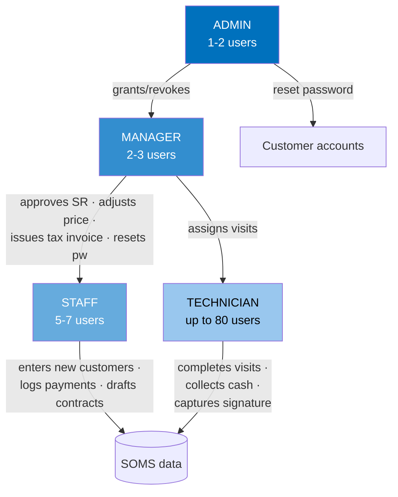
```mermaid
graph TD
    A[ADMIN<br/>1-2 users] -->|grants/revokes| M[MANAGER<br/>2-3 users]
    A -->|reset password| C[Customer accounts]
    M -->|approves SR · adjusts price ·<br/>issues tax invoice · resets pw| S[STAFF<br/>5-7 users]
    M -->|assigns visits| T[TECHNICIAN<br/>up to 80 users]
    S -->|enters new customers ·<br/>logs payments · drafts contracts| DB[(SOMS data)]
    T -->|completes visits ·<br/>collects cash ·<br/>captures signature| DB
    style A fill:#0071BD,color:#fff
    style M fill:#338ECF,color:#fff
    style S fill:#66ABDD,color:#fff
    style T fill:#99C7EE,color:#000
```

| Persona | Role | KR | Count | Primary device | Top 3 daily tasks | Key pain points |
|---|---|---|---|---|---|---|
| **Admin** | `ADMIN` — full system + user mgmt | 관리자 | 1–2 | Desktop | (1) reset stuck customer passwords, (2) create/disable staff accounts, (3) review audit log | Audit gaps; can't track who-changed-what |
| **Manager** | `MANAGER` — ops oversight | 매니저 | 2–3 | Desktop | (1) approve paid service requests, (2) issue tax invoices, (3) assign visits | Slow approval bottleneck; spreadsheet reconciliation |
| **Office staff** | `STAFF` — day-to-day ops | 직원 | 5–7 | Desktop | (1) register new customers, (2) draft contracts, (3) record cash payments | Re-entering customer data; cross-checking 3+ files |
| **Technician** | `TECHNICIAN` — field installer / maintainer | 기사 | up to 80 | Phone (5–6", Android 8+ / iOS 14+) | (1) complete scheduled visits, (2) install/replace equipment, (3) collect cash + capture signature | Paper work confirmation; no real-time visit list |

### 2.2 External personas (customers)

| Persona | Description | KR | Volume | Channel |
|---|---|---|---|---|
| **B2C household** | Family household renting/buying ~1 device | 가정집 고객 | ~7,500 | SMS + portal (Phase 3.5+) |
| **B2C Contract Party** | Person who signs the contract, receives legal notices | 계약 주체 (B2C) | 1 per B2C customer | SMS + email |
| **B2C Ops Contact** | Day-to-day point of contact (often same as Contract Party for B2C, but can differ) | 관리 주체 (B2C) | 0..2 per B2C customer | SMS |
| **B2B Contract Party** | Legal representative of B2B customer; signs contracts + tax invoices | 계약 주체 (B2B) | 1 per B2B customer | Email (formal) |
| **B2B Ops Contact (HQ)** | Org-level ops contact (facilities/admin manager) | 관리 주체 (본사) | 1–3 per B2B customer | Email + SMS |
| **B2B Ops Contact (Site)** | Per-site contact (building manager) | 관리 주체 (지점) | 1+ per Site | SMS |

### 2.3 External systems

| System | Role | When called |
|---|---|---|
| **eSMS.vn** | SMS provider (Brandname `SeoulAqua`) | Phase 3.5+ — visit reminders, OTP-like flows, payment escalation |
| **Resend** | Transactional email | Phase 3.5+ — receipts, portal welcomes, early-stage reminders |
| **Viettel SInvoice** | Vietnamese e-tax invoice issuance (Phase 8+) | When B2B tax invoice issued |
| **Supabase Postgres** | Primary database | All read/write |
| **Vercel** | App hosting (v0) | Always |
| **Zalo OA + Mini App** | Vietnamese messenger platform (Phase 8+ TODO) | Alternative to SMS for richer notifications |

---

## 3. Goals & Non-Goals

### 3.1 Product goals (in priority order)

1. **Single source of truth** for customers, equipment, contracts, and visits — eliminate spreadsheet drift
2. **Mobile-first technician workflows** — field staff complete visits without paper
3. **48-hour cash audit SLA** — every cash collection is reconciled within 48 hours of technician handover
4. **Self-service portal** — customers see their equipment, schedule, history, and download tax invoices without office intervention
5. **Vietnamese tax compliance** — all B2B sales/rentals produce a tax invoice trail (paper or e-invoice)
6. **Multi-language by design** — KR (internal team), VI (customers + technicians), EN (system docs)

### 3.2 Non-goals (explicit)

| Non-goal | Why |
|---|---|
| Replacing accounting / general-ledger system | SOMS exports to accountant; full GL is out of scope |
| Inventory / warehouse management (full stock control) | v1 tracks Equipment lifecycle but not warehouse SKUs / reorder points |
| Manufacturing / production planning | Seoul Aqua doesn't manufacture — products are sourced |
| HR / payroll | Staff records are for permissions only, not HR |
| Marketing campaigns (CRM features) | v1 has opt-out flags + segmentation hooks but no campaign builder |
| Public-facing storefront / e-commerce | Sales originate from office staff or technician referrals |
| Multi-currency | VND only (D.4 confirmed) |

---

## 4. System Context & Architecture

### 4.1 Context diagram (Level 0)

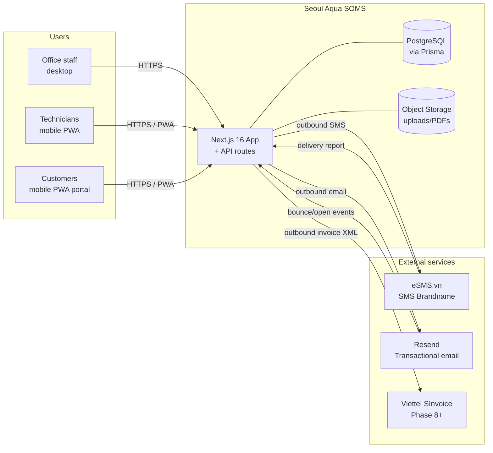
```mermaid
graph LR
    subgraph users[Users]
        OS[Office staff<br/>desktop]
        T[Technicians<br/>mobile PWA]
        C[Customers<br/>mobile PWA portal]
    end
    subgraph soms[Seoul Aqua SOMS]
        APP[Next.js 16 App<br/>+ API routes]
        DB[(PostgreSQL<br/>via Prisma)]
        OBJ[(Object Storage<br/>uploads/PDFs)]
        APP --- DB
        APP --- OBJ
    end
    subgraph external[External services]
        SMS[eSMS.vn<br/>SMS Brandname]
        MAIL[Resend<br/>Transactional email]
        SI[Viettel SInvoice<br/>Phase 8+]
    end

    OS -->|HTTPS| APP
    T -->|HTTPS / PWA| APP
    C -->|HTTPS / PWA| APP
    APP -->|outbound SMS| SMS
    APP -->|outbound email| MAIL
    APP -->|outbound invoice XML| SI
    SMS -->|delivery report| APP
    MAIL -->|bounce/open events| APP
```

### 4.2 Functional layers

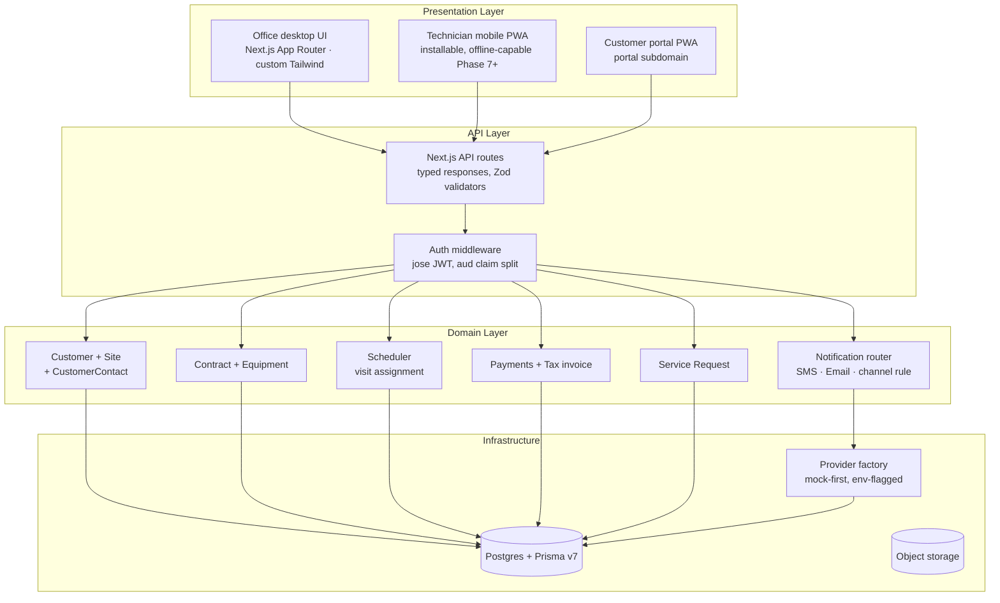
```mermaid
graph TB
    subgraph presentation[Presentation Layer]
        OD[Office desktop UI<br/>Next.js App Router · custom Tailwind]
        TM[Technician mobile PWA<br/>installable, offline-capable Phase 7+]
        CP[Customer portal PWA<br/>portal subdomain]
    end
    subgraph api[API Layer]
        REST[Next.js API routes<br/>typed responses, Zod validators]
        AUTH[Auth middleware<br/>jose JWT, aud claim split]
    end
    subgraph domain[Domain Layer]
        CUST[Customer + Site<br/>+ CustomerContact]
        CONT[Contract + Equipment]
        SCH[Scheduler<br/>visit assignment]
        PAY[Payments + Tax invoice]
        SR[Service Request]
        NOTIF[Notification router<br/>SMS · Email · channel rule]
    end
    subgraph infra[Infrastructure]
        DB[(Postgres + Prisma v7)]
        OBJ[(Object storage)]
        PROV[Provider factory<br/>mock-first, env-flagged]
    end

    OD --> REST
    TM --> REST
    CP --> REST
    REST --> AUTH
    AUTH --> CUST
    AUTH --> CONT
    AUTH --> SCH
    AUTH --> PAY
    AUTH --> SR
    AUTH --> NOTIF
    CUST --> DB
    CONT --> DB
    SCH --> DB
    PAY --> DB
    SR --> DB
    NOTIF --> PROV
    PROV --> DB
```

### 4.3 Provider factory (notification rails)

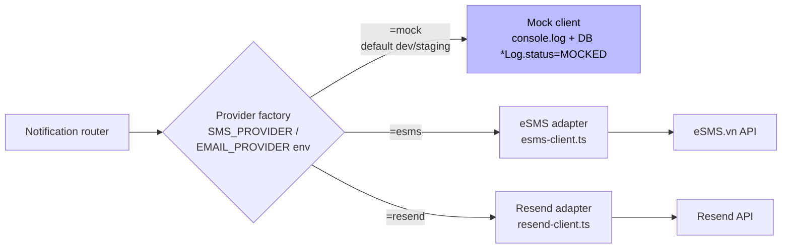
```mermaid
graph LR
    CALLER[Notification router] --> FACT{Provider factory<br/>SMS_PROVIDER /<br/>EMAIL_PROVIDER env}
    FACT -->|=mock<br/>default dev/staging| MOCK[Mock client<br/>console.log + DB *Log.status=MOCKED]
    FACT -->|=esms| ESMS[eSMS adapter<br/>esms-client.ts]
    FACT -->|=resend| RES[Resend adapter<br/>resend-client.ts]
    ESMS --> SMSAPI[eSMS.vn API]
    RES --> RESAPI[Resend API]
    style MOCK fill:#bbf,color:#000
```

> **Mock-first**: dev/staging always uses mock providers. Production swaps the env var when credentials arrive. Code never changes between dev and prod.

---

## 5. Domain Model (ERD)

### 5.1 Core entities

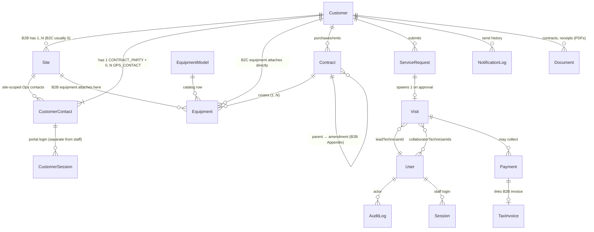
```mermaid
erDiagram
    Customer ||--o{ Site : "B2B has 1..N (B2C usually 0)"
    Customer ||--|{ CustomerContact : "has 1 CONTRACT_PARTY + 0..N OPS_CONTACT"
    Site ||--o{ CustomerContact : "site-scoped Ops contacts"
    Site ||--o{ Equipment : "B2B equipment attaches here"
    Customer ||--o{ Equipment : "B2C equipment attaches directly"
    Customer ||--o{ Contract : "purchases/rents"
    Contract ||--o{ Equipment : "covers (1..N)"
    Contract ||--o{ Contract : "parent → amendment (B2B Appendix)"
    EquipmentModel ||--o{ Equipment : "catalog row"
    Customer ||--o{ ServiceRequest : "submits"
    ServiceRequest ||--o| Visit : "spawns 1 on approval"
    Visit }o--|| User : "leadTechnicianId"
    Visit }o--o{ User : "collaboratorTechnicianIds"
    Visit ||--o{ Payment : "may collect"
    Payment ||--o| TaxInvoice : "links B2B invoice"
    User ||--o{ AuditLog : "actor"
    CustomerContact ||--o{ CustomerSession : "portal login (separate from staff)"
    User ||--o{ Session : "staff login"
    Customer ||--o{ NotificationLog : "send history"
    Customer ||--o{ Document : "contracts, receipts (PDFs)"
```

### 5.2 Entity definitions (summary — full schema in [DATA_MODEL_NOTES.md](./DATA_MODEL_NOTES.md))

| Entity | Purpose | Key fields | PK / Code |
|---|---|---|---|
| **Customer** | B2C household or B2B company | `code` (KH####), `type` (B2C/B2B), `address`, `preferredTechnicianId`, `preferredRegion`, `shortcode` (B2B) | KH#### |
| **Site** | Physical sub-location of B2B customer | `customerId`, `name`, `address`, `region` | — |
| **CustomerContact** | Person tied to a customer or site | `role` (CONTRACT_PARTY / OPS_CONTACT), `scope` (CUSTOMER / SITE), `siteId?`, `phone1`, `email`, `language`, `portalEnabled`, `smsOptOut`, `emailOptOut`, `mustChangePassword` | — |
| **EquipmentModel** | Catalog of products company sells/rents | `modelCode`, `name`, `category`, `filterPolicy`, `currentRetailPrice` | modelCode |
| **Equipment** | Installed unit at a customer/site | `customerId`, `siteId?`, `modelCode`, `serialNumber`, `installedAt`, `status`, `ownership` | — |
| **Contract** | Rental/sale/maintenance agreement | `contractNumber`, `customerId`, `type` (SALE/RENTAL/MAINTENANCE), `state`, `monthlyMaintenanceFee`, `parentContractId`, `amendmentRevision`, `filterPolicy`, `legacyContractNumber` | HD-YYYYmmDD/SA-KH#### or HD-YYYYmmDD/SA-{shortcode} |
| **ServiceRequest** | Customer-submitted request | `customerId`, `type` (INSPECTION/REPAIR/PART_REPLACEMENT/RELOCATION), `isPaid`, `state`, `requestedAt` | SR-### |
| **Visit** | Single technician field call | `customerId`, `leadTechnicianId`, `collaboratorTechnicianIds[]`, `scheduledFor`, `state`, `serviceRequestId?` | — |
| **Payment** | Cash or bank-transfer collection | `visitId?`, `contractId?`, `method`, `expectedAmount`, `actualAmount`, `collectedAt`, `handedOverAt`, `state` | — |
| **TaxInvoice** | B2B eInvoice (Viettel SInvoice or PDF upload) | `paymentId`, `invoicePdfUploadedAt`, `invoiceProvider`, `invoiceProviderRef` | — |
| **NotificationLog** | Outbound SMS/email history | `customerContactId`, `templateCode`, `channel`, `status`, `provider`, `providerMessageId` | — |
| **AuditLog** | Every state-mutating action | `actorId`, `actorType` (USER/CUSTOMER/SYSTEM), `action`, `entityType`, `entityId`, `before`, `after`, `at` | — |
| **User** | Staff login (ADMIN/MANAGER/STAFF/TECHNICIAN) | `username`, `phone`, `role`, `region` | — |
| **Session** / **CustomerSession** | JWT refresh tokens (split aud) | `userId`/`contactId`, `refreshToken`, `expiresAt` | — |
| **Document** | Generated PDF (contract, receipt, work conf.) | `ownerType`, `ownerId`, `templateCode`, `storageKey` | — |

---

## 6. Permissions Matrix

### 6.1 Internal staff (canonical — see [SPEC.md §2.1](./SPEC.md))

| Action | ADMIN | MANAGER | STAFF | TECHNICIAN |
|---|:-:|:-:|:-:|:-:|
| Create/disable staff accounts | ✅ | — | — | — |
| Reset staff password | ✅ | — | — | — |
| Reset customer password | ✅ | ✅ | — | — |
| View audit log | ✅ | ✅ | (own actions) | (own actions) |
| Create customer | ✅ | ✅ | ✅ | — |
| Edit customer (non-contract fields) | ✅ | ✅ | ✅ | — |
| Edit Contract Party | ✅ | ✅ | (with manager review) | — |
| Add/remove Ops Contact | ✅ | ✅ | ✅ | — |
| Create contract | ✅ | ✅ | ✅ | — |
| Adjust monthly fee on existing contract | ✅ | ✅ | — | — |
| Issue B2B Appendix amendment | ✅ | ✅ | — | — |
| Approve paid service request | ✅ | ✅ | — | — |
| Reject service request | ✅ | ✅ | ✅ | — |
| Assign / reassign visit | ✅ | ✅ | ✅ | — |
| Mark visit complete | — | — | — | ✅ (lead only) |
| Collect payment in field | — | — | — | ✅ (lead only) |
| Reconcile cash handover | ✅ | ✅ | ✅ | — |
| Issue tax invoice | ✅ | ✅ | — | — |
| Configure notification templates | ✅ | — | — | — |
| Configure scheduling rules | ✅ | — | — | — |
| View any customer's full data | ✅ | ✅ | ✅ | (assigned only) |
| View own daily visit queue | ✅ | ✅ | ✅ | ✅ |

### 6.2 Customer portal accounts (Phase 3.5+)

| Action | CONTRACT_PARTY | OPS_CONTACT (primary) | OPS_CONTACT (secondary) |
|---|:-:|:-:|:-:|
| Log in to portal | ✅ | ✅ | ✅ |
| View customer's equipment + visit history | ✅ | ✅ | ✅ |
| Submit service request | ✅ | ✅ | ✅ |
| Cancel pending service request | ✅ (own) | ✅ (own) | ✅ (own) |
| Add new OPS contact (B2B HQ org-level) | ✅ | — | — |
| Add new OPS contact (Site-scoped) | ✅ | ✅ (same site) | — |
| Edit own contact info | ✅ | ✅ | ✅ |
| Edit other contact info | ✅ | — | — |
| Download tax invoice (B2B) | ✅ | ✅ | — |
| Opt-out / opt-in to channels (own contact) | ✅ | ✅ | ✅ |
| Change password (own) | ✅ | ✅ | ✅ |

---

## 7. Use Case Catalog

> **Convention:** UC-XX-NN where XX = domain code (AU, CM, ST, EQ, CT, SR, VS, PY, TI, NT, PT, RP, AD) and NN = sequential number. Status: 🟢 v1 (Phase 1–6) · 🟡 v1.5 (Phase 7) · 🔵 v2+ (Phase 8+) · ⚪ Backlog.

### 7.1 Authentication & Account (UC-AU)

#### UC-AU-01 — Staff login (desktop)

| Field | Value |
|---|---|
| **Actor** | Office staff (ADMIN / MANAGER / STAFF) |
| **Status** | 🟢 v1 |
| **Preconditions** | Account exists; not locked out |
| **Main flow** | 1. User opens `/login`. 2. Enters username + password. 3. System verifies bcrypt hash, mints JWT (15 min access + 7 day refresh, `aud='staff'`). 4. Sets cookies (`accessToken`, `refreshToken` with `Path=/`). 5. Redirects to dashboard. |
| **Alternate: wrong password** | 5 failed attempts → 15 min lockout (F.6). Failed attempts logged. |
| **Alternate: expired access token** | Middleware silently refreshes using refresh token. If refresh fails → redirect to `/login`. |
| **Postconditions** | Session row created; `Last login` updated; AuditLog `LOGIN_SUCCESS`. |
| **Acceptance** | Login < 1 s p95; lockout enforced; tokens rotate on each refresh. |

#### UC-AU-02 — Staff logout

| Field | Value |
|---|---|
| **Actor** | Staff |
| **Status** | 🟢 v1 |
| **Main flow** | 1. User clicks logout in user menu. 2. System invalidates refresh token in DB. 3. Clears cookies. 4. Redirects to `/login`. 5. AuditLog `LOGOUT`. |

#### UC-AU-03 — Technician login (mobile PWA)

| Field | Value |
|---|---|
| **Actor** | TECHNICIAN |
| **Status** | 🟢 v1 (Phase 4) |
| **Preconditions** | Technician account exists with `User.phone` set (K.2) |
| **Main flow** | 1. Open PWA. 2. Enter phone + password. 3. JWT minted (`aud='staff'`, longer TTL). 4. Land on today's visit queue. |
| **Alternate: app installed** | Auto-restore session via cached refresh token. |

#### UC-AU-04 — Customer portal login

| Field | Value |
|---|---|
| **Actor** | CustomerContact (any role with `portalEnabled=true`) |
| **Status** | 🟢 v1 (Phase 3.5) |
| **Preconditions** | Contact has portal account (auto-created on contract activation) |
| **Main flow** | 1. Open portal at `portal.seoulaqua.com.vn`. 2. Enter phone + password. 3. System verifies, mints JWT with `aud='customer'`. 4. **If `mustChangePassword=true`** → force password change screen. 5. Else → dashboard. |
| **Alternate: shared phone (A.13 b)** | If two contacts share `phone1`, both can log in independently. Disambiguation by entering full name OR by selecting from a list after phone is entered. |
| **Postconditions** | CustomerSession row; AuditLog `CUSTOMER_LOGIN_SUCCESS`. |

#### UC-AU-05 — Customer requests password reset

| Field | Value |
|---|---|
| **Actor** | Customer (any portal-enabled contact) |
| **Status** | 🟢 v1 (Phase 3.5) |
| **Main flow** | 1. On login screen, click "Reset password". 2. Enter phone + name. 3. System verifies match. 4. Generates 10-char password. 5. bcrypt-hashes + stores. 6. Sends `SMS_PASSWORD_RESET` containing new password. 7. Sets `mustChangePassword=true`. |
| **Constraints** | Email-only contacts CANNOT use this — password reset is intentionally SMS-only (security: an attacker with email-only access mustn't receive new credentials). System messages ignore opt-out. |
| **Alternate: phone not found** | Generic "if account exists, SMS will be sent" message (no enumeration). |

#### UC-AU-06 — Manager resets customer password

| Field | Value |
|---|---|
| **Actor** | MANAGER+ |
| **Status** | 🟢 v1 |
| **Main flow** | 1. Manager opens customer detail. 2. Clicks "Reset password" on a contact. 3. Confirms intent. 4. System generates random pw, hashes, sets `mustChangePassword=true`, queues `SMS_PASSWORD_RESET`. 5. AuditLog `PASSWORD_RESET_BY_STAFF`. |

#### UC-AU-07 — Customer changes own password

| Field | Value |
|---|---|
| **Actor** | Customer (any portal-enabled contact) |
| **Status** | 🟢 v1 (Phase 3.5) |
| **Main flow** | 1. Settings → Change password. 2. Enter old + new + confirm. 3. System validates strength (≥8 chars). 4. bcrypt-hashes new. 5. Clears `mustChangePassword`. 6. AuditLog. |

---

### 7.2 Customer Management (UC-CM)

#### UC-CM-01 — Create B2C customer

| Field | Value |
|---|---|
| **Actor** | STAFF+ |
| **Status** | 🟢 v1 (Phase 2) |
| **Preconditions** | Customer-type info gathered |
| **Main flow** | 1. Customers → "+ New". 2. Choose type B2C. 3. Enter: name, phone (primary), address, preferred language (ko/vi/en). 4. (Optional) Add 2nd contact (Ops). 5. System auto-allocates `KH#####` (next sequential). 6. Saves Customer + 1 CustomerContact (`CONTRACT_PARTY`, `scope=CUSTOMER`). 7. AuditLog. |
| **Alternate: legacy migration** | KH-code derived from legacy digits with `KH0` prefix (e.g. `8918 → KH08918`, A.2). |
| **Acceptance** | New customer appears in list ≤ 1 s; KH-code is unique. |

#### UC-CM-02 — Create B2B customer (with sites)

| Field | Value |
|---|---|
| **Actor** | STAFF+ |
| **Status** | 🟢 v1 (Phase 2) |
| **Preconditions** | B2B legal entity info |
| **Main flow** | 1. Customers → "+ New". 2. Choose type B2B. 3. Enter: legal name, tax code, primary address, preferred language. 4. Enter `shortcode` (2–5 letters, used in B2B contract codes — e.g. `SHV` for Sheraton Vietnam). 5. Add Contract Party (name, title, phone, email, language). 6. (Optional but expected) Add 1+ Sites (each with own address + region). 7. (Optional) Add Site-scoped Ops contacts. 8. AuditLog. |
| **Validation** | Shortcode must be unique among B2B customers; tax code format-checked. |
| **Acceptance** | B2B customer can have ≥1 Site; UI shows Site selector on detail page. |

#### UC-CM-03 — Add operations contact

| Field | Value |
|---|---|
| **Actor** | STAFF+ (office) or CONTRACT_PARTY (portal) |
| **Status** | 🟢 v1 (Phase 2 office; Phase 3.5 portal) |
| **Main flow** | 1. Open Customer (or Site) detail. 2. "+ Ops Contact". 3. Enter: name, title, phone, email, language. 4. Set scope (`CUSTOMER` for org-level, `SITE` for site-specific). 5. (B2B) Choose Site if SITE-scoped. 6. (Optional) `portalEnabled=true` triggers portal account creation + `SMS_PORTAL_WELCOME` send. |
| **Constraints** | Exactly one OPS_CONTACT per Customer (or Site) is marked `isPrimary=true`. Cannot have ≥1 CONTRACT_PARTY per customer. |
| **Notification routing** | Adding an Ops contact with portalEnabled triggers welcome SMS (with random 10-char password) + welcome email (long-form, no password). |

#### UC-CM-04 — Update Contract Party (with re-issued contract)

| Field | Value |
|---|---|
| **Actor** | MANAGER+ |
| **Status** | 🟢 v1 |
| **Preconditions** | Customer has active contract(s) |
| **Main flow** | 1. Open customer detail. 2. Edit Contract Party. 3. Enter new name, ID, etc. 4. System warns: "Active contracts must be re-issued." 5. Manager confirms. 6. System generates contract amendments (B2B: new Appendix revision; B2C: new contract version + AuditLog). |
| **Audit** | All historical contracts retained as immutable rows; new contract references old via `parentContractId`. |

#### UC-CM-05 — Deactivate customer

| Field | Value |
|---|---|
| **Actor** | MANAGER+ |
| **Status** | 🟢 v1 |
| **Main flow** | 1. Open customer detail. 2. "Deactivate". 3. Reason dropdown (moved out / cancelled / business closed / other). 4. System sets `Customer.status='INACTIVE'`. 5. All Equipment status → `DEACTIVATED` (A.3 — no delete; lifecycle preserved). 6. All contracts → `state='TERMINATED'`. 7. Portal accounts disabled. 8. AuditLog. |
| **Reactivation** | Inactive customers can be reactivated by ADMIN. |

#### UC-CM-06 — Migrate legacy customer

| Field | Value |
|---|---|
| **Actor** | STAFF (with admin migration tool) |
| **Status** | 🟢 v1 (Phase 2 one-time) |
| **Main flow** | 1. Bulk import CSV. 2. System parses, maps legacy customer ID → `KH0####` (legacy digits prefixed with `KH0`, A.2). 3. Auto-matches contacts (J.2). 4. Flags rows needing human review (duplicates, missing phone). 5. Office manager reviews flagged rows. 6. Approves migration batch. |
| **Scope** | ~9,000 customers (J.1 full migration); filter compatibility data (A.5) pending client delivery 2026-05-29. |

#### UC-CM-07 — Search customers

| Field | Value |
|---|---|
| **Actor** | STAFF+ |
| **Status** | 🟢 v1 |
| **Main flow** | 1. Customers → search bar. 2. Type: name (ko/vi/en), KH-code, phone, address, shortcode. 3. Results filtered live (debounced 300 ms). |
| **Filters** | Customer type (B2C/B2B), status, preferred technician, has overdue payments, etc. |

#### UC-CM-08 — Merge duplicate customers

| Field | Value |
|---|---|
| **Actor** | ADMIN |
| **Status** | 🟡 v1.5 (Phase 7) |
| **Preconditions** | Two customer records identified as same real-world entity |
| **Main flow** | 1. Admin selects source + target. 2. Reviews conflicts (contacts, equipment, contracts). 3. Resolves each conflict. 4. Confirm merge → source customer becomes alias of target; all FKs repointed; AuditLog records merge. |

---

### 7.3 Site Management (B2B) (UC-ST)

#### UC-ST-01 — Add site to B2B customer

| Field | Value |
|---|---|
| **Actor** | STAFF+ (office) or CONTRACT_PARTY (portal) |
| **Status** | 🟢 v1 (Phase 2) |
| **Main flow** | 1. Open B2B customer detail. 2. "Sites" tab → "+ Site". 3. Enter site name (e.g. "본사 사옥", "지점 1"), address, region. 4. (Optional) Add Site-scoped Ops contact. 5. Save. |
| **Effect on Equipment** | New equipment can be attached to this Site. |

#### UC-ST-02 — Update site address

| Field | Value |
|---|---|
| **Actor** | STAFF+ |
| **Status** | 🟢 v1 |
| **Main flow** | Standard edit. AuditLog. Future visit reminders use new address. |

#### UC-ST-03 — Deactivate site

| Field | Value |
|---|---|
| **Actor** | MANAGER+ |
| **Status** | 🟢 v1 |
| **Main flow** | 1. "Deactivate" on site. 2. Reason. 3. System: all equipment on site → `DEACTIVATED`; site-scoped contacts → disabled portal; AuditLog. |
| **Cascading** | Active contracts on site equipment → flagged for review (don't auto-terminate). |

#### UC-ST-04 — Move equipment between sites

| Field | Value |
|---|---|
| **Actor** | STAFF+ |
| **Status** | 🟢 v1 |
| **Main flow** | 1. Open Equipment detail. 2. "Move to other site". 3. Choose target site (same customer). 4. Choose effective date. 5. System updates `Equipment.siteId` and adds AuditLog. |
| **Effect** | Future visits route to new site's contacts + address. |

---

### 7.4 Equipment Management (UC-EQ)

#### UC-EQ-01 — Catalog new EquipmentModel

| Field | Value |
|---|---|
| **Actor** | ADMIN / MANAGER |
| **Status** | 🟢 v1 (Phase 3) |
| **Main flow** | 1. Equipment Models → "+ New". 2. Enter modelCode (e.g. `SA-J430`, `PTS-2100`), name, category (water purifier / bidet / air purifier / filter / other), filter policy (JSON describing filter types + replace cadence), retail price, rental price. 3. Save. |
| **Note** | Model codes (e.g. `SA-J430`) include manufacturer prefix — these are NOT brand identifiers, just SKU codes. |

#### UC-EQ-02 — Register installed equipment to customer

| Field | Value |
|---|---|
| **Actor** | STAFF+ (typically auto-created during contract flow) |
| **Status** | 🟢 v1 |
| **Main flow** | 1. From contract creation OR Equipment → "+ Install". 2. Choose customer (and site if B2B). 3. Choose model. 4. Enter serial number (optional), install date. 5. System creates Equipment row with `status='ACTIVE'`, `ownership='COMPANY'` (for rental) or `CUSTOMER` (for sale). |

#### UC-EQ-03 — Move equipment to different site

See [UC-ST-04](#uc-st-04--move-equipment-between-sites).

#### UC-EQ-04 — Replace equipment unit

| Field | Value |
|---|---|
| **Actor** | TECHNICIAN (in field, during visit) or STAFF (office record) |
| **Status** | 🟢 v1 |
| **Main flow** | 1. On Visit detail (mobile) → "Replace unit". 2. Pick model. 3. Enter old + new serial. 4. Old Equipment → `status='REPLACED'`, new Equipment row created. 5. Original contract continues pointing to new equipment. |

#### UC-EQ-05 — Decommission equipment

| Field | Value |
|---|---|
| **Actor** | STAFF+ |
| **Status** | 🟢 v1 |
| **Main flow** | 1. Set `Equipment.status='DEACTIVATED'` or `'TERMINATED'`. 2. AuditLog. 3. Active contract on equipment → flag for review. |
| **Note** | A.3 confirmed — no delete; lifecycle preserved for analytics. |

#### UC-EQ-06 — Update filter policy

| Field | Value |
|---|---|
| **Actor** | ADMIN |
| **Status** | 🟢 v1 |
| **Main flow** | Edit EquipmentModel.filterPolicy. Future visit reminders recompute D-14 schedule based on installed date + policy. |
| **Override** | Per-Equipment override allowed (`Equipment.filterPolicyOverride`). |

#### UC-EQ-07 — Auto-flip ownership on rental completion

| Field | Value |
|---|---|
| **Actor** | SYSTEM (cron job) |
| **Status** | 🟢 v1 (Phase 3) |
| **Trigger** | Rental contract reaches month 36, all payments cleared, no overdue |
| **Main flow** | 1. System detects eligibility. 2. Sets `Equipment.ownership='CUSTOMER'`. 3. Contract `state='COMPLETED'`. 4. Sends `EMAIL_RENTAL_COMPLETED` to Contract Party. 5. Offers 1-click new maintenance contract. |
| **B.3 confirmed** | Status flip + auto ownership transfer. |

---

### 7.5 Contract Lifecycle (UC-CT)

#### UC-CT-01 — Create B2C sale contract

| Field | Value |
|---|---|
| **Actor** | STAFF+ |
| **Status** | 🟢 v1 (Phase 3) |
| **Main flow** | 1. Customer detail → "+ Contract". 2. Type = SALE. 3. Pick equipment model + serial. 4. Price, delivery date. 5. System generates code `HD-YYYYmmDD/SA-KH####`. 6. PDF rendered using `docs/DOCUMENT_TEMPLATES.md` template #1. 7. Customer signs (paper today; tablet e-sig Phase 8+). 8. State → `ACTIVE`. 9. Equipment created with `ownership='CUSTOMER'`. |
| **Receipt** | Triggers payment flow → see [UC-PY-02](#uc-py-02--bank-transfer-recording). |

#### UC-CT-02 — Create B2C rental contract

| Field | Value |
|---|---|
| **Actor** | STAFF+ |
| **Status** | 🟢 v1 (Phase 3) |
| **Main flow** | Same as UC-CT-01 but type=RENTAL, 36-month duration, `monthlyMaintenanceFee` set. Equipment `ownership='COMPANY'`. |
| **Filter coverage** | Filter is free by default (E.2 confirmed), with contract exceptions for premium filters. |

#### UC-CT-03 — Create maintenance contract (standalone)

| Field | Value |
|---|---|
| **Actor** | STAFF+ |
| **Status** | 🟢 v1 |
| **Main flow** | Type=MAINTENANCE. Customer already owns equipment (post-rental or self-bought elsewhere). Monthly fee, scope, exclusions. |

#### UC-CT-04 — Create B2B contract with multi-equipment

| Field | Value |
|---|---|
| **Actor** | STAFF+ |
| **Status** | 🟢 v1 |
| **Main flow** | 1. B2B customer → "+ Contract". 2. Type SALE or RENTAL. 3. Add 1..N equipment lines (each linked to a Site if B2B). 4. Per-line price. 5. Contract code `HD-YYYYmmDD/SA-{shortcode}` (e.g. `HD-20260526/SA-SHV`). 6. Generate B2B PDF (DOCUMENT_TEMPLATES.md #2). |
| **Tax invoice** | All B2B contracts trigger tax invoice flow (D.5 confirmed). |

#### UC-CT-05 — Issue B2B Appendix (amendment)

| Field | Value |
|---|---|
| **Actor** | MANAGER+ |
| **Status** | 🟢 v1 (Phase 3) |
| **Preconditions** | B2B contract is `ACTIVE` |
| **Main flow** | 1. Open contract. 2. "+ Appendix". 3. Choose change type (add equipment / remove / fee adjust / scope change). 4. Enter details. 5. System creates new Contract row with `parentContractId=<original>`, `amendmentRevision=N+1`. 6. Generates Appendix PDF. 7. Both parties sign. 8. State of new Appendix → ACTIVE; original stays ACTIVE. |
| **Difference vs B2C** | B2B uses revisions (immutable history); B2C uses in-place price update + AuditLog (B.5 confirmed). |

#### UC-CT-06 — Renew expiring rental contract

| Field | Value |
|---|---|
| **Actor** | MANAGER+ (1-click) |
| **Status** | 🟢 v1 (Phase 3) |
| **Trigger** | D-60 reminder email → D-30 → D-7 SMS (UC-NT-08) |
| **Main flow** | 1. From contract detail → "Renew". 2. System pre-fills new contract with same equipment + adjusted monthly fee (B.4 confirmed). 3. Manager reviews. 4. Generates new contract PDF. 5. Original `state='COMPLETED'`, new contract `state='ACTIVE'`. |

#### UC-CT-07 — Transfer ownership at rental end

See [UC-EQ-07](#uc-eq-07--auto-flip-ownership-on-rental-completion). Auto.

#### UC-CT-08 — Terminate contract early

| Field | Value |
|---|---|
| **Actor** | MANAGER+ |
| **Status** | 🟢 v1 |
| **Main flow** | 1. Open contract → "Terminate". 2. Reason. 3. Compute early-termination fee per contract terms. 4. Generate final invoice. 5. State → `TERMINATED`. 6. Equipment status → `DEACTIVATED` or returned. |

#### UC-CT-09 — Adjust monthly maintenance fee

| Field | Value |
|---|---|
| **Actor** | MANAGER+ |
| **Status** | 🟢 v1 |
| **Main flow (B2C — B.5)** | 1. Edit `Contract.monthlyMaintenanceFee` in place. 2. Add AuditLog entry with `before`/`after` values. 3. Next month bills at new rate. |
| **Main flow (B2B — B.5)** | Use Appendix (UC-CT-05) with revision counter. |

#### UC-CT-10 — Print / email contract document

| Field | Value |
|---|---|
| **Actor** | STAFF+ |
| **Status** | 🟢 v1 |
| **Main flow** | 1. Contract detail → "Download PDF" or "Email to customer". 2. PDF re-rendered from template. 3. If email: routed via UC-NT-XX with template `EMAIL_CONTRACT_COPY`. |
| **Retention** | Contract PDFs stored 10 years (E.4 confirmed). |

---

### 7.6 Service Request (UC-SR)

#### UC-SR-01 — Customer submits service request via portal

| Field | Value |
|---|---|
| **Actor** | Customer (any portal-enabled contact) |
| **Status** | 🟢 v1 (Phase 3.5) |
| **Main flow** | 1. Portal → "Request service". 2. Choose equipment from list. 3. Choose request type (INSPECTION / REPAIR / PART_REPLACEMENT / RELOCATION). 4. Describe issue (free text + optional photo upload). 5. System detects pricing rules and computes `isPaid` flag (C.6 — PART_REPLACEMENT and RELOCATION can be free in some cases). 6. Submit. 7. **If `isPaid=false`** → auto-create Visit + send `EMAIL_SR_RECEIVED`. 8. **If `isPaid=true`** → state `PENDING_REVIEW`; office staff reviews. |
| **SLA target** | Customer receives ack within 1 minute; paid-SR decision within 1 business day. |

#### UC-SR-02 — Office approves paid SR

| Field | Value |
|---|---|
| **Actor** | MANAGER+ |
| **Status** | 🟢 v1 |
| **Main flow** | 1. Manager opens SR queue. 2. Reviews details. 3. Sets price + scheduled date. 4. "Approve". 5. System: state → `APPROVED`, creates Visit, sends `SMS_SR_APPROVED` + `EMAIL_SR_APPROVED_DETAILS`. |

#### UC-SR-03 — Office rejects SR

| Field | Value |
|---|---|
| **Actor** | STAFF+ |
| **Status** | 🟢 v1 |
| **Main flow** | 1. Open SR. 2. "Reject". 3. Reason + customer-facing message. 4. State → `REJECTED`. 5. Sends `SMS_SR_REJECTED` to primary contact. |

#### UC-SR-04 — Free SR auto-creates visit

(See UC-SR-01 main flow step 7.)

#### UC-SR-05 — Customer cancels pending SR

| Field | Value |
|---|---|
| **Actor** | Customer |
| **Status** | 🟢 v1 |
| **Main flow** | 1. Portal → My requests. 2. "Cancel" on a PENDING_REVIEW or APPROVED-not-yet-scheduled SR. 3. State → `CANCELLED`. 4. Any spawned Visit also cancelled. |

#### UC-SR-06 — SR escalation when no response

| Field | Value |
|---|---|
| **Actor** | SYSTEM (cron) |
| **Status** | 🟡 v1.5 |
| **Trigger** | SR in `PENDING_REVIEW` > 1 business day |
| **Main flow** | Manager dashboard receives escalation flag; reminder email to all managers. |

---

### 7.7 Visit Scheduling & Execution (UC-VS)

#### UC-VS-01 — Auto-recommend technician for SR

| Field | Value |
|---|---|
| **Actor** | SYSTEM (scheduler) |
| **Status** | 🟢 v1 (Phase 4) |
| **Trigger** | SR approved or auto-visit created |
| **Main flow** | Scheduler ranks candidates by: (1) `Customer.preferredTechnicianId` if available, (2) region match (`Customer.preferredRegion` or `Site.region` vs `Technician.preferredRegion`), (3) daily load balance — pick lightest schedule. Returns top-3 with rationale. |
| **Acceptance** | Recommendation appears < 500 ms in office UI. |

#### UC-VS-02 — Office confirms suggested technician

| Field | Value |
|---|---|
| **Actor** | STAFF+ |
| **Status** | 🟢 v1 |
| **Main flow** | 1. Visit suggestions queue shows top-3 candidates. 2. Office clicks confirm on preferred candidate. 3. Visit `state='SCHEDULED'`, `leadTechnicianId` set. 4. SMS `SMS_VISIT_REMINDER` queued for D-1. 5. Technician sees on mobile queue. |
| **C.1 confirmed** | Auto-recommend + office confirm (1-click) |

#### UC-VS-03 — Office overrides scheduler

| Field | Value |
|---|---|
| **Actor** | STAFF+ |
| **Status** | 🟢 v1 |
| **Main flow** | 1. From suggestions → "Override". 2. Pick any technician (with availability check warning). 3. Reason logged. |

#### UC-VS-04 — Office adds collaborator technician

| Field | Value |
|---|---|
| **Actor** | STAFF+ |
| **Status** | 🟢 v1 (Phase 4) |
| **Main flow** | 1. Open Visit. 2. "+ Collaborator". 3. Choose tech. 4. `Visit.collaboratorTechnicianIds[]` appended. 5. Collaborator sees visit as "Shared with you" on mobile (read + contribute notes/photos but can't mark complete or accept payment — K.3 confirmed). |

#### UC-VS-05 — Technician accepts visit assignment

| Field | Value |
|---|---|
| **Actor** | TECHNICIAN |
| **Status** | 🟢 v1 |
| **Main flow** | Visit appears on technician's "Today" queue. No explicit accept (auto-assigned). Visit detail viewable. |

#### UC-VS-06 — Lead tech marks visit complete

| Field | Value |
|---|---|
| **Actor** | TECHNICIAN (lead only) |
| **Status** | 🟢 v1 (Phase 4) |
| **Main flow** | 1. Tech opens visit detail on phone. 2. Performs work. 3. Tap "Complete". 4. Enter findings + parts replaced. 5. Capture customer signature (photo of paper today; tablet e-sig Phase 8+ TODO). 6. (If chargeable) Tap "Collect cash" → UC-PY-01. 7. Mark complete. 8. State → `COMPLETED`. 9. Work confirmation PDF auto-generated. 10. `EMAIL_VISIT_COMPLETED` sent. |
| **Constraint** | Collaborators can't complete; only lead. |

#### UC-VS-07 — Collaborator adds notes/photos

| Field | Value |
|---|---|
| **Actor** | TECHNICIAN (collaborator) |
| **Status** | 🟢 v1 |
| **Main flow** | Open shared visit, add notes / photos. Cannot collect payment or mark complete. |

#### UC-VS-08 — Visit reschedule (customer-initiated)

| Field | Value |
|---|---|
| **Actor** | Customer (portal) or STAFF (office on customer's call) |
| **Status** | 🟢 v1 |
| **Main flow** | 1. Open Visit. 2. "Reschedule". 3. Pick new date. 4. State stays `SCHEDULED` (or `RESCHEDULED` if log preferred). 5. SMS reminder requeued for new D-1. |

#### UC-VS-09 — Visit fail / no-show

| Field | Value |
|---|---|
| **Actor** | TECHNICIAN |
| **Status** | 🟢 v1 |
| **Main flow** | 1. Tech taps "No answer / not home". 2. Captures photo. 3. State → `FAILED_NO_SHOW`. 4. Office alerted. 5. Customer notified. 6. New visit scheduled by office. |

#### UC-VS-10 — Visit reminder D-1

| Field | Value |
|---|---|
| **Actor** | SYSTEM (cron) |
| **Status** | 🟢 v1 |
| **Trigger** | 24 hours before scheduled visit |
| **Main flow** | Send `SMS_VISIT_REMINDER` to primary OPS contact (or fallback chain). 2 segments in VI due to URL length (77 chars). |

#### UC-VS-11 — Generate work confirmation PDF

| Field | Value |
|---|---|
| **Actor** | SYSTEM (after UC-VS-06) |
| **Status** | 🟢 v1 |
| **Main flow** | Pulls visit data + photos + signature. Renders PDF from `DOCUMENT_TEMPLATES.md` template #6 (B2C) or #7 (B2B periodic check, simplified per E.3). Stores in object storage. Attached to `EMAIL_VISIT_COMPLETED`. |

---

### 7.8 Payment Collection (UC-PY)

#### UC-PY-01 — Cash collection by technician

| Field | Value |
|---|---|
| **Actor** | TECHNICIAN (lead) |
| **Status** | 🟢 v1 (Phase 4) |
| **Main flow** | 1. During visit completion, tap "Collect cash". 2. Enter received amount. 3. (If partial) System computes carryover (D.3). 4. Print/email receipt (`EMAIL_RECEIPT`). 5. Payment row created: `method='CASH'`, `actualAmount`, `collectedAt=now`, `state='COLLECTED'`. 6. 48-hour countdown to `handedOverAt` starts (D.2). |

#### UC-PY-02 — Bank transfer recording

| Field | Value |
|---|---|
| **Actor** | STAFF+ |
| **Status** | 🟢 v1 |
| **Main flow** | 1. Open contract or visit. 2. "+ Payment". 3. Method=BANK_TRANSFER. 4. Enter amount, reference number, date. 5. Optional bank receipt PDF upload. 6. State → `RECONCILED` (no handover needed). |

#### UC-PY-03 — Partial payment with carryover

| Field | Value |
|---|---|
| **Actor** | TECHNICIAN or STAFF |
| **Status** | 🟢 v1 |
| **Main flow** | 1. Payment amount < expected. 2. System records partial, computes balance. 3. Carries to next monthly cycle. 4. Customer notified of remaining balance. |

#### UC-PY-04 — Cash handover to office (48h SLA)

| Field | Value |
|---|---|
| **Actor** | TECHNICIAN (deposits) + STAFF (records) |
| **Status** | 🟢 v1 |
| **Main flow** | 1. Tech arrives at office. 2. Hands over cash. 3. Office staff opens "Pending handovers" queue. 4. Confirms amount per Payment row. 5. State `COLLECTED` → `HANDED_OVER`, `handedOverAt=now`. 6. If > 48h: alert flagged to MANAGER+ for review. |
| **D.2 confirmed** | 3-step audit (collect → handover → reconcile) with 48h alert. |

#### UC-PY-05 — Payment reconciliation audit

| Field | Value |
|---|---|
| **Actor** | MANAGER (weekly) |
| **Status** | 🟢 v1 |
| **Main flow** | Reviews all `HANDED_OVER` payments. Reconciles against bank deposits + tax invoice issuance. Approves → state `RECONCILED`. |

#### UC-PY-06 — Overdue reminder escalation

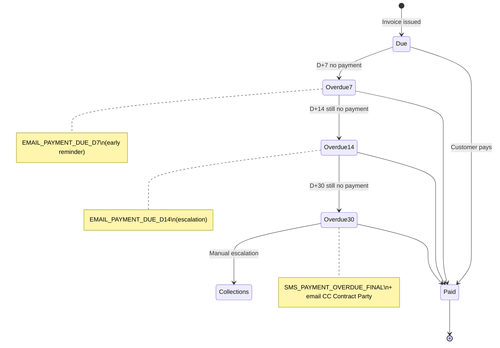
```mermaid
stateDiagram-v2
    [*] --> Due: Invoice issued
    Due --> Overdue7: D+7 no payment
    Overdue7 --> Overdue14: D+14 still no payment
    Overdue14 --> Overdue30: D+30 still no payment
    Overdue30 --> Collections: Manual escalation
    Due --> Paid: Customer pays
    Overdue7 --> Paid
    Overdue14 --> Paid
    Overdue30 --> Paid
    Paid --> [*]

    note right of Overdue7: EMAIL_PAYMENT_DUE_D7\n(early reminder)
    note right of Overdue14: EMAIL_PAYMENT_DUE_D14\n(escalation)
    note right of Overdue30: SMS_PAYMENT_OVERDUE_FINAL\n+ email CC Contract Party
```

| Field | Value |
|---|---|
| **Actor** | SYSTEM (cron daily) |
| **Status** | 🟢 v1 (Phase 6) |
| **Main flow** | Daily job: checks all unpaid invoices. Routes notification per stage rule (channel matrix in CLAUDE.md / DOCUMENT_TEMPLATES.md §C). |

#### UC-PY-07 — Reconciliation against tax invoice

| Field | Value |
|---|---|
| **Actor** | MANAGER+ |
| **Status** | 🟢 v1 (Phase 6) |
| **Main flow** | When B2B tax invoice issued (UC-TI-02), Payment auto-links via TaxInvoice row. Discrepancies flagged. |

---

### 7.9 Tax Invoice (UC-TI)

#### UC-TI-01 — Upload manual tax invoice PDF

| Field | Value |
|---|---|
| **Actor** | MANAGER+ |
| **Status** | 🟢 v1 (Phase 6) |
| **Preconditions** | B2B customer, payment recorded |
| **Main flow** | 1. Open Payment → "Attach tax invoice". 2. Upload PDF. 3. Enter invoice number + date. 4. System stores in object storage; creates TaxInvoice row. 5. Auto-emails to customer billing email. |
| **D.5 confirmed** | All B2B require tax invoice; PDF upload optional but warning shown if missing > 7 days. |

#### UC-TI-02 — Auto-email invoice to customer

(See UC-TI-01 main flow step 5.) Email routed via Resend with attached PDF.

#### UC-TI-03 — Viettel SInvoice integration

| Field | Value |
|---|---|
| **Actor** | SYSTEM |
| **Status** | 🔵 v2+ (Phase 8+) |
| **Main flow** | After Payment confirmed → POST to SInvoice API with invoice payload → receive eInvoice XML + number → store as TaxInvoice with `invoiceProvider='VIETTEL_SINVOICE'`. |

#### UC-TI-04 — Reissue tax invoice

| Field | Value |
|---|---|
| **Actor** | MANAGER+ |
| **Status** | 🟢 v1 |
| **Main flow** | 1. Open TaxInvoice. 2. "Reissue" with reason (correction / cancellation). 3. Generates new invoice referencing original. 4. AuditLog. |

---

### 7.10 Notifications (UC-NT)

Channel selection rule lives in `src/lib/notifications/router.ts`. Full matrix in [`DOCUMENT_TEMPLATES.md §C`](./DOCUMENT_TEMPLATES.md). Template inventory:

| Code | Channel | Trigger | Recipient |
|---|---|---|---|
| `SMS_PORTAL_WELCOME` | SMS | UC-CM-03 portal enabled | New CustomerContact |
| `SMS_PASSWORD_RESET` | SMS | UC-AU-05 / UC-AU-06 | Contact whose pw was reset |
| `SMS_VISIT_REMINDER` | SMS | UC-VS-10 (D-1) | Primary OPS contact |
| `SMS_SR_APPROVED` | SMS | UC-SR-02 | SR submitter |
| `SMS_SR_REJECTED` | SMS | UC-SR-03 | SR submitter |
| `SMS_PAYMENT_OVERDUE_FINAL` | SMS | UC-PY-06 D+30 | Contract Party |
| `SMS_CONTRACT_RENEWAL_FINAL` | SMS | UC-NT-08 D-7 | Contract Party |
| `EMAIL_PORTAL_WELCOME` | Email | UC-CM-03 portal enabled | New CustomerContact (long-form) |
| `EMAIL_RECEIPT` | Email | UC-PY-01 / UC-PY-02 | Primary OPS |
| `EMAIL_SR_RECEIVED` | Email | UC-SR-01 | SR submitter |
| `EMAIL_SR_APPROVED_DETAILS` | Email | UC-SR-02 | SR submitter |
| `EMAIL_FILTER_DUE_D14` | Email | UC-NT-06 | Primary OPS |
| `EMAIL_PAYMENT_DUE_D7` | Email | UC-PY-06 D+7 | Contract Party + Primary OPS |
| `EMAIL_PAYMENT_DUE_D14` | Email | UC-PY-06 D+14 | Contract Party + Primary OPS |
| `EMAIL_RENTAL_DUE_D60` | Email | UC-NT-08 D-60 | Contract Party |
| `EMAIL_RENTAL_DUE_D30` | Email | UC-NT-08 D-30 | Contract Party |
| `EMAIL_VISIT_COMPLETED` | Email | UC-VS-06 | Primary OPS (with PDF) |
| `EMAIL_TAX_INVOICE` | Email | UC-TI-02 | Contract Party (billing) |
| `EMAIL_CONTRACT_COPY` | Email | UC-CT-10 | Contract Party |
| `EMAIL_RENTAL_COMPLETED` | Email | UC-EQ-07 | Contract Party |

#### UC-NT-09 — Contact opts out of channel

| Field | Value |
|---|---|
| **Actor** | Customer (portal) |
| **Status** | 🟢 v1 (Phase 3.5) |
| **Main flow** | 1. Portal → Settings → Notifications. 2. Toggle SMS opt-out and/or Email opt-out. 3. `CustomerContact.smsOptOut`/`emailOptOut` updated. |
| **Effect** | Future marketing/non-critical messages skipped for that channel. |

#### UC-NT-10 — System message overrides opt-out

| Field | Value |
|---|---|
| **Actor** | SYSTEM |
| **Trigger** | Password reset, payment receipt, security alert |
| **Behavior** | Notification router ignores opt-out flag for `category='SYSTEM'` templates. AuditLog notes override. |

---

### 7.11 Customer Portal (UC-PT)

#### UC-PT-01 — First-time login + force password change

(See [UC-AU-04](#uc-au-04--customer-portal-login).)

#### UC-PT-02 — View equipment list

| Field | Value |
|---|---|
| **Actor** | Customer |
| **Status** | 🟢 v1 (Phase 3.5) |
| **Main flow** | 1. Portal → My Equipment. 2. Shows all active equipment with: model, install date, next inspection date, status. 3. (B2B) Grouped by Site. |

#### UC-PT-03 — View visit history

| Field | Value |
|---|---|
| **Actor** | Customer |
| **Status** | 🟢 v1 |
| **Main flow** | List of past visits with: date, type, technician name, summary, attached work confirmation PDF. |

#### UC-PT-04 — Submit service request

(See [UC-SR-01](#uc-sr-01--customer-submits-service-request-via-portal).)

#### UC-PT-05 — Download tax invoice (B2B)

| Field | Value |
|---|---|
| **Actor** | B2B Customer (Contract Party or primary OPS) |
| **Status** | 🟢 v1 (Phase 6) |
| **Main flow** | Portal → Tax Invoices → list of all issued invoices → click → download PDF. |

#### UC-PT-06 — Edit own contact info

| Field | Value |
|---|---|
| **Actor** | Any portal-enabled contact |
| **Status** | 🟢 v1 |
| **Main flow** | Edit name/email/language (phone is locked — needs office support to change). |

#### UC-PT-07 — Manage other contacts (B2B HQ)

| Field | Value |
|---|---|
| **Actor** | CONTRACT_PARTY or primary OPS_CONTACT |
| **Status** | 🟢 v1 |
| **Main flow** | Portal → My Customer → Contacts → add/edit/disable. CONTRACT_PARTY can manage all; primary OPS can manage same-site only. |

#### UC-PT-08 — View customer dashboard

| Field | Value |
|---|---|
| **Actor** | Customer |
| **Status** | 🟢 v1 |
| **Main flow** | Landing page shows: upcoming visit, pending SR, outstanding balance, next filter due, recent activity feed. |

---

### 7.12 Reporting & Audit (UC-RP)

#### UC-RP-01 — Daily visit summary

| Field | Value |
|---|---|
| **Actor** | MANAGER+ |
| **Status** | 🟢 v1 (Phase 6) |
| **Main flow** | Dashboard widget: today's scheduled / in-progress / completed / failed visits, by technician. |

#### UC-RP-02 — Monthly revenue report

| Field | Value |
|---|---|
| **Actor** | MANAGER+ |
| **Status** | 🟢 v1 |
| **Main flow** | Report: total revenue by month, broken down by SALE/RENTAL/MAINTENANCE/SR-fee, plus YoY trend. Exportable CSV. |

#### UC-RP-03 — Technician productivity report

| Field | Value |
|---|---|
| **Actor** | MANAGER+ |
| **Status** | 🟢 v1 |
| **Main flow** | Per-tech: visits completed, avg duration, customer satisfaction (if collected), late-cash incidents. |

#### UC-RP-04 — Overdue payments dashboard

| Field | Value |
|---|---|
| **Actor** | STAFF+ |
| **Status** | 🟢 v1 |
| **Main flow** | List of all unpaid invoices > 7 days, sorted by overdue duration. Bulk-send escalation actions. |

#### UC-RP-05 — Customer churn report

| Field | Value |
|---|---|
| **Actor** | MANAGER+ |
| **Status** | 🟡 v1.5 |
| **Main flow** | Quarterly: deactivated customers, reasons, value lost, geographic clusters. |

#### UC-RP-06 — Audit log search

| Field | Value |
|---|---|
| **Actor** | ADMIN / MANAGER |
| **Status** | 🟢 v1 |
| **Main flow** | Search AuditLog by: actor, entity type, action, date range. Shows before/after JSON diff. 24-month retention (H.2 confirmed). |

---

### 7.13 Administration (UC-AD)

#### UC-AD-01 — Create staff user

| Field | Value |
|---|---|
| **Actor** | ADMIN |
| **Status** | 🟢 v1 |
| **Main flow** | 1. Settings → Users → "+ New". 2. Enter username, phone, role (ADMIN/MANAGER/STAFF/TECHNICIAN), region. 3. System generates temp password + sends SMS. 4. Force password change on first login. |

#### UC-AD-02 — Disable staff user

| Field | Value |
|---|---|
| **Actor** | ADMIN |
| **Status** | 🟢 v1 |
| **Main flow** | Set `User.status='DISABLED'`. Active sessions invalidated. |

#### UC-AD-03 — Update permissions

| Field | Value |
|---|---|
| **Actor** | ADMIN |
| **Status** | 🟢 v1 |
| **Main flow** | Change role. Limited to one role (no compound roles — see SPEC §2.1). |

#### UC-AD-04 — Configure notification templates

| Field | Value |
|---|---|
| **Actor** | ADMIN |
| **Status** | 🟡 v1.5 |
| **Main flow** | Edit per-locale template body in admin UI. Preview render with sample data. Save → DB-backed override (file-based default remains as fallback). |

#### UC-AD-05 — Configure scheduling rules

| Field | Value |
|---|---|
| **Actor** | ADMIN |
| **Status** | 🟡 v1.5 |
| **Main flow** | Edit scheduler weights (preferred-tech bonus, region match weight, load-balance penalty). Test on past visits. |

#### UC-AD-06 — Run database backup / restore

| Field | Value |
|---|---|
| **Actor** | ADMIN (or platform-managed) |
| **Status** | 🟢 v1 |
| **Main flow** | Daily 03:00 VST backup window (H.3). Restore tooling docs in `docs/PROCESS_NOTES.md`. |

---

## 8. State Machines

### 8.1 Contract states

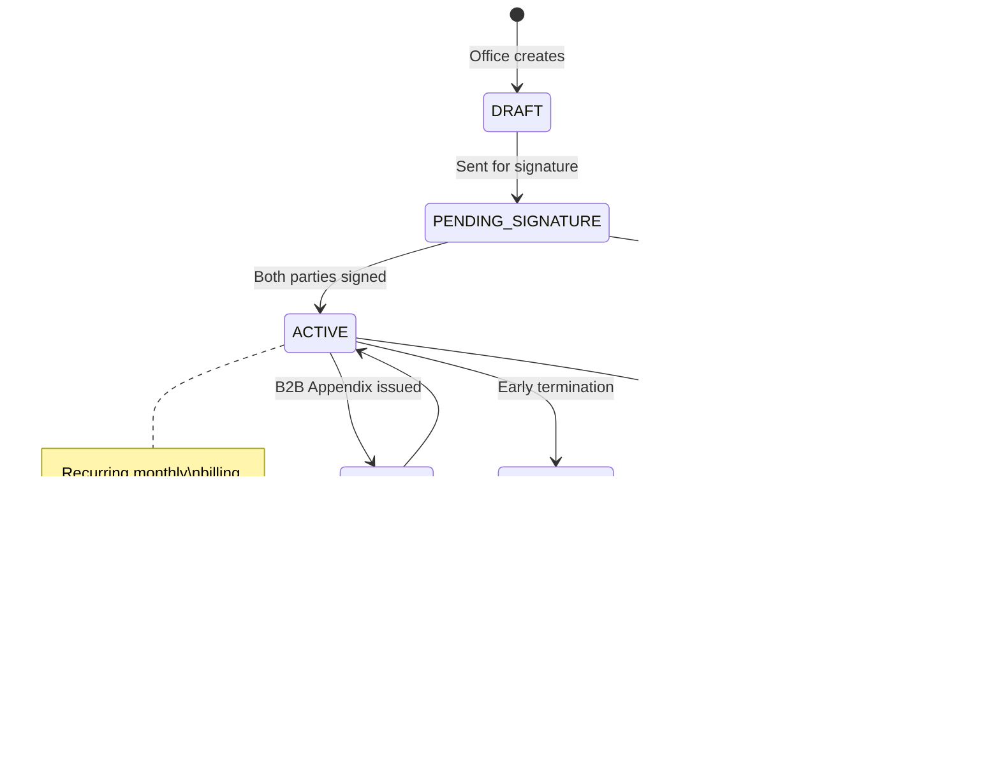
```mermaid
stateDiagram-v2
    [*] --> DRAFT: Office creates
    DRAFT --> PENDING_SIGNATURE: Sent for signature
    PENDING_SIGNATURE --> ACTIVE: Both parties signed
    PENDING_SIGNATURE --> CANCELLED: Cancelled before activation
    ACTIVE --> AMENDED: B2B Appendix issued
    AMENDED --> ACTIVE
    ACTIVE --> COMPLETED: Rental term ends + paid
    ACTIVE --> TERMINATED: Early termination
    COMPLETED --> [*]
    TERMINATED --> [*]
    CANCELLED --> [*]

    note right of ACTIVE: Recurring monthly\nbilling cycle while here
    note right of COMPLETED: Equipment ownership\nauto-transfers (rental)\nB.3 confirmed
```

### 8.2 Visit states

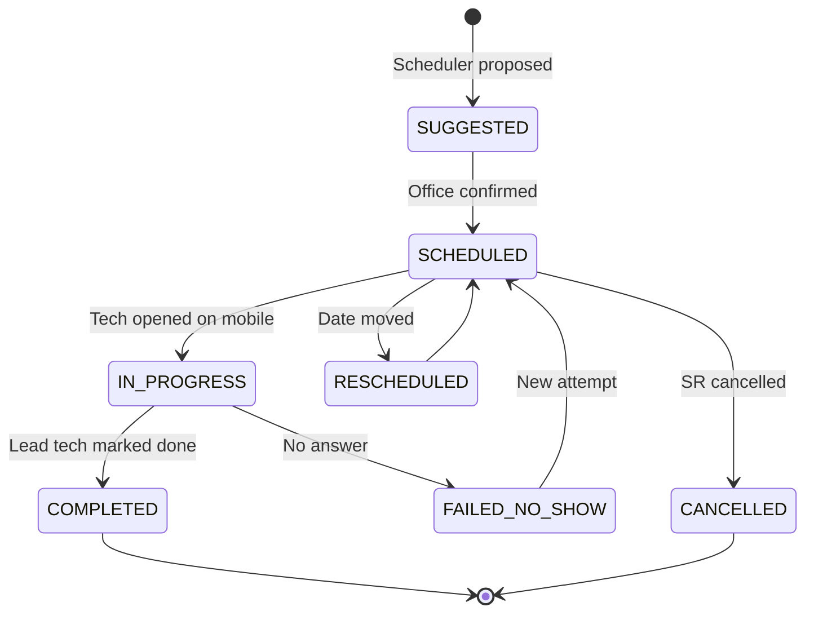
```mermaid
stateDiagram-v2
    [*] --> SUGGESTED: Scheduler proposed
    SUGGESTED --> SCHEDULED: Office confirmed
    SCHEDULED --> IN_PROGRESS: Tech opened on mobile
    IN_PROGRESS --> COMPLETED: Lead tech marked done
    IN_PROGRESS --> FAILED_NO_SHOW: No answer
    SCHEDULED --> RESCHEDULED: Date moved
    RESCHEDULED --> SCHEDULED
    SCHEDULED --> CANCELLED: SR cancelled
    COMPLETED --> [*]
    FAILED_NO_SHOW --> SCHEDULED: New attempt
    CANCELLED --> [*]
```

### 8.3 Service Request states

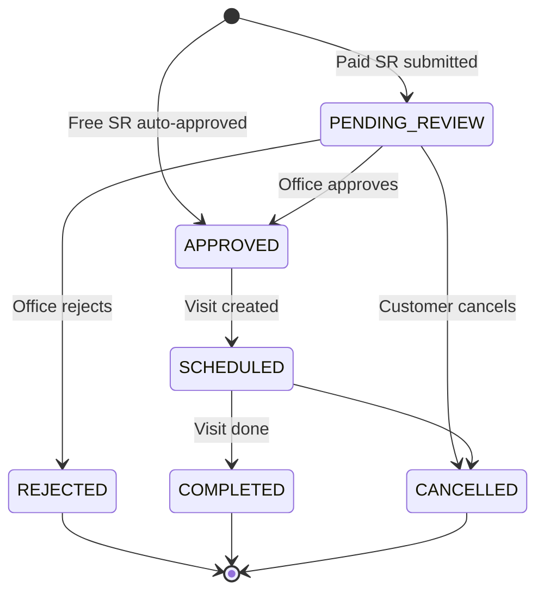
```mermaid
stateDiagram-v2
    [*] --> PENDING_REVIEW: Paid SR submitted
    [*] --> APPROVED: Free SR auto-approved
    PENDING_REVIEW --> APPROVED: Office approves
    PENDING_REVIEW --> REJECTED: Office rejects
    PENDING_REVIEW --> CANCELLED: Customer cancels
    APPROVED --> SCHEDULED: Visit created
    SCHEDULED --> COMPLETED: Visit done
    SCHEDULED --> CANCELLED
    REJECTED --> [*]
    COMPLETED --> [*]
    CANCELLED --> [*]
```

### 8.4 Payment states

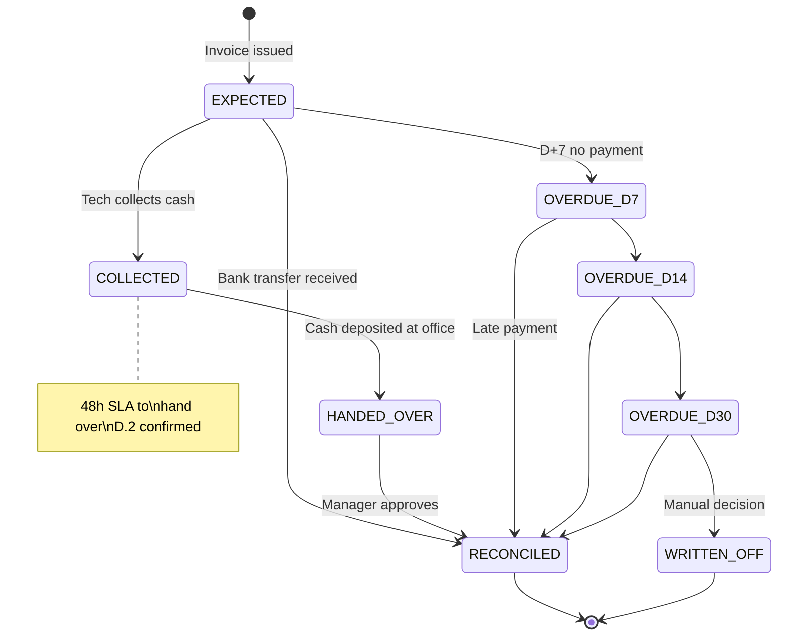
```mermaid
stateDiagram-v2
    [*] --> EXPECTED: Invoice issued
    EXPECTED --> COLLECTED: Tech collects cash
    EXPECTED --> RECONCILED: Bank transfer received
    COLLECTED --> HANDED_OVER: Cash deposited at office
    HANDED_OVER --> RECONCILED: Manager approves
    EXPECTED --> OVERDUE_D7: D+7 no payment
    OVERDUE_D7 --> OVERDUE_D14
    OVERDUE_D14 --> OVERDUE_D30
    OVERDUE_D30 --> WRITTEN_OFF: Manual decision
    OVERDUE_D7 --> RECONCILED: Late payment
    OVERDUE_D14 --> RECONCILED
    OVERDUE_D30 --> RECONCILED
    RECONCILED --> [*]
    WRITTEN_OFF --> [*]

    note right of COLLECTED: 48h SLA to\nhand over\nD.2 confirmed
```

### 8.5 Equipment states

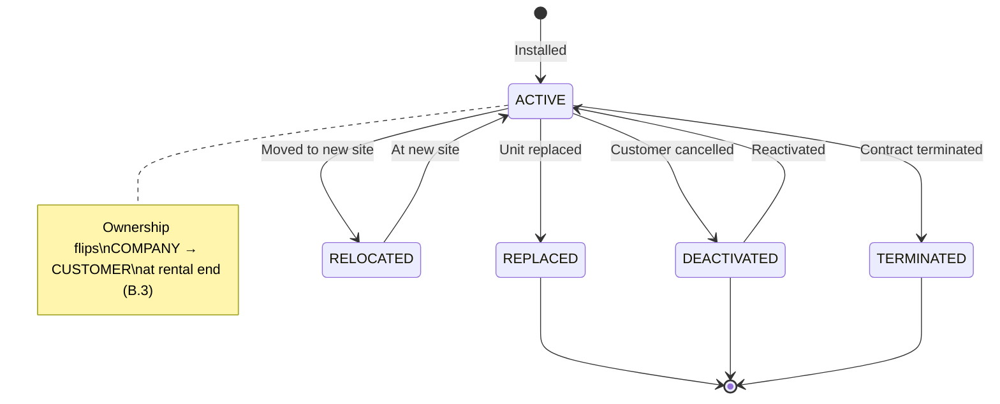
```mermaid
stateDiagram-v2
    [*] --> ACTIVE: Installed
    ACTIVE --> REPLACED: Unit replaced
    ACTIVE --> RELOCATED: Moved to new site
    ACTIVE --> DEACTIVATED: Customer cancelled
    ACTIVE --> TERMINATED: Contract terminated
    RELOCATED --> ACTIVE: At new site
    REPLACED --> [*]
    DEACTIVATED --> ACTIVE: Reactivated
    DEACTIVATED --> [*]
    TERMINATED --> [*]

    note right of ACTIVE: Ownership flips\nCOMPANY → CUSTOMER\nat rental end (B.3)
```

---

## 9. User Journey Diagrams

### 9.1 Happy path — new B2C customer end-to-end

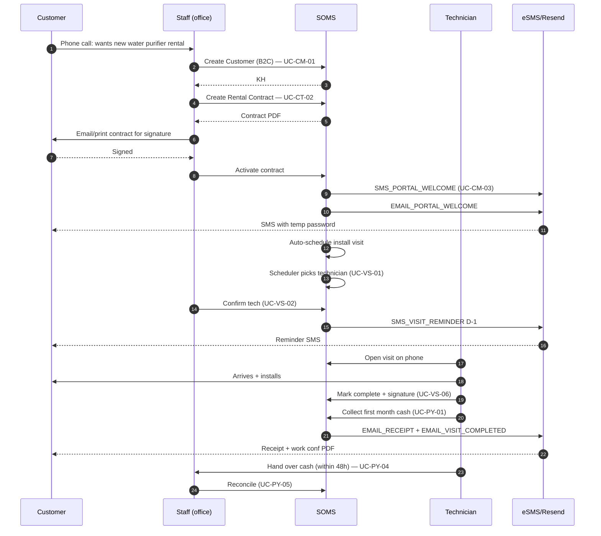
```mermaid
sequenceDiagram
    autonumber
    participant CO as Customer
    participant SF as Staff (office)
    participant SYS as SOMS
    participant TX as Technician
    participant SMS as eSMS/Resend

    CO->>SF: Phone call: wants new water purifier rental
    SF->>SYS: Create Customer (B2C) — UC-CM-01
    SYS-->>SF: KH#####
    SF->>SYS: Create Rental Contract — UC-CT-02
    SYS-->>SF: Contract PDF
    SF->>CO: Email/print contract for signature
    CO-->>SF: Signed
    SF->>SYS: Activate contract
    SYS->>SMS: SMS_PORTAL_WELCOME (UC-CM-03)
    SYS->>SMS: EMAIL_PORTAL_WELCOME
    SMS-->>CO: SMS with temp password
    SYS->>SYS: Auto-schedule install visit
    SYS->>SYS: Scheduler picks technician (UC-VS-01)
    SF->>SYS: Confirm tech (UC-VS-02)
    SYS->>SMS: SMS_VISIT_REMINDER D-1
    SMS-->>CO: Reminder SMS
    TX->>SYS: Open visit on phone
    TX->>CO: Arrives + installs
    TX->>SYS: Mark complete + signature (UC-VS-06)
    TX->>SYS: Collect first month cash (UC-PY-01)
    SYS->>SMS: EMAIL_RECEIPT + EMAIL_VISIT_COMPLETED
    SMS-->>CO: Receipt + work conf PDF
    TX->>SF: Hand over cash (within 48h) — UC-PY-04
    SF->>SYS: Reconcile (UC-PY-05)
```

### 9.2 B2B customer with multi-site flow

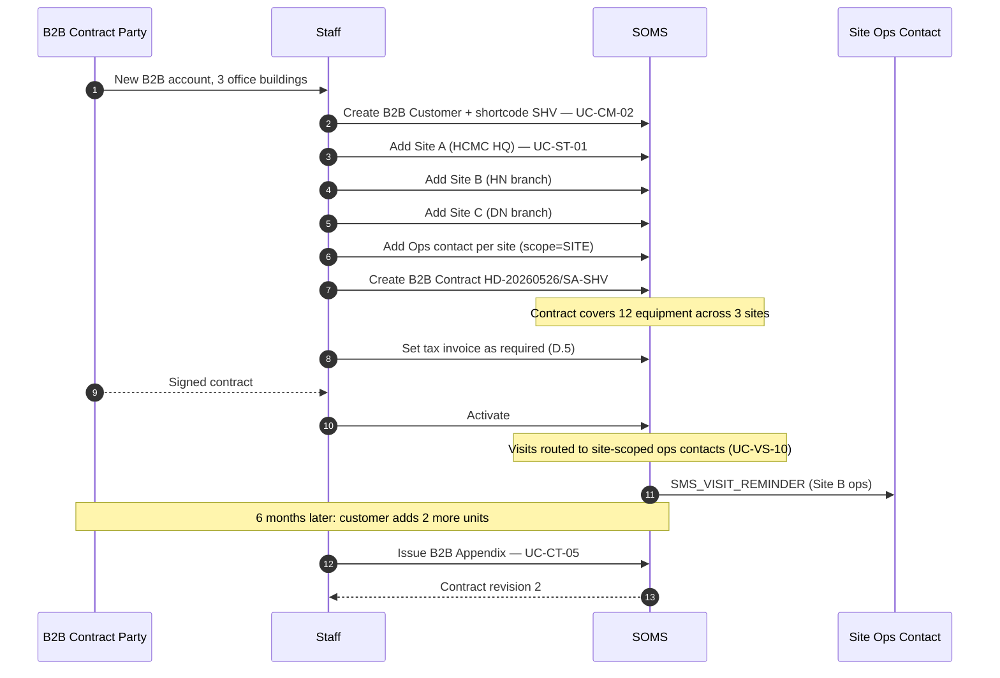
```mermaid
sequenceDiagram
    autonumber
    participant CP as B2B Contract Party
    participant SF as Staff
    participant SYS as SOMS
    participant OPS as Site Ops Contact

    CP->>SF: New B2B account, 3 office buildings
    SF->>SYS: Create B2B Customer + shortcode SHV — UC-CM-02
    SF->>SYS: Add Site A (HCMC HQ) — UC-ST-01
    SF->>SYS: Add Site B (HN branch)
    SF->>SYS: Add Site C (DN branch)
    SF->>SYS: Add Ops contact per site (scope=SITE)
    SF->>SYS: Create B2B Contract HD-20260526/SA-SHV
    Note over SYS: Contract covers 12 equipment across 3 sites
    SF->>SYS: Set tax invoice as required (D.5)
    CP-->>SF: Signed contract
    SF->>SYS: Activate
    Note over SYS: Visits routed to site-scoped ops contacts (UC-VS-10)
    SYS->>OPS: SMS_VISIT_REMINDER (Site B ops)
    Note over CP,SYS: 6 months later: customer adds 2 more units
    SF->>SYS: Issue B2B Appendix — UC-CT-05
    SYS-->>SF: Contract revision 2
```

### 9.3 Service request → completion (paid)

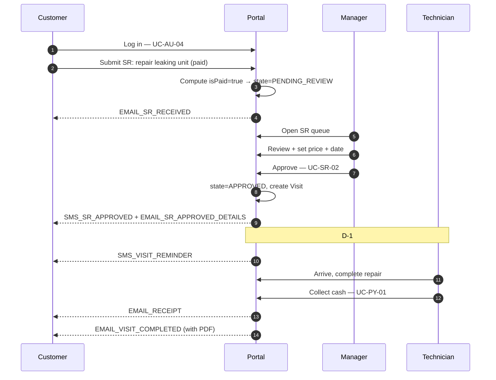
```mermaid
sequenceDiagram
    autonumber
    participant CO as Customer
    participant POR as Portal
    participant MG as Manager
    participant TX as Technician

    CO->>POR: Log in — UC-AU-04
    CO->>POR: Submit SR: repair leaking unit (paid)
    POR->>POR: Compute isPaid=true → state=PENDING_REVIEW
    POR-->>CO: EMAIL_SR_RECEIVED
    MG->>POR: Open SR queue
    MG->>POR: Review + set price + date
    MG->>POR: Approve — UC-SR-02
    POR->>POR: state=APPROVED, create Visit
    POR-->>CO: SMS_SR_APPROVED + EMAIL_SR_APPROVED_DETAILS
    Note over POR,TX: D-1
    POR-->>CO: SMS_VISIT_REMINDER
    TX->>POR: Arrive, complete repair
    TX->>POR: Collect cash — UC-PY-01
    POR-->>CO: EMAIL_RECEIPT
    POR-->>CO: EMAIL_VISIT_COMPLETED (with PDF)
```

### 9.4 Overdue payment escalation

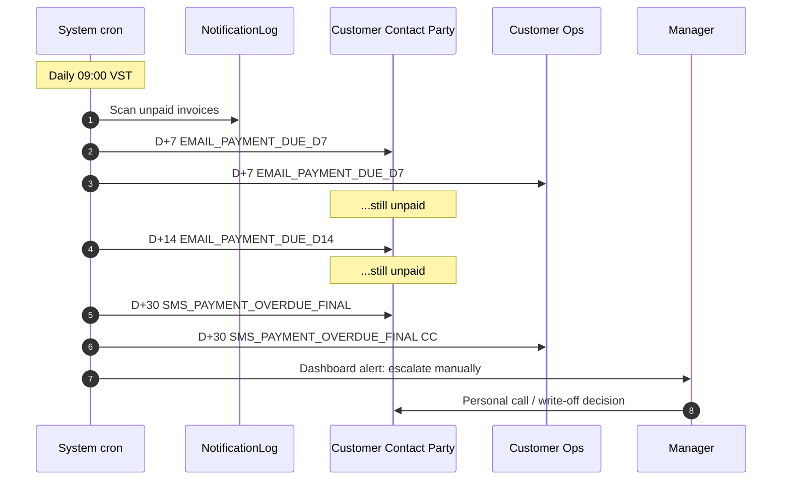
```mermaid
sequenceDiagram
    autonumber
    participant CRON as System cron
    participant LOG as NotificationLog
    participant CO as Customer Contact Party
    participant OPS as Customer Ops
    participant MG as Manager

    Note over CRON: Daily 09:00 VST
    CRON->>LOG: Scan unpaid invoices
    CRON->>CO: D+7 EMAIL_PAYMENT_DUE_D7
    CRON->>OPS: D+7 EMAIL_PAYMENT_DUE_D7
    Note over CO: ...still unpaid
    CRON->>CO: D+14 EMAIL_PAYMENT_DUE_D14
    Note over CO: ...still unpaid
    CRON->>CO: D+30 SMS_PAYMENT_OVERDUE_FINAL
    CRON->>OPS: D+30 SMS_PAYMENT_OVERDUE_FINAL CC
    CRON->>MG: Dashboard alert: escalate manually
    MG->>CO: Personal call / write-off decision
```

---

## 10. Functional Requirements Summary

### 10.1 By domain (high-level checklist)

| Domain | Must-have v1 (Phase 1–6) | v1.5 (Phase 7) | v2+ (Phase 8+) |
|---|---|---|---|
| **Auth** | JWT (staff + customer), 15min/7day TTL, 5-fail lockout, password reset SMS | Session "remember me", per-device session mgmt | SSO / 2FA / Zalo OA login |
| **Customer** | B2C + B2B + Site hierarchy, KH-code, search, deactivate | Merge duplicates, advanced segmentation | CRM-style segmentation |
| **Equipment** | Catalog + installed + filter policy + ownership flip | Inventory / stock | IoT telemetry |
| **Contracts** | B2C in-place edit, B2B Appendix, code format, renewal | Bulk contract operations | E-signature (tablet/digital) |
| **Service Request** | Customer submit, office approve/reject, auto-Visit | SLA escalation | Predictive maintenance |
| **Visit** | Auto-recommend + manual confirm, multi-tech (lead+collab), mobile-first | Offline queue (PWA), route optimization | Map view, in-app navigation |
| **Payment** | Cash + bank transfer, 48h SLA, partial+carryover, overdue escalation | Bulk reconciliation | Bank API integration |
| **Tax Invoice** | PDF upload (B2B), email delivery | Bulk issuance | Viettel SInvoice live integration |
| **Notification** | 7 SMS + 9 email templates, channel router, opt-out | Custom templates per customer | Zalo OA + Zalo Mini App |
| **Portal** | Login, equipment, visits, SR, downloads, opt-out | Push notifications | Zalo Mini App |
| **Reporting** | Daily/monthly basics, audit search | Churn, cohort | BI dashboard / custom queries |
| **Admin** | User CRUD, audit log, backup/restore | Template editor, scheduler weights | Self-service plugin marketplace |

### 10.2 i18n requirements

| Surface | KO | VI | EN | Notes |
|---|:-:|:-:|:-:|---|
| Office desktop UI | ✅ | ✅ | ✅ | Staff can switch on any screen |
| Technician mobile | ✅ | ✅ | — | Technicians use KR or VI in field |
| Customer portal | ✅ | ✅ | ✅ | Detected from CustomerContact.language |
| SMS templates | ✅ | ✅ | ✅ | Recipient's language drives selection |
| Email templates | ✅ | ✅ | ✅ | Same |
| PDF documents (contract, receipt) | ✅ | ✅ | — | EN PDFs Phase 7+ |
| Date format | YYYY-MM-DD (ISO) | DD/MM/YYYY | YYYY-MM-DD (ISO) | VI confirmed 2026-05-26 |
| Currency | ₫ VND (locale formatting) | ₫ VND | ₫ VND | VND only |

---

## 11. Non-Functional Requirements

### 11.1 Performance

| Metric | Target | Measurement |
|---|---|---|
| Time to first contentful paint (TTFP) — office desktop | < 1.5 s p95 | Vercel Speed Insights |
| TTFP — mobile portal | < 2.5 s p95 (4G) | Vercel + RUM |
| API response p95 | < 300 ms | Server logs |
| Customer search results | < 1 s p95 with 10k records | Prisma query plans |
| Scheduler recommendation | < 500 ms p95 | Server logs |
| Daily cron job duration | < 5 min | Logs |

### 11.2 Security

| Requirement | How |
|---|---|
| PII at rest encryption | Column-level encryption on `Customer.phone`, `address`; Postgres TDE for full disk |
| PII in transit | HTTPS everywhere; HSTS preload |
| Auth | bcrypt (cost 12); JWT signed; refresh token rotation on every use |
| CSRF | SameSite=Strict cookies; double-submit token for mutations |
| Rate limiting | 5 failed logins → 15 min lockout (F.6); per-IP API rate limit |
| Audit | 24-month AuditLog retention (H.2) for all state-mutating actions |
| Secrets | Env vars only; never logged or in source |
| Backups | Daily 03:00 VST; 30-day rolling retention |
| GDPR/PDP | Right to erasure: customer hard-delete tooling (not in v1 — soft-delete only) |

### 11.3 Mobile / device

| Constraint | Value |
|---|---|
| Min Android | 8.0 (Oreo, ~2017) — K.1 |
| Min iOS | 14 — K.1 |
| Min screen | 5"–6" portrait |
| Min camera | 8MP+ (for signature + photo evidence) |
| Connectivity | Online-first v1 (C.4); Phase 7 offline queue |
| PWA installability | Required for technician + customer portal |

### 11.4 Accessibility

| Requirement | Target |
|---|---|
| WCAG | 2.1 AA |
| Keyboard navigation | All flows |
| Screen reader | Aria labels on custom components |
| Color contrast | ≥ 4.5:1 for text |

### 11.5 Data retention

| Data | Retention | Source |
|---|---|---|
| Contracts | 10 years | E.4 |
| Tax invoices | 10 years | E.4 |
| Receipts, delivery slips, work confirmations | 5 years | E.4 |
| Audit log | 24 months | H.2 |
| Notification log | 24 months | Defensive default |
| Paper docs digitized | 1 year then destroy | E.5 |
| Backups | 30 days rolling | Standard |

### 11.6 Localization (VI legal)

- Vietnamese Personal Data Protection Law applies to all customer PII
- Tax invoice format per Vietnamese tax authority (Hóa đơn GTGT)
- Currency in VND with proper formatting (e.g. `1.500.000 ₫`)

---

## 12. Phased Rollout

Full plan in [`PROJECT_PLAN.md`](./PROJECT_PLAN.md). High-level:

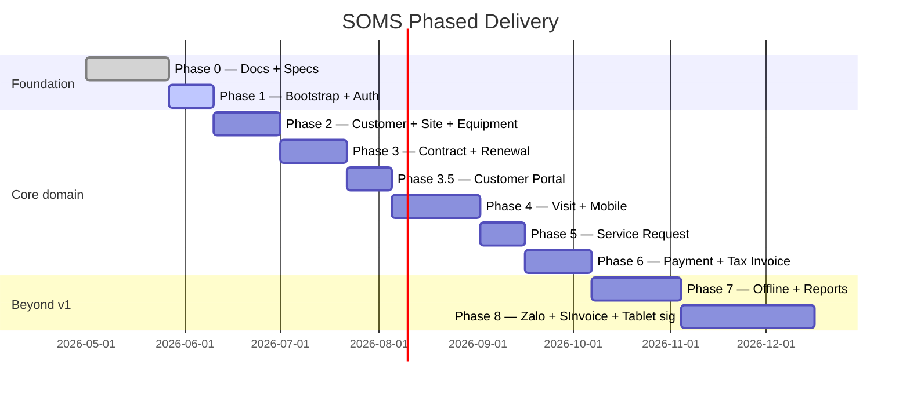
```mermaid
gantt
    title SOMS Phased Delivery
    dateFormat YYYY-MM-DD
    section Foundation
    Phase 0 — Docs + Specs           :done, p0, 2026-05-01, 2026-05-27
    Phase 1 — Bootstrap + Auth       :active, p1, 2026-05-27, 14d
    section Core domain
    Phase 2 — Customer + Site + Equipment   :p2, after p1, 21d
    Phase 3 — Contract + Renewal     :p3, after p2, 21d
    Phase 3.5 — Customer Portal      :p35, after p3, 14d
    Phase 4 — Visit + Mobile         :p4, after p35, 28d
    Phase 5 — Service Request        :p5, after p4, 14d
    Phase 6 — Payment + Tax Invoice  :p6, after p5, 21d
    section Beyond v1
    Phase 7 — Offline + Reports      :p7, after p6, 28d
    Phase 8 — Zalo + SInvoice + Tablet sig :p8, after p7, 42d
```

| Phase | Use cases delivered |
|---|---|
| **0** | All documentation (this PRD, SPEC, plan, data model, templates) |
| **1** | UC-AU-01..03 (staff + technician login) |
| **2** | UC-CM-01..07, UC-ST-01..04, UC-EQ-01..03,05,06 |
| **3** | UC-CT-01..10, UC-EQ-04, UC-EQ-07 |
| **3.5** | UC-AU-04..07, UC-PT-01..08, UC-CM-03 portal side, UC-NT-* portal welcome |
| **4** | UC-VS-01..11, UC-PY-01 cash flow on mobile |
| **5** | UC-SR-01..06 |
| **6** | UC-PY-02..07, UC-TI-01..02,04, UC-RP-01..04,06, UC-AD-01..03,06 |
| **7** | UC-CM-08 merge, UC-VS offline, UC-RP-05, UC-AD-04..05 |
| **8+** | UC-TI-03 SInvoice, Zalo OA, Zalo Mini App, tablet e-sig |

---

## 13. Open Questions & Out of Scope

### 13.1 Open (pending answer)

| ID | Question | Owner | Status |
|---|---|---|---|
| A.5 | Filter ↔ equipment-model compatibility CSV | Client | Pending delivery 2026-05-29 evening |
| (any future) | — | — | — |

### 13.2 Out of scope (explicit)

See [§3.2](#32-non-goals-explicit).

---

## 14. Glossary

| Term | KR | VI | Definition |
|---|---|---|---|
| Customer | 고객 | Khách hàng | The contracting entity (B2C household or B2B company) |
| Site | 사업장 / 사이트 | Cơ sở / Địa điểm | Physical sub-location of a B2B customer (factory, branch office) |
| Contract Party | 계약 주체 | Bên ký hợp đồng | The CustomerContact who signs contracts and receives legal notices |
| Ops Contact | 관리 주체 | Liên hệ vận hành | Day-to-day point of contact (visit confirmations, SMS) |
| Equipment | 장비 | Thiết bị | An installed unit (water purifier, bidet, air purifier) |
| EquipmentModel | 장비 모델 | Mẫu thiết bị | Catalog row representing a product the company sells/rents |
| Contract | 계약서 | Hợp đồng | Sale, rental, or maintenance agreement |
| Appendix | 부록서 | Phụ lục hợp đồng | B2B amendment to an existing contract (vs new contract) |
| Visit | 현장 / 방문 | Lượt thăm | Single field call by a technician |
| Lead technician | 주관 기사 | KTV chính | Primary technician on a visit (payment + signoff) |
| Collaborator | 협업 기사 | KTV phụ | Secondary technician assisting on a visit |
| Service Request | 서비스 요청 | Yêu cầu dịch vụ | Customer-submitted request (inspection / repair / part replacement / relocation) |
| Cash collection | 수금 | Thu tiền | Cash payment received by technician in field |
| Cash handover | 입금 | Nộp tiền | Technician depositing collected cash at office (48h SLA) |
| Tax invoice | 세금계산서 | Hóa đơn GTGT | Vietnamese e-tax invoice (B2B only) |
| Receipt | 영수증 | Hóa đơn (thu tiền) | Cash collection receipt |
| Work confirmation | 작업확인서 | Phiếu xác nhận công việc | PDF generated at end of visit |
| Delivery slip | 출고서 | Phiếu xuất kho | B2B device handoff form |
| Periodic inspection | 정기 점검 | Bảo trì định kỳ | Monthly/bi-monthly scheduled visit |
| KH-code | 고객 코드 | Mã khách hàng | Customer code in format `KH#####` |
| Shortcode | 단축 코드 | Mã viết tắt | B2B 2–5 letter abbreviation used in contract codes |

---

> **Document history**
> - **v1.0** 2026-05-27 — Initial draft consolidating SPEC, PROCESS_NOTES, DATA_MODEL_NOTES, DOCUMENT_TEMPLATES, PROJECT_PLAN into a single PRD with 70+ use cases, 5 state machines, 4 sequence diagrams, and a permissions matrix.
