# USER_WORKFLOWS — Seoul Aqua SOMS End-to-End Workflows

**Version:** 2026-06-02 draft
**Audience:** New engineers / QA / sales / technician training leads
**Source documents:** [SPEC.md](./SPEC.md) · [PROCESS_NOTES.md](./PROCESS_NOTES.md) · [DOCUMENT_TEMPLATES.md](./DOCUMENT_TEMPLATES.md) · [DATA_MODEL_NOTES.md](./DATA_MODEL_NOTES.md)

> This document is the single-source operations reference for **every major workflow** performed by **every user group** (ADMIN / MANAGER / STAFF / TECHNICIAN / CUSTOMER) in SOMS. It is not a data-model or API reference — it answers **who does what, when, and why**, with diagrams.

## Table of Contents

0. [System Overview (3-Realm)](#0-system-overview-3-realm)
1. [Role-Based Permission Matrix](#1-role-based-permission-matrix)
2. [Master Data Setup](#2-master-data-setup)
3. [Customer Lifecycle](#3-customer-lifecycle)
4. [Contract Workflow](#4-contract-workflow)
5. [Equipment Lifecycle](#5-equipment-lifecycle)
6. [Periodic Maintenance](#6-periodic-maintenance)
7. [Service Request](#7-service-request)
8. [Visit Workflow](#8-visit-workflow)
9. [Billing · Payment · Tax Invoice](#9-billing--payment--tax-invoice)
10. [Notifications (Cross-cutting)](#10-notifications-cross-cutting)
11. [Authentication · Sessions (3-Realm)](#11-authentication--sessions-3-realm)
12. [Audit Log](#12-audit-log)

---

## 0. System Overview (3-Realm)

SOMS operates **three isolated authentication realms** on the same domain. Each realm has its own login page, JWT audience, session cookies, sessionStorage namespace, AuthProvider, and a separate set of API routes.

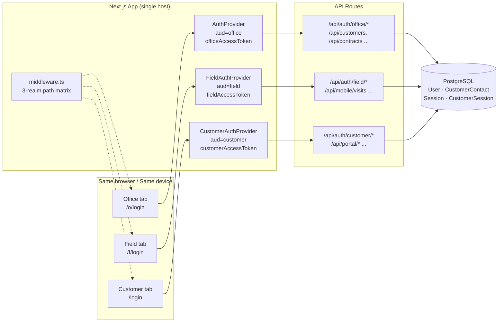

**Realm isolation guarantees**:
- Cookie names differ per realm, preventing cross-realm overwrites
- sessionStorage namespaces (`soms_office_*` / `soms_field_*` / `soms_customer_*`) are separate, enabling simultaneous logins
- The middleware requires the matching realm cookie for each path prefix

| Path prefix | Realm | Redirect on missing |
|---|---|---|
| `/o/login` | office (public) | — |
| `/o/...` | office | `/{locale}/o/login` |
| `/f/login` | field (public) | — |
| `/f/...` | field | `/{locale}/f/login` |
| `/login`, `/forgot-password`, `/change-password` | customer (public) | — |
| Other root paths | customer | `/{locale}/login` |

---

## 1. Role-Based Permission Matrix

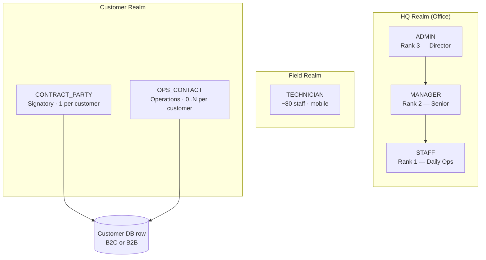

**Core permission gating (SPEC §2.1)**:

| Capability | ADMIN | MANAGER | STAFF | TECH | CP | OPS |
|---|---|---|---|---|---|---|
| User management · system settings | ● | — | — | — | — | — |
| Price change · contract amendment | ● | ● | — | — | — | — |
| Tax invoice issuance · month close | ● | ● | — | — | — | — |
| Customer password reset | ● | ● | — | — | — | — |
| Service request approval (paid) | ● | ● | ● | — | — | — |
| Customer · Contract · Equipment CRUD | ● | ● | ● | — | — | — |
| Visit create / reschedule | ● | ● | ● | — | — | — |
| Payment entry / matching | ● | ● | ● | — | — | — |
| Mobile visit completion · own collection | ● | ● | ● | ●(own only) | — | — |
| Audit log read | ● | ● | — | — | — | — |
| Audit log export | ● | — | — | — | — | — |
| Add / edit / delete OPS_CONTACT | ● | ● | — | — | ●(own customer) | — |
| Submit service request | — | — | — | — | ● | ● |

---

## 2. Master Data Setup

Data that ADMIN/MANAGER populates before service operations begin.

### 2.1 Product Catalog (Brand · EquipmentModel · Filter)

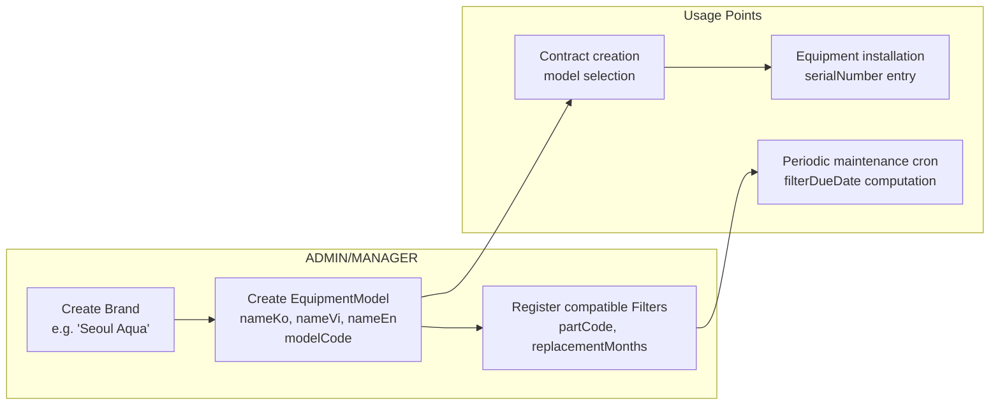

**Path**: `/o/admin/products` → Brand tab → Model tab → CSV upload supported (see sample_catalog_for_upload.csv)

**Validation rules**:
- `modelCode` is unique within a Brand
- Model names are required in all three languages (ko/vi/en) for i18n
- Compatible Filters must be looked up by `modelCode`

### 2.2 Staff User Registration (HQ + Technician)

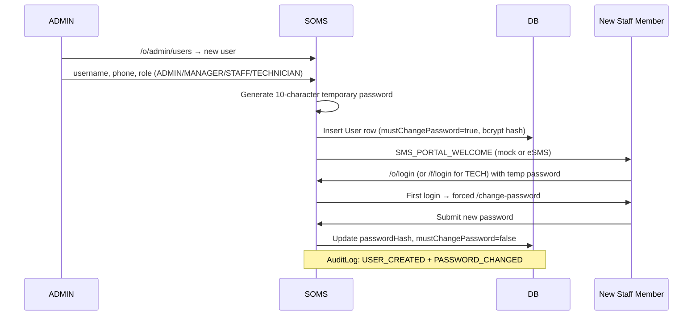

**Important**:
- TECHNICIAN logs in by phone instead of username (mobile UX)
- ADMIN/MANAGER/STAFF can log in with either username or phone — note that **username is intentionally non-unique** (it is a display label); namesake staff disambiguate by phone
- If two or more staff share a username, login itself **fails closed** with `INVALID_CREDENTIALS` (security decision; see SPEC §11.4 follow-up)

### 2.3 Technician Profile (preferredRegion · Vehicle · Etc.)

After TECHNICIAN registration, ADMIN/MANAGER should fill in:
- `preferredRegion` — used by the technician assignment algorithm (SPEC §6.4.1)
- `isActive` — disable on leave/resignation (excludes from auto-assignment)
- `availableDays`, `availableHours` — e.g. weekend availability

---

## 3. Customer Lifecycle

### 3.1 B2C Customer Creation

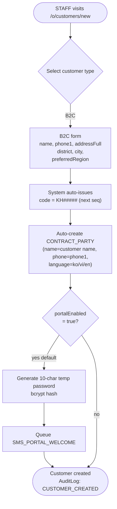

### 3.2 B2B Customer Creation + Site Registration

```mermaid
flowchart TD
  Start([STAFF visits /o/customers/new])
  B2BForm["B2B form<br/>name(=company), taxCode (required)<br/>shortcode (2-5 alpha)<br/>HQ addressFull"]
  GenCode["code = KH#####<br/>shortcode = SHV/MMD/...<br/>(used in B2B contract codes)"]
  CreateCP["Auto-create CONTRACT_PARTY<br/>scope=CUSTOMER (org level)<br/>title='CEO' / 'Legal Rep'"]
  AddSites{Add Site?<br/>(Plant A, HQ,<br/>R&D Building...)}
  SiteForm["Site form<br/>name, addressFull,<br/>region, phone"]
  AddOpsContact{Add Site-scoped<br/>OPS?}
  OpsForm["OPS_CONTACT form<br/>scope=SITE, siteId=X<br/>name, phone, language<br/>(e.g. 'Plant A facilities mgr')"]
  Done([B2B setup complete])

  Start --> B2BForm --> GenCode --> CreateCP --> AddSites
  AddSites -->|yes| SiteForm --> AddOpsContact
  AddSites -->|no — HQ only| Done
  AddOpsContact -->|yes| OpsForm --> AddSites
  AddOpsContact -->|no| AddSites
```

### 3.3 Customer Contact Management (1 + N Model)

Every Customer has **exactly 1 CONTRACT_PARTY** + **0..N OPS_CONTACTs**.

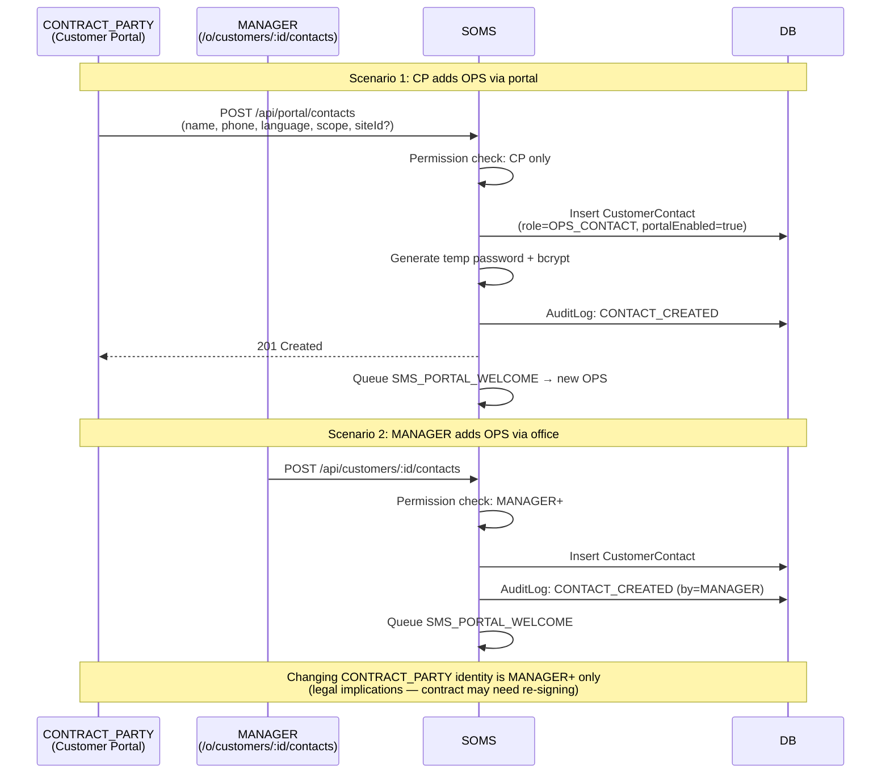

**Contact routing rules (SPEC §3.3.1)**:

| Channel | Recipient | Language | Fallback |
|---|---|---|---|
| Contract · tax invoice · legal notice | CONTRACT_PARTY | CP.language | required — no fallback |
| Visit SMS · receipts · periodic check report | primary OPS_CONTACT | OPS.language | CP.language → vi |
| Overdue dunning | CP + all OPS (CC) | each their own language | — |
| Mobile "call customer" | primary OPS | — | CP |

### 3.4 Customer Portal Auto-Activation

A portal account is auto-provisioned at customer creation or contract activation — there is no explicit registration screen.

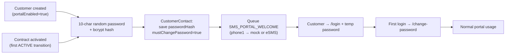

**MANAGER+ can reset at any time** — `POST /api/portal/auth/reset-password` (admin mode). Generates a new temp password → queues SMS_PASSWORD_RESET → revokes all existing sessions (security).

---

## 4. Contract Workflow

### 4.1 Contract Type Branching

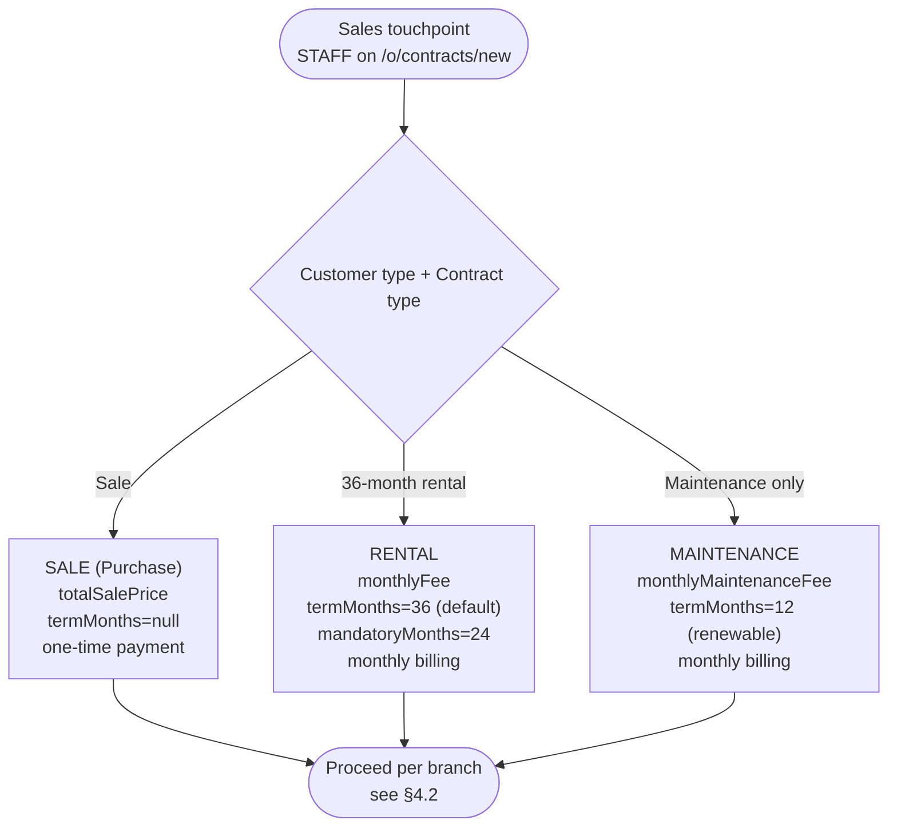

### 4.2 Contract Create → Sign → Activate

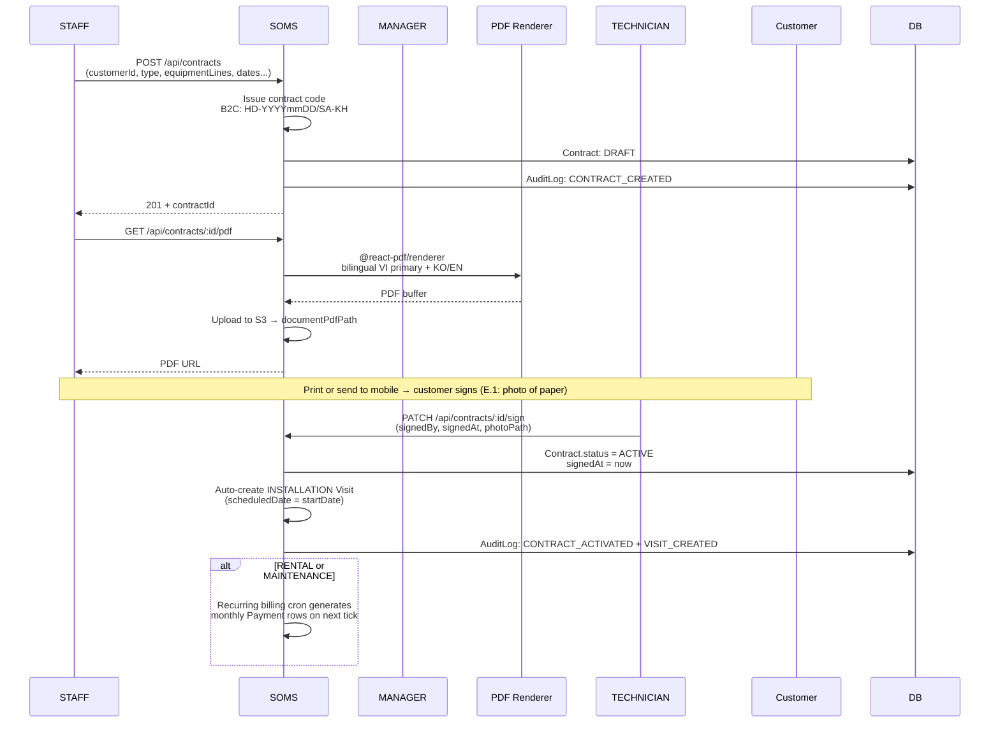

### 4.3 Contract State Machine

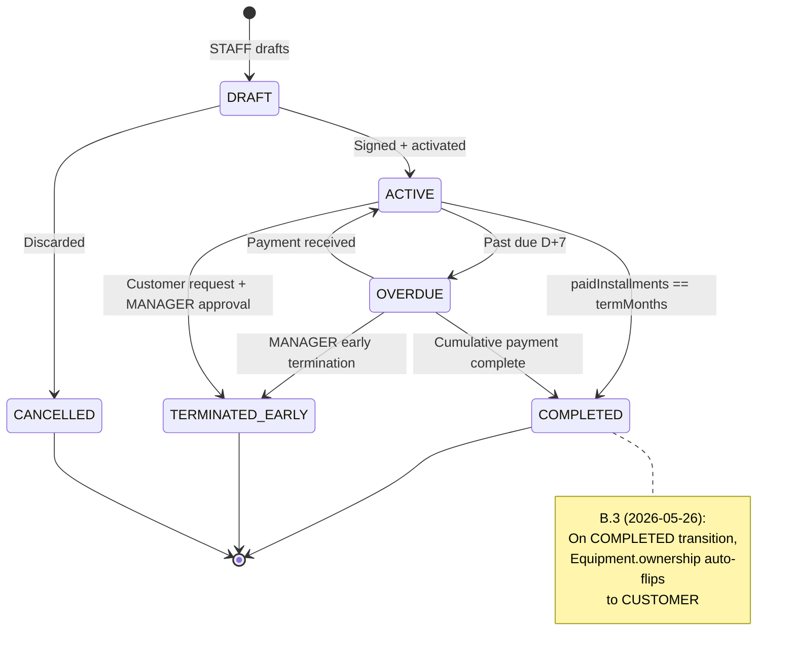

### 4.4 B2B Appendix (Contract Amendment)

When a B2B customer adds equipment to an existing contract, instead of issuing a new contract we use an **Appendix**.

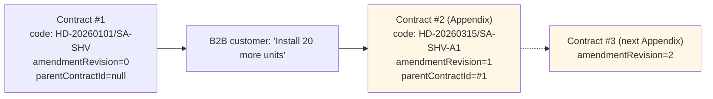

**B2C does NOT use Appendix** — price/equipment changes are in-place updates + an AuditLog entry only.

### 4.5 Contract Renewal (RENTAL → MAINTENANCE)

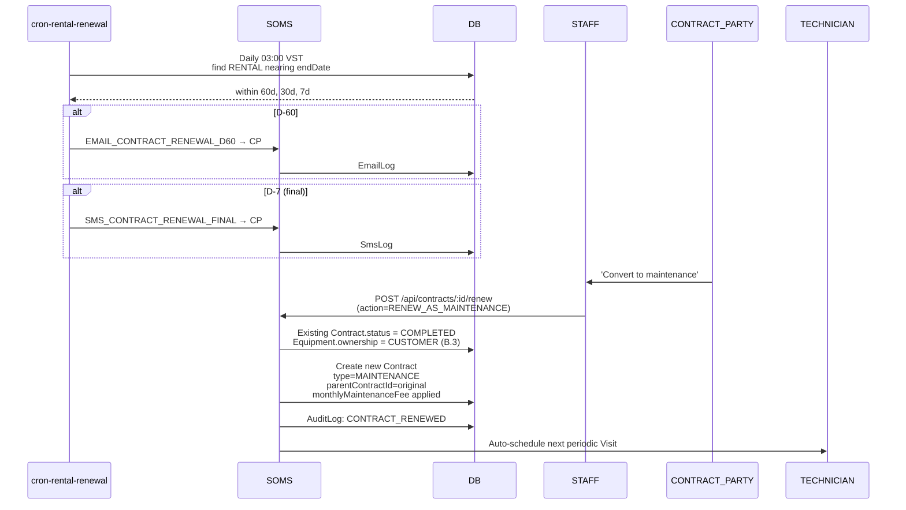

### 4.6 Early Termination (TERMINATED_EARLY)

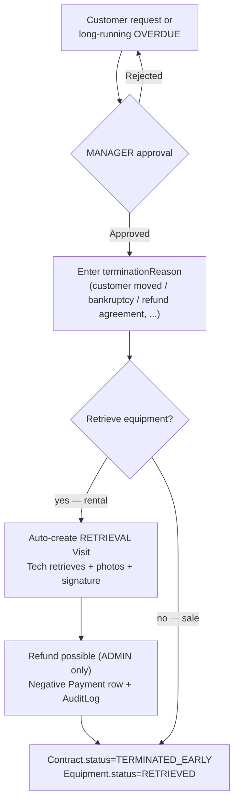

---

## 5. Equipment Lifecycle

### 5.1 Equipment State Machine

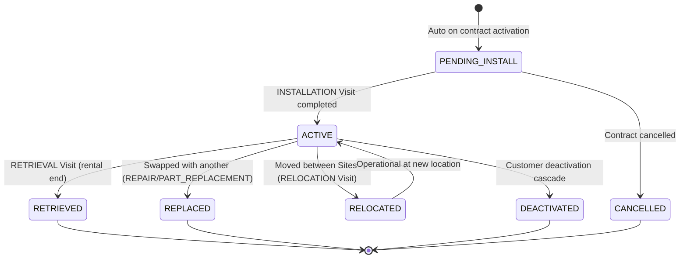

### 5.2 Equipment Installation Flow

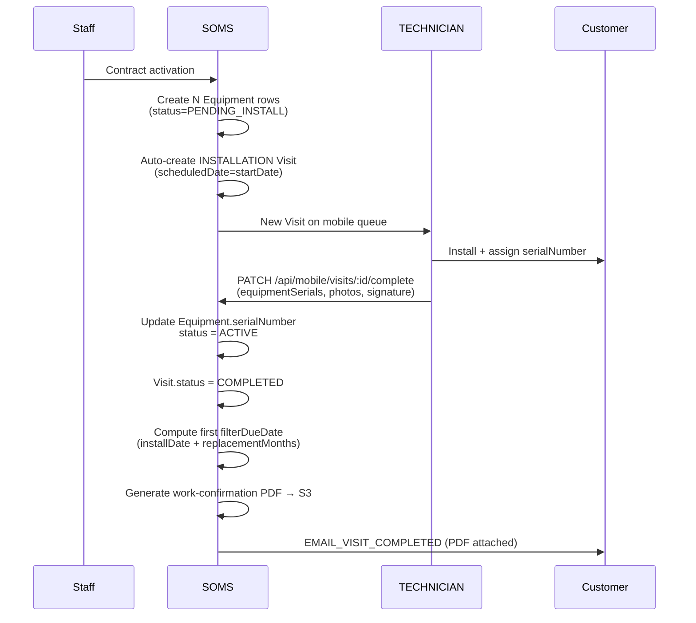

### 5.3 Equipment Replacement (REPLACE)

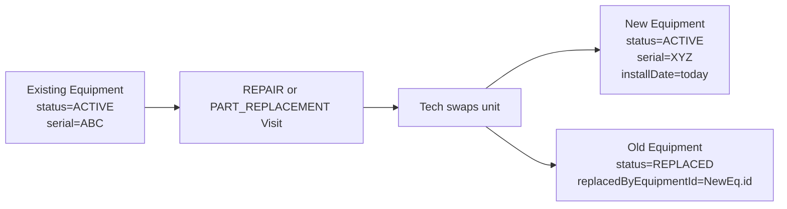

### 5.4 Equipment Relocation (B2B Site → Site)

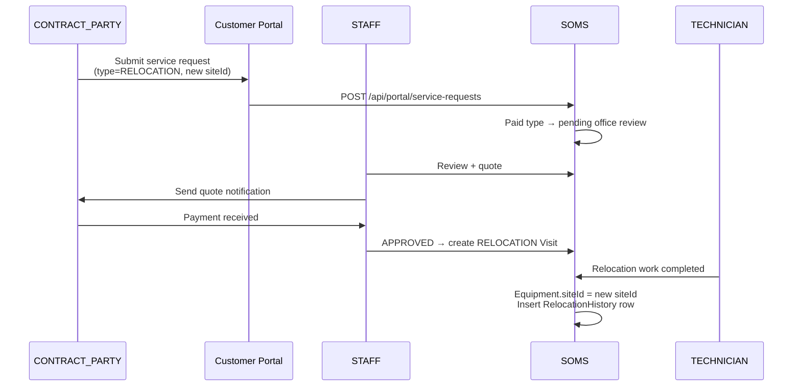

---

## 6. Periodic Maintenance

Periodic maintenance is an automated workflow that visits equipment under RENTAL/MAINTENANCE contracts on a monthly or bi-monthly cadence to replace filters.

### 6.1 End-to-End Flow (Cron-driven)

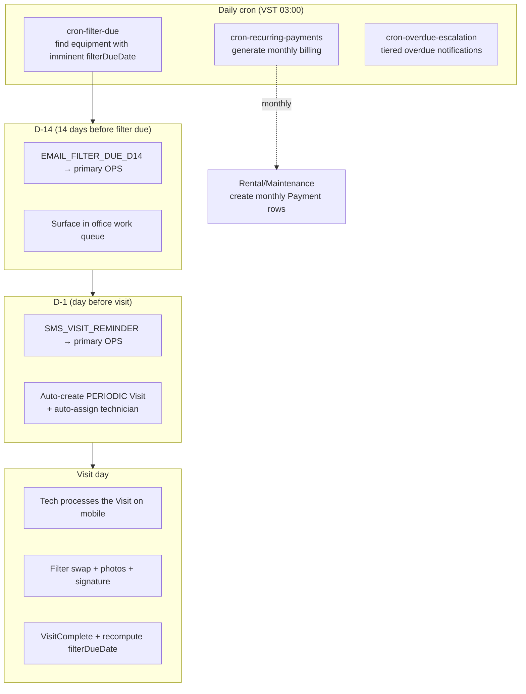

### 6.2 Filter Due Calculation

```
filterDueDate = Equipment.installDate + EquipmentModel.filter.replacementMonths
```

Recomputed on each replacement: `filterDueDate = lastReplacedAt + replacementMonths`.

`filterPolicy` JSON (E.2):
- Default RENTAL = filters included free
- B2C SALE = filters paid (customer-borne)
- Specific partCodes may be exceptions (contract-level overrides)

### 6.3 After Periodic Visit Completion

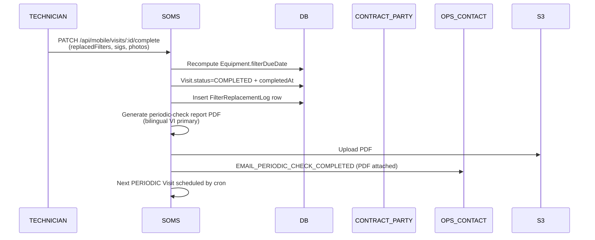

---

## 7. Service Request

Customer-submitted requests via the portal. Some auto-approve, others require office review + quoting.

### 7.1 Service Request State Machine

```mermaid
stateDiagram-v2
  [*] --> SUBMITTED: Customer submits
  SUBMITTED --> AUTO_APPROVED: Free type, automatic
  SUBMITTED --> APPROVED: After office review
  SUBMITTED --> REJECTED: Office rejects

  AUTO_APPROVED --> SCHEDULED: Visit auto-created
  APPROVED --> SCHEDULED: Visit created

  SCHEDULED --> COMPLETED: Visit completed
  SCHEDULED --> CANCELLED: Customer cancels
  REJECTED --> [*]
  COMPLETED --> [*]
  CANCELLED --> [*]
```

### 7.2 Free SR (Auto-approved — INSPECTION/CONSULTATION)

```mermaid
sequenceDiagram
  participant Customer as CONTRACT_PARTY/OPS
  participant Portal as Customer Portal
  participant System as SOMS
  participant Scheduler as Scheduler
  participant Tech as TECHNICIAN

  Customer->>Portal: /portal/requests/new<br/>(type=INSPECTION, photos)
  Portal->>System: POST /api/portal/service-requests
  System->>System: Free type → AUTO_APPROVED
  System->>Scheduler: Auto-create PERIODIC Visit<br/>(C.1 algorithm)
  System->>System: Set ServiceRequest.linkedVisitId
  System->>Customer: EMAIL_SR_RECEIVED + SMS_SR_APPROVED (date)
  System->>Tech: Add to mobile queue

  Tech->>Customer: Visit + work
  Tech->>System: Visit COMPLETED
  System->>System: ServiceRequest.status = COMPLETED
  System->>Customer: EMAIL_VISIT_COMPLETED
```

### 7.3 Paid SR (Requires Review — RELOCATION/PART_REPLACEMENT)

```mermaid
sequenceDiagram
  participant Customer
  participant Portal
  participant System
  participant Staff as STAFF+
  participant Tech as TECHNICIAN

  Customer->>Portal: type=RELOCATION, new address
  Portal->>System: POST /api/portal/service-requests
  System->>System: Paid type → SUBMITTED (pending review)
  System->>Customer: EMAIL_SR_RECEIVED (under review notice)
  System->>Staff: Add to office queue<br/>/o/service-requests?state=SUBMITTED

  Staff->>System: Review + enter quote<br/>(quotedAmount)
  alt Approved
    Staff->>System: PATCH /api/service-requests/:id<br/>(state=APPROVED)
    System->>System: Auto-create Visit
    System->>Customer: SMS_SR_APPROVED + EMAIL_SR_APPROVED (PDF quote)
    Customer->>System: Payment (BANK_TRANSFER) → office matching
    Tech->>Customer: Visit + work
    Tech->>System: COMPLETED
  else Rejected
    Staff->>System: state=REJECTED + reason
    System->>Customer: SMS_SR_REJECTED + EMAIL_SR_REJECTED
  end
```

### 7.4 Service Request Message Thread

Customer and office can exchange messages within an SR (mockup screen 53).

```mermaid
flowchart LR
  Customer["CONTRACT_PARTY/OPS<br/>(/portal/requests/:id)"]
  Office["STAFF+<br/>(/o/service-requests/:id)"]
  Thread[("SR Message Thread<br/>(AuditLog action='SR_MESSAGE')")]
  Poll["30s polling<br/>(TanStack Query<br/>refetchInterval)"]

  Customer -->|POST msg| Thread
  Office -->|POST msg| Thread
  Poll -.-> Customer
  Poll -.-> Office
  Thread -->|GET messages| Customer
  Thread -->|GET messages| Office
```

---

## 8. Visit Workflow

### 8.1 Visit State Machine

```mermaid
stateDiagram-v2
  [*] --> SCHEDULED: Auto or manual creation
  SCHEDULED --> CONFIRMED: Customer confirms
  SCHEDULED --> RESCHEDULED: Schedule change
  RESCHEDULED --> SCHEDULED: New row created, linked

  CONFIRMED --> IN_PROGRESS: Tech arrives + starts
  SCHEDULED --> IN_PROGRESS: B2B proceeds without confirm

  IN_PROGRESS --> COMPLETED: Tech completes + signature
  IN_PROGRESS --> NEEDS_REVISIT: Parts missing / revisit required

  SCHEDULED --> CUSTOMER_NO_SHOW: Customer absent
  CUSTOMER_NO_SHOW --> RESCHEDULED

  SCHEDULED --> CANCELLED: Customer/office cancellation

  COMPLETED --> [*]
  NEEDS_REVISIT --> SCHEDULED
  CANCELLED --> [*]
```

### 8.2 Auto-Scheduler Recommendation (C.1)

```mermaid
flowchart TD
  Start["New Visit created (SR approval or PERIODIC cron)"]
  Q1{Customer.preferredTechnicianId<br/>set?}
  Q2{Preferred tech<br/>available that day?}
  PickPreferred["Priority 1: preferred tech"]

  Q3["Region-match candidate pool<br/>Technician.preferredRegion ∩ Customer/Site.region"]
  Q4["Sort by daily load (ascending)<br/>(visits already assigned)"]
  PickByLoad["Priority 2: region + load balance"]

  Office["Office screen: top recommendation + candidate list"]
  Confirm{1-click approve}
  Override{Manual override<br/>pick another tech}
  Save["Save Visit.leadTechnicianId<br/>+ collaboratorTechnicianIds[]"]

  Start --> Q1
  Q1 -->|yes| Q2
  Q1 -->|no| Q3
  Q2 -->|yes| PickPreferred --> Office
  Q2 -->|no| Q3
  Q3 --> Q4 --> PickByLoad --> Office

  Office --> Confirm
  Confirm -->|yes| Save
  Confirm --> Override
  Override --> Save
```

### 8.3 Lead vs Collaborator Technicians (K.3)

```mermaid
flowchart LR
  Visit["Visit row<br/>leadTechnicianId (required)<br/>collaboratorTechnicianIds[] (optional)"]

  subgraph Lead["Lead Tech (1)"]
    L1["Can mark visit complete"]
    L2["Collect signature"]
    L3["Collect cash"]
    L4["Sign work-confirmation PDF"]
  end

  subgraph Collab["Collaborators (0..N)"]
    C1["Shows on mobile queue with 'Shared' badge"]
    C2["Can add photos · notes"]
    C3["Cannot mark complete"]
    C4["Cannot accept payment"]
  end

  Visit --> Lead
  Visit --> Collab
```

### 8.4 Mobile Visit Completion Wizard

```mermaid
sequenceDiagram
  participant Tech as TECHNICIAN<br/>(/f/visits/:id/complete)
  participant Mobile as Mobile UI
  participant System as SOMS
  participant Offline as IndexedDB queue

  Tech->>Mobile: Step 1: Arrive + mark IN_PROGRESS
  Mobile->>System: PATCH /api/mobile/visits/:id (status=IN_PROGRESS)

  Tech->>Mobile: Step 2: Select work items<br/>(filter swap, part replacement)
  Mobile->>Mobile: useApiQuery (staleTime:Infinity)<br/>← prevents mid-wizard value drift

  Tech->>Mobile: Step 3: Take + upload photos
  alt Online
    Mobile->>System: POST /api/mobile/visits/:id/photos
  else Offline (C.4 — Phase 7+)
    Mobile->>Offline: Queue PHOTO_UPLOAD
  end

  Tech->>Mobile: Step 4: Customer signature (E.1: paper photo)
  Mobile->>System: POST signaturePath

  Tech->>Mobile: Step 5: Collect payment
  alt Cash
    Tech->>Mobile: Amount + issue receipt
    Mobile->>System: POST /api/payments<br/>(method=CASH_AT_VISIT, collectedByUserId=tech)
    Note over Mobile,System: officeReceivedAt = null<br/>(office matches next day)
  else Already transferred
    Tech->>Mobile: BANK_TRANSFER skip
  end

  Tech->>Mobile: Step 6: Mark complete
  Mobile->>System: PATCH visit (status=COMPLETED, completedAt)
  System->>System: Recompute Equipment.filterDueDate
  System->>System: Generate work-confirmation PDF → S3
  System-->>Tech: Completion screen + next visit prompt
```

### 8.5 Cash Handover

```mermaid
sequenceDiagram
  participant Tech as TECHNICIAN
  participant Office as STAFF (next day)
  participant System as SOMS
  participant DB

  Note over Tech,DB: End of day

  Tech->>System: Check own undeposited cash<br/>(/f/profile → cash on hand)
  System-->>Tech: Sum = SUM(officeReceivedAt IS NULL Payments)

  Note over Tech,DB: Next business day morning

  Tech->>Office: Hand over cash + receipt copies
  Office->>System: /o/payments → match handover
  Office->>System: PATCH /api/payments/:id<br/>(officeReceivedAt = now, receivedByUserId)
  System->>DB: Payment.status = RECEIVED
  System->>DB: AuditLog: PAYMENT_OFFICE_RECEIVED

  alt Discrepancy (lost, not handed over)
    System->>System: cron-cash-handover-alert<br/>(notify ADMIN on D+1 non-handover)
  end
```

---

## 9. Billing · Payment · Tax Invoice

### 9.1 Payment Method Matrix

```mermaid
flowchart TD
  Bill["Billing trigger"]
  Bill --> A1[CASH_AT_VISIT]
  Bill --> A2[BANK_TRANSFER]
  Bill --> A3[B2B_EINVOICE]
  Bill --> A4[B2B_NO_INVOICE]

  A1 --> F1["Tech collects on site<br/>→ next-day office handover<br/>→ mark officeReceivedAt"]
  A2 --> F2["Customer transfers<br/>→ office matches transferReference<br/>→ status=RECONCILED"]
  A3 --> F3["Office issues external e-invoice<br/>→ upload PDF<br/>→ await transfer → match"]
  A4 --> F4["Same as BANK_TRANSFER<br/>invoicePdfPath=null"]
```

### 9.2 Monthly Billing (Recurring Payments Cron)

```mermaid
sequenceDiagram
  participant Cron as cron-recurring-payments
  participant DB
  participant System as SOMS
  participant CP as CONTRACT_PARTY

  Note over Cron,CP: 1st of each month, 03:00 VST

  Cron->>DB: Find ACTIVE Rental + MAINTENANCE
  loop per contract
    Cron->>DB: Does this month's Payment row exist?
    alt Missing
      Cron->>DB: Insert Payment row<br/>(amount=monthlyFee, status=PENDING,<br/>coveredMonth=YYYY-MM)
      Cron->>System: EMAIL_RENTAL_DUE → CP
    else Already present
      Cron->>Cron: skip
    end
  end
```

### 9.3 Payment State Machine

```mermaid
stateDiagram-v2
  [*] --> PENDING: Created by cron or manual entry
  PENDING --> RECEIVED: Cash collected or transfer arrived
  RECEIVED --> RECONCILED: Matched to contract installment
  PENDING --> WAIVED: ADMIN/MANAGER waived
  PENDING --> BOUNCED: Transfer failed / dishonor

  BOUNCED --> RECEIVED: Successful retransfer
  WAIVED --> [*]
  RECONCILED --> [*]
```

### 9.4 Overdue Escalation (Dunning)

```mermaid
flowchart TD
  Subgraph7d["D+7 (1st)"]
  Subgraph14d["D+14 (2nd)"]
  Subgraph30d["D+30 (final)"]

  Trigger["Payment.status=PENDING<br/>+ past dueDate"]

  Trigger --> D7{Daily cron check}
  D7 -->|D+7| E1[EMAIL_PAYMENT_OVERDUE_D7 → CP + OPS]
  D7 -->|D+14| E2[EMAIL_PAYMENT_OVERDUE_D14 → CP + OPS]
  D7 -->|D+30| E3[SMS_PAYMENT_OVERDUE_FINAL → CP + all OPS]
  E3 --> Action["Contract.status → OVERDUE<br/>Escalate to office for forced action"]
```

### 9.5 B2B Tax Invoice

In v1, an **external e-invoice system** (Viettel SInvoice / MISA / VNPT eHoadon) issues the PDF, which is then **uploaded** to SOMS.

```mermaid
sequenceDiagram
  participant Mgr as MANAGER
  participant System as SOMS
  participant External as External e-Invoice<br/>(Viettel/MISA/VNPT)
  participant CP as B2B Customer<br/>CONTRACT_PARTY
  participant Email as Email Relay<br/>(vhost.vn or Resend)

  Note over Mgr,Email: Month-end close + invoice issuance

  Mgr->>External: Issue tax invoice<br/>in external system
  External-->>Mgr: Download PDF

  Mgr->>System: /o/tax-invoices/new<br/>(customerId, contractId, upload PDF,<br/>invoiceNumber, issuedAt)
  System->>S3: Store PDF → invoicePdfPath
  System->>System: Link to Payment row<br/>(method=B2B_EINVOICE)
  System->>Email: EMAIL_TAX_INVOICE_ISSUED → CP<br/>(PDF attached, operational email channel)
  Email-->>CP: Delivered

  CP->>System: BANK_TRANSFER
  Mgr->>System: Office matching<br/>(enter transferReference)
  System->>System: Payment.status = RECONCILED
```

**Retention policy (E.4)**: Tax invoice PDFs are retained **10 years** (Vietnamese legal best practice). Regular receipts: 5 years.

### 9.6 Receipt

When a CASH_AT_VISIT payment is collected, the tech issues a receipt on site:

```mermaid
flowchart LR
  Cash["Tech collects cash"]
  GenReceipt["Receipt PDF generated immediately<br/>(bilingual)"]
  PrintShow{Tech's choice}
  Print["Portable printer output"]
  Show["Display on mobile + QR scan"]
  Email["EMAIL_PAYMENT_RECEIPT → primary OPS"]

  Cash --> GenReceipt --> PrintShow
  PrintShow --> Print
  PrintShow --> Show
  GenReceipt -.-> Email
```

---

## 10. Notifications (Cross-cutting)

### 10.1 Channel Selection Matrix

```mermaid
flowchart TD
  Template["Template to send"]
  Decision{Content nature}

  Decision -->|Security · Credentials<br/>≤24h window<br/>Final escalation| SMS["SMS Only<br/>(eSMS)"]
  Decision -->|Receipts · Periodic notices<br/>PDF attachments| Email["Email Only<br/>(Resend)"]
  Decision -->|Initial welcome · SR approval<br/>Rich guidance| Hybrid["SMS + Email<br/>(both)"]

  Template --> Decision

  Email --> Tax{Tax invoice?}
  Tax -->|yes| OpsEmail["vhost.vn operational channel"]
  Tax -->|no| TransEmail["Resend transactional channel"]
```

**SMS-Only cases (7 templates)**:
- SMS_PORTAL_WELCOME — First temp password (security)
- SMS_PASSWORD_RESET — Reset (security, ignores opt-out)
- SMS_VISIT_REMINDER — D-1 reminder
- SMS_SR_APPROVED — Paid SR final approval + schedule
- SMS_SR_REJECTED — Rejection + reason
- SMS_PAYMENT_OVERDUE_FINAL — D+30 final escalation
- SMS_CONTRACT_RENEWAL_FINAL — D-7 final renewal notice

**Email-Only / Hybrid cases**: see `docs/DOCUMENT_TEMPLATES.md` §B + §C matrix.

### 10.2 Channel Routing + Language Selection

```mermaid
flowchart TD
  Template["Template + context"]
  Channel{Channel?}

  Channel -->|SMS| Recipient1["Determine recipient"]
  Channel -->|Email| Recipient2["Determine recipient"]

  Recipient1 --> R1{Template kind}
  R1 -->|Contract · Legal| CP1[CONTRACT_PARTY]
  R1 -->|Operational · Visit| OPS1[primary OPS_CONTACT]
  R1 -->|Overdue final| Both1[CP + all OPS]

  Recipient2 --> R2{Language selection}
  R2 -->|contact.language present| L1[contact.language]
  R2 -->|empty| L2[CONTRACT_PARTY.language]
  R2 -->|CP also empty| L3[vi default]

  CP1 --> Send1["Send queue"]
  OPS1 --> Send1
  Both1 --> Send1
  L1 --> Send1
  L2 --> Send1
  L3 --> Send1

  Send1 --> Opt{Opt-out check}
  Opt -->|System msg<br/>password/receipt| IgnoreOpt["Ignore opt-out · force send"]
  Opt -->|Regular msg<br/>+ smsOptOut=true| Skip["Skip + log"]
  Opt -->|Regular msg<br/>+ opt-out=false| Deliver["Deliver"]
```

### 10.3 Channel Fallback

```mermaid
flowchart LR
  Decide["Preferred channel<br/>(per matrix)"]
  Check1{Preferred channel<br/>available?}
  Use1["Send via preferred channel"]
  Check2{Fallback channel<br/>available?}
  UseAlt["Send via fallback channel"]
  AdminAlert["Neither available →<br/>Notify ADMIN + AuditLog"]

  Decide --> Check1
  Check1 -->|yes — phone/email exists| Use1
  Check1 -->|no| Check2
  Check2 -->|yes| UseAlt
  Check2 -->|no| AdminAlert
```

---

## 11. Authentication · Sessions (3-Realm)

### 11.1 Office Login + Silent Refresh

```mermaid
sequenceDiagram
  participant U as Office user
  participant L as /o/login
  participant API as /api/auth/office/login
  participant DB
  participant App as Office area

  U->>L: username/phone + password
  L->>API: POST credentials
  API->>DB: Look up User<br/>(phone unique) or (username findMany take:2)
  alt Namesake on username
    API-->>L: 401 INVALID_CREDENTIALS<br/>(security: identical message)
  end
  API->>API: bcrypt compare + role check
  alt Role mismatch (e.g. TECHNICIAN to office)
    API-->>L: 409 ROLE_MISMATCH<br/>+ suggestedUrl: /f/login
  end
  API->>DB: Session row + issue JWT<br/>(aud=office, 15min)
  API->>DB: refreshToken (30d, httpOnly)
  API-->>L: { user, accessToken } + cookies
  L->>App: router.replace(/o/dashboard)

  loop Every 12 minutes
    App->>API: POST /api/auth/office/refresh<br/>(refreshToken cookie)
    API-->>App: New accessToken
  end
```

### 11.2 Customer Portal Login

```mermaid
sequenceDiagram
  participant C as Customer
  participant L as /login
  participant API as /api/portal/auth/login
  participant DB

  C->>L: phone + password (+ optional contactId)
  L->>API: POST
  API->>DB: CustomerContact.findMany(phone=phone)
  alt Multiple contacts share phone (A.13)
    API-->>L: { candidates: [...] }<br/>Customer picks themselves
    C->>L: Pick contactId
    L->>API: POST + contactId
  end
  API->>API: bcrypt compare
  API->>DB: Create CustomerSession<br/>(aud=customer, 15min access + 30d refresh)
  API-->>L: { contact, accessToken, mustChangePassword }
  alt mustChangePassword=true
    L->>C: Force /change-password
  else
    L->>C: /
  end
```

### 11.3 Password Change + Sibling Session Revoke

```mermaid
sequenceDiagram
  participant C as Customer
  participant API as /api/portal/auth/change-password
  participant DB

  C->>API: POST oldPassword + newPassword
  API->>API: bcrypt compare oldPassword
  API->>DB: Update passwordHash
  API->>DB: revokeAllCustomerSessions(contactId)<br/>(invalidate all sessions)
  API->>DB: Issue new CustomerSession<br/>(only caller gets fresh cookies)
  API-->>C: New access/refresh cookies
  Note over API,DB: Any stolen refresh token<br/>becomes unusable at this point
```

### 11.4 Logout + Cache Cleanup

```mermaid
flowchart LR
  Logout["User clicks logout"]
  API["POST /api/auth/*/logout<br/>(delete session DB row)"]
  Clear["AuthProvider.logout finally:<br/>1. setUser(null)<br/>2. setAccessToken(null)<br/>3. sessionStorage.clear()<br/>4. queryClient.clear() ← entire TanStack Query cache<br/>5. (field only) clearOfflineQueue() ← Dexie IndexedDB"]
  Redirect["Redirect to realm login"]

  Logout --> API --> Clear --> Redirect
```

**Guarantee: even if another user logs in on the same device immediately afterward, no traces of the previous user's data are visible** (Phase 1 security fix outcome).

---

## 12. Audit Log

Every state-changing action writes an `AuditLog` row. 24-month retention (H.2).

```mermaid
flowchart LR
  subgraph Sources["Origins"]
    A["User actions<br/>(office/field/portal)"]
    B["Cron automation"]
    C["System auto-transitions<br/>(state machines)"]
  end

  subgraph Log["AuditLog row"]
    F1["actorUserId<br/>or actorContactId<br/>(NULL = system)"]
    F2["action: enum<br/>(CUSTOMER_CREATED,<br/>CONTRACT_ACTIVATED,<br/>VISIT_COMPLETED,<br/>PAYMENT_RECEIVED,<br/>SR_APPROVED, ...)"]
    F3["entityType + entityId<br/>(e.g. 'Contract', uuid)"]
    F4["before / after JSON<br/>(diff-capable)"]
    F5["createdAt + ip"]
  end

  A --> Log
  B --> Log
  C --> Log

  subgraph Read["Reading"]
    D1["MANAGER+ → /o/reports/audit"]
    D2["ADMIN → CSV export"]
  end

  Log --> D1
  Log --> D2
```

**ADMIN-only actions** (e.g. blocked login on ambiguous username) are also logged with a dedicated security action code such as `AMBIGUOUS_USERNAME` for post-incident traceability.

---

## Appendix: Workflow Matrix (Quick Reference)

| Workflow | Trigger | Actor | Output | Notification |
|---|---|---|---|---|
| Customer creation | STAFF | STAFF | KH##### + CP + portal | SMS_PORTAL_WELCOME |
| Contract creation | STAFF | STAFF | DRAFT contract + PDF | — |
| Contract activation | TECH signature | TECH | ACTIVE + INSTALLATION Visit | EMAIL_VISIT_COMPLETED |
| Periodic D-14 | cron-filter-due | system | Work-queue surface | EMAIL_FILTER_DUE_D14 |
| Periodic D-1 | cron | system | PERIODIC Visit | SMS_VISIT_REMINDER |
| Periodic complete | TECH | TECH | Periodic report PDF + filterDueDate recompute | EMAIL_PERIODIC_CHECK_COMPLETED |
| Free SR | CUSTOMER portal | CUSTOMER | AUTO_APPROVED + Visit | SMS_SR_APPROVED + EMAIL_SR_RECEIVED |
| Paid SR | CUSTOMER portal | STAFF+ review | Quote → APPROVED/REJECTED | EMAIL_SR_RECEIVED → SMS_SR_APPROVED/REJECTED |
| Visit complete | TECH mobile | TECH (lead) | Work-confirmation + Payment | EMAIL_VISIT_COMPLETED |
| Cash handover | TECH next day | TECH→STAFF | Payment.officeReceivedAt | — |
| Monthly billing | cron-recurring-payments | system | PENDING Payment | EMAIL_RENTAL_DUE |
| Overdue D+7 | cron-overdue-escalation | system | — | EMAIL_PAYMENT_OVERDUE_D7 |
| Overdue D+14 | cron | system | — | EMAIL_PAYMENT_OVERDUE_D14 |
| Overdue D+30 | cron | system | Contract → OVERDUE | SMS_PAYMENT_OVERDUE_FINAL |
| Tax invoice issuance | MANAGER | MANAGER | PDF upload + Payment link | EMAIL_TAX_INVOICE_ISSUED |
| Renewal D-60/30 | cron-rental-renewal | system | — | EMAIL_CONTRACT_RENEWAL_D60/D30 |
| Renewal D-7 | cron | system | — | SMS_CONTRACT_RENEWAL_FINAL |
| Renewal execution | STAFF | STAFF | New MAINTENANCE Contract + ownership flip | — |
| Password reset | MANAGER or self | MANAGER or self | Temp password + all sessions revoked | SMS_PASSWORD_RESET |
| Logout | User | User | QueryClient + Dexie cache cleared | — |

---

## References

- Domain glossary: [.claude/CLAUDE.md "Domain Vocabulary"](../.claude/CLAUDE.md)
- Permission matrix source: [SPEC.md §2.1](./SPEC.md)
- Business process source: [PROCESS_NOTES.md](./PROCESS_NOTES.md)
- Document template matrix: [DOCUMENT_TEMPLATES.md](./DOCUMENT_TEMPLATES.md)
- Data model: [DATA_MODEL_NOTES.md](./DATA_MODEL_NOTES.md)
- Auth details: [AUTH.md](./AUTH.md)
