# USER_WORKFLOWS — Seoul Aqua SOMS 전체 워크플로우

**버전:** 2026-06-02 초안
**대상 독자:** 신규 개발자 / QA / 영업 / 기사 교육 담당
**근거 문서:** [SPEC.md](./SPEC.md) · [PROCESS_NOTES.md](./PROCESS_NOTES.md) · [DOCUMENT_TEMPLATES.md](./DOCUMENT_TEMPLATES.md) · [DATA_MODEL_NOTES.md](./DATA_MODEL_NOTES.md)

> 이 문서는 SOMS의 **모든 사용자 그룹**(ADMIN / MANAGER / STAFF / TECHNICIAN / CUSTOMER)이 시스템에서 수행하는 **모든 주요 워크플로우**를 한 곳에 모은 운영 안내서다. 데이터 모델·API 시그니처가 아니라 **누가, 언제, 무엇을, 왜** 하는지를 다이어그램과 함께 정리한다.

## 목차

0. [시스템 개요 (3-Realm)](#0-시스템-개요-3-realm)
1. [역할별 권한 매트릭스](#1-역할별-권한-매트릭스)
2. [마스터 데이터 셋업](#2-마스터-데이터-셋업)
3. [고객 라이프사이클](#3-고객-라이프사이클)
4. [계약 워크플로](#4-계약-워크플로)
5. [장비 라이프사이클](#5-장비-라이프사이클)
6. [정기점검 (Periodic Maintenance)](#6-정기점검-periodic-maintenance)
7. [서비스 요청 (Service Request)](#7-서비스-요청-service-request)
8. [방문 (Visit) 워크플로](#8-방문-visit-워크플로)
9. [청구 · 결제 · 세금계산서](#9-청구--결제--세금계산서)
10. [알림 (Cross-cutting)](#10-알림-cross-cutting)
11. [인증 · 세션 (3-Realm)](#11-인증--세션-3-realm)
12. [감사 로그](#12-감사-로그)

---

## 0. 시스템 개요 (3-Realm)

SOMS는 동일 도메인에서 **3개의 분리된 인증 영역(realm)**을 운영한다. 각 realm은 자체 로그인 페이지, JWT audience, 세션 쿠키, sessionStorage namespace, AuthProvider, 그리고 별도의 API 경로를 가진다.


**realm 분리 보장**:
- 쿠키 이름이 realm 별로 달라 cross-realm 침범 불가
- sessionStorage namespace(`soms_office_*` / `soms_field_*` / `soms_customer_*`)가 분리되어 동시 로그인 가능
- 미들웨어가 path-prefix별로 다른 realm 쿠키를 요구

| Path prefix | Realm | 누락 시 redirect |
|---|---|---|
| `/o/login` | office (public) | — |
| `/o/...` | office | `/{locale}/o/login` |
| `/f/login` | field (public) | — |
| `/f/...` | field | `/{locale}/f/login` |
| `/login`, `/forgot-password`, `/change-password` | customer (public) | — |
| 그 외 root | customer | `/{locale}/login` |

---

## 1. 역할별 권한 매트릭스

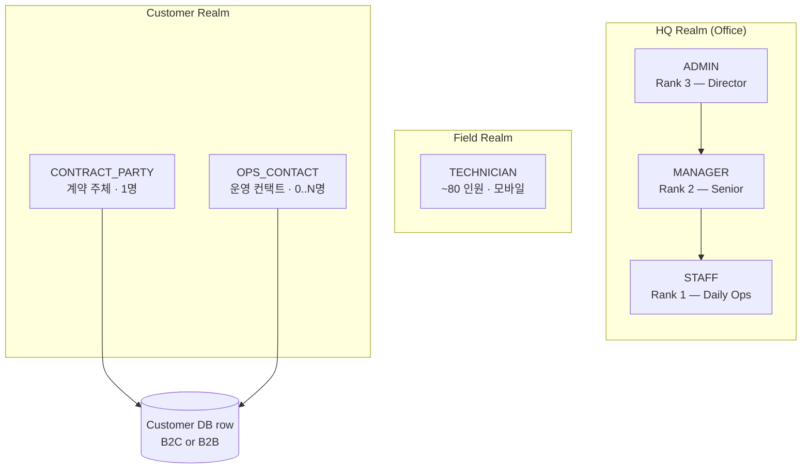

**핵심 권한 게이팅 (SPEC §2.1)**:

| 능력 | ADMIN | MANAGER | STAFF | TECH | CP | OPS |
|---|---|---|---|---|---|---|
| 사용자 관리 · 시스템 설정 | ● | — | — | — | — | — |
| 가격 변경 · 계약 수정 | ● | ● | — | — | — | — |
| 세금계산서 발행 · 월마감 | ● | ● | — | — | — | — |
| 고객 비밀번호 재설정 | ● | ● | — | — | — | — |
| 서비스 요청 승인 (유료) | ● | ● | ● | — | — | — |
| Customer · Contract · Equipment CRUD | ● | ● | ● | — | — | — |
| Visit 생성/재일정 | ● | ● | ● | — | — | — |
| 결제 입력/매칭 | ● | ● | ● | — | — | — |
| Mobile visit 완료 · 본인 수금 | ● | ● | ● | ●(본인만) | — | — |
| Audit log 조회 | ● | ● | — | — | — | — |
| Audit log 내보내기 | ● | — | — | — | — | — |
| OPS_CONTACT 추가/편집/삭제 | ● | ● | — | — | ●(자기 고객) | — |
| 서비스 요청 제출 | — | — | — | — | ● | ● |

---

## 2. 마스터 데이터 셋업

서비스 운영을 시작하기 전에 ADMIN/MANAGER가 채워두는 데이터.

### 2.1 제품 카탈로그 (Brand · EquipmentModel · Filter)

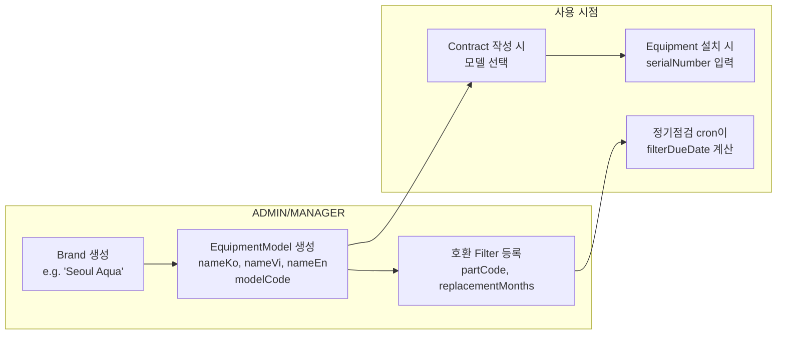

**경로**: `/o/admin/products` → Brand 탭 → Model 탭 → CSV 업로드 가능 (sample_catalog_for_upload.csv 참고)

**검증 규칙**:
- modelCode는 같은 Brand 내 unique
- 모델명은 ko/vi/en 3개 언어 모두 필수 (i18n)
- 호환 Filter는 modelCode로 lookup 가능해야 함

### 2.2 직원 사용자 (HQ + Technician) 등록

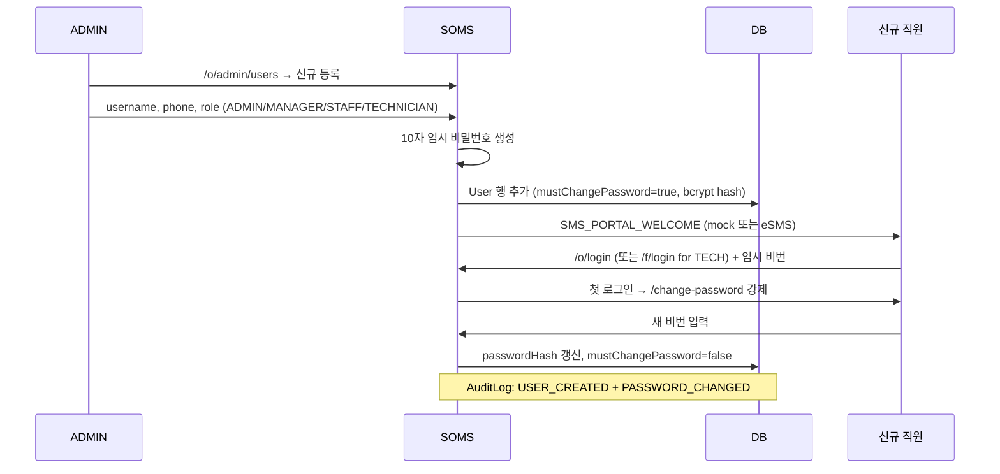

**중요**:
- TECHNICIAN은 username 대신 phone으로 로그인 (모바일 UX)
- ADMIN/MANAGER/STAFF는 username 또는 phone 모두 가능 (단, username은 의도적으로 non-unique — 동명이인은 phone으로 구분)
- 같은 username을 가진 직원이 2명 이상이면 로그인 자체가 `INVALID_CREDENTIALS`로 fail-closed (보안 결정, SPEC §11.4 후속)

### 2.3 기사 추가 정보 (preferredRegion · 차량 등)

ADMIN/MANAGER가 TECHNICIAN 등록 후 추가로 채워야 할 필드:
- `preferredRegion` — 지역 매칭 알고리즘에 사용 (SPEC §6.4.1)
- `isActive` — 휴직/퇴사 시 비활성화 (visit 자동 배정에서 제외)
- `availableDays`, `availableHours` — 주말근무 가능 여부 등

---

## 3. 고객 라이프사이클

### 3.1 B2C 고객 생성

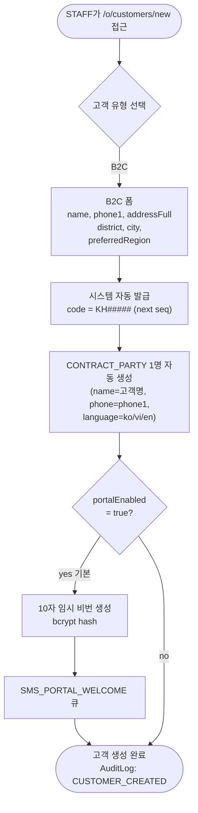

### 3.2 B2B 고객 생성 + Site 등록

```mermaid
flowchart TD
  Start([STAFF가 /o/customers/new])
  B2BForm["B2B 폼<br/>name(=회사), taxCode (필수)<br/>shortcode (2-5자 영문)<br/>HQ addressFull"]
  GenCode["code = KH#####<br/>shortcode = SHV/MMD/...<br/>(B2B contract code에 사용)"]
  CreateCP["CONTRACT_PARTY 자동 생성<br/>scope=CUSTOMER (조직 레벨)<br/>title='대표' / '법인 대표'"]
  AddSites{Site 추가?<br/>(공장 A동, 본사,<br/>R&D 빌딩...)}
  SiteForm["Site 폼<br/>name, addressFull,<br/>region, phone"]
  AddOpsContact{Site-scoped<br/>OPS 추가?}
  OpsForm["OPS_CONTACT 폼<br/>scope=SITE, siteId=X<br/>name, phone, language<br/>(예: '공장 A 시설관리자')"]
  Done([B2B 셋업 완료])

  Start --> B2BForm --> GenCode --> CreateCP --> AddSites
  AddSites -->|yes| SiteForm --> AddOpsContact
  AddSites -->|no — HQ만| Done
  AddOpsContact -->|yes| OpsForm --> AddSites
  AddOpsContact -->|no| AddSites
```

### 3.3 Customer Contact 관리 (1 + N 모델)

각 Customer는 **CONTRACT_PARTY 1명** + **OPS_CONTACT 0..N명**을 갖는다.

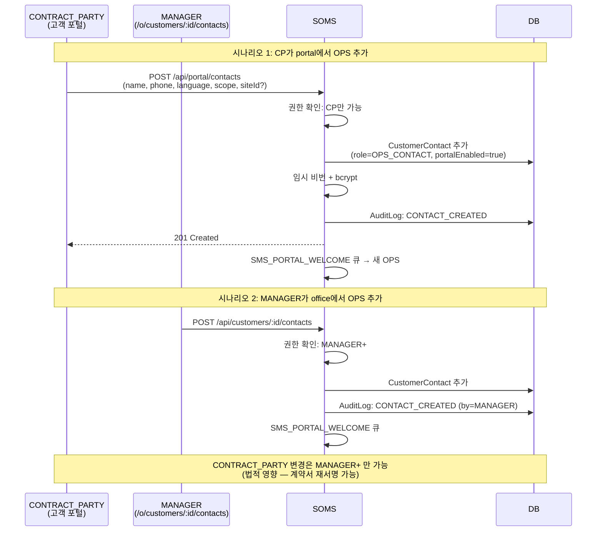

**contact 정보 라우팅 규칙** (SPEC §3.3.1):

| 채널 | 수신자 | 언어 | Fallback |
|---|---|---|---|
| 계약서 · 세금계산서 · 법적 통보 | CONTRACT_PARTY | CP.language | 필수 — fallback 없음 |
| 방문 SMS · 영수증 · 정기점검표 | primary OPS_CONTACT | OPS.language | CP.language → vi |
| 미수금 독촉 | CP + 모든 OPS (CC) | 각자 language | — |
| 모바일 "고객 전화" | primary OPS | — | CP |

### 3.4 Customer Portal 자동 활성화

고객 생성 직후 또는 계약 활성화 시점에 portal 계정이 자동 발급된다 — 명시적 가입 화면 없음.

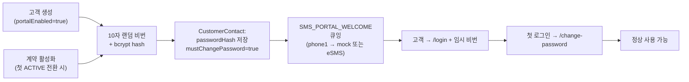

**MANAGER+가 언제든 재설정 가능** — `POST /api/portal/auth/reset-password` (관리자 모드). 새 임시 비번 생성 → SMS_PASSWORD_RESET 큐 → 기존 세션 모두 revoke (보안).

---

## 4. 계약 워크플로

### 4.1 계약 종류 분기

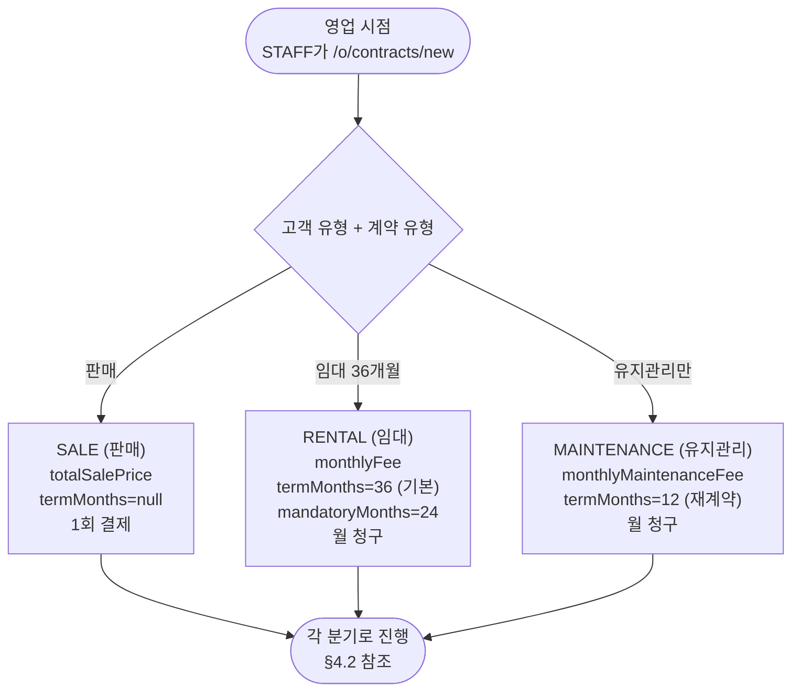

### 4.2 계약 생성 → 서명 → 활성화


### 4.3 계약 상태 머신

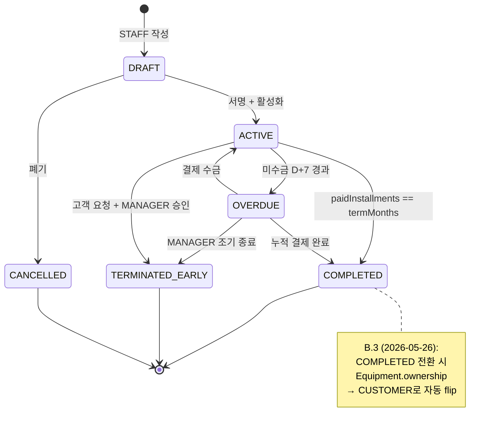

### 4.4 B2B Appendix (부록서)

B2B 고객이 기존 계약에 장비를 추가할 때, 새 계약 발행 대신 **Appendix**(부록)로 처리한다.

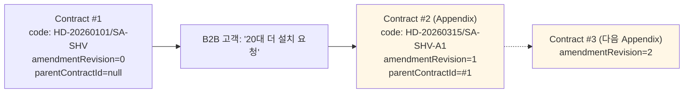

**B2C는 Appendix를 안 쓴다** — price/equipment 변경은 in-place 업데이트 + AuditLog 항목만 추가.

### 4.5 계약 갱신 (RENTAL → MAINTENANCE)

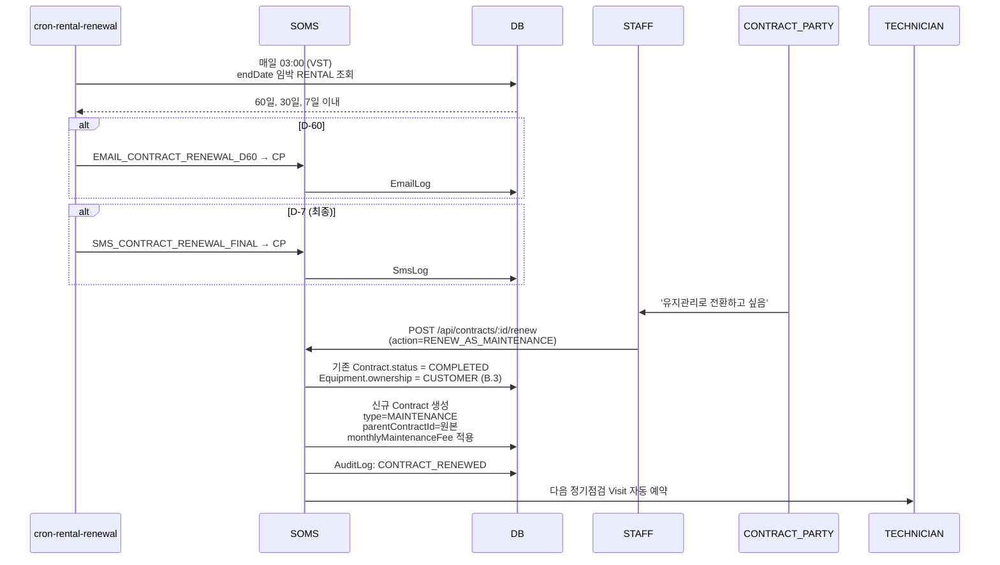

### 4.6 계약 조기 종료 (TERMINATED_EARLY)

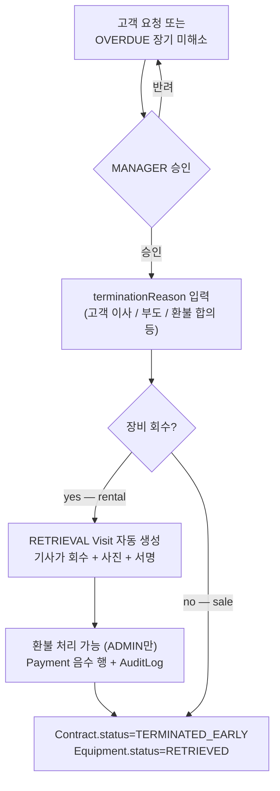

---

## 5. 장비 라이프사이클

### 5.1 Equipment 상태 머신

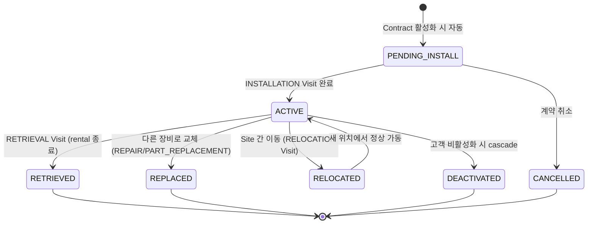

### 5.2 Equipment 설치 흐름

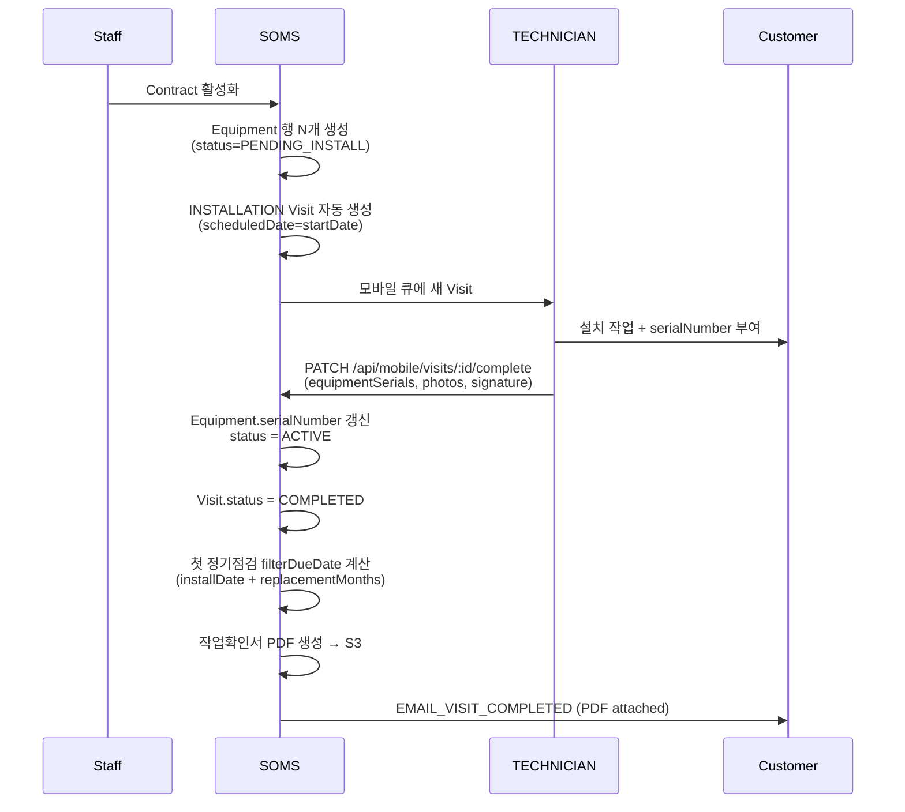

### 5.3 Equipment 교체 (REPLACE)

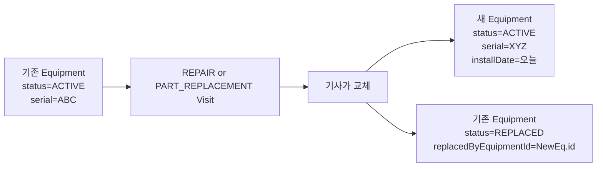

### 5.4 Equipment 이동 (RELOCATE — B2B Site 간)

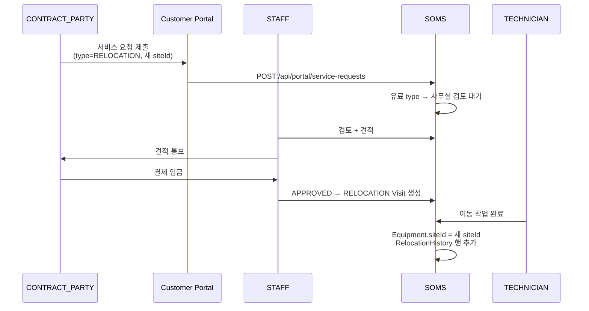

---

## 6. 정기점검 (Periodic Maintenance)

정기점검은 RENTAL/MAINTENANCE 계약 하의 장비를 월 또는 격월로 방문해 필터를 교체하는 자동 워크플로다.

### 6.1 전체 흐름 (Cron 기반)

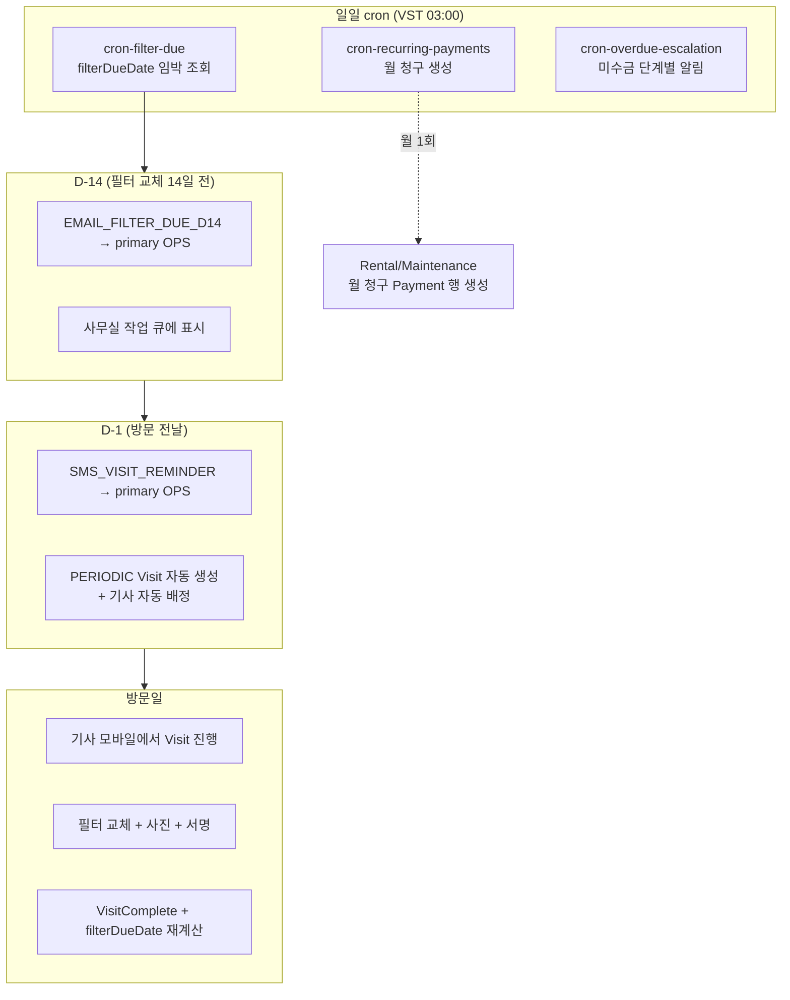

### 6.2 Filter Due 계산

```
filterDueDate = Equipment.installDate + EquipmentModel.filter.replacementMonths
```

각 교체 시 재계산: `filterDueDate = lastReplacedAt + replacementMonths`.

`filterPolicy` JSON (E.2):
- 기본 RENTAL = 필터 무료 포함
- B2C SALE = 필터 유료 (고객 부담)
- 특정 partCode는 예외 가능 (계약별 override)

### 6.3 정기점검 Visit 완료 후

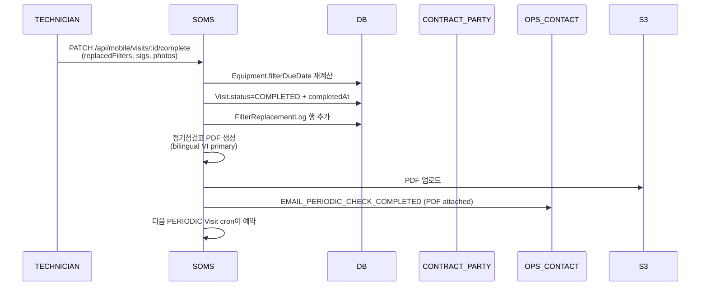

---

## 7. 서비스 요청 (Service Request)

고객이 portal에서 직접 제출하는 요청. 일부는 자동 승인, 일부는 사무실 검토 + 견적.

### 7.1 Service Request 상태 머신

```mermaid
stateDiagram-v2
  [*] --> SUBMITTED: 고객 제출
  SUBMITTED --> AUTO_APPROVED: 무료 type 자동
  SUBMITTED --> APPROVED: 사무실 검토 후
  SUBMITTED --> REJECTED: 사무실 거부

  AUTO_APPROVED --> SCHEDULED: Visit 자동 생성
  APPROVED --> SCHEDULED: Visit 생성

  SCHEDULED --> COMPLETED: Visit 완료
  SCHEDULED --> CANCELLED: 고객 취소
  REJECTED --> [*]
  COMPLETED --> [*]
  CANCELLED --> [*]
```

### 7.2 무료 SR (자동 승인 — INSPECTION/CONSULTATION)

```mermaid
sequenceDiagram
  participant Customer as CONTRACT_PARTY/OPS
  participant Portal as Customer Portal
  participant System as SOMS
  participant Scheduler as 스케줄러
  participant Tech as TECHNICIAN

  Customer->>Portal: /portal/requests/new<br/>(type=INSPECTION, photos)
  Portal->>System: POST /api/portal/service-requests
  System->>System: 무료 type 판정 → AUTO_APPROVED
  System->>Scheduler: 자동 PERIODIC Visit 생성<br/>(C.1 알고리즘)
  System->>System: ServiceRequest.linkedVisitId 설정
  System->>Customer: EMAIL_SR_RECEIVED + SMS_SR_APPROVED (날짜)
  System->>Tech: 모바일 큐에 추가

  Tech->>Customer: 방문 + 작업
  Tech->>System: Visit COMPLETED
  System->>System: ServiceRequest.status = COMPLETED
  System->>Customer: EMAIL_VISIT_COMPLETED
```

### 7.3 유료 SR (검토 필요 — RELOCATION/PART_REPLACEMENT)

```mermaid
sequenceDiagram
  participant Customer
  participant Portal
  participant System
  participant Staff as STAFF+
  participant Tech as TECHNICIAN

  Customer->>Portal: type=RELOCATION, 새 주소
  Portal->>System: POST /api/portal/service-requests
  System->>System: 유료 type → SUBMITTED (검토 대기)
  System->>Customer: EMAIL_SR_RECEIVED (검토 중 안내)
  System->>Staff: 사무실 작업 큐 진입<br/>/o/service-requests?state=SUBMITTED

  Staff->>System: 검토 + 견적 입력<br/>(quotedAmount)
  alt 승인
    Staff->>System: PATCH /api/service-requests/:id<br/>(state=APPROVED)
    System->>System: Visit 자동 생성
    System->>Customer: SMS_SR_APPROVED + EMAIL_SR_APPROVED (PDF 견적)
    Customer->>System: 결제 (BANK_TRANSFER) → office 매칭
    Tech->>Customer: 방문 + 작업
    Tech->>System: COMPLETED
  else 거부
    Staff->>System: state=REJECTED + reason
    System->>Customer: SMS_SR_REJECTED + EMAIL_SR_REJECTED
  end
```

### 7.4 Service Request 메시지 thread

고객과 사무실은 SR 안에서 양방향 메시지 교환 가능 (mockup screen 53).

```mermaid
flowchart LR
  Customer["CONTRACT_PARTY/OPS<br/>(/portal/requests/:id)"]
  Office["STAFF+<br/>(/o/service-requests/:id)"]
  Thread[("SR Message Thread<br/>(AuditLog action='SR_MESSAGE')")]
  Poll["30s polling<br/>(TanStack Query<br/>refetchInterval)"]

  Customer -->|POST msg| Thread
  Office -->|POST msg| Thread
  Poll -.-> Customer
  Poll -.-> Office
  Thread -->|GET messages| Customer
  Thread -->|GET messages| Office
```

---

## 8. 방문 (Visit) 워크플로

### 8.1 Visit 상태 머신

```mermaid
stateDiagram-v2
  [*] --> SCHEDULED: 자동 또는 수동 생성
  SCHEDULED --> CONFIRMED: 고객 확인
  SCHEDULED --> RESCHEDULED: 일정 변경
  RESCHEDULED --> SCHEDULED: 새 행 생성, 연결

  CONFIRMED --> IN_PROGRESS: 기사 도착 + 시작
  SCHEDULED --> IN_PROGRESS: B2B는 confirm 없이 진행

  IN_PROGRESS --> COMPLETED: 기사 완료 + 서명
  IN_PROGRESS --> NEEDS_REVISIT: 부품 미준비 / 재방문 필요

  SCHEDULED --> CUSTOMER_NO_SHOW: 부재
  CUSTOMER_NO_SHOW --> RESCHEDULED

  SCHEDULED --> CANCELLED: 고객/사무실 취소

  COMPLETED --> [*]
  NEEDS_REVISIT --> SCHEDULED
  CANCELLED --> [*]
```

### 8.2 자동 스케줄러 추천 (C.1)

```mermaid
flowchart TD
  Start["새 Visit 생성 (SR 승인 or PERIODIC cron)"]
  Q1{Customer.preferredTechnicianId<br/>설정?}
  Q2{preferred tech<br/>당일 가용?}
  PickPreferred["1순위: preferred tech"]

  Q3["region match 후보군<br/>Technician.preferredRegion ∩ Customer/Site.region"]
  Q4["당일 부하 적은 순 정렬<br/>(이미 배정된 Visit 수)"]
  PickByLoad["2순위: 지역 + 부하 균형"]

  Office["사무실 화면: 1순위 추천 + 후보 리스트 표시"]
  Confirm{1-click 승인}
  Override{수동 override<br/>다른 기사 선택}
  Save["Visit.leadTechnicianId 저장<br/>+ collaboratorTechnicianIds[]"]

  Start --> Q1
  Q1 -->|yes| Q2
  Q1 -->|no| Q3
  Q2 -->|yes| PickPreferred --> Office
  Q2 -->|no| Q3
  Q3 --> Q4 --> PickByLoad --> Office

  Office --> Confirm
  Confirm -->|yes| Save
  Confirm --> Override
  Override --> Save
```

### 8.3 Lead vs Collaborator 기사 (K.3)

```mermaid
flowchart LR
  Visit["Visit row<br/>leadTechnicianId (필수)<br/>collaboratorTechnicianIds[] (선택)"]

  subgraph Lead["Lead Tech (1명)"]
    L1["방문 완료 권한"]
    L2["서명 받기"]
    L3["현금 수금"]
    L4["작업확인서 PDF 서명"]
  end

  subgraph Collab["Collaborators (0..N명)"]
    C1["모바일 큐에 '공유됨' 배지로 표시"]
    C2["사진 · 노트 추가 가능"]
    C3["완료 마킹 불가"]
    C4["수금 불가"]
  end

  Visit --> Lead
  Visit --> Collab
```

### 8.4 모바일 Visit 완료 마법사

```mermaid
sequenceDiagram
  participant Tech as TECHNICIAN<br/>(/f/visits/:id/complete)
  participant Mobile as Mobile UI
  participant System as SOMS
  participant Offline as IndexedDB queue

  Tech->>Mobile: Step 1: 도착 + IN_PROGRESS 마킹
  Mobile->>System: PATCH /api/mobile/visits/:id (status=IN_PROGRESS)

  Tech->>Mobile: Step 2: 작업 항목 선택<br/>(필터 교체, 부품 교체)
  Mobile->>Mobile: useApiQuery (staleTime:Infinity)<br/>← 마법사 중간 값 변경 방지

  Tech->>Mobile: Step 3: 사진 촬영 + 업로드
  alt 온라인
    Mobile->>System: POST /api/mobile/visits/:id/photos
  else 오프라인 (C.4 — Phase 7+)
    Mobile->>Offline: PHOTO_UPLOAD 큐잉
  end

  Tech->>Mobile: Step 4: 고객 서명 (E.1: 종이 사진)
  Mobile->>System: POST signaturePath

  Tech->>Mobile: Step 5: 결제 수금
  alt 현금
    Tech->>Mobile: 금액 + 영수증 발급
    Mobile->>System: POST /api/payments<br/>(method=CASH_AT_VISIT, collectedByUserId=tech)
    Note over Mobile,System: officeReceivedAt = null<br/>(다음날 사무실 매칭)
  else 이미 송금됨
    Tech->>Mobile: BANK_TRANSFER skip
  end

  Tech->>Mobile: Step 6: 완료 마킹
  Mobile->>System: PATCH visit (status=COMPLETED, completedAt)
  System->>System: Equipment.filterDueDate 재계산
  System->>System: 작업확인서 PDF 생성 → S3
  System-->>Tech: 완료 화면 + 다음 visit 안내
```

### 8.5 Cash Handover (현금 인계)

```mermaid
sequenceDiagram
  participant Tech as TECHNICIAN
  participant Office as STAFF (다음날)
  participant System as SOMS
  participant DB

  Note over Tech,DB: 당일 저녁

  Tech->>System: 본인 미인계 현금 현황<br/>(/f/profile → 보유 현금)
  System-->>Tech: 합계 = SUM(officeReceivedAt IS NULL Payments)

  Note over Tech,DB: 다음 영업일 오전

  Tech->>Office: 현금 + 영수증 사본 인계
  Office->>System: /o/payments → 인계 매칭
  Office->>System: PATCH /api/payments/:id<br/>(officeReceivedAt = now, receivedByUserId)
  System->>DB: Payment.status = RECEIVED
  System->>DB: AuditLog: PAYMENT_OFFICE_RECEIVED

  alt 차이 발생 (분실, 미인계)
    System->>System: cron-cash-handover-alert<br/>(D+1 미인계 시 ADMIN 알림)
  end
```

---

## 9. 청구 · 결제 · 세금계산서

### 9.1 결제 방법 매트릭스

```mermaid
flowchart TD
  Bill["청구 발생 trigger"]
  Bill --> A1[CASH_AT_VISIT]
  Bill --> A2[BANK_TRANSFER]
  Bill --> A3[B2B_EINVOICE]
  Bill --> A4[B2B_NO_INVOICE]

  A1 --> F1["기사 현장 수금<br/>→ 다음날 사무실 인계<br/>→ officeReceivedAt 마킹"]
  A2 --> F2["고객 송금<br/>→ 사무실 transferReference 매칭<br/>→ status=RECONCILED"]
  A3 --> F3["사무실 e-invoice 외부 발행<br/>→ PDF 업로드<br/>→ 송금 대기 → 매칭"]
  A4 --> F4["BANK_TRANSFER와 동일<br/>invoicePdfPath=null"]
```

### 9.2 월 청구 생성 (Recurring Payments cron)

```mermaid
sequenceDiagram
  participant Cron as cron-recurring-payments
  participant DB
  participant System as SOMS
  participant CP as CONTRACT_PARTY

  Note over Cron,CP: 매월 1일 03:00 VST

  Cron->>DB: ACTIVE Rental + MAINTENANCE 조회
  loop 각 계약
    Cron->>DB: 이번 달 Payment 행 존재?
    alt 없음
      Cron->>DB: Payment 행 추가<br/>(amount=monthlyFee, status=PENDING,<br/>coveredMonth=YYYY-MM)
      Cron->>System: EMAIL_RENTAL_DUE → CP
    else 이미 있음
      Cron->>Cron: skip
    end
  end
```

### 9.3 결제 상태 머신

```mermaid
stateDiagram-v2
  [*] --> PENDING: cron이 생성 또는 수동 입력
  PENDING --> RECEIVED: 현금 수금 또는 송금 도착
  RECEIVED --> RECONCILED: contract installment에 매칭
  PENDING --> WAIVED: ADMIN/MANAGER 면제
  PENDING --> BOUNCED: 송금 실패 / 부도

  BOUNCED --> RECEIVED: 재송금 성공
  WAIVED --> [*]
  RECONCILED --> [*]
```

### 9.4 미수금 escalation (Dunning)

```mermaid
flowchart TD
  Subgraph7d["D+7 (1차)"]
  Subgraph14d["D+14 (2차)"]
  Subgraph30d["D+30 (최종)"]

  Trigger["Payment.status=PENDING<br/>+ dueDate 경과"]

  Trigger --> D7{cron 매일 체크}
  D7 -->|D+7| E1[EMAIL_PAYMENT_OVERDUE_D7 → CP + OPS]
  D7 -->|D+14| E2[EMAIL_PAYMENT_OVERDUE_D14 → CP + OPS]
  D7 -->|D+30| E3[SMS_PAYMENT_OVERDUE_FINAL → CP + 모든 OPS]
  E3 --> Action["Contract.status → OVERDUE<br/>사무실에 강제 통보 진입"]
```

### 9.5 B2B 세금계산서 (Tax Invoice)

v1에서는 **외부 e-invoice 시스템**(Viettel SInvoice / MISA / VNPT eHoadon)에서 발행한 PDF를 SOMS에 **업로드**하는 방식.

```mermaid
sequenceDiagram
  participant Mgr as MANAGER
  participant System as SOMS
  participant External as 외부 e-Invoice<br/>(Viettel/MISA/VNPT)
  participant CP as B2B Customer<br/>CONTRACT_PARTY
  participant Email as Email Relay<br/>(vhost.vn 또는 Resend)

  Note over Mgr,Email: 월말 마감 + 송장 발행

  Mgr->>External: 외부 시스템에서<br/>세금계산서 발행
  External-->>Mgr: PDF 다운로드

  Mgr->>System: /o/tax-invoices/new<br/>(customerId, contractId, PDF 업로드,<br/>invoiceNumber, issuedAt)
  System->>S3: PDF 저장 → invoicePdfPath
  System->>System: Payment 행 연결<br/>(method=B2B_EINVOICE)
  System->>Email: EMAIL_TAX_INVOICE_ISSUED → CP<br/>(PDF attached, 운영 email 채널)
  Email-->>CP: 수신

  CP->>System: BANK_TRANSFER 송금
  Mgr->>System: 사무실 매칭<br/>(transferReference 입력)
  System->>System: Payment.status = RECONCILED
```

**보존 정책 (E.4)**: 세금계산서 PDF는 **10년 보존** (베트남 법 best practice). 일반 영수증은 5년.

### 9.6 영수증 (Receipt)

CASH_AT_VISIT 결제 시 기사가 현장에서 영수증 발급:

```mermaid
flowchart LR
  Cash["기사 현금 수금"]
  GenReceipt["영수증 PDF 즉시 생성<br/>(bilingual)"]
  PrintShow{기사 옵션}
  Print["휴대용 프린터 출력"]
  Show["모바일 화면 표시 + QR 스캔"]
  Email["EMAIL_PAYMENT_RECEIPT → primary OPS"]

  Cash --> GenReceipt --> PrintShow
  PrintShow --> Print
  PrintShow --> Show
  GenReceipt -.-> Email
```

---

## 10. 알림 (Cross-cutting)

### 10.1 채널 선택 매트릭스

```mermaid
flowchart TD
  Template["발송할 템플릿"]
  Decision{내용 성격}

  Decision -->|보안 · 자격증명<br/>≤24h window<br/>최종 escalation| SMS["SMS Only<br/>(eSMS)"]
  Decision -->|영수증 · 정기 안내<br/>PDF 첨부| Email["Email Only<br/>(Resend)"]
  Decision -->|초기 환영 · SR 승인<br/>풍부한 안내| Hybrid["SMS + Email<br/>(둘 다)"]

  Template --> Decision

  Email --> Tax{tax invoice?}
  Tax -->|yes| OpsEmail["vhost.vn 운영 채널"]
  Tax -->|no| TransEmail["Resend 트랜잭션 채널"]
```

**SMS Only 케이스 (7개 템플릿)**:
- SMS_PORTAL_WELCOME — 첫 임시 비번 (보안)
- SMS_PASSWORD_RESET — 재발급 (보안, opt-out 무시)
- SMS_VISIT_REMINDER — D-1 알림
- SMS_SR_APPROVED — 유료 SR 최종 승인 + 일정
- SMS_SR_REJECTED — 거부 + 사유
- SMS_PAYMENT_OVERDUE_FINAL — D+30 최종 escalation
- SMS_CONTRACT_RENEWAL_FINAL — D-7 갱신 최종

**Email Only / Hybrid 케이스**: `docs/DOCUMENT_TEMPLATES.md` §B + §C 매트릭스 참조.

### 10.2 채널 라우팅 + 언어 결정

```mermaid
flowchart TD
  Template["템플릿 + 컨텍스트"]
  Channel{채널?}

  Channel -->|SMS| Recipient1["수신자 결정"]
  Channel -->|Email| Recipient2["수신자 결정"]

  Recipient1 --> R1{템플릿 종류}
  R1 -->|계약 · 법적| CP1[CONTRACT_PARTY]
  R1 -->|운영 · 방문| OPS1[primary OPS_CONTACT]
  R1 -->|미수금 최종| Both1[CP + 모든 OPS]

  Recipient2 --> R2{언어 결정}
  R2 -->|contact.language 있음| L1[contact.language]
  R2 -->|empty| L2[CONTRACT_PARTY.language]
  R2 -->|CP도 empty| L3[vi 기본]

  CP1 --> Send1["발송 큐"]
  OPS1 --> Send1
  Both1 --> Send1
  L1 --> Send1
  L2 --> Send1
  L3 --> Send1

  Send1 --> Opt{opt-out 체크}
  Opt -->|system msg<br/>비밀번호/영수증| IgnoreOpt["opt-out 무시 · 강제 발송"]
  Opt -->|일반 msg<br/>+ smsOptOut=true| Skip["발송 skip + 로그"]
  Opt -->|일반 msg<br/>+ opt-out=false| Deliver["발송"]
```

### 10.3 Channel Fallback

```mermaid
flowchart LR
  Decide["선호 채널<br/>(매트릭스에 따라)"]
  Check1{선호 채널<br/>가능?}
  Use1["선호 채널 발송"]
  Check2{대체 채널<br/>가능?}
  UseAlt["대체 채널 발송"]
  AdminAlert["둘 다 불가 →<br/>ADMIN 알림 + AuditLog"]

  Decide --> Check1
  Check1 -->|yes — phone/email 존재| Use1
  Check1 -->|no| Check2
  Check2 -->|yes| UseAlt
  Check2 -->|no| AdminAlert
```

---

## 11. 인증 · 세션 (3-Realm)

### 11.1 Office 로그인 + Silent Refresh

```mermaid
sequenceDiagram
  participant U as Office 사용자
  participant L as /o/login
  participant API as /api/auth/office/login
  participant DB
  participant App as Office 영역

  U->>L: username/phone + password
  L->>API: POST credentials
  API->>DB: User 조회<br/>(phone unique) or (username findMany take:2)
  alt username 동명이인 발견
    API-->>L: 401 INVALID_CREDENTIALS<br/>(보안: 동일 메시지)
  end
  API->>API: bcrypt 비교 + role 확인
  alt role mismatch (예: TECHNICIAN이 office에)
    API-->>L: 409 ROLE_MISMATCH<br/>+ suggestedUrl: /f/login
  end
  API->>DB: Session row + JWT 발급<br/>(aud=office, 15min)
  API->>DB: refreshToken (30일, httpOnly)
  API-->>L: { user, accessToken } + cookies
  L->>App: router.replace(/o/dashboard)

  loop 12분마다
    App->>API: POST /api/auth/office/refresh<br/>(refreshToken cookie)
    API-->>App: 새 accessToken
  end
```

### 11.2 Customer Portal 로그인

```mermaid
sequenceDiagram
  participant C as Customer
  participant L as /login
  participant API as /api/portal/auth/login
  participant DB

  C->>L: phone + password (+ optional contactId)
  L->>API: POST
  API->>DB: CustomerContact.findMany(phone=phone)
  alt 동일 phone 다수 (A.13)
    API-->>L: { candidates: [...] }<br/>고객이 본인 선택
    C->>L: contactId 선택
    L->>API: POST + contactId
  end
  API->>API: bcrypt 비교
  API->>DB: CustomerSession 생성<br/>(aud=customer, 15min access + 30일 refresh)
  API-->>L: { contact, accessToken, mustChangePassword }
  alt mustChangePassword=true
    L->>C: /change-password 강제
  else
    L->>C: /
  end
```

### 11.3 비밀번호 변경 + Sibling Session Revoke

```mermaid
sequenceDiagram
  participant C as Customer
  participant API as /api/portal/auth/change-password
  participant DB

  C->>API: POST oldPassword + newPassword
  API->>API: oldPassword bcrypt 비교
  API->>DB: passwordHash 갱신
  API->>DB: revokeAllCustomerSessions(contactId)<br/>(전체 세션 무효화)
  API->>DB: 새 CustomerSession 발급<br/>(현재 호출자에게만 fresh 쿠키)
  API-->>C: 새 access/refresh cookies
  Note over API,DB: 도난된 refresh 토큰이 있었다면<br/>이 시점에 사용 불가가 됨
```

### 11.4 로그아웃 + Cache 정리

```mermaid
flowchart LR
  Logout["사용자가 logout 버튼 클릭"]
  API["POST /api/auth/*/logout<br/>(session DB row 삭제)"]
  Clear["AuthProvider.logout finally:<br/>1. setUser(null)<br/>2. setAccessToken(null)<br/>3. sessionStorage.clear()<br/>4. queryClient.clear() ← TanStack Query 캐시 전부<br/>5. (field만) clearOfflineQueue() ← Dexie IndexedDB"]
  Redirect["realm별 login으로 redirect"]

  Logout --> API --> Clear --> Redirect
```

**같은 device에서 다음 사용자가 로그인해도 이전 사용자 데이터가 보이지 않도록 보장됨** (Phase 1 보안 fix 결과).

---

## 12. 감사 로그 (Audit Log)

모든 상태 변경 액션은 `AuditLog` 행으로 기록된다. 24개월 보존 (H.2).

```mermaid
flowchart LR
  subgraph Sources["발생원"]
    A["사용자 액션<br/>(office/field/portal)"]
    B["Cron 자동 처리"]
    C["시스템 자동 전환<br/>(state machine)"]
  end

  subgraph Log["AuditLog 행"]
    F1["actorUserId<br/>또는 actorContactId<br/>(NULL = system)"]
    F2["action: enum<br/>(CUSTOMER_CREATED,<br/>CONTRACT_ACTIVATED,<br/>VISIT_COMPLETED,<br/>PAYMENT_RECEIVED,<br/>SR_APPROVED, ...)"]
    F3["entityType + entityId<br/>(예: 'Contract', uuid)"]
    F4["before / after JSON<br/>(diff 가능)"]
    F5["createdAt + ip"]
  end

  A --> Log
  B --> Log
  C --> Log

  subgraph Read["조회"]
    D1["MANAGER+ → /o/reports/audit"]
    D2["ADMIN → CSV 내보내기"]
  end

  Log --> D1
  Log --> D2
```

**ADMIN-only 액션** (예: ambiguous username login 차단)도 `AMBIGUOUS_USERNAME` 같은 보안 액션 코드로 기록되어 사후 추적 가능.

---

## 부록: 워크플로 매트릭스 (한 눈에)

| 워크플로 | 시작 트리거 | 주체 | 산출물 | 알림 |
|---|---|---|---|---|
| 고객 생성 | STAFF | STAFF | KH##### + CP + portal | SMS_PORTAL_WELCOME |
| 계약 생성 | STAFF | STAFF | DRAFT contract + PDF | — |
| 계약 활성화 | TECH 서명 | TECH | ACTIVE + INSTALLATION Visit | EMAIL_VISIT_COMPLETED |
| 정기점검 D-14 | cron-filter-due | system | 작업 큐 표시 | EMAIL_FILTER_DUE_D14 |
| 정기점검 D-1 | cron | system | PERIODIC Visit | SMS_VISIT_REMINDER |
| 정기점검 완료 | TECH | TECH | 정기점검표 PDF + filterDueDate 재계산 | EMAIL_PERIODIC_CHECK_COMPLETED |
| 무료 SR | CUSTOMER portal | CUSTOMER | AUTO_APPROVED + Visit | SMS_SR_APPROVED + EMAIL_SR_RECEIVED |
| 유료 SR | CUSTOMER portal | STAFF+ 검토 | 견적 → APPROVED/REJECTED | EMAIL_SR_RECEIVED → SMS_SR_APPROVED/REJECTED |
| 방문 완료 | TECH 모바일 | TECH (lead) | 작업확인서 + 결제 | EMAIL_VISIT_COMPLETED |
| 현금 인계 | TECH 익일 | TECH→STAFF | Payment.officeReceivedAt | — |
| 월 청구 | cron-recurring-payments | system | PENDING Payment | EMAIL_RENTAL_DUE |
| 미수금 D+7 | cron-overdue-escalation | system | — | EMAIL_PAYMENT_OVERDUE_D7 |
| 미수금 D+14 | cron | system | — | EMAIL_PAYMENT_OVERDUE_D14 |
| 미수금 D+30 | cron | system | Contract → OVERDUE | SMS_PAYMENT_OVERDUE_FINAL |
| 세금계산서 발행 | MANAGER | MANAGER | PDF 업로드 + Payment 연결 | EMAIL_TAX_INVOICE_ISSUED |
| 계약 갱신 D-60/30 | cron-rental-renewal | system | — | EMAIL_CONTRACT_RENEWAL_D60/D30 |
| 계약 갱신 D-7 | cron | system | — | SMS_CONTRACT_RENEWAL_FINAL |
| 계약 갱신 실행 | STAFF | STAFF | 새 MAINTENANCE Contract + ownership flip | — |
| 비밀번호 재설정 | MANAGER 또는 self | MANAGER 또는 self | 임시 비번 + 전 세션 revoke | SMS_PASSWORD_RESET |
| 로그아웃 | 사용자 | 사용자 | QueryClient + Dexie 캐시 비움 | — |

---

## 참고

- 도메인 용어: [.claude/CLAUDE.md "Domain Vocabulary"](../.claude/CLAUDE.md)
- 권한 매트릭스 원본: [SPEC.md §2.1](./SPEC.md)
- 비즈니스 프로세스 원본: [PROCESS_NOTES.md](./PROCESS_NOTES.md)
- 문서 양식 매트릭스: [DOCUMENT_TEMPLATES.md](./DOCUMENT_TEMPLATES.md)
- 데이터 모델: [DATA_MODEL_NOTES.md](./DATA_MODEL_NOTES.md)
- 인증 상세: [AUTH.md](./AUTH.md)
