# Jake's Home Appliances 고객 포털 사용 안내 (Customer Manual)

**대상**: Jake's Home Appliances의 모든 손님 — 가정집 (B2C) 및 회사 (B2B)
**버전**: 2026-06-02
**언어**: 한국어
**관련 문서**: [현장 기사 매뉴얼](./field.md)

이 안내서는 Jake's Home Appliances의 정수기·공기청정기·비데를 사용하시는 손님을 위한 것입니다. 핸드폰에서 고객 포털을 통해 본인의 장비, 다음 점검 일정, 결제 내역을 직접 확인하고 서비스를 요청하는 모든 방법을 설명합니다.

---

## 목차

- [1장. 시작하기 — Jake's Home Appliances 고객 포털이란?](#1장-시작하기--jakes-home-appliances-고객-포털이란)
- [2장. 두 가지 역할 — 계약 당사자 / 일상 담당자](#2장-두-가지-역할--계약-당사자--일상-담당자)
- [3장. 고객의 1년 — 워크플로 개요](#3장-고객의-1년--워크플로-개요)
- [4장. 첫 로그인](#4장-첫-로그인)
- [5장. 홈 화면](#5장-홈-화면)
- [6장. 내 장비 보기](#6장-내-장비-보기)
- [7장. 방문 일정과 기록](#7장-방문-일정과-기록)
- [8장. 서비스 요청 보내기](#8장-서비스-요청-보내기)
- [9장. 결제 내역](#9장-결제-내역)
- [10장. 송금하기 — 입금 안내](#10장-송금하기--입금-안내)
- [11장. 세금계산서 받기 (B2B)](#11장-세금계산서-받기-b2b)
- [12장. 담당자 관리 (계약 당사자 전용)](#12장-담당자-관리-계약-당사자-전용)
- [13장. 내 정보 변경](#13장-내-정보-변경)
- [14장. 비밀번호 변경과 분실](#14장-비밀번호-변경과-분실)
- [15장. 자주 마주치는 상황](#15장-자주-마주치는-상황)
- [16장. 안전한 사용 수칙](#16장-안전한-사용-수칙)
- [17장. 도움이 필요할 때](#17장-도움이-필요할-때)
- [부록 A. SMS·이메일 알림 일람](#부록-a-sms이메일-알림-일람)
- [부록 B. 자주 묻는 질문 (FAQ)](#부록-b-자주-묻는-질문-faq)

---

## 1장. 시작하기 — Jake's Home Appliances 고객 포털이란?

### 1.1 어떤 서비스인가요?

Jake's Home Appliances는 베트남에서 정수기·공기청정기·비데를 **팔고, 임대해 드리고, 정기적으로 관리**해 드리는 회사입니다. 손님께 매번 사무실에 전화하시지 않아도 **포털**에서 직접:

- 다음 정기 점검이 언제인지 확인
- 내 장비의 필터 교체일 확인
- 결제 내역, 미수금 확인
- 새 서비스 요청 보내기 (점검·수리·이전 설치 등)
- 영수증·세금계산서 다운로드

### 1.2 포털 주소

```
https://jakeshomeappliances.com.vn/login
```

이 주소를 핸드폰 또는 컴퓨터 브라우저에 입력하시면 로그인 화면이 나타납니다.

> **앱 다운로드 안 합니다.** 일반 인터넷 브라우저(Chrome, Safari)에서 바로 사용합니다. 자주 쓰시려면 **홈 화면에 바로가기**를 추가하세요.

### 1.3 누가 사용할 수 있나요?

- **계약 당사자 (CONTRACT_PARTY)** — 계약서에 서명하신 분 (B2C 가장님 또는 B2B 사장님 등)
- **일상 담당자 (OPS_CONTACT)** — 회사의 시설 담당, 가족 중 일정 잡는 분 등

자세한 역할 구분은 [2장](#2장-두-가지-역할--계약-당사자--일상-담당자) 참조.

### 1.4 어떤 기기에서 사용하나요?

| 기기 | 사용감 |
|---|---|
| 핸드폰 (Android, iPhone) | 가장 권장 — 모바일에 최적화 |
| 태블릿 | 사용 가능 |
| 컴퓨터 | 사용 가능 (B2B 사장님 등) |

권장 브라우저: **Chrome, Safari, Edge** 최신 버전.

---

## 2장. 두 가지 역할 — 계약 당사자 / 일상 담당자

### 2.1 왜 두 가지로 나누나요?

가정집이나 회사에서 **계약서에 서명하는 사람**과 **매일 운영을 챙기는 사람**이 다른 경우가 많습니다.

#### B2B 회사 예시

- **계약 당사자**: 사장님 → 계약서 서명, 세금계산서 받기
- **일상 담당자**: 시설 김 과장 → 정기 점검 일정 잡기, 필터 교체 확인

#### B2C 가정집 예시

- **계약 당사자**: 가장 → 계약서 서명, 법적 통보 수신
- **일상 담당자** (선택): 배우자 → 실제 점검 일정 잡기, 영수증 받기

> **B2C는 일상 담당자가 없어도 됩니다.** 가장이 두 역할 모두 합니다. 필요할 때 가족 한 명을 일상 담당자로 추가할 수 있습니다.

### 2.2 역할별 할 수 있는 일

| 할 수 있는 일 | 계약 당사자 | 일상 담당자 |
|---|:---:|:---:|
| 홈 화면 보기 | ● | ● |
| 내 장비 보기 | ● | ● |
| 방문 일정·기록 보기 | ● | ● |
| 서비스 요청 보내기 | ● | ● |
| 결제 내역·미수금 보기 | ● | ● |
| 송금 안내 받기 | ● | ● |
| 영수증 PDF 다운로드 | ● | ● |
| 세금계산서 PDF 다운로드 (B2B) | ● | ● |
| **새 일상 담당자 추가/삭제** | ● | — |
| **본인 정보 수정** | ● | ● (본인 정보만) |
| **비밀번호 변경** | ● | ● |
| **계약 당사자 변경** | — | — (사무실에 요청해야 함) |

### 2.3 받는 알림이 다릅니다

| 알림 종류 | 받는 사람 |
|---|---|
| 계약서, 세금계산서, 법적 통보 | 계약 당사자만 |
| 정기 점검 일정 SMS, 영수증 | 일상 담당자 (없으면 계약 당사자) |
| 미수금 독촉 | 계약 당사자 + 모든 일상 담당자 |

---

## 3장. 고객의 1년 — 워크플로 개요

### 3.1 한눈에 보기

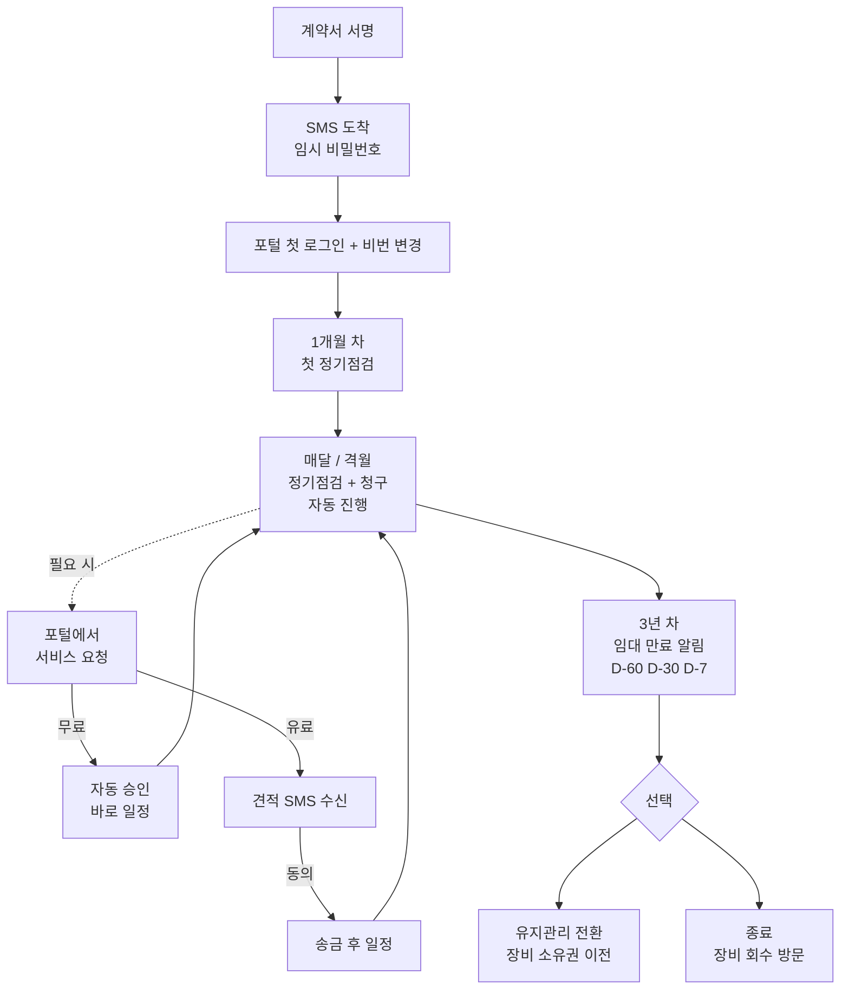

### 3.2 주요 단계 설명

#### 첫 만남 — 계약 시점

영업 직원과 상담 → 계약서 서명 → 며칠 안에 **포털 가입 SMS**가 도착합니다.

#### 1개월 차 — 첫 정기 점검

설치 후 약 한 달 뒤 첫 정기 점검이 자동으로 잡힙니다. 점검 하루 전 SMS로 안내, 점검 후 작업확인서가 이메일로 옵니다.

#### 정상 운영 — 매달 / 격월

장비 모델에 따라 한 달 또는 두 달에 한 번씩 정기 점검이 옵니다. 매달 청구가 자동으로 생성됩니다 (임대·유지관리 계약).

#### 필요 시 — 서비스 요청

뭔가 문제가 생기면 포털에서 직접 요청. 무료는 즉시 일정 잡힘, 유료는 견적 받기 → 송금 → 일정.

#### 3년 차 — 임대 만료

임대 계약은 보통 36개월입니다. 만료 60일 전, 30일 전, 7일 전에 각각 알림이 옵니다. 두 가지 선택:

- **유지관리로 전환** — 장비는 손님 소유가 되고, 매달 관리비만 내심
- **종료** — 장비 회수 방문 일정 잡힘

---

## 4장. 첫 로그인

### 4.1 SMS 받기

계약서 서명하시면 며칠 안에 다음 SMS가 옵니다:

```
[Jake's Home Appliances] 고객 포털 가입이 완료되었습니다.
임시 비밀번호: ********
로그인: jakeshomeappliances.com.vn/login
```

> **이 비밀번호는 본인만** 보세요. 다른 사람에게 알리면 안 됩니다.

### 4.2 로그인 화면

핸드폰 브라우저에서 위 주소로 들어가시면:

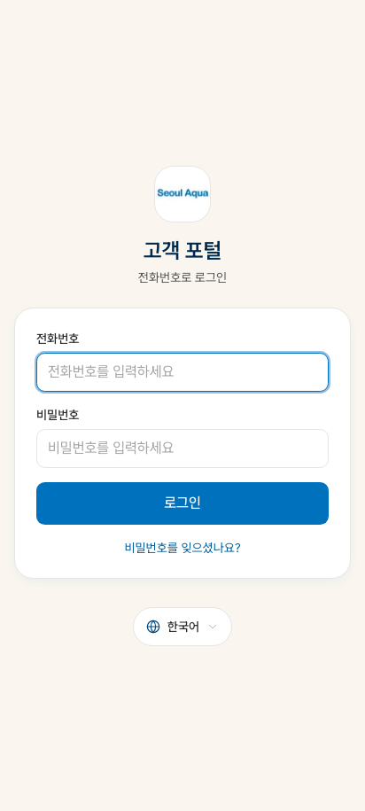

| 입력란 | 입력 내용 |
|---|---|
| **전화번호** | SMS 받은 본인 휴대폰 번호 (예: `0901234567`) |
| **비밀번호** | SMS에 적힌 임시 비밀번호 |

**로그인** 버튼 누르면 첫 비밀번호 변경 화면으로 이동.

#### 같은 번호가 가족과 공유인 경우

가끔 같은 휴대폰 번호로 여러 명이 등록된 경우 (예: 가족 공용 휴대폰):

- 로그인 후 "어느 분이세요?" 화면이 뜸
- 본인 이름을 선택하시고 진행

### 4.3 첫 비밀번호 변경

임시 비밀번호로 처음 로그인하면 강제로 새 비밀번호 설정 화면이 뜹니다.

**비밀번호 규칙**:

- 8자 이상
- 영문 + 숫자 권장 (강제는 아님)
- 같은 비밀번호를 두 번 입력하여 확인

저장하면 정상 사용 시작.

### 4.4 비밀번호 메모 팁

- **종이에 그대로 적지 마세요** — 누가 봐도 못 알아보게 본인만의 힌트로
- 핸드폰 메모 앱에는 저장하지 마세요
- 비밀번호 관리 앱 사용 권장 (1Password, Bitwarden 등)

---

## 5장. 홈 화면

로그인하면 가장 먼저 보이는 화면입니다.

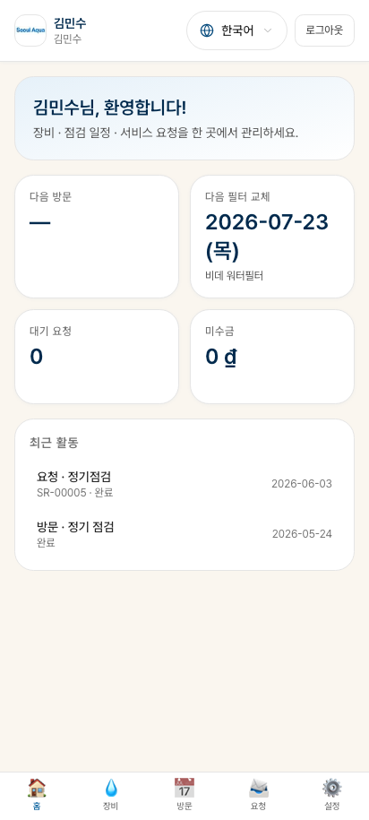

### 5.1 화면 구성

위에서부터 차례로:

#### 상단 인사말

"안녕하세요 _______ 님" — 본인 이름.

#### 다음 정기 점검 안내

```
다음 정기 점검: 2026년 6월 15일 (월) 오전
정수기 PTS-2100, 거실
```

- 날짜 + 시간대
- 어떤 장비를 점검하는지

#### 필터 교체 임박 알림

- "1차 필터 교체 14일 남음" 같은 표시
- 클릭하면 장비 상세로 이동

#### 미결제 안내

- "이번 달 임대료 결제 대기" 안내
- 송금 방법 안내 화면으로 바로 이동

#### 진행 중인 서비스 요청

- 본인이 보낸 요청 중 처리 중인 것
- 클릭하면 요청 상세로

### 5.2 화면 하단 메뉴

| 아이콘 | 이름 | 설명 |
|---|---|---|
| 🏠 | **홈** | 메인 화면 |
| 💧 | **장비** | 내 장비 목록 |
| 📅 | **방문** | 방문 일정과 기록 |
| 📝 | **요청** | 서비스 요청 보내기·확인 |
| 💳 | **결제** | 결제 내역 |
| 👤 | **내 정보** | 본인 정보, 담당자 관리, 비밀번호 |

### 5.3 다른 언어로 보기

화면 상단 우측의 **언어 선택**:
- 한국어 (KO)
- 베트남어 (Tiếng Việt, VI)
- 영어 (English, EN)

선택하면 즉시 화면 전체 언어가 바뀝니다. 다음 로그인 시에도 마지막 선택이 유지됩니다.

---

## 6장. 내 장비 보기

화면 하단 **장비** 탭.

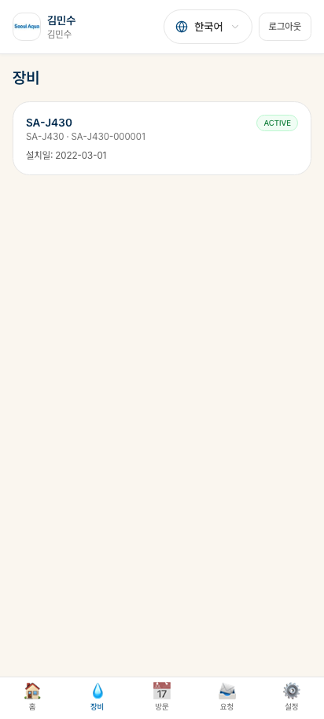

### 6.1 화면 구성

본인의 모든 장비가 카드 형태로 표시됩니다:

| 표시 항목 | 내용 |
|---|---|
| **장비명** | 모델명 + 카테고리 (예: 정수기 PTS-2100) |
| **시리얼 번호** | 장비 고유 번호 |
| **설치 위치** | "거실", "공장 A 사무실" 등 |
| **설치일** | 처음 설치된 날 |
| **다음 점검일** | 자동 계산 |
| **필터 상태** | 각 필터의 남은 날 (색상 표시) |
| **상태 배지** | 정상 / 점검중 / 교체 예정 등 |

### 6.2 장비 상세

카드 탭하면 상세 화면:

#### 정보 영역

- 모델 사양
- 설치 사진 (있는 경우)
- 보증 기간

#### 필터 영역

- 각 필터별 교체 주기 (예: 3개월)
- 마지막 교체일
- **다음 교체 예정일**
- 색상 코드:
  - 🟢 녹색: 30일 이상 남음
  - 🟡 노란색: 14일 이내
  - 🔴 빨간색: 만료 또는 오늘

#### 점검 기록

- 이 장비의 모든 방문 기록 (정기·수리)
- 각 기록 클릭 시 작업확인서 PDF 다운로드

### 6.3 여러 장비를 가진 경우 (B2B)

회사가 정수기 여러 대를 가진 경우, 장비 목록 상단에 **Site 필터** 표시:

- 전체 (모든 사이트)
- 본사 (1대)
- 공장 A (10대)
- 공장 B (8대)

원하는 사이트만 선택해서 보실 수 있습니다.

---

## 7장. 방문 일정과 기록

화면 하단 **방문** 탭.

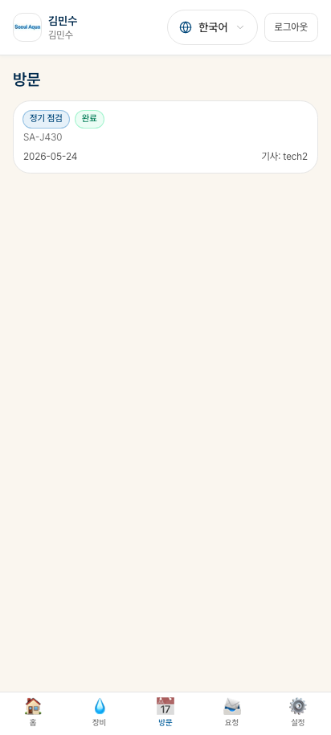

### 7.1 탭 구분

- **예정** — 다가오는 방문 (정기 점검 등)
- **완료** — 지난 방문 기록
- **취소** — 일정 변경된 것 포함

### 7.2 예정 방문 카드

각 카드에 표시:

| 항목 | 내용 |
|---|---|
| 날짜 + 시간대 | "2026-06-15 오전" |
| 방문 종류 | 정기점검 / 수리 등 |
| 작업 항목 | "1차 필터 + 2차 필터 교체" |
| 기사 이름 (배정된 경우) | "기사: 김철수" |
| 상태 | 예정 / 확인 / 진행중 / 완료 |

#### 일정 변경 요청하기

손님께서 직접 일정을 바꾸실 수 있습니다 (제한 있음):

1. 방문 카드 → "**일정 변경 요청**" 버튼
2. 희망 날짜 선택
3. 사유 입력 (선택)
4. **요청 보내기** → Jake's Home Appliances 사무실에 전달됨

사무실이 확인하고 새 일정으로 변경한 후 SMS로 다시 안내합니다.

> **방문 1일 전부터는 직접 변경 불가** — 전화로 사무실에 연락 부탁드립니다.

### 7.3 완료된 방문 기록

각 기록 탭하면:

- 작업 내용 요약
- 교체된 부품 목록 + 시리얼
- **작업확인서 PDF 다운로드** 버튼
- 사진 (기사가 촬영한 작업 전/후)
- 결제 금액 (있는 경우) + 영수증 PDF

### 7.4 방문 때 종이로 받게 되는 서류 (Phase 6 — 2026-06-03)

방문 종류에 따라 기사님이 종이 1장을 가져와서 서명을 받습니다. 종이 사본은 기사님이 그 자리에서 한 부 드립니다. 나머지 한 부는 회사 보관용으로 가져갑니다 (절취선으로 나뉘어 있어요).

| 방문 상황 | 받게 될 종이 |
|---|---|
| 임대 (RENTAL) 설치 — 첫 방문 | **장비 인수증** + **계약서** 사본 |
| 판매 (SALE) 설치 — 첫 방문 | **판매 영수증** + **계약서** 사본 |
| 회사 B2B 설치 | **B2B 출고서 Mẫu 02-VT** + **계약서** 사본 |
| 가정집 정기 점검 | **정기 점검표 (가정집)** — 영수증 겸용 |
| 회사 B2B 정기 점검 | **정기 점검 확인서 (B2B)** — 가격 없음, 별도로 세금계산서가 이메일로 옴 |
| 수리·필터 교체·이전 설치·수금·기타 | **작업확인서** |

> 💡 종이 사본을 잃어버려도 괜찮습니다. 사무실에 전화 (또는 포털에 메시지) 하시면 **PDF 사본을 이메일로 다시 보내드립니다**.

---

## 8장. 서비스 요청 보내기

화면 하단 **요청** 탭.

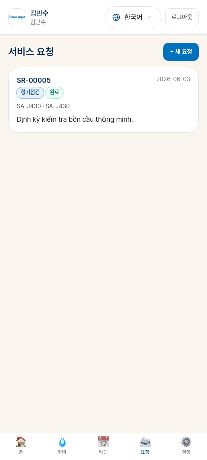

### 8.1 어떤 요청을 보낼 수 있나요?

| 종류 | 한국어 | 비용 | 처리 시간 |
|---|---|---|---|
| **INSPECTION** | 점검 | 무료 | 즉시 일정 (자동 승인) |
| **CONSULTATION** | 상담 | 무료 | 사무실 답신 |
| **FAULT_REPORT** | 고장 신고 | 보증/임대 무료, 그 외 유료 | 사무실 검토 후 |
| **FILTER_REPLACEMENT_AD_HOC** | 임시 필터 교체 | 임대 무료, 판매 유료 | 사무실 검토 후 |
| **PART_REPLACEMENT** | 부품 교체 | 유료 | 사무실 검토 + 견적 |
| **RELOCATION** | 이전 설치 | 유료 | 사무실 검토 + 견적 |
| **OTHER** | 기타 | 직원 판단 | 사무실 검토 후 |

### 8.2 새 요청 보내기

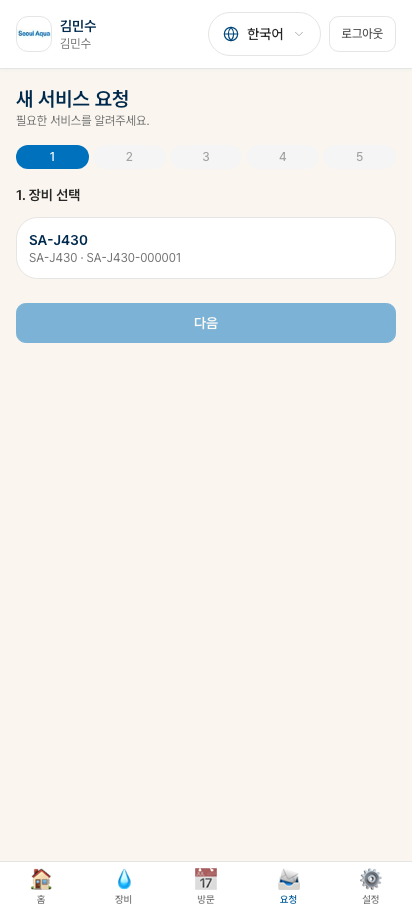

#### 단계 1: 요청 종류 선택

화면 상단의 종류 중 본인 상황에 맞는 것 선택.

#### 단계 2: 자세한 내용 입력

- **설명** (필수): 어떤 문제인지 자유롭게 적어 주세요. 예: "정수기에서 물이 안 나옵니다", "사무실 이전으로 정수기를 새 주소로 옮기고 싶습니다."
- **희망 일정** (선택): 가능한 날짜와 시간대
- **관련 장비** (선택): 어떤 장비인지 (목록에서 선택)

#### 단계 3: 사진 첨부 (권장)

- 고장 부위나 현재 상태를 사진으로
- 사무실에서 더 정확히 진단 가능
- 최대 5장

#### 단계 4: 보내기

**요청 보내기** 버튼 → 시스템이 자동으로 처리.

### 8.3 무료 요청 — 자동 승인

INSPECTION(점검), CONSULTATION(상담) 같은 무료 요청은 **즉시 자동 승인** 됩니다.

**시스템 처리**:
1. 즉시 SMS 안내 ("점검 요청 접수 완료, 일정: ____")
2. 이메일로 더 자세한 안내
3. 방문 일정 자동 생성 → 본인 "방문" 탭에 표시

### 8.4 유료 요청 — 사무실 검토

PART_REPLACEMENT, RELOCATION 같은 유료 요청은 사무실 검토가 필요합니다.

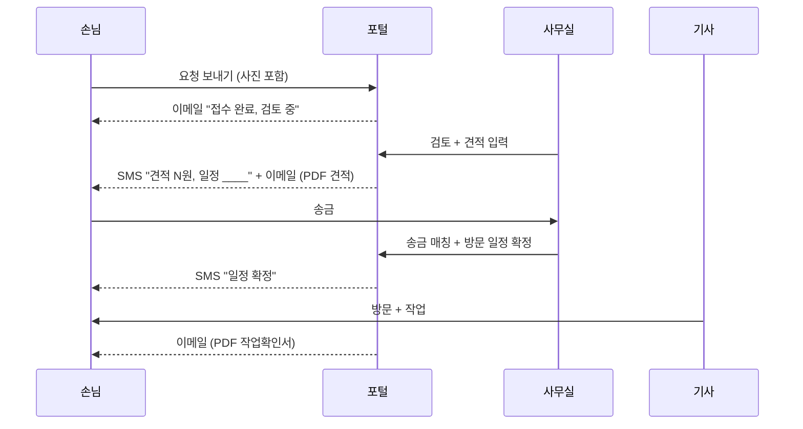

### 8.5 요청 상태 확인

**요청** 탭에서 보내신 요청들의 상태:

| 상태 | 의미 |
|---|---|
| 접수 | 요청이 사무실에 도착 |
| 자동 승인 | 무료 요청 즉시 처리 |
| 검토중 | 사무실이 검토 중 (유료) |
| 승인 | 견적 + 일정 확정 |
| 거부 | 사무실이 거부 (사유 표시) |
| 일정 잡힘 | 방문 일정 확정 |
| 완료 | 방문 끝남 |
| 취소 | 손님 또는 사무실이 취소 |

### 8.6 요청 안에서 메시지 주고 받기

요청 상세 페이지에 **메시지 영역**이 있습니다. 사무실과 추가 정보 주고 받기:

- 사진 첨부 가능
- 30초마다 자동 새로고침
- 사무실의 새 메시지는 알림 표시

### 8.7 요청 취소

요청을 보냈는데 다시 생각해보니 필요 없는 경우:

1. 요청 상세 → "**취소 요청**" 버튼
2. 사유 입력 (선택)
3. **승인 전이면 즉시 취소**, 이미 일정 잡혔으면 사무실 확인 필요

---

## 9장. 결제 내역

화면 하단 **결제** 탭.

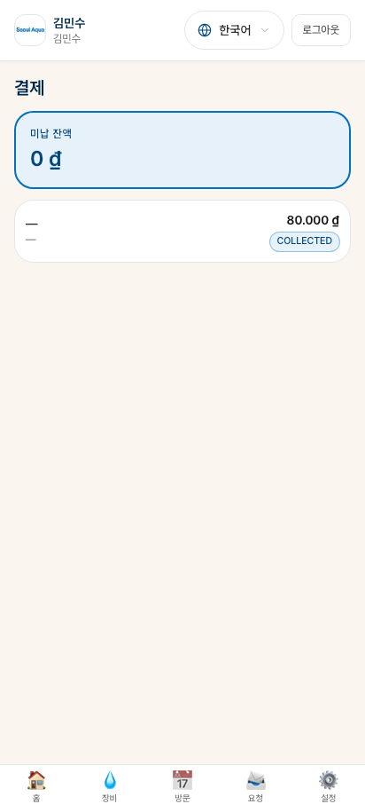

### 9.1 화면 구성

#### 결제 요약 (상단)

- **이번 달 미결제 금액**
- **이번 달 결제 완료 금액**
- **누적 미수금** (있는 경우 빨간색)

#### 결제 내역 (중단)

월별 결제 내역이 시간순으로:

| 항목 | 내용 |
|---|---|
| 월 | "2026-06" |
| 종류 | 임대료 / 관리비 / 서비스비 |
| 금액 | VND |
| 상태 | 대기 / 받음 / 정산됨 |
| 영수증 PDF | 다운로드 버튼 |

### 9.2 결제 상태 의미

| 상태 | 한국어 | 의미 |
|---|---|---|
| **PENDING** | 대기 | 송금 또는 수금 아직 안 됨 |
| **RECEIVED** | 받음 | Jake's Home Appliances가 송금 받음 (매칭 전) |
| **RECONCILED** | 정산됨 | 어떤 계약·회차인지 확정 완료 — 정상 |
| **OVERDUE** | 연체 | 결제 기한 지남 (D+7 이상) |
| **WAIVED** | 면제 | 사무실이 면제 처리 |

### 9.3 영수증 PDF

각 정산된 결제 행에서 영수증 PDF 다운로드 가능. 자동으로 본인 이메일로도 발송됨 (받지 못 받으셨으면 스팸 폴더 확인).

영수증 내용:
- Jake's Home Appliances 회사 정보
- 본인 정보
- 결제 일자, 금액, 회차
- **베트남어 + 한국어/영어 이중 언어**

---

## 10장. 송금하기 — 입금 안내

### 10.1 어디로 송금하나요?

**결제** 탭의 미결제 행을 탭하면 **송금 안내 화면**이 뜹니다:

#### 송금 정보

```
은행: Vietcombank
계좌: 0123456789
계좌주: CÔNG TY TNHH MTV TM&DV JAKE'S HA
지점: HCMC
```

#### 송금 시 메모(참조)

송금할 때 **참조란**에 다음을 입력해 주세요:

```
KH00123 / HD-20260101-JH-KH00123
```

(본인 손님 코드 + 계약 번호)

이렇게 하면 사무실에서 즉시 어느 손님인지 알아챕니다.

### 10.2 자동 매칭

송금 후:

1. 사무실이 통장에서 입금 확인
2. 메모에 적힌 계약 번호로 자동 매칭 (또는 수동 매칭)
3. 본인 화면의 결제 상태가 자동으로 **정산됨** 으로 바뀜
4. **영수증 이메일 자동 발송**

보통 1~2 영업일 안에 처리됩니다.

### 10.3 다른 송금 방법

#### 현금 — 기사 방문 시

기사가 방문하시면 그 자리에서 현금 결제 가능. 영수증은 화면 표시 또는 이메일.

> 주의: 기사는 본인 방문 건만 수금 가능. 다른 계약 건은 사무실로 송금하셔야 합니다.

#### 카드 결제

v1에서는 **카드 결제 미지원**. 향후 추가 예정.

#### 자동 이체

v1에서는 **미지원**. 매달 수동 송금 부탁드립니다.

### 10.4 송금 후 매칭이 안 됐을 때

1~2 영업일이 지나도 본인 화면에 결제 안 들어왔다면:

1. 송금 영수증 (은행 앱 캡처) 준비
2. Jake's Home Appliances 사무실에 **전화 또는 이메일** 문의
3. 매뉴얼 매칭 후 정상 처리됨

---

## 11장. 세금계산서 받기 (B2B)

> 이 장은 **B2B 회사 손님**에게만 해당합니다.

### 11.1 자동 발송

Jake's Home Appliances가 세금계산서를 발행하면:

1. **이메일로 PDF 첨부 자동 발송** (계약 당사자에게)
2. 본인 포털 → 결제 탭 → 해당 결제 행에 세금계산서 PDF 표시

### 11.2 세금계산서 보존

세금계산서는 **10년 보존** (베트남 법). 본인이 다운로드해서 보관도 권장.

### 11.3 세금계산서 정보 수정 필요한 경우

회사명·세금코드 등 정보가 잘못된 경우:

1. **사무실에 전화 또는 이메일** 연락
2. 외부 e-Invoice 시스템에서 수정 발행
3. 새 PDF가 본인 이메일로 다시 옴

> **시스템에서 직접 수정 불가** — 베트남 e-Invoice 정부 시스템 통과해야 합니다.

### 11.4 세금계산서가 안 왔어요

가능한 원인:
- **이메일 스팸 폴더** 확인
- 본인 이메일이 시스템에 등록 안 되어 있을 수 있음 → "내 정보" 확인 (13장)
- 사무실이 아직 발행 안 했을 수 있음 → 직접 전화 문의

---

## 12장. 담당자 관리 (계약 당사자 전용)

> 이 기능은 **계약 당사자**만 사용할 수 있습니다. 일상 담당자는 사용 불가.

### 12.1 담당자 관리란?

**일상 담당자(OPS_CONTACT)** 를 추가·편집·삭제하는 기능입니다.

#### 언제 사용하나요?

- B2B 회사에서 **새 시설 담당자가 들어옴**
- 가정집에서 **배우자도 방문 일정을 잡게 하고 싶음**
- 기존 담당자가 **퇴사·교체**

### 12.2 담당자 목록 화면

화면 하단 **내 정보** → **담당자** 탭

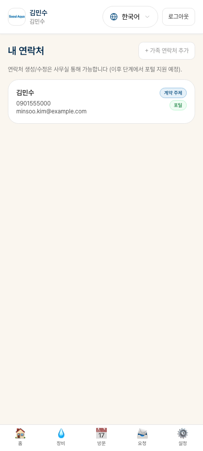

화면에 본인 회사/가정의 모든 담당자가 표시됩니다:

| 표시 항목 | 내용 |
|---|---|
| 이름·직책 | "김철수 (시설관리)" |
| 역할 | 계약 당사자 / 일상 담당자 |
| 휴대폰 | 본인 휴대폰 번호 |
| 이메일 | (있는 경우) |
| 언어 | KO / VI / EN |
| 담당 사이트 (B2B) | "공장 A" 또는 "전체" |
| 활성 여부 | 켜짐/꺼짐 |

### 12.3 새 일상 담당자 추가

#### 단계 1: 추가 버튼

화면 상단의 **+ 새 담당자 추가** 버튼.

#### 단계 2: 정보 입력

- **이름** (필수)
- **직책** (예: "시설 관리자")
- **휴대폰** (필수) — 본인 휴대폰 번호
- **이메일** (선택)
- **언어** (필수): KO / VI / EN
- **담당 범위**:
  - "전체 회사" — 모든 사이트에 알림 받음
  - "특정 사이트" — 한 사이트만 (B2B 다중 사이트 회사에 권장)
- **포털 활성화** (기본 ON): 새 담당자에게도 포털 로그인 줄지

#### 단계 3: 저장

**저장** 버튼 → 자동 처리:

1. 새 담당자의 휴대폰으로 **임시 비밀번호 SMS** 자동 발송
2. 새 담당자가 SMS의 주소로 첫 로그인 → 비밀번호 변경 → 사용 시작
3. 다음 방문 알림, 영수증 등을 새 담당자도 받음

### 12.4 담당자 정보 편집

각 담당자 카드 탭 → "**편집**" 버튼.

수정 가능 항목:
- 이름, 직책, 이메일, 언어, 담당 범위
- 포털 활성화 ON/OFF
- 휴대폰 번호 변경은 보안상 사무실에 요청 필요

### 12.5 담당자 비활성화 (삭제)

#### 비활성화 vs 삭제

- **비활성화**: 포털 로그인 안 됨, 알림 안 받음. 기존 기록은 보존.
- **삭제는 불가**: 감사 기록 보존 때문 (24개월).

#### 비활성화 단계

1. 담당자 카드 → "**비활성화**" 버튼
2. 확인
3. 즉시 모든 세션 종료, 알림 수신 중지

### 12.6 계약 당사자 변경 불가

본인이 **계약 당사자를 다른 사람으로 바꾸고 싶다면**:

- 포털에서는 **변경 불가** (법적 영향 큼)
- Jake's Home Appliances 사무실에 **전화 또는 이메일**로 요청
- 사무실이 검토 + 새 계약서 재서명 절차 안내

---

## 13장. 내 정보 변경

화면 하단 **내 정보** 탭.

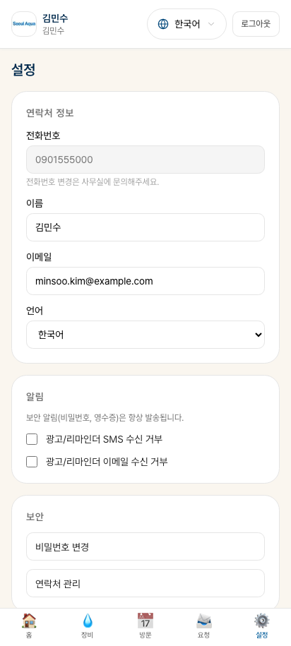

### 13.1 표시되는 정보

- **이름** (편집 가능)
- **직책** (편집 가능, 일상 담당자만)
- **이메일** (편집 가능)
- **선호 언어** (변경 가능)
- **휴대폰** — 보안상 수정 불가 (사무실 요청 필요)

### 13.2 알림 받기 설정 (Opt-out)

알림이 너무 많다면 일부 끄실 수 있습니다:

| 알림 종류 | Opt-out 가능? |
|---|---|
| 비밀번호 재설정 SMS | ❌ 보안상 항상 발송 |
| 영수증 이메일 | ❌ 법적 의무 |
| 정기점검 D-1 SMS | ✅ |
| 정기점검 D-14 이메일 | ✅ |
| 마케팅 (향후) | ✅ |

#### Opt-out 설정 단계

1. 내 정보 → "**알림 설정**"
2. 끄고 싶은 종류 토글
3. 저장

### 13.3 언어 변경

화면 상단의 언어 버튼으로 즉시 변경 가능. 다음 로그인 시에도 마지막 선택 유지.

이 언어 설정은 **이메일·SMS 본문 언어**에도 적용됩니다.

---

## 14장. 비밀번호 변경과 분실

### 14.1 비밀번호 변경

내 정보 → "**비밀번호 변경**".

1. **현재 비밀번호** 입력
2. **새 비밀번호** + 다시 한 번 (오타 방지)
3. **저장**

#### 자동 보안 처리

비밀번호를 바꾸면 자동으로:

- **다른 모든 기기에서 로그아웃** 됩니다
- 만약 누군가 본인 휴대폰을 잠깐 봐서 다른 기기에서 로그인했어도 자동으로 쫓겨납니다 — 보안 안전장치

### 14.2 비밀번호 분실

#### 본인이 직접 처리

1. 로그인 화면 → "**비밀번호 찾기**" 링크
2. 휴대폰 번호 입력
3. **새 임시 비밀번호가 SMS로 도착**
4. 임시 비밀번호로 로그인 → 새 비밀번호 설정

#### Jake's Home Appliances 사무실에 요청

1. 사무실 전화 또는 이메일
2. 본인 확인 후 사무실에서 재발송
3. 동일하게 SMS로 임시 비밀번호 → 로그인 → 변경

---

## 15장. 자주 마주치는 상황

### 시나리오 1: "정수기에서 갑자기 물이 안 나옵니다"

처리:
1. 포털 → **요청** 탭 → "**새 요청**"
2. 종류: **FAULT_REPORT** (고장 신고) 선택
3. 설명: "정수기에서 물이 안 나옵니다. 어제까지는 정상이었어요"
4. 사진 첨부 (장비 상태)
5. 보내기

**임대 계약**이라면 무료 출장. 사무실 검토 후 빠른 시일 내 일정 안내.
**판매 후 보증 만료**라면 유료 가능 — 사무실이 견적 후 동의 시 진행.

### 시나리오 2: "이번 달은 휴가라 정기 점검을 다음 달로 미루고 싶어요"

처리:
1. 포털 → **방문** 탭 → 다가오는 정기 점검 카드
2. "**일정 변경 요청**" 버튼
3. 희망 일정 선택 또는 "다음 달 같은 주" 입력
4. 보내기

사무실이 새 일정 잡고 SMS로 안내.

### 시나리오 3: "사무실 이전 — 정수기를 새 주소로 옮기고 싶어요"

처리:
1. 포털 → **요청** 탭 → "**새 요청**"
2. 종류: **RELOCATION** (이전 설치)
3. 설명: "새 주소: ____. 이전 희망일: ____"
4. 사무실 검토 → 견적 SMS 도착
5. 동의 시 송금 → 일정 확정 → 기사 방문

### 시나리오 4: "비밀번호를 잊어버렸어요"

처리:
- 로그인 화면 "**비밀번호 찾기**" 또는 사무실 전화
- SMS로 새 임시 비번 받기 → 로그인 → 새 비번 설정

### 시나리오 5: "회사에 새 시설 담당자가 들어왔어요" (B2B, 계약 당사자만)

처리:
1. 포털 → **내 정보** → "**담당자**"
2. "+ **새 담당자 추가**"
3. 새 담당자 정보 입력 + 저장
4. 새 담당자에게 임시 비번 SMS 자동 발송

### 시나리오 6: "기존 일상 담당자가 퇴사했어요"

처리:
1. 포털 → 담당자 → 해당 담당자 카드
2. "**비활성화**" 버튼
3. 그 사람의 모든 세션 종료 + 알림 수신 중지

### 시나리오 7: "결제했는데 시스템에 안 들어왔어요"

처리:
1. 송금 영수증 준비 (은행 앱 캡처)
2. Jake's Home Appliances **사무실 전화 또는 이메일**
3. 매뉴얼 매칭 처리 (보통 즉시)

### 시나리오 8: "임대 만료가 다가오는데 어떻게 해야 하나요?"

만료 60일 전부터 자동 알림이 시작됩니다.

#### 옵션 1 — 유지관리로 전환 (장비는 손님 소유)

1. 알림 SMS 또는 이메일에 있는 "유지관리로 전환하기" 링크
2. 또는 사무실에 직접 연락
3. 새 월 관리비 안내 받음 → 동의 시 새 계약서 발행

#### 옵션 2 — 종료 (장비 회수)

1. 사무실에 "종료하겠습니다" 통보
2. 회수 방문 일정 잡힘 → 기사가 와서 장비 가져감

### 시나리오 9: "영수증을 다시 받고 싶어요"

처리:
- **결제** 탭 → 해당 결제 행 → **영수증 PDF 다운로드**
- 이메일에서도 확인 가능 (자동 발송된 이메일 검색)

### 시나리오 10: "세금계산서가 안 왔어요" (B2B)

처리:
1. 이메일 스팸 폴더 확인
2. 사무실에 전화 → 재발송 요청
3. 본인 이메일 정보 확인 (내 정보)

### 시나리오 11: "포털에 못 들어가요" (로그인 안 됨)

가능한 원인과 처리:

- **비밀번호 틀림** → "비밀번호 찾기"
- **3회 실패로 잠금** → 1시간 기다리거나 사무실 부탁
- **계정이 비활성화됨** → 사무실 전화 (계약 당사자가 본인을 비활성화했을 수 있음)
- **인터넷 문제** → Wi-Fi 또는 4G 확인

### 시나리오 12: "기사가 약속 시간보다 늦었어요"

- 기사에게 직접 전화 (방문 카드의 기사 정보)
- 또는 사무실 전화

### 시나리오 13: "방문 후 작업확인서가 안 왔어요"

처리:
- 본인 이메일 스팸 폴더 확인
- 포털 → **방문** 탭 → 해당 방문 → 작업확인서 PDF 다운로드
- 그래도 안 보이면 사무실 전화

### 시나리오 14: "다른 사람이 제 계정으로 들어온 거 같아요" (보안 의심)

처리 — **즉시**:
1. 비밀번호 즉시 변경 → 모든 다른 기기 자동 로그아웃
2. Jake's Home Appliances 사무실에 신고
3. 사무실이 로그인 기록 확인 + 필요 시 추가 조치

---

## 16장. 안전한 사용 수칙

### 16.1 비밀번호 보호

- **누구에게도 알려주지 마세요** — Jake's Home Appliances 직원도 본인 비밀번호를 묻지 않습니다
- 종이에 그대로 적지 마세요
- 동일한 비밀번호를 다른 사이트와 공유하지 마세요

### 16.2 공용 기기 사용 후

- 컴퓨터 방, 공용 태블릿 등에서 로그인했다면 **꼭 로그아웃**
- 로그아웃 누르면 본인 정보 그 기기에서 모두 삭제됨

### 16.3 의심스러운 메시지

- Jake's Home Appliances는 **비밀번호를 직접 묻는 SMS/이메일을 보내지 않습니다**
- 사칭 메시지 의심되면 직접 사무실 전화로 확인

### 16.4 휴대폰 분실 시

1. **즉시 Jake's Home Appliances 사무실**에 연락
2. 본인 계정 모든 세션 강제 종료 가능
3. 새 휴대폰에서 비밀번호 찾기로 재로그인

---

## 17장. 도움이 필요할 때

### 17.1 직접 처리할 수 있는 것 (포털에서)

- 비밀번호 변경·찾기
- 일정 변경 요청 (1일 이전)
- 새 서비스 요청
- 일상 담당자 추가·편집 (계약 당사자만)
- 본인 정보 수정

### 17.2 사무실에 연락해야 할 것

- 계약 내용 자체 수정
- 계약 당사자 변경
- 세금계산서 수정·재발송
- 송금 매칭 안 됐을 때
- 휴대폰 번호 변경
- 계정 보안 의심 시
- 기능이 작동 안 할 때

### 17.3 Jake's Home Appliances 사무실 연락처

```
회사명: CÔNG TY TNHH MTV TM&DV JAKE'S HA
주소: Số 47 Hoàng Trọng Mậu, P. Tân Hưng, TP. Hồ Chí Minh
전화: (실제 회사 번호)
이메일: cs@jakeshomeappliances.com.vn
```

영업 시간: 월~토 08:00~18:00 (일요일·공휴일 휴무)

---

## 부록 A. SMS·이메일 알림 일람

본인이 받을 수 있는 모든 자동 알림 목록입니다.

### SMS (보안·긴급)

| 시점 | 내용 |
|---|---|
| 가입 직후 | 임시 비밀번호 + 포털 주소 |
| 비밀번호 재설정 시 | 새 임시 비밀번호 |
| 정기점검 1일 전 | 시간대 + 기사 정보 |
| 유료 SR 승인 후 | 금액 + 일정 |
| SR 거부 시 | 거부 사유 |
| 미수금 30일 경과 | 강한 통보 |
| 임대 만료 7일 전 | 최종 안내 |

### 이메일 (자세한 안내·영수증)

| 시점 | 내용 + 첨부 |
|---|---|
| SR 접수 직후 | 접수 확인 안내 |
| 방문 완료 직후 | 작업확인서 PDF |
| 결제 정산 직후 | 영수증 PDF |
| 매월 1일 | 이번 달 청구 안내 |
| 미수금 7일 경과 | 미수금 안내 (1차) |
| 미수금 14일 경과 | 미수금 안내 (2차) |
| 필터 14일 전 | 정기점검 사전 안내 |
| 임대 60일 전 | 만료 사전 안내 (1차) |
| 임대 30일 전 | 만료 사전 안내 (2차) |
| 세금계산서 발행 직후 | 세금계산서 PDF (B2B) |

---

## 부록 B. 자주 묻는 질문 (FAQ)

### Q1. 포털 가입 SMS를 못 받았어요

**A**: 
1. 계약서 서명 후 1~2 영업일 이내 도착합니다
2. 스팸 메시지 폴더 확인
3. 휴대폰 번호가 정확히 등록됐는지 사무실 확인
4. 사무실에 재발송 요청

### Q2. 다른 가족 구성원도 포털을 쓸 수 있나요?

**A**: 네. 계약 당사자(가장 등)가 일상 담당자로 가족 구성원을 추가하면 됩니다 (12장 참조).

### Q3. 핸드폰을 잃어버렸어요. 어떻게 해야 하나요?

**A**: 
1. 즉시 Jake's Home Appliances 사무실에 연락 → 모든 세션 강제 종료
2. 새 휴대폰 받은 후 "비밀번호 찾기"로 새 임시 비번 → 로그인 → 비밀번호 변경

### Q4. 영수증·세금계산서를 컴퓨터에서 받고 싶어요

**A**: 컴퓨터 브라우저로 같은 주소(`jakeshomeappliances.com.vn/login`)에서 로그인하시면 PDF 다운로드 가능합니다.

### Q5. 정기 점검 일정을 영구적으로 바꾸고 싶어요 (매월 마지막 주말로 등)

**A**: 사무실에 직접 요청해 주세요. 사무실에서 본인 계약의 정기점검 패턴을 조정합니다.

### Q6. 결제를 카드로 하고 싶어요

**A**: 현재 v1에서는 카드 결제 미지원. 송금 또는 현금만 가능. 향후 추가 예정.

### Q7. 한국어 안내인데 가족이 베트남어만 합니다

**A**: 가족을 일상 담당자로 추가하면서 **언어를 베트남어(VI)** 로 설정. 그러면 그 가족에게는 베트남어 알림이 옵니다.

### Q8. 잘못 송금했어요 (다른 회사로)

**A**: 본인 은행에 즉시 송금 취소 요청 + 사무실에 통보. 가능하면 차단 가능.

### Q9. 계약서 사본을 다시 받고 싶어요

**A**: 사무실에 전화 또는 이메일 요청. PDF 재발송 가능.

### Q10. 보안이 의심됩니다 (계정에 누가 들어온 거 같아요)

**A**: 
1. 즉시 비밀번호 변경 (자동으로 다른 모든 기기 로그아웃)
2. 사무실에 신고
3. 사무실이 로그인 기록 확인

### Q11. 한 손님이 정수기 3대 — 각각 다른 사이트로 나눌 수 있나요? (B2B)

**A**: 네. 사무실에 사이트별로 정수기 배치 요청. 그 후 일상 담당자를 사이트별로 따로 지정 가능.

### Q12. 보내신 SMS를 두 번 받았어요

**A**: 가끔 통신사 사정으로 발생. 시스템 측 중복 발송 거의 없습니다. 같은 내용이면 무시.

---

오랜 시간 함께해 주셔서 감사합니다 — Jake's Home Appliances 드림.
