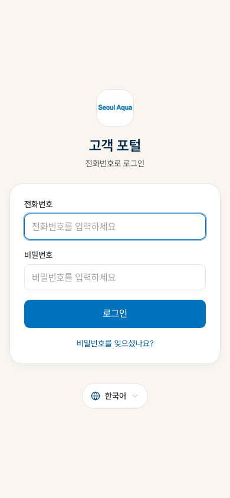
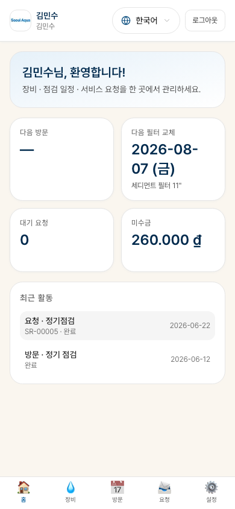
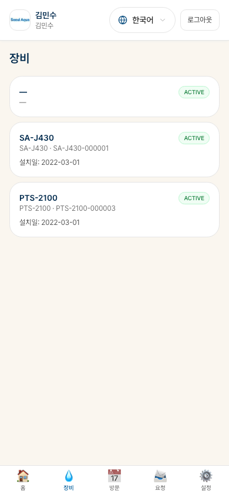
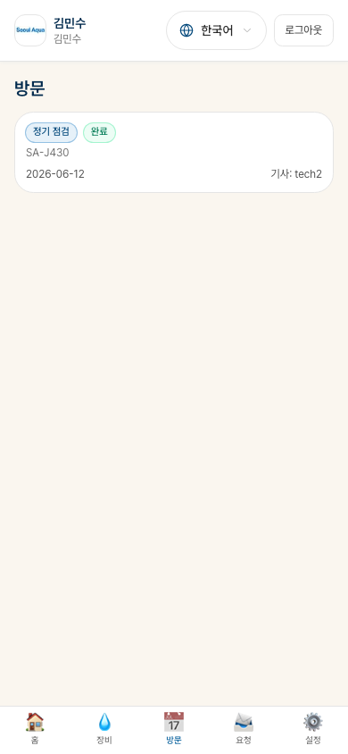
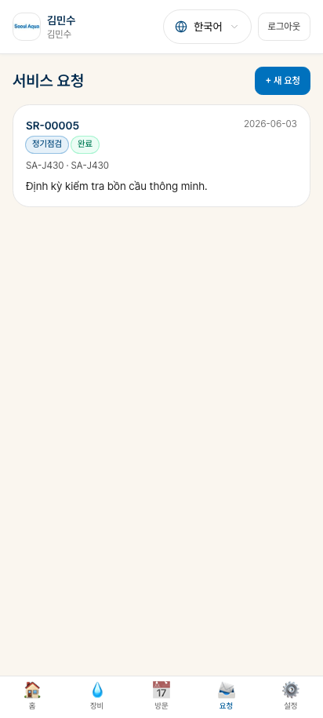
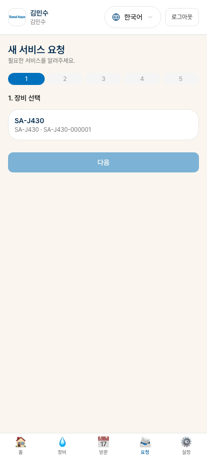
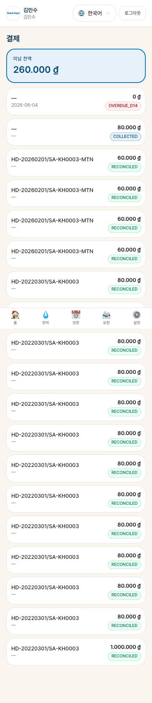
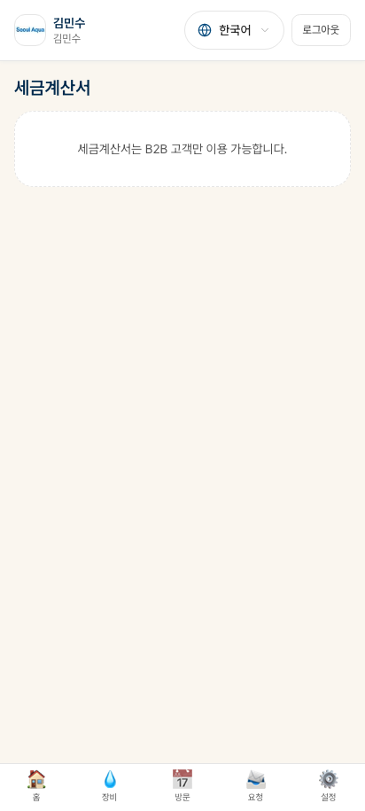
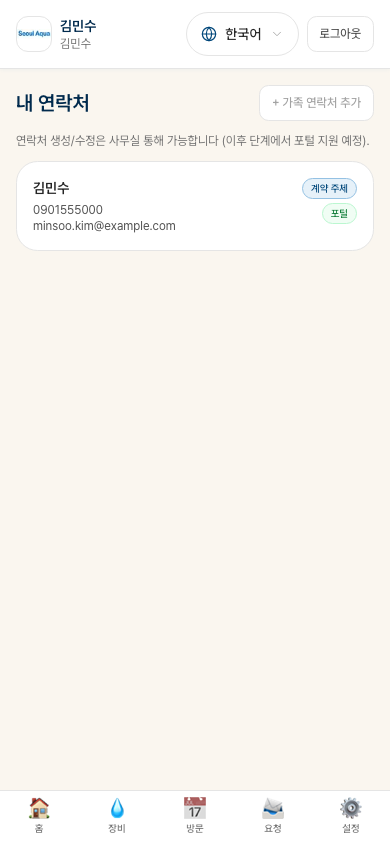
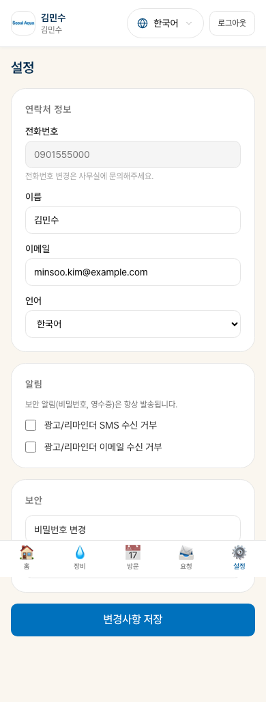

# Seoul Aqua SOMS — 고객 포털 이용 안내

> 마지막 업데이트: 장비 도메인 재설계 + 판매원 + 주문 + 방문 추가 유형 반영 (2026-07)

---

## 이 안내서 대상

서울아쿠아에서 정수기·공기청정기·비데 등을 임대·구매·유지관리 중인 고객님을 위한 안내서입니다. 고객 포털(`portal.seoulaqua.com.vn`)에 로그인하면 장비 현황 조회, 방문 이력 확인, 서비스 요청 제출, 결제 내역 열람이 가능합니다.

고객 포털 계정은 계약 담당자(계약 주체) 또는 관리 담당자(관리 주체)에게 발급됩니다. 계정이 없거나 비밀번호를 잊으셨으면 사무실로 연락하세요.

---

## 할 수 있는 것

- 로그인 / 비밀번호 변경 / 잊어버린 비밀번호 재발급
- 홈 화면에서 장비·방문 일정·서비스 요청 요약 확인
- 내 장비 목록 및 상세 정보 열람
- 방문 이력·작업확인서 다운로드
- 서비스 요청 제출 및 진행 현황 확인
- 결제 내역 및 미납 잔액 조회
- 세금계산서 다운로드 (B2B 고객)
- 연락처 정보 확인
- 알림 수신 설정·비밀번호 변경 (설정 화면)

---

## 1. 로그인

1. 브라우저(또는 홈 화면에 추가된 앱)에서 `portal.seoulaqua.com.vn`을 엽니다.
2. **전화번호**와 **비밀번호**를 입력하고 **로그인** 버튼을 탭합니다.

   

3. 같은 전화번호로 여러 계정이 등록된 경우 계정 선택 화면이 나타납니다. 해당 고객사(또는 이름)를 선택하세요.

### 임시 비밀번호로 첫 로그인

계약 활성화 직후 SMS로 임시 비밀번호(10자리)가 발송됩니다. 첫 로그인 시 새 비밀번호(최소 8자)를 즉시 설정해야 합니다. 설정하지 않으면 다른 화면으로 넘어갈 수 없습니다.

### 비밀번호를 잊으셨나요?

로그인 화면 하단의 **비밀번호를 잊으셨나요?** 링크를 탭합니다. 전화번호와 이름을 입력하면 등록된 전화번호로 임시 비밀번호 SMS가 발송됩니다.

---

## 2. 홈 (대시보드)

로그인 직후 홈 화면이 표시됩니다. 하단 탭 바의 **홈**을 탭하면 언제든지 돌아올 수 있습니다.

| 카드 | 내용 |
|---|---|
| **다음 방문** | 가장 가까운 예정 방문 날짜·담당 기사 |
| **대기 요청** | 처리 중인 서비스 요청 건수 |
| **미수금** | 현재 미납 잔액 합계 |
| **다음 필터 교체** | 가장 빠른 필터 교체 예정일 |
| **최근 활동** | 최근 방문·요청 목록 |

---

## 3. 장비

하단 탭 **장비**를 탭하면 계약 중인 모든 장비 목록이 나타납니다.

각 장비 카드에는 제품명, 모델, 설치일, 현재 상태(임대 중·구매 완료 등)가 표시됩니다.

### 장비 상세

장비 카드를 탭하면 상세 화면이 열립니다.

- **기본 정보**: 시리얼 번호, 상태, 소유 구분(임대/구매), 설치일
- **사업장** (B2B 고객): 장비가 설치된 사업장 이름
- **필터 교체 일정**: 다음 교체 예정일과 필터 종류
- **방문 내역**: 해당 장비와 관련된 방문 이력 목록

---

## 4. 방문

하단 탭 **방문**을 탭하면 방문 이력을 확인할 수 있습니다.

각 방문 항목에는 날짜, 담당 기사, 방문 유형(정기 점검·설치·수리·소모품 납품 등), 완료 여부가 표시됩니다.

### 작업확인서 다운로드

완료된 방문 항목을 탭하면 상세 화면이 열립니다. **작업확인서 다운로드** 버튼을 탭하면 해당 방문의 작업확인서(PDF)를 받을 수 있습니다.

---

## 5. 서비스 요청

하단 탭 **요청**에서 서비스 요청 목록을 확인하고 새 요청을 제출할 수 있습니다.

### 새 서비스 요청 제출

1. **+ 새 요청** 버튼을 탭합니다.

   

2. **1. 장비 선택** — 문제가 있는 장비를 선택합니다. B2B 고객은 사업장도 함께 지정할 수 있습니다.
3. **2. 요청 유형** — 점검·수리·부품 교체·이전 중 해당 항목을 선택합니다.
4. **3. 상세 내용** — 증상이나 요청 내용을 10자 이상 입력합니다.
5. **4. 사진 첨부 (선택)** — 문제 사진을 첨부하면 처리가 빨라집니다.
6. **5. 확인 후 제출** — 예상 비용(무상/유상 여부)을 확인하고 **제출** 버튼을 탭합니다.

### 예상 비용 안내

| 표시 | 의미 |
|---|---|
| 무상 — 계약에 포함 | 유지관리/임대 계약 범위 내, 보증 기간 내, 또는 설치 후 90일 이내 |
| 유상 — 사무실 검토 후 견적 | 계약 범위 외. 사무실이 견적 확인 후 연락드립니다. |

### 요청 처리 흐름

- **접수됨** → 사무실 확인 대기
- **검토 중** → 사무실 처리 중 (유상인 경우 견적 확인 포함)
- **승인됨** → 방문 일정 예약 완료, SMS로 안내
- **완료** → 방문 완료

요청이 거절될 경우 거절 사유가 표시되고 SMS로 안내됩니다.

---

## 6. 결제

브라우저 주소창에서 `/payments`로 이동하거나, 홈 화면의 **미수금** 카드를 탭합니다.

| 열 | 내용 |
|---|---|
| **일자** | 납부 예정일 또는 납부일 |
| **계약** | 연결된 계약 번호 |
| **예상** | 청구 금액 |
| **납부** | 실제 납부 금액 |
| **상태** | 납부 완료·미납·연체 등 |

화면 상단의 **미납 잔액** 카드에 현재 미납 합계가 굵게 표시됩니다.

---

## 7. 세금계산서 (B2B 고객 전용)

B2B 고객은 브라우저에서 `/invoices`로 이동하면 세금계산서 목록을 열람할 수 있습니다.

각 항목에는 계산서 번호, 발행일, 금액이 표시됩니다. **다운로드** 버튼을 탭하면 PDF를 받을 수 있습니다.

B2C 개인 고객에게는 이 메뉴가 표시되지 않습니다.

---

## 8. 연락처

브라우저에서 `/contacts`로 이동합니다.

내 계정에 등록된 연락처 목록이 표시됩니다.

| 역할 | 설명 |
|---|---|
| **계약 주체** | 계약서 서명, 세금계산서·법적 통보 수신 담당 |
| **관리 주체** | 방문 일정 SMS, 영수증 수신 담당 |

연락처 정보 변경(추가·삭제·수정)은 현재 포털에서 직접 지원되지 않습니다. 변경이 필요하면 담당 직원에게 연락하세요.

---

## 9. 설정

하단 탭 **설정**을 탭하거나 브라우저에서 `/settings`로 이동합니다.

### 연락처 정보 수정

- **이름·이메일·언어**를 변경한 후 **변경사항 저장** 버튼을 탭합니다.
- **전화번호**는 포털에서 직접 변경할 수 없습니다. 변경이 필요하면 사무실에 문의하세요.

### 알림 설정

- **광고/리마인더 SMS 수신 거부**: 체크하면 마케팅·리마인더 SMS를 받지 않습니다.
- **광고/리마인더 이메일 수신 거부**: 체크하면 마케팅·리마인더 이메일을 받지 않습니다.

> 비밀번호 재발급, 영수증 등 보안·거래 관련 알림은 수신 거부 여부와 무관하게 항상 발송됩니다.

### 비밀번호 변경

1. 설정 화면에서 **비밀번호 변경** 버튼을 탭합니다.
2. 현재 비밀번호를 입력합니다.
3. 새 비밀번호(최소 8자)를 두 번 입력하고 **변경** 버튼을 탭합니다.

---

## 10. 언어 전환

어느 화면에서든 오른쪽 상단의 언어 버튼(KO / VI / EN)을 탭하면 UI 언어를 바꿀 수 있습니다. 설정 화면에서 기본 언어를 저장하면 다음 로그인 시에도 유지됩니다.

---

## 용어 설명

| 용어 | 설명 |
|---|---|
| 계약 주체 | 계약서에 서명하고 세금계산서·법적 통보를 받는 담당자 |
| 관리 주체 | 방문 일정 SMS·영수증을 받는 현장 담당자 |
| 포털 | 고객 포털 (`portal.seoulaqua.com.vn`) |
| 임시 비밀번호 | 계약 활성화 시 SMS로 발송되는 10자리 초기 비밀번호 |
| 작업확인서 | 기사가 방문 완료 시 서명하는 작업 확인 문서 (PDF) |
| 미수금 | 아직 납부되지 않은 금액 합계 |
| B2B | 기업 고객 (사업자 계정) |
| B2C | 개인 가정 고객 |

---

## 문제 해결

| 증상 | 해결 방법 |
|---|---|
| 로그인이 안 됩니다 | 전화번호와 비밀번호를 다시 확인하세요. 5회 연속 실패 시 계정이 잠깁니다. **비밀번호 찾기**를 사용하거나 사무실에 문의하세요. |
| 임시 비밀번호 SMS가 오지 않았습니다 | 계약 처리가 완료되지 않았을 수 있습니다. 사무실에 문의하세요. |
| 장비가 목록에 보이지 않습니다 | 계약이 아직 활성화되지 않은 경우입니다. 사무실에 확인하세요. |
| 세금계산서 메뉴가 없습니다 | B2B 고객 전용 기능입니다. 개인(B2C) 고객에게는 표시되지 않습니다. |
| 연락처를 직접 수정하고 싶습니다 | 현재 포털에서는 지원되지 않습니다. 담당 직원을 통해 변경해주세요. |
| 서비스 요청 상태가 바뀌지 않습니다 | 처리 시간이 걸릴 수 있습니다. 상태 변경 시 SMS로 안내됩니다. |
