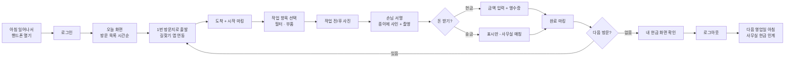

# Seoul Aqua SOMS — 현장 기사 매뉴얼 (Field Manual)

**대상 사용자**: 기사 (TECHNICIAN) — 약 80명, 모바일 전용
**버전**: 2026-06-02
**언어**: 한국어
**관련 문서**: [사무실 매뉴얼](./office.md) · [고객 매뉴얼](./customer.md)

이 매뉴얼은 Seoul Aqua의 **현장 기사** 분들을 위한 안내서입니다. 핸드폰 또는 작은 태블릿으로 사용하는 모든 화면과 모든 작업 단계를 자세히 설명합니다.

---

## 목차

- [1장. 시작하기](#1장-시작하기)
- [2장. 기사의 하루 (워크플로 개요)](#2장-기사의-하루-워크플로-개요)
- [3장. 로그인과 첫 화면](#3장-로그인과-첫-화면)
- [4장. "오늘" 화면 — 오늘 할 일](#4장-오늘-화면--오늘-할-일)
- [5장. 방문 카드 — 한 군데 정보](#5장-방문-카드--한-군데-정보)
- [6장. 방문 시작 → 완료 마법사 (6단계)](#6장-방문-시작--완료-마법사-6단계)
- [7장. 사진 촬영과 업로드](#7장-사진-촬영과-업로드)
- [8장. 손님 서명 받기](#8장-손님-서명-받기)
- [9장. 결제 수금 (현장)](#9장-결제-수금-현장)
- [10장. 공동 작업 — 협업 기사](#10장-공동-작업--협업-기사)
- [11장. 손님께 전화하기](#11장-손님께-전화하기)
- [12장. 부품이 없거나 손님이 부재일 때](#12장-부품이-없거나-손님이-부재일-때)
- [13장. 하루 정리와 현금 인계](#13장-하루-정리와-현금-인계)
- [14장. 자주 마주치는 상황](#14장-자주-마주치는-상황)
- [15장. 인터넷이 안 될 때](#15장-인터넷이-안-될-때)
- [16장. 공용 태블릿 사용 시 주의](#16장-공용-태블릿-사용-시-주의)
- [17장. 보안 수칙](#17장-보안-수칙)
- [부록 A. 방문 종류 빠른 참조](#부록-a-방문-종류-빠른-참조)
- [부록 B. 자주 만나는 모델별 작업 시간](#부록-b-자주-만나는-모델별-작업-시간)

---

## 1장. 시작하기

### 1.1 어떤 핸드폰이 필요한가요?

| 항목 | 권장 |
|---|---|
| **OS** | Android 8 이상, iPhone iOS 14 이상 |
| **화면 크기** | 5~6 인치 (큰 글씨 보기 좋음) |
| **카메라** | 800만 화소 이상 (필터 사진 선명히) |
| **인터넷** | LTE / 5G — 4G도 가능 |
| **저장 공간** | 1GB 이상 여유 (방문 사진 임시 저장용) |

### 1.2 SOMS 모바일은 어디서 여나요?

핸드폰 인터넷 브라우저(Chrome, Safari)에서:

```
https://soms.seoulaqua.com.vn/f/login
```

> **앱 다운로드 안 합니다.** 브라우저에서 바로 사용합니다. 자주 쓰시면 **홈 화면에 바로가기 추가**를 추천합니다 (브라우저 메뉴 → "홈 화면에 추가").

### 1.3 처음 받아야 할 것

ADMIN이 본인 계정을 만들어 주시면 SMS 한 통이 옵니다:

```
Seoul Aqua 기사용 계정이 생성되었습니다.
임시 비밀번호: ********
로그인: soms.seoulaqua.com.vn/f/login
```

이 SMS는 **본인만** 봐야 합니다. 비밀번호는 다른 사람에게 절대 알려주지 마세요.

---

## 2장. 기사의 하루 (워크플로 개요)

### 2.1 한눈에 보기



### 2.2 하루 시간 예시

| 시간 | 활동 |
|---|---|
| 07:30 | 일어나서 핸드폰으로 "오늘" 확인 |
| 08:00 | 1번 손님 출발 |
| 08:30 | 1번 손님 도착, 마법사 시작 |
| 09:00 | 1번 손님 완료 (작업 약 30분) |
| 09:15 | 2번 손님 출발 (이동 약 15분) |
| 09:30 | 2번 손님 도착 |
| ... | ... |
| 17:30 | 마지막 방문 완료 |
| 18:00 | 본인 현금 확인 → 퇴근 |
| 다음 날 08:00 | 사무실에 현금 인계 |

### 2.3 평균 한 건 작업 시간 (참고)

| 작업 종류 | 평균 소요 |
|---|---|
| INSTALLATION (설치) | 45~60분 (모델에 따라 다름) |
| PERIODIC (정기점검) | 15~25분 |
| FILTER_REPLACEMENT (필터 교체) | 15~20분 |
| REPAIR (수리) | 20~60분 (고장 종류에 따라) |
| RELOCATION (이전 설치) | 60~90분 |
| RETRIEVAL (회수) | 20~30분 |

---

## 3장. 로그인과 첫 화면

### 3.1 로그인 화면


| 입력란 | 입력 |
|---|---|
| **전화번호** | 본인 휴대폰 번호 (숫자만, 예: `0901234567`) |
| **비밀번호** | 본인 비밀번호 |

> 사무실 직원과 달리 **휴대폰 번호로만 로그인**합니다 (사용자명 안 받음).

**로그인 버튼**을 누르면 잠깐 기다린 후 "오늘" 화면으로 이동합니다.

#### 첫 로그인 시

임시 비밀번호로 처음 들어가면 **새 비밀번호 설정 화면**이 강제로 뜹니다:

- 비밀번호: 8자 이상
- 같은 비밀번호 확인 (두 번 입력)
- **저장** → 다음부터 새 비밀번호로 로그인

> **비밀번호 외울 자신 없으시면** 자기만 아는 형식으로 메모 (예: "차량번호 + 생일 마지막 4자"). 종이에 그대로 적지 마세요.

### 3.2 로그인이 안 될 때

| 증상 | 원인 | 해결 |
|---|---|---|
| "잘못된 자격증명" | 비밀번호 틀림 | 다시 시도 (3회 실패 시 1시간 잠금) |
| "역할 불일치" + 빨간 메시지 | 사무실 로그인 페이지에 갔음 | "기사 로그인 페이지로 가기" 버튼 클릭 |
| 비밀번호 잊음 | — | 사무실 ADMIN/MANAGER에게 전화 — 새 임시 비번 SMS |
| 계정 잠금 | 3회 실패 | 1시간 후 자동 해제 또는 ADMIN 부탁 |

### 3.3 첫 화면 = "오늘"

로그인 후 자동으로 "오늘" 화면이 보입니다. 이 화면이 기사의 메인 화면입니다 (4장 참조).

#### 화면 하단 메뉴

| 아이콘 | 이름 | 설명 |
|---|---|---|
| 📅 | **오늘** | 오늘 할 일 |
| 📆 | **예정** | 내일·다음주 일정 |
| 👤 | **내 정보** | 본인 정보, 보유 현금, 로그아웃 |

---

## 4장. "오늘" 화면 — 오늘 할 일


### 4.1 화면 구성

오늘 방문해야 할 곳들이 **시간순으로** 카드 형태로 나옵니다.

각 카드에 표시되는 정보:

| 항목 | 예시 |
|---|---|
| **시간대** | `09:00~11:00` 또는 `오전` |
| **손님 이름** | `Nguyễn Văn A` 또는 `㈜한국기업` |
| **주소** | 한 줄로 줄여진 주소 (탭하면 전체 보임) |
| **방문 종류** | "정기점검" / "설치" / "수리" 등 (색상 구분) |
| **장비 수** | "정수기 × 3대" |
| **수금 예정 금액** | 있는 경우만 표시 (없으면 표시 안 함) |
| **공유 배지** | 협업 기사로 배정된 경우 "공유됨" 표시 |

### 4.2 색상 분류

방문 종류에 따라 카드 왼쪽 테두리 색이 다릅니다:

| 색상 | 의미 |
|---|---|
| 🟢 **녹색** | 정기점검 (PERIODIC) — 무료, 일반적 |
| 🔵 **파란색** | 설치 (INSTALLATION) — 신규 손님 |
| 🟠 **주황색** | 수리 (REPAIR) / 부품 교체 — 유료, 사무실 검토 후 진행 |
| 🟣 **보라색** | 이전 설치 (RELOCATION) — 유료, 큰 작업 |
| 🔴 **빨간색** | 회수 (RETRIEVAL) — RENTAL 종료 |
| ⚫ **회색** | 협업 기사로 배정 — 본인이 주관 기사 아님 |

### 4.3 카드 탭하면 — 방문 상세 (5장)

각 방문 카드를 탭하면 더 자세한 정보와 작업 시작 버튼이 나옵니다.

### 4.4 길찾기

방문 카드의 **주소 탭하기**:

- iOS: **Apple 지도** 자동 실행
- Android: **Google 지도** 자동 실행
- 둘 다 본인 위치 → 손님 주소로 자동 경로 안내

### 4.5 오늘 일이 없으면?

빈 화면에 "오늘 예정된 방문이 없습니다" 메시지. 이런 경우:
- 사무실에서 일정을 안 잡았을 수 있음
- 또는 본인이 휴무 (사무실에 사전 통보)

긴급한 방문이 생기면 사무실이 새로 일정을 잡고 본인 핸드폰에 알림이 옵니다.

---

## 5장. 방문 카드 — 한 군데 정보

### 5.1 방문 상세 화면

방문 카드 탭 → 다음 정보가 보입니다:

| 항목 | 설명 |
|---|---|
| **방문 종류 + 상태** | 화면 상단 |
| **손님 정보** | 이름, 회사명 (B2B) |
| **연락처** | 일상 담당자 이름 + "전화" 버튼 |
| **주소 + 지도 보기** | 길찾기 앱 연동 |
| **시간대** | 약속 시간 |
| **방문 사유** | "정기 필터 교체", "고장 신고: 물이 안 나옴" 등 |
| **장비 목록** | 이번 방문에서 작업할 장비들 (시리얼 번호 포함) |
| **이전 방문 기록** | 마지막 점검일, 그때 작업 내용 (참고용) |
| **사무실 메모** | 특이사항 (예: "출입 코드: #1234", "큰 개 있음", "오후 2시 이후 가능") |
| **공동 작업 기사** | 협업 기사 있는 경우 표시 |
| **시작 / 일정 변경 / 취소** 버튼 | 하단 |

### 5.2 "방문 시작" 버튼

손님 댁/회사에 도착하면 이 버튼을 누릅니다. 누르면:

- 방문 상태가 `SCHEDULED` → `IN_PROGRESS`로 바뀜
- 사무실 화면에서도 "진행중"으로 표시됨
- 마법사 단계 1로 진입 (6장)

### 5.3 일정 변경

손님이 "지금 못 받아요" 하시면:

1. "**일정 변경**" 버튼
2. 사유 선택 (드롭다운: `손님 요청`, `손님 부재`, `기상 악화`, `기타`)
3. 사무실에 알림이 자동으로 가서 새 일정 잡힘
4. 본인은 다음 방문으로 이동

> 본인이 **마음대로 새 날짜를 지정할 수는 없습니다**. 사무실이 손님과 통화해서 새 날짜를 결정합니다. 본인은 사유만 알림.

### 5.4 취소

손님이 "다시는 안 와도 됩니다" 또는 사무실이 취소 결정한 경우:

1. "**취소**" 버튼
2. 사유 입력
3. 확인 → 방문 상태 `CANCELLED`

> **이미 시작한 방문(IN_PROGRESS)은 취소 안 됨.** 대신 6장의 "재방문 필요" 또는 "완료" 처리하세요.

---

## 6장. 방문 시작 → 완료 마법사 (6단계)

방문 카드에서 "**시작**" 버튼을 누르면 마법사가 시작됩니다. 단계별로 따라가면 됩니다.

### 6.1 단계 1: 도착 + 시작 마킹

도착해서 손님께 인사하고, **"도착했음 + 시작"** 버튼을 누릅니다.

- 화면 상단에 진행률 표시: `1 / 6`
- 시간 자동 기록 (작업 시작 시각)

### 6.2 단계 2: 작업 항목 선택

이번 방문에서 무엇을 할지 선택합니다.

#### 정기점검의 경우 (PERIODIC)

자동으로 추천 항목이 떠 있습니다 (시스템이 필터 교체 주기로 자동 계산):

- ☑️ 1차 필터 교체 (PARTCODE-001) — 추천
- ☑️ 2차 필터 교체 (PARTCODE-002) — 추천
- ☐ 멤브레인 점검 (PARTCODE-003) — 선택 사항

**체크박스로 실제 작업할 항목만 남기세요.** 손님이 거부하거나 부품이 없으면 체크 해제.

#### 설치의 경우 (INSTALLATION)

- 설치할 장비 목록 표시
- 각 장비의 **시리얼 번호 입력란** 표시 (반드시 입력)
- 설치 위치 사진 (선택 항목 표시)

#### 수리의 경우 (REPAIR)

- 손님이 보고한 증상 표시
- 교체 부품 선택 가능 (사무실이 미리 견적해둠)

### 6.3 단계 3: 작업 전/후 사진

#### 작업 전 사진

- 카메라 자동 실행
- 권장 사진: 장비 전체 모습, 시리얼 번호 표시판, 설치 위치
- **2장 이상** 권장

#### 작업 후 사진

- 작업 끝나고 새 부품이 보이게 촬영
- 새 필터 시리얼 보이게
- **2장 이상** 권장

#### 사진 업로드

촬영하면 자동으로 사무실 서버에 업로드됩니다. 인터넷이 약하면 잠시 대기.

**오프라인이면**: 사진은 핸드폰에 임시 저장되고, 인터넷 복귀하면 자동 업로드 (15장 참조).

### 6.4 단계 4: 손님 서명

종이 작업확인서에 손님이 서명하시면, **종이를 촬영**해서 업로드합니다.

> v1에서는 **종이 사인 + 사진**이 정식 방법입니다. 태블릿에 직접 손가락으로 서명하는 e-사인은 향후 추가 예정.

#### 서명 종이가 없으면

방문 시작 전에 작업확인서 PDF를 핸드폰에서 미리보기 → 인쇄해서 가져가거나, 손님이 종이에 사인하시면 됩니다.

### 6.5 단계 5: 결제 수금

손님이 돈을 내야 하는 경우만 이 단계가 나타납니다.

#### 화면에 표시되는 정보

- **예상 금액**: 시스템 자동 계산 (계약상 금액)
- **수금 방법** (드롭다운):
  - **현금 (CASH_AT_VISIT)**
  - **이미 송금됨 (BANK_TRANSFER)**

#### 현금 수금

1. 손님께 현금 받기
2. **실제 받은 금액 입력**
3. 영수증 발급 옵션:
   - **휴대용 프린터 출력** (기사가 휴대용 프린터 가지고 있는 경우)
   - **화면 표시 + QR 코드**: 손님이 핸드폰으로 스캔해 저장
4. 손님 이메일이 있으면 **자동으로 이메일 영수증** 추가 발송됨

#### 송금된 경우

손님이 미리 송금하셨다면 "이미 송금됨" 선택. 이 경우 본인은 돈을 안 받음. 사무실에서 송금 매칭 처리.

#### 일부 수금 (외상)

손님이 일부만 내고 나머지는 다음 주에 송금하기로 한 경우:

1. 실제 받은 금액 입력 (예상보다 적게)
2. **부분 수금 표시** 체크
3. 사무실에 알림이 자동으로 가서 추후 매칭

### 6.6 단계 6: 완료 마킹

마지막 확인 화면입니다:

- 작업 항목 요약
- 사진 개수
- 서명 첨부 여부
- 수금 금액

**"완료" 버튼**을 누르면:
- 방문 상태 `COMPLETED`
- **작업확인서 PDF 자동 생성** → S3 저장
- 손님 이메일로 PDF 자동 발송
- 필터 교체일 자동 재계산 (다음 정기점검 예약용)
- "오늘" 화면으로 돌아감 → 다음 방문 카드 강조

축하합니다 — 한 건 끝! 다음 방문지로 이동.

### 6.7 마법사 중간에 다른 앱을 봐야 할 때

손님이 옆에서 다른 얘기를 하시거나, 카카오톡 답을 해야 하거나, 화장실에 다녀와야 할 때:

- 핸드폰 홈 버튼 → 다른 앱 보고 옴 → SOMS 다시 열기
- **입력한 모든 값 그대로 유지됩니다** (예상 금액, 선택한 부품, 메모 등)

이건 의도된 동작입니다. 작업 중 정보가 갑자기 바뀌면 큰일이 나니까요.

> **참고**: 다른 화면(예: 사무실의 손님 목록)은 자동 새로고침이 되지만, **방문 완료 마법사만 멈춰 있게** 설계되어 있습니다.

---

## 7장. 사진 촬영과 업로드

### 7.1 좋은 사진의 조건

| 좋은 사진 | 나쁜 사진 |
|---|---|
| 장비 전체가 보임 | 클로즈업만 |
| 시리얼 번호 또렷이 보임 | 시리얼 잘림 |
| 밝고 초점 맞음 | 어둡거나 흔들림 |
| 부품 교체 부위 보임 | 다른 곳 찍힘 |

### 7.2 권장 사진 개수

| 방문 종류 | 최소 사진 | 권장 |
|---|---|---|
| INSTALLATION | 4장 | 6~8장 (설치 위치, 전후, 시리얼) |
| PERIODIC | 2장 | 3~4장 (장비 + 새 필터) |
| REPAIR | 4장 | 6장 (고장 부위 전/후) |
| RELOCATION | 6장 | 8~10장 (이전 위치 + 새 위치) |
| RETRIEVAL | 3장 | 4장 (회수 전 모습) |

### 7.3 자동 업로드와 압축

- 업로드 전 자동으로 **품질 75%**로 압축 (저장 공간 절약)
- 그래도 시리얼 번호 등은 충분히 읽힘
- 인터넷이 약하면 background에서 자동 업로드 시도

### 7.4 잘못 찍었을 때 다시 찍기

각 사진 옆에 **"삭제" 버튼**이 있습니다. 잘못 찍은 사진 삭제하고 다시 촬영.

> **이미 업로드된 사진을 삭제**하면 사무실에 그 기록이 남습니다 (감사 기록). 정직하게 다시 찍으세요.

---

## 8장. 손님 서명 받기

### 8.1 종이 작업확인서 준비

방문 전에 핸드폰에서 **작업확인서 PDF 미리보기** → 인쇄해서 가져가는 방법:

1. 방문 카드에서 "**작업확인서 PDF**" 버튼
2. PDF 미리 보임
3. 인쇄 (휴대용 프린터 또는 사무실에서 미리 출력)

또는 손님 댁에 가서 손님이 종이에 직접 사인 받기.

### 8.2 서명 받기

손님이 종이에 사인 → 종이를 **카메라로 촬영** → 업로드.

#### 좋은 서명 사진

- 사인 전체가 보임 (잘리지 않음)
- 종이 전체가 보이면 더 좋음 (계약 정보까지)
- 빛 반사 없음

#### 디지털 서명 (향후)

태블릿에 직접 손가락으로 서명하는 기능은 향후 추가됩니다. 현재 v1은 종이 사진 방식.

### 8.3 손님이 서명을 거부하시면

가끔 손님이 "오늘은 시간 없어요, 사인은 다음에" 하시는 경우:

1. "**서명 보류**" 체크
2. 사무실에 알림이 자동으로 가서 다음 방문 또는 우편으로 사인 받기 추진
3. 그래도 방문은 정상 완료 처리

> **단, 결제 받는 방문은 서명 권장**. 영수증 분쟁 방지.

---

## 9장. 결제 수금 (현장)

### 9.1 결제 종류

현장에서 받을 수 있는 결제:

| 종류 | 본인이 받음? |
|---|---|
| **CASH_AT_VISIT** (현금) | ✅ 본인 수금 |
| **BANK_TRANSFER** (송금) | ❌ 손님이 직접 송금 — 본인은 표시만 |
| **B2B_EINVOICE** | ❌ 사무실 처리 |
| **B2B_NO_INVOICE** | ❌ 사무실 처리 |

### 9.2 현금 수금 단계

#### 손님께 금액 알리기

"오늘 작업비는 ____원입니다" 또는 "월 임대료 ____원입니다."

화면에 **예상 금액**이 표시되니 그대로 알려 드리세요.

#### 현금 받기

- 종이돈을 천천히 세 보기
- 손님 앞에서 다시 세 보기 (이중 확인)
- 잔돈이 필요하면 본인 지갑에서 거슬러 드리기

#### 금액 입력

- 화면에 자동 표시된 예상 금액과 받은 금액을 비교
- 일치하면 그대로 진행
- 일치 안 하면 **실제 받은 금액**으로 수정

#### 영수증 발급

**휴대용 프린터** 있는 경우:
- "**영수증 출력**" 버튼 → 즉시 인쇄

**프린터 없는 경우**:
- "**화면 표시 + QR**" 버튼
- 영수증 PDF가 화면에 표시됨
- 손님이 본인 핸드폰으로 QR 스캔 → 다운로드

**자동 이메일**:
- 손님 이메일이 등록되어 있으면 자동으로 영수증 이메일 추가 발송 (백그라운드)

### 9.3 큰 금액 수금 시 주의

#### 50만 동(VND) 이상 (약 미화 20달러 이상)

- **천천히** 세 보기
- 위조지폐 의심되면 정중히 "다른 지폐로 부탁드려요"
- 손님 카드 결제는 v1에서 지원 안 함 — 송금으로 안내

#### 100만 동 이상

- 가능하면 **송금 권유**
- 현금이라면 **봉투에 담고 라벨링** ("손님 KH00123, 2026-06-02, 1,500,000 VND")
- 사무실로 가는 길에 분실 주의

### 9.4 일부 수금 (외상)

손님이 "다음 주에 나머지 송금할게요" 하시면:

1. 받은 금액 입력
2. **"부분 수금"** 체크
3. 메모란에 "나머지 X원은 ____월 ____일 송금 예정"
4. 완료 → 사무실이 자동으로 미수금 행으로 처리

### 9.5 환불 요청 (현장에서 즉시)

손님이 "이전에 낸 돈 환불해 주세요" 하시면:

- **본인은 환불 처리 안 함**
- 사무실에 전화해서 ADMIN/MANAGER가 처리하도록 안내
- 메모란에 손님 요청 사항 기록

---

## 10장. 공동 작업 — 협업 기사

### 10.1 협업 기사가 뭔가요?

B2B 큰 사이트 (예: 정수기 50대 있는 공장)는 한 사람으로 부족합니다. 사무실이 2~5명을 같은 방문에 배정합니다.

- **주관 기사 (Lead)** — 1명, **본인이 책임자**
- **협업 기사 (Collaborator)** — 0~N명, 본인을 도와주는 동료

### 10.2 본인이 주관 기사일 때

- 본인 "오늘" 화면에 일반 카드처럼 표시
- 평소처럼 작업 시작 → 마법사 단계 진행
- **본인이 모든 책임**: 서명, 수금, 완료 마킹, 작업확인서 PDF 서명

### 10.3 본인이 협업 기사일 때

- 본인 "오늘" 화면에 카드가 표시되지만 **"공유됨" 회색 배지** 있음
- 카드 탭하면 정상적으로 방문 정보 보임
- **다음은 할 수 있음**:
  - 도착 마킹
  - 사진 추가
  - 작업 메모 추가
  - 부품 사용 기록
- **다음은 못 함**:
  - 완료 마킹 → 주관 기사만
  - 손님 서명 받기 → 주관 기사만
  - 결제 수금 → 주관 기사만

### 10.4 주관 기사와 협업 기사가 같이 작업할 때

#### 권장 진행 순서

1. 주관 기사가 "**시작**" 버튼 누름 → 모든 협업 기사도 "진행중" 으로 표시됨
2. 각자 맡은 장비를 작업
3. 각자 본인 핸드폰에서 작업 항목 체크 + 사진 촬영
4. 모두 끝나면 **주관 기사가 손님 서명 받기 → 수금 → 완료 마킹**
5. 협업 기사는 완료 메시지를 봄

#### 협업 기사가 일찍 떠나야 하는 경우

협업 기사는 본인 일이 끝나면 **그냥 떠나도 됩니다**. 사진과 메모는 이미 저장됨. 주관 기사가 나머지 처리.

### 10.5 협업 기사 사이 소통

화면에 "다른 기사들" 영역이 있어 누가 함께 일하는지 표시됩니다. 직접 메시지 기능은 v1에서 없음 — **직접 통화 또는 카카오톡** 권장.

---

## 11장. 손님께 전화하기

### 11.1 방문 카드의 "전화" 버튼

방문 카드에 **"손님께 전화"** 버튼:

- 누르면 자동으로 **일상 담당자**의 전화로 연결
- 일상 담당자 없으면 **계약 당사자**로
- B2B 사이트는 **사이트별 담당자** 우선

### 11.2 개인정보 보호

화면에 **손님 전화번호 자체는 표시되지 않습니다**. "전화" 버튼만 보입니다.

이렇게 한 이유:
- 손님 번호가 본인 핸드폰 통화 기록에 남음 (정상)
- 하지만 본인이 다른 사람에게 보여주거나 캡쳐할 가능성 → 개인정보 유출
- 버튼 방식이면 **본인도 못 봄** → 외부 유출 위험 ↓

### 11.3 이메일은 어디?

방문 상세 화면에 "**이메일 보내기**" 버튼이 있습니다 (있는 경우만). 본인 메일 앱이 자동 실행.

### 11.4 어떤 경우에 손님께 전화?

- **도착 5분 전** — "곧 도착합니다" (특히 B2C 약속 시간 임박)
- **주차 / 출입 어려움** — "출입 코드 좀 알려주세요"
- **부재 발견** — "왔는데 안 계세요, 어디 계세요?"
- **작업 후 확인** — "물맛 어떠세요? 다른 점은 없으세요?"

### 11.5 전화 안 받으시는 경우

10~15분 기다린 후:

1. **사무실에 전화** → 사무실이 손님 측 다른 담당자 시도
2. 그래도 안 되면 → "**일정 변경**" 버튼 (사유: `손님 부재`)
3. 다음 방문지로 이동

---

## 12장. 부품이 없거나 손님이 부재일 때

### 12.1 시나리오 — 부품이 없는 경우

손님 댁에 도착해서 작업하려는데:
- 필요한 필터 / 부품이 본인 차에 없음
- 또는 손님이 추가로 부품 교체 요청했는데 재고 없음

#### 처리

1. 진행 중인 마법사에서 "**재방문 필요**" 버튼
2. 사유 입력 (드롭다운):
   - `부품 재고 부족`
   - `장비 분해 필요 — 도구 없음`
   - `손님 동의 필요`
   - `기타`
3. 손님께 양해 구하기: "다음에 부품 가지고 다시 오겠습니다, 죄송합니다"
4. 사무실에 자동 알림 → 사무실이 부품 준비 + 새 일정 잡음

방문 상태는 `NEEDS_REVISIT` → `SCHEDULED` (새 행).

### 12.2 시나리오 — 손님이 부재

도착했는데:
- 손님이 아무도 안 계심
- 일상 담당자에게 전화해도 안 받음

#### 처리

1. 10~15분 대기 (혹시 늦으실 수 있음)
2. 일상 담당자에게 전화
3. 그래도 안 되면:
   - **"손님 부재" 사유로 재방문 신청**
   - 사무실에 자동 알림 → 손님과 통화 후 새 일정

### 12.3 시나리오 — 손님이 작업 거부

도착했는데 손님이 "오늘은 안 받겠어요" 또는 "다른 기사가 와줬으면 좋겠어요":

1. 정중히 인사 + 떠나기
2. "**일정 변경**" 또는 "**취소**" 버튼
3. 사유 메모란에 자세히 기록 (사무실 참고용)
4. 본인 책임 없음 — 사무실이 손님과 다시 협의

### 12.4 시나리오 — 손님 댁에 도착 못 함 (사고 등)

본인 차량 고장, 교통사고, 길 막힘 등:

1. **방문 시작 전이라면** — 사무실에 즉시 전화. 사무실이 다른 기사 배정 또는 일정 변경.
2. **이미 시작했다면 (현장 도착했지만 작업 불가)** — 재방문 필요 처리.

---

## 13장. 하루 정리와 현금 인계

### 13.1 마지막 방문 완료 후

오늘의 마지막 카드를 완료하면 "오늘" 화면이 빈 상태가 됩니다.

이제 **본인이 받아둔 현금을 확인**할 차례입니다.

### 13.2 "내 정보" → 보유 현금

화면 하단 **"내 정보" 탭** 클릭:


화면에 표시:

| 항목 | 내용 |
|---|---|
| **본인 이름·직책** | "기사 김철수" |
| **오늘 완료한 방문** | 8건 |
| **본인이 받은 현금 (인계 대기)** | 1,250,000 VND |
| **수금 내역** | 손님별 한 줄씩 |
| 로그아웃 버튼 | 하단 |

### 13.3 현금 봉투 준비

#### 권장 방법

1. 오늘 받은 현금 전부를 한 봉투에 담기
2. 봉투에 라벨링: 본인 이름 + 날짜 + 합계 금액
3. 영수증 사본을 봉투에 같이 (있는 경우)

#### 화면 합계와 봉투 합계 일치 확인

화면에 표시된 "인계 대기" 금액과 봉투의 실제 현금 액수가 **반드시 같아야** 합니다.

차이 발생 시:
- 시간 두고 천천히 다시 세기
- 영수증 처리 누락 확인
- 그래도 안 맞으면 → 사무실 도착해서 ADMIN과 같이 확인

### 13.4 로그아웃

본인 핸드폰에서:
- **공용 태블릿이 아니라면** — 로그아웃 안 해도 됩니다 (다음 날 아침 바로 이어서 사용)
- **공용 태블릿이라면** — 반드시 로그아웃 (16장 참조)

### 13.5 다음 영업일 아침 — 사무실 인계

다음 영업일 아침 출근 시 (또는 출근 안 하는 기사는 사무실 들르는 날):

1. 사무실 STAFF에게 봉투 + 영수증 사본 전달
2. STAFF가 화면에서 본인 행 확인 + 봉투 금액 일치 확인
3. STAFF가 "**받음**" 체크 → 본인 인계 완료

#### D+1 미인계 시 자동 알림

다음 영업일까지 안 가져오면 시스템이 **ADMIN에게 자동 알림**을 보냅니다. 분실 위험 + 회계 불일치이므로 신속히 인계하세요.

### 13.6 차이 발생 시 정직하게

봉투 현금이 시스템 합계보다 적다면 — **숨기지 마세요**:

1. 사무실 도착해서 즉시 STAFF/MANAGER에게 보고
2. 같이 영수증과 화면 대조
3. 본인 실수면 솔직히 인정 (잔돈 거슬러주다 실수, 한 건 영수증 누락 등)
4. 분실·도난 의심이면 ADMIN에게 즉시 보고

> **숨겼다가 발견되면 더 큰 문제**입니다. 사람은 누구나 실수합니다 — 빨리 보고하면 같이 해결할 수 있습니다.

---

## 14장. 자주 마주치는 상황

### 시나리오 1: 손님이 "내일 못 받아요" 하실 때

- 본인은 "**일정 변경**" 버튼만 누름
- 사무실이 손님과 통화해서 새 날짜 결정
- 본인 일정에는 자동으로 새 방문이 추가됨

### 시나리오 2: 부품이 없어요

- "**재방문 필요**" 버튼, 사유 "부품 재고 부족"
- 사무실이 부품 준비 + 새 일정

### 시나리오 3: 손님이 추가 작업 요청 ("이것도 봐주세요")

상황 따라 다름:

- **간단한 점검·자문** — 그 자리에서 해 드리기 (무료)
- **추가 필터 교체나 부품 교체** — 비용 발생:
  - 그 자리에서 "추가 작업"이라고 마법사 단계 2에서 체크
  - 비용은 화면 자동 계산 (계약상 가격)
  - 손님 동의 확인 후 진행
- **이전 설치 같은 큰 작업** — 그 자리에서 못 함:
  - 손님께 안내: "정식으로 사무실에 요청해 주시면 견적 드립니다"
  - 손님이 포털에서 RELOCATION 요청 제출하시면 됨

### 시나리오 4: 손님이 비밀번호 잊었다고 하실 때

- 본인은 비밀번호 처리 안 함
- 손님께 안내: "사무실에 전화하시거나, 손님 포털의 '비밀번호 찾기'를 이용해 주세요"

### 시나리오 5: 손님이 영수증 사진을 다시 받고 싶어 하실 때

- 마법사 단계 6 완료 직후라면 화면에 영수증 PDF 다시 표시 가능
- 이미 다음 방문으로 넘어갔다면:
  - 손님 이메일로 이미 자동 발송됐을 가능성 — 손님께 이메일 확인 안내
  - 또는 사무실에 전화해서 재발송 요청

### 시나리오 6: B2B 손님 사장님이 "기사 분, 우리 직원 한 명을 새 담당자로 추가하고 싶어요"

- 본인은 처리 안 함
- 손님께 안내: "계약 당사자(사장님)께서 손님 포털에 들어가시면 '담당자 관리' 메뉴에서 직접 추가하실 수 있어요" 또는 "사무실에 전화해 주시면 됩니다"

### 시나리오 7: 본인이 핸드폰을 잃어버렸어요

- **즉시 ADMIN에게 전화**
- ADMIN이 본인 계정의 모든 세션 강제 종료
- 새 비밀번호 받음 → 다른 기기에서 다시 로그인

### 시나리오 8: 동료 기사 핸드폰이 고장났는데 본인 핸드폰을 빌려달라고 합니다

- **거절하세요**
- 본인 계정으로 동료가 작업하면 모든 작업이 본인 이름으로 기록됨
- 동료가 사고 내면 본인 책임
- 대신: 동료가 ADMIN에게 전화해서 임시 핸드폰·재로그인 받도록 안내

### 시나리오 9: 손님 댁 출입 못 함 (개, 도어락, 코드 모름)

- 일상 담당자에게 전화
- 안 되면 "**손님 부재**" 사유로 일정 변경

### 시나리오 10: 같은 동네 손님이 추가로 점검 요청 (정식 일정 안 잡힘)

- "사무실에 요청하시면 정식 일정을 잡아 드립니다" 안내
- 본인이 그 자리에서 처리하면 안 됨 (감사 기록 누락 위험)

---

## 15장. 인터넷이 안 될 때

### 15.1 v1의 한계 — 온라인 우선

v1 시스템은 **인터넷이 되는 상태**를 가정합니다. 완전한 오프라인 모드(Phase 7+)는 향후 추가 예정.

### 15.2 약한 인터넷 (LTE 가끔 끊김)

대부분 자동 처리됩니다:
- 사진 업로드는 background에서 재시도
- 작업 완료 마킹은 인터넷 복귀 시점에 자동 전송
- 화면이 잠시 "동기화 중" 표시 후 사라짐

### 15.3 완전 오프라인 (인터넷 0)

#### 가능한 일

- 사진 촬영 (핸드폰 갤러리에 저장됨)
- 인터넷 복귀 후 SOMS 다시 열기 → 사진 자동 업로드

#### 어려운 일

- 새 방문 카드 보기 (오늘 화면이 안 열림)
- 손님 정보 확인 (캐시된 거 만 부분 가능)
- 결제 영수증 발급

#### 대안

- 종이 영수증 한 장 작성해서 손님께 드리기
- 인터넷 복귀 후 SOMS에 정보 입력 + 사진 업로드

### 15.4 인터넷 약할 때 도움 되는 팁

- **로딩 도중 화면 끄지 말기** — 새로 시작하면 더 오래 걸림
- **사진은 한꺼번에가 아니라 한 장씩** — 한 번 업로드 끝나면 다음 한 장
- **현장 와이파이 사용** — 손님께 양해 구하고 와이파이 받기 (B2B 사이트는 보통 있음)

---

## 16장. 공용 태블릿 사용 시 주의

### 16.1 공용 태블릿이란?

여러 기사가 번갈아 쓰는 태블릿 (예: 회사 차에 공용 태블릿 1대 비치).

### 16.2 사용 전 체크리스트

1. **로그인되어 있는 사람 확인**
2. 본인 계정이 아니면 "**로그아웃**" 누르고 본인 계정으로 로그인

### 16.3 사용 중 주의

- 다른 사람이 잠깐 보더라도 **본인 계정 그대로 두지 말기**
- 자리 비울 때는 화면 잠그기 또는 로그아웃

### 16.4 사용 후 — 반드시 로그아웃

- "내 정보" → "**로그아웃**" 버튼
- 다음 사용자가 본인 계정 그대로 쓰는 일 방지

### 16.5 로그아웃 시 자동 정리

로그아웃 누르는 순간 시스템이 자동으로:
- 본인이 본 손님 정보 삭제
- 임시 저장된 사진 삭제
- 받은 돈 기록 삭제 (서버엔 남고, 그 기기엔 안 남음)

→ 다음 기사가 로그인해도 **본인 흔적이 0**

> **이게 가장 중요한 보안 기능**. 공용 태블릿일수록 매번 로그아웃 누르세요.

---

## 17장. 보안 수칙

### 17.1 절대 하지 마세요

#### 비밀번호 동료와 공유

본인 비밀번호는 **본인만** 알아야 합니다. "잠깐 내 거 써" 절대 금지.

#### 본인 계정으로 다른 사람이 작업

본인 이름으로 감사 기록에 남습니다. 동료 실수도 본인 책임.

#### 손님 전화번호 외부로 유출

화면에 표시되지 않는 이유가 그래서입니다. 만약 손님과 메시지 주고 받았다면 그것도 외부에 공유 금지.

#### 현금 분실하면 숨기기

조용히 못 가져오는 거 가장 나쁨. 정직하게 즉시 보고하세요.

### 17.2 권장 사항

- **2~3개월에 한 번 비밀번호 변경**
- **자리 비울 때 화면 잠금** (공용 태블릿)
- **본인 핸드폰 비밀번호도 강하게 설정** (분실 시 보호)
- **누가 본인 계정 정보를 묻거든** 무시 + ADMIN에 보고

### 17.3 도난·분실 즉시 대응

- 본인 핸드폰 분실 → 즉시 ADMIN에 전화
- ADMIN이 본인 계정 모든 세션 강제 종료
- 새 핸드폰 또는 임시 기기에서 다시 로그인

### 17.4 시스템 자동 보안

- **3회 비밀번호 실패** → 1시간 자동 잠금
- **비밀번호 변경 시** → 모든 다른 기기 자동 로그아웃
- **로그아웃 시** → 그 기기 모든 데이터 자동 정리

---

## 부록 A. 방문 종류 빠른 참조

| 종류 | 한국어 | 의미 | 본인 책임 |
|---|---|---|---|
| INSTALLATION | 설치 | 신규 손님에 정수기 설치 | 시리얼 번호 정확히 |
| PERIODIC | 정기점검 | 필터 교체 등 | 자동 추천 항목 따라 |
| FILTER_REPLACEMENT_AD_HOC | 임시 필터 교체 | 손님 요청 | 부품 미리 가져가기 |
| REPAIR | 수리 | 고장 신고 | 손님 증상 확인 우선 |
| RELOCATION | 이전 설치 | 다른 위치로 이동 | 시간 충분히 (60~90분) |
| RETRIEVAL | 회수 | RENTAL 종료 | 장비 상태 사진 |
| OTHER | 기타 | 사무실 특별 요청 | 사무실 메모 참고 |

## 부록 B. 자주 만나는 모델별 작업 시간

(평균치, 손님 협조 정도에 따라 다름)

| 모델 카테고리 | 정기점검 | 설치 | 회수 |
|---|---|---|---|
| 가정용 정수기 | 15~20분 | 45~60분 | 20분 |
| 가정용 공기청정기 | 10~15분 | 30~45분 | 15분 |
| 가정용 비데 | 20~30분 | 60~90분 | 30분 |
| B2B 정수기 (1대) | 15~25분 | 60~90분 | 20~30분 |
| B2B 정수기 (10대) | 90~120분 | 4~6시간 | 60~90분 |

---

## 도움이 필요할 때

- **로그인 안 됨** → ADMIN/MANAGER에 전화
- **시스템 오작동** → 화면 캡쳐 + ADMIN에게
- **작업 헷갈림** → 사무실 STAFF에게 전화 (실시간 안내)
- **현금 차이** → 즉시 사무실 ADMIN/MANAGER에 보고

오늘도 안전하게 — Seoul Aqua 운영팀.
