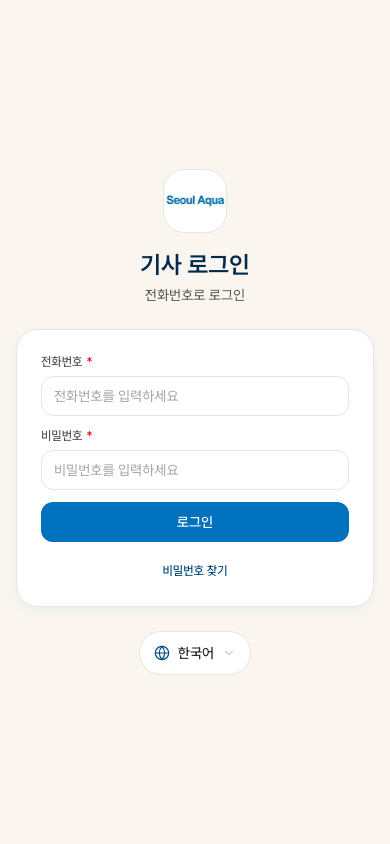
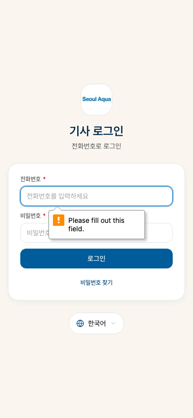
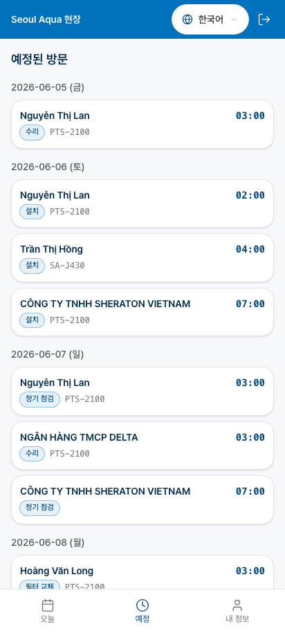
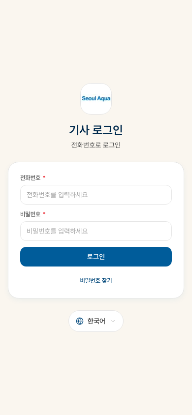

# Jake's Home Appliances SOMS — 현장 기사 매뉴얼

**대상 사용자**: 기사(TECHNICIAN) — 약 80명, 모바일 전용
**버전**: 2026-07-02 (다중 유형 방문·소모품 납품·협업 기사 반영)
**언어**: 한국어
**관련 문서**: [사무실 매뉴얼](./office.md) · [고객 포털 매뉴얼](./customer.md)

---

## 목차

- [1장. 시작하기](#1장-시작하기)
- [2장. 기사의 하루 (워크플로 개요)](#2장-기사의-하루-워크플로-개요)
- [3장. 로그인](#3장-로그인)
- [4장. "오늘" 화면 — 오늘 할 일](#4장-오늘-화면--오늘-할-일)
- [5장. "예정" 화면 — 앞으로 할 일](#5장-예정-화면--앞으로-할-일)
- [6장. 방문 상세 화면](#6장-방문-상세-화면)
- [7장. 방문 종류별 안내](#7장-방문-종류별-안내)
- [8장. 방문 시작 → 완료 흐름](#8장-방문-시작--완료-흐름)
- [9장. 사진 촬영과 업로드](#9장-사진-촬영과-업로드)
- [10장. 고객 서명 받기](#10장-고객-서명-받기)
- [11장. 결제 수금 (현장)](#11장-결제-수금-현장)
- [12장. 협업 기사 (공동 작업)](#12장-협업-기사-공동-작업)
- [13장. 소모품 납품 방문 처리](#13장-소모품-납품-방문-처리)
- [14장. 고객에게 전화하기](#14장-고객에게-전화하기)
- [15장. 부재·부품 없음·특수 상황](#15장-부재부품-없음특수-상황)
- [16장. 하루 마무리와 현금 인계](#16장-하루-마무리와-현금-인계)
- [17장. 프로필 관리](#17장-프로필-관리)
- [18장. 자주 마주치는 상황](#18장-자주-마주치는-상황)
- [부록 A. 방문 유형 빠른 참조](#부록-a-방문-유형-빠른-참조)

---

## 1장. 시작하기

### 1.1 어떤 기기가 필요한가요?

| 항목 | 권장 |
|---|---|
| OS | Android 8+ 또는 iPhone iOS 14+ |
| 화면 | 5~6인치 이상 |
| 카메라 | 800만 화소 이상 (필터 사진용) |
| 인터넷 | LTE/5G 또는 4G |

### 1.2 기사 앱 URL

핸드폰 Chrome 또는 Safari에서:

```
https://soms.jakeshomeappliances.com.vn/f/ko/login
```

> **앱 다운로드 없음.** 브라우저에서 바로 사용합니다. 자주 접속하려면 "**홈 화면에 바로가기 추가**"를 권장합니다 (브라우저 메뉴 → 홈 화면에 추가).

### 1.3 처음 받아야 할 것

관리자가 계정을 만들면 SMS 한 통이 옵니다:

```
Jake's Home Appliances 기사 계정이 생성되었습니다.
임시 비밀번호: ********
로그인: soms.jakeshomeappliances.com.vn/f/login
```

이 SMS는 본인만 보세요. 비밀번호는 절대 남에게 알려주지 마세요.

---

## 2장. 기사의 하루 (워크플로 개요)

```
아침 → 로그인 → 오늘 화면 확인
  → 1번 방문지 출발
  → 도착 → "시작" 마킹
  → 작업 항목 선택 (필터·부품)
  → 작업 전/후 사진
  → 고객 서명 (디지털 캡쳐)
  → 현금 수금 (해당 시)
  → "완료" 마킹
  → 다음 방문 반복
  → 퇴근 전 현금 확인
  → 로그아웃 (공용 기기 사용 시 반드시)
  → 다음 영업일 아침: 사무실 현금 인계
```

---

## 3장. 로그인



기사용 로그인 페이지는 `/f/ko/login`입니다.

| 항목 | 설명 |
|---|---|
| 전화번호 | 본인 휴대폰 번호 |
| 비밀번호 | 임시 비밀번호 또는 변경한 비밀번호 |

**첫 로그인**: 임시 비밀번호로 로그인하면 바로 비밀번호 변경 화면이 뜹니다. 8자 이상으로 설정하세요.

**비밀번호 분실**: 사무실에 연락하세요. 관리자가 새 임시 비밀번호를 SMS로 보내드립니다.

> 기사 계정으로 사무실 앱(`/o/login`)에 로그인하면 자동으로 기사 앱으로 안내됩니다.

---

## 4장. "오늘" 화면 — 오늘 할 일



로그인하면 오늘 배정된 방문 목록이 시간순으로 보입니다.

각 방문 카드에는:
- **고객명**과 주소
- **방문 유형** (설치·정기점검·소모품 납품 등)
- **예약 시간**
- **상태 뱃지** (예정·진행 중·완료)
- 다중 유형 방문이면 추가 유형도 표시됩니다 (예: 정기점검 + 소모품 납품)

**공동 작업 방문**: 내가 협업 기사로 참여하는 방문은 "**함께 작업 중**" 배지로 구분됩니다.

카드를 누르면 방문 상세로 이동합니다.

---

## 5장. "예정" 화면 — 앞으로 할 일



오늘 이후 예정된 방문을 날짜순으로 보여줍니다. 길 찾기를 미리 해두거나 부품을 준비할 때 활용하세요.

---

## 6장. 방문 상세 화면


방문 카드를 누르면 상세 화면이 열립니다.

### 상단 섹션 — 방문 요약

- 고객명·주소·방문 유형
- 예약 시간과 상태

### 고객 연락처 섹션

- 주 연락처 전화번호 (탭하면 전화 걸기)
- 고객에게 직접 전화하지 말고 사무실을 통하세요 ([14장](#14장-고객에게-전화하기) 참조)

### 장비 섹션

- 이번 방문에서 작업할 장비 목록
- 모델명·시리얼 번호·마지막 점검일

### 소모품 섹션 (소모품 납품 방문 시)

- 이번 방문에 연결된 주문(Order) 품목 목록
- 각 품목의 수량과 단가

### 작업 사항 섹션

- 필터 교체 항목 체크리스트
- 부품 교체 기록

### 사진 업로드 섹션

- 작업 전/후 사진 (최대 10장)

### 서명 섹션



- 손가락 또는 스타일러스로 고객이 직접 화면에 서명

### 하단 액션 바

- **시작** 버튼 → 도착 후 작업 시작 마킹
- **완료** 버튼 → 모든 작업 완료 후

---

## 7장. 방문 종류별 안내

### 7.1 설치 (INSTALLATION)

새 장비를 설치하는 방문입니다.

준비물:
- 장비 본체
- 설치 도구
- 계약서 + 장비 인수증 PDF (사무실에서 미리 인쇄해 줌)

고객이 확인 후 인수증에 서명을 받으세요.

### 7.2 정기점검 (PERIODIC_INSPECTION)

매달 또는 격월 방문입니다.

처리 순서:
1. 필터 상태 확인 → 교체가 필요한 필터 항목 체크
2. 작업 전/후 사진 촬영
3. 고객 서명 받기
4. 현금 수금 (임대료 또는 필터 요금)

### 7.3 소모품 납품 (CONSUMABLE_DELIVERY)

소모품(필터팩·부품 등)을 고객에게 납품하는 방문입니다. 정기점검과 동시에 진행되는 경우도 있습니다.

처리 순서:
1. 방문 상세의 "**소모품**" 섹션에서 품목 확인
2. 실제 납품한 품목과 수량 확인
3. 수량 이상 없으면 고객 서명 받기
4. 금액 수금 (현금 또는 이후 송금)

> 소모품 납품 서류는 고객 유형에 따라 자동 선택됩니다: B2C → 판매 영수증, B2B → 출고서(Mẫu 02-VT). 사무실에서 미리 인쇄해 줍니다.

### 7.4 수리 (REPAIR)

고장 신고 또는 사무실 지시로 진행합니다. 부품이 필요하면 사무실에 미리 확인하세요.

### 7.5 필터 교체 (FILTER_REPLACEMENT)

정기점검과 별도로 필터만 교체하는 방문입니다. 작업 후 교체 사진을 반드시 촬영하세요.

### 7.6 회수 (RETRIEVAL)

임대 종료 후 장비를 회수하는 방문입니다.

- 장비를 깨끗하게 포장해서 가져옵니다
- 사무실에 반납 후 입고 처리

---

## 8장. 방문 시작 → 완료 흐름


1. **도착**: 고객 집/사무실 도착 후 방문 카드 열기
2. **"시작" 버튼 탭**: 도착 시간이 기록됩니다
3. **작업 항목 체크**: 교체한 필터·부품 항목 체크
4. **사진 촬영**: 작업 전·후 사진 업로드 ([9장](#9장-사진-촬영과-업로드) 참조)
5. **고객 서명**: 화면에 손가락으로 서명 받기 ([10장](#10장-고객-서명-받기) 참조)
6. **결제 수금**: 현금이면 금액 입력 ([11장](#11장-결제-수금-현장) 참조)
7. **"완료" 버튼 탭**: 방문 완료 처리
   - 사무실에 자동 알림
   - 고객에게 작업확인서 이메일 자동 발송

> **완료 후에는 수정 불가**. 내용 오류가 있으면 즉시 사무실에 연락하세요.

---

## 9장. 사진 촬영과 업로드

방문 상세 → "**사진 업로드**" 섹션

### 찍어야 할 사진

| 필수 | 내용 |
|---|---|
| 작업 전 | 필터 또는 장비 상태 (교체 전) |
| 작업 후 | 새 필터 또는 설치 완료 상태 |

필요에 따라 추가:
- 이상 부품 클로즈업 (수리 방문 시)
- 설치 환경 전경 (첫 설치 시)

### 업로드 방법

1. "**사진 추가**" 버튼 탭
2. "**카메라로 촬영**" 또는 "**갤러리에서 선택**"
3. 선택 → 자동 업로드 (인터넷 필요)

> 사진이 흐리거나 너무 어두우면 다시 찍으세요. 사무실에서 서류 처리할 때 사진 품질이 중요합니다.

---

## 10장. 고객 서명 받기

방문 상세 → 아래로 스크롤 → "**서명**" 섹션


1. 화면을 고객에게 보여줍니다
2. "**여기에 서명해주세요**" 안내
3. 고객이 손가락으로 서명
4. "**확인**" 버튼 탭

> 서명은 한 번 저장하면 변경할 수 없습니다. 잘못됐으면 "**지우기**" 후 다시 받으세요.

**고객이 서명을 거부하는 경우**: 메모에 사유를 적고 "**서명 없이 진행**"을 선택하세요. 사무실에 보고해야 합니다.

---

## 11장. 결제 수금 (현장)

### 11.1 현금 수금

방문 완료 단계에서:

1. "**현금 수금**" 항목 탭
2. 금액 입력 (키보드로 숫자 입력)
3. 확인 → 저장

> 영수증은 사무실에서 고객에게 이메일로 자동 발송합니다. 별도 종이 영수증은 사무실이 지참 서류로 준비해 준 것을 사용하세요.

### 11.2 송금 안내

고객이 "나중에 송금할게요"라고 하면:
- 금액 입력 없이 "**나중에 송금**" 선택
- 사무실이 입금 확인 후 매칭합니다

### 11.3 하루 수금 현황 확인

오늘 내가 받은 현금 합계를 확인하려면:
- 프로필 화면 → "**오늘 수금**" 섹션

---

## 12장. 협업 기사 (공동 작업)

큰 현장(B2B 대규모 사이트, 다수 장비 동시 설치 등)에서 두 명 이상의 기사가 함께 작업하는 경우입니다.

### 역할 구분

| 역할 | 권한 |
|---|---|
| **주관 기사 (Lead)** | 방문 시작·완료, 결제 수금, 서명 수령 |
| **협업 기사 (Collaborator)** | 방문 보기·메모·사진 업로드 가능. 완료 마킹 및 수금 불가 |

### 협업 기사로 참여 시

- 오늘 화면에서 "**함께 작업 중**" 배지가 붙은 방문이 보입니다
- 방문 상세에서 메모와 사진을 추가할 수 있습니다
- 완료·수금은 주관 기사가 합니다

---

## 13장. 소모품 납품 방문 처리

방문 카드에 "소모품 납품" 유형이 표시된 경우:

1. 방문 상세에서 "**소모품**" 섹션 확인 → 품목과 수량 확인
2. 실제 물건과 일치하는지 현장에서 재확인
3. 고객이 확인 후 서명 받기
4. 해당 고객이 B2C라면 판매 영수증 종이 전달 (사무실 지참 서류에 포함)
5. B2B라면 출고서(Mẫu 02-VT) 종이 전달 → 고객 서명·날인 받아 사무실에 반납

> 수량 차이가 있으면 **방문 완료 전에** 사무실에 연락하세요. 완료 후에는 수정이 어렵습니다.

---

## 14장. 고객에게 전화하기

**정책**: 기사는 고객의 개인 전화번호를 직접 보지 않습니다. 방문 상세에 고객 번호가 표시되지 않습니다.

**이유**: 고객 개인정보 보호 + 사무실을 통한 일정 관리 일원화.

**고객에게 연락이 필요하면**:
1. 사무실에 전화 → "OO고객에게 방문 안내 전화 부탁드립니다"
2. 또는 방문 상세의 **메모에 요청 사항 기록** → 사무실이 확인

**긴급 상황** (고객 부재로 방문 불가 등):
- 방문 상세 → "**부재 처리**" 버튼
- 사무실이 자동 알림을 받아 고객에게 연락합니다

---

## 15장. 부재·부품 없음·특수 상황

### 15.1 고객 부재

1. 도착해도 아무도 없으면:
   - 방문 상세 → "**부재 처리**" 버튼
   - 사무실이 고객에게 연락 후 일정 재조정
2. 방문 카드가 `CUSTOMER_NO_SHOW` 상태로 변경됩니다

### 15.2 부품이 없을 때

1. 현장에서 필요한 부품이 없음을 확인하면:
   - 방문 상세 → 메모에 "PP필터 재고 없음, 재방문 필요" 기록
   - "**재방문 필요**" 버튼 선택
2. 사무실에서 부품을 준비해 새 방문을 예약해 줍니다

### 15.3 장비 이상 발견

- 방문 상세 메모에 상세히 기록
- 관련 사진 촬영 + 업로드
- 방문 완료 후 사무실에 전화로 보고

### 15.4 인터넷이 안 될 때

기본적으로 인터넷이 있어야 작동합니다. 인터넷 없을 때:
- 가능하면 Wi-Fi 지역으로 이동 또는 모바일 데이터 ON
- 급하면 사무실에 전화로 작업 내용 구두 보고
- 인터넷 복구 후 방문 상세를 열어 사진·메모·서명 입력

---

## 16장. 하루 마무리와 현금 인계

### 16.1 하루 마무리 체크리스트

퇴근 전:
- 오늘 화면에서 모든 방문이 "완료" 또는 "부재 처리" 됐는지 확인
- 수금한 현금 총액 확인 (프로필 → 오늘 수금)
- 현금이 있으면 봉투에 넣고 영수증 사본과 함께 보관

### 16.2 공용 기기 사용 시

회사 공용 핸드폰이나 태블릿을 사용할 때는 반드시 **로그아웃**하세요.

1. 화면 우상단 메뉴 → "**로그아웃**"
2. 로그인 화면으로 돌아가는지 확인

### 16.3 현금 인계 (다음 영업일 아침)

사무실에 출근해서:
1. 어제 수금한 현금 봉투 + 영수증 사본 전달
2. 사무실 직원이 봉투 금액 확인 후 "**전체 받음**" 처리

> D+1까지 인계 안 하면 사무실 관리자에게 자동 알림이 갑니다.

---

## 17장. 프로필 관리

**하단 탭 → 프로필** (또는 `/f/ko/profile`)


- **내 이름·전화·역할** 확인
- **담당 지역 확인** (기사 배정 시 지역 매칭에 사용)
- **비밀번호 변경**:
  1. 프로필 → "비밀번호 변경"
  2. 현재 비밀번호 + 새 비밀번호 + 확인 입력
  3. 저장

---

## 18장. 자주 마주치는 상황

### 상황 1: 오늘 방문 화면에 방문이 안 보여요

- 날짜 확인: 혹시 "예정" 탭이 열려있지 않은지
- 사무실에 배정이 됐는지 확인
- 로그아웃 후 다시 로그인

### 상황 2: 사진 업로드가 안 돼요

- 인터넷(LTE/Wi-Fi) 연결 확인
- 핸드폰 카메라 권한 허용 확인 (설정 → 앱 → Jake's Home Appliances → 카메라 허용)
- 사진 용량이 너무 크면 해상도를 낮추거나 다른 각도로 다시 촬영

### 상황 3: 서명 화면이 안 뜨거나 먹통이에요

- 화면을 강제 새로고침 (아래로 당기기)
- 방문 상세를 닫고 다시 열기
- 브라우저를 완전히 닫고 재로그인

### 상황 4: 방문을 완료 처리했는데 잘못 눌렀어요

- 즉시 사무실에 연락하세요
- 완료된 방문은 기사가 직접 수정할 수 없습니다. 사무실에서 조정해야 합니다.

### 상황 5: 현금을 잘못 입력했어요

- 완료 처리 전이라면: 수금 금액 항목을 다시 탭해서 수정
- 완료 처리 후라면: 즉시 사무실에 연락. 사무실 직원이 결제 기록을 조정합니다.

---

## 부록 A. 방문 유형 빠른 참조

| 유형 | 한국어 | 준비물 | 서류 (B2C) | 서류 (B2B) |
|---|---|---|---|---|
| INSTALLATION | 설치 | 장비·설치 도구 | 장비 인수증 | 출고서 |
| PERIODIC_INSPECTION | 정기점검 | 필터·공구 | 정기점검표 | 정기점검 확인서 |
| CONSUMABLE_DELIVERY | 소모품 납품 | 납품 소모품 | 판매 영수증 | 출고서 |
| REPAIR | 수리 | 부품·공구 | 작업확인서 | 작업확인서 |
| FILTER_REPLACEMENT | 필터 교체 | 필터 | 작업확인서 | 작업확인서 |
| RELOCATION | 이전 설치 | 장비·설치 도구 | 작업확인서 | 작업확인서 |
| PAYMENT_COLLECTION | 수금 | 영수증 | 작업확인서 | 작업확인서 |
| RETRIEVAL | 회수 | 포장재 | 작업확인서 | 출고서 |

> 서류는 사무실에서 미리 인쇄해 줍니다. 현장에서 PDF 파일을 직접 출력하지 않아도 됩니다.
