# Seoul Aqua SOMS — 사무실 직원 매뉴얼 (Office Manual)

**대상 사용자**: 관리자(ADMIN), 매니저(MANAGER), 사무실 직원(STAFF)
**버전**: 2026-06-02
**언어**: 한국어
**관련 문서**: [현장 직원 매뉴얼](./field.md) · [고객 매뉴얼](./customer.md)

이 매뉴얼은 Seoul Aqua의 본사 사무실에서 SOMS를 사용하는 모든 직원을 위한 안내서입니다. **관리자 / 매니저 / 사무실 직원**의 권한 차이를 표시하면서 모든 화면과 모든 일상 업무를 다룹니다.

---

## 목차

- [1장. 시작하기](#1장-시작하기)
- [2장. 권한 — 누가 무엇을 할 수 있나요](#2장-권한--누가-무엇을-할-수-있나요)
- [3장. 사무실 직원의 하루 (워크플로 개요)](#3장-사무실-직원의-하루-워크플로-개요)
- [4장. 로그인과 첫 화면](#4장-로그인과-첫-화면)
- [5장. 손님(고객) 관리](#5장-손님고객-관리)
- [6장. 계약 관리](#6장-계약-관리)
- [7장. 방문 관리](#7장-방문-관리)
- [8장. 서비스 요청 처리](#8장-서비스-요청-처리)
- [9장. 결제 입력과 매칭](#9장-결제-입력과-매칭)
- [10장. 세금계산서 (B2B 전용)](#10장-세금계산서-b2b-전용)
- [11장. 보고서와 감사 기록](#11장-보고서와-감사-기록)
- [12장. 시스템 관리 (ADMIN 전용)](#12장-시스템-관리-admin-전용)
- [13장. 자주 마주치는 상황 모음](#13장-자주-마주치는-상황-모음)
- [14장. 보안 수칙](#14장-보안-수칙)
- [부록 A. 메뉴 빠른 찾기](#부록-a-메뉴-빠른-찾기)
- [부록 B. 알림 템플릿 일람](#부록-b-알림-템플릿-일람)
- [부록 C. 상태 용어 사전](#부록-c-상태-용어-사전)

---

## 1장. 시작하기

### 1.1 SOMS는 무엇인가요?

**SOMS(Service Operation Management System, 서비스 운영 관리 시스템)**는 Seoul Aqua가 사용하는 통합 업무 시스템입니다. 손님 등록부터 계약, 정수기 설치, 정기 점검, 결제 수금, 세금계산서 발행, 미수금 관리, 감사 기록까지 — 회사의 모든 일을 한 곳에서 처리합니다.

기존 종이 장부와 엑셀 파일을 대체하며, 다음과 같은 장점이 있습니다:

- **하나의 손님 = 하나의 화면**: 한 손님의 모든 장비, 계약, 결제 내역, 다음 점검일이 한 곳에 보입니다.
- **자동 알림**: 정기 점검 14일 전 이메일, 1일 전 SMS, 미수금 자동 escalation 등.
- **세 가지 언어**: 한국어/베트남어/영어 어느 거든 즉시 전환 가능합니다.
- **모바일 분리**: 사무실 화면은 컴퓨터 최적화, 기사 화면은 핸드폰 최적화 — 한 시스템 안에 둘 다 있습니다.

### 1.2 이 매뉴얼은 누구를 위한 것인가요?

| 역할 | 책임 | 이 매뉴얼에서 보아야 할 부분 |
|---|---|---|
| **ADMIN (관리자)** | 회사 대표·이사. 시스템 전체 책임자 | 전 장 + 12장 (시스템 관리) |
| **MANAGER (매니저)** | 영업·운영 책임자. 가격·세금계산서 권한 | 5~11장, 일부 12장(읽기) |
| **STAFF (사무실 직원)** | 일상 업무 처리 | 4~9장이 주력, 10~12장은 참조 |

각 화면 설명에 **권한이 필요한 동작은 빨간색 또는 표시**로 알려드립니다.

### 1.3 필요한 환경

- **인터넷이 되는 컴퓨터** (Chrome, Edge, Firefox, Safari 모두 가능)
- **본인의 휴대폰 번호** (로그인 ID)
- **임시 비밀번호** (관리자가 SMS로 보내드렸습니다)
- **본인 휴대폰** (SMS 인증 및 알림 수신용)

> **참고**: SOMS는 인터넷 브라우저에서 사용합니다. 별도 프로그램을 설치하지 않습니다.

---

## 2장. 권한 — 누가 무엇을 할 수 있나요

회사가 작아서 영업/회계/운영 부서가 따로 없습니다. 대신 **3 단계 직급** + **현장 직원**으로 구분합니다.

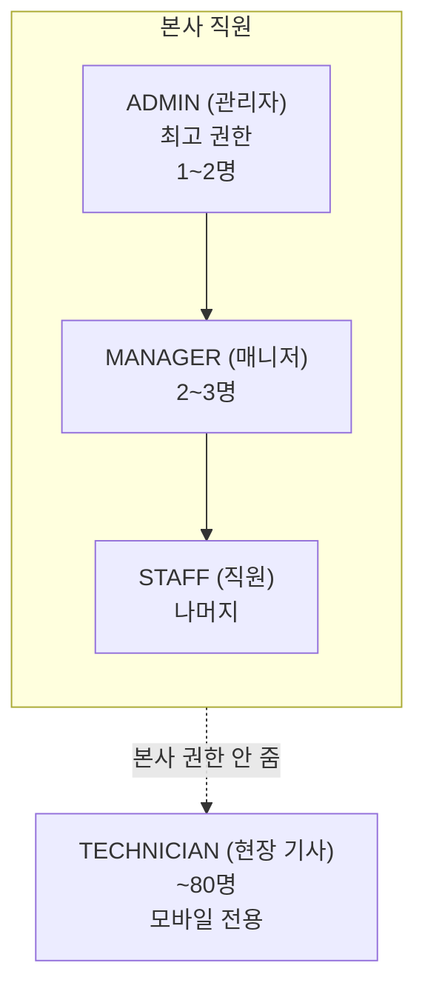
```mermaid
flowchart TB
  subgraph HQ["본사 직원"]
    direction TB
    A["ADMIN (관리자)<br/>최고 권한<br/>1~2명"]
    M["MANAGER (매니저)<br/>2~3명"]
    S["STAFF (직원)<br/>나머지"]
    A --> M --> S
  end
  T["TECHNICIAN (현장 기사)<br/>~80명<br/>모바일 전용"]

  HQ -.본사 권한 안 줌.-> T
```

### 2.1 전체 권한표

| 기능 | ADMIN | MANAGER | STAFF |
|---|:---:|:---:|:---:|
| **시스템 설정·사용자 추가** | ● | — | — |
| **감사 기록 CSV 내보내기** | ● | — | — |
| 감사 기록 화면 보기 | ● | ● | — |
| **가격 변경·계약서 수정** | ● | ● | — |
| **세금계산서 발행** | ● | ● | — |
| **고객 비밀번호 재설정** | ● | ● | — |
| 월마감 처리 | ● | ● | — |
| **유료 서비스 요청 승인** | ● | ● | ● |
| 손님·계약·장비 등록·편집 | ● | ● | ● |
| 방문 일정 만들기·변경 | ● | ● | ● |
| 결제 입력·송금 매칭 | ● | ● | ● |
| 영업 메뉴 보기 | ● | ● | ● |
| 회계 메뉴 보기 | ● | ● | ● |
| 보고서 보기 | ● | ● | ● |

> **메모**: STAFF도 회계 메뉴와 영업 메뉴를 다 볼 수 있습니다. 다만 **금액을 바꾸거나 세금계산서를 발행**하는 등 책임이 큰 작업은 MANAGER 이상에서만 가능합니다. 부서별 권한 분리는 하지 않았습니다.

### 2.2 권한 부족 시 화면

권한이 없는 메뉴를 클릭하면 다음 중 하나가 보입니다:

- **메뉴 자체가 안 보임** — STAFF에게는 사이드바에서 "시스템 관리" 메뉴가 가려져 있습니다.
- **버튼이 회색** — 화면에는 들어갈 수 있지만 "발행" 버튼 같은 게 비활성화되어 있습니다.
- **권한 부족 메시지** — "이 작업은 MANAGER 이상이 필요합니다" 같은 알림이 뜹니다.

---

## 3장. 사무실 직원의 하루 (워크플로 개요)

본격적인 화면 설명에 들어가기 전에, **하루 동안의 흐름**을 먼저 봐주세요. 어떤 일이 언제 일어나는지 미리 알면 화면을 보고 헷갈리지 않습니다.

### 3.1 한눈에 보기

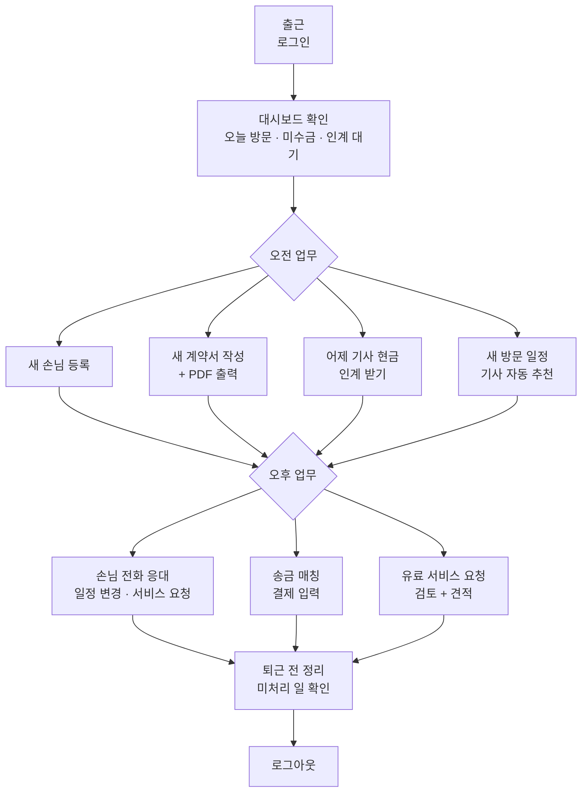
```mermaid
flowchart TB
  A[출근<br/>로그인] --> B[대시보드 확인<br/>오늘 방문 · 미수금 · 인계 대기]
  B --> C{오전 업무}
  C --> D[새 손님 등록]
  C --> E[새 계약서 작성<br/>+ PDF 출력]
  C --> F[어제 기사 현금<br/>인계 받기]
  C --> G[새 방문 일정<br/>기사 자동 추천]

  D --> H{오후 업무}
  E --> H
  F --> H
  G --> H

  H --> I[손님 전화 응대<br/>일정 변경 · 서비스 요청]
  H --> J[송금 매칭<br/>결제 입력]
  H --> K[유료 서비스 요청<br/>검토 + 견적]

  I --> L[퇴근 전 정리<br/>미처리 일 확인]
  J --> L
  K --> L
  L --> M[로그아웃]
```

### 3.2 주요 단계별 소요 시간 가이드

| 작업 | 평균 소요 |
|---|---|
| 손님 한 명 검색 | 5초 이하 |
| 새 손님 등록 (B2C) | 1~2분 |
| 새 손님 등록 (B2B, Site 포함) | 3~5분 |
| 새 계약 작성 + PDF 출력 | 5분 |
| 송금 매칭 1건 | 30초 |
| 기사 현금 인계 받기 (1명, 5~10건) | 3~5분 |
| 유료 서비스 요청 검토 + 견적 | 2~5분 |
| 세금계산서 업로드 (외부 발행 후) | 1분 |

### 3.3 자동 처리되는 일 — 직원이 신경 안 써도 됨

| 자동 처리 | 언제 |
|---|---|
| 새 손님에게 임시 비밀번호 SMS 발송 | 손님 등록 직후 |
| 새 계약자에게 환영 SMS | 계약 활성화 후 |
| 정기 점검 D-14 이메일 | 매일 새벽 03:00 자동 |
| 정기 점검 D-1 SMS | 매일 새벽 03:00 자동 |
| 미수금 D+7 이메일 | 매일 새벽 03:00 자동 |
| 미수금 D+30 SMS | 매일 새벽 03:00 자동 |
| 임대 만료 D-60/30 이메일 | 매일 새벽 03:00 자동 |
| 영수증 자동 이메일 | 결제 입력 직후 |
| 작업확인서 자동 이메일 | 기사가 방문 완료 직후 |
| 기사 현금 D+1 미인계 알림 (ADMIN에게) | 다음 영업일 자동 |

---

## 4장. 로그인과 첫 화면

### 4.1 로그인 화면

본사 직원용 로그인 페이지는 **`soms.seoulaqua.com.vn/o/login`** 입니다 (실제 도메인은 회사가 알려드립니다).

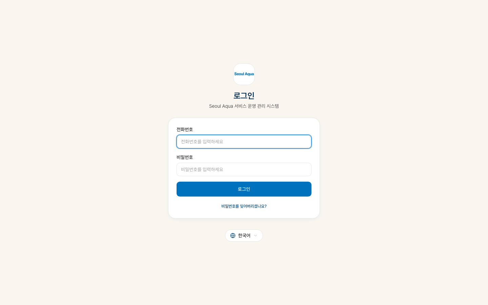

| 입력란 | 설명 |
|---|---|
| **전화번호 또는 사용자명** | 본인 휴대폰 번호 (예: `0901234567`) 또는 ADMIN이 부여한 사용자명 (예: `admin`, `manager`) |
| **비밀번호** | 본인 비밀번호 |
| 로그인 버튼 | 클릭하면 메인 화면(대시보드)으로 이동 |

**중요한 보안 동작**:

- **3회 연속 실패** 시 계정이 1시간 자동 잠금됩니다.
- 같은 사용자명이 두 명 이상 있으면 **로그인 자체가 거부**됩니다 (보안 정책). 이 경우 휴대폰 번호로 로그인하세요.
- 현장 기사 계정으로 사무실 로그인을 시도하면 자동으로 **현장 로그인 페이지(`/f/login`)로 안내**합니다.

### 4.2 첫 로그인 시 비밀번호 변경

ADMIN이 새 계정을 만들면 **임시 비밀번호**가 SMS로 옵니다. 첫 로그인 직후 강제로 비밀번호 변경 화면이 뜹니다.

**비밀번호 규칙**:

- 8자 이상
- 영문 + 숫자 조합 권장 (강제는 아님)
- 같은 비밀번호를 다른 사람과 공유 금지

> **잊으셨다면**: ADMIN 또는 MANAGER에게 부탁하세요. 새 임시 비밀번호가 SMS로 다시 옵니다.

### 4.3 대시보드 (메인 화면)

로그인하면 가장 먼저 보이는 화면입니다. 오늘 처리해야 할 일들이 한눈에 보입니다.

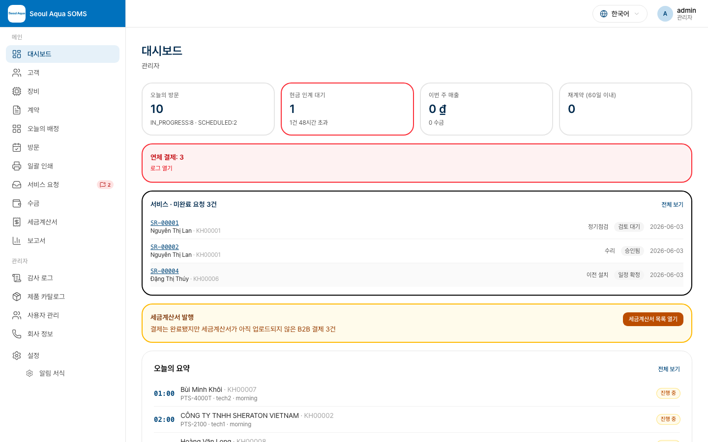

**화면 구성**:

| 영역 | 보이는 내용 |
|---|---|
| **상단 인사말** | 본인 이름과 직급 |
| **오늘 방문** | 오늘 예정된 방문 개수 + 진행 중 / 완료 비율 |
| **검토 대기 서비스 요청** | 손님이 보낸 유료 요청 중 검토 안 한 것 |
| **미수금 알림** | D+7, D+14, D+30 단계별 손님 명단 |
| **인계 대기 현금** | 어제 기사가 받아온 현금 중 사무실 인계 안 한 것 |
| **이번 달 매출 요약** | 신규 계약·결제 수금 합계 (MANAGER+ 만 보임) |
| **알림 벨** | 시스템이 보낸 알림 (새 서비스 요청 등) |

각 카드를 클릭하면 해당 화면으로 바로 이동합니다.

### 4.4 사이드바 메뉴

화면 왼쪽 사이드바에 메뉴가 있습니다. 본인 권한에 따라 일부 메뉴가 숨겨집니다.

```
┌─ 대시보드
├─ 손님
├─ 계약
├─ 장비
├─ 방문
├─ 오늘의 배정       ← Phase 6 신설 (LayoutGrid 아이콘)
├─ 일괄 인쇄         ← Phase 6 신설 (Printer 아이콘)
├─ 서비스 요청
├─ 결제
├─ 세금계산서        (MANAGER+)
├─ 보고서
│   ├─ 매출
│   ├─ 미수금
│   ├─ 기사 생산성
│   └─ 감사 기록     (MANAGER+)
└─ 시스템 관리       (ADMIN)
    ├─ 사용자
    ├─ 제품 카탈로그
    └─ 스케줄러 가중치
```

> 📋 **"오늘의 배정"** 과 **"일괄 인쇄"** 는 Phase 6 (2026-06-03 머지) 에서 추가된 방문 관리 보조 메뉴입니다. 자세한 사용법은 7.8장 / 7.10장 참고. ADMIN / MANAGER / STAFF 모두에게 보입니다 (TECHNICIAN 은 별도 모바일 화면).

### 4.5 언어 전환

화면 오른쪽 상단의 **언어 선택 버튼**으로 한국어(KO) / 베트남어(VI) / 영어(EN)를 즉시 바꿀 수 있습니다. 작업 중인 화면은 그대로 유지되고 텍스트만 바뀝니다.

---

## 5장. 손님(고객) 관리

### 5.1 손님 목록 화면

**왼쪽 메뉴 → "손님" 클릭**

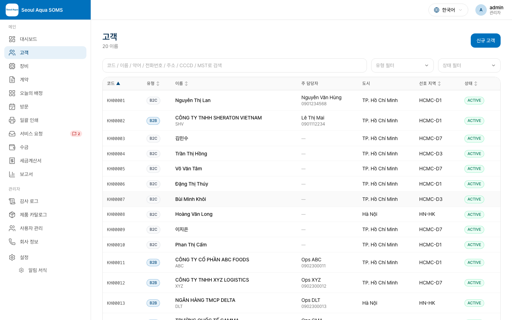

화면 구성:

- **검색창**: 이름·전화번호·코드(KH0001 등) 어느 거든 입력 가능
- **필터**: 유형(B2C/B2B), 도시, 활성 여부 등
- **새 손님** 버튼 (우측 상단)
- **CSV 내보내기** 버튼 (검색 결과를 엑셀로 다운로드)
- **목록**: 코드, 이름, 유형, 전화, 도시, 등록일

각 손님 줄을 클릭하면 상세 페이지로 들어갑니다.

### 5.2 새 손님 등록 — B2C (가정집)

**손님 목록 → "새 손님" 버튼**

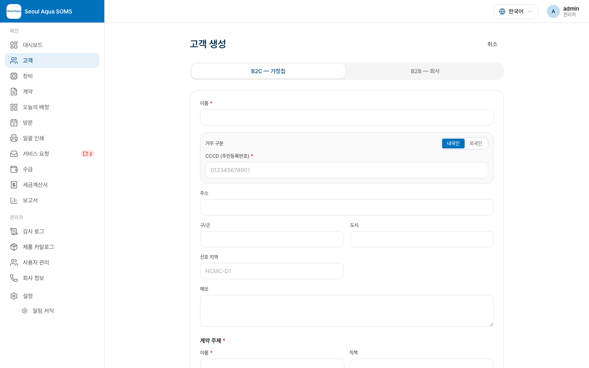

#### 단계 1: 유형 선택

화면 상단에서 **B2C (가정집)** 또는 **B2B (회사)** 를 선택합니다. B2C를 고르면 다음 항목들이 보입니다.

#### 단계 2: 필수 입력

| 항목 | 설명 | 예시 |
|---|---|---|
| **이름** | 손님 성함 | `Nguyễn Văn A` 또는 `김철수` |
| **전화번호** | 주 연락처 (휴대폰) — 이름 바로 밑 | `0901234567` |

> **2026-06-22 변경:** CCCD·여권번호·운영담당자·법적 대표자명(B2B)이 모두 **선택 입력**으로 바뀌었습니다. B2C는 **계약 주체 섹션이 사라지고 손님 본인이 곧 계약 주체**입니다 — 입력한 이름·전화번호·이메일·언어가 그대로 계약 주체 정보로 들어갑니다.

#### 단계 3: 주소 입력 — Shopee 방식 캐스케이딩

주소는 4단계로 입력합니다(Shopee VN과 동일).

1. **성/시 (Tỉnh/Thành phố)** — 드롭다운에서 선택. 예: `Thành phố Hồ Chí Minh`
2. **군/구 (Quận/Huyện)** — 위 성/시를 고르면 활성화. 예: `Quận 1`
3. **동/꼬뮌 (Phường/Xã)** — 위 군/구를 고르면 활성화. 예: `Phường Bến Nghé`
4. **상세 주소** — 번지·건물·층. 예: `123 Lê Lợi`

> 목록에 없는 지역이면 검색창에 직접 타이핑 후 **"\"입력값\""** 옵션을 눌러 자유 입력할 수 있습니다.

#### 단계 4: 선택 입력 (권장)

| 항목 | 설명 |
|---|---|
| **CCCD / 여권번호** | 거주구분에 따라 — 계약 발행 시점에 받아도 OK |
| **발급일 · 발급처** | CCCD/여권의 발급일·발급처 (계약서 표기용) |
| **전화번호 2** | 보조 연락처 |
| **이메일** | 영수증·작업확인서 발송용 |
| **운영담당자(OPS)** | 방문 알림·일정 확정 수신자 (없어도 등록 가능) |
| **선호 지역** | 정기점검 기사 배정 시 우선순위 (예: `HCMC-D1`) |
| **선호 기사** | 손님이 특정 기사를 지명한 경우 |
| **메모** | 특이사항 (출입 코드, 키오스크 위치, 알레르기 등) |

#### 단계 4: 포털 자동 활성화

기본적으로 **포털 자동 활성화**가 켜져 있습니다. 저장하는 순간:

1. 시스템이 손님 코드(`KH00001` 같은 5자리)를 자동 발급합니다.
2. 손님의 휴대폰으로 **임시 비밀번호 SMS**가 발송됩니다.
3. 손님이 `seoulaqua.com.vn/login`에서 첫 로그인 → 새 비밀번호 설정 → 사용 시작합니다.

저장 후 손님 상세 페이지로 이동합니다.

### 5.3 새 손님 등록 — B2B (회사)

**손님 목록 → "새 손님" 버튼 → B2B 선택**

B2C와 다른 점은:

| 항목 | 차이 |
|---|---|
| **이름** | 사람 이름이 아니라 **회사명** (예: `CÔNG TY TNHH SHV`) |
| **세금코드 (taxCode)** | 베트남 사업자 등록번호 **필수** (예: `0301234567`) |
| **약어 (shortcode)** | 2~5자 영문 약어 (예: `SHV`) — 계약서 번호에 사용됨 |

> **2026-06-22 변경:** B2B의 **법적 대표자명** 입력란이 제거되었습니다. 계약서 서명자는 **계약 주체(CONTRACT_PARTY)** 담당자가 그 역할을 합니다. **운영담당자 0명도 허용**되어 1회성 단발 판매도 등록 가능합니다.

#### Site (사업장) 추가 — B2B 전용

B2B 손님이 여러 공장이나 빌딩을 가진 경우, **각 사업장을 Site로 등록**합니다.

손님 저장 후 손님 상세 페이지에서:

1. "**Site**" 탭 클릭
2. "**새 Site**" 버튼
3. 입력:
   - **Site명**: `본사`, `공장 A`, `R&D Building` 등
   - **주소 (전체)**: 사업장 주소
   - **지역**: 지역 코드 (선택)
   - **전화**: 사업장 접수 전화 (선택)
4. 저장 → 다음 Site 추가 (필요한 만큼)

> **B2C는 Site가 필요 없어요.** 가정집은 한 군데만 있으므로 손님의 메인 주소가 곧 설치 주소입니다.

### 5.4 손님 상세 페이지

손님을 클릭하면 모든 정보가 탭으로 정리된 화면이 보입니다.

탭 구성:

| 탭 | 내용 |
|---|---|
| **기본 정보** | 이름, 전화, 주소, 메모 등 (편집 가능) |
| **담당자** | 계약 당사자 + 일상 담당자 (1+N) 목록 |
| **Site** (B2B만) | 사업장 목록 |
| **장비** | 손님이 사용 중인 모든 정수기/공기청정기 등 |
| **계약** | 손님과 맺은 모든 계약 (활성·종료 포함) |
| **방문 기록** | 이 손님 방문한 모든 기록 |
| **결제 내역** | 모든 결제 (대기·완료·미수금) |
| **서비스 요청** | 손님이 보낸 모든 요청 |

### 5.5 담당자 추가 — Contract Party + Ops Contact

손님 상세 → "담당자" 탭

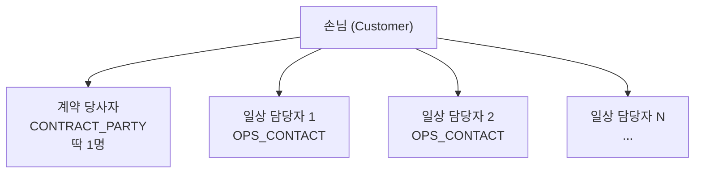
```mermaid
flowchart TB
  Customer["손님 (Customer)"]
  Customer --> CP["계약 당사자<br/>CONTRACT_PARTY<br/>딱 1명"]
  Customer --> OPS1["일상 담당자 1<br/>OPS_CONTACT"]
  Customer --> OPS2["일상 담당자 2<br/>OPS_CONTACT"]
  Customer --> OPSn["일상 담당자 N<br/>..."]
```

**계약 당사자(CONTRACT_PARTY)** 는 손님 등록 시 자동으로 1명 만들어집니다. 변경하려면 MANAGER 이상 권한이 필요합니다.

**일상 담당자(OPS_CONTACT)** 는 손님이 원할 때 추가합니다:

- B2B 회사가 여러 부서를 가진 경우 (HR 담당, 시설 담당, 구매 담당 등)
- B2C 가정집에서 가장 외에 배우자가 일정을 잡는 경우

#### 일상 담당자 추가 단계

1. 손님 상세 → 담당자 탭 → "**새 담당자**" 버튼
2. 입력:
   - **이름·직책**: `김 과장 (시설관리)`
   - **전화번호**: 본인 직통 (예: `0987654321`)
   - **이메일**: 선택
   - **언어**: `KO` / `VI` / `EN` 중 본인 모국어
   - **scope**: `CUSTOMER` (조직 전체) 또는 `SITE` (특정 사업장 전용)
   - **siteId**: scope=SITE인 경우 어떤 Site 담당인지 선택
   - **포털 활성화**: 기본 ON (포털 로그인을 줄지 여부)
3. 저장 → 임시 비밀번호 SMS가 새 담당자에게 자동 발송됨

#### 담당자별 알림 라우팅 규칙

| 알림 종류 | 누구에게 |
|---|---|
| 계약서, 세금계산서, 법적 통보 | **계약 당사자**에게만 |
| 정기 점검 일정 SMS, 영수증 | **일상 담당자(주)** 에게, 없으면 계약 당사자 |
| 미수금 독촉 | 계약 당사자 + **모든 일상 담당자** CC |
| 모바일에서 "손님께 전화" | 일상 담당자(주) 우선, 없으면 계약 당사자 |

각 담당자의 **언어 설정에 따라 알림 본문 언어가 결정**됩니다.

### 5.6 손님 정보 편집

손님 상세 → "기본 정보" 탭 → "**편집**" 버튼

편집 가능 항목:

- 이름, 전화, 이메일, 주소, 도시, 지역, 메모 — 전 권한
- **세금코드, 회사명** — MANAGER 이상 (B2B는 법적 영향 있음)
- **계약 당사자 변경** — MANAGER 이상 (계약서 재서명이 필요할 수 있음)

저장하면 자동으로 **감사 기록(Audit Log)** 에 변경 전/후가 기록됩니다.

### 5.7 손님 비활성화·재활성화

손님이 영업 정지·폐업·이사 등으로 더 이상 거래하지 않는 경우:

**비활성화 (MANAGER 이상)**:

1. 손님 상세 → "기본 정보" 탭 → "**비활성화**" 버튼
2. 사유 입력 (예: "폐업", "장기 출국", "계약 종료")
3. 확인 → 손님의 모든 활성 장비가 자동으로 `DEACTIVATED` 상태로 바뀜
4. 그 후 손님 목록에서 검색되지만 새 계약 작성은 막힘

**재활성화 (ADMIN 만)**:

비활성화된 손님을 다시 활성화하려면 ADMIN 권한이 필요합니다. 이중 안전장치입니다.

> **삭제는 절대 불가능**. 모든 데이터는 24개월 보존이 법적 요구사항입니다.

---

## 6장. 계약 관리

### 6.1 계약 종류

| 종류 | 한국어 | 베트남어 | 설명 |
|---|---|---|---|
| **SALE** | 판매 | Bán | 한 번에 다 내고 손님 소유 |
| **RENTAL** | 임대 | Thuê | 36개월 빌려주기, 매달 청구, 만료 시 손님 소유 전환 |
| **MAINTENANCE** | 유지관리 | Bảo trì | 점검만 — 장비는 이미 손님 소유 |

### 6.2 계약 목록 화면

**왼쪽 메뉴 → "계약" 클릭**

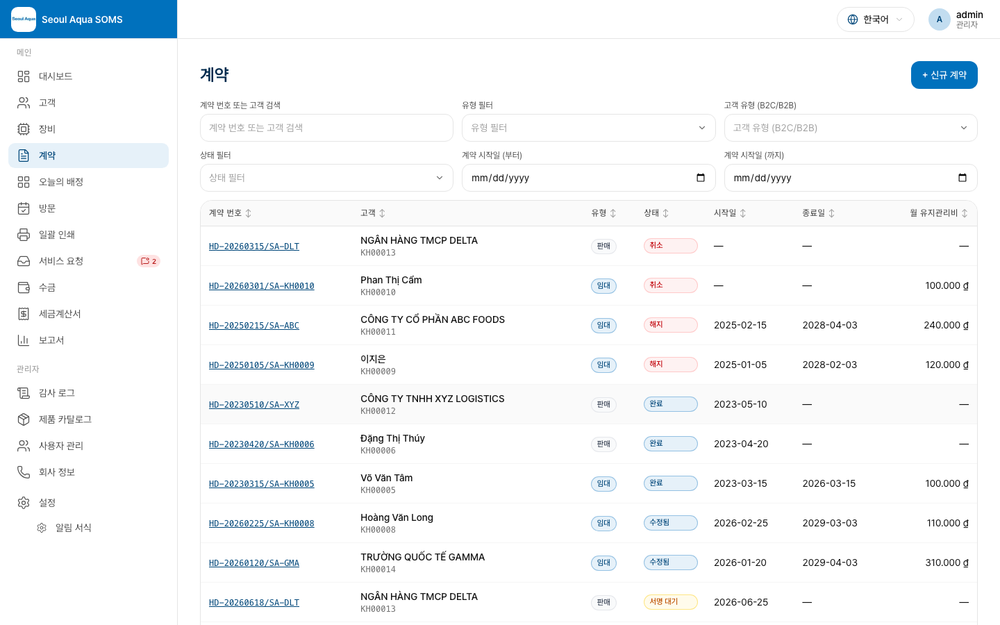

화면 구성:

- **탭**: 활성 / 초안 / 만료 / 전체
- **필터**: 손님 유형(B2C/B2B), 계약 종류(SALE/RENTAL/MAINTENANCE), 상태
- **검색**: 계약 번호(`HD-...`), 손님 이름, 코드
- **새 계약** 버튼

각 줄 클릭 시 계약 상세 페이지로.

### 6.3 새 계약 작성

**계약 목록 → "새 계약" 버튼**

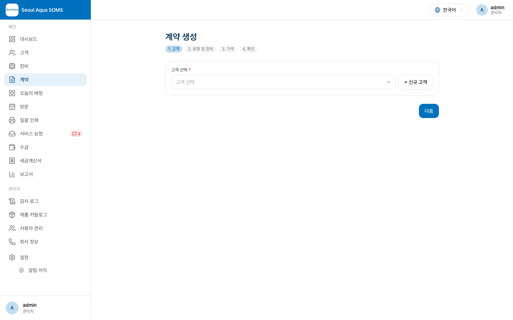

#### 단계 1: 손님 선택

드롭다운에서 손님을 검색. 새 손님이면 먼저 5.2/5.3 절을 따라 등록한 후 돌아오세요.

#### 단계 2: 계약 종류 선택

`SALE` / `RENTAL` / `MAINTENANCE` 중 하나 선택.

선택에 따라 다른 입력이 보입니다:

**SALE 선택 시**:
- 총 판매가 (VND)
- 결제 방법 (한 번에 / 분할)

**RENTAL 선택 시**:
- 월 임대료 (VND)
- 계약 기간 (기본 36개월)
- 의무 기간 (기본 24개월) — 조기 종료 시 위약금 기준
- 시작일

**MAINTENANCE 선택 시**:
- 월 관리비
- 계약 기간 (기본 12개월, 갱신 가능)
- 시작일

#### 단계 3: 장비 선택

"**장비 추가**" 버튼 → 손님의 기존 장비 중 선택 또는 새 장비 추가:

- **새 장비 추가**: 모델 카탈로그에서 선택 (Brand → Model)
- **수량**: 같은 모델 여러 대 가능
- **단가**: 모델에 따라 자동, 협상 시 수동 조정 가능 (MANAGER+ 만)

#### 단계 4: 계약서 번호 자동 발급

저장 직후 계약서 번호가 자동 생성됩니다:

- **B2C**: `HD-YYYYmmDD/SA-KH####` (예: `HD-20260602/SA-KH00001`)
- **B2B**: `HD-YYYYmmDD/SA-{shortcode}` (예: `HD-20260602/SA-SHV`)

이 번호는 계약서 PDF에 박힙니다.

#### 단계 5: 계약서 PDF 생성

저장 후 계약 상세 페이지에서 "**PDF 생성**" 버튼:

- 자동으로 **이중 언어 PDF** 생성됩니다 (베트남어 좌측, 한국어/영어 우측)
- "Party A (Bên A)" = Seoul Aqua, "Party B (Bên B)" = 손님
- 손님이 서명할 칸이 표시됨

PDF 출력 후 손님에게 종이 또는 PDF 전달.

#### 단계 6: 서명받고 활성화

손님 서명 받은 후:

1. 계약 상세 → "**계약서 활성화**" 버튼
2. 서명자 이름 입력
3. 서명한 종이를 사진 촬영해서 업로드 (E.1 정책)
4. 저장 → 계약 상태가 **DRAFT → ACTIVE** 로 자동 전환
5. **설치 방문**이 자동으로 생성됨 (시작일에 맞춰)

### 6.4 계약 상세 페이지

계약 한 건을 클릭하면 모든 정보가 보입니다:

- 계약 번호, 종류, 상태 (상단)
- 손님 정보 (링크)
- 장비 목록 (각 장비 시리얼 번호, 설치일, 상태)
- 결제 내역 (월별 청구 + 수금)
- 방문 기록 (이 계약과 관련된 모든 방문)
- 첨부 PDF (계약서, 작업확인서 등)

### 6.5 계약 상태 머신

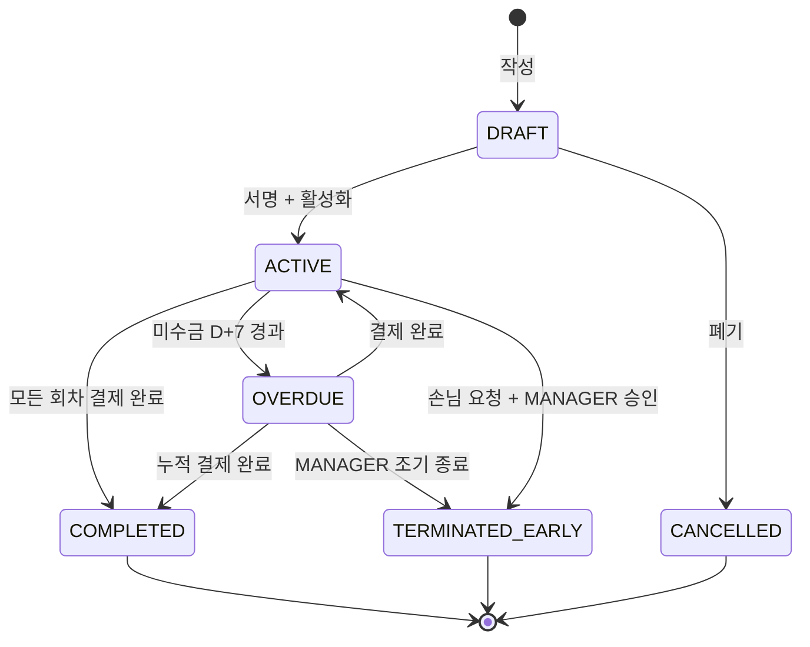
```mermaid
stateDiagram-v2
  [*] --> DRAFT: 작성
  DRAFT --> ACTIVE: 서명 + 활성화
  DRAFT --> CANCELLED: 폐기

  ACTIVE --> OVERDUE: 미수금 D+7 경과
  OVERDUE --> ACTIVE: 결제 완료
  OVERDUE --> TERMINATED_EARLY: MANAGER 조기 종료

  ACTIVE --> COMPLETED: 모든 회차 결제 완료
  OVERDUE --> COMPLETED: 누적 결제 완료
  ACTIVE --> TERMINATED_EARLY: 손님 요청 + MANAGER 승인

  COMPLETED --> [*]
  TERMINATED_EARLY --> [*]
  CANCELLED --> [*]
```

**COMPLETED 전환 시 자동 처리**:
- RENTAL 장비는 자동으로 **소유권이 손님으로 이전**됩니다 (B.3 정책).
- 손님과 계약 당사자에게 **종료 이메일** 자동 발송.

### 6.6 계약 수정 (B2C vs B2B 다름)

#### B2C 계약 수정 — 직접 편집

- 가격이나 장비 변경 시 그 자리에서 편집
- 감사 기록에 변경 전/후 기록
- 새 계약서 발행하지 않음

**권한**: 가격 변경은 MANAGER 이상, 그 외는 STAFF 가능

#### B2B 계약 수정 — 부록서 (Appendix)

B2B 회사는 기존 계약에 장비를 추가할 때 **부록(Appendix)** 을 만듭니다.

1. 원본 계약 페이지 → "**부록 추가**" 버튼
2. 새 장비 또는 새 가격 입력
3. 저장 → 새 계약 행이 생성됨
   - 번호: `HD-YYYYmmDD/SA-SHV-A1` (`-A1`이 추가됨)
   - `amendmentRevision = 1` (다음에 또 만들면 `-A2`, revision=2)
   - 원본 계약과 자동으로 연결됨
4. 부록 PDF 생성 → 손님 재서명

**왜 부록인가요?**: B2B 손님은 회계 처리상 동일 계약 번호를 유지하는 게 편합니다. 부록은 "원본 + 변경분"으로 한 묶음으로 관리됩니다.

### 6.7 계약 갱신 — 임대 → 유지관리 (1-Click)

임대 계약이 만료될 때, 손님이 "장비는 가지고 있고 점검만 계속 받고 싶다"고 하면 **유지관리 계약으로 1-Click 전환**할 수 있습니다.

1. 만료된 임대 계약 페이지 → "**갱신: 유지관리**" 버튼
2. 새 월 관리비 입력 (보통 임대료보다 저렴)
3. 시작일 입력 (보통 임대 종료 다음날)
4. **확인** — 자동 처리:
   - 기존 임대 계약 → `COMPLETED`
   - 장비 소유권 → 손님 명의
   - 새 유지관리 계약 자동 생성 (`parentContractId`로 연결)
   - 다음 정기 점검은 새 계약 기준으로 예약

### 6.8 계약 조기 종료

손님 요청 또는 미수금 장기 미해소 시:

**STAFF는 신청만, MANAGER 이상이 승인**

1. 계약 상세 → "**조기 종료 신청**" 버튼
2. 사유 입력 (드롭다운: `손님 이사`, `폐업`, `환불 합의`, `장기 미수금`, `기타`)
3. MANAGER 화면에 "**승인 대기**" 목록에 들어감
4. MANAGER가 검토 + 승인 / 반려
5. 승인 시:
   - 계약 상태 → `TERMINATED_EARLY`
   - RENTAL인 경우 **회수 방문(RETRIEVAL Visit) 자동 생성**
   - 위약금 또는 환불 계산은 ADMIN이 직접 처리 (Payment 메뉴에서)

---

## 7장. 방문 관리

### 7.1 방문의 종류

| 종류 | 한국어 | 베트남어 | 발생 조건 |
|---|---|---|---|
| INSTALLATION | 설치 | Lắp đặt | 새 계약 활성화 후 자동 |
| PERIODIC | 정기점검 | Bảo trì định kỳ | 매달 또는 격월, cron 자동 |
| REPAIR | 수리 | Sửa chữa | 손님 요청 (FAULT_REPORT) |
| RELOCATION | 이전 설치 | Di dời lắp đặt | 손님 요청 (RELOCATION) |
| PART_REPLACEMENT | 부품 교체 | Thay thế phụ tùng | 손님 요청 (PART_REPLACEMENT) |
| RETRIEVAL | 회수 | Thu hồi | 임대 종료 시 자동 |
| OTHER | 기타 | Khác | 사무실 수동 생성 |

### 7.2 방문 목록 화면

**왼쪽 메뉴 → "방문" 클릭**

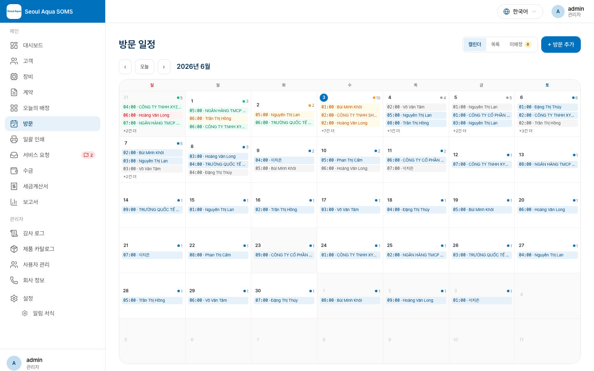

화면 구성 (Phase 6 — 2026-06-03 이후 3-탭):

- **달력 보기** — 주간 캘린더 (기사 × 요일 그리드), 드래그로 일정 변경
- **목록 보기** — 날짜순 또는 기사순 정렬
- **미배정 ✱N** — 기사가 아직 안 잡힌 `SUGGESTED` 방문만 모아 보기. 우측 위 뱃지에 미배정 건수가 실시간 표시됩니다
- **필터**: 상태, 기사, 손님, 날짜 범위
- **새 방문** 버튼

> 💡 **"미배정" 탭 활용 팁**: 매일 아침 첫 작업으로 이 탭을 열어 모든 미배정 카드를 처리하세요. 카드마다 시스템이 추천한 기사가 인라인으로 표시되며 **확정 ▸** 한 번이면 끝납니다. 한 카드씩 처리하는 게 번거롭다면 7.8장의 **"오늘의 배정 보드"** 를 쓰면 더 빠릅니다.

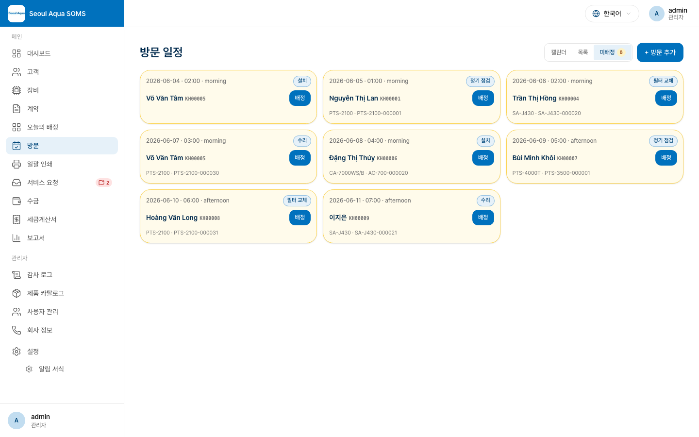

### 7.3 새 방문 만들기

**방문 목록 → "새 방문" 버튼**

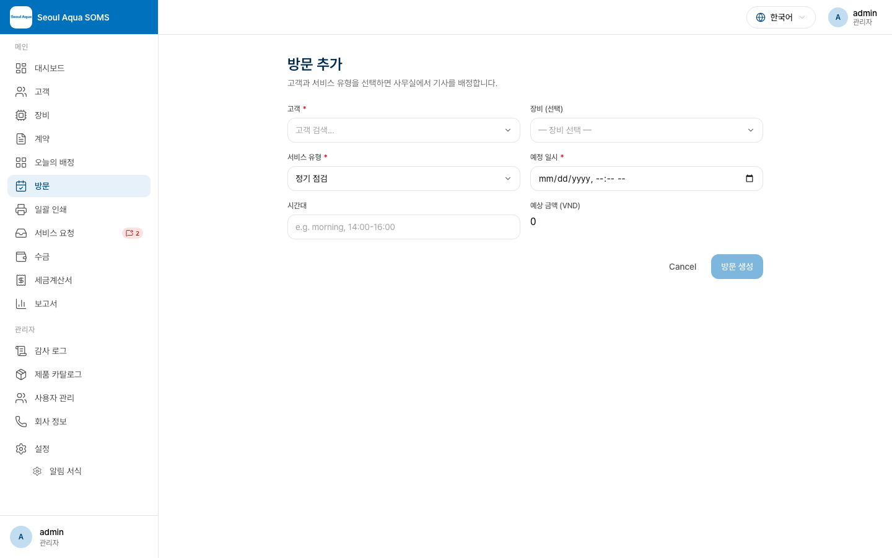

#### 단계 1: 손님과 날짜 선택

- 손님 검색
- 방문 종류 (위 표 참조)
- 희망 날짜
- 시간대 (예: `09:00~11:00`, `오전`, `오후`)
  - B2C: 구체적인 시간대를 받는 게 좋습니다 (직장인은 시간 제약)
  - B2B: 보통 "오전" / "오후" 단위로 충분

#### 단계 2: 시스템 추천 기사 확인

시스템이 자동으로 추천하는 기사를 보여줍니다. 추천 우선순위:

1. **손님이 선호하는 기사** (`Customer.preferredTechnicianId` 설정된 경우, 그날 가용)
2. **지역 매칭** — 손님 지역과 기사 선호 지역이 겹침
3. **부하 균등** — 그날 방문 적은 기사 우선

#### 단계 3: 기사 확인 또는 변경

- "**추천 받기**" 클릭하면 1순위 기사로 배정
- 또는 후보 목록에서 다른 기사 수동 선택
- **공동 작업이 필요한 경우** (B2B 대규모 사이트):
  - 1명을 **주관 기사 (Lead)** 로 지정
  - 나머지를 **협업 기사 (Collaborator)** 로 추가

#### 단계 4: 장비 선택

이 방문에서 작업할 장비를 선택합니다 (한 손님의 모든 장비 중 일부만 가능).

#### 단계 5: 저장

저장 직후:
- **손님과 기사 모두에게 알림 SMS** 자동 발송
- 기사 모바일 화면의 "오늘" 또는 "예정" 탭에 추가됨

### 7.4 일정 변경

손님이 전화로 "내일 못 와요" 하시면:

1. 해당 방문 검색
2. 방문 상세 → "**일정 변경**" 버튼
3. 새 날짜 + 사유 선택 (드롭다운: `손님 요청`, `기사 사유`, `날씨`, `손님 부재`, `기타`)
4. 저장 → **이전 방문은 `RESCHEDULED` 상태, 새 방문 카드 자동 생성, 두 행이 연결됨**
5. 손님·기사 알림 SMS 자동 재발송

### 7.5 방문 취소

손님이 "취소합니다" 하면:

1. 방문 상세 → "**취소**" 버튼
2. 사유 입력
3. 상태 → `CANCELLED`

> **주의**: 이미 기사가 방문하기 시작한 (`IN_PROGRESS`) 방문은 취소 불가. 대신 "**완료**" 처리 후 적절한 사유를 메모에 남기세요.

### 7.6 방문 상태 머신

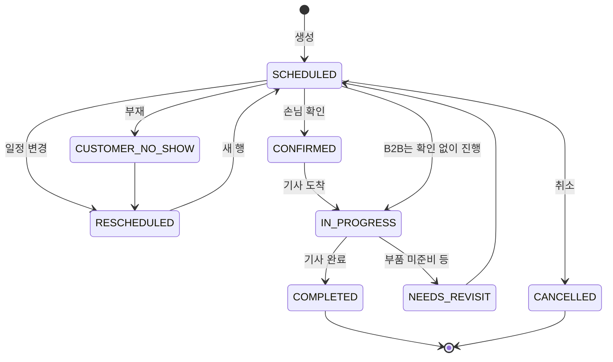
```mermaid
stateDiagram-v2
  [*] --> SCHEDULED: 생성
  SCHEDULED --> CONFIRMED: 손님 확인
  SCHEDULED --> RESCHEDULED: 일정 변경
  RESCHEDULED --> SCHEDULED: 새 행

  CONFIRMED --> IN_PROGRESS: 기사 도착
  SCHEDULED --> IN_PROGRESS: B2B는 확인 없이 진행

  IN_PROGRESS --> COMPLETED: 기사 완료
  IN_PROGRESS --> NEEDS_REVISIT: 부품 미준비 등

  SCHEDULED --> CUSTOMER_NO_SHOW: 부재
  CUSTOMER_NO_SHOW --> RESCHEDULED
  SCHEDULED --> CANCELLED: 취소

  COMPLETED --> [*]
  NEEDS_REVISIT --> SCHEDULED
  CANCELLED --> [*]
```

### 7.7 정기점검 자동 생성 — 사무실이 신경 안 써도 됨

정기점검은 시스템이 매일 새벽 자동으로 생성합니다.

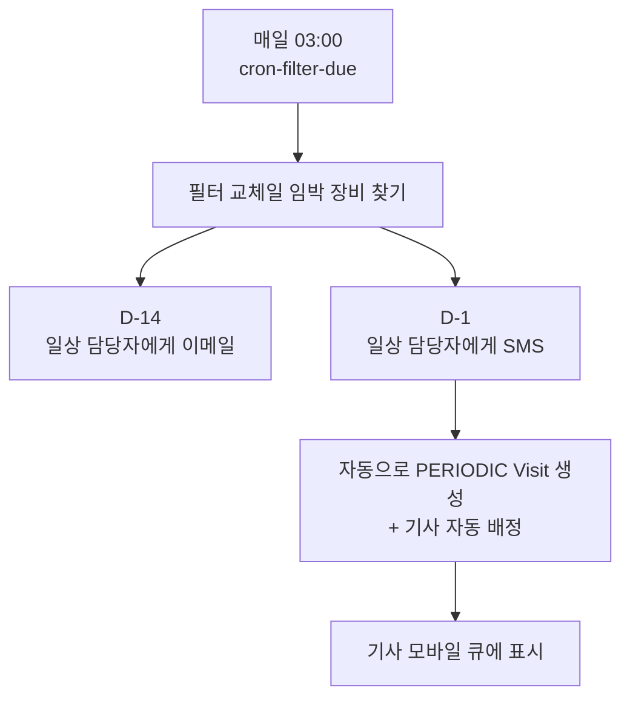
```mermaid
flowchart TB
  Cron[매일 03:00<br/>cron-filter-due] --> Find[필터 교체일 임박 장비 찾기]
  Find --> D14[D-14<br/>일상 담당자에게 이메일]
  Find --> D1[D-1<br/>일상 담당자에게 SMS]
  D1 --> Create[자동으로 PERIODIC Visit 생성<br/>+ 기사 자동 배정]
  Create --> Queue[기사 모바일 큐에 표시]
```

사무실은 매달 자동 생성된 방문들을 **목록에서 확인만** 하면 됩니다. 필요시 일정 조정 또는 다른 기사로 변경.

### 7.8 오늘의 배정 보드 (Phase 6 — 2026-06-03)

**왼쪽 사이드바 → "오늘의 배정"** (LayoutGrid 아이콘)

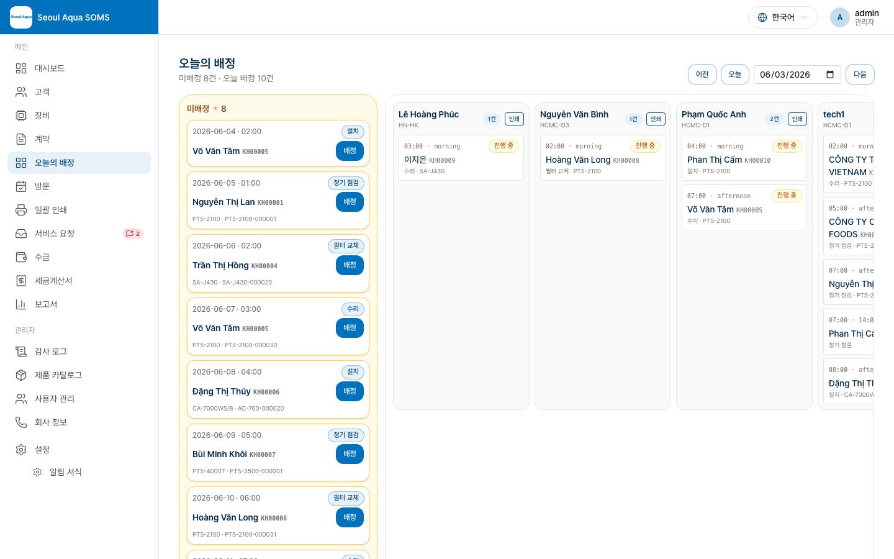

방문 일별 배정을 **한 화면에서** 처리하는 보드입니다. 7.2 미배정 탭이 "카드를 하나씩 처리" 라면, 이 보드는 "당일 전체를 시각화해서 한꺼번에 처리" 입니다.

#### 화면 구성

- **상단** — 날짜 선택기 (기본 오늘)
- **좌측 컬럼** — **미배정 큐**: 그 날짜의 `SUGGESTED` 방문 (기사 미배정) 카드 목록
- **우측 컬럼들** — **기사별 하루**: 기사 한 명당 컬럼 하나, 시간순 정렬, 컬럼 머리에 그 기사의 그날 방문 수 칩 표시

#### 사용 흐름

1. 미배정 카드 1장을 봅니다 — 카드 안에 시스템 추천 기사가 미리 표시되어 있어요
2. **확정 ▸** 버튼 한 번 → 그 기사에게 즉시 배정, 카드는 우측 해당 컬럼으로 이동
3. 추천을 바꾸고 싶으면 카드의 후보 목록에서 다른 기사 선택 후 확정
4. 우측 컬럼을 보고 부하가 한쪽으로 쏠리면 다른 미배정 카드는 부하 적은 기사로 배정

#### 기사 컬럼 머리의 "🖨 인쇄" 버튼

각 기사 컬럼 머리에 있는 **🖨 인쇄** 버튼을 누르면 그 기사가 그날 가져갈 모든 지참 서류 (방문 종류별 자동 매칭) 가 **하나의 PDF 로 묶여서** 새 탭에서 열립니다. 자세한 사용법은 7.10장 참고.

> ⚠️ **확정 후엔 손님/기사 모두에게 SMS 자동 발송**됩니다. 임시 가배정 용도가 아니에요.

### 7.9 방문 지참 서류 발급 (Phase 6 — 2026-06-03)

방문 1건당 손님에게 드릴 지참 서류 1종이 자동 매칭됩니다. 사무실이 **수동으로 "발급" 버튼**을 눌러야 PDF 가 생성되고 디스크에 저장됩니다.

#### 6종 서류 매칭표

| 방문 종류 | 손님 타입 | 계약 종류 | → 추천 서류 |
|---|---|---|---|
| 설치 (INSTALLATION) | B2C | 임대 (RENTAL) | **장비 인수증** (DELIVERY_RECEIPT) |
| 설치 (INSTALLATION) | B2C | 판매 (SALE) | **판매 영수증** (SALE_RECEIPT_B2C) |
| 설치 (INSTALLATION) | B2B | 모두 | **B2B 출고서 Mẫu 02-VT** (DELIVERY_SLIP_B2B) |
| 정기 점검 (PERIODIC_INSPECTION) | B2C | — | **정기 점검표 가정집** (PERIODIC_CHECK_B2C) |
| 정기 점검 (PERIODIC_INSPECTION) | B2B | — | **정기 점검 확인서 B2B** (PERIODIC_CHECK_B2B) |
| 수리/필터/이전/수금/기타 | 모두 | — | **작업확인서** (WORK_CONFIRMATION) |

#### 발급 가능 조건

| 방문 상태 | 발급 가능? | 안내 |
|---|---|---|
| SUGGESTED (기사 미배정) | ❌ 차단 | "기사 배정 후 발급 가능" |
| SCHEDULED / IN_PROGRESS / COMPLETED / RESCHEDULED + 기사 있음 | ✅ 가능 | 발급 / 재발급 자유 |
| CANCELLED | ❌ 차단 | "취소된 방문은 발급 불가" |
| FAILED_NO_SHOW | ❌ 차단 | "실패한 방문은 발급 불가" |

#### 발급 화면

**방문 목록 → 발급할 방문 클릭** → 상세 페이지

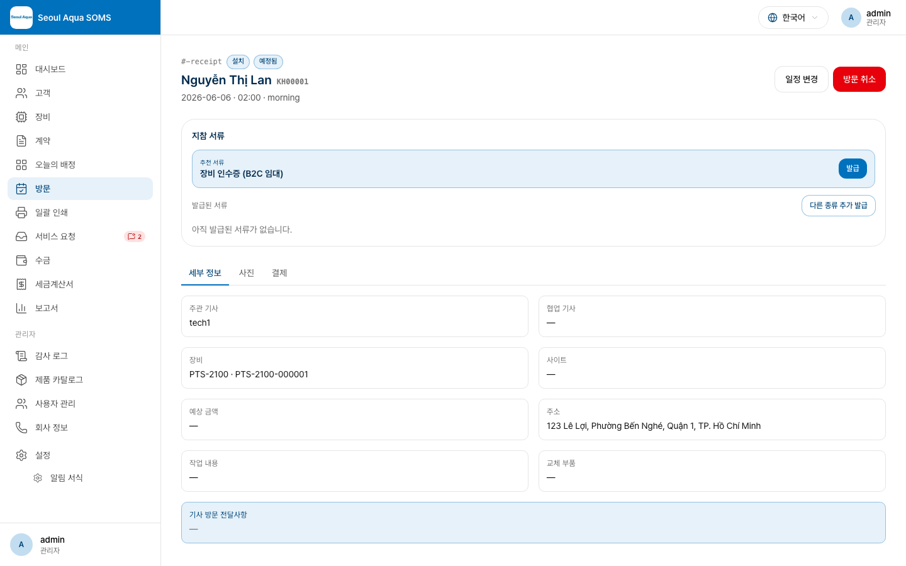

상단 **"지참 서류"** 카드 구성:

- **추천 기본 발급 버튼** — 매칭표의 추천 서류를 한 번에 발급
- **추가 발급 드롭다운** — 다른 5종 중 하나 더 발급 (검색 가능한 커스텀 드롭다운, ≥5 항목)
- **발급 이력 표** — 파일명 + 발급일 + 발급자 + 다운로드 / 재발급 액션

#### 재발급 동작

- **재발급** 버튼 → 기존 PDF 는 자동으로 archive (`renderer.persistWithArchive`), 새 버전이 생성됩니다
- 모든 발급 / 재발급은 **AuditLog** 에 `DOCUMENT_ISSUED` 또는 `DOCUMENT_REISSUED` 로 기록 (before/after = { kind, version })
- 손님이 영수증 사본을 잃어버려서 다시 달라고 하면 → 같은 방문에서 재발급 → 인쇄해서 우편 또는 다음 방문 시 전달

#### 다국어

- 모든 방문 서류는 **VI 주 + KO 보조** 2 언어 stacked 레이아웃 (예: `Khách hàng / 고객`)
- 헤더는 1줄: `SEOUL AQUA · CÔNG TY TNHH MTV TM&DV ĐẠI Á (Seoul Aqua)`
- 워터마크는 회사 로고 (불투명도 0.07, 200×200pt) — 절취선 후에도 양쪽 사본에 모두 남도록 각 사본 내부에 배치

### 7.10 일괄 인쇄 (Phase 6 — 2026-06-03)

**왼쪽 사이드바 → "일괄 인쇄"** (Printer 아이콘) 또는 **오늘의 배정 보드의 기사 컬럼 머리 🖨 버튼**

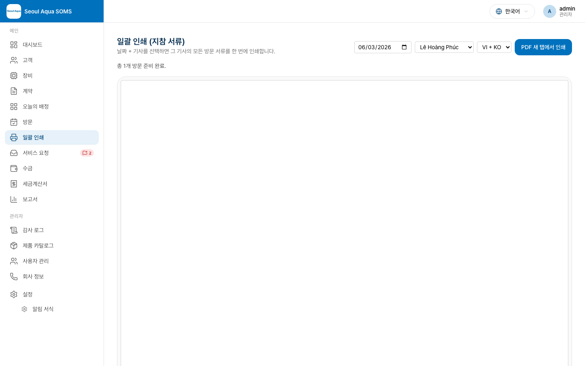

특정 날짜 + 특정 기사에 대해 그날의 모든 방문 서류를 **하나의 PDF 로 묶어서** 인쇄용으로 제공합니다.

#### 사용 흐름

1. **날짜 선택기** + **기사 선택 드롭다운** (검색 가능) 으로 묶을 대상을 정합니다
2. 우측 미리보기 영역에 `<iframe>` 으로 **묶인 단일 PDF** 가 즉시 표시됩니다
3. **"PDF 새 탭에서 인쇄"** 버튼 → 새 탭의 브라우저 PDF 뷰어로 열림 → Cmd+P (또는 Ctrl+P) 로 인쇄
4. 브라우저 PDF 뷰어가 직접 인쇄하면 **A4 그대로 출력** 됩니다 (iframe 안에서 인쇄하면 일부 브라우저가 페이지 크기를 왜곡합니다 — 그래서 새 탭 권장)

#### 자동 포함되는 것

- **설치 방문 (INSTALLATION)** 이면 그 손님의 가장 최신 ACTIVE/PENDING_SIGNATURE **계약서 PDF** 가 **2부 자동 첨부** 됩니다 (고객용 + 회사용). 기사가 첫 설치에 인수증만 들고 가면 안 되니까요. 이 계약서는 **계약 메뉴에서 보는 실제 그 PDF** 와 동일 — 일괄 인쇄용으로 새로 만드는 게 아닙니다
- **아직 발급 안 된 방문** 의 추천 서류는 인쇄 직전에 **자동 발급** 됩니다. 손으로 하나씩 발급할 필요 없어요
- **SUGGESTED 방문 (미배정)** 은 인쇄에서 자동 제외됩니다 (정책상 발급 불가)

#### 권장 사용 시점

- **아침 일찍** — 그날 출근하는 기사별로 1번씩 일괄 인쇄해서 종이 묶음을 각 기사 책상에 둠
- **점심 직전** — 오후에 추가된 방문이 있는지 확인하고 필요한 경우 재인쇄
- **응급 추가** — 미배정 카드를 확정한 직후 같은 기사 컬럼의 🖨 버튼으로 추가분만 인쇄

#### 모바일에서도 가능

TECHNICIAN 도 본인 `/f/{locale}/visits/print?date=...` 로 같은 화면에 접근할 수 있습니다 (본인이 lead 인 방문으로만 자동 필터링). 사무실에서 종이 못 챙겼을 때 비상용.

---

## 8장. 서비스 요청 처리

### 8.1 서비스 요청이 무엇인가요?

손님이 **포털에서 직접 보내는 요청**입니다. 정수기 점검, 수리, 부품 교체, 이전 설치 등.

손님이 사무실에 전화하는 대신 포털에서 신청 → 사무실에 자동 알림 → 처리 → 손님에게 결과 통보.

### 8.2 서비스 요청의 종류

| 종류 | 비용 | 처리 방식 |
|---|---|---|
| **INSPECTION** (점검) | 무료 | 자동 승인 → 즉시 방문 일정 |
| **CONSULTATION** (상담) | 무료 | 자동 승인 |
| **FAULT_REPORT** (고장) | 보증/임대 무료, 그 외 유료 | 사무실 검토 |
| **FILTER_REPLACEMENT_AD_HOC** (임시 필터 교체) | RENTAL 무료, SALE 유료 | 사무실 검토 |
| **PART_REPLACEMENT** (부품 교체) | 유료 | 사무실 검토 + 견적 |
| **RELOCATION** (이전 설치) | 유료 | 사무실 검토 + 견적 |
| **OTHER** | 직원 판단 | 사무실 검토 |

### 8.3 서비스 요청 화면

**왼쪽 메뉴 → "서비스 요청" 클릭**

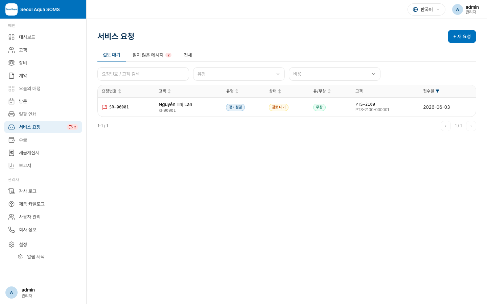

화면 구성:

- **탭**: 검토 대기 / 승인 / 진행중 / 완료 / 거부 / 전체
- 검토 대기 탭이 기본 (가장 자주 보는 곳)
- **필터**: 손님 유형, 요청 종류, 날짜 범위
- **검색**: 손님 이름, 요청 코드

### 8.4 검토 대기 요청 처리 (유료 요청)

#### 단계 1: 요청 클릭 → 상세 화면

화면에 보이는 정보:

- 손님 정보
- 요청 종류 + 설명 (손님 자유 입력)
- 첨부 사진 (손님이 올린 경우)
- 관련 장비
- 손님이 제출한 시간

#### 단계 2: 견적 입력

"**견적**" 입력란에 금액 입력 (VND).

#### 단계 3: 결정

**승인 (Approve)**:

1. "**승인**" 버튼 클릭
2. **시스템 자동 처리**:
   - 손님에게 **SMS** 발송 (`금액 + 일정`)
   - 손님에게 **이메일** 발송 (PDF 견적서)
   - 손님이 송금하면 사무실에서 매칭 → 방문 일정 확정

**반려 (Reject)**:

1. "**반려**" 버튼 클릭
2. **반려 사유** 입력 (드롭다운: `보증 외 항목`, `현장 진단 불가`, `기타`)
3. 시스템이 손님에게 SMS + 이메일 발송 (사유 포함)

### 8.5 무료 요청 — 자동 처리

INSPECTION, CONSULTATION 같은 무료 요청은 **자동 승인** → 즉시 방문 일정이 생성됩니다.

사무실은 이미 생성된 방문을 확인하기만 하면 됩니다. 별도 액션 불필요.

### 8.6 서비스 요청 내 메시지 교환

손님이 추가 정보를 보내거나, 사무실이 추가 질문을 할 때:

요청 상세 페이지에 **메시지 스레드** 영역이 있습니다.

- 30초마다 자동 새로고침 (다른 사람의 새 메시지를 자동으로 받음)
- 사진 첨부 가능
- 양쪽 메시지 모두 감사 기록에 남음

손님이 보낸 새 메시지는 사무실 알림 벨에 표시됩니다.

---

## 9장. 결제 입력과 매칭

### 9.1 결제 방법 종류

| 코드 | 한국어 | 처리 흐름 |
|---|---|---|
| **CASH_AT_VISIT** | 방문 시 현금 | 기사 수금 → 익일 사무실 인계 → 매칭 |
| **BANK_TRANSFER** | 송금 | 손님 송금 → 사무실 매칭 |
| **B2B_EINVOICE** | B2B 세금계산서 | 외부 세금계산서 발행 + PDF 업로드 → 송금 매칭 |
| **B2B_NO_INVOICE** | B2B 무세금계산서 | 송금만 (세금계산서 안 받는 일부 B2B) |

### 9.2 결제 목록 화면

**왼쪽 메뉴 → "결제" 클릭**

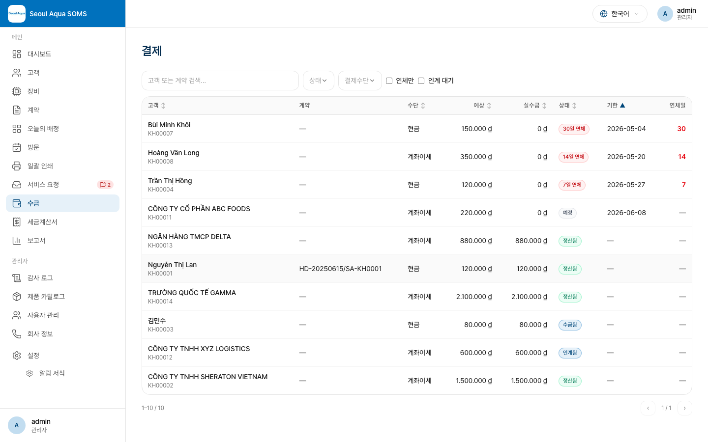

화면 구성:

- **탭**: 인계 대기 / 매칭 대기 / 완료 / 연체 / 전체
- 가장 자주 보는 곳: **"매칭 대기"** (사무실 일과의 주력)
- **필터**: 결제 방법, 손님, 날짜 범위, 금액 범위
- **검색**: 손님 코드, 송금 참조 번호

### 9.3 송금 매칭 (BANK_TRANSFER)

손님이 통장으로 송금한 경우, 사무실 직원이 어느 손님·어느 계약·몇 월분인지 매칭합니다.

#### 단계 1: 통장에서 입금 확인

은행 인터넷뱅킹에서 새 입금 확인. 송금자 이름, 금액, 참조 번호(memo) 메모.

#### 단계 2: "매칭 대기" 탭에서 매칭

해당 손님 검색 → 관련 미수금 행 찾기 → "**매칭**" 버튼

#### 단계 3: 매칭 화면 입력

- **금액**: 자동 (수정 가능)
- **송금 참조**: 통장에 표시된 번호
- **결제 일자**: 입금일
- **메모**: 특이사항 (예: "선수금")

저장하면:

- 결제 상태: `PENDING` → `RECEIVED` → `RECONCILED`
- 계약의 누적 결제 회차 자동 증가
- 손님에게 **영수증 이메일** 자동 발송
- 만약 연체 상태였다면 → `OVERDUE` → `ACTIVE`로 자동 복구

### 9.4 현금 인계 받기 (CASH_AT_VISIT)

기사가 어제 손님에게서 받은 현금을 다음 영업일 아침에 사무실에 가져옵니다.

#### 단계 1: "인계 대기" 탭


- 어제 기사가 수금한 모든 행이 보임
- 기사별로 그룹지어 표시
- 합계 금액 자동 계산

#### 단계 2: 기사가 가져온 현금 봉투 확인

- 봉투 안 현금 액수 세기
- 영수증 사본 받기 (기사가 손님에게 발급한 것)

#### 단계 3: 매칭

- 화면 합계와 봉투 현금이 일치하는지 확인
- 일치하면 "**전체 받음**" 버튼 → 모든 행 한꺼번에 처리
- 불일치 시 한 행씩 확인 + 차이 사유 메모

#### 단계 4: 차이 발생 시

- 누락된 영수증, 분실 등 → **ADMIN에게 즉시 보고**
- 시스템도 자동으로 ADMIN에게 알림 (D+1 미인계 cron)

### 9.5 결제 상태 머신

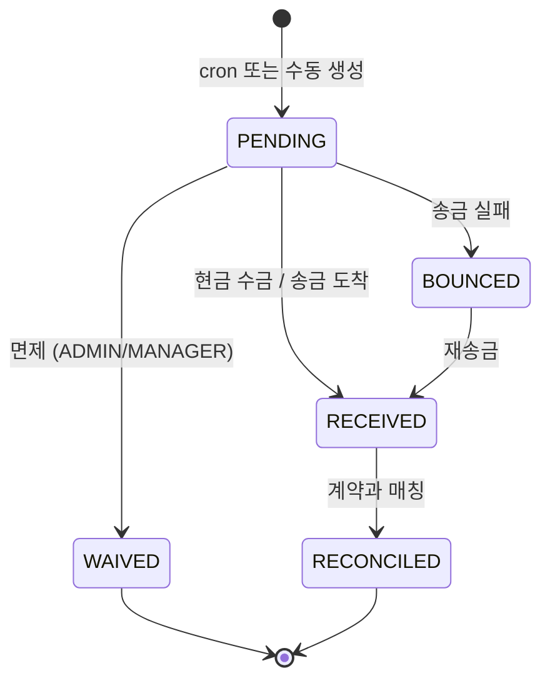
```mermaid
stateDiagram-v2
  [*] --> PENDING: cron 또는 수동 생성
  PENDING --> RECEIVED: 현금 수금 / 송금 도착
  RECEIVED --> RECONCILED: 계약과 매칭
  PENDING --> WAIVED: 면제 (ADMIN/MANAGER)
  PENDING --> BOUNCED: 송금 실패

  BOUNCED --> RECEIVED: 재송금
  WAIVED --> [*]
  RECONCILED --> [*]
```

### 9.6 미수금 자동 escalation

손님이 결제 기한을 넘기면 시스템이 자동으로 알림을 보냅니다:

| 단계 | 시점 | 알림 |
|---|---|---|
| **D+7** | 7일 늦음 | 이메일 → 계약 당사자 + 일상 담당자 (CC) |
| **D+14** | 14일 늦음 | 이메일 한 번 더 |
| **D+30** | 30일 늦음 | SMS → 계약 당사자 + 모든 일상 담당자<br/>계약 상태 → `OVERDUE` |

D+30 단계가 되면 **사무실 대시보드의 "강제 통보" 화면**에도 표시됩니다. 직접 전화·방문 추가 액션이 필요한 시점입니다.

### 9.7 결제 면제 (Waive)

손님 사정(폐업, 부도 합의 등)으로 결제를 면제할 때:

**MANAGER 이상**:

1. 결제 행 클릭 → "**면제**" 버튼
2. 사유 입력 (필수)
3. 확인 → 상태 `PENDING` → `WAIVED`
4. 감사 기록에 기록 (누가, 언제, 왜)

---

## 10장. 세금계산서 (B2B 전용)

### 10.1 v1의 세금계산서 처리 방식

v1에서는 **베트남 외부 e-Invoice 시스템(Viettel SInvoice / MISA / VNPT eHoadon 등)** 에서 발행한 PDF를 SOMS에 업로드하는 방식입니다.

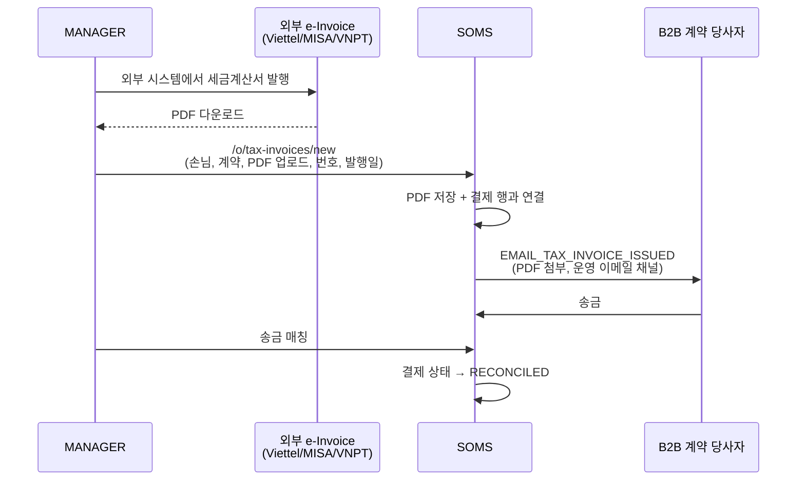
```mermaid
sequenceDiagram
  participant Mgr as MANAGER
  participant Ext as 외부 e-Invoice<br/>(Viettel/MISA/VNPT)
  participant SOMS
  participant CP as B2B 계약 당사자

  Mgr->>Ext: 외부 시스템에서 세금계산서 발행
  Ext-->>Mgr: PDF 다운로드

  Mgr->>SOMS: /o/tax-invoices/new<br/>(손님, 계약, PDF 업로드, 번호, 발행일)
  SOMS->>SOMS: PDF 저장 + 결제 행과 연결
  SOMS->>CP: EMAIL_TAX_INVOICE_ISSUED<br/>(PDF 첨부, 운영 이메일 채널)

  CP->>SOMS: 송금
  Mgr->>SOMS: 송금 매칭
  SOMS->>SOMS: 결제 상태 → RECONCILED
```

### 10.2 세금계산서 화면 (MANAGER+ 만 보임)

**왼쪽 메뉴 → "세금계산서"**

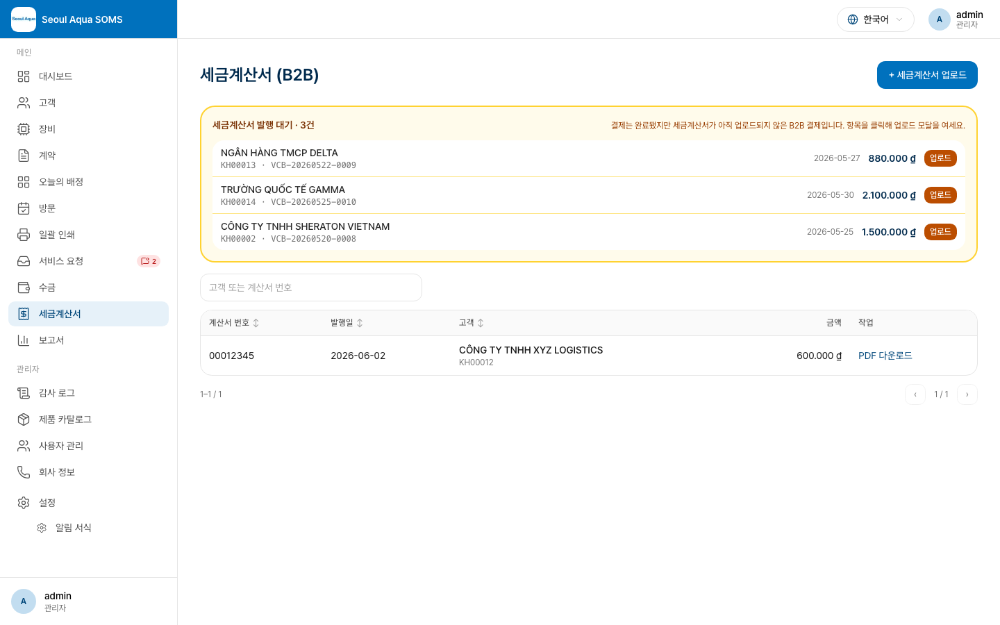

화면 구성:

- 발행 목록 (날짜순)
- 필터: 손님, 발행월, 결제 상태
- **새 세금계산서** 버튼

### 10.3 세금계산서 업로드 단계

#### 사전 준비

1. 외부 e-Invoice 시스템에 로그인
2. 손님 정보, 계약 금액 입력하여 세금계산서 발행
3. **PDF 다운로드** — 이게 SOMS에 업로드할 파일

#### SOMS 업로드

1. **세금계산서 메뉴 → "새 세금계산서"** 버튼
2. 입력:
   - **손님**: 드롭다운에서 선택
   - **관련 계약**: 어느 계약에 대한 세금계산서인지
   - **세금계산서 번호**: 외부 시스템에서 발급된 번호
   - **발행일**: 외부에서 발행한 날짜
   - **금액**: VND (자동 매칭 가능)
   - **PDF 업로드**: 다운로드한 PDF 파일 선택
3. **저장**
4. 시스템 자동 처리:
   - 손님에게 **이메일 자동 발송** (PDF 첨부)
   - 결제 행 연결 → 송금 대기
   - 감사 기록 추가

### 10.4 세금계산서 보존

- 세금계산서 PDF는 **10년 보존**됩니다 (베트남 법 권고)
- 일반 영수증은 **5년 보존**
- 종료 시점부터 자동 카운트

### 10.5 자주 묻는 점

**Q1: 세금계산서 번호를 잘못 입력했어요.**

→ 발행 직후라면 ADMIN에게 부탁해 수정. 외부 시스템에서도 동시에 수정해야 합니다. 감사 기록에 변경 이력 남음.

**Q2: 손님이 세금계산서를 원하지 않는다고 합니다.**

→ B2B인데 세금계산서가 필요 없는 경우 결제 방법을 `B2B_NO_INVOICE`로 등록. 일반 송금처럼 처리.

**Q3: 외부 e-Invoice 시스템이 다운됐어요.**

→ 외부 시스템 복구를 기다린 후 발행 + 업로드. SOMS에는 임시 메모를 남길 수 있습니다.

---

## 11장. 보고서와 감사 기록

### 11.1 보고서 메뉴

**왼쪽 메뉴 → "보고서"**

서브 메뉴:

| 메뉴 | 내용 |
|---|---|
| **매출** | 월별·기간별 매출 (계약 종류별 분리) |
| **미수금** | 연체 단계별 손님 목록 (D+7, D+14, D+30) |
| **기사 생산성** | 기사별 방문 건수, 평균 소요 시간, 수금액 |
| **필터 만료 임박** | 향후 30일 내 필터 교체 예정 손님 |
| **계약 만료 임박** | 향후 60일 내 RENTAL 만료 |
| **감사 기록** | MANAGER+ 만 — 시스템 모든 변경 이력 |

### 11.2 감사 기록 (Audit Log) — MANAGER+

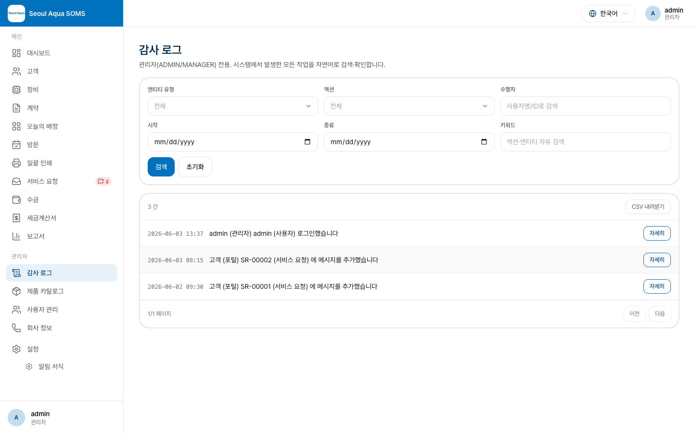

화면 구성:

- 모든 시스템 액션 (사용자 추가, 계약 활성화, 비밀번호 변경 등)
- 필터: 액션 종류, 사용자, 날짜 범위
- 각 행 클릭 시 **변경 전/후 JSON** 표시
- **CSV 내보내기** (ADMIN 만 가능)

#### 보존 기간

- 감사 기록: **24개월**
- 자동 정리 cron: 매일 새벽 03:30 VST

#### 주요 액션 종류

| 액션 코드 | 설명 |
|---|---|
| `USER_CREATED` | 새 직원 등록 |
| `USER_DEACTIVATED` | 직원 비활성화 |
| `PASSWORD_CHANGED` | 비밀번호 변경 (본인 또는 재설정) |
| `CUSTOMER_CREATED` | 새 손님 등록 |
| `CUSTOMER_UPDATED` | 손님 정보 수정 |
| `CONTRACT_ACTIVATED` | 계약 활성화 |
| `CONTRACT_COMPLETED` | 계약 종료 |
| `PAYMENT_RECEIVED` | 결제 수금 |
| `PAYMENT_WAIVED` | 결제 면제 |
| `VISIT_COMPLETED` | 방문 완료 |
| `SR_APPROVED` | 서비스 요청 승인 |
| `SR_REJECTED` | 서비스 요청 거부 |
| `TAX_INVOICE_ISSUED` | 세금계산서 발행 |
| `AMBIGUOUS_USERNAME` | 동명이인 로그인 시도 차단 (보안) |

### 11.3 보고서 활용 팁

**월말 마감**:
1. 매출 보고서 → 이번 달 신규 계약 + 결제 수금 합계 확인
2. 미수금 보고서 → D+30 단계 손님은 직접 연락
3. 기사 생산성 → 가장 활동적인 기사 확인 (인센티브 검토용)

**월별 비교**:
- 보고서 위의 "기간 선택"으로 이전 달과 비교 가능
- 그래프 보기로 추세 확인

---

## 12장. 시스템 관리 (ADMIN 전용)

### 12.1 사용자 관리

**왼쪽 메뉴 → "시스템 관리" → "사용자"**

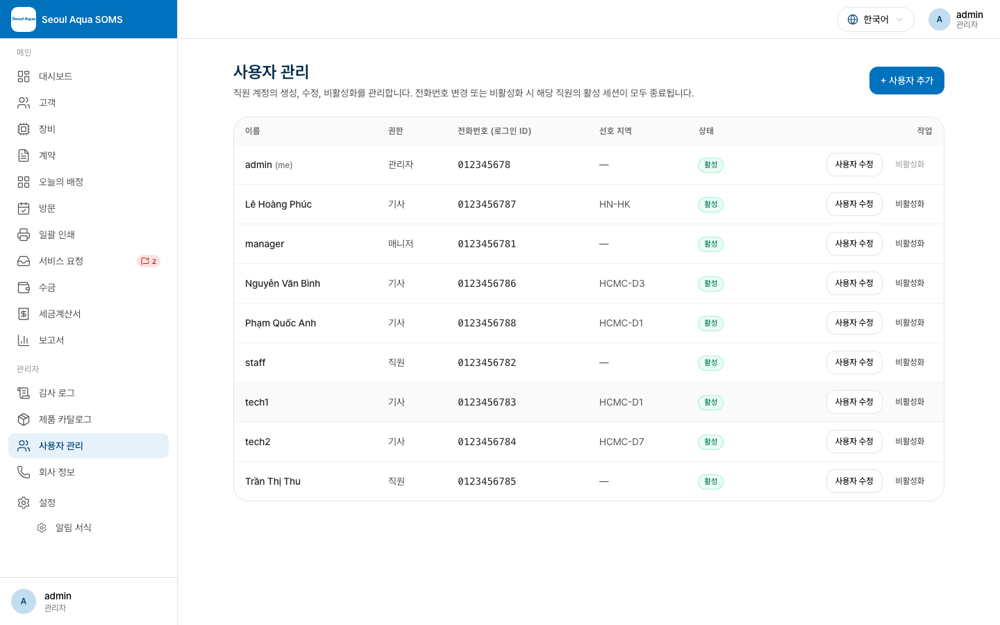

#### 새 사용자 등록

1. "**새 사용자**" 버튼
2. 입력:
   - **사용자명** (예: `manager_kim`, `staff_a`) — 화면 표시용
   - **휴대폰 번호** — 로그인 ID + SMS 수신
   - **이메일** (선택)
   - **역할** (드롭다운): `ADMIN` / `MANAGER` / `STAFF` / `TECHNICIAN`
   - **활성 여부** (기본 ON)
3. 저장 → **임시 비밀번호가 새 사용자 휴대폰으로 SMS 발송**
4. 새 사용자가 첫 로그인 → 비밀번호 변경

#### 사용자 비활성화

직원이 퇴사·휴직 시:

1. 해당 사용자 클릭 → "**비활성화**" 버튼
2. 사유 입력
3. 즉시 로그인 불가능, 모든 세션 자동 종료

> **삭제는 안 됩니다.** 감사 기록 보존 때문. 비활성화로 충분합니다.

#### 비밀번호 재설정

본인이 비밀번호를 잊었을 때 ADMIN이 처리:

1. 해당 사용자 클릭 → "**비밀번호 재설정**" 버튼
2. **새 임시 비밀번호 자동 생성 + SMS 발송**
3. 본인이 다시 로그인 → 새 비밀번호 설정

### 12.2 제품 카탈로그 관리

**왼쪽 메뉴 → "시스템 관리" → "제품 카탈로그"**

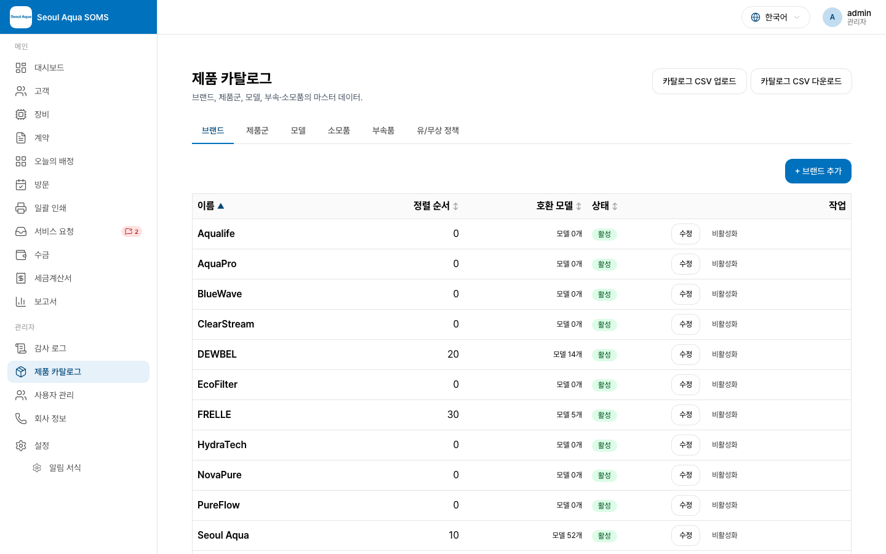

#### Brand 등록

- "**새 Brand**" 버튼
- Brand명 입력 (예: `Seoul Aqua`, `Coway`)

#### Model 등록

1. Brand 선택 → "**새 Model**" 버튼
2. 입력:
   - **모델 코드** (Brand 내 unique)
   - **모델명 (한국어)** — 필수
   - **모델명 (베트남어)** — 필수
   - **모델명 (영어)** — 필수
   - **카테고리** (정수기, 공기청정기, 비데 등)
   - **기본 가격** (선택)
3. 저장

#### Filter 호환성 등록

- 모델 상세 → "**호환 필터 추가**"
- **부품 코드** + **교체 주기 (개월)** 입력
- 정기점검 cron이 이 정보로 자동 다음 교체일 계산

#### CSV 일괄 업로드

대량 등록 시:

1. "**CSV 업로드**" 버튼
2. 샘플 파일 다운로드 → 엑셀로 채움
3. 업로드 → 시스템이 유효성 검증 → 일괄 추가

### 12.3 스케줄러 가중치

**왼쪽 메뉴 → "시스템 관리" → "스케줄러 가중치"**

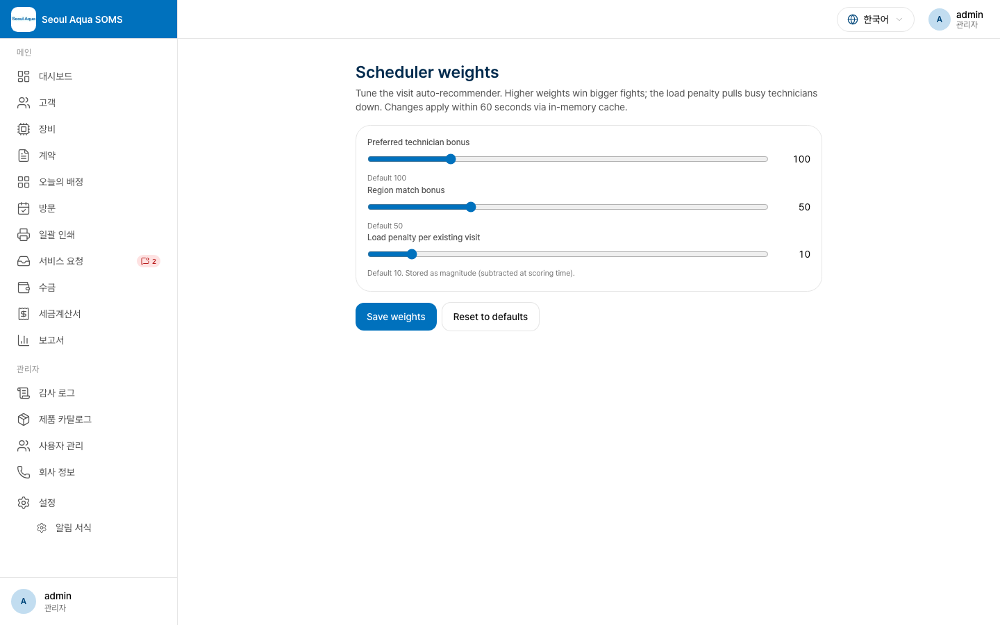

방문 자동 배정 알고리즘의 우선순위 가중치를 조정합니다.

기본 설정:
- **손님 선호 기사**: 100점
- **지역 매칭**: 50점
- **부하 균등**: 20점

기사 인력 변동, 운영 정책 변경 시 ADMIN이 조정합니다. 변경 후 새 방문부터 즉시 적용.

---

## 13장. 자주 마주치는 상황 모음

### 시나리오 1: 손님이 "내일 방문 못 받아요" 전화

처리:
1. "방문" 메뉴 → 해당 방문 검색 (손님 이름 또는 날짜)
2. "**일정 변경**" 버튼
3. 새 날짜 + "손님 요청" 사유 선택
4. 저장 → 손님·기사 자동 알림 SMS

### 시나리오 2: 손님이 비밀번호를 잊었다고 합니다 (MANAGER+)

처리:
1. 손님 상세 → "**비밀번호 재설정**" 버튼
2. 확인 → 새 임시 비밀번호가 손님 휴대폰으로 SMS 자동 발송
3. **모든 다른 기기에서 자동 로그아웃** (보안)

### 시나리오 3: B2B 손님이 "세금계산서 주세요"

처리:
1. 외부 e-Invoice 시스템에서 세금계산서 발행 → PDF 다운로드
2. SOMS "세금계산서" 메뉴 → "**새 세금계산서**"
3. 손님·계약·PDF 업로드 → 저장
4. 자동 이메일 발송됨

### 시나리오 4: 회사에 새 직원이 들어와서 정수기 관리 담당이래요

처리:
- **B2B 손님이라면**: 계약 당사자가 직접 손님 포털에서 추가 가능. 사무실 개입 불필요.
- **개입을 원하면**: 손님 상세 → "담당자" 탭 → "**새 담당자**" (5.5절 참조)

### 시나리오 5: 미수금 알림이 떴습니다

처리:
1. 대시보드 → "미수금 알림" 카드 클릭 또는 "결제" → "연체" 탭
2. 손님별 단계 확인 (D+7/D+14/D+30)
3. D+30 단계는 직접 전화 또는 방문 추진
4. 결제 들어오면 매칭 → 자동 복구

### 시나리오 6: 손님이 계약을 조기 종료하고 싶다고 합니다 (MANAGER+)

처리:
1. 계약 상세 → "**조기 종료 신청**" 버튼
2. 사유 선택 + 메모
3. RENTAL은 자동으로 회수 방문 생성
4. 위약금 또는 환불은 ADMIN과 협의 후 결제 메뉴에서 처리

### 시나리오 7: 임대 계약이 만료됐는데 손님이 유지관리로 전환을 원해요

처리:
1. 만료된 계약 → "**갱신: 유지관리**" 버튼
2. 새 월 관리비 입력
3. 확인 → 자동 처리 (6.7절 참조)

### 시나리오 8: 손님이 "정수기를 다른 사무실로 옮기고 싶어요"

처리:
1. 손님이 포털에서 RELOCATION 요청 제출 → "서비스 요청" 탭에 들어옴
2. 검토 + 견적 입력 → 승인
3. 손님 송금 → 매칭 → 이전 방문 자동 생성

### 시나리오 9: 같은 이름의 직원이 두 명이라 로그인이 안 됩니다 (보안)

처리:
- **휴대폰 번호로 로그인**하세요 (휴대폰은 무조건 1인 1번)
- 또는 ADMIN이 사용자명 하나를 변경

### 시나리오 10: 기사가 어제 수금한 현금을 안 가져왔어요

처리:
1. "결제" → "인계 대기" 탭에서 해당 기사 행 확인
2. 기사에게 전화·연락 (D+1까지 인계 안 하면 ADMIN에게 자동 알림)
3. D+2 이상 지연 시 ADMIN에게 보고

### 시나리오 11: 손님이 "계약 당사자를 바꾸고 싶어요" (예: 사장 교체)

처리 — **MANAGER 이상 전용**:
1. 손님 상세 → "담당자" 탭 → 계약 당사자 선택
2. "**변경**" 버튼 → 새 사람 정보 입력
3. **새 계약서 PDF 발행 + 재서명 권장** (법적 안전)
4. 감사 기록에 변경 이력 자동 남음

### 시나리오 12: 손님이 잘못 송금했어요 (다른 손님 명의로 입금)

처리:
1. 결제 → "**매칭 안 됨**" 탭 (또는 임시 보관함)
2. ADMIN에게 보고 → 손님 확인 후 매칭 또는 환불
3. 환불 시 음수 Payment 행 생성

### 시나리오 13: 사무실에서 손님 정보를 검색했는데 안 나옵니다

확인:
- 손님이 비활성화됐는지 확인 (사이드바 "비활성 포함" 토글)
- 손님 코드(`KH...`) 정확히 입력
- B2B 회사명 띄어쓰기 확인

### 시나리오 14: 손님 정보가 잘못 입력되어 수정해야 합니다

처리:
- 단순 정보 (이름·전화·주소): STAFF가 직접 편집
- 세금코드·회사명 등 법적 영향 있는 항목: MANAGER 이상

수정 후 감사 기록에 변경 이력 자동 저장.

### 시나리오 15: 아침에 미배정 방문이 12건 쌓여 있습니다 (Phase 6)

처리:
1. 왼쪽 사이드바 → **"오늘의 배정"** 클릭 (7.8장)
2. 좌측 미배정 큐의 카드들을 위에서부터 처리 — 카드마다 추천 기사가 표시
3. 각 카드의 **확정 ▸** 버튼 1-click → 즉시 우측 컬럼으로 이동
4. 우측 컬럼의 부하 칩을 보고 한쪽으로 쏠리면 나머지 카드는 부하 적은 기사로 재배정
5. 모두 처리되면 각 기사 컬럼의 **🖨 인쇄** 버튼으로 그날 분 일괄 인쇄 → 종이 묶음 책상에 배치

> 💡 시나리오 1과의 차이: 시나리오 1은 "한 손님 일정 변경", 시나리오 15는 "여러 미배정 방문 일괄 배정". 후자는 보드가 빠릅니다.

### 시나리오 16: 손님이 "영수증 사본 다시 주세요" 전화 (Phase 6)

처리:
1. 방문 메뉴 → 해당 방문 검색 → 상세 진입
2. 상단 **"지참 서류"** 카드 → 발급 이력에서 해당 종류 찾기
3. **다운로드** 클릭 → PDF 받음 → 손님에게 이메일 첨부 또는 인쇄 후 우편/다음 방문 시 전달
4. 만약 디자인이 바뀌어 새 버전이 필요하면 **재발급** 클릭 → 새 PDF 생성, 기존 archive
5. AuditLog 에 `DOCUMENT_REISSUED` 자동 기록

### 시나리오 17: 설치 방문인데 계약서를 같이 들고 가야 합니다 (Phase 6)

처리:
1. **일괄 인쇄** 메뉴 (또는 **오늘의 배정** 보드의 기사 컬럼 🖨)
2. 날짜 + 해당 기사 선택
3. 인쇄 미리보기에 **계약서가 2부 자동 포함** 됨 (고객용 + 회사용) — 손이 안 가요
4. **"PDF 새 탭에서 인쇄"** → 새 탭에서 Cmd+P → A4 인쇄

> ⚠️ 만약 계약서가 아직 ACTIVE/PENDING_SIGNATURE 가 아닌 DRAFT 상태면 자동 첨부가 안 됩니다. 계약 메뉴에서 먼저 활성화하거나 PENDING_SIGNATURE 단계로 만드세요.

---

## 14장. 보안 수칙

### 14.1 절대 하지 마세요

#### 비밀번호 종이에 적기

특히 모니터 옆 포스트잇 금지. 누가 사진 한 장 찍으면 끝입니다.

> 잊으면 "비밀번호 찾기" 또는 ADMIN에게 부탁하세요.

#### 본인 계정으로 다른 사람을 일하게 하기

본인 계정의 모든 작업은 **감사 기록에 본인 이름**으로 남습니다. 동료가 본인 계정으로 한 실수도 본인 책임이 됩니다.

#### 공용 컴퓨터에서 로그인 정보 저장하지 않기

브라우저의 "비밀번호 저장" 옵션을 끄세요.

#### 비밀번호 공유 금지

본인 비밀번호는 **본인만** 알아야 합니다. 동료에게 "잠깐 내 거 쓸래?" 금지.

### 14.2 권장 사항

#### 자리 비울 때 로그아웃 또는 화면 잠금

점심·회의·외출 시 반드시 로그아웃 또는 컴퓨터 잠금.

#### 비밀번호 정기 변경

3개월~6개월에 한 번 자발적으로 변경 권장.

#### 의심스러운 활동 즉시 신고

- 본인이 안 한 작업이 감사 기록에 남았다면 → ADMIN에게 즉시 보고
- 모르는 사람이 본인 계정 정보를 묻는다면 → 무시 + 보고

### 14.3 시스템 자동 보안

다음은 시스템이 자동으로 처리합니다:

- **3회 연속 로그인 실패** → 계정 1시간 자동 잠금
- **동명이인 사용자명 로그인** → 자동 거부 (`AMBIGUOUS_USERNAME` 기록)
- **비밀번호 변경 시** → 모든 다른 기기 자동 로그아웃
- **로그아웃 시** → 그 기기의 모든 캐시 데이터 자동 삭제

### 14.4 자주 발생하는 보안 사고와 예방

| 사고 | 예방 |
|---|---|
| 동료가 본인 계정으로 결제 면제 | 비밀번호 공유 금지 + 자리 비울 때 잠금 |
| 외부에 손님 정보 유출 | CSV 내보내기를 사내 메일에만 사용, USB 사용 금지 |
| 휴대폰 분실 → 본인 SMS 가로채기 | 즉시 ADMIN에 신고 → 모든 세션 강제 종료 + 비번 재설정 |

---

## 부록 A. 메뉴 빠른 찾기

| 하고 싶은 일 | 메뉴 경로 | 필요 권한 |
|---|---|---|
| 손님 정보 보기·검색 | 손님 | STAFF+ |
| 새 손님 등록 | 손님 → 새 손님 | STAFF+ |
| 새 계약서 작성 | 계약 → 새 계약 (또는 손님 페이지) | STAFF+ |
| 계약 가격 수정 | 계약 → 편집 | MANAGER+ |
| 새 방문 일정 | 방문 → 새 방문 | STAFF+ |
| 방문 일정 변경 | 방문 → 일정 변경 | STAFF+ |
| 미배정 방문 한꺼번에 배정 | 오늘의 배정 (또는 방문 → 미배정 탭) | STAFF+ |
| 방문 지참 서류 발급 / 재발급 | 방문 → 상세 → 지참 서류 카드 | STAFF+ |
| 기사 하루치 지참 서류 일괄 인쇄 | 일괄 인쇄 (또는 오늘의 배정 → 기사 칸 🖨) | STAFF+ |
| 손님 송금 매칭 | 결제 → 매칭 대기 | STAFF+ |
| 기사 현금 인계 | 결제 → 인계 대기 | STAFF+ |
| 결제 면제 | 결제 → 행 클릭 → 면제 | MANAGER+ |
| 세금계산서 업로드 | 세금계산서 → 새 세금계산서 | MANAGER+ |
| 서비스 요청 검토 | 서비스 요청 → 검토 대기 | STAFF+ |
| 매출 보고서 | 보고서 → 매출 | STAFF+ |
| 감사 기록 보기 | 보고서 → 감사 기록 | MANAGER+ |
| 감사 기록 내보내기 | 보고서 → 감사 기록 → CSV | ADMIN |
| 새 직원 등록 | 시스템 관리 → 사용자 → 새 사용자 | ADMIN |
| 직원 비밀번호 재설정 | 시스템 관리 → 사용자 → 행 클릭 | ADMIN |
| 손님 비밀번호 재설정 | 손님 페이지 → 비밀번호 재설정 | MANAGER+ |
| 새 제품 모델 등록 | 시스템 관리 → 제품 카탈로그 | ADMIN |
| 스케줄러 가중치 조정 | 시스템 관리 → 스케줄러 가중치 | ADMIN |

---

## 부록 B. 알림 템플릿 일람

시스템이 자동으로 보내는 모든 알림 목록입니다.

### SMS 전용 (7개 — 보안·긴급)

| 코드 | 시점 | 수신자 |
|---|---|---|
| SMS_PORTAL_WELCOME | 손님·직원 신규 등록 | 본인 |
| SMS_PASSWORD_RESET | 비밀번호 재설정 | 본인 |
| SMS_VISIT_REMINDER | 방문 D-1 | 일상 담당자 |
| SMS_SR_APPROVED | 유료 SR 최종 승인 + 일정 | 손님 |
| SMS_SR_REJECTED | SR 거부 + 사유 | 손님 |
| SMS_PAYMENT_OVERDUE_FINAL | 미수금 D+30 | 계약 당사자 + 모든 OPS |
| SMS_CONTRACT_RENEWAL_FINAL | 임대 만료 D-7 | 계약 당사자 |

### Email 전용 (9개 — 영수증·안내)

| 코드 | 시점 | 수신자 |
|---|---|---|
| EMAIL_SR_RECEIVED | SR 접수 직후 | 손님 |
| EMAIL_VISIT_COMPLETED | 방문 완료 직후 | 일상 담당자 (PDF 첨부) |
| EMAIL_PAYMENT_RECEIPT | 결제 매칭 직후 | 일상 담당자 |
| EMAIL_RENTAL_DUE | 매월 1일 (RENTAL/MAINTENANCE) | 계약 당사자 |
| EMAIL_PAYMENT_OVERDUE_D7 | 미수금 D+7 | 계약 당사자 + CC |
| EMAIL_PAYMENT_OVERDUE_D14 | 미수금 D+14 | 계약 당사자 + CC |
| EMAIL_FILTER_DUE_D14 | 필터 교체 D-14 | 일상 담당자 |
| EMAIL_CONTRACT_RENEWAL_D60 | 임대 만료 D-60 | 계약 당사자 |
| EMAIL_CONTRACT_RENEWAL_D30 | 임대 만료 D-30 | 계약 당사자 |
| EMAIL_TAX_INVOICE_ISSUED | 세금계산서 업로드 직후 | 계약 당사자 (PDF 첨부) |

### Hybrid — SMS + Email 동시 발송

| 코드 | 시점 |
|---|---|
| SR 승인 (유료) | SMS (짧은 일정) + Email (PDF 견적) |
| Portal Welcome (신규) | SMS (임시 비번) + Email (긴 안내) |

> **시스템 메시지** (비밀번호 재설정, 영수증)는 **opt-out 무시**하고 강제 발송됩니다. 일반 메시지만 손님이 끌 수 있습니다.

---

## 부록 C. 상태 용어 사전

### 계약 상태

| 상태 | 한국어 | 의미 |
|---|---|---|
| `DRAFT` | 초안 | 작성 중, 서명 전 |
| `ACTIVE` | 활성 | 정상 가동 중 |
| `OVERDUE` | 연체 | 미수금 D+7 이상 |
| `COMPLETED` | 종료 | 모든 회차 결제 완료 또는 만료 |
| `TERMINATED_EARLY` | 조기 종료 | 손님 요청 또는 강제 종료 |
| `CANCELLED` | 폐기 | 작성 중 취소 |

### 방문 상태

| 상태 | 한국어 | 의미 |
|---|---|---|
| `SCHEDULED` | 예정 | 일정 잡힘 |
| `CONFIRMED` | 확인 | 손님이 확인 |
| `IN_PROGRESS` | 진행중 | 기사가 시작 |
| `COMPLETED` | 완료 | 작업 끝남 |
| `RESCHEDULED` | 일정 변경됨 | 다른 날로 옮김 |
| `CUSTOMER_NO_SHOW` | 손님 부재 | 기사 도착했으나 손님 없음 |
| `NEEDS_REVISIT` | 재방문 필요 | 부품 미준비 등 |
| `CANCELLED` | 취소 | 손님·사무실 취소 |

### 결제 상태

| 상태 | 한국어 | 의미 |
|---|---|---|
| `PENDING` | 대기 | 청구만 만들어진 상태 |
| `RECEIVED` | 받음 | 현금 또는 송금 도착 |
| `RECONCILED` | 정산됨 | 어느 계약·회차인지 매칭 완료 |
| `WAIVED` | 면제 | 결제 면제 처리 |
| `BOUNCED` | 실패 | 송금 실패 / 부도 |

### 장비 상태

| 상태 | 한국어 | 의미 |
|---|---|---|
| `PENDING_INSTALL` | 설치 대기 | 계약 활성화 후, 설치 전 |
| `ACTIVE` | 가동중 | 정상 사용 |
| `REPLACED` | 교체됨 | 다른 장비로 바꿈 |
| `RELOCATED` | 이동중 | 다른 Site로 이동 |
| `RETRIEVED` | 회수됨 | RENTAL 종료 시 회수 |
| `DEACTIVATED` | 비활성 | 손님 비활성화 cascade |

### 서비스 요청 상태

| 상태 | 한국어 | 의미 |
|---|---|---|
| `SUBMITTED` | 접수 | 손님이 제출 |
| `AUTO_APPROVED` | 자동 승인 | 무료 타입 |
| `APPROVED` | 승인 | 사무실 검토 후 승인 |
| `REJECTED` | 거부 | 사무실 거부 |
| `SCHEDULED` | 일정 잡힘 | 방문 일정 확정 |
| `COMPLETED` | 완료 | 방문 완료 |
| `CANCELLED` | 취소 | 손님 취소 |

---

## 도움이 필요할 때

- **시스템이 이상하게 작동** → MANAGER 또는 ADMIN에게 보고
- **비밀번호 분실** → "비밀번호 찾기" 또는 ADMIN에게 부탁
- **기능 사용법이 헷갈림** → 이 매뉴얼의 목차에서 검색 또는 동료에게 문의
- **버그 발견** → 화면 캡쳐 + 재현 단계 적어서 ADMIN에게 전달

좋은 하루 보내세요 — Seoul Aqua 운영팀.
