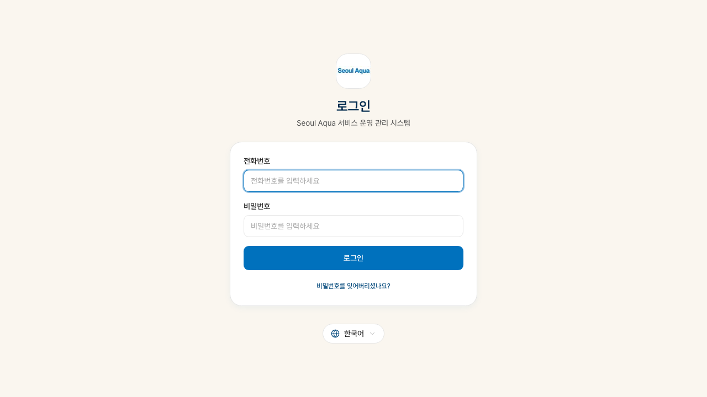
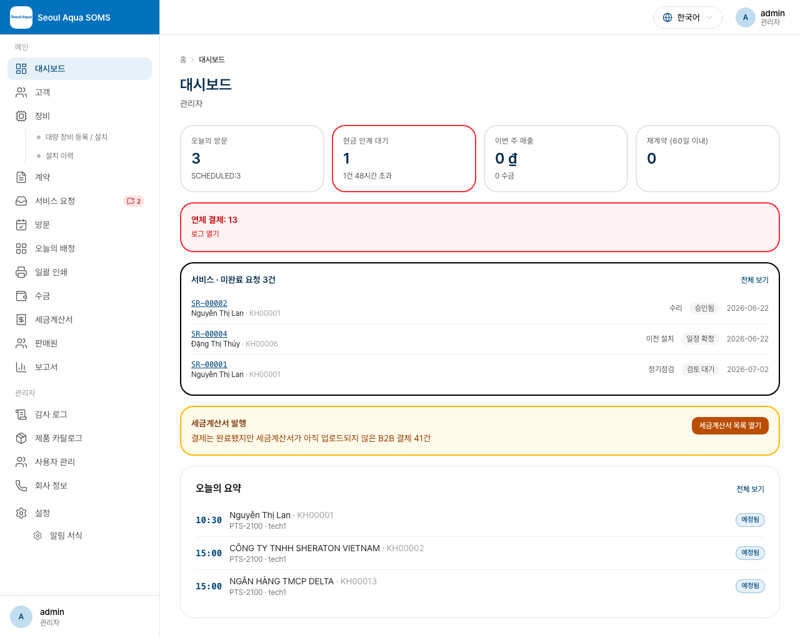
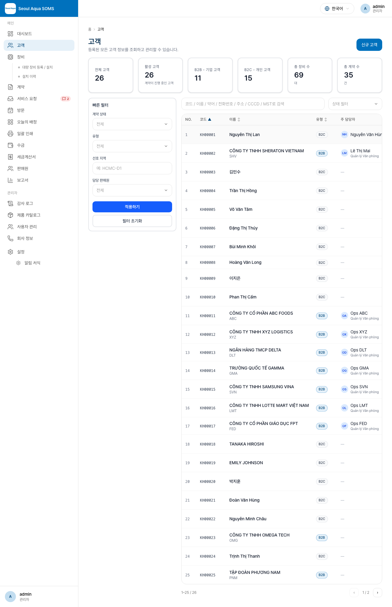
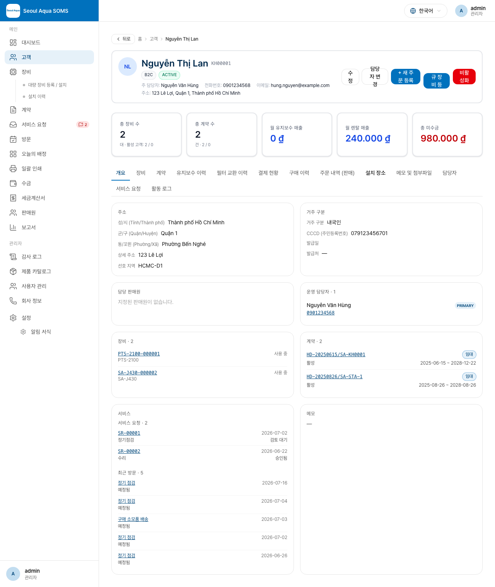
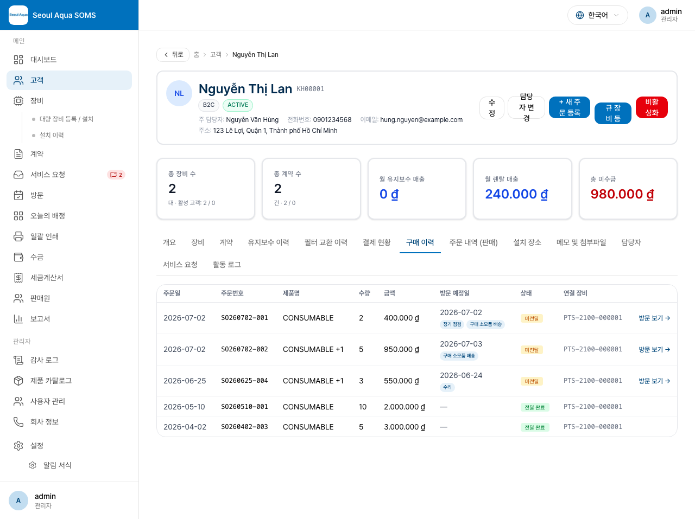
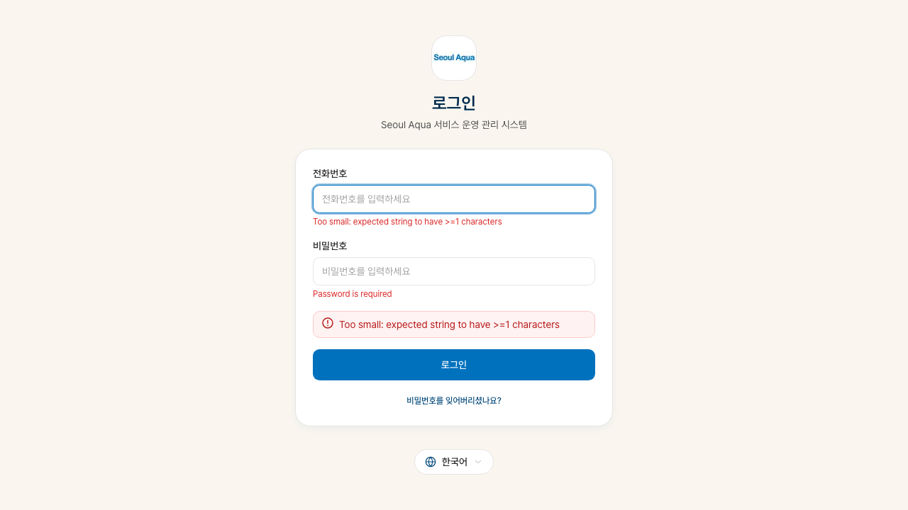
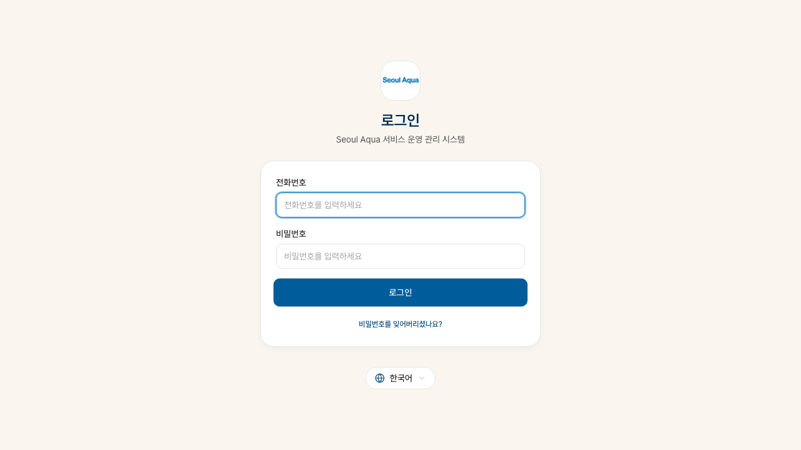

# Seoul Aqua SOMS — 사무실 직원 매뉴얼

**대상 사용자**: 관리자(ADMIN), 매니저(MANAGER), 사무실 직원(STAFF)
**버전**: 2026-07-22 (장비 정보 전면 수정 + 장비 상세 화면 통일 + 브랜드·제품군·모델 연동 선택 + 뒤로 가기 개선)
**언어**: 한국어
**관련 문서**: [현장 기사 매뉴얼](./field.md) · [고객 포털 매뉴얼](./customer.md)

---

## 목차

- [1장. 시스템 개요와 시작하기](#1장-시스템-개요와-시작하기)
- [2장. 권한 계층](#2장-권한-계층)
- [3장. 사무실 직원의 하루 (워크플로 개요)](#3장-사무실-직원의-하루-워크플로-개요)
- [4장. 로그인과 대시보드](#4장-로그인과-대시보드)
- [5장. 고객 관리](#5장-고객-관리)
- [6장. 판매원 관리 (신규)](#6장-판매원-관리-신규)
- [7장. 장비 관리 (전면 개편)](#7장-장비-관리-전면-개편)
- [8장. 계약 관리](#8장-계약-관리)
- [9장. 방문 관리 (다중 유형·다중 서류 지원)](#9장-방문-관리-다중-유형다중-서류-지원)
- [10장. 주문(소모품 납품) 관리 (신규)](#10장-주문소모품-납품-관리-신규)
- [11장. 서비스 요청 처리](#11장-서비스-요청-처리)
- [12장. 결제 입력과 매칭](#12장-결제-입력과-매칭)
- [13장. 세금계산서 (B2B 전용)](#13장-세금계산서-b2b-전용)
- [14장. 보고서와 감사 기록](#14장-보고서와-감사-기록)
- [15장. 시스템 관리 (ADMIN 전용)](#15장-시스템-관리-admin-전용)
- [16장. 자주 마주치는 시나리오](#16장-자주-마주치는-시나리오)
- [부록 A. 사이드바 메뉴 빠른 찾기](#부록-a-사이드바-메뉴-빠른-찾기)
- [부록 B. 지참 서류 매트릭스](#부록-b-지참-서류-매트릭스)
- [부록 C. 알림 템플릿 일람](#부록-c-알림-템플릿-일람)
- [부록 D. 상태 코드 사전](#부록-d-상태-코드-사전)

---

## 1장. 시스템 개요와 시작하기

### 1.1 SOMS란?

**SOMS(Service Operation Management System)**는 Seoul Aqua의 통합 업무 시스템입니다. 고객 등록·계약·장비 설치·정기 점검·결제 수금·세금계산서·미수금 관리·감사 기록을 한 곳에서 처리합니다.

기존 종이 장부와 Excel 파일을 대체하는 효과:

- **고객 한 명 = 화면 하나**: 보유 장비·계약·다음 점검일·미수금이 탭 하나에
- **자동 알림**: 점검 D-14 이메일, D-1 SMS, 미수금 자동 에스컬레이션
- **삼중 언어**: 한국어·베트남어·영어 즉시 전환
- **역할 분리**: 사무실(PC 최적화) + 현장 기사(모바일 최적화)가 동일 시스템

### 1.2 접속 URL

| 접속 경로 | URL |
|---|---|
| **사무실 앱** | `https://soms.seoulaqua.com.vn/o/ko/login` |
| **현장 기사 앱** | `https://soms.seoulaqua.com.vn/f/ko/login` |
| **고객 포털** | `https://portal.seoulaqua.com.vn/ko/login` |

> 도메인은 배포 환경에 따라 달라질 수 있습니다. 회사에서 공지한 주소를 사용하세요.

### 1.3 필요 환경

- 인터넷이 되는 PC (Chrome · Edge · Firefox · Safari 최신 버전)
- 본인 휴대폰 번호 (로그인 ID)
- 관리자가 SMS로 보내준 임시 비밀번호

---

## 2장. 권한 계층

### 2.1 역할 구조

```
ADMIN (관리자)      ← 시스템 전체 + 사용자 관리 + 모든 MANAGER 기능
  └─ MANAGER (매니저) ← 가격 변경·세금계산서·고객 PW 재설정 + 모든 STAFF 기능
       └─ STAFF (직원) ← 일상 업무 전반 (고객·계약·방문·결제 등)

TECHNICIAN (기사) ← 별도 모바일 앱, HQ 사무실 권한 없음
```

### 2.2 주요 기능별 권한표

| 기능 | ADMIN | MANAGER | STAFF |
|---|:---:|:---:|:---:|
| 사용자 추가·비활성화 | ● | — | — |
| 감사 기록 CSV 내보내기 | ● | — | — |
| 감사 기록 화면 보기 | ● | ● | — |
| 가격 변경·계약 수정 | ● | ● | — |
| 세금계산서 발행 | ● | ● | — |
| 고객 비밀번호 재설정 | ● | ● | — |
| 판매원(isSalesRep) 지정 | ● | ● | — |
| 월 마감 처리 | ● | ● | — |
| 유료 서비스 요청 승인 | ● | ● | ● |
| 고객·계약·장비 등록·편집 | ● | ● | ● |
| 방문 일정 생성·변경 | ● | ● | ● |
| 주문(소모품) 등록 | ● | ● | ● |
| 결제 입력·송금 매칭 | ● | ● | ● |
| 보고서 보기 | ● | ● | ● |
| 판매원 메뉴 보기 | ● | ● | ● |

> **부서 구분 없음**: STAFF도 영업·회계 메뉴를 모두 볼 수 있습니다. 단, 금액 변경·세금계산서 발행 등 책임이 큰 액션은 MANAGER 이상만 가능합니다.

---

## 3장. 사무실 직원의 하루 (워크플로 개요)

```
출근 → 로그인 → 대시보드 확인
  ├─ 오전: 새 방문 배정 / 기사 현금 인계 / 새 고객·계약 등록
  ├─ 오후: 서비스 요청 검토 / 송금 매칭 / 소모품 주문 처리
  └─ 퇴근 전: 미처리 건 확인 → 로그아웃
```

### 자동으로 처리되는 일 (직원이 신경 안 써도 됨)

| 자동 처리 | 시점 |
|---|---|
| 고객 임시 비밀번호 SMS | 고객 등록 직후 |
| 정기점검 D-14 이메일 | 매일 03:00 VST |
| 정기점검 D-1 SMS | 매일 03:00 VST |
| 미수금 D+7/D+14 이메일 | 매일 03:00 VST |
| 미수금 D+30 SMS | 매일 03:00 VST |
| 임대 만료 D-60/D-30 이메일 | 매일 03:00 VST |
| 기사 현금 미인계 D+1 ADMIN 알림 | 다음 영업일 자동 |
| 방문 완료 후 작업확인서 이메일 | 기사 완료 마킹 직후 |

---

## 4장. 로그인과 대시보드

### 4.1 로그인



사무실 직원 로그인 페이지는 `/o/ko/login`입니다.

| 입력란 | 설명 |
|---|---|
| **전화번호** | 본인 휴대폰 번호 (예: `0901234567`) |
| **비밀번호** | 본인 비밀번호 (첫 로그인 시 SMS로 받은 임시 비밀번호) |

**보안 동작**:
- 3회 연속 실패 → 1시간 자동 잠금
- 같은 사용자명이 2명 이상 → 휴대폰 번호로만 로그인 가능
- 현장 기사 계정으로 사무실 로그인 시도 → `/f/login`으로 안내

### 4.2 첫 로그인 비밀번호 변경

관리자가 계정을 만들면 SMS로 임시 비밀번호가 옵니다. 첫 로그인 시 바로 비밀번호 변경 화면이 뜹니다. 8자 이상, 영문+숫자 혼합 권장.

### 4.3 대시보드



로그인 후 첫 화면입니다. 오늘 처리해야 할 일이 카드로 표시됩니다.

| 카드 | 내용 |
|---|---|
| 오늘 방문 | 예정 건수 + 진행 중/완료 비율 |
| 검토 대기 서비스 요청 | 고객이 보낸 유료 요청 중 미처리 건 |
| 미수금 알림 | D+7/D+14/D+30 단계별 고객 |
| 인계 대기 현금 | 기사가 수금한 후 아직 사무실에 미인계 |
| 이번 달 매출 요약 | (MANAGER+ 만 보임) |

각 카드를 클릭하면 해당 화면으로 이동합니다.

### 4.4 사이드바 메뉴


왼쪽 사이드바에 모든 메뉴가 있습니다. 권한에 따라 일부 항목이 숨겨집니다.

```
대시보드
고객
판매원         ← 신규 (isSalesRep=true 인 직원 목록 + KPI)
계약
장비
  ├─ 장비 목록
  ├─ 대량 등록   ← 신규 wizard
  └─ 설치 이력   ← 신규
방문
  ├─ 목록/달력 보기
  └─ 일괄 인쇄
오늘의 배정 보드
서비스 요청
결제
세금계산서      (MANAGER+)
보고서
시스템 관리     (ADMIN)
```

### 4.5 언어 전환

화면 오른쪽 상단의 언어 버튼으로 한국어(KO) · 베트남어(VI) · 영어(EN)를 즉시 전환합니다. 현재 보는 화면을 유지한 채 텍스트만 바뀝니다.

### 4.6 뒤로 가기 동작 (개선)

화면 상단 브레드크럼 옆의 "**뒤로**" 버튼이 이제 **직전에 보던 화면**으로 돌아갑니다. 이전에는 항상 해당 메뉴의 목록 화면(예: 고객 목록)으로 이동했지만, 지금은 실제로 거쳐온 경로를 따라 한 단계씩 되돌아갑니다.

예: 고객 목록 → 고객 상세 → (장비를 클릭해) 장비 상세 화면에서 "뒤로"를 누르면 고객 상세로 돌아가고, 거기서 다시 "뒤로"를 누르면 고객 목록으로 돌아갑니다.

> 새 탭에서 곧바로 열었거나 링크를 직접 입력해 들어온 경우처럼 직전 화면이 없을 때만, 예외적으로 해당 메뉴의 목록 화면으로 이동합니다.

---

## 5장. 고객 관리

### 5.1 고객 목록

**사이드바 → 고객**



- **검색창**: 이름·전화번호·코드(`KH00001` 등) 모두 입력 가능
- **사이드 필터**: 유형(B2C/B2B) · 도시 · 활성 여부 · 담당 판매원
- **새 고객** 버튼 (우상단)
- **CSV 내보내기** (검색 결과를 엑셀로 다운로드)

줄을 클릭하면 고객 상세로 이동합니다.

### 5.2 새 고객 등록 — B2C (가정집)

**고객 목록 → 새 고객 → B2C 선택**

#### 필수 입력

| 항목 | 설명 |
|---|---|
| **이름** | 고객 성함 (예: `Nguyễn Văn A` 또는 `김철수`) |
| **전화번호** | 주 연락처 — 포털 로그인 ID |

> 계약 당사자는 별도 섹션 없이 **고객 본인의 정보**가 자동으로 CONTRACT_PARTY가 됩니다.

#### 주소 입력 (캐스케이딩 드롭다운)

2025년 베트남 행정구역 개편으로 군/구(Quận/Huyện) 단위가 폐지되어, 이제 **2단계**로 입력합니다.

1. 성/시 (`Tỉnh/Thành phố`) 선택 — 전국 **34개 성/시** 중 선택
2. 동/꼬뮌 (`Phường/Xã`) 선택
3. 상세 주소 입력

> **성조 무시 검색**: 드롭다운 검색창은 성조(디아크리틱) 없이 일반 영문만 입력해도 찾아줍니다. 예: `Ho Chi`만 입력해도 `Thành phố Hồ Chí Minh`이 검색됩니다.

목록에 없는 지역은 직접 타이핑 후 "**직접 입력**" 옵션을 선택합니다.

> 이 2단계 주소 체계는 B2B 사업장(Site) 주소 입력(§5.3)에도 동일하게 적용됩니다.

#### 선택 입력

| 항목 | 용도 |
|---|---|
| CCCD / 여권번호 | 계약서 표기 |
| 이메일 | 영수증·작업확인서 발송 |
| 운영 담당자(OPS) | 방문 알림 수신자 |
| 담당 판매원 | 판매 실적 집계 |
| 선호 지역 / 선호 기사 | 기사 자동 배정 힌트 |

#### 포털 자동 활성화

저장 즉시 임시 비밀번호 SMS가 고객 휴대폰으로 발송되고, 고객이 포털에서 바로 로그인할 수 있습니다.

### 5.3 새 고객 등록 — B2B (회사)

B2C와 차이점:

| 항목 | B2B 특이사항 |
|---|---|
| **이름** | 회사명 (예: `CÔNG TY TNHH SHV`) |
| **세금코드** | 베트남 사업자 등록번호 (필수, 예: `0301234567`) |
| **약어(shortcode)** | 2~5자 영문 (예: `SHV`) — 계약 번호에 사용 |

**사업장(Site) 추가** — B2B 전용:

저장 후 고객 상세 → "**설치 장소**" 탭 → "새 사업장" 버튼으로 사업장을 추가합니다. 사업장명·주소·지역을 입력합니다.

> B2C는 사업장이 필요 없습니다. 가정집은 고객 주소가 곧 설치 주소입니다.

### 5.4 고객 상세 탭 구성



| 탭 | 내용 |
|---|---|
| **개요** | 이름·전화·주소·메모·담당 판매원 (편집 가능) |
| **보유 장비** | 장비 목록 — 클릭 시 전용 장비 상세 페이지로 이동 (§5.5) |
| **계약 현황** | 활성·초안·완료·해지 계약 전체 |
| **유지보수 이력** | 이 고객의 모든 방문 기록 |
| **결제** | 결제 내역 (청구·완료·연체·면제) |
| **구매 이력** | CONSUMABLE_DELIVERY 방문과 연결된 소모품 구매 이력 |
| **주문 내역(판매)** | Order/OrderItem 연결된 소모품 주문 목록 |
| **설치 장소** | B2B 사업장(Site) 목록 (B2C에서는 숨김) |
| **메모** | 내부 메모 (고객에게 보이지 않음) |

### 5.5 보유 장비 탭


장비 목록에서 장비 한 대를 클릭하면 **전용 장비 상세 페이지**로 이동합니다(§7.3). **개요** 탭의 보유 장비 카드에서 장비를 눌러도 항상 같은 페이지로 이동합니다 — 이전에는 진입 위치에 따라 다른 화면이 보였지만, 이제는 어디서 들어가도 동일한 화면입니다.

장비 상세 페이지의 **서비스 구성 통합표** — 점검 주기와 필터 교체 주기가 한 표에 표시됩니다:

| 열 | 설명 |
|---|---|
| 서비스 유형 | 정기점검 / 필터 교체 |
| 주기 | 교체 간격 (개월) |
| 마지막 교체일 | 실제 완료 날짜 |
| 다음 교체 예정일 | 시스템 자동 계산 |
| 상태 | 정상 / 임박 / 지연 |

### 5.6 구매 이력 탭 (신규)



`CONSUMABLE_DELIVERY` 방문과 연결된 소모품 구매 이력을 표시합니다. 방문 날짜·품목·금액·기사 정보를 확인할 수 있습니다.

### 5.7 주문 내역(판매) 탭 (신규)


Order/OrderItem 엔티티와 연결된 소모품 주문을 표시합니다. 새 주문을 이 탭에서 직접 등록할 수도 있습니다.

### 5.8 담당자 관리 — CONTRACT_PARTY / OPS_CONTACT

모든 고객에게는 **계약 당사자(CONTRACT_PARTY)** 1명과 **운영 담당자(OPS_CONTACT)** 0~N명이 있습니다.

| 역할 | 받는 알림 |
|---|---|
| CONTRACT_PARTY | 계약서·세금계산서·법적 통보 |
| OPS_CONTACT (주) | 방문 SMS·영수증·정기점검 알림 |
| 모든 OPS_CONTACT | 미수금 독촉 CC |

OPS_CONTACT 추가:
1. 고객 상세 → **개요** 탭의 담당자 섹션 → "**새 담당자**" 버튼
2. 이름·전화·이메일·언어·scope(CUSTOMER 또는 SITE) 입력
3. 저장 → 포털 임시 비밀번호 SMS 자동 발송

### 5.9 고객 비활성화

MANAGER 이상:
1. 고객 상세 → "**비활성화**" 버튼
2. 사유 입력 → 확인
3. 해당 고객의 모든 활성 장비가 `DEACTIVATED` 상태로 자동 전환

> 삭제는 불가능합니다. 24개월 데이터 보존이 법적 요구사항입니다.

---

## 6장. 판매원 관리 (신규)

### 6.1 판매원이란?

`isSalesRep = true`로 설정된 직원입니다. ADMIN 또는 MANAGER가 시스템 관리에서 직원에게 판매원 권한을 부여합니다. 판매원은 일반 STAFF/MANAGER이면서 동시에 고객 담당 실적이 집계됩니다.

### 6.2 판매원 목록

**사이드바 → 판매원**


카드형 레이아웃으로 판매원별 KPI를 표시합니다:

| KPI 카드 | 설명 |
|---|---|
| **담당 고객 수** | 현재 활성 고객 중 이 판매원이 담당하는 수 |
| **이번 달 신규 계약** | 당월 신규 계약 건수 |
| **기간 매출** | 선택 기간 내 매출 합계 |
| **누적 미수금** | 담당 고객의 미수금 합계 |

### 6.3 판매원 상세

카드를 클릭하면 3개 탭으로 구성된 상세 화면이 열립니다.


#### 담당 고객 탭



이 판매원이 담당하는 고객 목록입니다. 고객명·코드·유형·장비 수·계약 상태를 한눈에 볼 수 있습니다. 고객 이름을 클릭하면 해당 고객 상세로 이동합니다.

#### 기간별 매출 탭


기간 선택기(시작일~종료일)로 조회 기간을 설정하면 해당 기간 내 이 판매원의 장비별 매출을 표시합니다.

**매출 계산식**: 장비별 매출 = 보증금 + 월 요금 × 경과 개월 수

#### 기간별 미수금 탭


담당 고객의 미수금을 기간별로 조회합니다. 건수·금액·납기일·상태를 확인할 수 있습니다.

### 6.4 판매원 배정

고객 상세 → **개요** 탭 → "담당 판매원" 드롭다운에서 직원을 선택합니다. 판매원으로 지정된 직원만 목록에 나타납니다.

---

## 7장. 장비 관리 (전면 개편)

### 7.1 장비 도메인 주요 변경사항

- `deposit` (보증금), `monthlyFee` (월 요금), `serviceType` (RENTAL/MAINTENANCE/SALE), `managementType` (FULL_SERVICE/SELF_MANAGED/OTHER), `lifecycleStage` (ACTIVE/INACTIVE/RETRIEVED/TRANSFERRED) 필드 추가
- **전용 장비 상세 페이지로 통합** (신규): 고객 개요 탭 · 보유 장비 탭 · 장비 목록 어디서 장비를 클릭해도 항상 같은 화면으로 이동 (§7.3)
- **장비 정보 전면 수정** (신규, §7.4): MANAGER 이상이 장비 상세의 "수정" 버튼으로 전 항목을 편집. 최근 점검일·필터 교체일 수동 보정(override) 지원
- **브랜드 ↔ 제품군 ↔ 모델 연동 선택** (신규): 셋 중 무엇을 먼저 골라도 나머지가 자동으로 좁혀짐 — 등록 wizard와 수정 화면에 동일하게 적용 (§7.5)
- 서비스 구성 통합표: 점검 + 필터 스케줄이 한 표에
- 대량 등록 wizard: **5단계**로 고객 선택부터 판매 방식·서비스 구성까지 한 번에 등록 (단일 등록도 4단계 wizard로 개편)
- 점검·필터 교체 **주기가 "일(day)" 단위로 통일** — 다음 예정일 계산이 더 정확해짐
- 설치 이력: batch 뷰 + visit 뷰 토글

### 7.2 장비 목록

**사이드바 → 장비**


필터: 고객 유형(B2C/B2B) · 서비스 유형(임대/유지관리/판매) · 사이클 상태 · 기사

행을 클릭하면 고객 상세의 보유 장비 탭에서 들어간 것과 **동일한 전용 장비 상세 페이지**로 이동합니다(§7.3).

### 7.3 장비 상세 — 서비스 구성 통합표


**화면 진입 위치와 무관하게 항상 같은 화면** (신규): 고객 상세의 **개요** 탭 보유 장비 카드에서 누르든, **보유 장비** 탭(§5.5)에서 누르든, **장비 목록**(§7.2)에서 행을 클릭하든 — 항상 이 **하나의 전용 장비 상세 페이지**로 이동합니다. 이전에는 진입 위치에 따라 보이는 화면이 달랐지만 지금은 어디서 들어가도 동일합니다.

장비 한 대를 클릭하면 다음을 볼 수 있습니다:

**기본 정보 섹션**:
- 시리얼 번호, 모델, 브랜드, 카테고리
- 설치일, 보증금, 월 요금, 서비스 유형
- 현재 사이클 상태 (ACTIVE/INACTIVE 등)

**읽기 전용 상세 정보**: 관리번호(자산코드) · 서비스 유형 · 관리 유형 · 보증금 · 월 요금 · 판매가 · 설치비 · 담당 기사 · 등록자가 함께 표시됩니다. 값을 바꾸려면 §7.4 "장비 정보 수정"을 사용하세요.

**서비스 구성 통합표**:
점검 주기와 필터 교체 주기가 하나의 표로 통합 — 이전 방문 날짜, 다음 예정일, 교체 주기를 모두 확인합니다.

같은 페이지에 **구매 이력 · 최근 작업 이력 · 다음 일정** 위젯, **연결된 계약 목록**, **결제 내역**, **필터 교환 이력**, **연결된 방문 이력**까지 모두 모여 있습니다.

### 7.4 장비 정보 수정 (신규)

**MANAGER 이상** 권한을 가진 사용자는 장비 상세 화면 우상단의 "**수정**" 버튼으로 장비의 거의 모든 항목을 편집할 수 있습니다. 장비의 현재 상태(활성/비활성/해지)와 관계없이 **언제나** 사용할 수 있습니다 — 입력 오류를 바로잡기 위한 화면이기 때문입니다.

#### 편집 가능한 항목

| 구분 | 항목 |
|---|---|
| 모델 | 브랜드·제품군 연동 선택으로 모델 변경 (§7.5 "브랜드 ↔ 제품군 ↔ 모델 연동 선택" 참고) |
| 설치 정보 | 설치 장소(사업장) · 설치일 · 시리얼 번호 · 관리번호(자산코드) |
| 서비스 구성 | 서비스 유형(렌탈/판매/유지보수) · 관리 유형 |
| 금액 | 보증금 · 월 요금 · 판매가 · 설치비 |
| 주기 | 정기점검 주기(일) · 필터 기본 주기(일) |
| 이력 보정 | 최근 점검일(수동) |
| 기타 | 메모 · 장비 설명(비표준 기기용) |

#### 최근 점검일 / 최근 필터 교체일 수동 보정 (override)

이 두 값은 원래 **방문 기록에서 자동 계산**되지만, 관리자가 직접 값을 지정하면 그 값이 **우선 적용**되고 **다음 예정 점검일·교체일이 자동으로 다시 계산**됩니다.

- **최근 점검일**: "수정" 모달의 "최근 점검일(수동)" 필드에 날짜를 지정합니다. 비우면 다시 방문 기록 기준 자동 계산으로 돌아갑니다.
- **필터별 최근 교체일**: 장비 상세 하단 "필터 교환 이력" 표에서 해당 필터 행의 "**주기 수정**" 버튼을 눌러 열리는 모달의 "최근 교체일(수동)" 필드에 날짜를 지정합니다.

> 이 보정 값은 **기사 앱의 소모품 추천**과 **고객에게 나가는 필터 교체 리마인더**에도 그대로 반영됩니다. 잘못 입력된 값을 고치거나, 시스템 도입 이전의 이력을 소급 입력할 때 사용하세요.

편집 화면에서 값을 비우면 해당 항목이 지워지고(수동 보정 해제), 주기를 **0**으로 두면 카탈로그 기본값으로 되돌아갑니다.

> **주의**: 하드 상태 전환(비활성화 · 해지 · 회수)은 이 수정 화면이 아니라 상단의 전용 버튼(비활성화/해지/회수)을 사용하세요. 계약 일시정지 원장의 정합성을 지키기 위해 일부러 분리되어 있습니다.

### 7.5 장비 대량 등록 Wizard (개편 — 5단계)

**사이드바 → 장비 → 대량 등록**


동일한 정보로 여러 대를 한 번에 등록·설치하는 **5단계 wizard**입니다.

#### 1단계: 고객 선택

- 고객번호·이름·담당자·연락처로 검색하고, 결과에서 바로 선택합니다.
- 찾는 고객이 목록에 없으면 **새 고객을 그 자리에서 즉시 등록**할 수 있습니다.
- B2B 고객은 설치할 **사업장(Site)** 도 함께 선택합니다.

#### 2단계: 장비 정보

- **브랜드 ↔ 제품군 ↔ 모델 연동 선택** (신규): 셋 중 어느 것을 먼저 선택해도 나머지가 자동으로 좁혀집니다.
  - **모델을 먼저 고르면** 브랜드 · 제품군이 자동으로 채워집니다.
  - **브랜드를 고르면** 그 브랜드가 보유한 제품군만 목록에 나타납니다.
  - **제품군을 고르면** 해당 브랜드+제품군에 속한 모델만 나타납니다.
  - 입력 오류가 줄고 선택 속도가 빨라집니다. 이 연동 선택은 §7.4 "장비 정보 수정" 화면과 §7.6 단일 등록 wizard에도 동일하게 적용됩니다.
- 수량·설치일·담당 기술자·설치 메모를 입력합니다.
- **관리번호**는 자동 생성(`WA` + 날짜 + 일련번호)과 직접 입력 중 선택합니다.

#### 3단계: 판매 방식

렌탈 / 판매 / 유지보수 중 하나를 고르면, 그 방식에 맞는 계약 항목만 화면에 나타납니다.

- **렌탈**: 보증금 · 월 임대료 · 계약 기간 → 계약 1건 생성
- **판매(소유)**: 판매가 · 설치비(설치비도 매출에 포함). "계약서도 함께 생성"을 켜면 판매 계약 1건이 만들어지고, 관리 방식을 **전체 서비스**로 두면 유지보수 계약이 **추가로 1건 더** 생성됩니다(즉 판매+전체서비스 = 최대 2건). **고객 자가 관리**면 정기점검·필터 구성은 비활성화됩니다.
- **유지보수**: 월 관리비 · 계약 기간 → 계약 1건 생성
- **계약번호**: 비워 두면 규칙에 따라 자동 발번되고, 직접 입력하면 그 번호를 사용합니다(중복 시 저장이 거부됩니다). **계약일**도 지정할 수 있습니다.

> 금액 입력칸에 숫자를 입력하면 `1.500.000`처럼 세 자리마다 점(.)이 자동으로 표시됩니다(베트남 표기 관례).

#### 4단계: 서비스 구성

정기점검 주기와 교체할 **필터/소모품** 목록을 구성합니다. 모델의 기본 소모품이 자동으로 채워지며, 각 항목의 **교체 주기(일 단위)** 를 조정하면 다음 예정일이 자동 계산됩니다.

#### 5단계: 최종 확인 (신규)

앞 단계에서 입력한 **모든 내용을 한 화면에 요약**해 보여줍니다 — 고객·설치 장소, 장비·수량·관리번호, 판매 방식·금액·**생성될 계약 수**, 서비스 구성까지 한눈에 확인할 수 있습니다. 확인 후 "**완료**" 버튼을 누르면 등록됩니다. 잘못된 부분이 있으면 이전 단계로 돌아가 바로 수정할 수 있습니다.

> 등록 즉시 설치 이력에 기록되고, 해당 계약의 [기기] 탭에도 반영됩니다.

### 7.6 장비 단일 등록 Wizard (신규)

**사이드바 → 장비 목록 → "+ 신규 설치" 버튼**

서로 다른 장비를 여러 줄(멀티라인)로 각각 등록할 때 사용합니다. 대량 등록(§7.5)과 같은 **4단계**(고객 선택 → 장비 정보 → 판매 방식 → 서비스 구성) 구성을 따르되, **줄(라인)마다 모델·판매 방식·서비스 구성을 개별 지정**할 수 있다는 점이 다릅니다. 장비 정보 단계의 모델 선택에는 §7.5의 **브랜드 ↔ 제품군 ↔ 모델 연동 선택**이 각 줄마다 동일하게 적용됩니다. 계약 정보(계약번호·계약일 등)는 줄 단위가 아니라 계약 수준에서 한 번만 입력합니다.

### 7.7 설치 이력 (신규)

**사이드바 → 장비 → 설치 이력**


장비가 어떻게, 언제 등록됐는지 추적합니다.

**보기 토글**:
- **배치 뷰**: 대량 등록 건 기준 — 누가 언제 몇 대를 일괄 등록했는지
- **방문 뷰**: 설치(INSTALLATION) 방문 기준 — 방문별로 어떤 장비가 설치됐는지

---

## 8장. 계약 관리

### 8.1 계약 종류

| 종류 | 한국어 | 설명 |
|---|---|---|
| **SALE** | 판매 | 한 번에 전액 납부, 즉시 고객 소유 |
| **RENTAL** | 임대 | 36개월 빌려주기, 매달 청구. 만기 시 소유권 이전(기본) 또는 기기 회수 선택 |
| **MAINTENANCE** | 유지관리 | 점검만 — 장비는 이미 고객 소유. 외부 기기(카탈로그 외)도 등록 가능 |

### 8.2 계약 목록

**사이드바 → 계약**



탭: 활성 / 초안 / 만료 / 전체
필터: 고객 유형·계약 종류·상태·판매원

### 8.3 계약 상세 탭


| 탭 | 내용 |
|---|---|
| **개요** | 계약 번호·유형·상태·손님·기간 |
| **장비** | 이 계약에 포함된 장비 목록 + 유효 해지일 |
| **부록** | B2B 계약의 수정 이력 (Appendix) |
| **결제** | 보증금·임대료·서비스비·환불 내역 |
| **활동** | 상태 변경·서명·메모 이력 |

### 8.4 계약서 PDF 수동 업로드 (신규)

계약 상세 화면에서 **매니저(MANAGER) 이상** 권한을 가진 사용자는, 시스템이 자동 생성한 계약서 PDF 대신 **실제로 서명·날인이 완료된 계약서 스캔본**을 업로드해 대체할 수 있습니다.

- 계약 상세 → "**계약서 업로드**" 버튼 → PDF 파일 선택 → 저장
- 업로드한 PDF가 자동 생성본을 덮어씁니다
- 종이로 먼저 체결한 계약을 시스템에 그대로 반영하고 싶을 때 유용합니다

### 8.5 새 계약 작성

1. 계약 목록 → "**새 계약**" 버튼
2. 고객 선택 → 계약 종류 선택
3. 장비 추가 (모델 카탈로그에서 선택)
4. 저장 → 계약 번호 자동 발급:
   - B2C: `HD-20260702/SA-KH00001`
   - B2B: `HD-20260702/SA-SHV`
5. PDF 생성 → 고객 서명 → "**활성화**" 버튼
6. 활성화 직후 설치 방문 자동 생성

### 8.6 계약 수정 (Amend)

MANAGER 이상만 가능합니다.

- **B2C 계약 수정**: 가격·장비를 직접 편집. 감사 기록에 변경 전/후 자동 기록.
- **B2B 계약 부록 추가**: 계약 상세 → "**부록 추가**" 버튼 → 새 장비 또는 조건 입력 → 부록 번호 자동 발급 (예: `HD-.../SA-SHV-A1`)

### 8.7 계약 갱신 (Renew)

임대 계약 만료 후 유지관리로 전환:
1. 만료 계약 → "**갱신: 유지관리**" 버튼
2. 새 월 관리비 + 시작일 입력
3. 확인 → 기존 임대 계약 `COMPLETED` + 장비 소유권 이전 + 새 유지관리 계약 자동 생성

### 8.8 계약 상태 흐름

```
DRAFT → ACTIVE → OVERDUE → ACTIVE (결제 완료 시)
                           TERMINATED_EARLY (조기 종료)
              ACTIVE → COMPLETED (전액 결제 완료)
              COMPLETED → (임대라면 장비 소유권 이전)
```

---

## 9장. 방문 관리 (다중 유형·다중 서류 지원)

### 9.1 방문 유형 (전체 목록)

| 코드 | 한국어 | 발생 조건 |
|---|---|---|
| INSTALLATION | 설치 | 계약 활성화 시 자동 생성 |
| PERIODIC_INSPECTION | 정기점검 | cron 자동 생성 (매달 또는 격월) |
| REPAIR | 수리 | 서비스 요청(FAULT_REPORT) 또는 수동 |
| FILTER_REPLACEMENT | 필터 교체 | cron 또는 수동 |
| RELOCATION | 이전 설치 | 서비스 요청 또는 수동 |
| PAYMENT_COLLECTION | 수금 | 수동 |
| RETRIEVAL | 회수 | 임대 종료 또는 조기 해지 시 자동 |
| **CONSUMABLE_DELIVERY** | **소모품 납품** | **주문(Order)과 연결, 신규** |
| OTHER | 기타 | 수동 |

> **다중 유형 방문**: 하나의 방문에 기본 유형 외에 추가 유형(`additionalTypes`)을 여러 개 지정할 수 있습니다. 예: 정기점검 + 소모품 납품을 동시에 진행.

### 9.2 방문 목록

**사이드바 → 방문**


**달력 보기** / **목록 보기** 토글 가능합니다.

필터: 상태·기사·고객·날짜 범위·방문 유형·고객 유형

**미배정 뱃지**: 사이드바의 방문 메뉴 옆에 미배정 건수가 표시됩니다.

### 9.3 방문 상세 — 신규 구성


방문 상세에는 다음 카드들이 추가되었습니다:

#### 연관 서비스 요청 카드 (신규)

이 방문이 특정 서비스 요청(SR)을 처리하기 위해 생성된 경우, 연결된 SR 정보(코드·유형·상태)가 표시됩니다. SR로 바로 이동하는 링크도 있습니다.

#### 연관 구매 카드 (신규)

`CONSUMABLE_DELIVERY` 방문이라면 연결된 Order 정보(품목·수량·금액)가 표시됩니다. 이 카드에서 직접 주문을 연결하거나 새 주문을 등록할 수도 있습니다.

#### 지참 서류 카드 (다중 발급)

방문 유형과 추가 유형에 따라 **여러 서류가 자동 제안**됩니다. 예:
- `PERIODIC_INSPECTION` + `CONSUMABLE_DELIVERY` (B2B 고객) → 정기점검 확인서(B2B) + 출고서(Mẫu 02-VT) 동시 제안

각 서류마다 별도의 **발급** 버튼이 있습니다. 이미 발급된 서류는 **재발급** 버튼으로 표시됩니다.

### 9.4 지참 서류 자동 매칭표

| 방문 유형 | 고객 유형 | 계약 종류 | 제안 서류 |
|---|---|---|---|
| 설치 | B2C | 임대 | 장비 인수증 (DELIVERY_RECEIPT) |
| 설치 | B2C | 판매 | 판매 영수증 (SALE_RECEIPT_B2C) |
| 설치 | B2B | 모두 | 출고서 Mẫu 02-VT (DELIVERY_SLIP_B2B) |
| 정기점검 | B2C | — | 정기점검표 가정집 (PERIODIC_CHECK_B2C) |
| 정기점검 | B2B | — | 정기점검 확인서 B2B (PERIODIC_CHECK_B2B) |
| 소모품 납품 | B2C | — | 판매 영수증 (SALE_RECEIPT_B2C) |
| 소모품 납품 | B2B | — | 출고서 (DELIVERY_SLIP_B2B) |
| 수리/필터/이전/수금/기타 | 모두 | — | 작업확인서 (WORK_CONFIRMATION) |

> **소모품 납품 서류 라인 소스**: 연결된 Order.items가 있으면 그것을 우선 사용하고, 없으면 계약 라인을 폴백으로 사용합니다.

**발급 가능 조건**: 기사가 배정된(leadTechnicianId 있음) + 취소/실패 아닌 방문만 발급 가능합니다.

### 9.5 새 방문 만들기

**방문 목록 → 새 방문**


1. 고객 검색 + 날짜 + 기본 방문 유형 선택
2. **추가 유형** 체크박스로 복합 방문 설정 (예: 정기점검 + 소모품 납품)
3. 시스템 추천 기사 확인 (추천 우선순위: 선호 기사 → 지역 매칭 → 부하 균등)
4. 필요시 주관/협업 기사 추가
5. 장비 선택
6. 저장 → 고객·기사 모두에게 SMS 자동 발송

### 9.6 일정 변경 및 취소

- **일정 변경**: 방문 상세 → "일정 변경" 버튼 → 새 날짜 + 사유 선택 → 이전 방문은 `RESCHEDULED`, 새 방문 자동 생성
- **취소**: 방문 상세 → "취소" 버튼 → 사유 입력 → `CANCELLED`
  - `IN_PROGRESS` 상태 방문은 취소 불가, 완료 후 메모로 처리

### 9.7 오늘의 배정 보드

**사이드바 → 오늘의 배정**


당일 미배정 방문을 한 화면에서 처리하는 보드입니다.

- **좌측 미배정 큐**: `SUGGESTED` 방문 카드 목록 (시스템 추천 기사 표시)
- **우측 기사별 컬럼**: 기사 한 명당 컬럼 하나, 시간순 정렬

사용법:
1. 미배정 카드의 추천 기사 확인
2. "**확정**" 버튼 한 번 → 배정 완료, 카드가 우측 컬럼으로 이동
3. 추천이 마음에 안 들면 후보 목록에서 다른 기사 선택 후 확정
4. 기사 컬럼 상단의 **인쇄 버튼** → 그 기사의 당일 모든 서류를 PDF 한 파일로 인쇄

> 확정 즉시 고객·기사 모두에게 SMS가 발송됩니다.

### 9.8 일괄 인쇄

**사이드바 → 방문 → 일괄 인쇄** (또는 배정 보드의 기사별 인쇄 버튼)


날짜 + 기사를 선택하면 그 기사가 그날 가져갈 모든 서류를 **단일 PDF**로 묶어 미리보기를 제공합니다.

- **설치 방문**이 포함되면 계약서 PDF가 2부(고객용+회사용) 자동 첨부됩니다.
- 아직 발급되지 않은 서류는 인쇄 직전에 자동 발급됩니다.
- `SUGGESTED` 방문(미배정)은 자동 제외됩니다.

**인쇄 방법**: "PDF 새 탭에서 인쇄" 버튼 → 새 탭에서 Ctrl+P (또는 Cmd+P)

---

## 10장. 주문(소모품 납품) 관리 (신규)

### 10.1 주문이란?

고객에게 소모품(필터팩·부품·기타 제품)을 판매하는 거래를 기록하는 엔티티입니다. `Order`는 여러 `OrderItem`을 포함합니다.

주문은 방문(`CONSUMABLE_DELIVERY`)과 연결되거나 독립적으로 생성될 수 있습니다.

### 10.2 주문 등록

두 가지 경로로 주문을 등록할 수 있습니다:

**경로 1 — 고객 상세에서**:
1. 고객 상세 → "**주문 내역(판매)**" 탭
2. "**새 주문**" 버튼
3. 연결 장비 + 소모품(OrderItem) 선택
4. 수량·단가 입력 → 저장

**경로 2 — 방문 상세에서**:
1. 방문 상세 → "**연관 구매**" 카드
2. "**주문 연결**" 또는 "**새 주문 등록**"
3. 동일 입력 후 저장

### 10.3 소모품 납품 방문과 연동

주문을 등록한 후 `CONSUMABLE_DELIVERY` 방문을 생성하거나 기존 방문에 연결하면:
- 방문 상세의 지참 서류 카드에서 **Order.items 기반 서류**가 자동 생성됩니다
  - B2C: 판매 영수증 (SALE_RECEIPT_B2C) — 주문 품목 명세가 라인으로 삽입
  - B2B: 출고서 (DELIVERY_SLIP_B2B) — 베트남 정부 표준 양식에 품목 자동 채움

---

## 11장. 서비스 요청 처리

### 11.1 서비스 요청 종류

| 종류 | 비용 | 처리 방식 |
|---|---|---|
| INSPECTION (점검) | 무료 | 자동 승인 → 즉시 방문 생성 |
| CONSULTATION (상담) | 무료 | 자동 승인 |
| FAULT_REPORT (고장) | 보증/임대 무료, 그 외 유료 | 사무실 검토 |
| FILTER_REPLACEMENT_AD_HOC | RENTAL 무료, SALE 유료 | 사무실 검토 |
| PART_REPLACEMENT (부품 교체) | 유료 | 검토 + 견적 |
| RELOCATION (이전 설치) | 유료 | 검토 + 견적 |
| OTHER | 직원 판단 | 검토 |

### 11.2 서비스 요청 목록

**사이드바 → 서비스 요청**


탭: 검토 대기 / 승인 / 진행 중 / 완료 / 거부 / 전체

### 11.3 유료 요청 처리


1. 검토 대기 탭 → 요청 클릭
2. 고객 정보·요청 내용·첨부 사진 확인
3. 견적 금액 입력
4. **승인** → 고객에게 SMS(금액+일정) + 이메일(견적서 PDF) 자동 발송
   - 또는 **반려** → 사유 입력 → 고객에게 SMS + 이메일 자동 발송

### 11.4 SR → 주문 → 방문 연동 체인

유료 SR이 승인되고 고객이 결제하면:
1. 사무실에서 SR 연결 주문(Order)을 생성
2. `CONSUMABLE_DELIVERY` 또는 `REPAIR` 방문 생성 시 SR 연결
3. 방문 상세의 "연관 서비스 요청" 카드에 SR 표시
4. 방문 완료 후 작업확인서 PDF 자동 생성

---

## 12장. 결제 입력과 매칭

### 12.1 결제 방법

| 코드 | 설명 |
|---|---|
| CASH_AT_VISIT | 기사가 현장에서 현금 수금 → 익일 사무실 인계 |
| BANK_TRANSFER | 고객 직접 송금 → 사무실 매칭 |
| B2B_EINVOICE | 세금계산서 발행 후 송금 매칭 |
| B2B_NO_INVOICE | 세금계산서 없이 송금만 |

### 12.2 결제 목록

**사이드바 → 결제**


탭: 인계 대기 / 매칭 대기 / 완료 / 연체 / 전체

### 12.3 송금 매칭

1. "매칭 대기" 탭 → 해당 고객 행 → "**매칭**" 버튼
2. 금액·송금 참조번호·입금일·메모 입력
3. 저장 → 상태 `PENDING → RECEIVED → RECONCILED` → 고객에게 영수증 이메일 자동 발송

### 12.4 현금 인계 받기

1. "인계 대기" 탭 → 기사별 그룹 확인
2. 기사가 가져온 현금 봉투 확인
3. 금액 일치 시 "**전체 받음**" 버튼 → 일괄 처리
4. 불일치 시 행별 확인 + 차이 메모

### 12.5 미수금 자동 에스컬레이션

| 단계 | 시점 | 자동 처리 |
|---|---|---|
| D+7 | 7일 연체 | 이메일 → 계약 당사자 + OPS CC |
| D+14 | 14일 연체 | 이메일 재발송 |
| D+30 | 30일 연체 | SMS → 계약 당사자 + 모든 OPS. 계약 상태 `OVERDUE` 전환 |

---

## 13장. 세금계산서 (B2B 전용)

v1에서는 외부 전자세금계산서 시스템(Viettel SInvoice / MISA 등)에서 발행 후 PDF를 업로드하는 방식입니다.

**업로드 단계**:
1. 외부 시스템에서 세금계산서 발행 → PDF 다운로드
2. 사이드바 → "세금계산서" → "**새 세금계산서**" 버튼
3. 고객·계약·번호·발행일·금액·PDF 파일 입력
4. 저장 → 고객에게 이메일(PDF 첨부) 자동 발송

> MANAGER 이상만 발행·수정 가능합니다. PDF는 10년 보존됩니다.

---

## 14장. 보고서와 감사 기록

### 14.1 보고서 종류

| 메뉴 | 내용 |
|---|---|
| 매출 | 월별·기간별 (계약 종류별 분리) |
| 미수금 | D+7/D+14/D+30 단계별 고객 목록 |
| 기사 생산성 | 기사별 방문 건수·평균 시간·수금액 |
| 필터 만료 임박 | 향후 30일 내 교체 예정 |
| 계약 만료 임박 | 향후 60일 내 RENTAL 만료 |
| 감사 기록 | MANAGER+ 전용 — 시스템 모든 변경 이력 |

### 14.2 감사 기록

MANAGER 이상: 사이드바 → 보고서 → 감사 기록

- 모든 시스템 액션(사용자 추가·계약 활성화·결제 면제 등)이 기록
- 각 행 클릭 → 변경 전/후 JSON 확인
- CSV 내보내기 (ADMIN 전용)
- 보존 기간: 24개월

---

## 15장. 시스템 관리 (ADMIN 전용)

**사이드바 → 시스템 관리**


### 15.1 사용자 관리

#### 새 사용자 등록

1. "**새 사용자**" 버튼
2. 사용자명·휴대폰 번호·이메일·역할(ADMIN/MANAGER/STAFF/TECHNICIAN) 입력
3. 저장 → 임시 비밀번호 SMS 자동 발송

#### isSalesRep 토글 (신규)

사용자 상세에서 **"판매원으로 지정"** 토글을 켜면 해당 직원이 판매원 메뉴에 표시됩니다. MANAGER 이상도 지정 가능합니다.

#### 비밀번호 재설정

사용자 클릭 → "**비밀번호 재설정**" 버튼 → 새 임시 비밀번호 SMS 자동 발송 → 모든 기존 세션 자동 종료

### 15.2 제품 카탈로그

Brand → Model 계층으로 제품을 등록합니다. 모델에 호환 필터 교체 주기를 등록하면 정기점검 cron이 이를 참고해 다음 교체일을 자동 계산합니다.

### 15.3 스케줄러 가중치

방문 자동 배정 알고리즘의 가중치를 조정합니다.

기본값:
- 선호 기사 매칭: 100점
- 지역 매칭: 50점
- 부하 균등: 20점

---

## 16장. 자주 마주치는 시나리오

### 시나리오 1: 고객이 "내일 방문 못 받아요"

1. 방문 메뉴 → 해당 방문 검색
2. "**일정 변경**" → 새 날짜 + "고객 요청" 사유
3. 저장 → 고객·기사 자동 SMS

### 시나리오 2: 소모품 납품 방문 처리 (정기점검 + 납품 동시)

1. 방문 신규 → 기본 유형: `정기점검` → 추가 유형: `소모품 납품` 체크
2. 연관 구매 카드에서 주문 연결
3. 서류 카드 → 정기점검 확인서 + 출고서(또는 판매영수증) 동시 발급
4. 일괄 인쇄

### 시나리오 3: B2B 고객이 "세금계산서 주세요"

1. 외부 e-Invoice 시스템에서 발행 → PDF 다운로드
2. SOMS → 세금계산서 → "**새 세금계산서**" → PDF 업로드 → 저장

### 시나리오 4: 새 직원(판매원)이 들어왔습니다

1. 시스템 관리 → 사용자 → "새 사용자" 등록
2. 역할: STAFF (또는 MANAGER)
3. 해당 사용자의 "**판매원으로 지정**" 토글 ON

### 시나리오 5: 여러 장비를 한 번에 등록해야 합니다

1. 사이드바 → 장비 → "**대량 등록**"
2. 1단계: 고객 선택 (없으면 즉시 신규 등록)
3. 2단계: 모델·수량·설치일·관리번호 입력
4. 3단계: 판매 방식(렌탈/판매/유지보수) 선택 → 계약 금액 입력
5. 4단계: 정기점검·필터 등 서비스 구성 입력
6. 5단계: 최종 확인 화면에서 생성될 계약 수까지 확인 후 "**완료**"

### 시나리오 6: 특정 기사의 오늘 서류를 모두 인쇄해야 합니다

1. 사이드바 → 방문 → "일괄 인쇄"
2. 날짜: 오늘 / 기사 선택
3. PDF 미리보기 확인 → "새 탭에서 인쇄" → Ctrl+P

### 시나리오 7: 미수금 알림이 뜹니다

1. 대시보드 → "미수금 알림" 카드 또는 결제 → "연체" 탭
2. 단계 확인 (D+7/D+14/D+30)
3. D+30 단계는 직접 전화 또는 추심 방문 추진
4. 결제 들어오면 매칭 → 자동 복구

### 시나리오 8: 판매원별 실적을 확인하고 싶습니다

1. 사이드바 → "판매원"
2. 원하는 판매원 카드 클릭
3. 기간별 매출 탭 → 조회 기간 설정 → 장비별 매출·합계 확인
4. 기간별 미수금 탭 → 담당 고객의 연체 현황 확인

---

## 부록 A. 사이드바 메뉴 빠른 찾기

| 찾는 기능 | 메뉴 경로 |
|---|---|
| 고객 등록·검색 | 고객 |
| 판매원 KPI 조회 | 판매원 |
| 장비 등록 (단건, 멀티라인) | 장비 → 목록 → "+ 신규 설치" |
| 장비 등록 (다중) | 장비 → 대량 등록 |
| 설치 이력 조회 | 장비 → 설치 이력 |
| 계약 작성·수정 | 계약 |
| 방문 일정 관리 | 방문 |
| 당일 배정 처리 | 오늘의 배정 보드 |
| 지참 서류 일괄 인쇄 | 방문 → 일괄 인쇄 |
| 서비스 요청 검토 | 서비스 요청 |
| 송금 매칭 | 결제 |
| 세금계산서 업로드 | 세금계산서 (MANAGER+) |
| 보고서·감사 기록 | 보고서 |
| 사용자·카탈로그 관리 | 시스템 관리 (ADMIN) |

---

## 부록 B. 지참 서류 매트릭스

| 서류 종류 | 코드 | 발급 조건 |
|---|---|---|
| 장비 인수증 | DELIVERY_RECEIPT | 설치 + B2C 임대 |
| 판매 영수증 | SALE_RECEIPT_B2C | 설치(B2C 판매) 또는 소모품 납품(B2C) |
| B2B 출고서 | DELIVERY_SLIP_B2B | 설치(B2B) 또는 소모품 납품(B2B) |
| 정기점검표 (가정집) | PERIODIC_CHECK_B2C | 정기점검 + B2C |
| 정기점검 확인서 (B2B) | PERIODIC_CHECK_B2B | 정기점검 + B2B |
| 작업확인서 | WORK_CONFIRMATION | 수리·필터·이전·수금·기타 |

모든 서류는 **베트남어 주 + 한국어 보조** 2개 언어 stacked 레이아웃입니다.

---

## 부록 C. 알림 템플릿 일람

| 코드 | 채널 | 수신자 | 발생 시점 |
|---|---|---|---|
| SMS_PORTAL_WELCOME | SMS | 고객 | 계정 생성 직후 |
| SMS_PASSWORD_RESET | SMS | 고객 | 비밀번호 재설정 |
| SMS_VISIT_REMINDER | SMS | OPS_CONTACT | 방문 D-1 |
| SMS_SR_APPROVED | SMS | 계약 당사자 | 유료 SR 승인 |
| SMS_SR_REJECTED | SMS | 계약 당사자 | SR 반려 |
| SMS_PAYMENT_OVERDUE_FINAL | SMS | 계약 당사자 + OPS | D+30 연체 |
| EMAIL_RECEIPT | 이메일 | OPS_CONTACT | 결제 완료 직후 |
| EMAIL_VISIT_COMPLETED | 이메일 | OPS_CONTACT | 방문 완료 직후 |
| EMAIL_CONTRACT_ACTIVATED | 이메일 | 계약 당사자 | 계약 활성화 |
| EMAIL_TAX_INVOICE_ISSUED | 이메일 | 계약 당사자 | 세금계산서 업로드 |

---

## 부록 D. 상태 코드 사전

### 방문 상태

| 코드 | 의미 |
|---|---|
| SUGGESTED | 생성됨, 기사 미배정 |
| SCHEDULED | 기사 배정 완료 |
| CONFIRMED | 고객 확인 완료 |
| IN_PROGRESS | 기사 현장 도착 후 시작 |
| COMPLETED | 완료 |
| RESCHEDULED | 일정 변경됨 |
| CUSTOMER_NO_SHOW | 고객 부재 |
| CANCELLED | 취소 |
| FAILED_NO_SHOW | 실패 (부재 등) |

### 계약 상태

| 코드 | 의미 |
|---|---|
| DRAFT | 초안 (서명 전) |
| ACTIVE | 활성 |
| OVERDUE | 미수금 30일 초과 |
| COMPLETED | 정상 종료 |
| TERMINATED_EARLY | 조기 종료 |
| CANCELLED | 폐기 |

### 결제 상태

| 코드 | 의미 |
|---|---|
| PENDING | 청구됨 |
| RECEIVED | 수금 확인 |
| RECONCILED | 계약과 매칭 완료 |
| WAIVED | 면제 |
| BOUNCED | 송금 실패 |
