# Hướng dẫn sử dụng Cổng Khách hàng Seoul Aqua (Customer Manual)

**Đối tượng**: Toàn bộ khách hàng của Seoul Aqua — Hộ gia đình (B2C) và Doanh nghiệp (B2B)
**Phiên bản**: 2026-06-02
**Ngôn ngữ**: Tiếng Việt
**Tài liệu liên quan**: [Hướng dẫn Kỹ thuật viên](./field.md)

Hướng dẫn này dành cho khách hàng sử dụng máy lọc nước·máy lọc không khí·bồn cầu thông minh của Seoul Aqua. Mô tả mọi cách kiểm tra thiết bị, lịch bảo trì kế tiếp, lịch sử thanh toán và yêu cầu dịch vụ trực tiếp qua Cổng Khách hàng trên điện thoại.

---

## Mục lục

- [Chương 1. Bắt đầu — Cổng Khách hàng Seoul Aqua là gì?](#chương-1-bắt-đầu--cổng-khách-hàng-seoul-aqua-là-gì)
- [Chương 2. Hai vai trò — Bên ký hợp đồng / Liên hệ vận hành](#chương-2-hai-vai-trò--bên-ký-hợp-đồng--liên-hệ-vận-hành)
- [Chương 3. Một năm của khách — Tổng quan quy trình](#chương-3-một-năm-của-khách--tổng-quan-quy-trình)
- [Chương 4. Đăng nhập lần đầu](#chương-4-đăng-nhập-lần-đầu)
- [Chương 5. Màn hình Trang chủ](#chương-5-màn-hình-trang-chủ)
- [Chương 6. Xem thiết bị của tôi](#chương-6-xem-thiết-bị-của-tôi)
- [Chương 7. Lịch và lịch sử thăm](#chương-7-lịch-và-lịch-sử-thăm)
- [Chương 8. Gửi yêu cầu dịch vụ](#chương-8-gửi-yêu-cầu-dịch-vụ)
- [Chương 9. Lịch sử thanh toán](#chương-9-lịch-sử-thanh-toán)
- [Chương 10. Chuyển khoản — Hướng dẫn nộp tiền](#chương-10-chuyển-khoản--hướng-dẫn-nộp-tiền)
- [Chương 11. Nhận hóa đơn GTGT (B2B)](#chương-11-nhận-hóa-đơn-gtgt-b2b)
- [Chương 12. Quản lý liên hệ (chỉ Bên ký hợp đồng)](#chương-12-quản-lý-liên-hệ-chỉ-bên-ký-hợp-đồng)
- [Chương 13. Đổi thông tin của tôi](#chương-13-đổi-thông-tin-của-tôi)
- [Chương 14. Đổi và quên mật khẩu](#chương-14-đổi-và-quên-mật-khẩu)
- [Chương 15. Các tình huống thường gặp](#chương-15-các-tình-huống-thường-gặp)
- [Chương 16. Quy tắc sử dụng an toàn](#chương-16-quy-tắc-sử-dụng-an-toàn)
- [Chương 17. Khi cần trợ giúp](#chương-17-khi-cần-trợ-giúp)
- [Phụ lục A. Danh mục thông báo SMS·Email](#phụ-lục-a-danh-mục-thông-báo-smsemail)
- [Phụ lục B. Câu hỏi thường gặp (FAQ)](#phụ-lục-b-câu-hỏi-thường-gặp-faq)

---

## Chương 1. Bắt đầu — Cổng Khách hàng Seoul Aqua là gì?

### 1.1 Dịch vụ này là gì?

Seoul Aqua là công ty tại Việt Nam **bán, cho thuê và bảo trì định kỳ** máy lọc nước·máy lọc không khí·bồn cầu thông minh. Quý khách không cần gọi văn phòng mỗi lần, có thể trực tiếp trên **Cổng**:

- Xem lần bảo trì định kỳ kế tiếp khi nào
- Xem ngày thay lõi của thiết bị
- Xem lịch sử thanh toán, công nợ
- Gửi yêu cầu dịch vụ mới (kiểm tra·sửa chữa·di dời lắp đặt, v.v.)
- Tải về hóa đơn thu tiền·hóa đơn GTGT

### 1.2 Địa chỉ cổng

```
https://seoulaqua.com.vn/login
```

Nhập địa chỉ này vào trình duyệt điện thoại hoặc máy tính sẽ thấy màn hình đăng nhập.

> **Không tải app.** Dùng trực tiếp trên trình duyệt internet (Chrome, Safari). Nếu dùng nhiều, hãy **thêm vào màn hình chính**.

### 1.3 Ai có thể sử dụng?

- **Bên ký hợp đồng (CONTRACT_PARTY)** — Người đã ký vào hợp đồng (chủ hộ B2C hoặc giám đốc B2B, v.v.)
- **Liên hệ vận hành (OPS_CONTACT)** — Phụ trách cơ sở công ty, người trong gia đình hay đặt lịch, v.v.

Phân biệt vai trò chi tiết xem [Chương 2](#chương-2-hai-vai-trò--bên-ký-hợp-đồng--liên-hệ-vận-hành).

### 1.4 Dùng trên thiết bị nào?

| Thiết bị | Trải nghiệm |
|---|---|
| Điện thoại (Android, iPhone) | Khuyến nghị nhất — Tối ưu cho mobile |
| Tablet | Có thể dùng |
| Máy tính | Có thể dùng (giám đốc B2B, v.v.) |

Trình duyệt khuyến nghị: **Chrome, Safari, Edge** phiên bản mới nhất.

---

## Chương 2. Hai vai trò — Bên ký hợp đồng / Liên hệ vận hành

### 2.1 Vì sao chia thành hai?

Trong gia đình hay công ty thường có sự khác biệt giữa **người ký hợp đồng** và **người chăm sóc vận hành hàng ngày**.

#### Ví dụ doanh nghiệp B2B

- **Bên ký hợp đồng**: Giám đốc → Ký hợp đồng, Nhận hóa đơn GTGT
- **Liên hệ vận hành**: Trưởng phòng Cơ sở Kim → Đặt lịch bảo trì định kỳ, Xác nhận thay lõi

#### Ví dụ hộ gia đình B2C

- **Bên ký hợp đồng**: Chủ hộ → Ký hợp đồng, Nhận thông báo pháp lý
- **Liên hệ vận hành** (tùy chọn): Vợ/chồng → Đặt lịch kiểm tra thực tế, Nhận hóa đơn thu tiền

> **B2C có thể không có Liên hệ vận hành.** Chủ hộ kiêm cả hai vai trò. Khi cần, có thể thêm 1 thành viên gia đình làm Liên hệ vận hành.

### 2.2 Quyền có thể làm theo vai trò

| Có thể làm | Bên ký hợp đồng | Liên hệ vận hành |
|---|:---:|:---:|
| Xem trang chủ | ● | ● |
| Xem thiết bị của tôi | ● | ● |
| Xem lịch·lịch sử thăm | ● | ● |
| Gửi yêu cầu dịch vụ | ● | ● |
| Xem lịch sử thanh toán·công nợ | ● | ● |
| Nhận hướng dẫn chuyển khoản | ● | ● |
| Tải PDF hóa đơn thu tiền | ● | ● |
| Tải PDF hóa đơn GTGT (B2B) | ● | ● |
| **Thêm/Xóa Liên hệ vận hành mới** | ● | — |
| **Sửa thông tin cá nhân** | ● | ● (chỉ của mình) |
| **Đổi mật khẩu** | ● | ● |
| **Đổi Bên ký hợp đồng** | — | — (phải yêu cầu văn phòng) |

### 2.3 Thông báo nhận khác nhau

| Loại thông báo | Người nhận |
|---|---|
| Hợp đồng, hóa đơn GTGT, thông báo pháp lý | Chỉ Bên ký hợp đồng |
| SMS lịch bảo trì định kỳ, hóa đơn thu tiền | Liên hệ vận hành (không có thì Bên ký hợp đồng) |
| Đòi công nợ | Bên ký hợp đồng + Tất cả Liên hệ vận hành |

---

## Chương 3. Một năm của khách — Tổng quan quy trình

### 3.1 Cái nhìn tổng quan

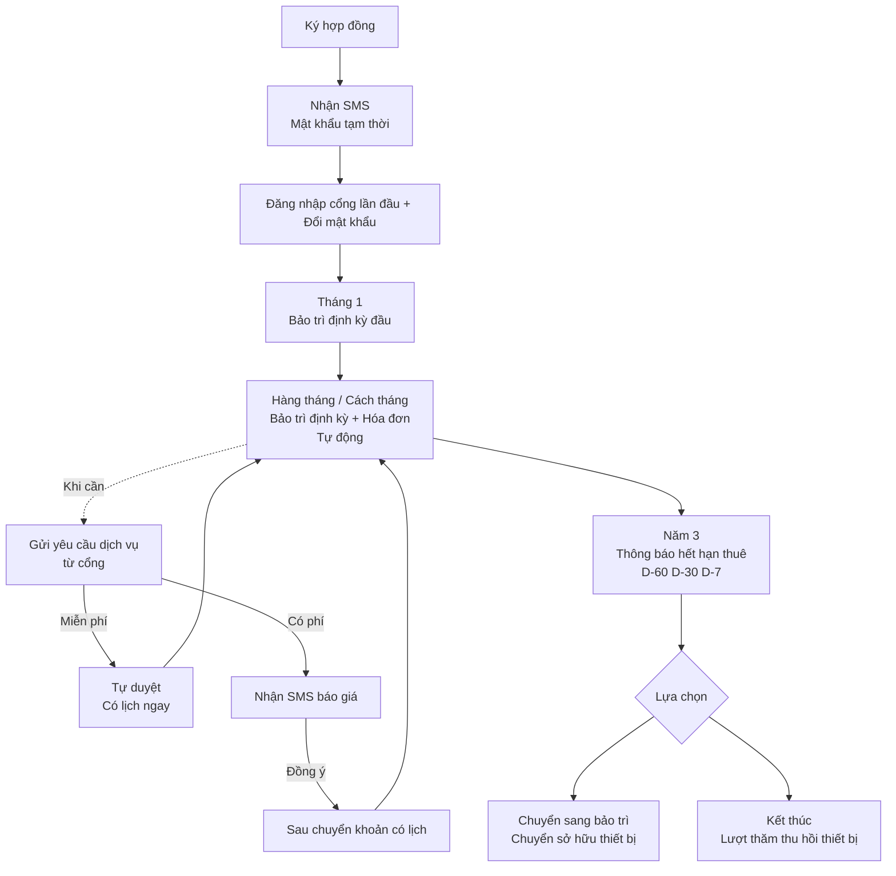

### 3.2 Mô tả các bước chính

#### Lần đầu — Lúc ký hợp đồng

Tư vấn với nhân viên kinh doanh → Ký hợp đồng → Trong vài ngày sẽ nhận được **SMS đăng ký cổng**.

#### Tháng 1 — Bảo trì định kỳ đầu tiên

Khoảng 1 tháng sau khi lắp, bảo trì định kỳ đầu tiên được lập lịch tự động. Trước 1 ngày SMS thông báo, sau khi xong phiếu xác nhận công việc gửi qua email.

#### Vận hành bình thường — Hàng tháng / Cách tháng

Tùy model thiết bị, mỗi 1 hoặc 2 tháng có 1 lần bảo trì định kỳ. Hóa đơn hàng tháng tự sinh (hợp đồng thuê·bảo trì).

#### Khi cần — Yêu cầu dịch vụ

Khi có vấn đề, yêu cầu trực tiếp trên cổng. Miễn phí thì có lịch ngay, có phí thì nhận báo giá → Chuyển khoản → Lịch.

#### Năm 3 — Hết hạn thuê

Hợp đồng thuê thường 36 tháng. Thông báo lần lượt 60·30·7 ngày trước hết hạn. Hai lựa chọn:

- **Chuyển sang bảo trì** — Thiết bị thuộc sở hữu khách, chỉ đóng phí bảo trì hàng tháng
- **Kết thúc** — Lịch thăm thu hồi thiết bị được lập

---

## Chương 4. Đăng nhập lần đầu

### 4.1 Nhận SMS

Khi ký hợp đồng, trong vài ngày sẽ nhận SMS sau:

```
[Seoul Aqua] Đăng ký Cổng Khách hàng đã hoàn tất.
Mật khẩu tạm thời: ********
Đăng nhập: seoulaqua.com.vn/login
```

> **Mật khẩu này chỉ mình quý khách** xem. Không cho người khác biết.

### 4.2 Màn hình đăng nhập

Trên trình duyệt điện thoại vào địa chỉ trên:

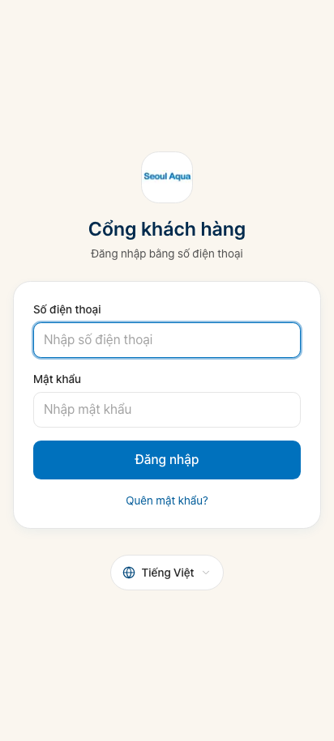

| Trường nhập | Nội dung nhập |
|---|---|
| **Số điện thoại** | Số điện thoại quý khách đã nhận SMS (ví dụ: `0901234567`) |
| **Mật khẩu** | Mật khẩu tạm thời ghi trong SMS |

Nhấn nút **Đăng nhập** chuyển sang màn hình đổi mật khẩu lần đầu.

#### Trường hợp số dùng chung với gia đình

Đôi khi cùng 1 số điện thoại có nhiều người đăng ký (ví dụ: điện thoại dùng chung gia đình):

- Sau đăng nhập hiện màn hình "Quý khách là ai?"
- Chọn tên mình và tiếp tục

### 4.3 Đổi mật khẩu lần đầu

Khi đăng nhập lần đầu bằng mật khẩu tạm thời, màn hình đặt mật khẩu mới bắt buộc hiện ra.

**Quy tắc mật khẩu**:

- Từ 8 ký tự
- Khuyến nghị kết hợp chữ + số (không bắt buộc)
- Nhập cùng mật khẩu 2 lần để xác nhận

Lưu xong là bắt đầu sử dụng bình thường.

### 4.4 Mẹo ghi nhớ mật khẩu

- **Đừng viết y nguyên ra giấy** — Dùng gợi ý chỉ mình hiểu, ai xem cũng không đoán được
- Đừng lưu trên app ghi chú điện thoại
- Khuyến nghị dùng app quản lý mật khẩu (1Password, Bitwarden, v.v.)

---

## Chương 5. Màn hình Trang chủ

Là màn hình đầu tiên hiện ra sau khi đăng nhập.

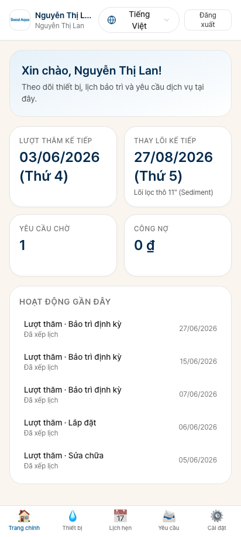

### 5.1 Cấu trúc màn hình

Từ trên xuống dưới:

#### Lời chào trên cùng

"Chào _______" — Tên của quý khách.

#### Hướng dẫn bảo trì định kỳ kế tiếp

```
Bảo trì định kỳ tiếp: Thứ Hai, 15/06/2026 - Sáng
Máy lọc nước PTS-2100, Phòng khách
```

- Ngày + Khung giờ
- Kiểm tra thiết bị nào

#### Cảnh báo sắp đến hạn thay lõi

- Hiển thị dạng "Còn 14 ngày phải thay lõi 1"
- Click chuyển sang chi tiết thiết bị

#### Hướng dẫn chưa thanh toán

- Thông báo "Tiền thuê tháng này chờ thanh toán"
- Chuyển thẳng sang màn hình hướng dẫn chuyển khoản

#### Yêu cầu dịch vụ đang xử lý

- Yêu cầu của quý khách đang được xử lý
- Click chuyển sang chi tiết yêu cầu

### 5.2 Menu dưới màn hình

| Biểu tượng | Tên | Mô tả |
|---|---|---|
| 🏠 | **Trang chủ** | Màn hình chính |
| 💧 | **Thiết bị** | Danh sách thiết bị của tôi |
| 📅 | **Lượt thăm** | Lịch và lịch sử thăm |
| 📝 | **Yêu cầu** | Gửi·Xác nhận yêu cầu dịch vụ |
| 💳 | **Thanh toán** | Lịch sử thanh toán |
| 👤 | **Thông tin của tôi** | Thông tin cá nhân, quản lý liên hệ, mật khẩu |

### 5.3 Xem bằng ngôn ngữ khác

**Chọn ngôn ngữ** ở góc trên bên phải màn hình:
- Tiếng Hàn (KO)
- Tiếng Việt (VI)
- Tiếng Anh (English, EN)

Chọn xong toàn bộ màn hình đổi ngôn ngữ ngay. Lựa chọn cuối được giữ ở lần đăng nhập sau.

---

## Chương 6. Xem thiết bị của tôi

Tab **Thiết bị** ở dưới màn hình.

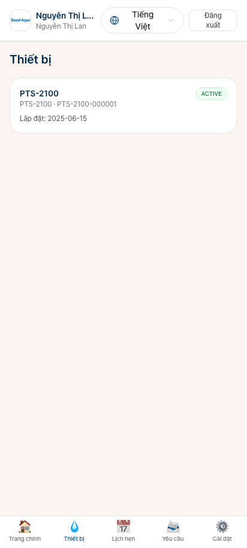

### 6.1 Cấu trúc màn hình

Tất cả thiết bị của quý khách hiển thị dạng thẻ:

| Hạng mục hiển thị | Nội dung |
|---|---|
| **Tên thiết bị** | Tên model + Danh mục (ví dụ: Máy lọc nước PTS-2100) |
| **Số serial** | Số duy nhất của thiết bị |
| **Vị trí lắp** | "Phòng khách", "Văn phòng Nhà máy A", v.v. |
| **Ngày lắp** | Ngày lắp đặt đầu tiên |
| **Ngày bảo trì kế tiếp** | Tự tính |
| **Tình trạng lõi** | Số ngày còn lại của mỗi lõi (hiển thị màu) |
| **Huy hiệu trạng thái** | Bình thường / Đang kiểm tra / Sắp thay, v.v. |

### 6.2 Chi tiết thiết bị

Chạm vào thẻ để vào màn hình chi tiết:

#### Vùng thông tin

- Thông số model
- Ảnh lắp đặt (nếu có)
- Thời gian bảo hành

#### Vùng lõi

- Chu kỳ thay từng lõi (ví dụ: 3 tháng)
- Ngày thay cuối
- **Ngày thay kế tiếp dự kiến**
- Mã màu:
  - 🟢 Xanh: Còn từ 30 ngày
  - 🟡 Vàng: Trong 14 ngày
  - 🔴 Đỏ: Hết hạn hoặc hôm nay

#### Lịch sử kiểm tra

- Tất cả lịch sử thăm của thiết bị này (định kỳ·sửa chữa)
- Click từng dòng tải PDF phiếu xác nhận công việc

### 6.3 Khi có nhiều thiết bị (B2B)

Khi công ty có nhiều máy lọc nước, hiển thị **bộ lọc Cơ sở** trên cùng danh sách thiết bị:

- Tất cả (mọi cơ sở)
- Trụ sở (1 cái)
- Nhà máy A (10 cái)
- Nhà máy B (8 cái)

Có thể chọn xem chỉ cơ sở mong muốn.

---

## Chương 7. Lịch và lịch sử thăm

Tab **Lượt thăm** ở dưới màn hình.

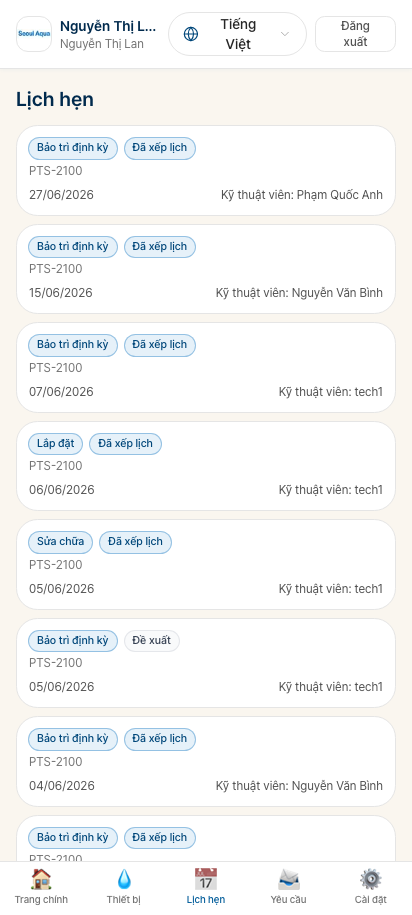

### 7.1 Phân biệt tab

- **Sắp tới** — Lượt thăm sắp đến (bảo trì định kỳ, v.v.)
- **Hoàn thành** — Lịch sử thăm đã qua
- **Hủy** — Bao gồm cả đổi lịch

### 7.2 Thẻ lượt thăm sắp tới

Hiển thị trên mỗi thẻ:

| Hạng mục | Nội dung |
|---|---|
| Ngày + Khung giờ | "15/06/2026 Sáng" |
| Loại lượt thăm | Bảo trì định kỳ / Sửa chữa, v.v. |
| Hạng mục công việc | "Thay lõi 1 + Lõi 2" |
| Tên KTV (khi đã gán) | "KTV: Kim Cheol-su" |
| Trạng thái | Sắp tới / Xác nhận / Đang tiến hành / Hoàn thành |

#### Yêu cầu đổi lịch

Quý khách có thể trực tiếp đổi lịch (có giới hạn):

1. Thẻ lượt thăm → Nút "**Yêu cầu đổi lịch**"
2. Chọn ngày mong muốn
3. Nhập lý do (tùy chọn)
4. **Gửi yêu cầu** → Được chuyển đến văn phòng Seoul Aqua

Văn phòng xác nhận và đổi sang lịch mới rồi thông báo lại qua SMS.

> **Từ 1 ngày trước lượt thăm không trực tiếp đổi được** — Hãy gọi điện văn phòng.

### 7.3 Lịch sử thăm đã hoàn thành

Chạm từng dòng:

- Tóm tắt nội dung công việc
- Danh sách phụ tùng đã thay + serial
- Nút **Tải PDF phiếu xác nhận công việc**
- Ảnh (KTV đã chụp trước/sau công việc)
- Số tiền thanh toán (nếu có) + PDF hóa đơn thu tiền

### 7.4 Giấy tờ giấy bạn sẽ nhận khi KTV đến (Phase 6 — 2026-06-03)

Tùy loại lượt thăm, KTV mang 1 tờ giấy đến và xin chữ ký. Bản sao giấy sẽ được KTV giao tận tay cho bạn 1 bản. Bản còn lại là bản công ty giữ (giấy được chia theo đường nét đứt).

| Tình huống lượt thăm | Giấy bạn sẽ nhận |
|---|---|
| Lắp đặt thuê (RENTAL) — Lần đầu | **Biên nhận thiết bị** + Bản sao **Hợp đồng** |
| Lắp đặt bán (SALE) — Lần đầu | **Hóa đơn bán hàng** + Bản sao **Hợp đồng** |
| Lắp đặt B2B | **Phiếu xuất kho B2B Mẫu 02-VT** + Bản sao **Hợp đồng** |
| Bảo trì định kỳ hộ gia đình | **Phiếu bảo trì hộ gia đình** — Kèm hóa đơn thu tiền |
| Bảo trì định kỳ B2B | **Phiếu xác nhận bảo trì B2B** — Không có giá, hóa đơn GTGT được gửi qua email riêng |
| Sửa chữa·Thay lõi·Di dời·Thu tiền·Khác | **Phiếu xác nhận công việc** |

> 💡 Nếu bạn lỡ mất bản sao giấy cũng không sao. Hãy gọi văn phòng (hoặc gửi tin nhắn qua portal), **bản PDF sẽ được gửi lại qua email**.

---

## Chương 8. Gửi yêu cầu dịch vụ

Tab **Yêu cầu** ở dưới màn hình.

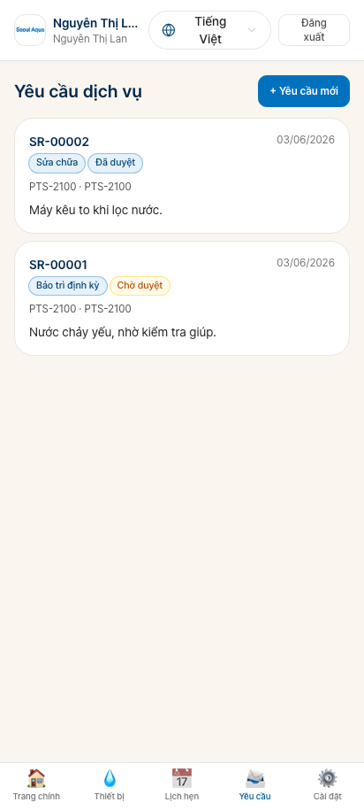

### 8.1 Có thể gửi yêu cầu nào?

| Loại | Tiếng Việt | Chi phí | Thời gian xử lý |
|---|---|---|---|
| **INSPECTION** | Kiểm tra | Miễn phí | Có lịch ngay (tự duyệt) |
| **CONSULTATION** | Tư vấn | Miễn phí | Văn phòng trả lời |
| **FAULT_REPORT** | Báo hỏng | Bảo hành/thuê miễn phí, khác có phí | Sau văn phòng đánh giá |
| **FILTER_REPLACEMENT_AD_HOC** | Thay lõi đột xuất | Thuê miễn phí, bán có phí | Sau văn phòng đánh giá |
| **PART_REPLACEMENT** | Thay phụ tùng | Có phí | Văn phòng đánh giá + Báo giá |
| **RELOCATION** | Di dời lắp đặt | Có phí | Văn phòng đánh giá + Báo giá |
| **OTHER** | Khác | Nhân viên phán đoán | Sau văn phòng đánh giá |

### 8.2 Gửi yêu cầu mới

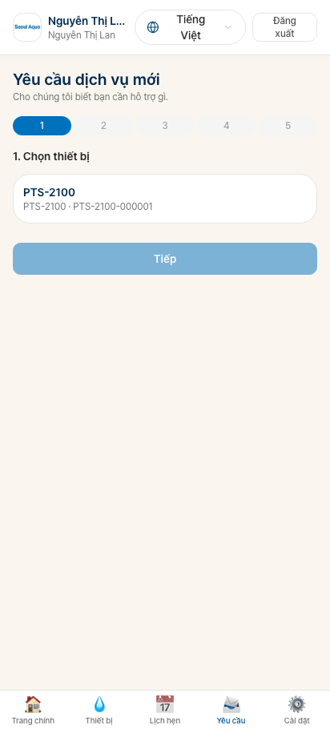

#### Bước 1: Chọn loại yêu cầu

Trên đầu màn hình chọn loại phù hợp với tình huống quý khách.

#### Bước 2: Nhập nội dung chi tiết

- **Mô tả** (bắt buộc): Viết tự do về vấn đề. Ví dụ: "Máy lọc nước không có nước", "Tôi muốn chuyển máy lọc nước sang địa chỉ mới do dời văn phòng."
- **Lịch mong muốn** (tùy chọn): Ngày và khung giờ có thể
- **Thiết bị liên quan** (tùy chọn): Thiết bị nào (chọn từ danh sách)

#### Bước 3: Đính kèm ảnh (khuyến nghị)

- Chụp ảnh phần hỏng hoặc tình trạng hiện tại
- Văn phòng chẩn đoán chính xác hơn
- Tối đa 5 ảnh

#### Bước 4: Gửi

Nút **Gửi yêu cầu** → Hệ thống tự xử lý.

### 8.3 Yêu cầu miễn phí — Tự duyệt

Các yêu cầu miễn phí như INSPECTION (kiểm tra), CONSULTATION (tư vấn) được **tự duyệt ngay**.

**Xử lý hệ thống**:
1. Hướng dẫn SMS ngay ("Tiếp nhận yêu cầu kiểm tra, lịch: ____")
2. Hướng dẫn chi tiết qua email
3. Lịch thăm tự sinh → Hiển thị trong tab "Lượt thăm" của quý khách

### 8.4 Yêu cầu có phí — Văn phòng đánh giá

Các yêu cầu có phí như PART_REPLACEMENT, RELOCATION cần văn phòng đánh giá.

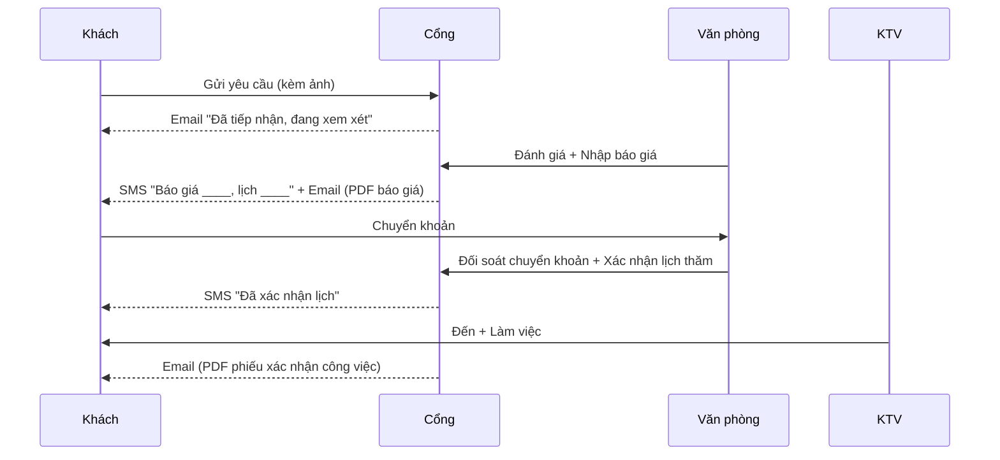

### 8.5 Xác nhận trạng thái yêu cầu

Trên tab **Yêu cầu** xem trạng thái các yêu cầu đã gửi:

| Trạng thái | Ý nghĩa |
|---|---|
| Tiếp nhận | Yêu cầu đã đến văn phòng |
| Tự duyệt | Yêu cầu miễn phí được xử lý ngay |
| Đang xem xét | Văn phòng đang đánh giá (có phí) |
| Đã duyệt | Báo giá + Lịch xác nhận |
| Từ chối | Văn phòng từ chối (kèm lý do) |
| Đã lên lịch | Lịch thăm xác nhận |
| Hoàn thành | Đã làm xong |
| Hủy | Khách hoặc văn phòng hủy |

### 8.6 Trao đổi tin nhắn trong yêu cầu

Trên trang chi tiết yêu cầu có **vùng tin nhắn**. Trao đổi thêm thông tin với văn phòng:

- Có thể đính kèm ảnh
- Tự làm mới mỗi 30 giây
- Tin nhắn mới của văn phòng được thông báo

### 8.7 Hủy yêu cầu

Khi đã gửi yêu cầu mà nghĩ lại không cần:

1. Chi tiết yêu cầu → Nút "**Yêu cầu hủy**"
2. Nhập lý do (tùy chọn)
3. **Trước khi duyệt thì hủy ngay**, đã có lịch thì cần văn phòng xác nhận

---

## Chương 9. Lịch sử thanh toán

Tab **Thanh toán** ở dưới màn hình.

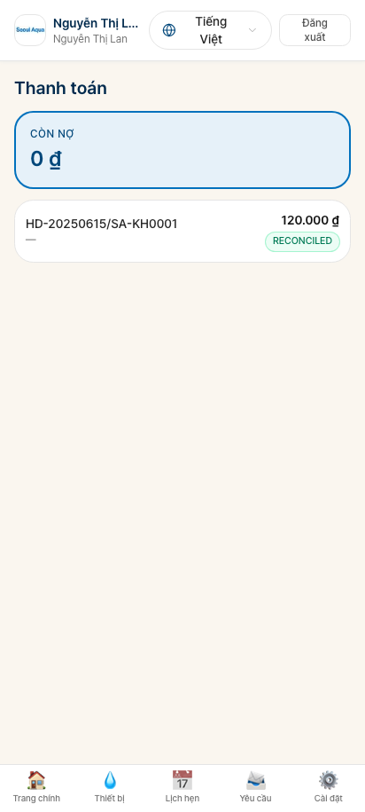

### 9.1 Cấu trúc màn hình

#### Tóm tắt thanh toán (trên cùng)

- **Số tiền chưa thanh toán tháng này**
- **Số tiền đã thanh toán tháng này**
- **Tổng công nợ tích lũy** (nếu có, hiện màu đỏ)

#### Lịch sử thanh toán (giữa)

Lịch sử thanh toán theo tháng theo thứ tự thời gian:

| Hạng mục | Nội dung |
|---|---|
| Tháng | "2026-06" |
| Loại | Tiền thuê / Phí bảo trì / Phí dịch vụ |
| Số tiền | VND |
| Trạng thái | Chờ / Đã nhận / Đã đối soát |
| PDF hóa đơn | Nút tải về |

### 9.2 Ý nghĩa trạng thái thanh toán

| Trạng thái | Tiếng Việt | Ý nghĩa |
|---|---|---|
| **PENDING** | Chờ | Chưa chuyển khoản hoặc thu |
| **RECEIVED** | Đã nhận | Seoul Aqua đã nhận chuyển khoản (chưa đối soát) |
| **RECONCILED** | Đã đối soát | Đã xác định hợp đồng·kỳ — Bình thường |
| **OVERDUE** | Quá hạn | Quá hạn thanh toán (từ D+7) |
| **WAIVED** | Miễn | Văn phòng xử lý miễn |

### 9.3 PDF hóa đơn

Trên mỗi dòng thanh toán đã đối soát có thể tải PDF hóa đơn. Tự gửi vào email quý khách (nếu không nhận, kiểm tra thư mục spam).

Nội dung hóa đơn:
- Thông tin công ty Seoul Aqua
- Thông tin quý khách
- Ngày thanh toán, Số tiền, Kỳ
- **Song ngữ Tiếng Việt + Tiếng Hàn/Anh**

---

## Chương 10. Chuyển khoản — Hướng dẫn nộp tiền

### 10.1 Chuyển khoản đến đâu?

Chạm vào dòng chưa thanh toán trên tab **Thanh toán** sẽ hiện **màn hình hướng dẫn chuyển khoản**:

#### Thông tin chuyển khoản

```
Ngân hàng: Vietcombank
Tài khoản: 0123456789
Chủ tài khoản: CÔNG TY TNHH MTV TM&DV ĐẠI Á
Chi nhánh: HCMC
```

#### Memo (tham chiếu) khi chuyển khoản

Khi chuyển khoản, hãy nhập **ô tham chiếu**:

```
KH00123 / HD-20260101-SA-KH00123
```

(Mã khách hàng + Mã hợp đồng của quý khách)

Cách này giúp văn phòng nhận biết ngay là khách nào.

### 10.2 Đối soát tự động

Sau khi chuyển khoản:

1. Văn phòng xác nhận tiền vào tài khoản
2. Đối soát tự động theo mã hợp đồng ghi trong memo (hoặc đối soát thủ công)
3. Trạng thái thanh toán trên màn hình quý khách tự chuyển sang **Đã đối soát**
4. **Email hóa đơn thu tiền tự gửi**

Thường xử lý trong 1~2 ngày làm việc.

### 10.3 Phương thức chuyển khoản khác

#### Tiền mặt — Khi KTV thăm

Khi KTV đến có thể thanh toán tiền mặt tại chỗ. Hóa đơn hiển thị màn hình hoặc email.

> Lưu ý: KTV chỉ thu được tiền cho lượt thăm của mình. Các hợp đồng khác phải chuyển khoản về văn phòng.

#### Thanh toán thẻ

Trong v1 **không hỗ trợ thẻ**. Sẽ thêm sau.

#### Tự động chuyển khoản

Trong v1 **không hỗ trợ**. Hàng tháng quý khách vui lòng chuyển khoản thủ công.

### 10.4 Khi chuyển khoản xong nhưng chưa đối soát

Sau 1~2 ngày làm việc mà chưa thấy thanh toán trên màn hình quý khách:

1. Chuẩn bị biên lai chuyển khoản (chụp app ngân hàng)
2. **Gọi điện hoặc email** văn phòng Seoul Aqua
3. Sau đối soát thủ công xử lý bình thường

---

## Chương 11. Nhận hóa đơn GTGT (B2B)

> Chương này chỉ dành cho **khách doanh nghiệp B2B**.

### 11.1 Tự động gửi

Khi Seoul Aqua phát hành hóa đơn GTGT:

1. **Tự gửi email đính kèm PDF** (cho Bên ký hợp đồng)
2. Cổng quý khách → Tab thanh toán → Hiển thị PDF hóa đơn GTGT trên dòng thanh toán liên quan

### 11.2 Lưu trữ hóa đơn GTGT

Hóa đơn GTGT lưu trữ **10 năm** (luật Việt Nam). Khuyến nghị quý khách tải về tự lưu.

### 11.3 Khi cần sửa thông tin hóa đơn GTGT

Khi thông tin tên doanh nghiệp·mã số thuế bị sai:

1. **Liên lạc văn phòng qua điện thoại hoặc email**
2. Phát hành sửa trên hệ thống e-Invoice ngoài
3. PDF mới được gửi lại vào email quý khách

> **Không sửa trực tiếp trong hệ thống được** — Phải qua hệ thống chính phủ e-Invoice Việt Nam.

### 11.4 Không nhận được hóa đơn GTGT

Nguyên nhân có thể:
- Kiểm tra **thư mục spam email**
- Email quý khách có thể chưa đăng ký trong hệ thống → Xác nhận "Thông tin của tôi" (Chương 13)
- Văn phòng có thể chưa phát hành → Gọi điện trực tiếp hỏi

---

## Chương 12. Quản lý liên hệ (chỉ Bên ký hợp đồng)

> Tính năng này chỉ **Bên ký hợp đồng** dùng được. Liên hệ vận hành không dùng được.

### 12.1 Quản lý liên hệ là gì?

Là tính năng thêm·sửa·xóa **Liên hệ vận hành (OPS_CONTACT)**.

#### Khi nào dùng?

- B2B có **nhân viên cơ sở mới vào**
- Hộ gia đình muốn **để vợ/chồng cũng đặt lịch thăm**
- Liên hệ cũ **thôi việc·thay thế**

### 12.2 Màn hình danh sách liên hệ

Tab **Thông tin của tôi** → **Liên hệ**

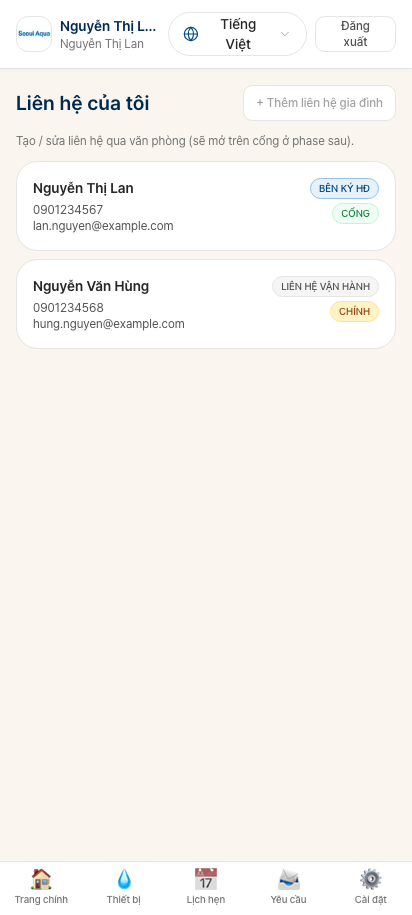

Tất cả liên hệ của công ty/gia đình quý khách hiển thị trên màn hình:

| Hạng mục hiển thị | Nội dung |
|---|---|
| Tên · Chức vụ | "Kim Cheol-su (Quản lý cơ sở)" |
| Vai trò | Bên ký hợp đồng / Liên hệ vận hành |
| Di động | Số điện thoại cá nhân |
| Email | (Nếu có) |
| Ngôn ngữ | KO / VI / EN |
| Cơ sở phụ trách (B2B) | "Nhà máy A" hoặc "Tất cả" |
| Trạng thái hoạt động | Bật/Tắt |

### 12.3 Thêm Liên hệ vận hành mới

#### Bước 1: Nút thêm

Nút **+ Thêm liên hệ mới** trên đầu màn hình.

#### Bước 2: Nhập thông tin

- **Tên** (bắt buộc)
- **Chức vụ** (ví dụ: "Quản lý cơ sở")
- **Di động** (bắt buộc) — Số điện thoại cá nhân
- **Email** (tùy chọn)
- **Ngôn ngữ** (bắt buộc): KO / VI / EN
- **Phạm vi phụ trách**:
  - "Toàn công ty" — Nhận thông báo tất cả cơ sở
  - "Cơ sở cụ thể" — Một cơ sở (khuyến nghị cho B2B nhiều cơ sở)
- **Kích hoạt cổng** (mặc định BẬT): Có cấp đăng nhập cổng cho liên hệ mới không

#### Bước 3: Lưu

Nút **Lưu** → Tự xử lý:

1. **SMS mật khẩu tạm thời tự gửi** đến di động liên hệ mới
2. Liên hệ mới đăng nhập lần đầu tại địa chỉ trong SMS → Đổi mật khẩu → Bắt đầu dùng
3. Liên hệ mới cũng nhận thông báo lượt thăm kế tiếp, hóa đơn, v.v.

### 12.4 Sửa thông tin liên hệ

Chạm thẻ liên hệ → Nút "**Sửa**".

Trường sửa được:
- Tên, Chức vụ, Email, Ngôn ngữ, Phạm vi phụ trách
- BẬT/TẮT kích hoạt cổng
- Đổi số di động cần yêu cầu văn phòng vì lý do bảo mật

### 12.5 Vô hiệu hóa liên hệ (xóa)

#### Vô hiệu hóa vs Xóa

- **Vô hiệu hóa**: Không đăng nhập cổng được, không nhận thông báo. Lịch sử cũ vẫn lưu.
- **Không xóa được**: Do lưu trữ Nhật ký Kiểm toán (24 tháng).

#### Các bước vô hiệu hóa

1. Thẻ liên hệ → Nút "**Vô hiệu hóa**"
2. Xác nhận
3. Ngay lập tức kết thúc mọi phiên, ngưng nhận thông báo

### 12.6 Không đổi được Bên ký hợp đồng

Nếu quý khách **muốn đổi Bên ký hợp đồng sang người khác**:

- **Không đổi được trên cổng** (ảnh hưởng pháp lý lớn)
- Yêu cầu **gọi điện hoặc email** văn phòng Seoul Aqua
- Văn phòng xem xét + Hướng dẫn thủ tục ký lại hợp đồng mới

---

## Chương 13. Đổi thông tin của tôi

Tab **Thông tin của tôi** ở dưới màn hình.

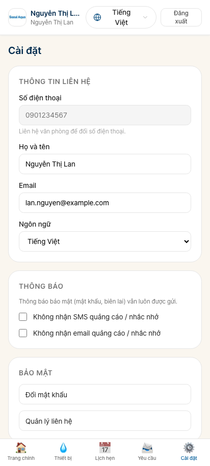

### 13.1 Thông tin hiển thị

- **Tên** (sửa được)
- **Chức vụ** (sửa được, chỉ Liên hệ vận hành)
- **Email** (sửa được)
- **Ngôn ngữ ưu tiên** (đổi được)
- **Di động** — Không sửa được vì bảo mật (cần yêu cầu văn phòng)

### 13.2 Cài đặt nhận thông báo (Opt-out)

Nếu thông báo quá nhiều có thể tắt một phần:

| Loại thông báo | Có thể opt-out? |
|---|---|
| SMS đặt lại mật khẩu | ❌ Luôn gửi vì bảo mật |
| Email hóa đơn thu tiền | ❌ Nghĩa vụ pháp lý |
| SMS D-1 bảo trì định kỳ | ✅ |
| Email D-14 bảo trì định kỳ | ✅ |
| Marketing (tương lai) | ✅ |

#### Các bước cài đặt Opt-out

1. Thông tin của tôi → "**Cài đặt thông báo**"
2. Bật/tắt loại muốn
3. Lưu

### 13.3 Đổi ngôn ngữ

Có thể đổi ngay bằng nút ngôn ngữ trên đầu màn hình. Lựa chọn cuối được giữ ở lần đăng nhập sau.

Cài đặt ngôn ngữ này cũng áp dụng cho **ngôn ngữ nội dung email·SMS**.

---

## Chương 14. Đổi và quên mật khẩu

### 14.1 Đổi mật khẩu

Thông tin của tôi → "**Đổi mật khẩu**".

1. Nhập **mật khẩu hiện tại**
2. **Mật khẩu mới** + Nhập lại lần nữa (tránh sai)
3. **Lưu**

#### Xử lý bảo mật tự động

Khi đổi mật khẩu tự động:

- **Đăng xuất mọi thiết bị khác**
- Nếu có người vô tình nhìn thấy điện thoại quý khách và đăng nhập trên thiết bị khác thì cũng tự bị kick — Cơ chế bảo mật

### 14.2 Quên mật khẩu

#### Tự xử lý

1. Màn hình đăng nhập → Link "**Quên mật khẩu**"
2. Nhập số điện thoại
3. **Nhận SMS mật khẩu tạm thời mới**
4. Đăng nhập bằng mật khẩu tạm thời → Đặt mật khẩu mới

#### Yêu cầu văn phòng Seoul Aqua

1. Gọi điện hoặc email văn phòng
2. Sau xác nhận, văn phòng gửi lại
3. Tương tự nhận SMS mật khẩu tạm thời → Đăng nhập → Đổi

---

## Chương 15. Các tình huống thường gặp

### Tình huống 1: "Máy lọc nước bỗng dưng không có nước"

Xử lý:
1. Cổng → Tab **Yêu cầu** → "**Yêu cầu mới**"
2. Loại: Chọn **FAULT_REPORT** (Báo hỏng)
3. Mô tả: "Máy lọc nước không có nước. Hôm qua vẫn bình thường"
4. Đính kèm ảnh (tình trạng thiết bị)
5. Gửi

**Hợp đồng thuê** thì miễn phí đi lại. Văn phòng xem xét rồi hướng dẫn lịch sớm.
**Hết bảo hành sau mua** có thể có phí — Văn phòng báo giá rồi tiến hành nếu đồng ý.

### Tình huống 2: "Tháng này tôi nghỉ phép, muốn dời bảo trì định kỳ sang tháng sau"

Xử lý:
1. Cổng → Tab **Lượt thăm** → Thẻ bảo trì định kỳ sắp tới
2. Nút "**Yêu cầu đổi lịch**"
3. Chọn lịch mong muốn hoặc nhập "Tuần này tháng sau"
4. Gửi

Văn phòng lập lịch mới và hướng dẫn qua SMS.

### Tình huống 3: "Dời văn phòng — Muốn chuyển máy lọc nước sang địa chỉ mới"

Xử lý:
1. Cổng → Tab **Yêu cầu** → "**Yêu cầu mới**"
2. Loại: **RELOCATION** (Di dời lắp đặt)
3. Mô tả: "Địa chỉ mới: ____. Ngày mong muốn dời: ____"
4. Văn phòng đánh giá → Báo giá SMS đến
5. Đồng ý thì chuyển khoản → Xác nhận lịch → KTV đến

### Tình huống 4: "Tôi quên mật khẩu"

Xử lý:
- Màn hình đăng nhập "**Quên mật khẩu**" hoặc gọi văn phòng
- Nhận mật khẩu tạm thời mới qua SMS → Đăng nhập → Đặt mật khẩu mới

### Tình huống 5: "Công ty có nhân viên phụ trách cơ sở mới" (B2B, chỉ Bên ký hợp đồng)

Xử lý:
1. Cổng → **Thông tin của tôi** → "**Liên hệ**"
2. "+ **Thêm liên hệ mới**"
3. Nhập thông tin liên hệ mới + Lưu
4. SMS mật khẩu tạm thời tự gửi cho liên hệ mới

### Tình huống 6: "Liên hệ vận hành cũ thôi việc"

Xử lý:
1. Cổng → Liên hệ → Thẻ liên hệ đó
2. Nút "**Vô hiệu hóa**"
3. Kết thúc mọi phiên + Ngưng nhận thông báo của người đó

### Tình huống 7: "Tôi đã thanh toán nhưng hệ thống chưa cập nhật"

Xử lý:
1. Chuẩn bị biên lai chuyển khoản (chụp app ngân hàng)
2. **Gọi điện hoặc email** văn phòng Seoul Aqua
3. Xử lý đối soát thủ công (thường ngay lập tức)

### Tình huống 8: "Sắp hết hạn thuê, tôi phải làm gì?"

Thông báo tự động bắt đầu từ 60 ngày trước hết hạn.

#### Lựa chọn 1 — Chuyển sang bảo trì (Thiết bị thuộc khách)

1. Link "Chuyển sang bảo trì" trong SMS hoặc email thông báo
2. Hoặc liên lạc trực tiếp văn phòng
3. Nhận hướng dẫn phí bảo trì hàng tháng mới → Đồng ý thì phát hành hợp đồng mới

#### Lựa chọn 2 — Kết thúc (Thu hồi thiết bị)

1. Thông báo "Tôi kết thúc" cho văn phòng
2. Lịch thăm thu hồi được lập → KTV đến lấy thiết bị

### Tình huống 9: "Tôi muốn nhận lại hóa đơn"

Xử lý:
- Tab **Thanh toán** → Dòng thanh toán đó → **Tải PDF hóa đơn**
- Cũng có thể xem trong email (tìm email tự gửi)

### Tình huống 10: "Tôi không nhận được hóa đơn GTGT" (B2B)

Xử lý:
1. Kiểm tra thư mục spam email
2. Gọi văn phòng → Yêu cầu gửi lại
3. Xác nhận thông tin email cá nhân (Thông tin của tôi)

### Tình huống 11: "Tôi không vào được cổng" (Không đăng nhập được)

Nguyên nhân có thể và cách xử lý:

- **Sai mật khẩu** → "Quên mật khẩu"
- **Khóa do 3 lần sai** → Đợi 1 giờ hoặc nhờ văn phòng
- **Tài khoản bị vô hiệu hóa** → Gọi văn phòng (Bên ký hợp đồng có thể đã vô hiệu hóa quý khách)
- **Vấn đề internet** → Kiểm tra Wi-Fi hoặc 4G

### Tình huống 12: "KTV đến muộn hơn giờ hẹn"

- Gọi trực tiếp KTV (thông tin KTV trên thẻ lượt thăm)
- Hoặc gọi văn phòng

### Tình huống 13: "Sau lượt thăm tôi không nhận được phiếu xác nhận công việc"

Xử lý:
- Kiểm tra thư mục spam email
- Cổng → Tab **Lượt thăm** → Lượt thăm đó → Tải PDF phiếu xác nhận công việc
- Vẫn không thấy thì gọi văn phòng

### Tình huống 14: "Có vẻ ai đó đã đăng nhập tài khoản tôi" (Nghi bảo mật)

Xử lý — **Ngay lập tức**:
1. Đổi mật khẩu ngay → Tự đăng xuất mọi thiết bị khác
2. Báo văn phòng Seoul Aqua
3. Văn phòng kiểm tra lịch sử đăng nhập + Xử lý thêm nếu cần

---

## Chương 16. Quy tắc sử dụng an toàn

### 16.1 Bảo vệ mật khẩu

- **Đừng cho ai biết** — Cả nhân viên Seoul Aqua cũng không hỏi mật khẩu quý khách
- Đừng viết y nguyên ra giấy
- Đừng dùng cùng mật khẩu với các website khác

### 16.2 Sau khi dùng thiết bị chung

- Nếu đã đăng nhập tại phòng máy tính, tablet chung thì **bắt buộc đăng xuất**
- Khi nhấn đăng xuất, thông tin cá nhân được xóa khỏi thiết bị đó

### 16.3 Tin nhắn khả nghi

- Seoul Aqua **không gửi SMS/email trực tiếp hỏi mật khẩu**
- Nghi tin nhắn giả mạo thì xác nhận trực tiếp bằng cách gọi văn phòng

### 16.4 Khi mất điện thoại

1. **Liên lạc văn phòng Seoul Aqua ngay**
2. Có thể buộc kết thúc mọi phiên tài khoản cá nhân
3. Trên điện thoại mới đăng nhập lại bằng "Quên mật khẩu"

---

## Chương 17. Khi cần trợ giúp

### 17.1 Việc tự xử lý được (trên cổng)

- Đổi·tìm mật khẩu
- Yêu cầu đổi lịch (trước 1 ngày)
- Yêu cầu dịch vụ mới
- Thêm·sửa Liên hệ vận hành (chỉ Bên ký hợp đồng)
- Sửa thông tin cá nhân

### 17.2 Việc cần liên lạc văn phòng

- Sửa nội dung hợp đồng
- Đổi Bên ký hợp đồng
- Sửa·gửi lại hóa đơn GTGT
- Khi chuyển khoản không đối soát được
- Đổi số điện thoại
- Khi nghi ngờ bảo mật tài khoản
- Khi tính năng không hoạt động

### 17.3 Liên hệ văn phòng Seoul Aqua

```
Tên công ty: CÔNG TY TNHH MTV TM&DV ĐẠI Á
Địa chỉ: Số 47 Hoàng Trọng Mậu, P. Tân Hưng, TP. Hồ Chí Minh
Điện thoại: (số công ty thực tế)
Email: cs@seoulaqua.com.vn
```

Giờ làm việc: Thứ 2 ~ Thứ 7, 08:00 ~ 18:00 (Nghỉ Chủ nhật·Ngày lễ)

---

## Phụ lục A. Danh mục thông báo SMS·Email

Danh sách tất cả thông báo tự động quý khách có thể nhận.

### SMS (bảo mật·khẩn cấp)

| Thời điểm | Nội dung |
|---|---|
| Ngay sau đăng ký | Mật khẩu tạm thời + Địa chỉ cổng |
| Khi đặt lại mật khẩu | Mật khẩu tạm thời mới |
| 1 ngày trước bảo trì định kỳ | Khung giờ + Thông tin KTV |
| Sau duyệt SR có phí | Số tiền + Lịch |
| Khi từ chối SR | Lý do từ chối |
| Quá 30 ngày công nợ | Thông báo mạnh |
| 7 ngày trước hết hạn thuê | Thông báo cuối |

### Email (hướng dẫn·hóa đơn chi tiết)

| Thời điểm | Nội dung + Đính kèm |
|---|---|
| Ngay sau tiếp nhận SR | Hướng dẫn đã tiếp nhận |
| Ngay sau hoàn thành lượt thăm | PDF phiếu xác nhận công việc |
| Ngay sau đối soát thanh toán | PDF hóa đơn thu tiền |
| Ngày 1 mỗi tháng | Hướng dẫn hóa đơn tháng này |
| Quá 7 ngày công nợ | Hướng dẫn công nợ (lần 1) |
| Quá 14 ngày công nợ | Hướng dẫn công nợ (lần 2) |
| 14 ngày trước lõi | Hướng dẫn sớm bảo trì định kỳ |
| 60 ngày trước hết hạn thuê | Hướng dẫn sớm hết hạn (lần 1) |
| 30 ngày trước hết hạn thuê | Hướng dẫn sớm hết hạn (lần 2) |
| Ngay sau phát hành hóa đơn GTGT | PDF hóa đơn GTGT (B2B) |

---

## Phụ lục B. Câu hỏi thường gặp (FAQ)

### Q1. Tôi chưa nhận được SMS đăng ký cổng

**A**: 
1. Đến trong 1~2 ngày làm việc sau ký hợp đồng
2. Kiểm tra thư mục tin nhắn spam
3. Xác nhận với văn phòng số điện thoại đã đăng ký đúng chưa
4. Yêu cầu văn phòng gửi lại

### Q2. Thành viên gia đình khác có thể dùng cổng không?

**A**: Có. Bên ký hợp đồng (chủ hộ, v.v.) thêm thành viên gia đình làm Liên hệ vận hành (xem Chương 12).

### Q3. Tôi mất điện thoại. Phải làm gì?

**A**: 
1. Liên lạc văn phòng Seoul Aqua ngay → Buộc kết thúc mọi phiên
2. Sau khi có điện thoại mới, dùng "Quên mật khẩu" nhận mật khẩu tạm thời mới → Đăng nhập → Đổi mật khẩu

### Q4. Tôi muốn nhận hóa đơn thu tiền·hóa đơn GTGT trên máy tính

**A**: Đăng nhập cùng địa chỉ (`seoulaqua.com.vn/login`) trên trình duyệt máy tính có thể tải PDF.

### Q5. Tôi muốn đổi vĩnh viễn lịch bảo trì định kỳ (sang cuối tuần mỗi tháng, v.v.)

**A**: Mời yêu cầu trực tiếp văn phòng. Văn phòng điều chỉnh mẫu bảo trì định kỳ của hợp đồng quý khách.

### Q6. Tôi muốn thanh toán bằng thẻ

**A**: Hiện v1 không hỗ trợ thẻ. Chỉ chuyển khoản hoặc tiền mặt. Sẽ thêm sau.

### Q7. Hướng dẫn bằng tiếng Hàn nhưng gia đình tôi chỉ nói tiếng Việt

**A**: Khi thêm gia đình làm Liên hệ vận hành đặt **ngôn ngữ là Tiếng Việt (VI)**. Thì gia đình đó nhận thông báo tiếng Việt.

### Q8. Tôi chuyển khoản nhầm (sang công ty khác)

**A**: Yêu cầu ngân hàng cá nhân hủy chuyển khoản ngay + Thông báo văn phòng. Nếu có thể, chặn được.

### Q9. Tôi muốn nhận lại bản sao hợp đồng

**A**: Yêu cầu gọi điện hoặc email văn phòng. Có thể gửi lại PDF.

### Q10. Tôi nghi ngờ bảo mật (có vẻ ai đó vào tài khoản tôi)

**A**: 
1. Đổi mật khẩu ngay (tự đăng xuất mọi thiết bị khác)
2. Báo văn phòng
3. Văn phòng kiểm tra lịch sử đăng nhập

### Q11. Một khách hàng có 3 máy lọc nước — Có thể chia sang các cơ sở khác nhau không? (B2B)

**A**: Có. Yêu cầu văn phòng bố trí theo từng cơ sở. Sau đó có thể chỉ định Liên hệ vận hành riêng cho từng cơ sở.

### Q12. Tôi nhận được SMS gửi 2 lần

**A**: Thỉnh thoảng do nhà mạng. Hệ thống hầu như không gửi trùng. Cùng nội dung thì bỏ qua.

---

Cảm ơn quý khách đã đồng hành cùng chúng tôi — Seoul Aqua kính chào.
