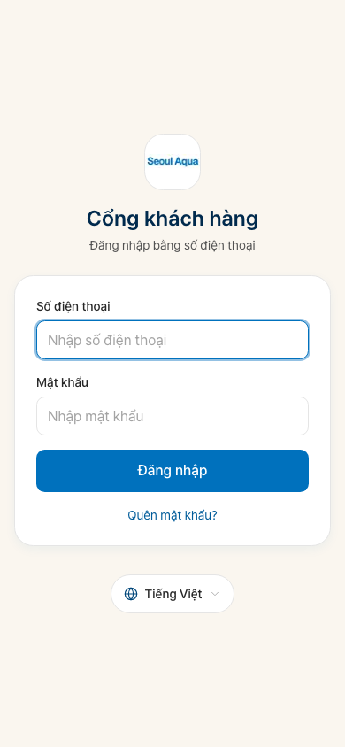
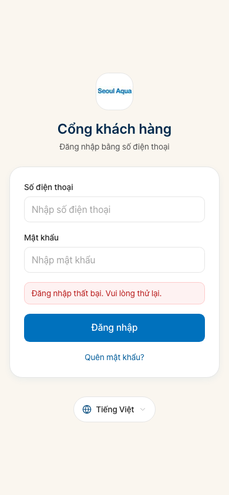
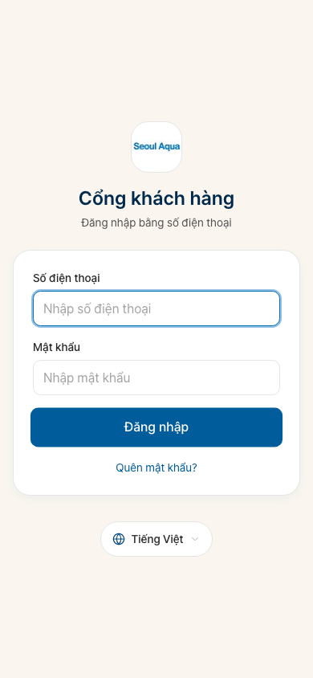

# Jake's Home Appliances SOMS — Hướng dẫn sử dụng Cổng Khách hàng

> Cập nhật lần cuối: Phản ánh cải tiến thiết bị, đại lý, đơn hàng và các loại lượt thăm mới (2026-07)

---

## Đối tượng hướng dẫn này

Hướng dẫn này dành cho khách hàng đang thuê, mua hoặc bảo trì máy lọc nước, máy lọc không khí, bồn cầu thông minh và các sản phẩm xử lý nước gia dụng từ Jake's Home Appliances. Sau khi đăng nhập vào Cổng Khách hàng (`portal.jakeshomeappliances.com.vn`), bạn có thể xem tình trạng thiết bị, lịch sử lượt thăm, gửi yêu cầu dịch vụ và xem lịch sử thanh toán.

Tài khoản Cổng Khách hàng được cấp cho Người ký hợp đồng (CONTRACT_PARTY) hoặc Liên hệ vận hành (OPS_CONTACT). Nếu chưa có tài khoản hoặc quên mật khẩu, hãy liên hệ văn phòng.

---

## Bạn có thể làm gì

- Đăng nhập / Đổi mật khẩu / Lấy lại mật khẩu đã quên
- Xem tóm tắt thiết bị, lịch lượt thăm và yêu cầu dịch vụ trên màn hình Trang chủ
- Xem danh sách và thông tin chi tiết thiết bị của bạn
- Xem lịch sử lượt thăm và tải Phiếu xác nhận công việc
- Gửi yêu cầu dịch vụ và theo dõi tiến trình xử lý
- Xem lịch sử thanh toán và số tiền còn nợ
- Tải hóa đơn GTGT (chỉ khách hàng B2B)
- Xem thông tin liên hệ
- Cài đặt thông báo và đổi mật khẩu (màn hình Cài đặt)

---

## 1. Đăng nhập

1. Mở `portal.jakeshomeappliances.com.vn` trên trình duyệt (hoặc ứng dụng đã thêm vào màn hình chính).
2. Nhập **Số điện thoại** và **Mật khẩu**, rồi nhấn **Đăng nhập**.

   

3. Nếu số điện thoại này được đăng ký với nhiều tài khoản, màn hình chọn tài khoản sẽ hiện ra. Chọn tên công ty (hoặc tên) phù hợp.

### Lần đầu đăng nhập bằng mật khẩu tạm thời

Ngay sau khi kích hoạt hợp đồng, bạn sẽ nhận được mật khẩu tạm thời (10 ký tự) qua SMS. Khi đăng nhập lần đầu, bạn phải đặt mật khẩu mới (tối thiểu 8 ký tự) ngay lập tức. Nếu chưa đặt, bạn không thể chuyển sang màn hình khác.

### Quên mật khẩu?

Nhấn vào liên kết **Quên mật khẩu?** ở cuối màn hình đăng nhập. Nhập số điện thoại và tên, hệ thống sẽ gửi mật khẩu tạm thời qua SMS đến số điện thoại đã đăng ký.

---

## 2. Trang chủ (Bảng điều khiển)

Sau khi đăng nhập, màn hình Trang chủ hiển thị ngay. Bất cứ lúc nào cũng có thể quay lại bằng cách nhấn **Trang chủ** trên thanh tab phía dưới.

| Thẻ | Nội dung |
|---|---|
| **Lượt thăm tiếp theo** | Ngày lượt thăm dự kiến gần nhất và tên KTV |
| **Yêu cầu đang xử lý** | Số yêu cầu dịch vụ chưa hoàn thành |
| **Số tiền còn nợ** | Tổng số tiền chưa thanh toán |
| **Thay lõi lọc tiếp theo** | Ngày thay lõi lọc dự kiến gần nhất |
| **Hoạt động gần đây** | Danh sách lượt thăm và yêu cầu gần đây |

---

## 3. Thiết bị

Nhấn tab **Thiết bị** ở thanh dưới để xem danh sách toàn bộ thiết bị đang có hợp đồng.

Mỗi thẻ thiết bị hiển thị tên sản phẩm, mẫu, ngày lắp đặt và trạng thái hiện tại (đang thuê, đã mua v.v.).

### Chi tiết thiết bị

Nhấp vào thẻ thiết bị để mở màn hình chi tiết.

- **Thông tin cơ bản**: Số serial, trạng thái, phân loại sở hữu (thuê/mua), ngày lắp đặt
- **Địa điểm** (khách hàng B2B): Tên địa điểm nơi thiết bị được lắp đặt
- **Lịch thay lõi lọc**: Ngày dự kiến thay tiếp theo và loại lõi lọc
- **Lịch sử lượt thăm**: Danh sách lượt thăm liên quan đến thiết bị này

---

## 4. Lượt thăm

Nhấn tab **Lượt thăm** để xem lịch sử lượt thăm.

Mỗi mục lượt thăm hiển thị ngày, tên KTV, loại lượt thăm (kiểm tra định kỳ, lắp đặt, sửa chữa, giao hàng tiêu hao v.v.) và trạng thái hoàn thành.

### Tải Phiếu xác nhận công việc

Nhấp vào lượt thăm đã hoàn thành để mở màn hình chi tiết. Nhấn nút **Tải Phiếu xác nhận công việc** để tải tài liệu PDF của lượt thăm đó.

---

## 5. Yêu cầu dịch vụ

Nhấn tab **Yêu cầu** để xem danh sách yêu cầu dịch vụ và gửi yêu cầu mới.

### Gửi yêu cầu dịch vụ mới

1. Nhấn nút **+ Yêu cầu mới**.

   

2. **1. Chọn thiết bị** — Chọn thiết bị gặp sự cố. Khách hàng B2B có thể chỉ định thêm địa điểm.
3. **2. Loại yêu cầu** — Chọn một trong: Kiểm tra, Sửa chữa, Thay phụ kiện, Di chuyển.
4. **3. Mô tả chi tiết** — Nhập triệu chứng hoặc nội dung yêu cầu (tối thiểu 10 ký tự).
5. **4. Đính kèm ảnh (tùy chọn)** — Đính kèm ảnh để xử lý nhanh hơn.
6. **5. Xem lại và Gửi** — Kiểm tra chi phí dự kiến (miễn phí/có phí) rồi nhấn **Gửi**.

### Thông tin chi phí dự kiến

| Hiển thị | Ý nghĩa |
|---|---|
| Miễn phí — Đã bao gồm trong hợp đồng | Trong phạm vi hợp đồng bảo trì/thuê, bảo hành, hoặc trong 90 ngày sau lắp đặt |
| Có phí — Văn phòng báo giá sau | Ngoài phạm vi hợp đồng. Văn phòng sẽ liên hệ sau khi kiểm tra báo giá. |

### Quy trình xử lý yêu cầu

- **Đã tiếp nhận** → Chờ văn phòng xem xét
- **Đang xem xét** → Văn phòng đang xử lý (bao gồm xác nhận báo giá nếu có phí)
- **Đã duyệt** → Đã lên lịch lượt thăm, thông báo qua SMS
- **Hoàn thành** → Lượt thăm đã hoàn thành

Nếu yêu cầu bị từ chối, lý do từ chối sẽ hiển thị và bạn sẽ nhận được thông báo qua SMS.

---

## 6. Thanh toán

Di chuyển đến `/payments` trong trình duyệt hoặc nhấn vào thẻ **Số tiền còn nợ** trên Trang chủ.

| Cột | Nội dung |
|---|---|
| **Ngày** | Ngày đến hạn hoặc ngày thanh toán |
| **Hợp đồng** | Số hợp đồng liên kết |
| **Dự kiến** | Số tiền được lập hóa đơn |
| **Đã thanh toán** | Số tiền thực tế đã trả |
| **Trạng thái** | Đã thanh toán, Chưa thanh toán, Quá hạn v.v. |

Thẻ **Số tiền còn nợ** ở đầu màn hình hiển thị tổng số tiền chưa thanh toán với font chữ đậm.

---

## 7. Hóa đơn GTGT (chỉ khách hàng B2B)

Khách hàng B2B có thể xem danh sách hóa đơn GTGT tại `/invoices` trong trình duyệt.

Mỗi mục hiển thị số hóa đơn, ngày phát hành và số tiền. Nhấn nút **Tải xuống** để tải file PDF.

Khách hàng B2C (hộ gia đình) không thấy menu này.

---

## 8. Liên hệ

Di chuyển đến `/contacts` trong trình duyệt.

Danh sách liên hệ được đăng ký với tài khoản của bạn.

| Vai trò | Mô tả |
|---|---|
| **Người ký hợp đồng** | Người ký hợp đồng, nhận hóa đơn GTGT và thông báo pháp lý |
| **Liên hệ vận hành** | Người nhận SMS lịch lượt thăm và biên lai |

Việc thay đổi thông tin liên hệ (thêm, xóa, sửa) hiện chưa được hỗ trợ trực tiếp trên Cổng. Vui lòng liên hệ nhân viên phụ trách để thay đổi.

---

## 9. Cài đặt

Nhấn tab **Cài đặt** ở thanh dưới hoặc di chuyển đến `/settings` trong trình duyệt.

### Sửa thông tin liên hệ

- Thay đổi **Tên, Email, Ngôn ngữ** rồi nhấn nút **Lưu thay đổi**.
- **Số điện thoại** không thể thay đổi trực tiếp trên Cổng. Hãy liên hệ văn phòng.

### Cài đặt thông báo

- **Từ chối nhận SMS quảng cáo/nhắc nhở**: Tích chọn để ngừng nhận SMS marketing và nhắc nhở.
- **Từ chối nhận Email quảng cáo/nhắc nhở**: Tích chọn để ngừng nhận Email marketing và nhắc nhở.

> Thông báo bảo mật và giao dịch (đặt lại mật khẩu, biên lai thanh toán) luôn được gửi bất kể tùy chọn từ chối.

### Đổi mật khẩu

1. Nhấn nút **Đổi mật khẩu** trong màn hình Cài đặt.
2. Nhập mật khẩu hiện tại.
3. Nhập mật khẩu mới (tối thiểu 8 ký tự) hai lần rồi nhấn **Đổi**.

---

## 10. Chuyển đổi ngôn ngữ

Tại bất kỳ màn hình nào, nhấn nút ngôn ngữ (KO / VI / EN) ở góc trên bên phải để thay đổi ngôn ngữ giao diện. Lưu ngôn ngữ mặc định trong Cài đặt để giữ nguyên sau khi đăng nhập lại.

---

## Giải thích thuật ngữ

| Thuật ngữ | Giải thích |
|---|---|
| Người ký hợp đồng | Người ký hợp đồng và nhận hóa đơn GTGT, thông báo pháp lý |
| Liên hệ vận hành | Người nhận SMS lịch lượt thăm và biên lai |
| Cổng khách hàng | Cổng khách hàng (`portal.jakeshomeappliances.com.vn`) |
| Mật khẩu tạm thời | Mật khẩu ban đầu 10 ký tự gửi qua SMS khi kích hoạt hợp đồng |
| Phiếu xác nhận công việc | Tài liệu xác nhận công việc sau khi KTV hoàn thành lượt thăm (PDF) |
| Số tiền còn nợ | Tổng số tiền chưa thanh toán |
| B2B | Khách hàng doanh nghiệp |
| B2C | Khách hàng hộ gia đình |

---

## Xử lý sự cố

| Triệu chứng | Giải pháp |
|---|---|
| Không thể đăng nhập | Kiểm tra lại số điện thoại và mật khẩu. Nếu đăng nhập sai 5 lần liên tiếp, tài khoản sẽ bị khóa. Dùng **Quên mật khẩu** hoặc liên hệ văn phòng. |
| Không nhận được SMS mật khẩu tạm thời | Hợp đồng có thể chưa được xử lý xong. Liên hệ văn phòng để xác nhận. |
| Không thấy thiết bị trong danh sách | Hợp đồng chưa được kích hoạt. Vui lòng xác nhận với văn phòng. |
| Không thấy menu Hóa đơn GTGT | Chức năng này chỉ dành cho khách hàng B2B. Khách hàng hộ gia đình (B2C) không thấy menu này. |
| Muốn sửa thông tin liên hệ | Hiện chưa hỗ trợ trực tiếp trên Cổng. Vui lòng liên hệ nhân viên phụ trách để thay đổi. |
| Trạng thái yêu cầu không thay đổi | Việc xử lý có thể mất thời gian. Bạn sẽ nhận thông báo qua SMS khi trạng thái thay đổi. |
