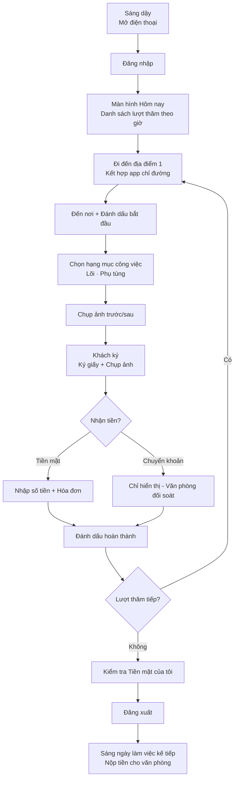
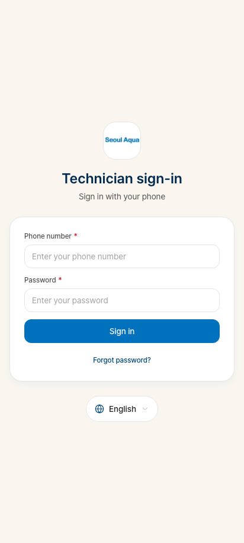
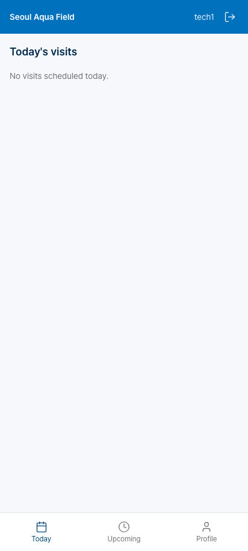
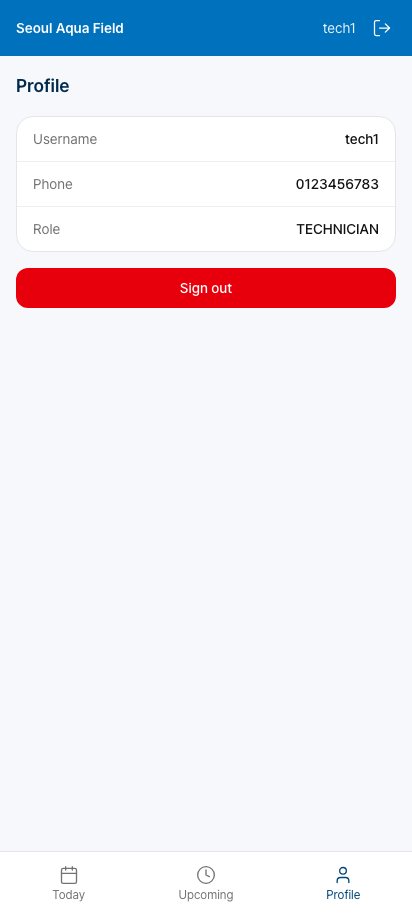

# Seoul Aqua SOMS — Hướng dẫn dành cho Kỹ thuật viên Hiện trường (Field Manual)

**Đối tượng**: Kỹ thuật viên (TECHNICIAN) — khoảng 80 người, chỉ dùng di động
**Phiên bản**: 2026-06-02
**Ngôn ngữ**: Tiếng Việt
**Tài liệu liên quan**: [Hướng dẫn Văn phòng](./office.md) · [Hướng dẫn Khách hàng](./customer.md)

Tài liệu này dành cho **kỹ thuật viên hiện trường** của Seoul Aqua. Mô tả chi tiết mọi màn hình và mọi bước công việc bạn sử dụng trên điện thoại hoặc tablet nhỏ.

---

## Mục lục

- [Chương 1. Bắt đầu](#chương-1-bắt-đầu)
- [Chương 2. Một ngày của KTV (tổng quan quy trình)](#chương-2-một-ngày-của-ktv-tổng-quan-quy-trình)
- [Chương 3. Đăng nhập và Màn hình đầu](#chương-3-đăng-nhập-và-màn-hình-đầu)
- [Chương 4. Màn hình "Hôm nay" — Việc hôm nay phải làm](#chương-4-màn-hình-hôm-nay--việc-hôm-nay-phải-làm)
- [Chương 5. Thẻ Lượt thăm — Thông tin một địa điểm](#chương-5-thẻ-lượt-thăm--thông-tin-một-địa-điểm)
- [Chương 6. Bắt đầu lượt thăm → Trình hướng dẫn hoàn thành (6 bước)](#chương-6-bắt-đầu-lượt-thăm--trình-hướng-dẫn-hoàn-thành-6-bước)
- [Chương 7. Chụp ảnh và tải lên](#chương-7-chụp-ảnh-và-tải-lên)
- [Chương 8. Lấy chữ ký khách hàng](#chương-8-lấy-chữ-ký-khách-hàng)
- [Chương 9. Thu thanh toán (hiện trường)](#chương-9-thu-thanh-toán-hiện-trường)
- [Chương 10. Hợp tác làm chung — KTV phụ](#chương-10-hợp-tác-làm-chung--ktv-phụ)
- [Chương 11. Gọi cho khách hàng](#chương-11-gọi-cho-khách-hàng)
- [Chương 12. Khi thiếu linh kiện hoặc khách vắng mặt](#chương-12-khi-thiếu-linh-kiện-hoặc-khách-vắng-mặt)
- [Chương 13. Kết thúc ngày và nộp tiền mặt](#chương-13-kết-thúc-ngày-và-nộp-tiền-mặt)
- [Chương 14. Các tình huống thường gặp](#chương-14-các-tình-huống-thường-gặp)
- [Chương 15. Khi không có Internet](#chương-15-khi-không-có-internet)
- [Chương 16. Lưu ý khi dùng tablet chung](#chương-16-lưu-ý-khi-dùng-tablet-chung)
- [Chương 17. Quy tắc bảo mật](#chương-17-quy-tắc-bảo-mật)
- [Phụ lục A. Tham khảo nhanh các loại lượt thăm](#phụ-lục-a-tham-khảo-nhanh-các-loại-lượt-thăm)
- [Phụ lục B. Thời gian làm việc trung bình theo model](#phụ-lục-b-thời-gian-làm-việc-trung-bình-theo-model)

---

## Chương 1. Bắt đầu

### 1.1 Cần điện thoại nào?

| Hạng mục | Khuyến nghị |
|---|---|
| **Hệ điều hành** | Android 8 trở lên, iPhone iOS 14 trở lên |
| **Kích thước màn hình** | 5~6 inch (chữ to dễ đọc) |
| **Camera** | 8 megapixel trở lên (chụp lõi lọc rõ nét) |
| **Internet** | LTE / 5G — 4G cũng được |
| **Bộ nhớ trống** | Từ 1GB trở lên (dùng để lưu tạm ảnh lượt thăm) |

### 1.2 SOMS mobile mở ở đâu?

Trên trình duyệt internet của điện thoại (Chrome, Safari):

```
https://soms.seoulaqua.com.vn/f/login
```

> **Không tải app.** Dùng trực tiếp trên trình duyệt. Nếu dùng nhiều, khuyến nghị **thêm vào màn hình chính** (menu trình duyệt → "Thêm vào màn hình chính").

### 1.3 Nhận lần đầu

Khi ADMIN tạo tài khoản, bạn nhận được 1 tin nhắn SMS:

```
Tài khoản kỹ thuật viên Seoul Aqua đã được tạo.
Mật khẩu tạm thời: ********
Đăng nhập: soms.seoulaqua.com.vn/f/login
```

Tin nhắn này **chỉ mình bạn** được xem. Tuyệt đối không tiết lộ mật khẩu cho người khác.

---

## Chương 2. Một ngày của KTV (tổng quan quy trình)

### 2.1 Cái nhìn tổng quan



### 2.2 Ví dụ một ngày

| Giờ | Hoạt động |
|---|---|
| 07:30 | Dậy, mở điện thoại xem "Hôm nay" |
| 08:00 | Đi đến khách hàng 1 |
| 08:30 | Đến khách hàng 1, bắt đầu trình hướng dẫn |
| 09:00 | Hoàn thành khách hàng 1 (làm khoảng 30 phút) |
| 09:15 | Đi đến khách hàng 2 (di chuyển khoảng 15 phút) |
| 09:30 | Đến khách hàng 2 |
| ... | ... |
| 17:30 | Hoàn thành lượt thăm cuối |
| 18:00 | Kiểm tra tiền mặt → Về |
| Sáng hôm sau 08:00 | Nộp tiền tại văn phòng |

### 2.3 Thời gian làm trung bình 1 lượt (tham khảo)

| Loại lượt thăm | Trung bình |
|---|---|
| INSTALLATION (lắp đặt) | 45~60 phút (tùy model) |
| PERIODIC (định kỳ) | 15~25 phút |
| FILTER_REPLACEMENT (thay lõi) | 15~20 phút |
| REPAIR (sửa chữa) | 20~60 phút (tùy loại hỏng) |
| RELOCATION (di dời lắp đặt) | 60~90 phút |
| RETRIEVAL (thu hồi) | 20~30 phút |

---

## Chương 3. Đăng nhập và Màn hình đầu

### 3.1 Màn hình đăng nhập



| Trường nhập | Nhập |
|---|---|
| **Số điện thoại** | Số điện thoại cá nhân (chỉ số, ví dụ: `0901234567`) |
| **Mật khẩu** | Mật khẩu cá nhân |

> Khác với nhân viên văn phòng, **chỉ đăng nhập bằng số điện thoại** (không nhận tên người dùng).

Nhấn nút **Đăng nhập** đợi một chút rồi chuyển đến màn hình "Hôm nay".

#### Đăng nhập lần đầu

Khi vào lần đầu bằng mật khẩu tạm thời, **màn hình đặt mật khẩu mới sẽ bắt buộc hiện ra**:

- Mật khẩu: 8 ký tự trở lên
- Xác nhận mật khẩu giống nhau (nhập 2 lần)
- **Lưu** → Lần sau đăng nhập bằng mật khẩu mới

> **Nếu không nhớ mật khẩu**, hãy ghi chú theo cách chỉ bạn hiểu (ví dụ: "biển số xe + 4 số cuối ngày sinh"). Đừng ghi y nguyên ra giấy.

### 3.2 Khi không đăng nhập được

| Triệu chứng | Nguyên nhân | Cách giải quyết |
|---|---|---|
| "Sai thông tin" | Sai mật khẩu | Thử lại (3 lần sai sẽ khóa 1 giờ) |
| "Sai vai trò" + thông báo đỏ | Vào nhầm trang văn phòng | Click nút "Đến trang đăng nhập KTV" |
| Quên mật khẩu | — | Gọi ADMIN/MANAGER văn phòng — Nhận SMS mật khẩu tạm thời mới |
| Tài khoản bị khóa | 3 lần thất bại | Tự mở khóa sau 1 giờ hoặc nhờ ADMIN |

### 3.3 Màn hình đầu = "Hôm nay"

Sau khi đăng nhập màn hình "Hôm nay" tự hiện ra. Đây là màn hình chính của KTV (xem Chương 4).

#### Menu dưới màn hình

| Biểu tượng | Tên | Mô tả |
|---|---|---|
| 📅 | **Hôm nay** | Việc làm hôm nay |
| 📆 | **Sắp tới** | Lịch ngày mai·tuần sau |
| 👤 | **Thông tin của tôi** | Thông tin cá nhân, Tiền mặt đang có, Đăng xuất |

---

## Chương 4. Màn hình "Hôm nay" — Việc hôm nay phải làm



### 4.1 Cấu trúc màn hình

Các địa điểm cần thăm hôm nay hiện ra dạng thẻ **theo thứ tự giờ**.

Thông tin hiển thị trên mỗi thẻ:

| Hạng mục | Ví dụ |
|---|---|
| **Khung giờ** | `09:00~11:00` hoặc `Sáng` |
| **Tên khách** | `Nguyễn Văn A` hoặc `㈜한국기업` |
| **Địa chỉ** | Địa chỉ rút gọn 1 dòng (chạm vào để xem đầy đủ) |
| **Loại lượt thăm** | "Bảo trì định kỳ" / "Lắp đặt" / "Sửa chữa", v.v. (phân biệt màu) |
| **Số thiết bị** | "Máy lọc nước × 3 cái" |
| **Số tiền dự kiến thu** | Chỉ hiển thị khi có (không có thì không hiện) |
| **Huy hiệu chia sẻ** | Khi được gán làm KTV phụ, hiển thị "Đã chia sẻ" |

### 4.2 Phân loại màu sắc

Viền trái thẻ có màu khác nhau tùy loại lượt thăm:

| Màu | Ý nghĩa |
|---|---|
| 🟢 **Xanh lục** | Bảo trì định kỳ (PERIODIC) — Miễn phí, thường xuyên |
| 🔵 **Xanh dương** | Lắp đặt (INSTALLATION) — Khách mới |
| 🟠 **Cam** | Sửa chữa (REPAIR) / Thay phụ tùng — Có phí, sau khi văn phòng đánh giá |
| 🟣 **Tím** | Di dời lắp đặt (RELOCATION) — Có phí, công việc lớn |
| 🔴 **Đỏ** | Thu hồi (RETRIEVAL) — Kết thúc RENTAL |
| ⚫ **Xám** | Được gán làm KTV phụ — Bạn không phải KTV chính |

### 4.3 Chạm vào thẻ → Chi tiết lượt thăm (Chương 5)

Chạm vào từng thẻ lượt thăm để xem thông tin chi tiết hơn và nút bắt đầu công việc.

### 4.4 Chỉ đường

**Chạm vào địa chỉ trên thẻ lượt thăm**:

- iOS: **Apple Maps** tự khởi chạy
- Android: **Google Maps** tự khởi chạy
- Cả hai tự dẫn đường từ vị trí của bạn → địa chỉ khách

### 4.5 Nếu hôm nay không có việc?

Màn hình trống hiện thông báo "Không có lượt thăm nào hôm nay". Trường hợp này:
- Văn phòng có thể chưa xếp lịch
- Hoặc bạn nghỉ (đã thông báo văn phòng trước)

Nếu phát sinh lượt thăm khẩn cấp, văn phòng sẽ xếp lịch mới và bạn nhận thông báo trên điện thoại.

---

## Chương 5. Thẻ Lượt thăm — Thông tin một địa điểm

### 5.1 Màn hình chi tiết lượt thăm

Chạm vào thẻ lượt thăm → Hiện các thông tin sau:

| Hạng mục | Mô tả |
|---|---|
| **Loại lượt thăm + Trạng thái** | Đầu màn hình |
| **Thông tin khách** | Tên, Tên công ty (B2B) |
| **Liên lạc** | Tên liên hệ vận hành + Nút "Gọi" |
| **Địa chỉ + Xem bản đồ** | Kết hợp app chỉ đường |
| **Khung giờ** | Giờ hẹn |
| **Lý do thăm** | "Thay lõi định kỳ", "Báo hỏng: Không có nước", v.v. |
| **Danh sách thiết bị** | Thiết bị sẽ làm trong lượt thăm này (kèm số serial) |
| **Lịch sử thăm trước** | Ngày kiểm tra cuối, nội dung công việc khi đó (để tham khảo) |
| **Ghi chú văn phòng** | Lưu ý đặc biệt (ví dụ: "Mã ra vào: #1234", "Có chó lớn", "Có thể từ 2 giờ chiều") |
| **KTV làm chung** | Hiện nếu có KTV phụ |
| Nút **Bắt đầu / Đổi lịch / Hủy** | Phía dưới |

### 5.2 Nút "Bắt đầu lượt thăm"

Khi đến nhà/công ty khách thì nhấn nút này. Khi nhấn:

- Trạng thái lượt thăm chuyển `SCHEDULED` → `IN_PROGRESS`
- Trên màn hình văn phòng cũng hiển thị "Đang tiến hành"
- Vào trình hướng dẫn bước 1 (Chương 6)

### 5.3 Đổi lịch

Khi khách bảo "Bây giờ không tiếp được":

1. Nút "**Đổi lịch**"
2. Chọn lý do (dropdown: `Khách yêu cầu`, `Khách vắng`, `Thời tiết xấu`, `Khác`)
3. Thông báo tự gửi đến văn phòng để xếp lịch mới
4. Bạn di chuyển sang lượt thăm tiếp

> Bạn **không tự ý chỉ định ngày mới**. Văn phòng sẽ trao đổi với khách để quyết định ngày mới. Bạn chỉ thông báo lý do.

### 5.4 Hủy

Khi khách bảo "Đừng đến nữa" hoặc văn phòng quyết định hủy:

1. Nút "**Hủy**"
2. Nhập lý do
3. Xác nhận → Trạng thái lượt thăm `CANCELLED`

> **Lượt thăm đã bắt đầu (IN_PROGRESS) không hủy được.** Thay vào đó hãy dùng "Cần thăm lại" hoặc "Hoàn thành" trong Chương 6.

---

## Chương 6. Bắt đầu lượt thăm → Trình hướng dẫn hoàn thành (6 bước)

Khi nhấn nút "**Bắt đầu**" trên thẻ lượt thăm, trình hướng dẫn khởi chạy. Cứ làm theo từng bước.

### 6.1 Bước 1: Đến nơi + Đánh dấu bắt đầu

Đến nơi chào khách, nhấn nút **"Đã đến + Bắt đầu"**.

- Tiến độ trên màn hình: `1 / 6`
- Tự ghi thời gian (giờ bắt đầu công việc)

### 6.2 Bước 2: Chọn hạng mục công việc

Chọn việc sẽ làm trong lượt thăm này.

#### Trường hợp bảo trì định kỳ (PERIODIC)

Mục đề xuất tự hiện ra (hệ thống tự tính theo chu kỳ thay lõi):

- ☑️ Thay lõi 1 (PARTCODE-001) — Đề xuất
- ☑️ Thay lõi 2 (PARTCODE-002) — Đề xuất
- ☐ Kiểm tra màng (PARTCODE-003) — Tùy chọn

**Bằng checkbox, chỉ giữ lại mục sẽ làm thực tế.** Khách từ chối hoặc thiếu phụ tùng thì bỏ chọn.

#### Trường hợp lắp đặt (INSTALLATION)

- Hiện danh sách thiết bị cần lắp
- Ô **nhập số serial** cho từng thiết bị (bắt buộc nhập)
- Ảnh vị trí lắp đặt (mục tùy chọn)

#### Trường hợp sửa chữa (REPAIR)

- Hiện triệu chứng khách đã báo
- Có thể chọn phụ tùng thay thế (văn phòng đã báo giá trước)

### 6.3 Bước 3: Chụp ảnh trước/sau

#### Ảnh trước khi làm

- Camera tự khởi chạy
- Ảnh khuyến nghị: Toàn cảnh thiết bị, biển số serial, vị trí lắp
- Khuyến nghị **từ 2 ảnh trở lên**

#### Ảnh sau khi làm

- Chụp sau khi xong để thấy phụ tùng mới
- Lõi mới thấy được số serial
- Khuyến nghị **từ 2 ảnh trở lên**

#### Tải ảnh lên

Khi chụp tự động tải lên server văn phòng. Internet yếu thì chờ chút.

**Khi offline**: Ảnh lưu tạm trên điện thoại, khi có internet tự tải lên (xem Chương 15).

### 6.4 Bước 4: Khách ký

Khách ký vào phiếu xác nhận công việc bằng giấy, sau đó **chụp ảnh giấy** và tải lên.

> Trong v1, **ký giấy + chụp ảnh** là phương thức chính thức. E-sign trực tiếp bằng ngón tay trên tablet sẽ thêm sau.

#### Khi không có giấy ký

Trước khi bắt đầu lượt thăm, xem trước PDF phiếu xác nhận công việc trên điện thoại → In sẵn mang theo, hoặc nếu khách ký giấy thì cũng được.

### 6.5 Bước 5: Thu thanh toán

Bước này chỉ hiện khi khách phải trả tiền.

#### Thông tin hiển thị trên màn hình

- **Số tiền dự kiến**: Hệ thống tự tính (số tiền theo hợp đồng)
- **Phương thức thu** (dropdown):
  - **Tiền mặt (CASH_AT_VISIT)**
  - **Đã chuyển khoản (BANK_TRANSFER)**

#### Thu tiền mặt

1. Nhận tiền mặt từ khách
2. **Nhập số tiền thực nhận**
3. Tùy chọn phát hành hóa đơn:
   - **In bằng máy in di động** (khi KTV có máy in di động)
   - **Hiển thị trên màn hình + mã QR**: Khách scan bằng điện thoại để lưu
4. Nếu khách có email thì **tự gửi thêm email hóa đơn**

#### Khi đã chuyển khoản

Nếu khách đã chuyển khoản trước thì chọn "Đã chuyển khoản". Trường hợp này bạn không nhận tiền. Văn phòng xử lý đối soát chuyển khoản.

#### Thu một phần (nợ)

Khi khách trả một phần và phần còn lại sẽ chuyển khoản tuần sau:

1. Nhập số tiền thực nhận (ít hơn dự kiến)
2. Tích **Đánh dấu thu một phần**
3. Thông báo tự gửi cho văn phòng để đối soát sau

### 6.6 Bước 6: Đánh dấu hoàn thành

Màn hình xác nhận cuối:

- Tóm tắt hạng mục công việc
- Số ảnh
- Có đính kèm chữ ký
- Số tiền thu

Khi nhấn nút **"Hoàn thành"**:
- Trạng thái lượt thăm `COMPLETED`
- **PDF phiếu xác nhận công việc tự sinh** → Lưu S3
- Tự gửi email PDF cho khách
- Tự tính lại ngày thay lõi (cho lịch định kỳ kế tiếp)
- Quay về màn hình "Hôm nay" → Nhấn mạnh thẻ lượt thăm tiếp

Xin chúc mừng — Đã xong 1 lượt! Di chuyển đến điểm tiếp theo.

### 6.7 Khi cần xem app khác giữa trình hướng dẫn

Khi khách nói chuyện khác bên cạnh, hoặc cần trả lời tin nhắn KakaoTalk, hoặc đi vệ sinh:

- Nút home điện thoại → Xem app khác rồi mở lại SOMS
- **Mọi giá trị đã nhập được giữ nguyên** (số tiền dự kiến, phụ tùng đã chọn, ghi chú, v.v.)

Đây là hành vi cố ý. Vì nếu thông tin đang làm việc đổi bất chợt sẽ thành sự cố lớn.

> **Tham khảo**: Các màn hình khác (ví dụ: danh sách khách của văn phòng) tự làm mới, nhưng **chỉ trình hướng dẫn hoàn thành lượt thăm được thiết kế đứng yên**.

---

## Chương 7. Chụp ảnh và tải lên

### 7.1 Tiêu chuẩn ảnh tốt

| Ảnh tốt | Ảnh xấu |
|---|---|
| Thấy toàn cảnh thiết bị | Chỉ cận cảnh |
| Số serial thấy rõ | Số serial bị cắt |
| Sáng và đúng nét | Tối hoặc rung |
| Thấy phần thay phụ tùng | Chụp chỗ khác |

### 7.2 Số ảnh khuyến nghị

| Loại lượt thăm | Tối thiểu | Khuyến nghị |
|---|---|---|
| INSTALLATION | 4 ảnh | 6~8 ảnh (vị trí lắp, trước/sau, serial) |
| PERIODIC | 2 ảnh | 3~4 ảnh (thiết bị + lõi mới) |
| REPAIR | 4 ảnh | 6 ảnh (phần hỏng trước/sau) |
| RELOCATION | 6 ảnh | 8~10 ảnh (vị trí cũ + vị trí mới) |
| RETRIEVAL | 3 ảnh | 4 ảnh (tình trạng trước khi thu hồi) |

### 7.3 Tự nén khi tải lên

- Trước khi tải tự nén **chất lượng 75%** (tiết kiệm bộ nhớ)
- Số serial v.v. vẫn đọc được rõ
- Internet yếu thì background tự thử tải lên

### 7.4 Chụp sai thì chụp lại

Mỗi ảnh có nút **"Xóa"** kế bên. Xóa ảnh sai và chụp lại.

> **Xóa ảnh đã tải lên** sẽ ghi vào văn phòng (Nhật ký Kiểm toán). Hãy chụp lại trung thực.

---

## Chương 8. Lấy chữ ký khách hàng

### 8.1 Chuẩn bị phiếu xác nhận công việc giấy

Trước khi đi xem trước **PDF phiếu xác nhận công việc** trên điện thoại → In ra mang theo:

1. Trên thẻ lượt thăm nhấn nút "**PDF phiếu xác nhận công việc**"
2. Xem trước PDF
3. In (bằng máy in di động hoặc in tại văn phòng trước)

Hoặc đến nhà khách rồi cho khách trực tiếp ký vào giấy.

### 8.2 Lấy chữ ký

Khách ký vào giấy → **Chụp ảnh giấy** → Tải lên.

#### Ảnh chữ ký tốt

- Thấy được toàn bộ chữ ký (không bị cắt)
- Tốt hơn nếu thấy được cả giấy (thấy được cả thông tin hợp đồng)
- Không bị phản chiếu ánh sáng

#### Chữ ký số (tương lai)

Tính năng khách trực tiếp dùng ngón tay ký trên tablet sẽ thêm sau. v1 hiện tại dùng phương thức chụp ảnh giấy.

### 8.3 Khi khách từ chối ký

Đôi khi khách nói "Hôm nay không có thời gian, lần sau ký":

1. Tích "**Hoãn chữ ký**"
2. Thông báo tự gửi cho văn phòng để xử lý lấy chữ ký vào lần thăm sau hoặc qua bưu điện
3. Lượt thăm vẫn được xử lý hoàn thành bình thường

> **Nhưng với lượt thăm có thu tiền, khuyến nghị có chữ ký**. Tránh tranh chấp hóa đơn.

---

## Chương 9. Thu thanh toán (hiện trường)

### 9.1 Các loại thanh toán

Thanh toán có thể nhận ở hiện trường:

| Loại | Bạn có nhận? |
|---|---|
| **CASH_AT_VISIT** (Tiền mặt) | ✅ Bạn thu |
| **BANK_TRANSFER** (Chuyển khoản) | ❌ Khách trực tiếp chuyển — Bạn chỉ hiển thị |
| **B2B_EINVOICE** | ❌ Văn phòng xử lý |
| **B2B_NO_INVOICE** | ❌ Văn phòng xử lý |

### 9.2 Các bước thu tiền mặt

#### Thông báo số tiền cho khách

"Phí làm việc hôm nay là ____" hoặc "Phí thuê tháng là ____."

Trên màn hình có hiện **số tiền dự kiến**, cứ thông báo theo đó.

#### Nhận tiền mặt

- Đếm tiền giấy chậm rãi
- Đếm lại trước mặt khách (xác minh kép)
- Cần tiền lẻ thì tự trả từ ví cá nhân

#### Nhập số tiền

- So sánh số tiền dự kiến hiện trên màn hình với số tiền nhận
- Khớp thì cứ tiến hành
- Không khớp thì sửa thành **số tiền thực nhận**

#### Phát hành hóa đơn

Khi có **máy in di động**:
- Nút "**In hóa đơn**" → In ngay

Khi không có máy in:
- Nút "**Hiển thị màn hình + QR**"
- PDF hóa đơn hiện trên màn hình
- Khách scan QR bằng điện thoại → Tải về

**Tự động email**:
- Nếu có email khách đã đăng ký thì tự gửi thêm email hóa đơn (background)

### 9.3 Lưu ý khi thu số tiền lớn

#### Từ 500.000 VND (khoảng 20 USD)

- Đếm **chậm rãi**
- Nghi ngờ tiền giả thì lịch sự "Cho phép tôi đổi tiền khác"
- Không hỗ trợ thanh toán thẻ trong v1 — Hướng dẫn chuyển khoản

#### Từ 1.000.000 VND

- Nếu có thể, **khuyến nghị chuyển khoản**
- Nếu là tiền mặt thì **cho vào phong bì và dán nhãn** ("Khách KH00123, 2026-06-02, 1,500,000 VND")
- Cẩn thận thất lạc trên đường về văn phòng

### 9.4 Thu một phần (nợ)

Khi khách nói "Tuần sau sẽ chuyển khoản phần còn lại":

1. Nhập số tiền nhận
2. Tích **"Thu một phần"**
3. Trong phần ghi chú "Phần còn lại ____ sẽ chuyển khoản ngày ____ tháng ____"
4. Hoàn thành → Văn phòng tự xử lý thành dòng công nợ

### 9.5 Yêu cầu hoàn tiền (ngay tại hiện trường)

Khi khách nói "Hoàn lại tiền tôi đã đóng trước":

- **Bạn không xử lý hoàn tiền**
- Hướng dẫn gọi văn phòng để ADMIN/MANAGER xử lý
- Trong ghi chú ghi lại yêu cầu của khách

---

## Chương 10. Hợp tác làm chung — KTV phụ

### 10.1 KTV phụ là gì?

Cơ sở B2B lớn (ví dụ: nhà máy có 50 máy lọc nước) thì 1 người không đủ. Văn phòng gán 2~5 người vào cùng lượt thăm.

- **KTV chính (Lead)** — 1 người, **bạn là người chịu trách nhiệm**
- **KTV phụ (Collaborator)** — 0~N người, đồng nghiệp giúp bạn

### 10.2 Khi bạn là KTV chính

- Thẻ hiện trên màn hình "Hôm nay" như thường
- Bắt đầu công việc → Tiến hành trình hướng dẫn như thường
- **Bạn có mọi trách nhiệm**: Ký, Thu tiền, Đánh dấu hoàn thành, Ký PDF phiếu xác nhận công việc

### 10.3 Khi bạn là KTV phụ

- Thẻ hiện trên màn hình "Hôm nay" với **huy hiệu "Đã chia sẻ" màu xám**
- Chạm vào thẻ vẫn xem được thông tin lượt thăm bình thường
- **Bạn có thể**:
  - Đánh dấu đến nơi
  - Thêm ảnh
  - Thêm ghi chú công việc
  - Ghi sử dụng phụ tùng
- **Bạn không thể**:
  - Đánh dấu hoàn thành → Chỉ KTV chính
  - Lấy chữ ký khách → Chỉ KTV chính
  - Thu thanh toán → Chỉ KTV chính

### 10.4 Khi KTV chính và phụ làm cùng

#### Trình tự khuyến nghị

1. KTV chính nhấn nút "**Bắt đầu**" → Tất cả KTV phụ cũng hiện trạng thái "Đang tiến hành"
2. Mỗi người làm thiết bị được phân
3. Mỗi người tự tích hạng mục công việc + Chụp ảnh trên điện thoại
4. Tất cả xong thì **KTV chính lấy chữ ký khách → Thu tiền → Đánh dấu hoàn thành**
5. KTV phụ thấy tin nhắn hoàn thành

#### Khi KTV phụ phải về sớm

KTV phụ làm xong việc của mình thì **cứ về thôi**. Ảnh và ghi chú đã được lưu. KTV chính xử lý phần còn lại.

### 10.5 Trao đổi giữa các KTV phụ

Trên màn hình có vùng "Các KTV khác" hiển thị ai đang làm cùng. Tính năng nhắn tin trực tiếp không có trong v1 — Khuyến nghị **gọi trực tiếp hoặc KakaoTalk**.

---

## Chương 11. Gọi cho khách hàng

### 11.1 Nút "Gọi" trên thẻ lượt thăm

Trên thẻ lượt thăm có nút **"Gọi cho khách hàng"**:

- Nhấn để tự động kết nối đến điện thoại của **Liên hệ vận hành**
- Không có Liên hệ vận hành thì đến **Bên ký hợp đồng**
- Cơ sở B2B thì ưu tiên **Liên hệ theo cơ sở**

### 11.2 Bảo vệ thông tin cá nhân

**Số điện thoại khách hàng không hiện trên màn hình**. Chỉ thấy nút "Gọi".

Lý do làm thế này:
- Số điện thoại khách lưu trong nhật ký cuộc gọi điện thoại bạn (bình thường)
- Nhưng có nguy cơ bạn cho người khác xem hoặc chụp lại → Rò rỉ thông tin cá nhân
- Cách này thì **chính bạn cũng không thấy** → Giảm nguy cơ rò rỉ ra ngoài

### 11.3 Email ở đâu?

Trên màn hình chi tiết lượt thăm có nút "**Gửi email**" (chỉ khi có). App mail cá nhân tự khởi chạy.

### 11.4 Khi nào nên gọi khách?

- **5 phút trước khi đến** — "Sắp đến nơi" (đặc biệt là khi sắp đến giờ hẹn B2C)
- **Đỗ xe / Khó vào** — "Cho tôi xin mã ra vào"
- **Phát hiện vắng mặt** — "Đến nơi rồi mà không có ai, mọi người ở đâu?"
- **Sau khi làm xong** — "Vị nước thế nào? Có gì khác lạ không?"

### 11.5 Khi không bắt máy

Đợi 10~15 phút rồi:

1. **Gọi văn phòng** → Văn phòng thử liên hệ khác phía khách
2. Vẫn không được → Nút "**Đổi lịch**" (lý do: `Khách vắng mặt`)
3. Di chuyển sang lượt thăm tiếp

---

## Chương 12. Khi thiếu linh kiện hoặc khách vắng mặt

### 12.1 Tình huống — Thiếu linh kiện

Đến nhà khách định làm việc thì:
- Không có lõi / phụ tùng cần thiết trên xe bạn
- Hoặc khách yêu cầu thay thêm phụ tùng nhưng không có tồn kho

#### Cách xử lý

1. Trong trình hướng dẫn đang chạy nhấn nút "**Cần thăm lại**"
2. Nhập lý do (dropdown):
   - `Thiếu tồn kho linh kiện`
   - `Cần tháo rời thiết bị — Không có dụng cụ`
   - `Cần khách đồng ý`
   - `Khác`
3. Xin lỗi khách: "Lần sau tôi sẽ mang linh kiện đến, thành thật xin lỗi"
4. Thông báo tự gửi đến văn phòng → Văn phòng chuẩn bị linh kiện + Lập lịch mới

Trạng thái lượt thăm: `NEEDS_REVISIT` → `SCHEDULED` (dòng mới).

### 12.2 Tình huống — Khách vắng mặt

Đến nơi mà:
- Không có ai trong khách hàng
- Gọi Liên hệ vận hành cũng không bắt máy

#### Cách xử lý

1. Chờ 10~15 phút (có thể khách muộn)
2. Gọi Liên hệ vận hành
3. Vẫn không được:
   - **Đề nghị thăm lại với lý do "Khách vắng mặt"**
   - Thông báo tự gửi văn phòng → Văn phòng trao đổi với khách rồi lập lịch mới

### 12.3 Tình huống — Khách từ chối làm việc

Đến nơi mà khách nói "Hôm nay không tiếp" hoặc "Tôi mong có KTV khác đến":

1. Lịch sự chào + Rời đi
2. Nút "**Đổi lịch**" hoặc "**Hủy**"
3. Ghi chi tiết vào phần ghi chú (để văn phòng tham khảo)
4. Không phải trách nhiệm của bạn — Văn phòng sẽ thảo luận lại với khách

### 12.4 Tình huống — Không thể đến chỗ khách (tai nạn, v.v.)

Xe bạn hỏng, tai nạn giao thông, kẹt xe, v.v.:

1. **Nếu trước khi bắt đầu lượt thăm** — Gọi văn phòng ngay. Văn phòng gán KTV khác hoặc đổi lịch.
2. **Nếu đã bắt đầu (đến hiện trường nhưng không làm được)** — Xử lý cần thăm lại.

---

## Chương 13. Kết thúc ngày và nộp tiền mặt

### 13.1 Sau lượt thăm cuối

Khi hoàn thành thẻ cuối của hôm nay, màn hình "Hôm nay" trở thành trống.

Giờ là lúc **kiểm tra tiền mặt bạn đã nhận**.

### 13.2 "Thông tin của tôi" → Tiền mặt đang có

Click **tab "Thông tin của tôi"** dưới màn hình:



Hiển thị:

| Hạng mục | Nội dung |
|---|---|
| **Tên · Chức vụ cá nhân** | "KTV Kim Cheol-su" |
| **Lượt thăm hoàn thành hôm nay** | 8 |
| **Tiền mặt cá nhân đã nhận (chờ nộp)** | 1,250,000 VND |
| **Chi tiết thu tiền** | Mỗi khách một dòng |
| Nút đăng xuất | Phía dưới |

### 13.3 Chuẩn bị phong bì tiền mặt

#### Cách khuyến nghị

1. Cho toàn bộ tiền mặt thu hôm nay vào 1 phong bì
2. Dán nhãn phong bì: Tên cá nhân + Ngày + Tổng số tiền
3. Bản sao hóa đơn vào cùng phong bì (nếu có)

#### Xác nhận tổng trên màn hình và phong bì khớp nhau

Tổng "Chờ nộp" hiện trên màn hình và tổng tiền mặt thực tế trong phong bì **phải bằng nhau**.

Khi có chênh lệch:
- Dành thời gian đếm lại từ từ
- Xác nhận có sót xử lý hóa đơn không
- Vẫn không khớp → Đến văn phòng kiểm tra cùng ADMIN

### 13.4 Đăng xuất

Trên điện thoại cá nhân:
- **Nếu không phải tablet chung** — Không cần đăng xuất (sáng hôm sau tiếp tục dùng luôn)
- **Nếu là tablet chung** — Bắt buộc đăng xuất (xem Chương 16)

### 13.5 Sáng ngày làm việc kế tiếp — Nộp tại văn phòng

Sáng ngày làm việc kế tiếp khi đến công ty (hoặc KTV không đến công ty thì ngày ghé văn phòng):

1. Đưa phong bì + Bản sao hóa đơn cho STAFF văn phòng
2. STAFF kiểm tra dòng cá nhân bạn trên màn hình + Khớp số tiền phong bì
3. STAFF tích "**Nhận**" → Bạn hoàn tất nộp

#### Cảnh báo tự động D+1 chưa nộp

Nếu đến ngày làm việc kế tiếp chưa mang đến, hệ thống **gửi cảnh báo tự động cho ADMIN**. Nguy cơ thất lạc + Không khớp kế toán nên hãy nộp nhanh.

### 13.6 Khi có chênh lệch, hãy trung thực

Nếu tiền mặt trong phong bì ít hơn tổng hệ thống — **đừng giấu**:

1. Báo cáo STAFF/MANAGER ngay khi đến văn phòng
2. Cùng đối chiếu hóa đơn và màn hình
3. Nếu là sai sót cá nhân thì thành thật thừa nhận (sai khi trả tiền lẻ, sót 1 hóa đơn, v.v.)
4. Nghi ngờ thất lạc·trộm cắp thì báo ADMIN ngay

> **Giấu rồi bị phát hiện sẽ là vấn đề lớn hơn**. Ai cũng có sai sót — Báo nhanh sẽ cùng giải quyết được.

---

## Chương 14. Các tình huống thường gặp

### Tình huống 1: Khách bảo "Mai không tiếp được"

- Bạn chỉ nhấn nút "**Đổi lịch**"
- Văn phòng trao đổi với khách để quyết định ngày mới
- Lượt thăm mới tự thêm vào lịch của bạn

### Tình huống 2: Thiếu linh kiện

- Nút "**Cần thăm lại**", lý do "Thiếu tồn kho linh kiện"
- Văn phòng chuẩn bị linh kiện + Lập lịch mới

### Tình huống 3: Khách yêu cầu thêm công việc ("Xem cái này nữa")

Tùy tình huống:

- **Kiểm tra·tư vấn đơn giản** — Làm ngay tại đó (miễn phí)
- **Thay thêm lõi hoặc phụ tùng** — Có phí phát sinh:
  - Tích "Công việc thêm" trong bước 2 trình hướng dẫn
  - Chi phí tự tính trên màn hình (giá theo hợp đồng)
  - Xác nhận khách đồng ý rồi tiến hành
- **Công việc lớn như di dời lắp đặt** — Không thể làm tại chỗ:
  - Hướng dẫn khách: "Mời gửi yêu cầu chính thức đến văn phòng để được báo giá"
  - Khách gửi yêu cầu RELOCATION trên cổng là được

### Tình huống 4: Khách bảo quên mật khẩu

- Bạn không xử lý mật khẩu
- Hướng dẫn khách: "Mời gọi điện văn phòng hoặc dùng 'Quên mật khẩu' của cổng khách"

### Tình huống 5: Khách muốn nhận lại ảnh hóa đơn

- Nếu vừa hoàn thành bước 6 trình hướng dẫn thì có thể hiển thị PDF hóa đơn lại trên màn hình
- Nếu đã chuyển sang lượt thăm tiếp:
  - Có khả năng đã tự gửi vào email khách — Hướng dẫn khách kiểm tra email
  - Hoặc gọi văn phòng yêu cầu gửi lại

### Tình huống 6: Giám đốc B2B nói "Anh KTV ơi, tôi muốn thêm 1 nhân viên làm Liên hệ mới"

- Bạn không xử lý
- Hướng dẫn khách: "Bên ký hợp đồng (giám đốc) vào cổng khách → Menu 'Quản lý liên hệ' để tự thêm" hoặc "Mời gọi văn phòng"

### Tình huống 7: Bạn làm mất điện thoại

- **Gọi ADMIN ngay**
- ADMIN buộc kết thúc mọi phiên của tài khoản bạn
- Nhận mật khẩu mới → Đăng nhập lại trên thiết bị khác

### Tình huống 8: Đồng nghiệp KTV bị hỏng điện thoại, mượn điện thoại bạn

- **Hãy từ chối**
- Nếu đồng nghiệp làm bằng tài khoản bạn thì mọi việc được ghi tên bạn
- Đồng nghiệp gây sự cố thì bạn chịu trách nhiệm
- Thay vào đó: Hướng dẫn đồng nghiệp gọi ADMIN để nhận điện thoại·đăng nhập tạm

### Tình huống 9: Không vào được nhà khách (chó, khóa thông minh, không biết mã)

- Gọi Liên hệ vận hành
- Không được thì đổi lịch lý do "**Khách vắng mặt**"

### Tình huống 10: Khách cùng khu vực yêu cầu kiểm tra thêm (chưa có lịch chính thức)

- Hướng dẫn "Mời yêu cầu văn phòng để lập lịch chính thức"
- Bạn không tự xử lý tại chỗ (nguy cơ thiếu sót Nhật ký Kiểm toán)

---

## Chương 15. Khi không có Internet

### 15.1 Giới hạn v1 — Ưu tiên online

Hệ thống v1 giả định **có trạng thái internet**. Chế độ offline hoàn toàn (Phase 7+) sẽ thêm sau.

### 15.2 Internet yếu (LTE thỉnh thoảng ngắt)

Đa số tự xử lý:
- Tải ảnh background thử lại
- Đánh dấu hoàn thành công việc tự gửi khi internet trở lại
- Màn hình tạm hiện "Đang đồng bộ" rồi biến mất

### 15.3 Hoàn toàn offline (không có internet)

#### Có thể làm

- Chụp ảnh (lưu vào thư viện điện thoại)
- Khi internet trở lại mở SOMS → Ảnh tự tải lên

#### Khó

- Xem thẻ lượt thăm mới (màn hình "Hôm nay" không mở)
- Xem thông tin khách (chỉ một phần đã cache)
- Phát hành hóa đơn thu thanh toán

#### Phương án thay thế

- Viết 1 tờ hóa đơn giấy đưa khách
- Khi internet trở lại nhập thông tin + Tải ảnh lên SOMS

### 15.4 Mẹo khi internet yếu

- **Đừng tắt màn hình khi đang tải** — Bắt đầu lại sẽ lâu hơn
- **Ảnh tải từng cái thay vì hàng loạt** — Hết 1 cái rồi đến cái tiếp
- **Dùng Wi-Fi hiện trường** — Xin phép khách dùng Wi-Fi (cơ sở B2B thường có)

---

## Chương 16. Lưu ý khi dùng tablet chung

### 16.1 Tablet chung là gì?

Tablet được nhiều KTV thay nhau dùng (ví dụ: 1 tablet để chung trên xe công ty).

### 16.2 Checklist trước khi dùng

1. **Xác nhận ai đang đăng nhập**
2. Nếu không phải tài khoản của bạn thì nhấn "**Đăng xuất**" rồi đăng nhập tài khoản bạn

### 16.3 Lưu ý khi dùng

- Dù người khác chỉ liếc qua, **đừng để tài khoản bạn ở đó**
- Khi rời chỗ hãy khóa màn hình hoặc đăng xuất

### 16.4 Sau khi dùng — Bắt buộc đăng xuất

- "Thông tin của tôi" → Nút "**Đăng xuất**"
- Tránh người dùng tiếp theo dùng tài khoản bạn

### 16.5 Tự dọn dẹp khi đăng xuất

Ngay khi nhấn đăng xuất, hệ thống tự động:
- Xóa thông tin khách bạn đã xem
- Xóa ảnh lưu tạm
- Xóa ghi nhận tiền nhận (lưu ở server, không ở thiết bị)

→ KTV tiếp theo đăng nhập **không thấy dấu vết của bạn**

> **Đây là tính năng bảo mật quan trọng nhất**. Càng là tablet chung càng phải đăng xuất mỗi lần.

---

## Chương 17. Quy tắc bảo mật

### 17.1 Tuyệt đối không được làm

#### Chia sẻ mật khẩu với đồng nghiệp

Mật khẩu cá nhân chỉ **mình bạn** biết. Cấm tuyệt đối "cho mượn tạm".

#### Để người khác làm bằng tài khoản bạn

Ghi vào Nhật ký Kiểm toán với tên bạn. Sai sót của đồng nghiệp là trách nhiệm bạn.

#### Để rò rỉ số điện thoại khách ra ngoài

Lý do không hiện trên màn hình là vậy. Nếu có trao đổi tin nhắn với khách thì cũng cấm chia sẻ ra ngoài.

#### Mất tiền mặt thì giấu

Lặng lẽ không mang về là tệ nhất. Hãy báo trung thực ngay.

### 17.2 Khuyến nghị

- **Đổi mật khẩu mỗi 2~3 tháng**
- **Khóa màn hình khi rời chỗ** (tablet chung)
- **Đặt mật khẩu điện thoại cá nhân cũng mạnh** (bảo vệ khi mất)
- **Khi ai hỏi thông tin tài khoản bạn** thì bỏ qua + báo ADMIN

### 17.3 Ứng phó ngay khi mất·trộm

- Mất điện thoại cá nhân → Gọi ADMIN ngay
- ADMIN buộc kết thúc mọi phiên của tài khoản bạn
- Đăng nhập lại trên điện thoại mới hoặc thiết bị tạm

### 17.4 Bảo mật tự động hệ thống

- **3 lần sai mật khẩu** → Tự khóa 1 giờ
- **Khi đổi mật khẩu** → Tự đăng xuất mọi thiết bị khác
- **Khi đăng xuất** → Tự dọn dẹp mọi dữ liệu trên thiết bị đó

---

## Phụ lục A. Tham khảo nhanh các loại lượt thăm

| Loại | Tiếng Việt | Ý nghĩa | Trách nhiệm bạn |
|---|---|---|---|
| INSTALLATION | Lắp đặt | Lắp máy lọc nước cho khách mới | Nhập đúng số serial |
| PERIODIC | Bảo trì định kỳ | Thay lõi, v.v. | Theo hạng mục tự đề xuất |
| FILTER_REPLACEMENT_AD_HOC | Thay lõi đột xuất | Khách yêu cầu | Mang linh kiện trước |
| REPAIR | Sửa chữa | Báo hỏng | Xác nhận triệu chứng khách trước |
| RELOCATION | Di dời lắp đặt | Chuyển sang vị trí khác | Đủ thời gian (60~90 phút) |
| RETRIEVAL | Thu hồi | Kết thúc RENTAL | Ảnh tình trạng thiết bị |
| OTHER | Khác | Yêu cầu đặc biệt từ văn phòng | Tham khảo ghi chú văn phòng |

## Phụ lục B. Thời gian làm việc trung bình theo model

(Giá trị trung bình, thay đổi tùy mức độ phối hợp của khách)

| Danh mục model | Bảo trì định kỳ | Lắp đặt | Thu hồi |
|---|---|---|---|
| Máy lọc nước gia dụng | 15~20 phút | 45~60 phút | 20 phút |
| Máy lọc không khí gia dụng | 10~15 phút | 30~45 phút | 15 phút |
| Bồn cầu thông minh gia dụng | 20~30 phút | 60~90 phút | 30 phút |
| Máy lọc nước B2B (1 cái) | 15~25 phút | 60~90 phút | 20~30 phút |
| Máy lọc nước B2B (10 cái) | 90~120 phút | 4~6 giờ | 60~90 phút |

---

## Khi cần trợ giúp

- **Không đăng nhập được** → Gọi ADMIN/MANAGER
- **Hệ thống chạy lạ** → Chụp màn hình + Gửi ADMIN
- **Bối rối khi làm việc** → Gọi STAFF văn phòng (hướng dẫn realtime)
- **Chênh lệch tiền mặt** → Báo ADMIN/MANAGER văn phòng ngay

Hôm nay cũng an toàn — Đội ngũ vận hành Seoul Aqua.
