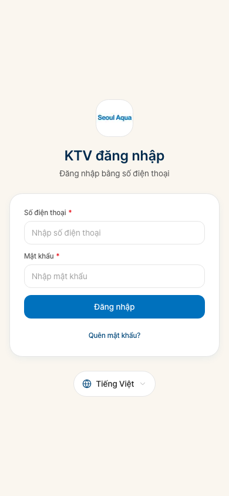
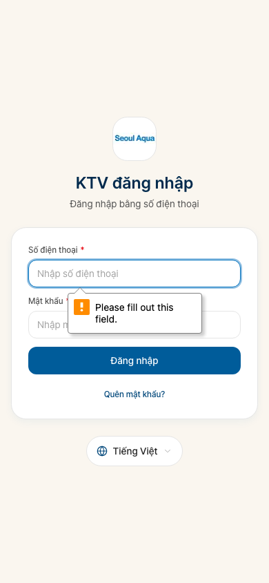
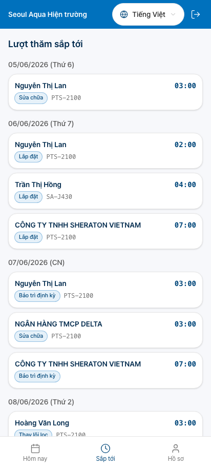

# Seoul Aqua SOMS — Hướng dẫn dành cho Kỹ thuật viên

**Đối tượng**: Kỹ thuật viên (TECHNICIAN) — khoảng 80 người, chỉ dùng trên điện thoại
**Phiên bản**: 2026-07 (cập nhật lượt thăm nhiều loại, giao hàng tiêu hao, KTV hỗ trợ)
**Ngôn ngữ**: Tiếng Việt
**Tài liệu liên quan**: [Hướng dẫn Văn phòng](./office.md) · [Hướng dẫn Khách hàng](./customer.md)

---

## Mục lục

- [Chương 1. Bắt đầu](#chương-1-bắt-đầu)
- [Chương 2. Một ngày làm việc (tổng quan)](#chương-2-một-ngày-làm-việc-tổng-quan)
- [Chương 3. Đăng nhập](#chương-3-đăng-nhập)
- [Chương 4. Màn hình "Hôm nay" — Công việc trong ngày](#chương-4-màn-hình-hôm-nay--công-việc-trong-ngày)
- [Chương 5. Màn hình "Sắp tới" — Lịch công việc tiếp theo](#chương-5-màn-hình-sắp-tới--lịch-công-việc-tiếp-theo)
- [Chương 6. Màn hình Chi tiết Lượt thăm](#chương-6-màn-hình-chi-tiết-lượt-thăm)
- [Chương 7. Hướng dẫn theo từng loại lượt thăm](#chương-7-hướng-dẫn-theo-từng-loại-lượt-thăm)
- [Chương 8. Quy trình Bắt đầu → Hoàn thành lượt thăm](#chương-8-quy-trình-bắt-đầu--hoàn-thành-lượt-thăm)
- [Chương 9. Chụp ảnh và Tải lên](#chương-9-chụp-ảnh-và-tải-lên)
- [Chương 10. Lấy chữ ký khách hàng](#chương-10-lấy-chữ-ký-khách-hàng)
- [Chương 11. Thu tiền tại hiện trường](#chương-11-thu-tiền-tại-hiện-trường)
- [Chương 12. KTV hỗ trợ (làm việc nhóm)](#chương-12-ktv-hỗ-trợ-làm-việc-nhóm)
- [Chương 13. Xử lý lượt thăm giao hàng tiêu hao](#chương-13-xử-lý-lượt-thăm-giao-hàng-tiêu-hao)
- [Chương 14. Liên hệ với khách hàng](#chương-14-liên-hệ-với-khách-hàng)
- [Chương 15. Khách vắng mặt, thiếu phụ kiện và tình huống đặc biệt](#chương-15-khách-vắng-mặt-thiếu-phụ-kiện-và-tình-huống-đặc-biệt)
- [Chương 16. Kết thúc ngày và Bàn giao tiền mặt](#chương-16-kết-thúc-ngày-và-bàn-giao-tiền-mặt)
- [Chương 17. Quản lý Hồ sơ](#chương-17-quản-lý-hồ-sơ)
- [Chương 18. Các tình huống thường gặp](#chương-18-các-tình-huống-thường-gặp)
- [Phụ lục A. Tra cứu nhanh loại lượt thăm](#phụ-lục-a-tra-cứu-nhanh-loại-lượt-thăm)

---

## Chương 1. Bắt đầu

### 1.1 Cần thiết bị gì?

| Mục | Khuyến nghị |
|---|---|
| Hệ điều hành | Android 8+ hoặc iPhone iOS 14+ |
| Màn hình | Từ 5–6 inch trở lên |
| Camera | Từ 8 megapixel (để chụp lõi lọc) |
| Internet | LTE/5G hoặc 4G |

### 1.2 Địa chỉ ứng dụng KTV

Mở Chrome hoặc Safari trên điện thoại:

```
https://soms.seoulaqua.com.vn/f/vi/login
```

> **Không cần tải ứng dụng.** Dùng ngay trên trình duyệt. Để truy cập nhanh, thêm vào Màn hình chính (menu trình duyệt → Thêm vào màn hình chính).

### 1.3 Thông tin cần nhận lúc đầu

Khi quản trị viên tạo tài khoản, bạn nhận được một SMS:

```
Tài khoản kỹ thuật viên Seoul Aqua đã được tạo.
Mật khẩu tạm thời: ********
Đăng nhập: soms.seoulaqua.com.vn/f/login
```

Giữ SMS này cho bản thân. Tuyệt đối không chia sẻ mật khẩu với người khác.

---

## Chương 2. Một ngày làm việc (tổng quan)

```
Sáng → Đăng nhập → Kiểm tra màn hình Hôm nay
  → Xuất phát đến điểm thăm đầu tiên
  → Đến nơi → Bấm "Bắt đầu"
  → Chọn hạng mục công việc (lõi lọc, phụ kiện)
  → Chụp ảnh trước/sau
  → Lấy chữ ký khách hàng (dạng số)
  → Thu tiền (nếu có)
  → Bấm "Hoàn thành"
  → Lặp lại cho điểm tiếp theo
  → Trước khi về: Kiểm tra tổng tiền thu
  → Đăng xuất (bắt buộc nếu dùng điện thoại chung)
  → Sáng hôm sau: Bàn giao tiền mặt cho văn phòng
```

---

## Chương 3. Đăng nhập



Trang đăng nhập KTV: `/f/vi/login`

| Trường | Mô tả |
|---|---|
| Số điện thoại | Số di động cá nhân |
| Mật khẩu | Mật khẩu tạm thời hoặc mật khẩu đã đổi |

**Lần đầu đăng nhập**: Sau khi đăng nhập bằng mật khẩu tạm thời, màn hình đổi mật khẩu sẽ hiện ra ngay. Đặt mật khẩu mới tối thiểu 8 ký tự.

**Quên mật khẩu**: Liên hệ văn phòng. Quản trị viên sẽ gửi mật khẩu tạm thời mới qua SMS.

> Nếu dùng tài khoản KTV để đăng nhập vào ứng dụng văn phòng (`/o/login`), hệ thống sẽ tự hướng dẫn bạn đến đúng ứng dụng KTV.

---

## Chương 4. Màn hình "Hôm nay" — Công việc trong ngày



Sau khi đăng nhập, danh sách lượt thăm được phân công trong ngày hiển thị theo thứ tự thời gian.

Mỗi thẻ lượt thăm hiển thị:
- **Tên và địa chỉ khách hàng**
- **Loại lượt thăm** (Lắp đặt, Kiểm tra định kỳ, Giao hàng tiêu hao v.v.)
- **Giờ hẹn**
- **Huy hiệu trạng thái** (Theo kế hoạch / Đang thực hiện / Hoàn thành)
- Lượt thăm nhiều loại hiển thị cả loại bổ sung (ví dụ: Kiểm tra định kỳ + Giao hàng tiêu hao)

**Lượt thăm cùng nhóm**: Lượt thăm bạn tham gia với tư cách KTV hỗ trợ có huy hiệu "**Cùng làm việc**".

Nhấp vào thẻ để vào màn hình chi tiết.

---

## Chương 5. Màn hình "Sắp tới" — Lịch công việc tiếp theo



Hiển thị các lượt thăm được lên kế hoạch từ ngày mai trở đi, sắp xếp theo ngày. Dùng để chuẩn bị phụ kiện trước hoặc tìm đường đi.

---

## Chương 6. Màn hình Chi tiết Lượt thăm


Nhấp vào thẻ lượt thăm để mở màn hình chi tiết.

### Phần trên — Tóm tắt lượt thăm

- Tên khách hàng, địa chỉ, loại lượt thăm
- Giờ hẹn và trạng thái

### Phần Liên hệ khách hàng

- Số điện thoại liên hệ chính (nhấp để gọi điện)
- Không gọi trực tiếp cho khách — liên hệ qua văn phòng ([Chương 14](#chương-14-liên-hệ-với-khách-hàng))

### Phần Thiết bị

- Danh sách thiết bị cần xử lý trong lượt thăm này
- Tên mẫu, số serial, ngày kiểm tra gần nhất

### Phần Vật tư tiêu hao (chỉ lượt thăm giao hàng tiêu hao)

- Danh sách hàng hóa từ đơn hàng liên kết
- Số lượng và đơn giá từng mặt hàng

### Phần Hạng mục công việc

- Danh sách kiểm tra thay lõi lọc
- Ghi chép thay phụ kiện

### Phần Ảnh

- Ảnh trước/sau (tối đa 10 ảnh)

### Phần Chữ ký


- Khách hàng ký trực tiếp bằng ngón tay trên màn hình

### Thanh hành động phía dưới

- Nút **Bắt đầu** → Đánh dấu bắt đầu khi đến nơi
- Nút **Hoàn thành** → Sau khi hoàn tất mọi công việc

---

## Chương 7. Hướng dẫn theo từng loại lượt thăm

### 7.1 Lắp đặt (INSTALLATION)

Lượt thăm lắp đặt thiết bị mới.

Cần mang theo:
- Thiết bị và dụng cụ lắp đặt
- Hợp đồng + PDF Phiếu giao nhận (văn phòng in sẵn)

Lấy chữ ký khách hàng trên phiếu giao nhận sau khi kiểm tra xong.

### 7.2 Kiểm tra định kỳ (PERIODIC_INSPECTION)

Lượt thăm hàng tháng hoặc 2 tháng/lần.

Quy trình:
1. Kiểm tra tình trạng lõi lọc → Tích chọn hạng mục cần thay
2. Chụp ảnh trước/sau
3. Lấy chữ ký khách hàng
4. Thu tiền (phí thuê hoặc phí lõi lọc nếu có)

### 7.3 Giao hàng tiêu hao (CONSUMABLE_DELIVERY)

Lượt thăm giao vật tư (bộ lõi lọc, phụ kiện v.v.) cho khách hàng. Có thể thực hiện cùng lúc với kiểm tra định kỳ.

Quy trình:
1. Kiểm tra phần "**Vật tư tiêu hao**" trong chi tiết lượt thăm để xác nhận hàng hóa
2. Đối chiếu với hàng thực tế mang đến
3. Khách hàng xác nhận xong → Lấy chữ ký
4. Thu tiền (tiền mặt hoặc chuyển khoản sau)

> Chứng từ giao hàng tiêu hao được chọn tự động theo loại khách: B2C → Biên lai bán hàng, B2B → Phiếu xuất kho (Mẫu 02-VT). Văn phòng in sẵn để KTV mang theo.

### 7.4 Sửa chữa (REPAIR)

Thực hiện theo báo cáo sự cố hoặc chỉ thị văn phòng. Xác nhận với văn phòng về phụ kiện cần dùng trước khi xuất phát.

### 7.5 Thay lõi lọc (FILTER_REPLACEMENT)

Lượt thăm chỉ thay lõi lọc, tách biệt với kiểm tra định kỳ. Bắt buộc chụp ảnh sau khi thay.

### 7.6 Thu hồi thiết bị (RETRIEVAL)

Lượt thăm thu hồi thiết bị sau khi hết hợp đồng thuê.

- Đóng gói thiết bị cẩn thận trước khi mang về
- Bàn giao cho văn phòng để nhập kho

---

## Chương 8. Quy trình Bắt đầu → Hoàn thành lượt thăm


1. **Đến nơi**: Mở thẻ lượt thăm sau khi đến nhà/văn phòng khách hàng
2. **Bấm "Bắt đầu"**: Ghi lại thời gian đến
3. **Tích hạng mục công việc**: Chọn lõi lọc, phụ kiện đã thay/xử lý
4. **Chụp ảnh**: Tải ảnh trước và sau ([Chương 9](#chương-9-chụp-ảnh-và-tải-lên))
5. **Lấy chữ ký**: Khách hàng ký trên màn hình ([Chương 10](#chương-10-lấy-chữ-ký-khách-hàng))
6. **Thu tiền**: Nhập số tiền nếu thu tiền mặt ([Chương 11](#chương-11-thu-tiền-tại-hiện-trường))
7. **Bấm "Hoàn thành"**:
   - Văn phòng nhận thông báo tự động
   - Hệ thống tự gửi email Phiếu xác nhận công việc cho khách hàng

> **Không thể sửa sau khi hoàn thành.** Nếu có sai sót, liên hệ văn phòng ngay lập tức.

---

## Chương 9. Chụp ảnh và Tải lên

Chi tiết lượt thăm → phần "**Ảnh**"

### Ảnh cần chụp

| Bắt buộc | Nội dung |
|---|---|
| Trước | Tình trạng lõi lọc hoặc thiết bị (trước khi thay) |
| Sau | Lõi lọc mới hoặc sau khi lắp đặt xong |

Tùy tình huống thêm:
- Cận cảnh phụ kiện hỏng (khi sửa chữa)
- Toàn cảnh môi trường lắp đặt (lần đầu lắp đặt)

### Cách tải lên

1. Nhấn "**Thêm ảnh**"
2. Chọn "**Chụp ảnh**" hoặc "**Chọn từ thư viện**"
3. Chọn ảnh → Tự động tải lên (cần Internet)

> Nếu ảnh mờ hoặc quá tối, hãy chụp lại. Chất lượng ảnh rất quan trọng khi văn phòng xử lý chứng từ.

---

## Chương 10. Lấy chữ ký khách hàng

Chi tiết lượt thăm → Kéo xuống → phần "**Chữ ký**"


1. Đưa màn hình cho khách hàng xem
2. Hướng dẫn "**Vui lòng ký vào đây**"
3. Khách hàng ký bằng ngón tay
4. Nhấn "**Xác nhận**"

> Chữ ký không thể thay đổi sau khi đã lưu. Nếu sai, nhấn "**Xóa**" rồi lấy chữ ký lại.

**Khi khách hàng từ chối ký**: Ghi lý do vào phần ghi chú và chọn "**Tiếp tục không có chữ ký**". Phải báo cáo với văn phòng.

---

## Chương 11. Thu tiền tại hiện trường

### 11.1 Thu tiền mặt

Trong bước hoàn thành lượt thăm:

1. Nhấn mục "**Thu tiền mặt**"
2. Nhập số tiền (dùng bàn phím số)
3. Xác nhận → Lưu

> Biên lai được văn phòng tự động gửi email cho khách hàng. Dùng phiếu giấy văn phòng đã chuẩn bị sẵn nếu cần.

### 11.2 Khi khách hàng chuyển khoản sau

Khi khách hàng nói "Tôi sẽ chuyển khoản sau":
- Không nhập số tiền, chọn "**Chuyển khoản sau**"
- Văn phòng sẽ đối soát khi nhận được tiền

### 11.3 Kiểm tra tổng tiền thu trong ngày

Để xem tổng tiền mặt đã thu hôm nay:
- Màn hình Hồ sơ → phần "**Thu tiền hôm nay**"

---

## Chương 12. KTV hỗ trợ (làm việc nhóm)

Áp dụng khi có 2 KTV trở lên làm việc tại cùng một điểm (B2B lớn, lắp đặt nhiều thiết bị cùng lúc v.v.).

### Phân chia vai trò

| Vai trò | Quyền hạn |
|---|---|
| **KTV chính (Lead)** | Bắt đầu/Hoàn thành lượt thăm, Thu tiền, Lấy chữ ký |
| **KTV hỗ trợ (Collaborator)** | Xem lượt thăm, thêm ghi chú, tải ảnh lên. Không thể bấm Hoàn thành hoặc Thu tiền |

### Khi tham gia với tư cách KTV hỗ trợ

- Màn hình Hôm nay hiển thị huy hiệu "**Cùng làm việc**" trên lượt thăm đó
- Có thể thêm ghi chú và ảnh trong chi tiết lượt thăm
- KTV chính chịu trách nhiệm bấm Hoàn thành và Thu tiền

---

## Chương 13. Xử lý lượt thăm giao hàng tiêu hao

Khi thẻ lượt thăm hiển thị loại "Giao hàng tiêu hao":

1. Vào chi tiết lượt thăm → Kiểm tra phần "**Vật tư tiêu hao**" để xác nhận danh sách và số lượng hàng hóa
2. Đối chiếu với hàng thực tế mang đến tại hiện trường
3. Khách hàng xác nhận xong → Lấy chữ ký
4. Khách hàng B2C: Giao phiếu Biên lai bán hàng (văn phòng in sẵn trong tài liệu mang theo)
5. Khách hàng B2B: Giao Phiếu xuất kho (Mẫu 02-VT) → Lấy chữ ký và đóng dấu của khách → Mang về văn phòng

> Nếu số lượng không khớp, **liên hệ văn phòng trước khi bấm Hoàn thành**. Sau khi hoàn thành rất khó sửa.

---

## Chương 14. Liên hệ với khách hàng

**Chính sách**: KTV không xem số điện thoại cá nhân của khách hàng. Số điện thoại không hiển thị trong chi tiết lượt thăm.

**Lý do**: Bảo vệ thông tin cá nhân khách hàng + thống nhất quản lý lịch qua văn phòng.

**Khi cần liên hệ khách hàng**:
1. Gọi điện cho văn phòng → "Phiền anh/chị thông báo giờ đến cho khách hàng [tên] giúp em"
2. Hoặc ghi yêu cầu vào phần **Ghi chú** của lượt thăm → Văn phòng sẽ kiểm tra

**Tình huống khẩn cấp** (không vào được do khách vắng mặt v.v.):
- Chi tiết lượt thăm → Nút "**Báo vắng mặt**"
- Văn phòng nhận thông báo tự động và liên hệ khách hàng

---

## Chương 15. Khách vắng mặt, thiếu phụ kiện và tình huống đặc biệt

### 15.1 Khách hàng vắng mặt

1. Đến nơi nhưng không có ai:
   - Chi tiết lượt thăm → Nút "**Báo vắng mặt**"
   - Văn phòng liên hệ khách hàng và sắp xếp lịch lại
2. Thẻ lượt thăm chuyển sang trạng thái `CUSTOMER_NO_SHOW`

### 15.2 Thiếu phụ kiện

1. Khi phát hiện thiếu phụ kiện tại hiện trường:
   - Chi tiết lượt thăm → Ghi chú "Thiếu lõi lọc PP, cần thăm lại"
   - Chọn "**Cần thăm lại**"
2. Văn phòng chuẩn bị phụ kiện và lên lịch lượt thăm mới

### 15.3 Phát hiện thiết bị có vấn đề

- Ghi chi tiết vào phần ghi chú lượt thăm
- Chụp ảnh liên quan và tải lên
- Báo cáo bằng lời với văn phòng sau khi hoàn thành lượt thăm

### 15.4 Mất kết nối Internet

Ứng dụng cơ bản cần Internet để hoạt động. Khi mất mạng:
- Di chuyển đến khu vực có Wi-Fi hoặc bật dữ liệu di động
- Nếu khẩn cấp: Báo nội dung công việc bằng lời qua điện thoại cho văn phòng
- Sau khi có mạng: Mở lại chi tiết lượt thăm và nhập ảnh, ghi chú, chữ ký

---

## Chương 16. Kết thúc ngày và Bàn giao tiền mặt

### 16.1 Danh sách kiểm tra cuối ngày

Trước khi về:
- Kiểm tra màn hình Hôm nay: tất cả lượt thăm đã "Hoàn thành" hoặc "Báo vắng mặt" chưa
- Kiểm tra tổng tiền mặt đã thu (Hồ sơ → Thu tiền hôm nay)
- Bỏ tiền mặt vào phong bì kèm bản sao biên lai

### 16.2 Khi dùng điện thoại chung

Bắt buộc **đăng xuất** khi dùng điện thoại chung của công ty.

1. Menu góc trên phải → "**Đăng xuất**"
2. Xác nhận đã quay về màn hình đăng nhập

### 16.3 Bàn giao tiền mặt (sáng hôm sau)

Đến văn phòng:
1. Giao phong bì tiền mặt + bản sao biên lai hôm qua
2. Nhân viên văn phòng kiểm đếm và bấm "**Nhận tất cả**"

> Nếu chưa bàn giao đến hết D+1, quản trị viên sẽ nhận thông báo tự động.

---

## Chương 17. Quản lý Hồ sơ

**Tab phía dưới → Hồ sơ** (hoặc `/f/vi/profile`)


- Xem **tên, điện thoại, vai trò** của mình
- Xem **khu vực phụ trách** (dùng để khớp vùng khi phân công)
- **Đổi mật khẩu**:
  1. Hồ sơ → "Đổi mật khẩu"
  2. Nhập mật khẩu hiện tại + mật khẩu mới + xác nhận
  3. Lưu

---

## Chương 18. Các tình huống thường gặp

### Tình huống 1: Không thấy lượt thăm trong màn hình Hôm nay

- Kiểm tra ngày: Phải đang ở tab "Hôm nay" chứ không phải "Sắp tới"
- Xác nhận văn phòng đã phân công chưa
- Đăng xuất rồi đăng nhập lại

### Tình huống 2: Không tải được ảnh lên

- Kiểm tra kết nối Internet (LTE/Wi-Fi)
- Kiểm tra quyền camera (Cài đặt → Ứng dụng → Seoul Aqua → Camera → Cho phép)
- Nếu ảnh quá nặng: Giảm độ phân giải hoặc chụp góc khác

### Tình huống 3: Màn hình chữ ký không hiện hoặc bị đơ

- Kéo xuống để tải lại màn hình
- Đóng chi tiết lượt thăm rồi mở lại
- Đóng hoàn toàn trình duyệt và đăng nhập lại

### Tình huống 4: Bấm nhầm Hoàn thành

- Liên hệ văn phòng ngay lập tức
- KTV không thể tự sửa lượt thăm đã hoàn thành — văn phòng phải điều chỉnh

### Tình huống 5: Nhập sai số tiền thu

- Trước khi bấm Hoàn thành: Nhấp lại vào mục Thu tiền để sửa
- Sau khi bấm Hoàn thành: Liên hệ văn phòng ngay. Nhân viên văn phòng sẽ điều chỉnh bản ghi thanh toán

---

## Phụ lục A. Tra cứu nhanh loại lượt thăm

| Loại | Tiếng Việt | Cần mang | Chứng từ (B2C) | Chứng từ (B2B) |
|---|---|---|---|---|
| INSTALLATION | Lắp đặt | Thiết bị + dụng cụ | Phiếu giao nhận | Phiếu xuất kho |
| PERIODIC_INSPECTION | Kiểm tra định kỳ | Lõi lọc + dụng cụ | Phiếu kiểm tra | Phiếu kiểm tra B2B |
| CONSUMABLE_DELIVERY | Giao hàng tiêu hao | Hàng hóa cần giao | Biên lai bán hàng | Phiếu xuất kho |
| REPAIR | Sửa chữa | Phụ kiện + dụng cụ | Phiếu xác nhận | Phiếu xác nhận |
| FILTER_REPLACEMENT | Thay lõi lọc | Lõi lọc | Phiếu xác nhận | Phiếu xác nhận |
| RELOCATION | Di chuyển lắp đặt | Thiết bị + dụng cụ | Phiếu xác nhận | Phiếu xác nhận |
| PAYMENT_COLLECTION | Thu tiền | Biên lai | Phiếu xác nhận | Phiếu xác nhận |
| RETRIEVAL | Thu hồi thiết bị | Vật liệu đóng gói | Phiếu xác nhận | Phiếu xuất kho |

> Tất cả chứng từ được văn phòng in sẵn. KTV không cần tự in tại hiện trường.
