# Seoul Aqua SOMS — Hướng dẫn dành cho Nhân viên Văn phòng (Office Manual)

**Đối tượng**: Quản trị viên (ADMIN), Quản lý (MANAGER), Nhân viên văn phòng (STAFF)
**Phiên bản**: 2026-06-02
**Ngôn ngữ**: Tiếng Việt
**Tài liệu liên quan**: [Hướng dẫn Kỹ thuật viên](./field.md) · [Hướng dẫn Khách hàng](./customer.md)

Tài liệu này dành cho tất cả nhân viên văn phòng tại trụ sở Seoul Aqua sử dụng SOMS. Bao gồm toàn bộ màn hình và mọi tác vụ hàng ngày, có chú thích sự khác biệt về quyền giữa **Quản trị viên / Quản lý / Nhân viên**.

---

## Mục lục

- [Chương 1. Bắt đầu](#chương-1-bắt-đầu)
- [Chương 2. Phân quyền — Ai có thể làm gì](#chương-2-phân-quyền--ai-có-thể-làm-gì)
- [Chương 3. Một ngày làm việc của nhân viên văn phòng (tổng quan quy trình)](#chương-3-một-ngày-làm-việc-của-nhân-viên-văn-phòng-tổng-quan-quy-trình)
- [Chương 4. Đăng nhập và Màn hình đầu](#chương-4-đăng-nhập-và-màn-hình-đầu)
- [Chương 5. Quản lý Khách hàng](#chương-5-quản-lý-khách-hàng)
- [Chương 6. Quản lý Hợp đồng](#chương-6-quản-lý-hợp-đồng)
- [Chương 7. Quản lý Lượt thăm](#chương-7-quản-lý-lượt-thăm)
- [Chương 8. Xử lý Yêu cầu Dịch vụ](#chương-8-xử-lý-yêu-cầu-dịch-vụ)
- [Chương 9. Nhập và Đối soát Thanh toán](#chương-9-nhập-và-đối-soát-thanh-toán)
- [Chương 10. Hóa đơn GTGT (chỉ B2B)](#chương-10-hóa-đơn-gtgt-chỉ-b2b)
- [Chương 11. Báo cáo và Nhật ký Kiểm toán](#chương-11-báo-cáo-và-nhật-ký-kiểm-toán)
- [Chương 12. Quản lý Hệ thống (chỉ ADMIN)](#chương-12-quản-lý-hệ-thống-chỉ-admin)
- [Chương 13. Các tình huống thường gặp](#chương-13-các-tình-huống-thường-gặp)
- [Chương 14. Quy tắc Bảo mật](#chương-14-quy-tắc-bảo-mật)
- [Phụ lục A. Tìm Menu nhanh](#phụ-lục-a-tìm-menu-nhanh)
- [Phụ lục B. Danh mục Thông báo](#phụ-lục-b-danh-mục-thông-báo)
- [Phụ lục C. Từ điển Trạng thái](#phụ-lục-c-từ-điển-trạng-thái)

---

## Chương 1. Bắt đầu

### 1.1 SOMS là gì?

**SOMS (Service Operation Management System, Hệ thống Quản lý Vận hành Dịch vụ)** là hệ thống tích hợp của Seoul Aqua. Từ đăng ký khách hàng, hợp đồng, lắp đặt máy lọc nước, bảo trì định kỳ, thu tiền, phát hành hóa đơn GTGT, quản lý công nợ, đến nhật ký kiểm toán — mọi công việc của công ty đều được xử lý ở một nơi.

Thay thế cho sổ giấy và bảng tính Excel, với các ưu điểm sau:

- **Một khách hàng = Một màn hình**: Toàn bộ thiết bị, hợp đồng, lịch sử thanh toán, ngày bảo trì kế tiếp của một khách hàng hiển thị tại một chỗ.
- **Thông báo tự động**: Email 14 ngày trước bảo trì định kỳ, SMS 1 ngày trước, leo thang công nợ tự động, v.v.
- **Ba ngôn ngữ**: Có thể chuyển đổi tức thì giữa Tiếng Hàn / Tiếng Việt / Tiếng Anh.
- **Phân tách di động**: Màn hình văn phòng tối ưu cho máy tính, màn hình kỹ thuật viên tối ưu cho điện thoại — cả hai trong cùng hệ thống.

### 1.2 Hướng dẫn này dành cho ai?

| Vai trò | Trách nhiệm | Phần cần xem |
|---|---|---|
| **ADMIN (Quản trị viên)** | Giám đốc, người đại diện. Chịu trách nhiệm toàn bộ hệ thống | Toàn bộ chương + Chương 12 (Quản lý hệ thống) |
| **MANAGER (Quản lý)** | Trưởng phụ trách kinh doanh/vận hành. Quyền về giá và hóa đơn GTGT | Chương 5~11, một phần Chương 12 (đọc) |
| **STAFF (Nhân viên văn phòng)** | Xử lý công việc hàng ngày | Chương 4~9 là chính, Chương 10~12 để tham khảo |

Trong mỗi mô tả màn hình, **các thao tác cần quyền sẽ được đánh dấu màu đỏ hoặc ký hiệu**.

### 1.3 Yêu cầu môi trường

- **Máy tính có internet** (Chrome, Edge, Firefox, Safari đều được)
- **Số điện thoại cá nhân** (ID đăng nhập)
- **Mật khẩu tạm thời** (Quản trị viên đã gửi qua SMS)
- **Điện thoại cá nhân** (để xác thực SMS và nhận thông báo)

> **Lưu ý**: SOMS chạy trên trình duyệt internet. Không cần cài đặt phần mềm riêng.

---

## Chương 2. Phân quyền — Ai có thể làm gì

Vì công ty nhỏ nên không có các phòng ban kinh doanh/kế toán/vận hành riêng. Thay vào đó là **3 cấp bậc** + **nhân viên hiện trường**.

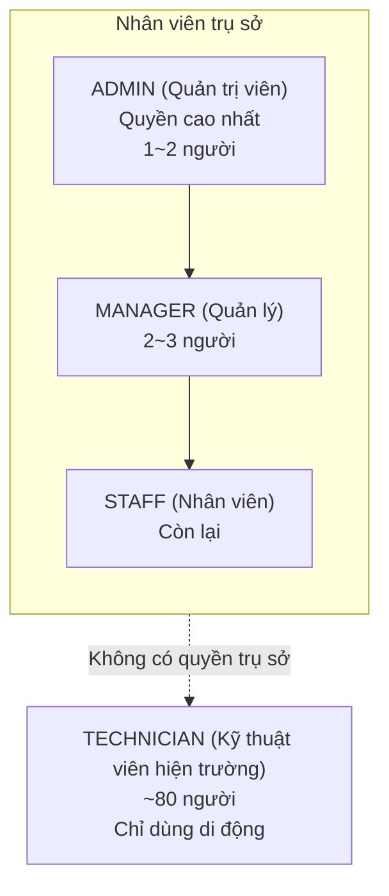
```mermaid
flowchart TB
  subgraph HQ["Nhân viên trụ sở"]
    direction TB
    A["ADMIN (Quản trị viên)<br/>Quyền cao nhất<br/>1~2 người"]
    M["MANAGER (Quản lý)<br/>2~3 người"]
    S["STAFF (Nhân viên)<br/>Còn lại"]
    A --> M --> S
  end
  T["TECHNICIAN (Kỹ thuật viên hiện trường)<br/>~80 người<br/>Chỉ dùng di động"]

  HQ -.Không có quyền trụ sở.-> T
```

### 2.1 Bảng phân quyền đầy đủ

| Tính năng | ADMIN | MANAGER | STAFF |
|---|:---:|:---:|:---:|
| **Cài đặt hệ thống · Thêm người dùng** | ● | — | — |
| **Xuất CSV Nhật ký Kiểm toán** | ● | — | — |
| Xem màn hình Nhật ký Kiểm toán | ● | ● | — |
| **Đổi giá · Sửa hợp đồng** | ● | ● | — |
| **Phát hành hóa đơn GTGT** | ● | ● | — |
| **Đặt lại mật khẩu khách hàng** | ● | ● | — |
| Khóa sổ hàng tháng | ● | ● | — |
| **Duyệt yêu cầu dịch vụ có phí** | ● | ● | ● |
| Đăng ký, sửa khách hàng·hợp đồng·thiết bị | ● | ● | ● |
| Tạo·thay đổi lịch thăm | ● | ● | ● |
| Nhập thanh toán·đối soát chuyển khoản | ● | ● | ● |
| Xem menu kinh doanh | ● | ● | ● |
| Xem menu kế toán | ● | ● | ● |
| Xem báo cáo | ● | ● | ● |

> **Lưu ý**: STAFF cũng xem được menu kế toán và kinh doanh. Tuy nhiên các thao tác trọng trách như **đổi số tiền hoặc phát hành hóa đơn GTGT** chỉ MANAGER trở lên mới thực hiện được. Không phân quyền theo phòng ban.

### 2.2 Màn hình khi thiếu quyền

Khi click vào menu không có quyền, bạn sẽ thấy một trong các trường hợp:

- **Menu không hiển thị** — Với STAFF, menu "Quản lý hệ thống" trong sidebar bị ẩn.
- **Nút màu xám** — Vào được màn hình nhưng nút "Phát hành" bị vô hiệu hóa.
- **Thông báo thiếu quyền** — Hiện thông báo kiểu "Tác vụ này cần MANAGER trở lên".

---

## Chương 3. Một ngày làm việc của nhân viên văn phòng (tổng quan quy trình)

Trước khi vào chi tiết từng màn hình, hãy xem **luồng công việc trong một ngày**. Biết trước việc nào xảy ra khi nào sẽ giúp bạn không bối rối.

### 3.1 Cái nhìn tổng quan

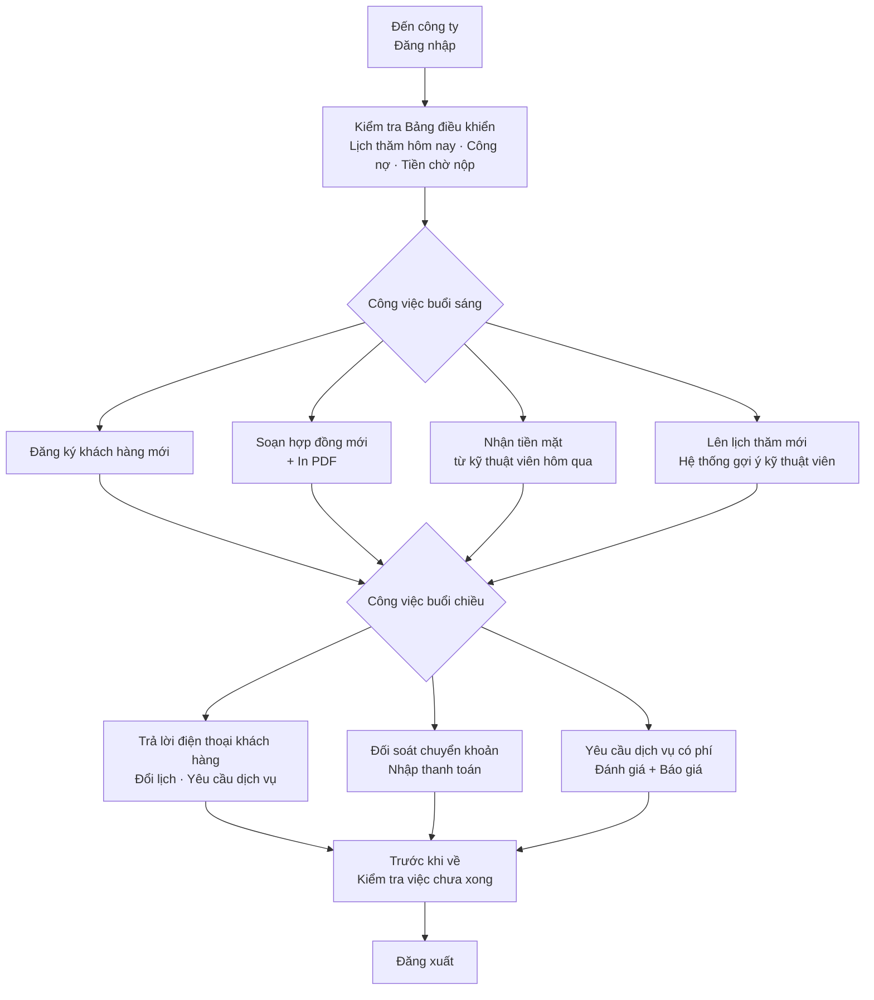
```mermaid
flowchart TB
  A[Đến công ty<br/>Đăng nhập] --> B[Kiểm tra Bảng điều khiển<br/>Lịch thăm hôm nay · Công nợ · Tiền chờ nộp]
  B --> C{Công việc buổi sáng}
  C --> D[Đăng ký khách hàng mới]
  C --> E[Soạn hợp đồng mới<br/>+ In PDF]
  C --> F[Nhận tiền mặt<br/>từ kỹ thuật viên hôm qua]
  C --> G[Lên lịch thăm mới<br/>Hệ thống gợi ý kỹ thuật viên]

  D --> H{Công việc buổi chiều}
  E --> H
  F --> H
  G --> H

  H --> I[Trả lời điện thoại khách hàng<br/>Đổi lịch · Yêu cầu dịch vụ]
  H --> J[Đối soát chuyển khoản<br/>Nhập thanh toán]
  H --> K[Yêu cầu dịch vụ có phí<br/>Đánh giá + Báo giá]

  I --> L[Trước khi về<br/>Kiểm tra việc chưa xong]
  J --> L
  K --> L
  L --> M[Đăng xuất]
```

### 3.2 Thời gian trung bình của từng bước

| Tác vụ | Thời gian trung bình |
|---|---|
| Tìm 1 khách hàng | Dưới 5 giây |
| Đăng ký khách hàng mới (B2C) | 1~2 phút |
| Đăng ký khách hàng mới (B2B, có cơ sở) | 3~5 phút |
| Soạn hợp đồng mới + In PDF | 5 phút |
| Đối soát 1 chuyển khoản | 30 giây |
| Nhận tiền từ 1 kỹ thuật viên (5~10 lượt) | 3~5 phút |
| Đánh giá yêu cầu dịch vụ có phí + Báo giá | 2~5 phút |
| Tải lên hóa đơn GTGT (sau khi phát hành ngoài) | 1 phút |

### 3.3 Việc xử lý tự động — Nhân viên không cần lo

| Tự động xử lý | Khi nào |
|---|---|
| Gửi SMS mật khẩu tạm thời cho khách hàng mới | Ngay sau đăng ký khách hàng |
| SMS chào mừng đến người ký hợp đồng | Sau khi kích hoạt hợp đồng |
| Email D-14 bảo trì định kỳ | Tự động 03:00 mỗi ngày |
| SMS D-1 bảo trì định kỳ | Tự động 03:00 mỗi ngày |
| Email D+7 nhắc công nợ | Tự động 03:00 mỗi ngày |
| SMS D+30 công nợ | Tự động 03:00 mỗi ngày |
| Email D-60/30 sắp hết hạn thuê | Tự động 03:00 mỗi ngày |
| Tự động gửi email hóa đơn thu tiền | Ngay sau khi nhập thanh toán |
| Tự động gửi email phiếu xác nhận công việc | Ngay sau khi kỹ thuật viên hoàn thành lượt thăm |
| Cảnh báo D+1 chưa nộp tiền mặt (gửi ADMIN) | Ngày làm việc kế tiếp tự động |

---

## Chương 4. Đăng nhập và Màn hình đầu

### 4.1 Màn hình Đăng nhập

Trang đăng nhập cho nhân viên trụ sở là **`soms.seoulaqua.com.vn/o/login`** (tên miền thực tế do công ty thông báo).

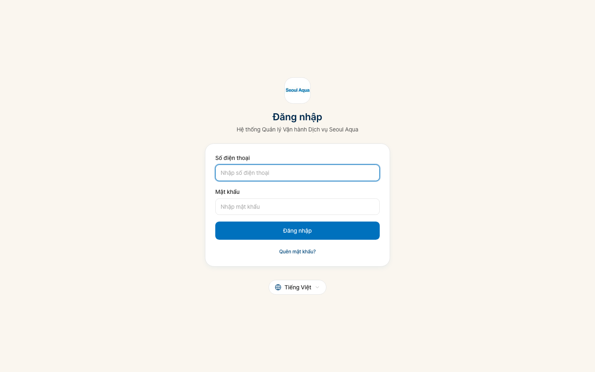

| Trường nhập | Mô tả |
|---|---|
| **Số điện thoại hoặc Tên người dùng** | Số điện thoại cá nhân (ví dụ: `0901234567`) hoặc tên người dùng do ADMIN cấp (ví dụ: `admin`, `manager`) |
| **Mật khẩu** | Mật khẩu cá nhân |
| Nút Đăng nhập | Click để vào Bảng điều khiển (màn hình chính) |

**Cơ chế bảo mật quan trọng**:

- **3 lần thất bại liên tiếp** sẽ khóa tài khoản tự động trong 1 giờ.
- Nếu có 2 người dùng cùng tên người dùng, **đăng nhập sẽ bị từ chối** (chính sách bảo mật). Trường hợp này hãy đăng nhập bằng số điện thoại.
- Nếu kỹ thuật viên hiện trường thử đăng nhập tại trang văn phòng, hệ thống sẽ **tự động chuyển sang trang đăng nhập hiện trường (`/f/login`)**.

### 4.2 Đổi mật khẩu lần đầu

Khi ADMIN tạo tài khoản mới, **mật khẩu tạm thời** sẽ được gửi qua SMS. Ngay sau lần đăng nhập đầu, màn hình bắt buộc đổi mật khẩu sẽ hiện ra.

**Quy tắc mật khẩu**:

- Tối thiểu 8 ký tự
- Khuyến nghị kết hợp chữ + số (không bắt buộc)
- Không chia sẻ mật khẩu với người khác

> **Quên mật khẩu**: Hãy nhờ ADMIN hoặc MANAGER. Mật khẩu tạm thời mới sẽ được gửi qua SMS.

### 4.3 Bảng điều khiển (Màn hình chính)

Là màn hình đầu tiên hiện ra sau đăng nhập. Mọi việc cần xử lý hôm nay đều thấy ở đây.

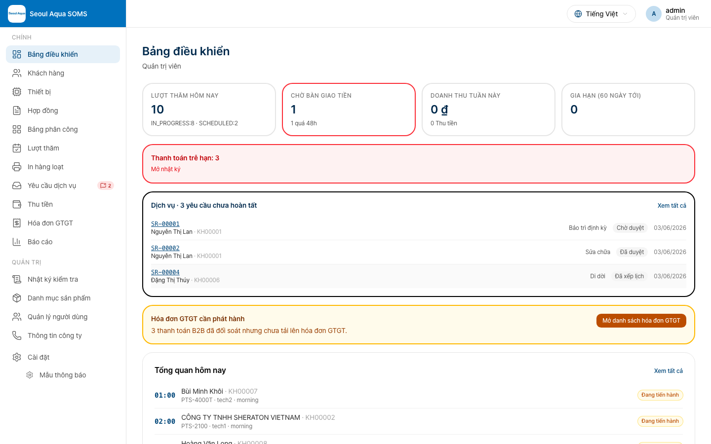

**Cấu trúc màn hình**:

| Vùng | Nội dung |
|---|---|
| **Lời chào trên cùng** | Tên và chức vụ cá nhân |
| **Lượt thăm hôm nay** | Số lượng dự kiến + tỉ lệ đang tiến hành / hoàn thành |
| **Yêu cầu dịch vụ chờ duyệt** | Yêu cầu có phí của khách hàng chưa được đánh giá |
| **Cảnh báo Công nợ** | Danh sách khách theo từng giai đoạn D+7, D+14, D+30 |
| **Tiền mặt chờ nộp** | Tiền mặt kỹ thuật viên nhận hôm qua chưa nộp văn phòng |
| **Tóm tắt doanh thu tháng** | Tổng hợp đồng mới · Thu tiền (chỉ MANAGER+ thấy) |
| **Chuông thông báo** | Thông báo hệ thống (yêu cầu dịch vụ mới, v.v.) |

Click vào mỗi thẻ để đi thẳng đến màn hình tương ứng.

### 4.4 Menu Sidebar

Menu nằm bên trái màn hình. Một số menu bị ẩn theo quyền cá nhân.

```
┌─ Bảng điều khiển
├─ Khách hàng
├─ Hợp đồng
├─ Thiết bị
├─ Lượt thăm
├─ Phân công hôm nay   ← Mới ở Phase 6 (biểu tượng LayoutGrid)
├─ In hàng loạt        ← Mới ở Phase 6 (biểu tượng Printer)
├─ Yêu cầu dịch vụ
├─ Thanh toán
├─ Hóa đơn GTGT        (MANAGER+)
├─ Báo cáo
│   ├─ Doanh thu
│   ├─ Công nợ
│   ├─ Năng suất KTV
│   └─ Nhật ký kiểm toán (MANAGER+)
└─ Quản lý hệ thống    (ADMIN)
    ├─ Người dùng
    ├─ Catalog sản phẩm
    └─ Trọng số lập lịch
```

> 📋 **"Phân công hôm nay"** và **"In hàng loạt"** là menu hỗ trợ quản lý lượt thăm bổ sung ở Phase 6 (merge ngày 2026-06-03). Xem hướng dẫn chi tiết ở §7.8 / §7.10. Hiển thị cho ADMIN / MANAGER / STAFF (TECHNICIAN có màn hình mobile riêng).

### 4.5 Chuyển ngôn ngữ

Dùng **nút chọn ngôn ngữ** ở góc trên bên phải để chuyển ngay giữa Tiếng Hàn (KO) / Tiếng Việt (VI) / Tiếng Anh (EN). Màn hình đang xem được giữ nguyên, chỉ văn bản đổi.

---

## Chương 5. Quản lý Khách hàng

### 5.1 Màn hình Danh sách Khách hàng

**Menu trái → Click "Khách hàng"**

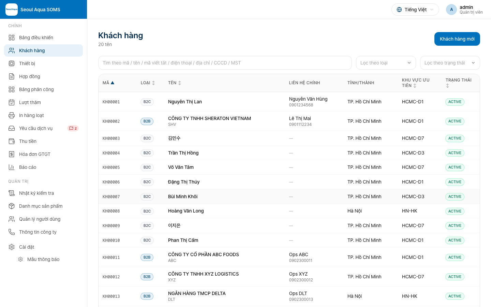

Cấu trúc màn hình:

- **Ô tìm kiếm**: nhập tên · số điện thoại · mã (KH0001, v.v.)
- **Bộ lọc**: Loại (B2C/B2B), Thành phố, Tình trạng hoạt động, v.v.
- Nút **Khách hàng mới** (góc trên bên phải)
- Nút **Xuất CSV** (tải kết quả tìm kiếm dạng Excel)
- **Danh sách**: Mã, Tên, Loại, Điện thoại, Thành phố, Ngày đăng ký

Click vào một dòng để vào trang chi tiết.

### 5.2 Đăng ký Khách hàng mới — B2C (Hộ gia đình)

**Danh sách Khách hàng → Nút "Khách hàng mới"**

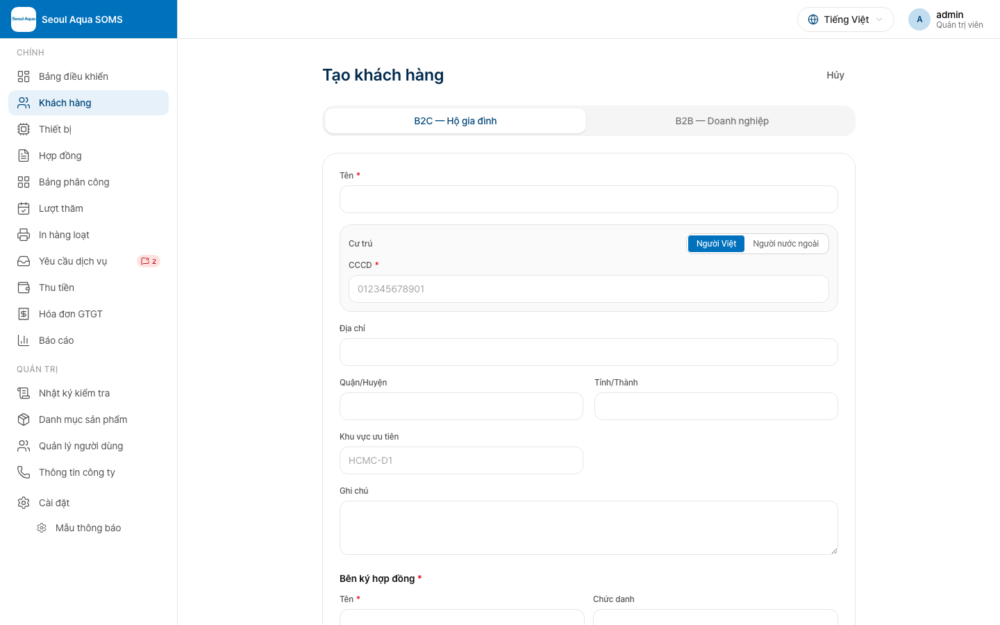

#### Bước 1: Chọn loại

Phía trên màn hình chọn **B2C (Hộ gia đình)** hoặc **B2B (Doanh nghiệp)**. Khi chọn B2C, các trường sau hiển thị.

#### Bước 2: Nhập bắt buộc

| Mục | Mô tả | Ví dụ |
|---|---|---|
| **Tên** | Tên khách hàng | `Nguyễn Văn A` hoặc `김철수` |
| **Số điện thoại 1** | Liên lạc chính (di động) | `0901234567` |
| **Địa chỉ đầy đủ** | Địa chỉ lắp đặt | `Số 123, P. Tân Hưng, Quận 7, HCMC` |
| **Thành phố** | Tách từ địa chỉ | `Hồ Chí Minh` |

#### Bước 3: Nhập tùy chọn (khuyến khích)

| Mục | Mô tả |
|---|---|
| **Số điện thoại 2** | Liên lạc phụ |
| **Email** | Để gửi hóa đơn thu tiền · phiếu xác nhận |
| **Khu vực ưu tiên** | Ưu tiên khi xếp KTV bảo trì định kỳ (ví dụ: `HCMC-D1`) |
| **KTV ưu tiên** | Khi khách hàng chỉ định KTV cụ thể |
| **Ghi chú** | Thông tin đặc biệt (mã ra vào, vị trí cây nước, dị ứng, v.v.) |

#### Bước 4: Tự động kích hoạt cổng khách hàng

Mặc định bật **Kích hoạt cổng tự động**. Ngay khi lưu:

1. Hệ thống tự cấp mã khách hàng (`KH00001` kiểu 5 chữ số).
2. **SMS mật khẩu tạm thời** được gửi đến số điện thoại của khách.
3. Khách hàng đăng nhập lần đầu tại `seoulaqua.com.vn/login` → đặt mật khẩu mới → bắt đầu sử dụng.

Sau khi lưu chuyển đến trang chi tiết khách hàng.

### 5.3 Đăng ký Khách hàng mới — B2B (Doanh nghiệp)

**Danh sách Khách hàng → Nút "Khách hàng mới" → Chọn B2B**

Khác với B2C:

| Mục | Khác biệt |
|---|---|
| **Tên** | Không phải tên người mà là **tên doanh nghiệp** (ví dụ: `CÔNG TY TNHH SHV`) |
| **Mã số thuế (taxCode)** | Mã số đăng ký kinh doanh Việt Nam **bắt buộc** (ví dụ: `0301234567`) |
| **Viết tắt (shortcode)** | 2~5 chữ cái viết tắt (ví dụ: `SHV`) — dùng trong mã hợp đồng |

#### Thêm Cơ sở (Site) — chỉ B2B

Khi khách B2B có nhiều nhà máy hoặc tòa nhà, **đăng ký từng cơ sở dạng Site**.

Sau khi lưu khách hàng, ở trang chi tiết khách hàng:

1. Click tab "**Cơ sở**"
2. Nút "**Cơ sở mới**"
3. Nhập:
   - **Tên cơ sở**: `Trụ sở`, `Nhà máy A`, `Tòa nhà R&D`, v.v.
   - **Địa chỉ đầy đủ**: Địa chỉ cơ sở
   - **Khu vực**: Mã khu vực (tùy chọn)
   - **Điện thoại**: Tổng đài cơ sở (tùy chọn)
4. Lưu → Thêm Site khác (nếu cần)

> **B2C không cần Site.** Hộ gia đình chỉ có một nơi, địa chỉ chính của khách là địa chỉ lắp đặt.

### 5.4 Trang Chi tiết Khách hàng

Click vào khách hàng để xem toàn bộ thông tin được tổ chức theo tab.

Cấu trúc tab:

| Tab | Nội dung |
|---|---|
| **Thông tin cơ bản** | Tên, điện thoại, địa chỉ, ghi chú, v.v. (có thể chỉnh sửa) |
| **Liên hệ** | Bên ký hợp đồng + Liên hệ vận hành (1+N) |
| **Cơ sở** (chỉ B2B) | Danh sách cơ sở |
| **Thiết bị** | Tất cả máy lọc nước/máy lọc không khí, v.v. khách đang dùng |
| **Hợp đồng** | Toàn bộ hợp đồng đã ký (đang hoạt động + đã hết hạn) |
| **Lịch sử thăm** | Mọi lượt thăm khách hàng này |
| **Lịch sử thanh toán** | Tất cả thanh toán (chờ · đã xong · công nợ) |
| **Yêu cầu dịch vụ** | Mọi yêu cầu khách hàng đã gửi |

### 5.5 Thêm Liên hệ — Bên ký hợp đồng + Liên hệ vận hành

Chi tiết khách hàng → Tab "Liên hệ"

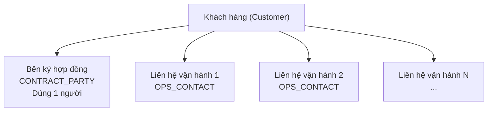
```mermaid
flowchart TB
  Customer["Khách hàng (Customer)"]
  Customer --> CP["Bên ký hợp đồng<br/>CONTRACT_PARTY<br/>Đúng 1 người"]
  Customer --> OPS1["Liên hệ vận hành 1<br/>OPS_CONTACT"]
  Customer --> OPS2["Liên hệ vận hành 2<br/>OPS_CONTACT"]
  Customer --> OPSn["Liên hệ vận hành N<br/>..."]
```

**Bên ký hợp đồng (CONTRACT_PARTY)** được tự tạo 1 người khi đăng ký khách hàng. Muốn thay đổi cần quyền MANAGER trở lên.

**Liên hệ vận hành (OPS_CONTACT)** được thêm khi khách hàng cần:

- Khi B2B có nhiều phòng ban (HR phụ trách, Cơ sở phụ trách, Mua hàng phụ trách, v.v.)
- Khi B2C ngoài chủ hộ còn có vợ/chồng đặt lịch

#### Các bước thêm liên hệ vận hành

1. Chi tiết khách hàng → Tab Liên hệ → Nút "**Liên hệ mới**"
2. Nhập:
   - **Tên · Chức vụ**: `Kim Trưởng phòng (Quản lý cơ sở)`
   - **Số điện thoại**: Số trực tiếp cá nhân (ví dụ: `0987654321`)
   - **Email**: Tùy chọn
   - **Ngôn ngữ**: `KO` / `VI` / `EN` — Tiếng mẹ đẻ của họ
   - **scope**: `CUSTOMER` (toàn tổ chức) hoặc `SITE` (chỉ một cơ sở)
   - **siteId**: Khi scope=SITE thì chọn cơ sở phụ trách
   - **Kích hoạt cổng**: Mặc định BẬT (có cấp quyền đăng nhập cổng hay không)
3. Lưu → SMS mật khẩu tạm thời tự gửi đến liên hệ mới

#### Quy tắc định tuyến thông báo theo liên hệ

| Loại thông báo | Gửi cho ai |
|---|---|
| Hợp đồng, hóa đơn GTGT, thông báo pháp lý | Chỉ **Bên ký hợp đồng** |
| SMS lịch bảo trì, hóa đơn thu tiền | **Liên hệ vận hành (chính)**, không có thì Bên ký hợp đồng |
| Đòi công nợ | Bên ký hợp đồng + **toàn bộ Liên hệ vận hành** (CC) |
| Trên mobile "Gọi khách hàng" | Liên hệ vận hành (chính) trước, không có thì Bên ký hợp đồng |

**Cài đặt ngôn ngữ của mỗi liên hệ sẽ quyết định ngôn ngữ nội dung thông báo**.

### 5.6 Chỉnh sửa thông tin khách hàng

Chi tiết khách hàng → Tab "Thông tin cơ bản" → Nút "**Sửa**"

Trường có thể sửa:

- Tên, điện thoại, email, địa chỉ, thành phố, khu vực, ghi chú — Mọi quyền
- **Mã số thuế, Tên doanh nghiệp** — MANAGER trở lên (B2B có ảnh hưởng pháp lý)
- **Đổi Bên ký hợp đồng** — MANAGER trở lên (có thể cần ký lại hợp đồng)

Khi lưu, **trước/sau của thay đổi tự ghi vào Nhật ký Kiểm toán (Audit Log)**.

### 5.7 Vô hiệu hóa · Kích hoạt lại khách hàng

Khi khách hàng ngừng giao dịch (đóng cửa · chuyển đi · kết thúc hợp đồng):

**Vô hiệu hóa (MANAGER trở lên)**:

1. Chi tiết khách hàng → Tab "Thông tin cơ bản" → Nút "**Vô hiệu hóa**"
2. Nhập lý do (ví dụ: "Đóng cửa", "Xuất ngoại dài hạn", "Kết thúc hợp đồng")
3. Xác nhận → Mọi thiết bị đang hoạt động tự chuyển sang trạng thái `DEACTIVATED`
4. Sau đó vẫn tìm được trong danh sách nhưng không soạn hợp đồng mới được

**Kích hoạt lại (chỉ ADMIN)**:

Để kích hoạt lại khách hàng đã vô hiệu hóa cần quyền ADMIN. An toàn kép.

> **Xóa hoàn toàn không được**. Mọi dữ liệu phải lưu 24 tháng theo yêu cầu pháp lý.

---

## Chương 6. Quản lý Hợp đồng

### 6.1 Các loại hợp đồng

| Loại | Tiếng Hàn | Tiếng Việt | Mô tả |
|---|---|---|---|
| **SALE** | 판매 | Bán | Trả một lần và thuộc sở hữu khách hàng |
| **RENTAL** | 임대 | Thuê | Thuê 36 tháng, thu tiền hàng tháng, hết hạn chuyển sở hữu cho khách |
| **MAINTENANCE** | 유지관리 | Bảo trì | Chỉ kiểm tra — Thiết bị đã thuộc khách hàng |

### 6.2 Màn hình Danh sách Hợp đồng

**Menu trái → Click "Hợp đồng"**

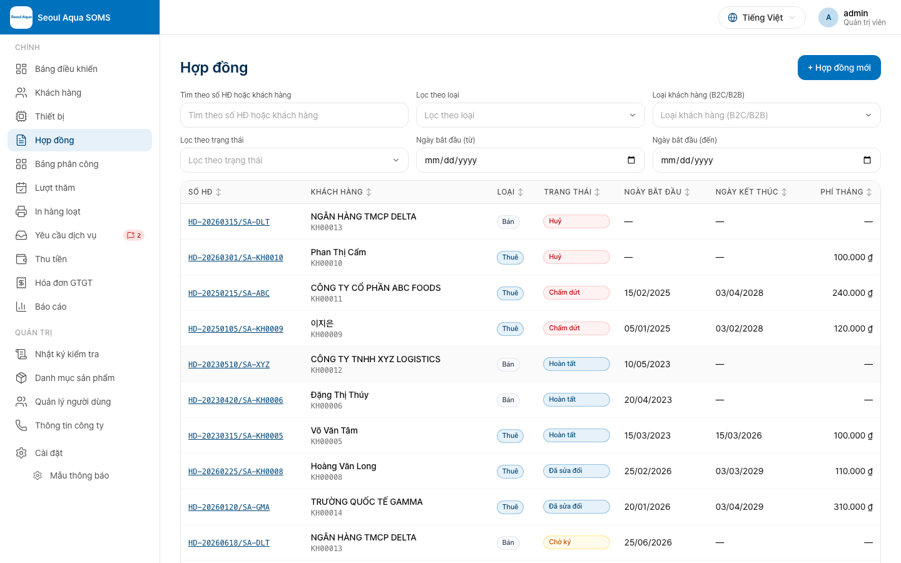

Cấu trúc màn hình:

- **Tab**: Đang hoạt động / Bản nháp / Hết hạn / Tất cả
- **Bộ lọc**: Loại khách hàng (B2C/B2B), Loại hợp đồng (SALE/RENTAL/MAINTENANCE), Trạng thái
- **Tìm kiếm**: Mã hợp đồng (`HD-...`), Tên khách, Mã
- Nút **Hợp đồng mới**

Click từng dòng để vào trang chi tiết hợp đồng.

### 6.3 Soạn Hợp đồng mới

**Danh sách Hợp đồng → Nút "Hợp đồng mới"**

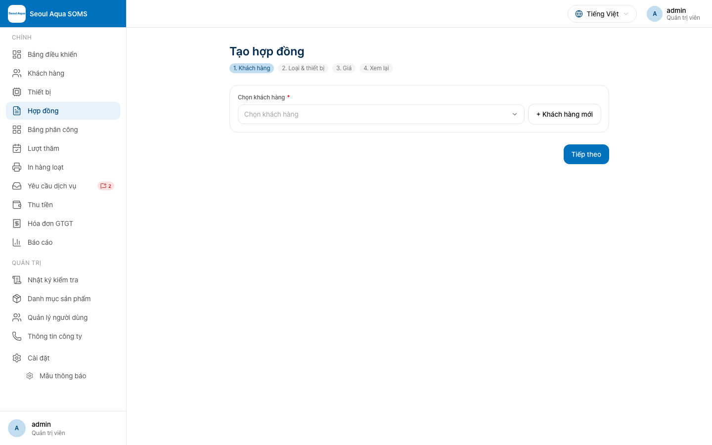

#### Bước 1: Chọn khách hàng

Tìm khách hàng trong dropdown. Nếu là khách mới, đăng ký theo mục 5.2/5.3 trước rồi quay lại.

#### Bước 2: Chọn loại hợp đồng

Chọn `SALE` / `RENTAL` / `MAINTENANCE`.

Tùy theo lựa chọn sẽ hiện các trường khác nhau:

**Khi chọn SALE**:
- Tổng giá bán (VND)
- Phương thức thanh toán (một lần / trả góp)

**Khi chọn RENTAL**:
- Phí thuê hàng tháng (VND)
- Thời hạn (mặc định 36 tháng)
- Thời hạn bắt buộc (mặc định 24 tháng) — Căn cứ tính phí phá vỡ hợp đồng sớm
- Ngày bắt đầu

**Khi chọn MAINTENANCE**:
- Phí bảo trì hàng tháng
- Thời hạn (mặc định 12 tháng, có thể gia hạn)
- Ngày bắt đầu

#### Bước 3: Chọn thiết bị

Nút "**Thêm thiết bị**" → Chọn từ thiết bị hiện có của khách hoặc thêm mới:

- **Thêm thiết bị mới**: Chọn từ catalog model (Brand → Model)
- **Số lượng**: Cho phép nhiều cái cùng model
- **Đơn giá**: Tự động theo model, có thể chỉnh tay khi thương lượng (chỉ MANAGER+)

#### Bước 4: Tự động cấp mã hợp đồng

Ngay sau khi lưu, mã hợp đồng tự sinh:

- **B2C**: `HD-YYYYmmDD/SA-KH####` (ví dụ: `HD-20260602/SA-KH00001`)
- **B2B**: `HD-YYYYmmDD/SA-{shortcode}` (ví dụ: `HD-20260602/SA-SHV`)

Mã này được in trong PDF hợp đồng.

#### Bước 5: Tạo PDF hợp đồng

Sau khi lưu, ở trang chi tiết hợp đồng nhấn nút "**Tạo PDF**":

- **PDF song ngữ** tự sinh (Tiếng Việt bên trái, Tiếng Hàn/Anh bên phải)
- "Party A (Bên A)" = Seoul Aqua, "Party B (Bên B)" = Khách hàng
- Ô để khách ký được đánh dấu

Sau khi in PDF, gửi giấy hoặc PDF cho khách.

#### Bước 6: Nhận chữ ký và kích hoạt

Sau khi nhận chữ ký khách:

1. Chi tiết hợp đồng → Nút "**Kích hoạt hợp đồng**"
2. Nhập tên người ký
3. Chụp ảnh giấy đã ký và tải lên (chính sách E.1)
4. Lưu → Trạng thái hợp đồng tự chuyển **DRAFT → ACTIVE**
5. **Lượt thăm lắp đặt** tự sinh (đúng ngày bắt đầu)

### 6.4 Trang chi tiết Hợp đồng

Click một hợp đồng để xem mọi thông tin:

- Số hợp đồng, Loại, Trạng thái (đầu trang)
- Thông tin khách hàng (link)
- Danh sách thiết bị (số serial, ngày lắp, trạng thái)
- Lịch sử thanh toán (tính phí hàng tháng + thu tiền)
- Lịch sử thăm (mọi lượt liên quan đến hợp đồng này)
- PDF đính kèm (Hợp đồng, Phiếu xác nhận công việc, v.v.)

### 6.5 Máy trạng thái Hợp đồng

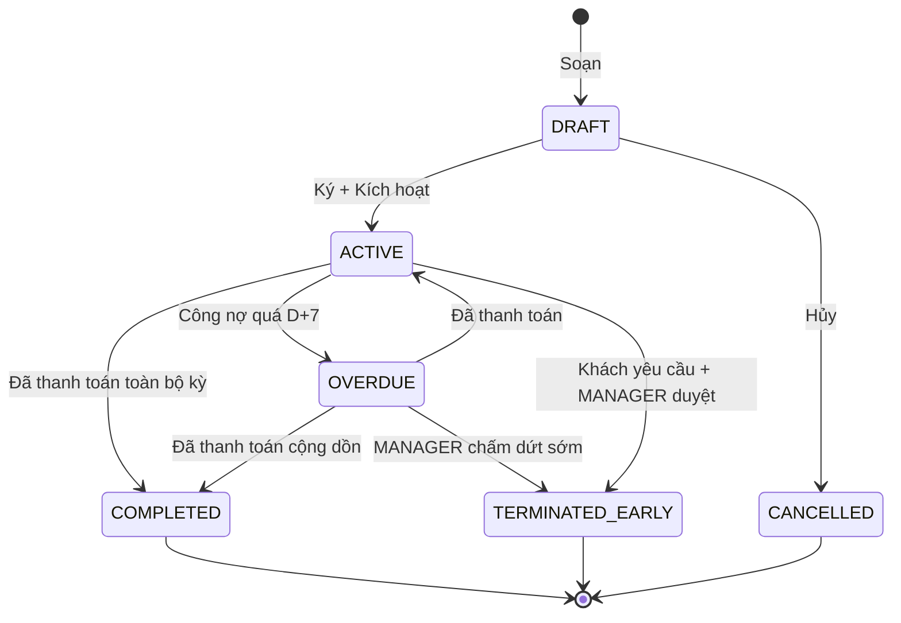
```mermaid
stateDiagram-v2
  [*] --> DRAFT: Soạn
  DRAFT --> ACTIVE: Ký + Kích hoạt
  DRAFT --> CANCELLED: Hủy

  ACTIVE --> OVERDUE: Công nợ quá D+7
  OVERDUE --> ACTIVE: Đã thanh toán
  OVERDUE --> TERMINATED_EARLY: MANAGER chấm dứt sớm

  ACTIVE --> COMPLETED: Đã thanh toán toàn bộ kỳ
  OVERDUE --> COMPLETED: Đã thanh toán cộng dồn
  ACTIVE --> TERMINATED_EARLY: Khách yêu cầu + MANAGER duyệt

  COMPLETED --> [*]
  TERMINATED_EARLY --> [*]
  CANCELLED --> [*]
```

**Khi chuyển sang COMPLETED tự động xử lý**:
- Thiết bị RENTAL **tự chuyển sở hữu sang khách hàng** (chính sách B.3).
- Gửi **email kết thúc** tự động cho khách hàng và Bên ký hợp đồng.

### 6.6 Sửa hợp đồng (B2C và B2B khác nhau)

#### Sửa hợp đồng B2C — Chỉnh trực tiếp

- Khi đổi giá hoặc thiết bị thì sửa ngay tại chỗ
- Trước/sau ghi vào Nhật ký Kiểm toán
- Không phát hành hợp đồng mới

**Quyền**: Đổi giá là MANAGER trở lên, còn lại STAFF có thể.

#### Sửa hợp đồng B2B — Phụ lục (Appendix)

Khi B2B muốn thêm thiết bị vào hợp đồng hiện tại, tạo **Phụ lục (Appendix)**.

1. Trang hợp đồng gốc → Nút "**Thêm Phụ lục**"
2. Nhập thiết bị hoặc giá mới
3. Lưu → Sinh dòng hợp đồng mới
   - Mã: `HD-YYYYmmDD/SA-SHV-A1` (thêm `-A1`)
   - `amendmentRevision = 1` (lần sau là `-A2`, revision=2)
   - Tự liên kết với hợp đồng gốc
4. Tạo PDF Phụ lục → Khách ký lại

**Vì sao là Phụ lục?**: Khách B2B thường tiện kế toán khi giữ cùng mã hợp đồng. Phụ lục được quản lý dạng "gốc + thay đổi" như một bộ.

### 6.7 Gia hạn hợp đồng — Thuê → Bảo trì (1-Click)

Khi hết hạn thuê, nếu khách muốn "giữ thiết bị và tiếp tục bảo trì thì có thể **chuyển sang hợp đồng bảo trì bằng 1-Click**.

1. Trang hợp đồng thuê đã hết hạn → Nút "**Gia hạn: Bảo trì**"
2. Nhập phí bảo trì hàng tháng mới (thường rẻ hơn phí thuê)
3. Nhập ngày bắt đầu (thường là ngày sau khi thuê hết hạn)
4. **Xác nhận** — Tự xử lý:
   - Hợp đồng thuê cũ → `COMPLETED`
   - Sở hữu thiết bị → Tên khách
   - Sinh hợp đồng bảo trì mới tự động (liên kết qua `parentContractId`)
   - Bảo trì định kỳ kế tiếp được lên lịch theo hợp đồng mới

### 6.8 Chấm dứt hợp đồng sớm

Khi khách yêu cầu hoặc công nợ kéo dài không giải quyết:

**STAFF chỉ đề nghị, MANAGER trở lên duyệt**

1. Chi tiết hợp đồng → Nút "**Đề nghị chấm dứt sớm**"
2. Nhập lý do (dropdown: `Khách chuyển đi`, `Đóng cửa`, `Thỏa thuận hoàn tiền`, `Công nợ dài hạn`, `Khác`)
3. Hiện vào danh sách "**Chờ duyệt**" trên màn hình MANAGER
4. MANAGER kiểm tra + duyệt / từ chối
5. Khi duyệt:
   - Trạng thái hợp đồng → `TERMINATED_EARLY`
   - Nếu là RENTAL thì **Lượt thăm thu hồi tự sinh**
   - Tính phí phá vỡ hoặc hoàn tiền do ADMIN xử lý trực tiếp (trong menu Thanh toán)

---

## Chương 7. Quản lý Lượt thăm

### 7.1 Các loại lượt thăm

| Loại | Tiếng Hàn | Tiếng Việt | Điều kiện phát sinh |
|---|---|---|---|
| INSTALLATION | 설치 | Lắp đặt | Tự động sau khi kích hoạt hợp đồng mới |
| PERIODIC | 정기점검 | Bảo trì định kỳ | Hàng tháng hoặc 2 tháng/lần, tự động bằng cron |
| REPAIR | 수리 | Sửa chữa | Yêu cầu của khách (FAULT_REPORT) |
| RELOCATION | 이전 설치 | Di dời lắp đặt | Yêu cầu của khách (RELOCATION) |
| PART_REPLACEMENT | 부품 교체 | Thay thế phụ tùng | Yêu cầu của khách (PART_REPLACEMENT) |
| RETRIEVAL | 회수 | Thu hồi | Tự động khi thuê kết thúc |
| OTHER | 기타 | Khác | Văn phòng tạo thủ công |

### 7.2 Màn hình Danh sách Lượt thăm

**Menu trái → Click "Lượt thăm"**

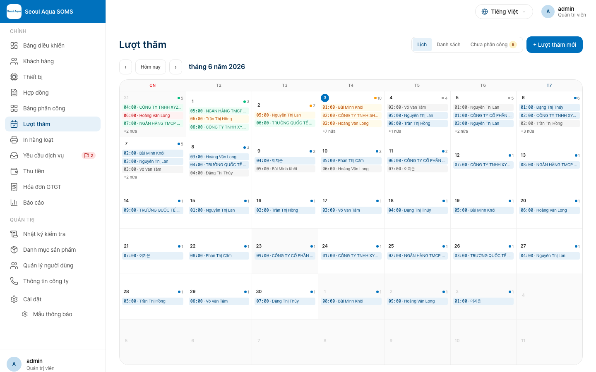

Cấu trúc màn hình (sau Phase 6 — 2026-06-03, 3 tab):

- **Xem lịch** — Lịch tuần (lưới KTV × ngày), kéo để đổi lịch
- **Xem danh sách** — Sắp xếp theo ngày hoặc KTV
- **Chưa phân công ✱N** — Chỉ hiển thị lượt thăm `SUGGESTED` (chưa gán KTV). Huy hiệu góc trên phải cập nhật số lượng theo thời gian thực
- **Bộ lọc**: Trạng thái, KTV, Khách hàng, Khoảng ngày
- Nút **Lượt thăm mới**

> 💡 **Mẹo dùng tab "Chưa phân công"**: Việc đầu tiên buổi sáng — mở tab này, xử lý hết các thẻ chưa phân công. Mỗi thẻ có KTV đề xuất hiển thị inline, click **Xác nhận ▸** một cái là xong. Nếu thấy phiền vì xử lý từng thẻ, hãy dùng **"Bảng phân công hôm nay"** ở §7.8 — nhanh hơn.

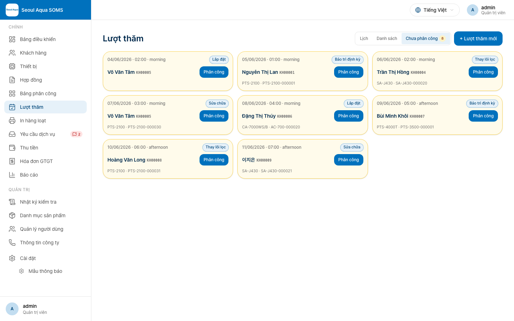

### 7.3 Tạo lượt thăm mới

**Danh sách Lượt thăm → Nút "Lượt thăm mới"**

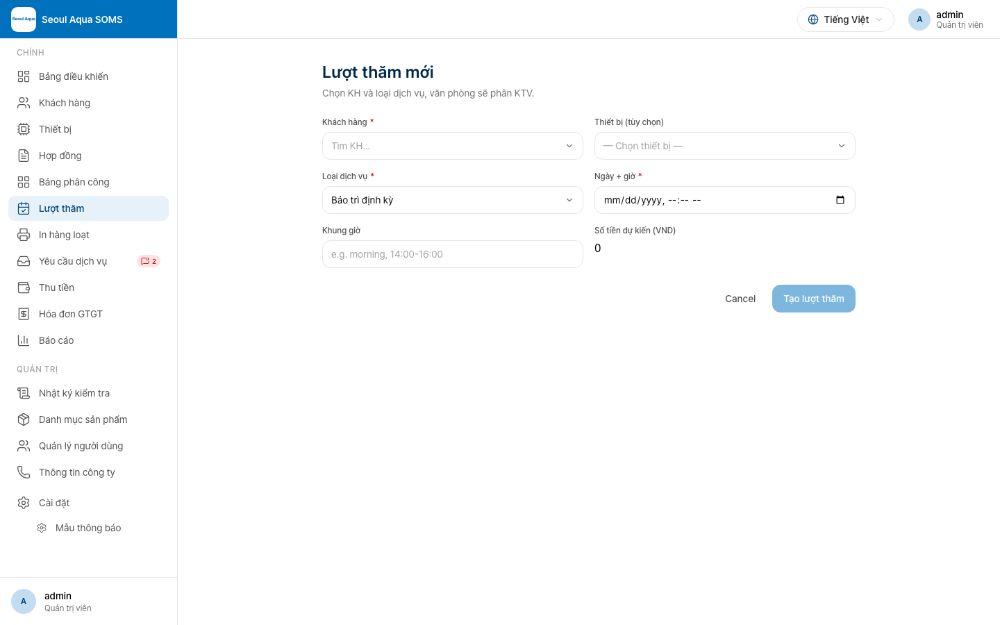

#### Bước 1: Chọn khách hàng và ngày

- Tìm khách hàng
- Loại lượt thăm (tham khảo bảng trên)
- Ngày mong muốn
- Khung giờ (ví dụ: `09:00~11:00`, `Sáng`, `Chiều`)
  - B2C: Nên lấy khung giờ cụ thể (người đi làm có ràng buộc thời gian)
  - B2B: Thường "Sáng" / "Chiều" là đủ

#### Bước 2: Xác nhận KTV được hệ thống đề xuất

Hệ thống tự động hiển thị KTV được đề xuất. Ưu tiên:

1. **KTV khách ưu tiên** (khi `Customer.preferredTechnicianId` được đặt và rảnh hôm đó)
2. **Khớp khu vực** — Khu vực ưu tiên của KTV trùng với khu vực khách
3. **Cân bằng tải** — KTV ít lượt thăm hôm đó được ưu tiên

#### Bước 3: Xác nhận hoặc đổi KTV

- Click "**Nhận đề xuất**" để gán KTV ưu tiên số 1
- Hoặc chọn KTV khác từ danh sách
- **Khi cần hợp tác** (cơ sở lớn B2B):
  - Chỉ định 1 người là **KTV chính (Lead)**
  - Thêm những người còn lại làm **KTV phụ (Collaborator)**

#### Bước 4: Chọn thiết bị

Chọn thiết bị cần làm trong lượt thăm này (có thể chỉ chọn một số trong tất cả thiết bị của khách).

#### Bước 5: Lưu

Ngay sau khi lưu:
- **SMS thông báo gửi cả khách và KTV** tự động
- Thêm vào tab "Hôm nay" hoặc "Sắp tới" trên màn hình mobile của KTV

### 7.4 Đổi lịch

Khi khách điện thoại "Mai tôi không tiếp được":

1. Tìm lượt thăm đó
2. Chi tiết lượt thăm → Nút "**Đổi lịch**"
3. Chọn ngày mới + Lý do (dropdown: `Khách yêu cầu`, `KTV vướng`, `Thời tiết`, `Khách vắng mặt`, `Khác`)
4. Lưu → **Lượt thăm cũ chuyển trạng thái `RESCHEDULED`, sinh thẻ lượt thăm mới, 2 dòng được liên kết**
5. SMS thông báo khách·KTV tự gửi lại

### 7.5 Hủy lượt thăm

Khi khách "Hủy bỏ":

1. Chi tiết lượt thăm → Nút "**Hủy**"
2. Nhập lý do
3. Trạng thái → `CANCELLED`

> **Lưu ý**: Lượt thăm KTV đã bắt đầu (`IN_PROGRESS`) không hủy được. Thay vào đó hãy xử lý "**Hoàn thành**" và ghi lý do thích hợp vào ghi chú.

### 7.6 Máy trạng thái Lượt thăm

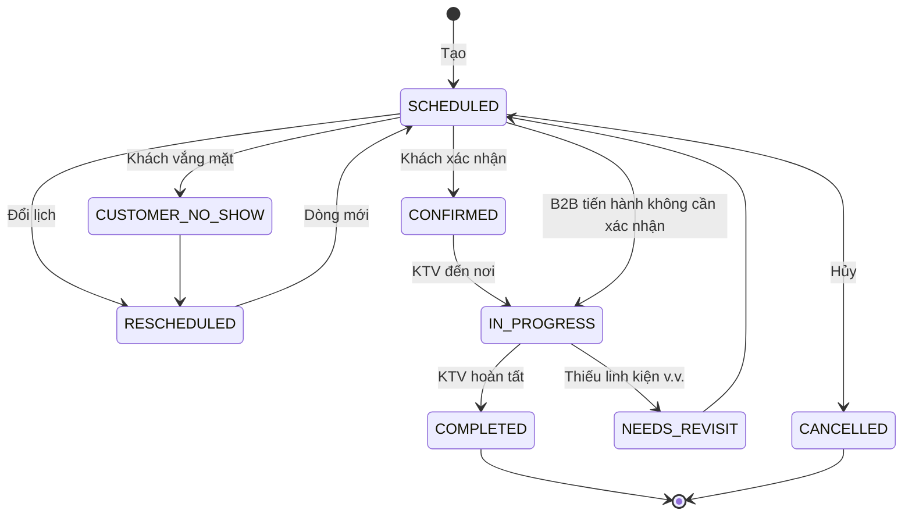
```mermaid
stateDiagram-v2
  [*] --> SCHEDULED: Tạo
  SCHEDULED --> CONFIRMED: Khách xác nhận
  SCHEDULED --> RESCHEDULED: Đổi lịch
  RESCHEDULED --> SCHEDULED: Dòng mới

  CONFIRMED --> IN_PROGRESS: KTV đến nơi
  SCHEDULED --> IN_PROGRESS: B2B tiến hành không cần xác nhận

  IN_PROGRESS --> COMPLETED: KTV hoàn tất
  IN_PROGRESS --> NEEDS_REVISIT: Thiếu linh kiện v.v.

  SCHEDULED --> CUSTOMER_NO_SHOW: Khách vắng mặt
  CUSTOMER_NO_SHOW --> RESCHEDULED
  SCHEDULED --> CANCELLED: Hủy

  COMPLETED --> [*]
  NEEDS_REVISIT --> SCHEDULED
  CANCELLED --> [*]
```

### 7.7 Tự tạo lượt thăm bảo trì định kỳ — Văn phòng không cần lo

Hệ thống tự tạo lượt thăm định kỳ vào sáng sớm mỗi ngày.

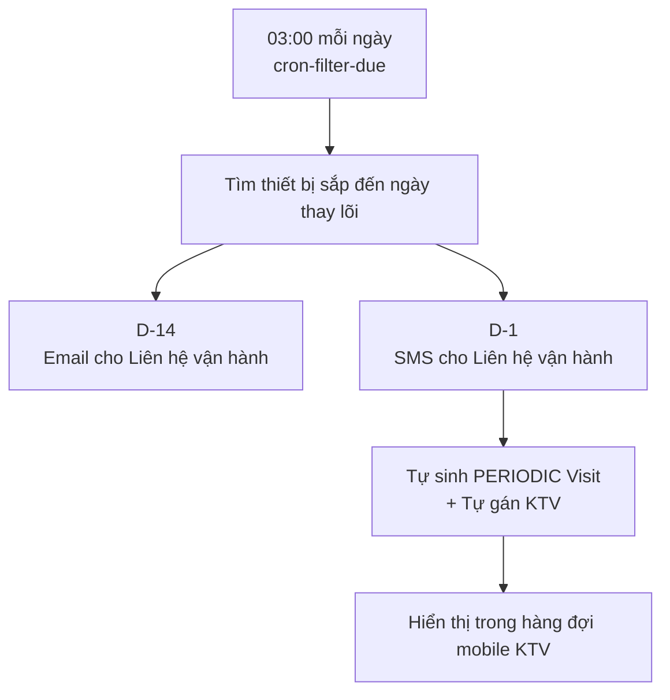
```mermaid
flowchart TB
  Cron[03:00 mỗi ngày<br/>cron-filter-due] --> Find[Tìm thiết bị sắp đến ngày thay lõi]
  Find --> D14[D-14<br/>Email cho Liên hệ vận hành]
  Find --> D1[D-1<br/>SMS cho Liên hệ vận hành]
  D1 --> Create[Tự sinh PERIODIC Visit<br/>+ Tự gán KTV]
  Create --> Queue[Hiển thị trong hàng đợi mobile KTV]
```

Văn phòng chỉ cần **kiểm tra danh sách** các lượt thăm được tự sinh hàng tháng. Khi cần, điều chỉnh lịch hoặc đổi KTV khác.

### 7.8 Bảng Phân công Hôm nay (Phase 6 — 2026-06-03)

**Sidebar trái → "Phân công hôm nay"** (biểu tượng LayoutGrid)

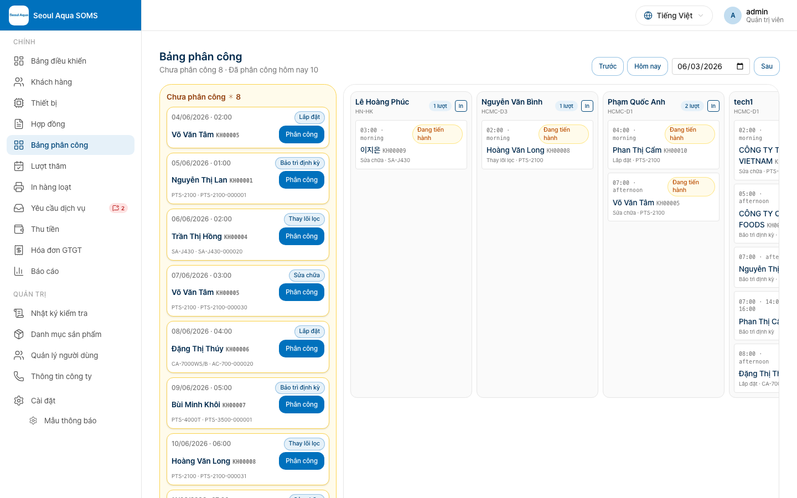

Bảng xử lý phân công lượt thăm theo ngày **trên một màn hình duy nhất**. Nếu §7.2 tab "Chưa phân công" là "xử lý từng thẻ một", thì bảng này là "trực quan hóa cả ngày, xử lý cùng lúc".

#### Cấu trúc màn hình

- **Trên cùng** — Bộ chọn ngày (mặc định hôm nay)
- **Cột trái** — **Hàng đợi chưa phân công**: thẻ các lượt thăm `SUGGESTED` (chưa có KTV) của ngày đó
- **Các cột phải** — **Ngày của từng KTV**: mỗi KTV một cột, sắp xếp theo giờ, đầu cột có chip hiển thị số lượt thăm trong ngày

#### Luồng sử dụng

1. Xem 1 thẻ trong hàng đợi chưa phân công — KTV đề xuất đã được hiển thị inline trong thẻ
2. Nút **Xác nhận ▸** một cái → gán ngay cho KTV đó, thẻ chuyển sang cột phải tương ứng
3. Muốn đổi đề xuất → chọn KTV khác từ danh sách ứng viên trong thẻ rồi xác nhận
4. Nhìn cột phải, nếu tải dồn vào một KTV → các thẻ còn lại gán cho KTV ít tải hơn

#### Nút "🖨 In" ở đầu cột KTV

Mỗi cột KTV có nút **🖨 In** ở đầu — bấm sẽ mở tất cả giấy tờ KTV đó cần mang trong ngày (đã tự khớp theo loại lượt thăm), được **gộp thành 1 PDF** trong tab mới. Xem chi tiết §7.10.

> ⚠️ **Sau khi xác nhận, SMS tự động gửi cho cả khách và KTV.** Không dùng cho việc gán tạm thời.

### 7.9 Cấp phát Giấy tờ Mang theo cho Lượt thăm (Phase 6 — 2026-06-03)

Mỗi lượt thăm được tự khớp với 1 loại giấy tờ để giao khách. Văn phòng phải **bấm nút "Cấp" thủ công** thì PDF mới được sinh và lưu xuống đĩa.

#### Bảng khớp 6 loại giấy tờ

| Loại lượt thăm | Loại khách | Loại hợp đồng | → Giấy tờ đề xuất |
|---|---|---|---|
| Lắp đặt (INSTALLATION) | B2C | Thuê (RENTAL) | **Biên nhận thiết bị** (DELIVERY_RECEIPT) |
| Lắp đặt (INSTALLATION) | B2C | Bán (SALE) | **Hóa đơn bán hàng** (SALE_RECEIPT_B2C) |
| Lắp đặt (INSTALLATION) | B2B | Tất cả | **Phiếu xuất kho B2B Mẫu 02-VT** (DELIVERY_SLIP_B2B) |
| Bảo trì định kỳ (PERIODIC_INSPECTION) | B2C | — | **Phiếu bảo trì hộ gia đình** (PERIODIC_CHECK_B2C) |
| Bảo trì định kỳ (PERIODIC_INSPECTION) | B2B | — | **Phiếu xác nhận bảo trì B2B** (PERIODIC_CHECK_B2B) |
| Sửa chữa/lõi lọc/di dời/thu tiền/khác | Tất cả | — | **Phiếu xác nhận công việc** (WORK_CONFIRMATION) |

#### Điều kiện cho phép cấp

| Trạng thái lượt thăm | Cấp được? | Thông báo |
|---|---|---|
| SUGGESTED (chưa gán KTV) | ❌ Chặn | "Có thể cấp sau khi phân công KTV" |
| SCHEDULED / IN_PROGRESS / COMPLETED / RESCHEDULED + có KTV | ✅ Cho | Tùy ý cấp / cấp lại |
| CANCELLED | ❌ Chặn | "Lượt thăm đã hủy không thể cấp" |
| FAILED_NO_SHOW | ❌ Chặn | "Lượt thăm thất bại không thể cấp" |

#### Màn hình cấp phát

**Danh sách lượt thăm → Click lượt thăm cần cấp** → Trang chi tiết

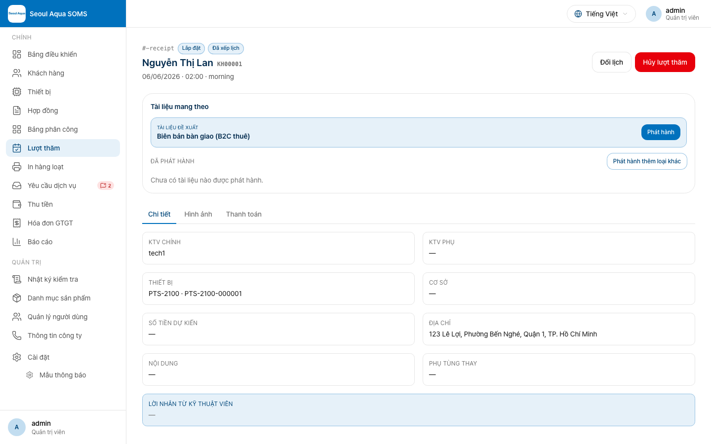

Cấu trúc thẻ **"Giấy tờ mang theo"** ở đầu trang:

- **Nút cấp theo đề xuất mặc định** — Cấp ngay giấy tờ đề xuất trong bảng khớp
- **Dropdown cấp thêm** — Cấp thêm 1 trong 5 loại còn lại (dropdown custom có ô tìm kiếm, ≥5 mục)
- **Bảng lịch sử cấp** — Tên file + Ngày cấp + Người cấp + Hành động Tải về / Cấp lại

#### Hành vi cấp lại

- Nút **Cấp lại** → PDF cũ được tự động archive (`renderer.persistWithArchive`), tạo phiên bản mới
- Mọi lần cấp / cấp lại đều được ghi vào **AuditLog** là `DOCUMENT_ISSUED` hoặc `DOCUMENT_REISSUED` (before/after = { kind, version })
- Khách mất bản sao hóa đơn xin lại → Cấp lại từ cùng lượt thăm → In ra rồi gửi bưu điện hoặc giao lúc lượt thăm sau

#### Đa ngôn ngữ

- Mọi giấy tờ lượt thăm bố trí **VI chính + KO phụ** 2 ngôn ngữ chồng nhau (ví dụ: `Khách hàng / 고객`)
- Header 1 dòng: `SEOUL AQUA · CÔNG TY TNHH MTV TM&DV ĐẠI Á (Seoul Aqua)`
- Watermark là logo công ty (độ mờ 0.07, 200×200pt) — Đặt bên trong mỗi bản sao để sau khi cắt theo đường nét đứt vẫn còn ở cả 2 bản

### 7.10 In Hàng loạt (Phase 6 — 2026-06-03)

**Sidebar trái → "In hàng loạt"** (biểu tượng Printer) hoặc **Nút 🖨 ở đầu cột KTV trong Bảng Phân công Hôm nay**

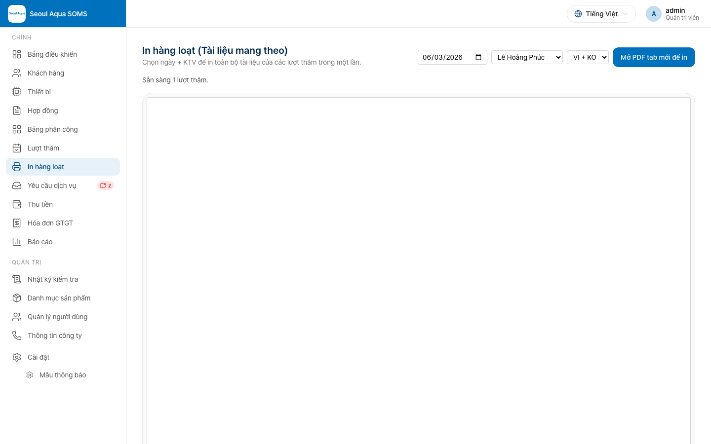

Với 1 ngày + 1 KTV cụ thể, gộp tất cả giấy tờ lượt thăm trong ngày thành **1 PDF duy nhất** để in.

#### Luồng sử dụng

1. Chọn **bộ chọn ngày** + **dropdown chọn KTV** (có ô tìm kiếm) để xác định đối tượng gộp
2. Khu vực xem trước bên phải hiển thị ngay **PDF gộp đơn** trong `<iframe>`
3. Nút **"In PDF ở tab mới"** → Mở trong tab trình duyệt với trình xem PDF → Cmd+P (hoặc Ctrl+P) để in
4. Khi trình xem PDF của trình duyệt in trực tiếp → **In ra A4 chuẩn**. Nếu in từ trong iframe, một số trình duyệt làm méo kích thước trang — vì vậy khuyến nghị mở tab mới.

#### Tự động bao gồm

- Nếu là **lượt thăm lắp đặt (INSTALLATION)**, **PDF hợp đồng** mới nhất ACTIVE/PENDING_SIGNATURE của khách sẽ được **tự động thêm 2 bản** (bản khách + bản công ty). KTV không thể đi lắp đặt đầu tiên mà chỉ cầm biên nhận thôi. Hợp đồng này chính là **PDF y hệt khi xem ở menu Hợp đồng** — không phải tạo mới cho việc in hàng loạt
- **Lượt thăm chưa cấp** giấy tờ đề xuất sẽ được **tự động cấp** ngay trước khi in. Không cần cấp tay từng cái
- **Lượt thăm SUGGESTED (chưa phân công)** được tự loại trừ khỏi việc in (theo chính sách không thể cấp)

#### Thời điểm khuyến nghị dùng

- **Sáng sớm** — In một lần cho mỗi KTV của ngày, xếp tập giấy lên bàn của từng KTV
- **Trước trưa** — Kiểm tra có lượt thăm nào được thêm vào buổi chiều không, in lại nếu cần
- **Khi thêm khẩn cấp** — Ngay sau khi xác nhận thẻ chưa phân công, dùng nút 🖨 ở cột của KTV đó để in phần thêm

#### Mobile cũng được

TECHNICIAN cũng truy cập màn hình tương đương ở `/f/{locale}/visits/print?date=...` (tự lọc theo lượt thăm mình là lead). Dùng khi không nhận được giấy từ văn phòng.

---

## Chương 8. Xử lý Yêu cầu Dịch vụ

### 8.1 Yêu cầu dịch vụ là gì?

Là **yêu cầu khách hàng gửi trực tiếp từ cổng**. Bảo trì máy lọc nước, sửa chữa, thay phụ tùng, di dời lắp đặt, v.v.

Thay vì gọi văn phòng, khách hàng đăng ký từ cổng → văn phòng nhận thông báo tự động → xử lý → thông báo kết quả cho khách.

### 8.2 Các loại yêu cầu dịch vụ

| Loại | Chi phí | Phương thức xử lý |
|---|---|---|
| **INSPECTION** (Bảo trì) | Miễn phí | Tự duyệt → Lịch ngay |
| **CONSULTATION** (Tư vấn) | Miễn phí | Tự duyệt |
| **FAULT_REPORT** (Báo hỏng) | Bảo hành/thuê miễn phí, khác có phí | Văn phòng đánh giá |
| **FILTER_REPLACEMENT_AD_HOC** (Thay lõi đột xuất) | RENTAL miễn phí, SALE có phí | Văn phòng đánh giá |
| **PART_REPLACEMENT** (Thay phụ tùng) | Có phí | Văn phòng đánh giá + Báo giá |
| **RELOCATION** (Di dời lắp đặt) | Có phí | Văn phòng đánh giá + Báo giá |
| **OTHER** | Nhân viên phán đoán | Văn phòng đánh giá |

### 8.3 Màn hình Yêu cầu Dịch vụ

**Menu trái → Click "Yêu cầu dịch vụ"**

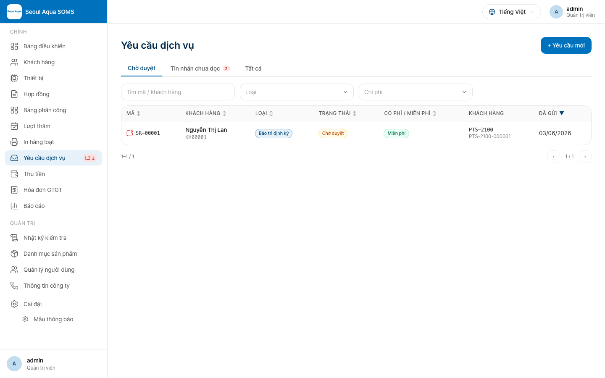

Cấu trúc màn hình:

- **Tab**: Chờ duyệt / Đã duyệt / Đang xử lý / Hoàn thành / Từ chối / Tất cả
- Tab Chờ duyệt là mặc định (nơi xem nhiều nhất)
- **Bộ lọc**: Loại khách hàng, Loại yêu cầu, Khoảng ngày
- **Tìm kiếm**: Tên khách, Mã yêu cầu

### 8.4 Xử lý yêu cầu chờ duyệt (yêu cầu có phí)

#### Bước 1: Click yêu cầu → Màn hình chi tiết

Thông tin hiển thị trên màn hình:

- Thông tin khách hàng
- Loại yêu cầu + Mô tả (khách tự nhập)
- Ảnh đính kèm (nếu khách tải lên)
- Thiết bị liên quan
- Thời điểm khách gửi

#### Bước 2: Nhập báo giá

Nhập số tiền (VND) vào ô "**Báo giá**".

#### Bước 3: Quyết định

**Duyệt (Approve)**:

1. Click nút "**Duyệt**"
2. **Hệ thống tự xử lý**:
   - Gửi **SMS** cho khách (`số tiền + lịch`)
   - Gửi **email** cho khách (PDF báo giá)
   - Khi khách chuyển khoản, văn phòng đối soát → Lịch thăm được xác nhận

**Từ chối (Reject)**:

1. Click nút "**Từ chối**"
2. Nhập **Lý do từ chối** (dropdown: `Ngoài bảo hành`, `Không chẩn đoán được tại chỗ`, `Khác`)
3. Hệ thống gửi SMS + email cho khách (kèm lý do)

### 8.5 Yêu cầu miễn phí — Xử lý tự động

Yêu cầu miễn phí như INSPECTION, CONSULTATION được **tự duyệt** → Lịch thăm được sinh ngay.

Văn phòng chỉ cần xác nhận lịch đã sinh. Không cần thao tác riêng.

### 8.6 Trao đổi tin nhắn trong yêu cầu dịch vụ

Khi khách gửi thêm thông tin hoặc văn phòng cần hỏi thêm:

Trên trang chi tiết yêu cầu có vùng **luồng tin nhắn**.

- Tự làm mới mỗi 30 giây (tự nhận tin nhắn mới của bên kia)
- Có thể đính kèm ảnh
- Cả 2 phía đều ghi vào Nhật ký Kiểm toán

Tin nhắn mới của khách được hiển thị trong chuông thông báo văn phòng.

---

## Chương 9. Nhập và Đối soát Thanh toán

### 9.1 Các phương thức thanh toán

| Mã | Tiếng Hàn / Việt | Luồng xử lý |
|---|---|---|
| **CASH_AT_VISIT** | 방문 시 현금 / Tiền mặt khi thăm | KTV thu → Sáng hôm sau nộp văn phòng → Đối soát |
| **BANK_TRANSFER** | 송금 / Chuyển khoản | Khách chuyển → Văn phòng đối soát |
| **B2B_EINVOICE** | B2B 세금계산서 / Hóa đơn GTGT B2B | Phát hành hóa đơn GTGT bên ngoài + Tải lên PDF → Đối soát chuyển khoản |
| **B2B_NO_INVOICE** | B2B 무세금계산서 / B2B không hóa đơn | Chỉ chuyển khoản (một số B2B không nhận hóa đơn GTGT) |

### 9.2 Màn hình Danh sách Thanh toán

**Menu trái → Click "Thanh toán"**

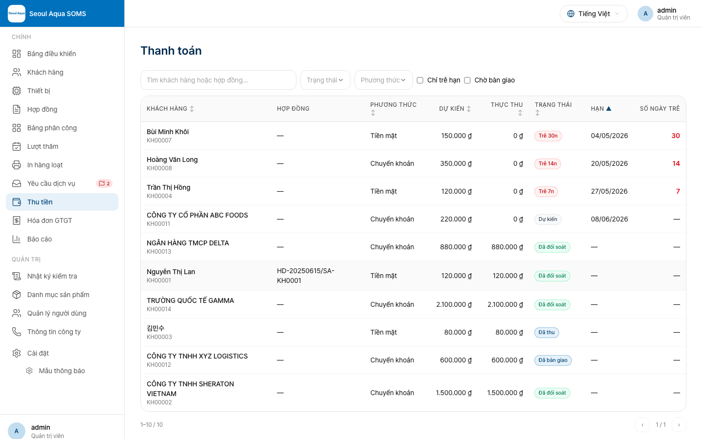

Cấu trúc màn hình:

- **Tab**: Chờ nộp / Chờ đối soát / Hoàn tất / Quá hạn / Tất cả
- Nơi xem nhiều nhất: **"Chờ đối soát"** (công việc chính hàng ngày)
- **Bộ lọc**: Phương thức thanh toán, Khách hàng, Khoảng ngày, Khoảng số tiền
- **Tìm kiếm**: Mã khách, Mã tham chiếu chuyển khoản

### 9.3 Đối soát chuyển khoản (BANK_TRANSFER)

Khi khách chuyển vào tài khoản, nhân viên văn phòng đối soát xem là của khách nào, hợp đồng nào, kỳ tháng nào.

#### Bước 1: Xác nhận nhận tiền trên tài khoản

Vào internet banking để xác nhận tiền mới về. Ghi nhớ tên người chuyển, số tiền, số tham chiếu (memo).

#### Bước 2: Đối soát trong tab "Chờ đối soát"

Tìm khách hàng tương ứng → Tìm dòng công nợ → Nút "**Đối soát**"

#### Bước 3: Nhập trong màn hình đối soát

- **Số tiền**: Tự động (có thể chỉnh)
- **Mã tham chiếu**: Số hiển thị trên tài khoản
- **Ngày thanh toán**: Ngày tiền về
- **Ghi chú**: Lưu ý đặc biệt (ví dụ: "Tiền cọc trước")

Khi lưu:

- Trạng thái thanh toán: `PENDING` → `RECEIVED` → `RECONCILED`
- Số kỳ thanh toán cộng dồn của hợp đồng tự tăng
- **Email hóa đơn thu tiền** tự gửi cho khách
- Nếu trước đó là trạng thái quá hạn → Tự khôi phục `OVERDUE` → `ACTIVE`

### 9.4 Nhận tiền mặt (CASH_AT_VISIT)

KTV mang đến văn phòng vào sáng ngày làm việc kế tiếp số tiền mặt đã nhận hôm qua từ khách.

#### Bước 1: Tab "Chờ nộp"


- Tất cả dòng KTV đã thu hôm qua
- Nhóm theo KTV
- Tự tính tổng số tiền

#### Bước 2: Kiểm tra phong bì tiền mặt KTV mang đến

- Đếm tiền mặt trong phong bì
- Nhận bản sao hóa đơn (KTV đã phát cho khách)

#### Bước 3: Đối soát

- Kiểm tra tổng trên màn hình và tổng tiền trong phong bì có khớp không
- Khớp thì nút "**Nhận toàn bộ**" → Xử lý cả lô
- Không khớp thì kiểm từng dòng + Ghi lý do chênh lệch

#### Bước 4: Khi có chênh lệch

- Thiếu biên lai, thất lạc, v.v. → **Báo cáo ADMIN ngay lập tức**
- Hệ thống cũng tự gửi cảnh báo cho ADMIN (cron chưa nộp D+1)

### 9.5 Máy trạng thái Thanh toán

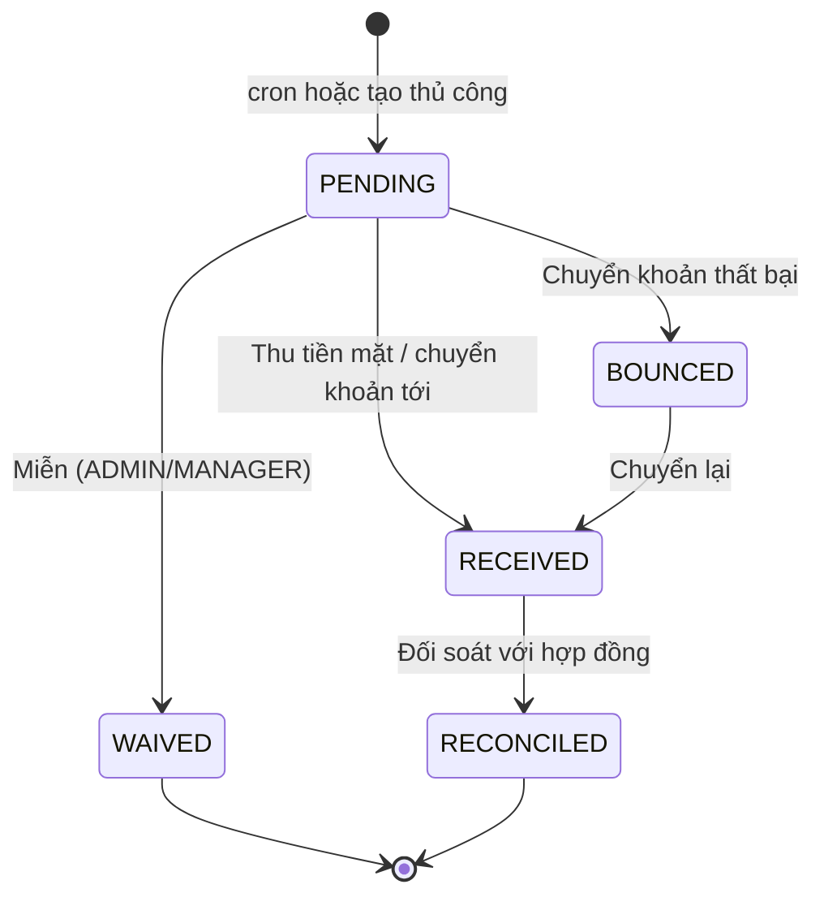
```mermaid
stateDiagram-v2
  [*] --> PENDING: cron hoặc tạo thủ công
  PENDING --> RECEIVED: Thu tiền mặt / chuyển khoản tới
  RECEIVED --> RECONCILED: Đối soát với hợp đồng
  PENDING --> WAIVED: Miễn (ADMIN/MANAGER)
  PENDING --> BOUNCED: Chuyển khoản thất bại

  BOUNCED --> RECEIVED: Chuyển lại
  WAIVED --> [*]
  RECONCILED --> [*]
```

### 9.6 Leo thang công nợ tự động

Khi khách hàng quá hạn thanh toán, hệ thống tự gửi thông báo:

| Giai đoạn | Thời điểm | Thông báo |
|---|---|---|
| **D+7** | Trễ 7 ngày | Email → Bên ký hợp đồng + Liên hệ vận hành (CC) |
| **D+14** | Trễ 14 ngày | Email thêm 1 lần |
| **D+30** | Trễ 30 ngày | SMS → Bên ký hợp đồng + Tất cả Liên hệ vận hành<br/>Trạng thái hợp đồng → `OVERDUE` |

Tới giai đoạn D+30 sẽ hiển thị trên **màn hình "Thông báo cưỡng chế" của bảng điều khiển văn phòng**. Là lúc cần hành động trực tiếp như gọi điện, đến tận nơi.

### 9.7 Miễn thanh toán (Waive)

Khi tình huống khách (đóng cửa, thỏa thuận phá sản, v.v.) khiến phải miễn thanh toán:

**MANAGER trở lên**:

1. Click dòng thanh toán → Nút "**Miễn**"
2. Nhập lý do (bắt buộc)
3. Xác nhận → Trạng thái `PENDING` → `WAIVED`
4. Ghi vào Nhật ký Kiểm toán (ai, khi nào, vì sao)

---

## Chương 10. Hóa đơn GTGT (chỉ B2B)

### 10.1 Cách xử lý hóa đơn GTGT v1

Trong v1, **PDF do hệ thống e-Invoice ngoài (Viettel SInvoice / MISA / VNPT eHoadon, v.v.) phát hành** sẽ được tải lên SOMS.

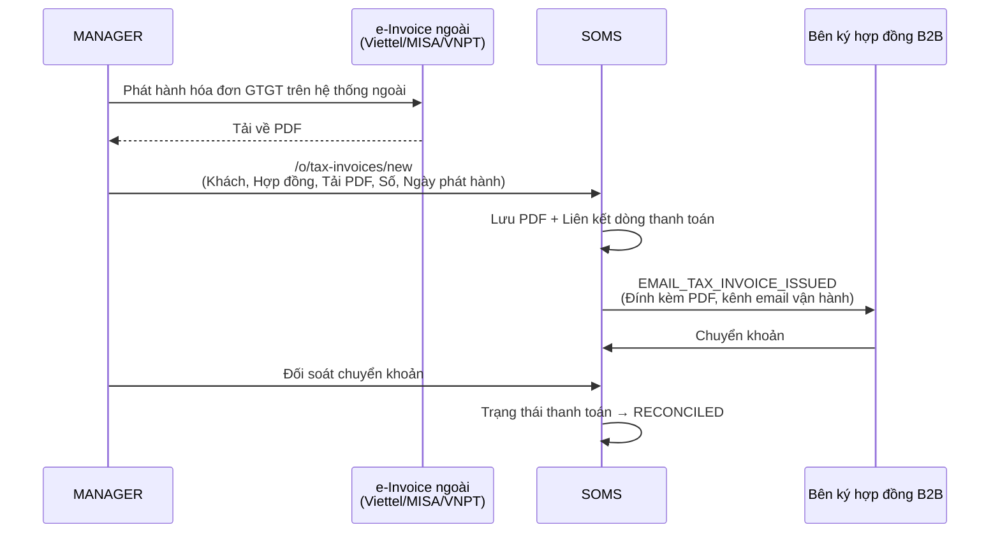
```mermaid
sequenceDiagram
  participant Mgr as MANAGER
  participant Ext as e-Invoice ngoài<br/>(Viettel/MISA/VNPT)
  participant SOMS
  participant CP as Bên ký hợp đồng B2B

  Mgr->>Ext: Phát hành hóa đơn GTGT trên hệ thống ngoài
  Ext-->>Mgr: Tải về PDF

  Mgr->>SOMS: /o/tax-invoices/new<br/>(Khách, Hợp đồng, Tải PDF, Số, Ngày phát hành)
  SOMS->>SOMS: Lưu PDF + Liên kết dòng thanh toán
  SOMS->>CP: EMAIL_TAX_INVOICE_ISSUED<br/>(Đính kèm PDF, kênh email vận hành)

  CP->>SOMS: Chuyển khoản
  Mgr->>SOMS: Đối soát chuyển khoản
  SOMS->>SOMS: Trạng thái thanh toán → RECONCILED
```

### 10.2 Màn hình Hóa đơn GTGT (chỉ MANAGER+ thấy)

**Menu trái → "Hóa đơn GTGT"**

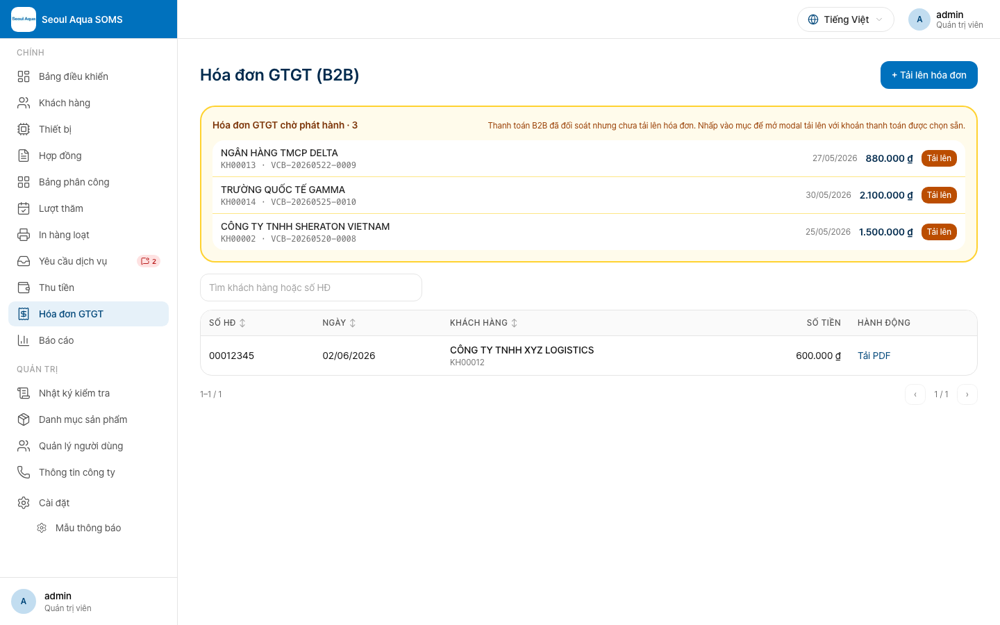

Cấu trúc màn hình:

- Danh sách phát hành (theo ngày)
- Bộ lọc: Khách hàng, Tháng phát hành, Trạng thái thanh toán
- Nút **Hóa đơn GTGT mới**

### 10.3 Các bước tải lên Hóa đơn GTGT

#### Chuẩn bị trước

1. Đăng nhập hệ thống e-Invoice ngoài
2. Nhập thông tin khách, số tiền hợp đồng để phát hành hóa đơn GTGT
3. **Tải về PDF** — Đây là file sẽ tải lên SOMS

#### Tải lên SOMS

1. Menu **Hóa đơn GTGT → Nút "Hóa đơn GTGT mới"**
2. Nhập:
   - **Khách hàng**: Chọn từ dropdown
   - **Hợp đồng liên quan**: Hóa đơn GTGT này cho hợp đồng nào
   - **Số hóa đơn**: Số do hệ thống ngoài cấp
   - **Ngày phát hành**: Ngày phát hành ở hệ thống ngoài
   - **Số tiền**: VND (có thể tự đối soát)
   - **Tải lên PDF**: Chọn file PDF đã tải về
3. **Lưu**
4. Hệ thống tự xử lý:
   - **Tự gửi email cho khách** (đính kèm PDF)
   - Liên kết dòng thanh toán → Chờ chuyển khoản
   - Thêm vào Nhật ký Kiểm toán

### 10.4 Lưu trữ Hóa đơn GTGT

- PDF hóa đơn GTGT lưu trữ **10 năm** (khuyến nghị pháp luật Việt Nam)
- Hóa đơn thu tiền thông thường lưu **5 năm**
- Tự đếm từ thời điểm kết thúc

### 10.5 Một số câu hỏi thường gặp

**Q1: Tôi nhập sai số hóa đơn GTGT.**

→ Nếu vừa phát hành, nhờ ADMIN sửa. Phải sửa cùng lúc cả ở hệ thống ngoài. Lịch sử thay đổi lưu trong Nhật ký Kiểm toán.

**Q2: Khách bảo không cần hóa đơn GTGT.**

→ B2B nhưng không cần hóa đơn GTGT thì đăng ký phương thức thanh toán là `B2B_NO_INVOICE`. Xử lý như chuyển khoản thông thường.

**Q3: Hệ thống e-Invoice ngoài bị lỗi.**

→ Chờ hệ thống ngoài khôi phục rồi phát hành + tải lên. Trong SOMS có thể để ghi chú tạm.

---

## Chương 11. Báo cáo và Nhật ký Kiểm toán

### 11.1 Menu Báo cáo

**Menu trái → "Báo cáo"**

Menu phụ:

| Menu | Nội dung |
|---|---|
| **Doanh thu** | Doanh thu theo tháng·kỳ (phân tách theo loại hợp đồng) |
| **Công nợ** | Danh sách khách theo giai đoạn quá hạn (D+7, D+14, D+30) |
| **Năng suất KTV** | Số lượt, thời gian trung bình, số tiền thu theo KTV |
| **Lõi sắp hết hạn** | Khách cần thay lõi trong 30 ngày tới |
| **Hợp đồng sắp hết hạn** | RENTAL hết hạn trong 60 ngày tới |
| **Nhật ký kiểm toán** | Chỉ MANAGER+ — Mọi lịch sử thay đổi của hệ thống |

### 11.2 Nhật ký Kiểm toán (Audit Log) — MANAGER+

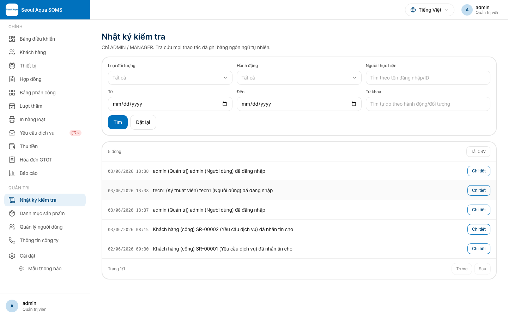

Cấu trúc màn hình:

- Tất cả hành động của hệ thống (thêm người dùng, kích hoạt hợp đồng, đổi mật khẩu, v.v.)
- Bộ lọc: Loại hành động, Người dùng, Khoảng ngày
- Click từng dòng để xem **JSON trước/sau thay đổi**
- **Xuất CSV** (chỉ ADMIN làm được)

#### Thời gian lưu trữ

- Nhật ký kiểm toán: **24 tháng**
- Cron dọn dẹp tự động: Mỗi ngày 03:30 VST

#### Các loại hành động chính

| Mã hành động | Mô tả |
|---|---|
| `USER_CREATED` | Đăng ký nhân viên mới |
| `USER_DEACTIVATED` | Vô hiệu hóa nhân viên |
| `PASSWORD_CHANGED` | Đổi mật khẩu (cá nhân hoặc reset) |
| `CUSTOMER_CREATED` | Đăng ký khách hàng mới |
| `CUSTOMER_UPDATED` | Sửa thông tin khách |
| `CONTRACT_ACTIVATED` | Kích hoạt hợp đồng |
| `CONTRACT_COMPLETED` | Kết thúc hợp đồng |
| `PAYMENT_RECEIVED` | Thu thanh toán |
| `PAYMENT_WAIVED` | Miễn thanh toán |
| `VISIT_COMPLETED` | Hoàn thành lượt thăm |
| `SR_APPROVED` | Duyệt yêu cầu dịch vụ |
| `SR_REJECTED` | Từ chối yêu cầu dịch vụ |
| `TAX_INVOICE_ISSUED` | Phát hành hóa đơn GTGT |
| `AMBIGUOUS_USERNAME` | Chặn đăng nhập do trùng tên (bảo mật) |

### 11.3 Mẹo sử dụng báo cáo

**Khóa sổ cuối tháng**:
1. Báo cáo doanh thu → Xem tổng hợp đồng mới + thu tiền trong tháng
2. Báo cáo công nợ → Liên hệ trực tiếp với khách giai đoạn D+30
3. Năng suất KTV → Xem KTV hoạt động nhiều nhất (để xem xét thưởng)

**So sánh theo tháng**:
- Dùng "Chọn kỳ" trên báo cáo để so sánh với tháng trước
- Chuyển sang xem đồ thị để theo dõi xu hướng

---

## Chương 12. Quản lý Hệ thống (chỉ ADMIN)

### 12.1 Quản lý người dùng

**Menu trái → "Quản lý hệ thống" → "Người dùng"**

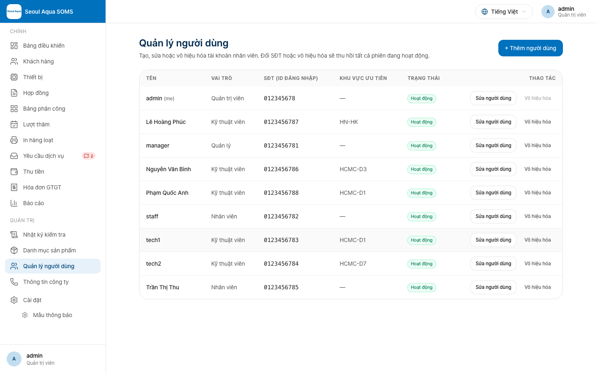

#### Đăng ký người dùng mới

1. Nút "**Người dùng mới**"
2. Nhập:
   - **Tên người dùng** (ví dụ: `manager_kim`, `staff_a`) — Để hiển thị màn hình
   - **Số điện thoại** — ID đăng nhập + Nhận SMS
   - **Email** (tùy chọn)
   - **Vai trò** (dropdown): `ADMIN` / `MANAGER` / `STAFF` / `TECHNICIAN`
   - **Trạng thái hoạt động** (mặc định BẬT)
3. Lưu → **Mật khẩu tạm thời gửi qua SMS đến điện thoại người dùng mới**
4. Người dùng mới đăng nhập lần đầu → Đổi mật khẩu

#### Vô hiệu hóa người dùng

Khi nhân viên thôi việc·nghỉ phép:

1. Click người dùng đó → Nút "**Vô hiệu hóa**"
2. Nhập lý do
3. Ngay lập tức không đăng nhập được, mọi phiên tự kết thúc

> **Không xóa được.** Vì lưu trữ Nhật ký Kiểm toán. Vô hiệu hóa là đủ.

#### Đặt lại mật khẩu

Khi cá nhân quên mật khẩu, ADMIN xử lý:

1. Click người dùng đó → Nút "**Đặt lại mật khẩu**"
2. **Mật khẩu tạm thời mới tự sinh + Gửi SMS**
3. Cá nhân đăng nhập lại → Đặt mật khẩu mới

### 12.2 Quản lý Catalog sản phẩm

**Menu trái → "Quản lý hệ thống" → "Catalog sản phẩm"**

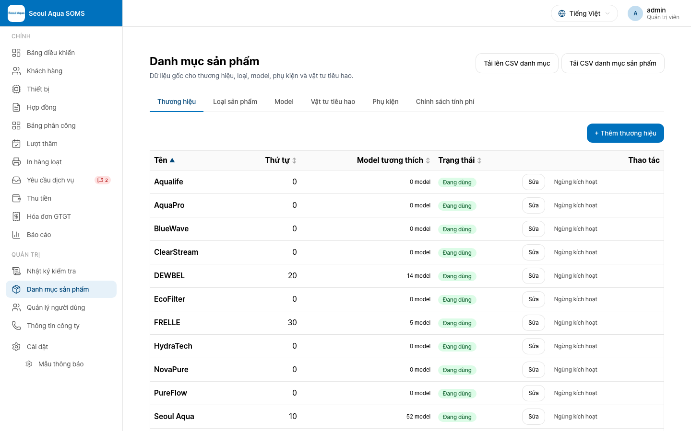

#### Đăng ký Brand

- Nút "**Brand mới**"
- Nhập tên Brand (ví dụ: `Seoul Aqua`, `Coway`)

#### Đăng ký Model

1. Chọn Brand → Nút "**Model mới**"
2. Nhập:
   - **Mã model** (unique trong Brand)
   - **Tên model (Tiếng Hàn)** — Bắt buộc
   - **Tên model (Tiếng Việt)** — Bắt buộc
   - **Tên model (Tiếng Anh)** — Bắt buộc
   - **Danh mục** (Máy lọc nước, Máy lọc không khí, Bồn cầu thông minh, v.v.)
   - **Giá mặc định** (tùy chọn)
3. Lưu

#### Đăng ký tương thích Filter

- Chi tiết model → "**Thêm Filter tương thích**"
- Nhập **Mã phụ tùng** + **Chu kỳ thay (tháng)**
- Cron bảo trì định kỳ dùng thông tin này để tự tính ngày thay kế tiếp

#### Tải CSV hàng loạt

Khi cần đăng ký số lượng lớn:

1. Nút "**Tải CSV**"
2. Tải file mẫu → Điền bằng Excel
3. Tải lên → Hệ thống kiểm tra hợp lệ → Thêm cả lô

### 12.3 Trọng số lập lịch

**Menu trái → "Quản lý hệ thống" → "Trọng số lập lịch"**

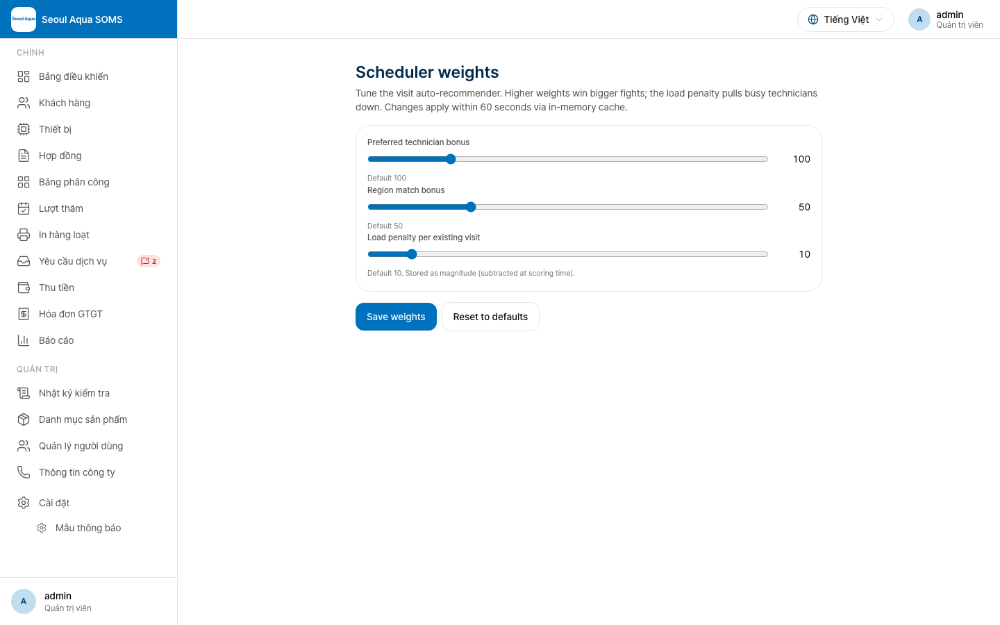

Điều chỉnh trọng số ưu tiên của thuật toán tự gán lượt thăm.

Cài đặt mặc định:
- **KTV ưu tiên của khách**: 100 điểm
- **Khớp khu vực**: 50 điểm
- **Cân bằng tải**: 20 điểm

Khi nhân lực KTV thay đổi, chính sách vận hành đổi thì ADMIN điều chỉnh. Sau khi đổi áp dụng ngay cho lượt thăm mới.

---

## Chương 13. Các tình huống thường gặp

### Tình huống 1: Khách điện thoại "Mai tôi không tiếp được"

Xử lý:
1. Menu "Lượt thăm" → Tìm lượt thăm đó (tên khách hoặc ngày)
2. Nút "**Đổi lịch**"
3. Chọn ngày mới + Lý do "Khách yêu cầu"
4. Lưu → SMS thông báo khách·KTV tự động

### Tình huống 2: Khách bảo quên mật khẩu (MANAGER+)

Xử lý:
1. Chi tiết khách hàng → Nút "**Đặt lại mật khẩu**"
2. Xác nhận → Mật khẩu tạm thời mới tự gửi đến điện thoại khách
3. **Tự đăng xuất mọi thiết bị khác** (bảo mật)

### Tình huống 3: Khách B2B bảo "Cho tôi hóa đơn GTGT"

Xử lý:
1. Phát hành hóa đơn GTGT trên hệ thống e-Invoice ngoài → Tải về PDF
2. Menu SOMS "Hóa đơn GTGT" → "**Hóa đơn GTGT mới**"
3. Khách·Hợp đồng·Tải PDF → Lưu
4. Email được gửi tự động

### Tình huống 4: Công ty khách có nhân viên mới phụ trách máy lọc

Xử lý:
- **Nếu là khách B2B**: Bên ký hợp đồng có thể tự thêm trên cổng khách. Văn phòng không cần can thiệp.
- **Nếu muốn can thiệp**: Chi tiết khách → Tab "Liên hệ" → "**Liên hệ mới**" (tham khảo mục 5.5)

### Tình huống 5: Cảnh báo công nợ hiện ra

Xử lý:
1. Bảng điều khiển → Click thẻ "Cảnh báo công nợ" hoặc "Thanh toán" → Tab "Quá hạn"
2. Xem giai đoạn theo khách (D+7/D+14/D+30)
3. Giai đoạn D+30 cần gọi điện trực tiếp hoặc đến tận nơi
4. Khi tiền vào, đối soát → Tự khôi phục

### Tình huống 6: Khách muốn chấm dứt hợp đồng sớm (MANAGER+)

Xử lý:
1. Chi tiết hợp đồng → Nút "**Đề nghị chấm dứt sớm**"
2. Chọn lý do + Ghi chú
3. RENTAL tự sinh lượt thăm thu hồi
4. Phí phá vỡ hoặc hoàn tiền do ADMIN trao đổi rồi xử lý trong menu Thanh toán

### Tình huống 7: Hợp đồng thuê hết hạn mà khách muốn chuyển sang bảo trì

Xử lý:
1. Hợp đồng đã hết hạn → Nút "**Gia hạn: Bảo trì**"
2. Nhập phí bảo trì hàng tháng mới
3. Xác nhận → Tự xử lý (tham khảo mục 6.7)

### Tình huống 8: Khách muốn "di dời máy lọc sang văn phòng khác"

Xử lý:
1. Khách gửi yêu cầu RELOCATION qua cổng → Vào tab "Yêu cầu dịch vụ"
2. Đánh giá + Nhập báo giá → Duyệt
3. Khách chuyển khoản → Đối soát → Lượt thăm di dời tự sinh

### Tình huống 9: Có 2 nhân viên cùng tên nên không đăng nhập được (bảo mật)

Xử lý:
- **Đăng nhập bằng số điện thoại** (số điện thoại chắc chắn 1 người 1 số)
- Hoặc ADMIN đổi 1 trong các tên người dùng

### Tình huống 10: KTV không nộp tiền mặt thu hôm qua

Xử lý:
1. "Thanh toán" → Tab "Chờ nộp" xem dòng của KTV đó
2. Gọi điện·liên lạc KTV (D+1 không nộp tự gửi cảnh báo ADMIN)
3. Trễ từ D+2 trở lên báo ADMIN

### Tình huống 11: Khách muốn "đổi Bên ký hợp đồng" (ví dụ: đổi giám đốc)

Xử lý — **Chỉ MANAGER trở lên**:
1. Chi tiết khách hàng → Tab "Liên hệ" → Chọn Bên ký hợp đồng
2. Nút "**Đổi**" → Nhập thông tin người mới
3. **Khuyến nghị phát hành PDF hợp đồng mới + Ký lại** (an toàn pháp lý)
4. Lịch sử thay đổi tự ghi vào Nhật ký Kiểm toán

### Tình huống 12: Khách chuyển khoản nhầm (vào tên khách khác)

Xử lý:
1. Thanh toán → Tab "**Không khớp**" (hoặc kho tạm)
2. Báo ADMIN → Sau khi xác nhận với khách thì đối soát hoặc hoàn tiền
3. Khi hoàn tiền sinh dòng Payment âm

### Tình huống 13: Văn phòng tìm thông tin khách mà không ra

Kiểm tra:
- Khách có bị vô hiệu hóa không (toggle "Bao gồm không hoạt động" trên sidebar)
- Nhập đúng mã khách (`KH...`)
- Kiểm tra dấu cách trong tên doanh nghiệp B2B

### Tình huống 14: Thông tin khách nhập sai cần sửa

Xử lý:
- Thông tin đơn giản (tên·điện thoại·địa chỉ): STAFF tự sửa
- Mã số thuế·Tên doanh nghiệp có ảnh hưởng pháp lý: MANAGER trở lên

Sau khi sửa, lịch sử thay đổi tự lưu vào Nhật ký Kiểm toán.

### Tình huống 15: Sáng nay tích lũy 12 lượt thăm chưa phân công (Phase 6)

Xử lý:
1. Sidebar trái → Click **"Phân công hôm nay"** (§7.8)
2. Xử lý các thẻ trong hàng đợi chưa phân công bên trái từ trên xuống — mỗi thẻ có KTV đề xuất
3. Nút **Xác nhận ▸** 1-click cho mỗi thẻ → Chuyển ngay sang cột bên phải
4. Nhìn chip tải của các cột phải, nếu tải dồn vào 1 KTV → các thẻ còn lại gán cho KTV ít tải hơn
5. Khi đã xử lý xong, dùng nút **🖨 In** ở mỗi cột KTV để in hàng loạt giấy tờ cả ngày → Tập giấy lên bàn KTV

> 💡 Khác với Tình huống 1: Tình huống 1 là "đổi lịch của 1 khách", Tình huống 15 là "phân công nhiều lượt thăm cùng lúc". Cái sau nhanh với bảng phân công.

### Tình huống 16: Khách điện thoại "cho tôi xin lại bản sao hóa đơn" (Phase 6)

Xử lý:
1. Menu lượt thăm → Tìm lượt thăm liên quan → Vào chi tiết
2. Thẻ **"Giấy tờ mang theo"** ở đầu → Tìm loại tương ứng trong lịch sử cấp
3. Click **Tải về** → Lấy PDF → Gửi email cho khách hoặc in ra rồi gửi bưu điện / giao lúc lượt thăm sau
4. Nếu thiết kế đã đổi và cần phiên bản mới → Click **Cấp lại** → Sinh PDF mới, bản cũ được archive
5. Tự ghi vào AuditLog là `DOCUMENT_REISSUED`

### Tình huống 17: Lượt thăm lắp đặt cần mang theo hợp đồng (Phase 6)

Xử lý:
1. Menu **In hàng loạt** (hoặc 🖨 ở cột KTV trong **Phân công hôm nay**)
2. Chọn ngày + KTV liên quan
3. Bản xem trước in **tự bao gồm 2 bản hợp đồng** (bản khách + bản công ty) — không cần thao tác tay
4. **"In PDF ở tab mới"** → Tab mới → Cmd+P → In A4

> ⚠️ Nếu hợp đồng vẫn ở trạng thái DRAFT chứ chưa ACTIVE/PENDING_SIGNATURE thì không tự kèm. Hãy kích hoạt ở menu Hợp đồng trước hoặc đưa lên PENDING_SIGNATURE.

---

## Chương 14. Quy tắc Bảo mật

### 14.1 Tuyệt đối không được làm

#### Viết mật khẩu lên giấy

Đặc biệt là post-it cạnh màn hình bị cấm. Ai chụp 1 ảnh là xong.

> Quên thì dùng "Quên mật khẩu" hoặc nhờ ADMIN.

#### Để người khác làm việc bằng tài khoản của bạn

Tất cả hành động bằng tài khoản cá nhân sẽ ghi **tên cá nhân vào Nhật ký Kiểm toán**. Sai sót của đồng nghiệp khi dùng tài khoản bạn là trách nhiệm của bạn.

#### Không lưu thông tin đăng nhập trên máy tính dùng chung

Tắt tùy chọn "Lưu mật khẩu" của trình duyệt.

#### Cấm chia sẻ mật khẩu

Mật khẩu cá nhân chỉ **mình bạn biết**. Cấm cho đồng nghiệp "mượn dùng tạm".

### 14.2 Khuyến nghị

#### Đăng xuất hoặc khóa màn hình khi rời chỗ

Buổi trưa·họp·ra ngoài bắt buộc đăng xuất hoặc khóa máy tính.

#### Đổi mật khẩu định kỳ

Khuyến nghị tự đổi 3~6 tháng/lần.

#### Báo cáo ngay hoạt động khả nghi

- Nếu thấy hành động bạn không làm hiện trong Nhật ký Kiểm toán → Báo ADMIN ngay
- Nếu người lạ hỏi thông tin tài khoản của bạn → Bỏ qua + báo cáo

### 14.3 Bảo mật tự động hệ thống

Hệ thống tự xử lý các điều sau:

- **3 lần đăng nhập thất bại** → Tự khóa tài khoản 1 giờ
- **Đăng nhập bằng tên người dùng trùng** → Tự từ chối (ghi `AMBIGUOUS_USERNAME`)
- **Khi đổi mật khẩu** → Tự đăng xuất mọi thiết bị khác
- **Khi đăng xuất** → Tự xóa mọi dữ liệu cache trên thiết bị đó

### 14.4 Sự cố bảo mật thường gặp và cách phòng tránh

| Sự cố | Phòng tránh |
|---|---|
| Đồng nghiệp miễn thanh toán bằng tài khoản bạn | Cấm chia sẻ mật khẩu + Khóa máy khi rời chỗ |
| Rò rỉ thông tin khách ra ngoài | Xuất CSV chỉ dùng trong email nội bộ, cấm USB |
| Mất điện thoại → SMS bị chiếm | Báo ADMIN ngay → Buộc kết thúc mọi phiên + Đặt lại mật khẩu |

---

## Phụ lục A. Tìm Menu nhanh

| Muốn làm gì | Đường dẫn menu | Quyền cần |
|---|---|---|
| Xem·tìm thông tin khách | Khách hàng | STAFF+ |
| Đăng ký khách mới | Khách hàng → Khách mới | STAFF+ |
| Soạn hợp đồng mới | Hợp đồng → Hợp đồng mới (hoặc trang khách) | STAFF+ |
| Sửa giá hợp đồng | Hợp đồng → Sửa | MANAGER+ |
| Lập lịch thăm mới | Lượt thăm → Lượt thăm mới | STAFF+ |
| Đổi lịch thăm | Lượt thăm → Đổi lịch | STAFF+ |
| Phân công cùng lúc các lượt thăm chưa có KTV | Phân công hôm nay (hoặc Lượt thăm → tab Chưa phân công) | STAFF+ |
| Cấp / cấp lại giấy tờ mang theo lượt thăm | Lượt thăm → Chi tiết → Thẻ Giấy tờ mang theo | STAFF+ |
| In hàng loạt giấy tờ cả ngày của 1 KTV | In hàng loạt (hoặc Phân công hôm nay → 🖨 ở cột KTV) | STAFF+ |
| Đối soát chuyển khoản khách | Thanh toán → Chờ đối soát | STAFF+ |
| Nhận tiền mặt KTV | Thanh toán → Chờ nộp | STAFF+ |
| Miễn thanh toán | Thanh toán → Click dòng → Miễn | MANAGER+ |
| Tải lên hóa đơn GTGT | Hóa đơn GTGT → Hóa đơn GTGT mới | MANAGER+ |
| Đánh giá yêu cầu dịch vụ | Yêu cầu dịch vụ → Chờ duyệt | STAFF+ |
| Báo cáo doanh thu | Báo cáo → Doanh thu | STAFF+ |
| Xem nhật ký kiểm toán | Báo cáo → Nhật ký kiểm toán | MANAGER+ |
| Xuất nhật ký kiểm toán | Báo cáo → Nhật ký kiểm toán → CSV | ADMIN |
| Đăng ký nhân viên mới | Quản lý hệ thống → Người dùng → Người dùng mới | ADMIN |
| Đặt lại mật khẩu nhân viên | Quản lý hệ thống → Người dùng → Click dòng | ADMIN |
| Đặt lại mật khẩu khách | Trang khách → Đặt lại mật khẩu | MANAGER+ |
| Đăng ký model sản phẩm mới | Quản lý hệ thống → Catalog sản phẩm | ADMIN |
| Điều chỉnh trọng số lập lịch | Quản lý hệ thống → Trọng số lập lịch | ADMIN |

---

## Phụ lục B. Danh mục Thông báo

Danh sách tất cả thông báo hệ thống tự gửi.

### Chỉ SMS (7 — bảo mật·khẩn cấp)

| Mã | Thời điểm | Người nhận |
|---|---|---|
| SMS_PORTAL_WELCOME | Đăng ký khách·nhân viên mới | Cá nhân |
| SMS_PASSWORD_RESET | Đặt lại mật khẩu | Cá nhân |
| SMS_VISIT_REMINDER | D-1 lượt thăm | Liên hệ vận hành |
| SMS_SR_APPROVED | Duyệt cuối yêu cầu dịch vụ có phí + Lịch | Khách |
| SMS_SR_REJECTED | Từ chối yêu cầu dịch vụ + Lý do | Khách |
| SMS_PAYMENT_OVERDUE_FINAL | Công nợ D+30 | Bên ký hợp đồng + Tất cả OPS |
| SMS_CONTRACT_RENEWAL_FINAL | D-7 hết hạn thuê | Bên ký hợp đồng |

### Chỉ Email (9 — hóa đơn·hướng dẫn)

| Mã | Thời điểm | Người nhận |
|---|---|---|
| EMAIL_SR_RECEIVED | Ngay khi tiếp nhận yêu cầu dịch vụ | Khách |
| EMAIL_VISIT_COMPLETED | Ngay khi hoàn thành lượt thăm | Liên hệ vận hành (đính kèm PDF) |
| EMAIL_PAYMENT_RECEIPT | Ngay khi đối soát thanh toán | Liên hệ vận hành |
| EMAIL_RENTAL_DUE | Mỗi ngày 1 hàng tháng (RENTAL/MAINTENANCE) | Bên ký hợp đồng |
| EMAIL_PAYMENT_OVERDUE_D7 | Công nợ D+7 | Bên ký hợp đồng + CC |
| EMAIL_PAYMENT_OVERDUE_D14 | Công nợ D+14 | Bên ký hợp đồng + CC |
| EMAIL_FILTER_DUE_D14 | D-14 thay lõi | Liên hệ vận hành |
| EMAIL_CONTRACT_RENEWAL_D60 | D-60 hết hạn thuê | Bên ký hợp đồng |
| EMAIL_CONTRACT_RENEWAL_D30 | D-30 hết hạn thuê | Bên ký hợp đồng |
| EMAIL_TAX_INVOICE_ISSUED | Ngay khi tải hóa đơn GTGT | Bên ký hợp đồng (đính kèm PDF) |

### Hybrid — Gửi đồng thời SMS + Email

| Mã | Thời điểm |
|---|---|
| Duyệt SR (có phí) | SMS (lịch ngắn) + Email (PDF báo giá) |
| Portal Welcome (mới) | SMS (mật khẩu tạm) + Email (hướng dẫn dài) |

> **Tin nhắn hệ thống** (đặt lại mật khẩu, hóa đơn thu tiền) được **gửi bỏ qua opt-out**. Chỉ tin nhắn thông thường mới được khách tắt.

---

## Phụ lục C. Từ điển Trạng thái

### Trạng thái Hợp đồng

| Trạng thái | Tiếng Việt | Ý nghĩa |
|---|---|---|
| `DRAFT` | Bản nháp | Đang soạn, chưa ký |
| `ACTIVE` | Đang hoạt động | Vận hành bình thường |
| `OVERDUE` | Quá hạn | Công nợ D+7 trở lên |
| `COMPLETED` | Kết thúc | Đã thanh toán hết các kỳ hoặc hết hạn |
| `TERMINATED_EARLY` | Chấm dứt sớm | Khách yêu cầu hoặc chấm dứt bắt buộc |
| `CANCELLED` | Hủy | Hủy trong khi soạn |

### Trạng thái Lượt thăm

| Trạng thái | Tiếng Việt | Ý nghĩa |
|---|---|---|
| `SCHEDULED` | Đã lên lịch | Đã có lịch |
| `CONFIRMED` | Đã xác nhận | Khách xác nhận |
| `IN_PROGRESS` | Đang tiến hành | KTV bắt đầu |
| `COMPLETED` | Hoàn thành | Đã xong công việc |
| `RESCHEDULED` | Đã đổi lịch | Chuyển sang ngày khác |
| `CUSTOMER_NO_SHOW` | Khách vắng | KTV đến nhưng khách không có |
| `NEEDS_REVISIT` | Cần thăm lại | Thiếu linh kiện, v.v. |
| `CANCELLED` | Hủy | Khách·Văn phòng hủy |

### Trạng thái Thanh toán

| Trạng thái | Tiếng Việt | Ý nghĩa |
|---|---|---|
| `PENDING` | Chờ | Mới tạo hóa đơn |
| `RECEIVED` | Đã nhận | Tiền mặt hoặc chuyển khoản đến |
| `RECONCILED` | Đã đối soát | Đã xác định hợp đồng·kỳ — Bình thường |
| `WAIVED` | Miễn | Văn phòng miễn thanh toán |
| `BOUNCED` | Thất bại | Chuyển khoản thất bại / phá sản |

### Trạng thái Thiết bị

| Trạng thái | Tiếng Việt | Ý nghĩa |
|---|---|---|
| `PENDING_INSTALL` | Chờ lắp | Sau kích hoạt hợp đồng, trước lắp |
| `ACTIVE` | Đang hoạt động | Đang sử dụng |
| `REPLACED` | Đã thay | Đã đổi sang thiết bị khác |
| `RELOCATED` | Đang di chuyển | Đang chuyển sang Cơ sở khác |
| `RETRIEVED` | Đã thu hồi | Thu khi RENTAL kết thúc |
| `DEACTIVATED` | Không hoạt động | Cascade vô hiệu hóa khách |

### Trạng thái Yêu cầu Dịch vụ

| Trạng thái | Tiếng Việt | Ý nghĩa |
|---|---|---|
| `SUBMITTED` | Đã gửi | Khách gửi |
| `AUTO_APPROVED` | Tự duyệt | Loại miễn phí |
| `APPROVED` | Đã duyệt | Văn phòng đánh giá duyệt |
| `REJECTED` | Từ chối | Văn phòng từ chối |
| `SCHEDULED` | Đã lên lịch | Đã xác định lịch thăm |
| `COMPLETED` | Hoàn thành | Đã hoàn thành lượt thăm |
| `CANCELLED` | Hủy | Khách hủy |

---

## Khi cần trợ giúp

- **Hệ thống chạy lạ** → Báo MANAGER hoặc ADMIN
- **Quên mật khẩu** → "Quên mật khẩu" hoặc nhờ ADMIN
- **Bối rối cách dùng tính năng** → Tìm trong mục lục tài liệu này hoặc hỏi đồng nghiệp
- **Phát hiện lỗi** → Chụp màn hình + Ghi các bước tái tạo gửi ADMIN

Chúc một ngày tốt lành — Đội ngũ vận hành Seoul Aqua.
