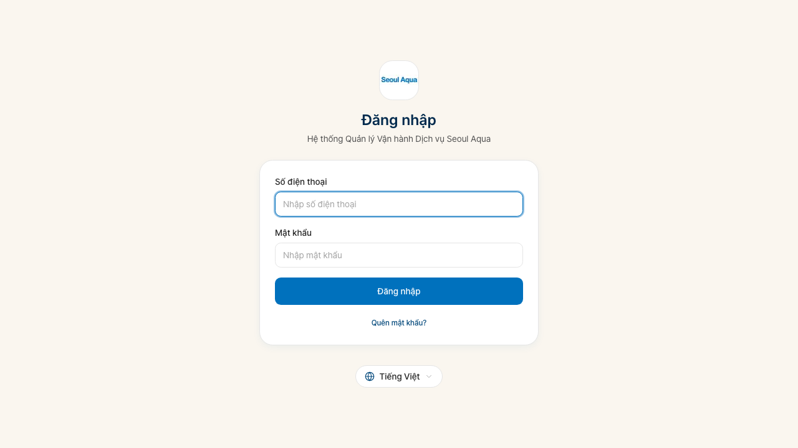
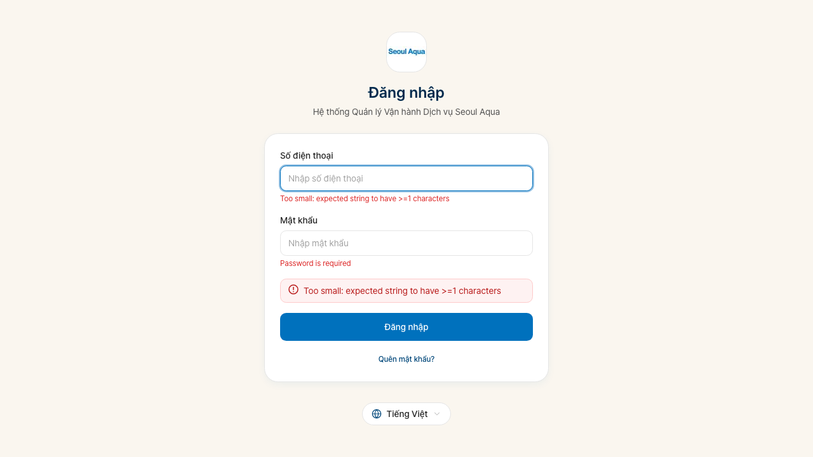
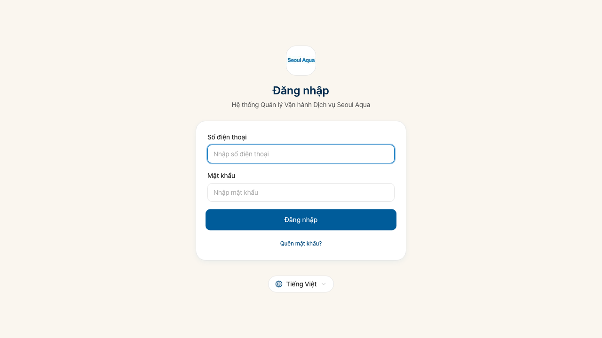

# Seoul Aqua SOMS — Hướng dẫn dành cho Nhân viên Văn phòng

**Đối tượng**: Quản trị viên (ADMIN), Quản lý (MANAGER), Nhân viên văn phòng (STAFF)
**Phiên bản**: 2026-07-22 (Sửa toàn bộ thông tin thiết bị + Hợp nhất trang chi tiết thiết bị + Liên kết chọn Thương hiệu · Nhóm sản phẩm · Mẫu + Cải tiến nút Quay lại)
**Ngôn ngữ**: Tiếng Việt
**Tài liệu liên quan**: [Hướng dẫn Kỹ thuật viên](./field.md) · [Hướng dẫn Khách hàng](./customer.md)

---

## Mục lục

- [Chương 1. Giới thiệu hệ thống](#chương-1-giới-thiệu-hệ-thống)
- [Chương 2. Phân quyền](#chương-2-phân-quyền)
- [Chương 3. Một ngày làm việc (tổng quan quy trình)](#chương-3-một-ngày-làm-việc-tổng-quan-quy-trình)
- [Chương 4. Đăng nhập và Màn hình chính](#chương-4-đăng-nhập-và-màn-hình-chính)
- [Chương 5. Quản lý Khách hàng](#chương-5-quản-lý-khách-hàng)
- [Chương 6. Quản lý Đại lý/Nhân viên Bán hàng (mới)](#chương-6-quản-lý-đại-lýnhân-viên-bán-hàng-mới)
- [Chương 7. Quản lý Thiết bị (cải tiến toàn diện)](#chương-7-quản-lý-thiết-bị-cải-tiến-toàn-diện)
- [Chương 8. Quản lý Hợp đồng](#chương-8-quản-lý-hợp-đồng)
- [Chương 9. Quản lý Lượt thăm (hỗ trợ nhiều loại & nhiều chứng từ)](#chương-9-quản-lý-lượt-thăm-hỗ-trợ-nhiều-loại--nhiều-chứng-từ)
- [Chương 10. Quản lý Đơn hàng / Giao hàng tiêu hao (mới)](#chương-10-quản-lý-đơn-hàng--giao-hàng-tiêu-hao-mới)
- [Chương 11. Xử lý Yêu cầu Dịch vụ](#chương-11-xử-lý-yêu-cầu-dịch-vụ)
- [Chương 12. Nhập và Đối soát Thanh toán](#chương-12-nhập-và-đối-soát-thanh-toán)
- [Chương 13. Hóa đơn GTGT (chỉ B2B)](#chương-13-hóa-đơn-gtgt-chỉ-b2b)
- [Chương 14. Báo cáo và Nhật ký Kiểm toán](#chương-14-báo-cáo-và-nhật-ký-kiểm-toán)
- [Chương 15. Quản lý Hệ thống (chỉ ADMIN)](#chương-15-quản-lý-hệ-thống-chỉ-admin)
- [Chương 16. Các tình huống thường gặp](#chương-16-các-tình-huống-thường-gặp)
- [Phụ lục A. Tìm Menu nhanh](#phụ-lục-a-tìm-menu-nhanh)
- [Phụ lục B. Ma trận Chứng từ](#phụ-lục-b-ma-trận-chứng-từ)
- [Phụ lục C. Danh mục Thông báo](#phụ-lục-c-danh-mục-thông-báo)
- [Phụ lục D. Từ điển Trạng thái](#phụ-lục-d-từ-điển-trạng-thái)

---

## Chương 1. Giới thiệu hệ thống

### 1.1 SOMS là gì?

**SOMS (Service Operation Management System)** là hệ thống tích hợp của Seoul Aqua. Đăng ký khách hàng, hợp đồng, lắp đặt thiết bị, bảo trì định kỳ, thu tiền, phát hành hóa đơn GTGT, quản lý công nợ và nhật ký kiểm toán — tất cả được xử lý tại một nơi.

Lợi ích so với sổ giấy và bảng tính Excel:

- **1 khách hàng = 1 màn hình**: thiết bị, hợp đồng, lịch bảo trì, công nợ — tất cả trong một tab
- **Tự động thông báo**: email D-14 trước bảo trì, SMS D-1, leo thang công nợ tự động
- **3 ngôn ngữ**: tiếng Việt · tiếng Hàn · tiếng Anh — chuyển đổi ngay lập tức
- **Phân quyền rõ ràng**: văn phòng (tối ưu PC) + kỹ thuật viên (tối ưu mobile) dùng chung hệ thống

### 1.2 Địa chỉ truy cập

| Ứng dụng | URL |
|---|---|
| **Văn phòng** | `https://soms.seoulaqua.com.vn/o/vi/login` |
| **Kỹ thuật viên** | `https://soms.seoulaqua.com.vn/f/vi/login` |
| **Cổng khách hàng** | `https://portal.seoulaqua.com.vn/vi/login` |

> Tên miền có thể thay đổi theo môi trường triển khai. Vui lòng dùng địa chỉ công ty thông báo.

### 1.3 Yêu cầu

- Máy tính có kết nối Internet (Chrome · Edge · Firefox · Safari phiên bản mới nhất)
- Số điện thoại di động cá nhân (ID đăng nhập)
- Mật khẩu tạm thời nhận qua SMS từ quản trị viên

---

## Chương 2. Phân quyền

### 2.1 Cơ cấu vai trò

```
ADMIN (Quản trị viên)  ← Toàn bộ hệ thống + quản lý người dùng + mọi quyền MANAGER
  └─ MANAGER (Quản lý) ← Thay đổi giá, hóa đơn GTGT, đặt lại MK khách hàng + mọi quyền STAFF
       └─ STAFF (Nhân viên) ← Tác vụ hàng ngày (khách hàng, hợp đồng, lượt thăm, thanh toán)

TECHNICIAN (Kỹ thuật viên) ← App mobile riêng, không có quyền văn phòng
```

### 2.2 Bảng quyền theo chức năng

| Chức năng | ADMIN | MANAGER | STAFF |
|---|:---:|:---:|:---:|
| Thêm/vô hiệu hóa người dùng | ● | — | — |
| Xuất nhật ký kiểm toán CSV | ● | — | — |
| Xem nhật ký kiểm toán | ● | ● | — |
| Thay đổi giá / Sửa hợp đồng | ● | ● | — |
| Phát hành hóa đơn GTGT | ● | ● | — |
| Đặt lại mật khẩu khách hàng | ● | ● | — |
| Gán vai trò Đại lý (isSalesRep) | ● | ● | — |
| Chốt sổ tháng | ● | ● | — |
| Phê duyệt yêu cầu dịch vụ có phí | ● | ● | ● |
| Thêm/sửa khách hàng, hợp đồng, thiết bị | ● | ● | ● |
| Tạo/thay đổi lịch lượt thăm | ● | ● | ● |
| Tạo đơn hàng (vật tư tiêu hao) | ● | ● | ● |
| Nhập thanh toán / Đối soát chuyển khoản | ● | ● | ● |
| Xem báo cáo | ● | ● | ● |
| Xem menu Đại lý | ● | ● | ● |

> **Không có phòng ban riêng biệt**: STAFF cũng thấy toàn bộ menu kinh doanh và kế toán. Các thao tác có trách nhiệm lớn (thay đổi giá, hóa đơn GTGT) chỉ dành cho MANAGER trở lên.

---

## Chương 3. Một ngày làm việc (tổng quan quy trình)

```
Đến làm → Đăng nhập → Kiểm tra bảng điều khiển
  ├─ Sáng: Phân công lượt thăm / Nhận tiền mặt từ KTV / Đăng ký khách hàng & hợp đồng mới
  ├─ Chiều: Xét duyệt yêu cầu dịch vụ / Đối soát chuyển khoản / Xử lý đơn hàng vật tư
  └─ Trước khi về: Kiểm tra việc chưa xử lý → Đăng xuất
```

### Việc hệ thống tự động làm (nhân viên không cần lo)

| Tác vụ tự động | Thời điểm |
|---|---|
| SMS mật khẩu tạm thời cho khách | Ngay sau khi tạo tài khoản |
| Email nhắc bảo trì D-14 | 03:00 giờ VN mỗi ngày |
| SMS nhắc bảo trì D-1 | 03:00 giờ VN mỗi ngày |
| Email nhắc công nợ D+7/D+14 | 03:00 giờ VN mỗi ngày |
| SMS leo thang công nợ D+30 | 03:00 giờ VN mỗi ngày |
| Email nhắc hết hạn thuê D-60/D-30 | 03:00 giờ VN mỗi ngày |
| Thông báo ADMIN khi KTV chưa nộp tiền D+1 | Ngày làm việc tiếp theo |
| Email phiếu xác nhận công việc sau lượt thăm | Ngay sau khi KTV đánh dấu hoàn thành |

---

## Chương 4. Đăng nhập và Màn hình chính

### 4.1 Đăng nhập



Trang đăng nhập nhân viên văn phòng: `/o/vi/login`

| Trường | Mô tả |
|---|---|
| **Số điện thoại** | Số di động cá nhân (ví dụ: `0901234567`) |
| **Mật khẩu** | Mật khẩu của bạn (lần đầu: mật khẩu tạm thời nhận qua SMS) |

**Bảo mật**:
- 3 lần đăng nhập sai → khóa tự động 1 giờ
- Nếu có 2 người dùng cùng tên → chỉ đăng nhập được bằng số điện thoại
- Tài khoản KTV thử đăng nhập văn phòng → hệ thống hướng dẫn dùng `/f/login`

### 4.2 Đổi mật khẩu lần đầu

Sau khi quản trị viên tạo tài khoản, bạn nhận SMS mật khẩu tạm thời. Đăng nhập lần đầu sẽ hiển thị màn hình đổi mật khẩu ngay. Tối thiểu 8 ký tự, khuyến nghị kết hợp chữ và số.

### 4.3 Bảng điều khiển



Màn hình đầu tiên sau đăng nhập. Các thẻ hiển thị công việc cần xử lý trong ngày.

| Thẻ | Nội dung |
|---|---|
| Lượt thăm hôm nay | Số lượng theo kế hoạch + tỷ lệ đang thực hiện/hoàn thành |
| Yêu cầu chờ xét duyệt | Yêu cầu có phí từ khách hàng chưa xử lý |
| Cảnh báo công nợ | Khách hàng theo giai đoạn D+7/D+14/D+30 |
| Tiền mặt chờ bàn giao | KTV đã thu nhưng chưa nộp văn phòng |
| Tóm tắt doanh thu tháng | (Chỉ MANAGER+) |

Nhấp vào thẻ để chuyển đến màn hình tương ứng.

### 4.4 Menu thanh bên


Thanh bên trái chứa toàn bộ menu. Một số mục bị ẩn tùy theo quyền.

```
Trang chủ
Khách hàng
Đại lý          ← Mới (danh sách nhân viên isSalesRep=true + KPI)
Hợp đồng
Thiết bị
  ├─ Danh sách thiết bị
  ├─ Đăng ký hàng loạt  ← Mới — wizard 5 bước
  └─ Lịch sử lắp đặt   ← Mới
Lượt thăm
  ├─ Danh sách / Lịch
  └─ In hàng loạt
Bảng phân công hôm nay
Yêu cầu dịch vụ
Thanh toán
Hóa đơn GTGT   (MANAGER+)
Báo cáo
Quản lý hệ thống  (ADMIN)
```

### 4.5 Chuyển ngôn ngữ

Nhấn nút ngôn ngữ ở góc trên bên phải để chuyển ngay giữa Tiếng Việt (VI) · Tiếng Hàn (KO) · Tiếng Anh (EN). Màn hình hiện tại không thay đổi, chỉ văn bản thay đổi.

### 4.6 Hành vi nút Quay lại (cải tiến)

Nút "**Quay lại**" cạnh breadcrumb ở đầu trang giờ đây quay về **màn hình bạn vừa xem trước đó**. Trước kia nút này luôn đưa về màn hình danh sách của menu tương ứng (ví dụ: danh sách khách hàng), nhưng giờ nó lùi lại đúng theo đường bạn đã đi qua.

Ví dụ: Danh sách khách hàng → Chi tiết khách hàng → (nhấp vào thiết bị) Chi tiết thiết bị — nhấn "Quay lại" sẽ về Chi tiết khách hàng, nhấn "Quay lại" lần nữa sẽ về Danh sách khách hàng.

> Chỉ khi không có màn hình trước đó (mở từ tab mới, hoặc truy cập trực tiếp bằng link) thì nút mới đưa về màn hình danh sách của menu tương ứng.

---

## Chương 5. Quản lý Khách hàng

### 5.1 Danh sách khách hàng

**Thanh bên → Khách hàng**


- **Ô tìm kiếm**: Nhập tên, số điện thoại hoặc mã (`KH00001` v.v.)
- **Bộ lọc bên**: Loại khách hàng (B2C/B2B) · Tỉnh/thành · Trạng thái · Đại lý phụ trách
- Nút **Khách hàng mới** (góc trên phải)
- **Xuất CSV** (tải kết quả tìm kiếm ra Excel)

Nhấp vào dòng để chuyển đến trang chi tiết khách hàng.

### 5.2 Đăng ký khách hàng mới — B2C (Hộ gia đình)

**Danh sách khách hàng → Khách hàng mới → Chọn B2C**

#### Thông tin bắt buộc

| Trường | Mô tả |
|---|---|
| **Tên** | Họ và tên khách hàng (ví dụ: `Nguyễn Văn A`) |
| **Số điện thoại** | Liên hệ chính — ID đăng nhập cổng khách hàng |

> Người ký hợp đồng (CONTRACT_PARTY) được tự động tạo từ thông tin khách hàng, không cần nhập riêng.

#### Nhập địa chỉ (dropdown theo tầng)

Theo cải cách hành chính Việt Nam năm 2025, cấp Quận/Huyện đã bị bãi bỏ, nên hiện chỉ còn **2 cấp**.

1. Chọn Tỉnh/Thành phố — trong danh sách **34 tỉnh/thành** trên cả nước
2. Chọn Phường/Xã
3. Nhập địa chỉ chi tiết

> **Tìm kiếm không phân biệt dấu**: Ô tìm kiếm dropdown vẫn tìm ra kết quả dù bạn gõ không dấu. Ví dụ: chỉ cần gõ `Ho Chi` là tìm được `Thành phố Hồ Chí Minh`.

Nếu khu vực không có trong danh sách, gõ tên và chọn tùy chọn "**Nhập thủ công**".

> Hệ thống địa chỉ 2 cấp này cũng áp dụng tương tự cho địa chỉ Địa điểm (Site) B2B (§5.3).

#### Thông tin tùy chọn

| Trường | Mục đích |
|---|---|
| CCCD / Hộ chiếu | Ghi vào hợp đồng |
| Email | Gửi biên lai, phiếu xác nhận |
| Liên hệ vận hành (OPS) | Người nhận SMS thông báo lượt thăm |
| Đại lý phụ trách | Tổng hợp doanh số |
| Khu vực / KTV ưu tiên | Gợi ý phân công tự động |

#### Kích hoạt cổng tự động

Sau khi lưu, hệ thống ngay lập tức gửi SMS mật khẩu tạm thời đến điện thoại khách hàng, cho phép đăng nhập cổng ngay.

### 5.3 Đăng ký khách hàng mới — B2B (Doanh nghiệp)

Điểm khác biệt so với B2C:

| Trường | Đặc thù B2B |
|---|---|
| **Tên** | Tên công ty (ví dụ: `CÔNG TY TNHH SHV`) |
| **Mã số thuế** | Mã số thuế Việt Nam (bắt buộc, ví dụ: `0301234567`) |
| **Mã viết tắt (shortcode)** | 2–5 ký tự tiếng Anh (ví dụ: `SHV`) — dùng trong số hợp đồng |

**Thêm địa điểm (Site)** — chỉ B2B:

Sau khi lưu, vào Chi tiết khách hàng → tab "**Địa điểm lắp đặt**" → nút "Địa điểm mới" để thêm địa điểm. Nhập tên địa điểm, địa chỉ và khu vực.

> B2C không cần địa điểm. Với hộ gia đình, địa chỉ khách hàng chính là địa chỉ lắp đặt.

### 5.4 Cấu trúc tab Chi tiết khách hàng



| Tab | Nội dung |
|---|---|
| **Tổng quan** | Tên, điện thoại, địa chỉ, ghi chú, đại lý phụ trách (có thể chỉnh sửa) |
| **Thiết bị** | Danh sách thiết bị — nhấp vào để chuyển đến trang chi tiết thiết bị chuyên dụng (§5.5) |
| **Hợp đồng** | Tất cả hợp đồng: đang hoạt động, nháp, hoàn thành, đã hủy |
| **Lịch sử bảo trì** | Toàn bộ lượt thăm của khách hàng này |
| **Thanh toán** | Lịch sử thanh toán (đã lập, hoàn thành, quá hạn, miễn) |
| **Lịch sử mua hàng** | Lịch sử mua vật tư từ lượt thăm CONSUMABLE_DELIVERY |
| **Đơn hàng (bán hàng)** | Danh sách đơn hàng Order/OrderItem |
| **Địa điểm lắp đặt** | Danh sách Site B2B (ẩn với B2C) |
| **Ghi chú** | Ghi chú nội bộ (khách hàng không thấy) |

### 5.5 Tab Thiết bị


Nhấp vào một thiết bị trong danh sách sẽ chuyển đến **trang chi tiết thiết bị chuyên dụng** (§7.3). Nhấp vào thiết bị từ thẻ thiết bị ở tab **Tổng quan** cũng luôn chuyển đến cùng một trang này — trước đây màn hình hiển thị khác nhau tùy nơi bạn nhấp vào, còn bây giờ dù vào từ đâu bạn cũng thấy cùng một màn hình.

**Bảng cấu hình dịch vụ hợp nhất** trên trang chi tiết thiết bị — chu kỳ kiểm tra và chu kỳ thay lõi lọc hiển thị trong một bảng:

| Cột | Mô tả |
|---|---|
| Loại dịch vụ | Kiểm tra định kỳ / Thay lõi lọc |
| Chu kỳ | Khoảng cách thay (tháng) |
| Lần thay gần nhất | Ngày thực tế hoàn thành |
| Lần thay dự kiến tiếp theo | Hệ thống tự tính |
| Trạng thái | Bình thường / Sắp đến hạn / Quá hạn |

### 5.6 Tab Lịch sử mua hàng (mới)


Hiển thị lịch sử mua vật tư liên kết với lượt thăm `CONSUMABLE_DELIVERY`. Xem được ngày lượt thăm, hàng hóa, số tiền và thông tin KTV.

### 5.7 Tab Đơn hàng (bán hàng) (mới)


Hiển thị đơn hàng vật tư liên kết với Order/OrderItem. Có thể đăng ký đơn hàng mới ngay từ tab này.

### 5.8 Quản lý liên hệ — CONTRACT_PARTY / OPS_CONTACT

Mỗi khách hàng có **1 người ký hợp đồng (CONTRACT_PARTY)** và **0–N liên hệ vận hành (OPS_CONTACT)**.

| Vai trò | Nhận thông báo |
|---|---|
| CONTRACT_PARTY | Hợp đồng, hóa đơn GTGT, thông báo pháp lý |
| OPS_CONTACT (chính) | SMS lượt thăm, biên lai, nhắc bảo trì |
| Toàn bộ OPS_CONTACT | CC nhắc công nợ |

Thêm OPS_CONTACT:
1. Chi tiết khách hàng → tab **Tổng quan** → phần Liên hệ → nút "**Liên hệ mới**"
2. Nhập tên, điện thoại, email, ngôn ngữ, phạm vi (CUSTOMER hoặc SITE)
3. Lưu → Hệ thống tự gửi SMS mật khẩu tạm thời cho cổng

### 5.9 Vô hiệu hóa khách hàng

Từ MANAGER trở lên:
1. Chi tiết khách hàng → nút "**Vô hiệu hóa**"
2. Nhập lý do → Xác nhận
3. Tất cả thiết bị đang hoạt động tự chuyển sang trạng thái `DEACTIVATED`

> Không thể xóa. Quy định pháp lý yêu cầu lưu trữ dữ liệu 24 tháng.

---

## Chương 6. Quản lý Đại lý/Nhân viên Bán hàng (mới)

### 6.1 Đại lý là ai?

Nhân viên được đặt `isSalesRep = true`. ADMIN hoặc MANAGER gán quyền đại lý cho nhân viên từ trang Quản lý hệ thống. Đại lý vẫn là STAFF/MANAGER bình thường nhưng đồng thời được tổng hợp doanh số phụ trách.

### 6.2 Danh sách Đại lý

**Thanh bên → Đại lý**


Bố cục dạng thẻ hiển thị KPI từng đại lý:

| KPI | Mô tả |
|---|---|
| **Số khách hàng phụ trách** | Số khách hàng đang hoạt động do đại lý này phụ trách |
| **Hợp đồng mới tháng này** | Số hợp đồng mới ký trong tháng |
| **Doanh thu kỳ** | Tổng doanh thu trong kỳ đã chọn |
| **Tổng công nợ** | Tổng công nợ của khách hàng phụ trách |

### 6.3 Chi tiết Đại lý

Nhấp vào thẻ để mở màn hình chi tiết với 3 tab.


#### Tab Khách hàng phụ trách


Danh sách khách hàng do đại lý này phụ trách. Xem tên, mã, loại, số thiết bị, trạng thái hợp đồng. Nhấp tên khách hàng để chuyển đến trang chi tiết.

#### Tab Doanh thu theo kỳ


Đặt kỳ (từ ngày – đến ngày) để xem doanh thu từng thiết bị của đại lý trong kỳ đó.

**Công thức tính doanh thu**: Doanh thu thiết bị = Tiền đặt cọc + Phí tháng × Số tháng đã qua

#### Tab Công nợ theo kỳ


Xem công nợ của khách hàng phụ trách theo kỳ. Kiểm tra số lượng, số tiền, ngày đến hạn và trạng thái.

### 6.4 Gán Đại lý cho Khách hàng

Chi tiết khách hàng → tab **Tổng quan** → dropdown "Đại lý phụ trách" → chọn nhân viên. Chỉ nhân viên được gán vai trò đại lý mới xuất hiện trong danh sách.

---

## Chương 7. Quản lý Thiết bị (cải tiến toàn diện)

### 7.1 Thay đổi chính

- Thêm trường: `deposit` (tiền đặt cọc), `monthlyFee` (phí tháng), `serviceType` (RENTAL/MAINTENANCE/SALE), `managementType` (FULL_SERVICE/SELF_MANAGED/OTHER), `lifecycleStage` (ACTIVE/INACTIVE/RETRIEVED/TRANSFERRED)
- **Hợp nhất thành 1 trang chi tiết thiết bị chuyên dụng** (mới): dù nhấp vào thiết bị từ tab Tổng quan của khách hàng · tab Thiết bị · danh sách thiết bị, đều chuyển đến cùng một màn hình (§7.3)
- **Sửa toàn bộ thông tin thiết bị** (mới, §7.4): MANAGER trở lên có thể sửa mọi trường bằng nút "Sửa" trên trang chi tiết thiết bị. Hỗ trợ chỉnh tay (override) ngày kiểm tra gần nhất và ngày thay lõi lọc gần nhất
- **Liên kết chọn Thương hiệu ↔ Nhóm sản phẩm ↔ Mẫu** (mới): chọn bất kỳ trường nào trước, các trường còn lại tự động thu hẹp theo — áp dụng đồng nhất ở wizard đăng ký và màn hình sửa (§7.5)
- Bảng cấu hình dịch vụ hợp nhất: lịch kiểm tra + lịch thay lõi lọc trong một bảng
- Wizard đăng ký hàng loạt: **5 bước** — từ chọn khách hàng đến hình thức bán + cấu hình dịch vụ (đăng ký đơn lẻ cũng chuyển sang wizard 4 bước)
- **Chu kỳ kiểm tra/thay lõi lọc thống nhất theo đơn vị "ngày"** — tính ngày dự kiến tiếp theo chính xác hơn
- Lịch sử lắp đặt: chuyển đổi giữa chế độ xem theo lô và theo lượt thăm

### 7.2 Danh sách thiết bị

**Thanh bên → Thiết bị**


Bộ lọc: Loại khách (B2C/B2B) · Loại dịch vụ (thuê/bảo trì/bán) · Trạng thái vòng đời · KTV

Nhấp vào một dòng sẽ chuyển đến **cùng một trang chi tiết thiết bị chuyên dụng** như khi vào từ tab Thiết bị của khách hàng (§7.3).

### 7.3 Chi tiết thiết bị — Bảng cấu hình dịch vụ hợp nhất


**Luôn cùng một màn hình dù vào từ đâu** (mới): dù nhấp vào thiết bị từ thẻ thiết bị ở tab **Tổng quan** của khách hàng, từ tab **Thiết bị** (§5.5), hay từ dòng trong **danh sách thiết bị** (§7.2) — tất cả đều chuyển đến **cùng một trang chi tiết thiết bị chuyên dụng**. Trước đây màn hình hiển thị khác nhau tùy nơi bạn nhấp vào, còn bây giờ vào từ đâu cũng thấy cùng một màn hình.

Nhấp vào một thiết bị để xem:

**Phần thông tin cơ bản**:
- Số serial, mẫu, thương hiệu, danh mục
- Ngày lắp đặt, tiền đặt cọc, phí tháng, loại dịch vụ
- Trạng thái vòng đời hiện tại (ACTIVE/INACTIVE v.v.)

**Thông tin chi tiết (chỉ xem)**: Mã quản lý (tài sản) · Loại dịch vụ · Loại quản lý · Tiền đặt cọc · Phí tháng · Giá bán · Phí lắp đặt · Kỹ thuật viên phụ trách · Người đăng ký — cùng hiển thị ở đây. Muốn thay đổi các giá trị này, dùng §7.4 "Sửa thông tin thiết bị".

**Bảng cấu hình dịch vụ hợp nhất**:
Chu kỳ kiểm tra và chu kỳ thay lõi lọc được hợp nhất vào một bảng — xem ngày lượt thăm trước, ngày dự kiến tiếp theo và chu kỳ thay.

Trên cùng trang này còn có các widget **Lịch sử mua hàng · Công việc gần nhất · Lịch tiếp theo**, **danh sách hợp đồng liên kết**, **lịch sử thanh toán**, **lịch sử thay lõi lọc**, và **lịch sử lượt thăm liên kết**.

### 7.4 Sửa thông tin thiết bị (mới)

Người dùng có quyền **MANAGER trở lên** có thể sửa gần như mọi trường của thiết bị bằng nút "**Sửa**" ở góc trên bên phải trang chi tiết thiết bị. Có thể dùng **bất kể** trạng thái hiện tại của thiết bị (hoạt động/ngừng/chấm dứt) — vì màn hình này dùng để sửa lỗi nhập liệu.

#### Các trường có thể sửa

| Nhóm | Trường |
|---|---|
| Mẫu thiết bị | Đổi mẫu bằng lựa chọn liên kết Thương hiệu·Nhóm sản phẩm (xem §7.5 "Liên kết chọn Thương hiệu ↔ Nhóm sản phẩm ↔ Mẫu") |
| Thông tin lắp đặt | Địa điểm lắp đặt (cơ sở) · Ngày lắp đặt · Số sê-ri · Mã quản lý (tài sản) |
| Cấu hình dịch vụ | Loại dịch vụ (thuê/bán/bảo trì) · Loại quản lý |
| Số tiền | Tiền đặt cọc · Phí hàng tháng · Giá bán · Phí lắp đặt |
| Chu kỳ | Chu kỳ kiểm tra định kỳ (ngày) · Chu kỳ lõi lọc mặc định (ngày) |
| Chỉnh tay lịch sử | Ngày kiểm tra gần nhất (thủ công) |
| Khác | Ghi chú · Mô tả thiết bị (dành cho thiết bị ngoài danh mục) |

#### Chỉnh tay (override) Ngày kiểm tra gần nhất / Ngày thay lõi lọc gần nhất

Hai giá trị này vốn được **tự động tính từ lịch sử lượt thăm**, nhưng nếu quản trị viên tự nhập giá trị, giá trị đó sẽ được **ưu tiên áp dụng** và **ngày kiểm tra/thay lõi tiếp theo sẽ tự động tính lại**.

- **Ngày kiểm tra gần nhất**: nhập ngày vào trường "Ngày kiểm tra gần nhất (thủ công)" trong modal "Sửa". Để trống sẽ quay lại tính tự động theo lịch sử lượt thăm.
- **Ngày thay lõi lọc gần nhất theo từng lõi**: ở bảng "Lịch sử thay lõi lọc" phía dưới trang chi tiết thiết bị, nhấn "**Sửa chu kỳ**" trên dòng lõi lọc cần chỉnh rồi nhập ngày vào trường "Ngày thay gần nhất (thủ công)" trong modal mở ra.

> Giá trị chỉnh tay này cũng được áp dụng cho **gợi ý vật tư tiêu hao trên app kỹ thuật viên** và **tin nhắc thay lõi lọc gửi cho khách hàng**. Dùng khi cần sửa giá trị nhập sai, hoặc nhập bổ sung lịch sử từ trước khi có hệ thống.

Khi để trống một trường trong màn hình sửa, giá trị chỉnh tay đó bị xóa; đặt chu kỳ về **0** sẽ quay lại giá trị mặc định của danh mục.

> **Lưu ý**: Các chuyển đổi trạng thái quan trọng (vô hiệu hóa · kết thúc · thu hồi) không thực hiện ở màn hình sửa này mà dùng các nút riêng ở phía trên. Việc tách riêng này nhằm bảo vệ tính nhất quán của sổ cái tạm ngừng hợp đồng.

### 7.5 Wizard đăng ký thiết bị hàng loạt (cải tiến — 5 bước)

**Thanh bên → Thiết bị → Đăng ký hàng loạt**


Wizard **5 bước** để đăng ký và lắp đặt nhiều thiết bị cùng lúc với cùng thông tin.

#### Bước 1: Chọn khách hàng

- Tìm kiếm theo mã khách hàng, tên, người liên hệ hoặc số điện thoại, rồi chọn ngay từ kết quả.
- Nếu không tìm thấy khách hàng cần tìm, có thể **đăng ký khách hàng mới ngay tại chỗ**.
- Khách hàng B2B: chọn thêm **Địa điểm (Site)** cần lắp đặt.

#### Bước 2: Thông tin thiết bị

- **Liên kết chọn Thương hiệu ↔ Nhóm sản phẩm ↔ Mẫu** (mới): chọn bất kỳ trường nào trước, các trường còn lại sẽ tự động thu hẹp theo.
  - **Chọn Mẫu trước** → Thương hiệu · Nhóm sản phẩm tự động điền theo.
  - **Chọn Thương hiệu** → chỉ hiện các Nhóm sản phẩm mà thương hiệu đó có.
  - **Chọn Nhóm sản phẩm** → chỉ hiện các Mẫu thuộc đúng Thương hiệu + Nhóm sản phẩm đó.
  - Giúp giảm sai sót nhập liệu và chọn nhanh hơn. Cách liên kết này cũng áp dụng đồng nhất ở màn hình §7.4 "Sửa thông tin thiết bị" và wizard đăng ký đơn lẻ ở §7.6.
- Nhập số lượng, ngày lắp đặt, kỹ thuật viên phụ trách, ghi chú lắp đặt.
- **Mã quản lý** có thể để hệ thống tự sinh (`WA` + ngày + số thứ tự) hoặc nhập thủ công.

#### Bước 3: Hình thức bán

Chọn Thuê / Bán / Bảo trì — hệ thống chỉ hiển thị các trường hợp đồng phù hợp với hình thức đó.

- **Thuê**: Tiền đặt cọc · phí thuê tháng · thời hạn hợp đồng → tạo 1 hợp đồng
- **Bán (sở hữu)**: Giá bán · phí lắp đặt (phí lắp đặt cũng tính vào doanh thu). Nếu bật "Tạo hợp đồng cùng lúc" → tạo 1 hợp đồng bán; nếu hình thức quản lý là **Bảo trì trọn gói** → tạo thêm 1 hợp đồng bảo trì (tổng cộng tối đa 2 hợp đồng: bán + bảo trì trọn gói). Nếu là **Khách hàng tự quản lý**, phần cấu hình kiểm tra định kỳ/lõi lọc sẽ bị vô hiệu hóa.
- **Bảo trì**: Phí quản lý tháng · thời hạn hợp đồng → tạo 1 hợp đồng
- **Số hợp đồng**: Để trống sẽ tự động cấp số theo quy tắc; nhập thủ công thì dùng đúng số đó (trùng số sẽ bị từ chối khi lưu). Có thể chỉ định **ngày ký hợp đồng**.

> Khi nhập số tiền, hệ thống tự động hiển thị dấu chấm (.) phân cách hàng nghìn, ví dụ `1.500.000`.

#### Bước 4: Cấu hình dịch vụ

Thiết lập chu kỳ kiểm tra định kỳ và danh sách **lõi lọc/vật tư tiêu hao** cần thay. Vật tư mặc định của mẫu được điền tự động; khi chỉnh **chu kỳ thay (theo ngày)** của từng mục, ngày dự kiến tiếp theo sẽ tự tính lại.

#### Bước 5: Xác nhận cuối cùng (mới)

Hiển thị **tóm tắt toàn bộ thông tin** đã nhập ở các bước trước trên một màn hình — khách hàng và địa điểm lắp đặt, thiết bị/số lượng/mã quản lý, hình thức bán/số tiền/**số hợp đồng sẽ được tạo**, và cấu hình dịch vụ. Kiểm tra xong, nhấn "**Hoàn tất**" để đăng ký. Nếu có sai sót, có thể quay lại bước trước để sửa ngay.

> Sau khi đăng ký, dữ liệu được ghi vào Lịch sử lắp đặt và phản ánh trong tab [Thiết bị] của hợp đồng tương ứng.

### 7.6 Wizard đăng ký thiết bị đơn lẻ (mới)

**Thanh bên → Danh sách thiết bị → nút "+ Lắp đặt"**

Dùng khi cần đăng ký nhiều thiết bị khác nhau, mỗi thiết bị một dòng (multi-line). Cấu trúc theo cùng **4 bước** như đăng ký hàng loạt (§7.5: Chọn khách hàng → Thông tin thiết bị → Hình thức bán → Cấu hình dịch vụ), nhưng điểm khác biệt là **mỗi dòng có thể chỉ định riêng mẫu, hình thức bán và cấu hình dịch vụ**. Bước Thông tin thiết bị áp dụng cùng cách **Liên kết chọn Thương hiệu ↔ Nhóm sản phẩm ↔ Mẫu** ở §7.5 cho từng dòng. Thông tin hợp đồng (số hợp đồng, ngày ký v.v.) chỉ nhập một lần ở cấp hợp đồng, không nhập theo từng dòng.

### 7.7 Lịch sử lắp đặt (mới)

**Thanh bên → Thiết bị → Lịch sử lắp đặt**


Theo dõi cách thức và thời điểm đăng ký từng thiết bị.

**Chuyển đổi chế độ xem**:
- **Xem theo lô**: Theo đợt đăng ký hàng loạt — xem ai đã đăng ký bao nhiêu thiết bị vào lúc nào
- **Xem theo lượt thăm**: Theo lượt thăm INSTALLATION — xem thiết bị nào được lắp trong từng lượt thăm

---

## Chương 8. Quản lý Hợp đồng

### 8.1 Loại hợp đồng

| Loại | Mô tả |
|---|---|
| **SALE** | Mua một lần, thanh toán đầy đủ, khách hàng sở hữu ngay |
| **RENTAL** | Thuê 36 tháng, thu phí hàng tháng. Hết hạn: chuyển quyền sở hữu (mặc định) hoặc thu hồi thiết bị |
| **MAINTENANCE** | Chỉ bảo trì — thiết bị đã thuộc sở hữu khách hàng. Có thể đăng ký thiết bị ngoài danh mục |

### 8.2 Danh sách hợp đồng

**Thanh bên → Hợp đồng**


Tab: Đang hoạt động / Nháp / Hết hạn / Tất cả
Bộ lọc: Loại khách · Loại hợp đồng · Trạng thái · Đại lý

### 8.3 Tab Chi tiết hợp đồng


| Tab | Nội dung |
|---|---|
| **Tổng quan** | Số HĐ, loại, trạng thái, khách hàng, thời hạn |
| **Thiết bị** | Danh sách thiết bị trong HĐ này + ngày hủy hiệu lực |
| **Phụ lục** | Lịch sử sửa đổi HĐ B2B (Appendix) |
| **Thanh toán** | Tiền đặt cọc, phí thuê, phí dịch vụ, hoàn tiền |
| **Hoạt động** | Lịch sử thay đổi trạng thái, ký kết, ghi chú |

### 8.4 Tải hợp đồng PDF lên thủ công (mới)

Trên màn hình chi tiết hợp đồng, người dùng có quyền **MANAGER trở lên** có thể **tải lên bản scan hợp đồng đã ký tên, đóng dấu thật** để thay thế bản PDF do hệ thống tự động tạo.

- Chi tiết hợp đồng → nút "**Tải lên hợp đồng PDF**" → chọn file PDF → Lưu
- File PDF tải lên sẽ ghi đè lên bản tự động tạo
- Hữu ích khi hợp đồng đã được ký trên giấy trước, cần cập nhật lại vào hệ thống

### 8.5 Tạo hợp đồng mới

1. Danh sách hợp đồng → nút "**Hợp đồng mới**"
2. Chọn khách hàng → Chọn loại hợp đồng
3. Thêm thiết bị (chọn từ danh mục)
4. Lưu → Số HĐ tự động cấp:
   - B2C: `HD-20260702/SA-KH00001`
   - B2B: `HD-20260702/SA-SHV`
5. Tạo PDF → Khách ký → Nhấn "**Kích hoạt**"
6. Sau khi kích hoạt, lượt thăm lắp đặt được tạo tự động

### 8.6 Sửa đổi hợp đồng (Amend)

Chỉ từ MANAGER trở lên.

- **Sửa HĐ B2C**: Chỉnh sửa trực tiếp giá và thiết bị. Thay đổi trước/sau được ghi tự động vào nhật ký kiểm toán.
- **Thêm Phụ lục HĐ B2B**: Chi tiết HĐ → nút "**Thêm phụ lục**" → Nhập thiết bị hoặc điều khoản mới → Số phụ lục tự động cấp (ví dụ: `HD-.../SA-SHV-A1`)

### 8.7 Gia hạn hợp đồng (Renew)

Chuyển hợp đồng thuê hết hạn sang bảo trì:
1. HĐ hết hạn → nút "**Gia hạn: Bảo trì**"
2. Nhập phí quản lý tháng mới + ngày bắt đầu
3. Xác nhận → HĐ thuê cũ chuyển sang `COMPLETED` + chuyển quyền sở hữu thiết bị + tự động tạo HĐ bảo trì mới

### 8.8 Luồng trạng thái hợp đồng

```
DRAFT → ACTIVE → OVERDUE → ACTIVE (khi thanh toán xong)
                           TERMINATED_EARLY (hủy sớm)
              ACTIVE → COMPLETED (thanh toán đầy đủ)
              COMPLETED → (thuê: chuyển quyền sở hữu thiết bị)
```

---

## Chương 9. Quản lý Lượt thăm (hỗ trợ nhiều loại & nhiều chứng từ)

### 9.1 Loại lượt thăm (toàn bộ danh sách)

| Mã | Tiếng Việt | Phát sinh khi |
|---|---|---|
| INSTALLATION | Lắp đặt | Tự động tạo khi HĐ được kích hoạt |
| PERIODIC_INSPECTION | Kiểm tra định kỳ | Cron tự động (hàng tháng hoặc 2 tháng/lần) |
| REPAIR | Sửa chữa | Từ yêu cầu (FAULT_REPORT) hoặc thủ công |
| FILTER_REPLACEMENT | Thay lõi lọc | Cron hoặc thủ công |
| RELOCATION | Di chuyển lắp đặt | Từ yêu cầu dịch vụ hoặc thủ công |
| PAYMENT_COLLECTION | Thu tiền | Thủ công |
| RETRIEVAL | Thu hồi thiết bị | Tự động khi hết HĐ thuê hoặc hủy sớm |
| **CONSUMABLE_DELIVERY** | **Giao hàng tiêu hao** | **Liên kết Đơn hàng (Order) — mới** |
| OTHER | Khác | Thủ công |

> **Lượt thăm nhiều loại**: Một lượt thăm có thể có loại chính và thêm nhiều loại bổ sung (`additionalTypes`). Ví dụ: Kiểm tra định kỳ + Giao hàng tiêu hao cùng một lượt.

### 9.2 Danh sách lượt thăm

**Thanh bên → Lượt thăm**


Chuyển đổi giữa **Chế độ lịch** / **Chế độ danh sách**.

Bộ lọc: Trạng thái · KTV · Khách hàng · Khoảng ngày · Loại lượt thăm · Loại khách

**Huy hiệu chưa phân công**: Số lượt thăm chưa phân công hiển thị bên cạnh menu Lượt thăm trên thanh bên.

### 9.3 Chi tiết lượt thăm — cấu trúc mới


Màn hình chi tiết lượt thăm có thêm các thẻ mới:

#### Thẻ Yêu cầu dịch vụ liên kết (mới)

Nếu lượt thăm được tạo để xử lý một yêu cầu dịch vụ (SR) cụ thể, thông tin SR liên kết (mã, loại, trạng thái) sẽ hiển thị ở đây cùng với liên kết trực tiếp đến SR đó.

#### Thẻ Mua hàng liên kết (mới)

Với lượt thăm `CONSUMABLE_DELIVERY`, thông tin Đơn hàng liên kết (hàng hóa, số lượng, số tiền) hiển thị tại đây. Có thể liên kết đơn hàng hoặc đăng ký đơn hàng mới ngay từ thẻ này.

#### Thẻ Chứng từ (phát hành nhiều chứng từ)

Tùy theo loại lượt thăm và loại bổ sung, **nhiều chứng từ được đề xuất tự động**. Ví dụ:
- `PERIODIC_INSPECTION` + `CONSUMABLE_DELIVERY` (khách B2B) → Phiếu kiểm tra B2B + Phiếu xuất kho (Mẫu 02-VT) cùng lúc

Mỗi chứng từ có nút **Phát hành** riêng. Chứng từ đã phát hành hiển thị nút **Phát hành lại**.

#### Sửa & xem trước trước khi in (mới, yêu cầu #4)

Bên cạnh nút **Phát hành**, mỗi chứng từ có nút **"Sửa & xem trước"**. Nhấn vào sẽ mở bảng chỉnh sửa:

- Mở ô **Ghi chú tài liệu** (điền sẵn nội dung ghi nhận của lượt thăm `findings`). Bạn có thể sửa nội dung sẽ in trên chứng từ này.
- Nhấn **"Làm mới xem trước"** để hiển thị **bản PDF thực tế ngay bên dưới** với nội dung đã sửa — kiểm tra hình thức cuối cùng trước khi in.
- Sau khi kiểm tra, nhấn **"Phát hành với nội dung đã sửa"** để phát hành PDF theo bản đã chỉnh.

> Nội dung sửa chỉ áp dụng cho **PDF được phát hành** (không thay đổi ghi nhận gốc của lượt thăm). Để trống ô ghi chú thì phát hành không có ghi chú. Trong lúc bảng chỉnh sửa đang mở, nút **Phát hành** thường của chứng từ đó bị vô hiệu hóa để tránh phát hành nhầm nội dung chưa sửa.

### 9.4 Bảng đề xuất chứng từ tự động

| Loại lượt thăm | Loại khách | Loại HĐ | Chứng từ đề xuất |
|---|---|---|---|
| Lắp đặt | B2C | Thuê | Phiếu giao nhận thiết bị (DELIVERY_RECEIPT) |
| Lắp đặt | B2C | Bán | Biên lai bán hàng B2C (SALE_RECEIPT_B2C) |
| Lắp đặt | B2B | Tất cả | Phiếu xuất kho Mẫu 02-VT (DELIVERY_SLIP_B2B) |
| Kiểm tra định kỳ | B2C | — | Phiếu kiểm tra định kỳ hộ gia đình (PERIODIC_CHECK_B2C) |
| Kiểm tra định kỳ | B2B | — | Phiếu kiểm tra định kỳ B2B (PERIODIC_CHECK_B2B) |
| Giao hàng tiêu hao | B2C | — | Biên lai bán hàng B2C (SALE_RECEIPT_B2C) |
| Giao hàng tiêu hao | B2B | — | Phiếu xuất kho (DELIVERY_SLIP_B2B) |
| Sửa chữa/lọc/di chuyển/thu tiền/khác | Tất cả | — | Phiếu xác nhận công việc (WORK_CONFIRMATION) |

> **Nguồn dòng chứng từ giao hàng tiêu hao**: Ưu tiên dùng Order.items liên kết; nếu không có thì dùng dòng hợp đồng làm dự phòng.

**Điều kiện phát hành**: Lượt thăm phải có KTV phụ trách (leadTechnicianId) và chưa bị hủy/thất bại.

### 9.5 Tạo lượt thăm mới

**Danh sách lượt thăm → Lượt thăm mới**


1. Tìm kiếm khách hàng + Chọn ngày + Chọn loại lượt thăm chính
2. **Loại bổ sung**: Tích chọn để tạo lượt thăm kết hợp (ví dụ: Kiểm tra định kỳ + Giao hàng tiêu hao)
3. Kiểm tra KTV được hệ thống gợi ý (thứ tự ưu tiên: KTV ưa thích → khớp khu vực → cân bằng tải)
4. Thêm KTV phụ trách/hỗ trợ nếu cần
5. Chọn thiết bị
6. Lưu → SMS tự động gửi đến cả khách hàng và KTV

### 9.6 Đổi lịch và Hủy

- **Đổi lịch**: Chi tiết lượt thăm → nút "Đổi lịch" → Chọn ngày mới + Lý do → Lượt thăm cũ thành `RESCHEDULED`, tự động tạo lượt thăm mới
- **Hủy**: Chi tiết lượt thăm → nút "Hủy" → Nhập lý do → `CANCELLED`
  - Không thể hủy lượt thăm đang ở trạng thái `IN_PROGRESS` — xử lý bằng ghi chú sau khi hoàn thành

### 9.7 Bảng phân công hôm nay

**Thanh bên → Bảng phân công hôm nay**


Bảng xử lý lượt thăm chưa phân công trong ngày.

- **Hàng chờ bên trái**: Danh sách thẻ lượt thăm `SUGGESTED` (hiển thị KTV được hệ thống gợi ý)
- **Cột KTV bên phải**: Mỗi KTV một cột, sắp xếp theo thời gian

Cách dùng:
1. Kiểm tra KTV được gợi ý trên thẻ chưa phân công
2. Nhấn "**Xác nhận**" → Phân công xong, thẻ chuyển sang cột bên phải
3. Nếu không hài lòng với gợi ý, chọn KTV khác từ danh sách ứng viên rồi xác nhận
4. Nút **In** ở đầu cột KTV → In tất cả chứng từ trong ngày của KTV đó thành một file PDF

> Sau khi xác nhận, SMS tự động gửi cho cả khách hàng và KTV.

### 9.8 In hàng loạt

**Thanh bên → Lượt thăm → In hàng loạt** (hoặc nút In theo KTV trên bảng phân công)


Chọn ngày và KTV để xem trước tất cả chứng từ KTV đó mang đi trong ngày dưới dạng **một file PDF duy nhất**.

- Nếu có lượt thăm **Lắp đặt**, hợp đồng PDF sẽ tự đính kèm 2 bản (bản khách hàng + bản công ty)
- Chứng từ chưa phát hành được tự động phát hành trước khi in
- Lượt thăm `SUGGESTED` (chưa phân công) tự động bị loại trừ

**Cách in**: Nhấn "Mở PDF trong tab mới" → Trong tab mới: Ctrl+P (hoặc Cmd+P)

---

## Chương 10. Quản lý Đơn hàng / Giao hàng tiêu hao (mới)

### 10.1 Đơn hàng là gì?

Đơn hàng (Order) ghi lại giao dịch bán vật tư tiêu hao (bộ lõi lọc, phụ kiện, sản phẩm khác) cho khách hàng. Mỗi `Order` chứa nhiều `OrderItem`.

Đơn hàng có thể liên kết với lượt thăm `CONSUMABLE_DELIVERY` hoặc tồn tại độc lập.

### 10.2 Tạo đơn hàng

Có 2 cách tạo đơn hàng:

**Cách 1 — Từ Chi tiết khách hàng**:
1. Chi tiết khách hàng → tab "**Đơn hàng (bán hàng)**"
2. Nút "**Đơn hàng mới**"
3. Chọn thiết bị liên kết + Chọn vật tư (OrderItem)
4. Nhập số lượng, đơn giá → Lưu

**Cách 2 — Từ Chi tiết lượt thăm**:
1. Chi tiết lượt thăm → thẻ "**Mua hàng liên kết**"
2. Nhấn "**Liên kết đơn hàng**" hoặc "**Đăng ký đơn hàng mới**"
3. Nhập thông tin như trên rồi lưu

### 10.3 Liên kết với lượt thăm Giao hàng tiêu hao

Sau khi tạo đơn hàng, tạo lượt thăm `CONSUMABLE_DELIVERY` hoặc liên kết vào lượt thăm có sẵn:
- Thẻ chứng từ trong chi tiết lượt thăm tự động đề xuất **chứng từ dựa trên Order.items**
  - B2C: Biên lai bán hàng (SALE_RECEIPT_B2C) — hàng hóa từ đơn hàng được điền tự động
  - B2B: Phiếu xuất kho (DELIVERY_SLIP_B2B) — điền tự động theo biểu mẫu chuẩn chính phủ

---

## Chương 11. Xử lý Yêu cầu Dịch vụ

### 11.1 Loại yêu cầu dịch vụ

| Loại | Chi phí | Xử lý |
|---|---|---|
| INSPECTION (Kiểm tra) | Miễn phí | Tự động duyệt → Tạo lượt thăm ngay |
| CONSULTATION (Tư vấn) | Miễn phí | Tự động duyệt |
| FAULT_REPORT (Sự cố) | Bảo hành/thuê miễn phí, còn lại có phí | Văn phòng xét duyệt |
| FILTER_REPLACEMENT_AD_HOC | RENTAL miễn phí, SALE có phí | Văn phòng xét duyệt |
| PART_REPLACEMENT (Thay phụ kiện) | Có phí | Xét duyệt + Báo giá |
| RELOCATION (Di chuyển) | Có phí | Xét duyệt + Báo giá |
| OTHER | Nhân viên quyết định | Xét duyệt |

### 11.2 Danh sách yêu cầu dịch vụ

**Thanh bên → Yêu cầu dịch vụ**


Tab: Chờ xét duyệt / Đã duyệt / Đang xử lý / Hoàn thành / Từ chối / Tất cả

### 11.3 Xử lý yêu cầu có phí


1. Tab Chờ xét duyệt → Nhấp vào yêu cầu
2. Kiểm tra thông tin khách hàng, nội dung yêu cầu, ảnh đính kèm
3. Nhập số tiền báo giá
4. **Duyệt** → Tự động gửi SMS (số tiền + lịch) + Email (PDF báo giá) cho khách hàng
   - Hoặc **Từ chối** → Nhập lý do → Tự động gửi SMS + Email cho khách hàng

### 11.4 Chuỗi liên kết SR → Đơn hàng → Lượt thăm

Khi SR có phí được duyệt và khách hàng thanh toán:
1. Văn phòng tạo Đơn hàng liên kết với SR
2. Tạo lượt thăm `CONSUMABLE_DELIVERY` hoặc `REPAIR` và liên kết SR
3. Thẻ "Yêu cầu dịch vụ liên kết" trong chi tiết lượt thăm hiển thị SR
4. Sau khi lượt thăm hoàn thành, tự động tạo PDF phiếu xác nhận công việc

---

## Chương 12. Nhập và Đối soát Thanh toán

### 12.1 Phương thức thanh toán

| Mã | Mô tả |
|---|---|
| CASH_AT_VISIT | KTV thu tiền mặt tại hiện trường → Nộp văn phòng ngày hôm sau |
| BANK_TRANSFER | Khách hàng chuyển khoản trực tiếp → Văn phòng đối soát |
| B2B_EINVOICE | Phát hành hóa đơn GTGT rồi đối soát chuyển khoản |
| B2B_NO_INVOICE | Chuyển khoản mà không có hóa đơn GTGT |

### 12.2 Danh sách thanh toán

**Thanh bên → Thanh toán**


Tab: Chờ bàn giao / Chờ đối soát / Hoàn thành / Quá hạn / Tất cả

### 12.3 Đối soát chuyển khoản

1. Tab Chờ đối soát → Tìm dòng của khách hàng → nút "**Đối soát**"
2. Nhập số tiền, mã tham chiếu chuyển khoản, ngày nhận, ghi chú
3. Lưu → Trạng thái `PENDING → RECEIVED → RECONCILED` → Tự động gửi email biên lai cho khách hàng

### 12.4 Nhận tiền mặt bàn giao

1. Tab Chờ bàn giao → Xem theo nhóm KTV
2. Kiểm tra phong bì tiền mặt từ KTV
3. Nếu số tiền khớp: Nhấn "**Nhận tất cả**" → Xử lý hàng loạt
4. Nếu không khớp: Kiểm tra từng dòng + Ghi chú chênh lệch

### 12.5 Leo thang công nợ tự động

| Giai đoạn | Thời điểm | Xử lý tự động |
|---|---|---|
| D+7 | Quá hạn 7 ngày | Email → Người ký HĐ + CC OPS |
| D+14 | Quá hạn 14 ngày | Gửi lại email |
| D+30 | Quá hạn 30 ngày | SMS → Người ký HĐ + toàn bộ OPS. HĐ chuyển sang `OVERDUE` |

---

## Chương 13. Hóa đơn GTGT (chỉ B2B)

Phiên bản v1 sử dụng hệ thống hóa đơn điện tử bên ngoài (Viettel SInvoice / MISA v.v.) để phát hành, sau đó tải PDF lên SOMS.

**Các bước tải lên**:
1. Phát hành hóa đơn trong hệ thống bên ngoài → Tải PDF về máy
2. Thanh bên → "Hóa đơn GTGT" → nút "**Hóa đơn mới**"
3. Nhập khách hàng, hợp đồng, số hóa đơn, ngày phát hành, số tiền và file PDF
4. Lưu → Tự động gửi email (đính kèm PDF) cho người ký hợp đồng của khách hàng

> Chỉ từ MANAGER trở lên mới có thể phát hành và sửa. PDF được lưu trữ 10 năm.

---

## Chương 14. Báo cáo và Nhật ký Kiểm toán

### 14.1 Các loại báo cáo

| Menu | Nội dung |
|---|---|
| Doanh thu | Theo tháng/kỳ (phân theo loại hợp đồng) |
| Công nợ | Danh sách khách hàng theo giai đoạn D+7/D+14/D+30 |
| Năng suất KTV | Số lượt thăm, thời gian trung bình, tiền thu theo KTV |
| Lõi lọc sắp hết hạn | Lịch thay lọc trong 30 ngày tới |
| Hợp đồng sắp hết hạn | Hợp đồng RENTAL hết hạn trong 60 ngày tới |
| Nhật ký kiểm toán | Chỉ MANAGER+ — Toàn bộ lịch sử thay đổi hệ thống |

### 14.2 Nhật ký kiểm toán

MANAGER trở lên: Thanh bên → Báo cáo → Nhật ký kiểm toán

- Ghi lại mọi thao tác hệ thống (thêm người dùng, kích hoạt HĐ, miễn phí thanh toán v.v.)
- Nhấp vào dòng → Xem JSON trước/sau thay đổi
- Xuất CSV (chỉ ADMIN)
- Thời gian lưu trữ: 24 tháng

---

## Chương 15. Quản lý Hệ thống (chỉ ADMIN)

**Thanh bên → Quản lý hệ thống**


### 15.1 Quản lý người dùng

#### Đăng ký người dùng mới

1. Nút "**Người dùng mới**"
2. Nhập tên, số điện thoại, email, vai trò (ADMIN/MANAGER/STAFF/TECHNICIAN)
3. Lưu → Tự động gửi SMS mật khẩu tạm thời

#### Bật/tắt vai trò Đại lý (mới)

Trong chi tiết người dùng, bật công tắc "**Gán làm Đại lý**" để nhân viên đó xuất hiện trong menu Đại lý. MANAGER trở lên cũng có thể gán.

#### Đặt lại mật khẩu

Nhấp vào người dùng → nút "**Đặt lại mật khẩu**" → Tự động gửi SMS mật khẩu tạm thời → Toàn bộ phiên đăng nhập hiện tại bị kết thúc

### 15.2 Danh mục sản phẩm

Đăng ký sản phẩm theo cấu trúc Brand → Model. Đăng ký chu kỳ thay lõi lọc tương thích cho từng model — cron kiểm tra định kỳ sẽ dựa vào đây để tự tính ngày thay tiếp theo.

#### Cấu hình lõi lọc ngay trên màn hình Model (cải tiến)

Trước đây, sau khi tạo model mới phải **vào màn hình quản lý lõi lọc (vật tư) rồi thêm model đó vào từng lõi một**. Nay làm ngược lại: **chọn trực tiếp các lõi lọc thuộc model ngay trên màn hình tạo/sửa Model**.

- Ở bảng **"Cấu hình lõi lọc"** cuối form Model, nhấn **"+ Thêm lõi lọc"** → chọn lõi bằng ô tìm kiếm.
- Khi chọn một lõi, **chu kỳ thay mặc định (ngày)** của lõi đó hiện lên dạng gợi ý. Muốn dùng chu kỳ khác chỉ cho riêng model này, nhập vào ô **Chu kỳ thay (ngày)** (ghi đè theo model); để trống thì dùng chu kỳ mặc định của lõi.
- Chỉ định cả **số lượng** và **thứ tự dòng** (trên → dưới). Mỗi lõi chỉ thêm được một lần (lõi đã chọn sẽ bị loại khỏi danh sách).
- Khi sửa model đã có, cấu hình lõi hiện tại được **điền sẵn tự động**. Nút Lưu tạm khóa trong lúc tải cấu hình, tránh việc lưu sớm làm mất cấu hình đang có.

Thứ tự ưu tiên chu kỳ: **theo thiết bị > ghi đè theo model > mặc định của lõi**.

#### Master lõi lọc (vật tư) — chỉ quản lý thông tin của chính nó

Màn hình quản lý lõi lọc nay chỉ chứa **thông tin của bản thân lõi**: SKU · tên (KO/VI/EN) · chu kỳ thay · giá bán · ghi chú. Việc lõi thuộc model nào được quản lý ở màn hình Model bên trên.

- **Đơn vị chu kỳ thay (ngày/tháng)**: chọn **Ngày** hoặc **Tháng** ở ô kế bên ô nhập chu kỳ. Hệ thống luôn lưu theo ngày (1 tháng = 30 ngày); khi đổi đơn vị, giá trị được tự quy đổi để giữ nguyên độ dài thực tế (ví dụ 180 ngày ⇄ 6 tháng).

### 15.3 Trọng số Bộ lập lịch

Điều chỉnh trọng số thuật toán phân công lượt thăm tự động.

Giá trị mặc định:
- Khớp KTV ưa thích: 100 điểm
- Khớp khu vực: 50 điểm
- Cân bằng tải: 20 điểm

---

## Chương 16. Các tình huống thường gặp

### Tình huống 1: Khách hàng "Ngày mai không đón được"

1. Menu Lượt thăm → Tìm lượt thăm liên quan
2. "**Đổi lịch**" → Chọn ngày mới + Lý do "Theo yêu cầu khách hàng"
3. Lưu → Tự động SMS cho khách hàng và KTV

### Tình huống 2: Lượt thăm vừa kiểm tra vừa giao hàng tiêu hao

1. Tạo lượt thăm mới → Loại chính: `Kiểm tra định kỳ` → Loại bổ sung: Tích chọn `Giao hàng tiêu hao`
2. Liên kết đơn hàng trong thẻ Mua hàng liên kết
3. Thẻ chứng từ → Phát hành đồng thời Phiếu kiểm tra + Phiếu xuất kho (hoặc Biên lai bán hàng)
4. In hàng loạt

### Tình huống 3: Khách B2B cần hóa đơn GTGT

1. Phát hành trong hệ thống e-Invoice bên ngoài → Tải PDF về
2. SOMS → Hóa đơn GTGT → "**Hóa đơn mới**" → Tải PDF lên → Lưu

### Tình huống 4: Nhân viên mới (Đại lý) gia nhập

1. Quản lý hệ thống → Người dùng → "Người dùng mới" → Đăng ký
2. Vai trò: STAFF (hoặc MANAGER)
3. Bật công tắc "**Gán làm Đại lý**"

### Tình huống 5: Đăng ký nhiều thiết bị cùng lúc

1. Thanh bên → Thiết bị → "**Đăng ký hàng loạt**"
2. Bước 1: Chọn khách hàng (chưa có thì đăng ký mới ngay)
3. Bước 2: Nhập mẫu, số lượng, ngày lắp đặt, mã quản lý
4. Bước 3: Chọn hình thức bán (thuê/bán/bảo trì) → nhập số tiền hợp đồng
5. Bước 4: Nhập cấu hình dịch vụ (kiểm tra định kỳ, lõi lọc...)
6. Bước 5: Xem màn hình xác nhận cuối cùng (kể cả số hợp đồng sẽ tạo) rồi nhấn "**Hoàn tất**"

### Tình huống 6: In tất cả chứng từ của một KTV trong ngày

1. Thanh bên → Lượt thăm → "In hàng loạt"
2. Ngày: Hôm nay / Chọn KTV
3. Xem trước PDF → "Mở trong tab mới" → Ctrl+P

### Tình huống 7: Nhận cảnh báo công nợ

1. Bảng điều khiển → Thẻ "Cảnh báo công nợ" hoặc Thanh toán → Tab "Quá hạn"
2. Kiểm tra giai đoạn (D+7/D+14/D+30)
3. Giai đoạn D+30: Gọi điện trực tiếp hoặc lên kế hoạch lượt thăm thu tiền
4. Khi nhận được thanh toán: Đối soát → Tự động phục hồi

### Tình huống 8: Xem hiệu suất bán hàng theo đại lý

1. Thanh bên → "Đại lý"
2. Nhấp vào thẻ đại lý cần xem
3. Tab Doanh thu theo kỳ → Đặt kỳ → Xem doanh thu từng thiết bị
4. Tab Công nợ theo kỳ → Xem tình trạng quá hạn của khách hàng phụ trách

---

## Phụ lục A. Tìm Menu nhanh

| Chức năng cần tìm | Đường dẫn menu |
|---|---|
| Đăng ký / Tìm khách hàng | Khách hàng |
| Xem KPI đại lý | Đại lý |
| Đăng ký thiết bị (đơn lẻ, nhiều dòng) | Thiết bị → Danh sách → "+ Lắp đặt" |
| Đăng ký thiết bị (hàng loạt) | Thiết bị → Đăng ký hàng loạt |
| Xem lịch sử lắp đặt | Thiết bị → Lịch sử lắp đặt |
| Tạo / Sửa hợp đồng | Hợp đồng |
| Quản lý lịch lượt thăm | Lượt thăm |
| Xử lý phân công ngày hôm nay | Bảng phân công hôm nay |
| In chứng từ hàng loạt | Lượt thăm → In hàng loạt |
| Xét duyệt yêu cầu dịch vụ | Yêu cầu dịch vụ |
| Đối soát chuyển khoản | Thanh toán |
| Tải lên hóa đơn GTGT | Hóa đơn GTGT (MANAGER+) |
| Báo cáo / Nhật ký kiểm toán | Báo cáo |
| Quản lý người dùng / Danh mục | Quản lý hệ thống (ADMIN) |

---

## Phụ lục B. Ma trận Chứng từ

| Loại chứng từ | Mã | Điều kiện phát hành |
|---|---|---|
| Phiếu giao nhận thiết bị | DELIVERY_RECEIPT | Lắp đặt + B2C thuê |
| Biên lai bán hàng | SALE_RECEIPT_B2C | Lắp đặt (B2C bán) hoặc Giao hàng tiêu hao (B2C) |
| Phiếu xuất kho B2B | DELIVERY_SLIP_B2B | Lắp đặt (B2B) hoặc Giao hàng tiêu hao (B2B) |
| Phiếu kiểm tra định kỳ hộ gia đình | PERIODIC_CHECK_B2C | Kiểm tra định kỳ + B2C |
| Phiếu kiểm tra định kỳ B2B | PERIODIC_CHECK_B2B | Kiểm tra định kỳ + B2B |
| Phiếu xác nhận công việc | WORK_CONFIRMATION | Sửa chữa, thay lọc, di chuyển, thu tiền, khác |

Tất cả chứng từ sử dụng bố cục 2 ngôn ngữ **Tiếng Việt (chính) + Tiếng Hàn (phụ)** xếp chồng.

---

## Phụ lục C. Danh mục Thông báo

| Mã | Kênh | Người nhận | Thời điểm |
|---|---|---|---|
| SMS_PORTAL_WELCOME | SMS | Khách hàng | Ngay sau khi tạo tài khoản |
| SMS_PASSWORD_RESET | SMS | Khách hàng | Đặt lại mật khẩu |
| SMS_VISIT_REMINDER | SMS | OPS_CONTACT | Trước lượt thăm D-1 |
| SMS_SR_APPROVED | SMS | Người ký HĐ | SR có phí được duyệt |
| SMS_SR_REJECTED | SMS | Người ký HĐ | SR bị từ chối |
| SMS_PAYMENT_OVERDUE_FINAL | SMS | Người ký HĐ + OPS | Quá hạn D+30 |
| EMAIL_RECEIPT | Email | OPS_CONTACT | Ngay sau thanh toán |
| EMAIL_VISIT_COMPLETED | Email | OPS_CONTACT | Ngay sau lượt thăm hoàn thành |
| EMAIL_CONTRACT_ACTIVATED | Email | Người ký HĐ | Khi kích hoạt HĐ |
| EMAIL_TAX_INVOICE_ISSUED | Email | Người ký HĐ | Khi tải lên hóa đơn GTGT |

---

## Phụ lục D. Từ điển Trạng thái

### Trạng thái Lượt thăm

| Mã | Ý nghĩa |
|---|---|
| SUGGESTED | Đã tạo, chưa phân công KTV |
| SCHEDULED | Đã phân công KTV |
| CONFIRMED | Khách hàng xác nhận |
| IN_PROGRESS | KTV đến nơi, bắt đầu |
| COMPLETED | Hoàn thành |
| RESCHEDULED | Đã đổi lịch |
| CUSTOMER_NO_SHOW | Khách hàng vắng mặt |
| CANCELLED | Đã hủy |
| FAILED_NO_SHOW | Thất bại (vắng mặt v.v.) |

### Trạng thái Hợp đồng

| Mã | Ý nghĩa |
|---|---|
| DRAFT | Nháp (chưa ký) |
| ACTIVE | Đang hoạt động |
| OVERDUE | Công nợ quá 30 ngày |
| COMPLETED | Kết thúc bình thường |
| TERMINATED_EARLY | Hủy sớm |
| CANCELLED | Hủy bỏ |

### Trạng thái Thanh toán

| Mã | Ý nghĩa |
|---|---|
| PENDING | Đã lập hóa đơn |
| RECEIVED | Xác nhận đã thu |
| RECONCILED | Đã đối soát với HĐ |
| WAIVED | Miễn phí |
| BOUNCED | Chuyển khoản thất bại |
